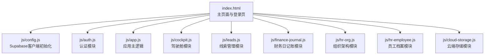
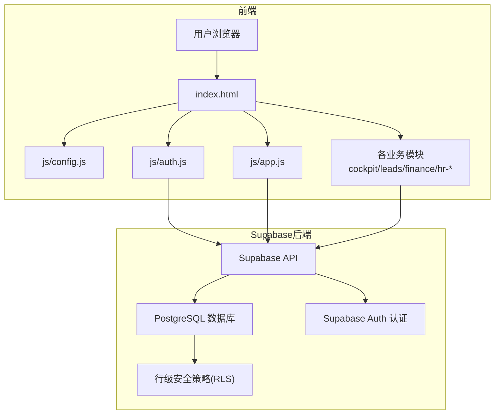
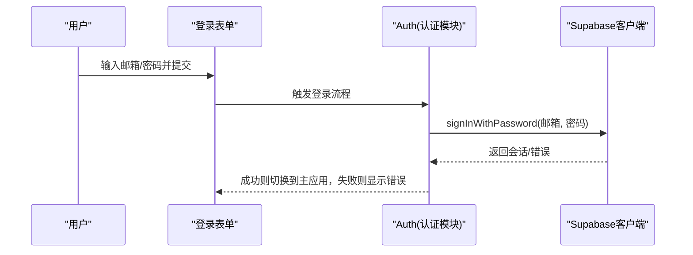
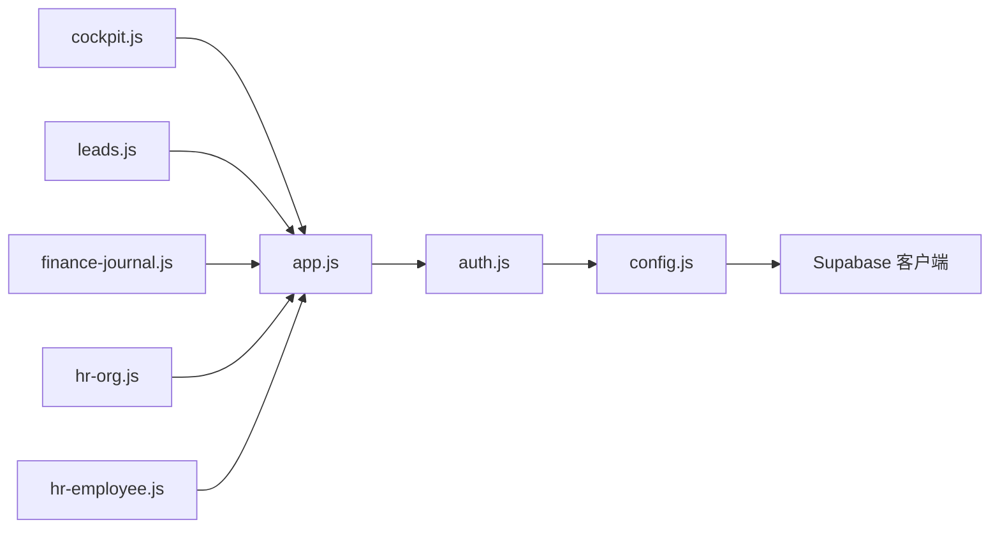

# API参考

<cite>
**本文引用的文件**
- [README.md](file://README.md)
- [DEPLOY.md](file://DEPLOY.md)
- [database-setup.sql](file://database-setup.sql)
- [index.html](file://index.html)
- [快速入门.md](file://快速入门.md)
- [js/config.js](file://js/config.js)
- [js/auth.js](file://js/auth.js)
- [js/cloud-storage.js](file://js/cloud-storage.js)
- [js/app.js](file://js/app.js)
- [js/cockpit.js](file://js/cockpit.js)
- [js/leads.js](file://js/leads.js)
- [js/finance-journal.js](file://js/finance-journal.js)
- [js/hr-org.js](file://js/hr-org.js)
- [js/hr-employee.js](file://js/hr-employee.js)
</cite>

## 目录
1. [简介](#简介)
2. [项目结构](#项目结构)
3. [核心组件](#核心组件)
4. [架构总览](#架构总览)
5. [详细组件分析](#详细组件分析)
6. [依赖关系分析](#依赖关系分析)
7. [性能考虑](#性能考虑)
8. [故障排查指南](#故障排查指南)
9. [结论](#结论)
10. [附录](#附录)

## 简介
本项目为“财务CRM管理系统（云端版）”，基于 Supabase 的 PostgreSQL 数据库与 Supabase Auth 认证能力，提供用户认证、云端数据存储、多设备同步等能力。前端采用纯 HTML/CSS/JavaScript 构建，通过 Supabase JS SDK 与后端进行交互。

- 技术栈要点
  - 前端：HTML5 + CSS3 + JavaScript
  - 后端：Supabase（PostgreSQL + Supabase Auth）
  - 部署：Vercel（推荐）

- 安全与合规
  - HTTPS 加密传输
  - 行级安全策略（RLS）保障用户数据隔离
  - JWT 会话认证

- 版本与路线
  - v2.0 云端版：引入用户认证、云端存储、多设备同步、数据安全隔离
  - v1.0 本地版：localStorage 存储，单设备使用

**章节来源**
- [README.md:1-135](file://README.md#L1-L135)

## 项目结构
项目采用“页面 + 模块化脚本”的组织方式：
- index.html：主页面与登录页，加载样式与各模块脚本
- js/config.js：Supabase 客户端初始化与配置
- js/auth.js：用户认证模块（登录/注册/登出/会话监听）
- js/cloud-storage.js：云端存储模块（预留）
- js/app.js：应用主逻辑（页面路由与导航）
- js/*.js：各功能模块（如驾驶舱、线索、财务日记账、人事等）

**图表来源**
- [index.html:1-381](file://index.html#L1-L381)
- [js/config.js:1-20](file://js/config.js#L1-L20)
- [js/auth.js:1-259](file://js/auth.js#L1-L259)
- [js/app.js:1-156](file://js/app.js#L1-L156)
- [js/cockpit.js:1-624](file://js/cockpit.js#L1-L624)
- [js/leads.js:1-679](file://js/leads.js#L1-L679)
- [js/finance-journal.js:1-800](file://js/finance-journal.js#L1-L800)
- [js/hr-org.js:1-293](file://js/hr-org.js#L1-L293)
- [js/hr-employee.js:1-628](file://js/hr-employee.js#L1-L628)
- [js/cloud-storage.js:1-9](file://js/cloud-storage.js#L1-L9)

**章节来源**
- [README.md:48-65](file://README.md#L48-L65)
- [index.html:1-381](file://index.html#L1-L381)

## 核心组件
- Supabase 客户端初始化
  - 通过 js/config.js 创建 Supabase 客户端实例，并注入全局 window.supabaseClient
  - 若 SDK 未加载或初始化失败，进入本地模式（部分功能受限）

- 认证模块（Auth）
  - 提供登录、注册、登出、会话监听、本地会话恢复
  - 登录成功后切换至主应用界面，失败时显示错误信息

- 应用主逻辑（App）
  - 负责页面路由与导航，根据菜单点击切换模块
  - 提供刷新仪表盘的全局回调

- 业务模块
  - 驾驶舱（Cockpit）：模拟数据与图表展示
  - 线索管理（Leads）：本地存储的线索 CRUD 与筛选
  - 财务日记账（FinanceJournal）：多表工作区、列定义、筛选/排序/搜索
  - 人事组织（HrOrg）：组织架构图与部门信息
  - 员工档案（HrEmployee）：员工信息的增删改查与导出

**章节来源**
- [js/config.js:1-20](file://js/config.js#L1-L20)
- [js/auth.js:1-259](file://js/auth.js#L1-L259)
- [js/app.js:1-156](file://js/app.js#L1-L156)
- [js/cockpit.js:1-624](file://js/cockpit.js#L1-L624)
- [js/leads.js:1-679](file://js/leads.js#L1-L679)
- [js/finance-journal.js:1-800](file://js/finance-journal.js#L1-L800)
- [js/hr-org.js:1-293](file://js/hr-org.js#L1-L293)
- [js/hr-employee.js:1-628](file://js/hr-employee.js#L1-L628)

## 架构总览
系统采用“浏览器直连 Supabase”的架构，前端通过 Supabase JS SDK 与后端交互，实现认证与数据读写。

**图表来源**
- [index.html:1-381](file://index.html#L1-L381)
- [js/config.js:1-20](file://js/config.js#L1-L20)
- [js/auth.js:1-259](file://js/auth.js#L1-L259)
- [js/app.js:1-156](file://js/app.js#L1-L156)
- [database-setup.sql:77-107](file://database-setup.sql#L77-L107)

**章节来源**
- [DEPLOY.md:3-8](file://DEPLOY.md#L3-L8)
- [README.md:88-94](file://README.md#L88-L94)

## 详细组件分析

### 认证模块（Auth）
- 功能概览
  - 初始化：绑定登录/注册/登出事件；检查本地会话；监听 Supabase 认证状态变化
  - 登录/注册：调用 Supabase Auth API
  - 登出：调用 Supabase Auth 退出
  - UI：登录页与主应用页切换；加载态提示；错误信息展示

- 关键流程（登录）

**图表来源**
- [js/auth.js:56-65](file://js/auth.js#L56-L65)
- [js/auth.js:108-137](file://js/auth.js#L108-L137)

- 错误处理
  - 登录失败：捕获错误并显示错误信息
  - 初始化失败：回退到登录页，避免阻塞

**章节来源**
- [js/auth.js:1-259](file://js/auth.js#L1-L259)

### Supabase 客户端初始化（Config）
- 功能概览
  - 从 js/config.js 读取 SUPABASE_URL 与 SUPABASE_ANON_KEY
  - 创建 Supabase 客户端实例并挂载到 window.supabaseClient
  - 若 SDK 未加载或初始化失败，进入本地模式

- 注意事项
  - 请务必在部署前替换为你的 Supabase 项目凭据
  - 本地开发时若无法加载 SDK，将提示使用本地模式

**章节来源**
- [js/config.js:1-20](file://js/config.js#L1-L20)
- [快速入门.md:10-18](file://快速入门.md#L10-L18)

### 应用主逻辑（App）
- 功能概览
  - 菜单点击事件：支持子菜单展开/收起与页面跳转
  - 页面切换：根据菜单 data-page 参数加载对应模块
  - 工具函数：金额格式化、刷新仪表盘回调

- 页面路由
  - home、cockpit、leads、orders、tasks、contracts、finance、hr、performance、messages、multitable、expense、system
  - 未实现模块显示占位页

**章节来源**
- [js/app.js:1-156](file://js/app.js#L1-L156)

### 驾驶舱模块（Cockpit）
- 功能概览
  - 模拟数据生成：客户、合同、财务、线索、发票
  - KPI 计算：本月营收、总客户数、合同总额、线索总数、转化率、净利润
  - 图表渲染：营收趋势、线索来源分布、状态分布、意向等级分布
  - 排行榜与待办提醒：客户营收排行、待跟进与合同到期提醒

- 数据来源
  - 本地 localStorage（模拟云端数据）

**章节来源**
- [js/cockpit.js:1-624](file://js/cockpit.js#L1-L624)

### 线索管理模块（Leads）
- 功能概览
  - 本地存储：localStorage 持久化
  - CRUD：新增、编辑、删除、批量导入
  - 公海与领取：线索自动回收、领取/退回公海
  - 跟进记录：添加跟进、下次联系时间、状态变更
  - 统计与筛选：我的线索/A级线索/今日待跟进/公海线索

- 数据模型（本地）
  - 字段：name、phone、wechat、source、intent_level、company、position、industry、region、follow_records、next_contact_date、notes、status、owner、is_public、created_at、last_follow_date、updated_at

**章节来源**
- [js/leads.js:1-679](file://js/leads.js#L1-L679)

### 财务日记账模块（FinanceJournal）
- 功能概览
  - 多表工作区：默认“公司日记账”表
  - 列定义：日期、类型、科目、金额、往来单位/人、账户、经办人、备注、审核状态
  - 工具栏：筛选、排序、隐藏字段、搜索
  - 表格：行内编辑、列宽拖拽、分组显示、新增行

- 数据处理
  - 筛选、排序、搜索均基于可见列
  - 统计：收入、支出、结余

**章节来源**
- [js/finance-journal.js:1-800](file://js/finance-journal.js#L1-L800)

### 人事组织模块（HrOrg）
- 功能概览
  - 组织架构图：根节点、部门、子团队层级
  - 员工花名册：按部门与状态筛选
  - 部门信息：部门负责人、团队数量、下设团队

**章节来源**
- [js/hr-org.js:1-293](file://js/hr-org.js#L1-L293)

### 员工档案模块（HrEmployee）
- 功能概览
  - 员工信息：基本信息、岗位信息、合同社保、教育背景
  - CRUD：新增、编辑、删除、查看详情
  - 视图：列表视图与卡片视图
  - 导出：CSV 导出

- 数据持久化
  - localStorage 持久化，内置默认数据集

**章节来源**
- [js/hr-employee.js:1-628](file://js/hr-employee.js#L1-L628)

## 依赖关系分析
- 模块耦合
  - app.js 作为入口，负责页面路由与模块切换
  - auth.js 依赖 Supabase 客户端，负责认证状态与 UI 切换
  - 各业务模块（cockpit/leads/finance/hr-*）均依赖 Supabase 客户端进行数据读写（当前以本地存储为主）

- 外部依赖
  - Supabase JS SDK（通过 CDN 引入）
  - Chart.js（用于驾驶舱图表）

**图表来源**
- [index.html:354-378](file://index.html#L354-L378)
- [js/config.js:1-20](file://js/config.js#L1-L20)
- [js/auth.js:1-259](file://js/auth.js#L1-L259)
- [js/app.js:1-156](file://js/app.js#L1-L156)
- [js/cockpit.js:1-624](file://js/cockpit.js#L1-L624)
- [js/leads.js:1-679](file://js/leads.js#L1-L679)
- [js/finance-journal.js:1-800](file://js/finance-journal.js#L1-L800)
- [js/hr-org.js:1-293](file://js/hr-org.js#L1-L293)
- [js/hr-employee.js:1-628](file://js/hr-employee.js#L1-L628)

**章节来源**
- [index.html:1-381](file://index.html#L1-L381)

## 性能考虑
- 前端性能
  - 模块按需加载：index.html 按需引入各模块脚本，减少首屏负担
  - 本地存储：业务模块（如线索、财务日记账、员工档案）使用 localStorage，降低网络请求
  - 图表渲染：驾驶舱使用 Chart.js，建议在大数据量时优化渲染频率

- 数据库性能
  - 已创建常用索引（如用户维度索引、财务类型/日期索引），提升查询效率
  - 行级安全策略（RLS）在查询时生效，建议合理设计索引与查询条件

- 网络与缓存
  - 建议开启浏览器缓存策略，减少重复资源加载
  - 对于频繁读取的静态资源，可结合 CDN 加速

[本节为通用指导，无需特定文件引用]

## 故障排查指南
- 常见问题
  - 注册时提示“邮箱已存在”：该邮箱已被注册，请直接登录或更换邮箱
  - 登录后页面空白：检查浏览器控制台是否有错误，通常为 config.js 配置错误
  - 添加数据时提示“未登录”：登录会话已过期，请退出重新登录
  - 能否多人协作：当前版本为单用户模式，每个账号数据独立

- 调试步骤
  - 打开浏览器开发者工具（F12），查看 Console 与 Network
  - 确认 Supabase URL 与 ANON KEY 配置正确
  - 检查 Supabase 项目状态与数据库初始化脚本执行情况

**章节来源**
- [DEPLOY.md:164-184](file://DEPLOY.md#L164-L184)

## 结论
本项目通过 Supabase 提供的认证与数据库能力，构建了一个具备用户认证、云端数据存储与多设备同步的财务 CRM 系统。前端模块化设计清晰，业务模块覆盖客户、合同、财务、发票、驾驶舱、人事等关键场景。当前版本以本地存储为主，未来可扩展为真正的云端 CRUD 接口，配合 Supabase 的 RLS 与认证体系，实现更完善的多用户协作与权限控制。

[本节为总结，无需特定文件引用]

## 附录

### Supabase 数据库与安全策略
- 数据库初始化脚本
  - 创建 customers、contracts、finances、invoices 表
  - 为各表创建用户维度索引
  - 启用行级安全策略（RLS），限制用户仅能访问自身数据

- RLS 策略
  - 客户、合同、财务、发票表均设置“user_data_policy_*”策略，FOR ALL USING(auth.uid() = user_id) WITH CHECK(auth.uid() = user_id)

**章节来源**
- [database-setup.sql:10-63](file://database-setup.sql#L10-L63)
- [database-setup.sql:66-76](file://database-setup.sql#L66-L76)
- [database-setup.sql:77-107](file://database-setup.sql#L77-L107)

### API 使用与集成指南
- 集成步骤
  1) 在 Supabase 控制台创建项目并获取 Project URL 与 anon key
  2) 在 js/config.js 中填入你的凭据
  3) 在 SQL Editor 中执行 database-setup.sql
  4) 在 Supabase Authentication 中启用邮箱认证
  5) 本地运行 index.html 或部署到 Vercel

- 部署建议
  - 推荐使用 Vercel 部署前端静态资源
  - 后端由 Supabase 托管，无需额外服务器

**章节来源**
- [快速入门.md:3-29](file://快速入门.md#L3-L29)
- [DEPLOY.md:9-45](file://DEPLOY.md#L9-L45)
- [DEPLOY.md:68-112](file://DEPLOY.md#L68-L112)

### 安全与访问控制
- 认证与授权
  - 使用 Supabase Auth 进行邮箱注册/登录
  - JWT 会话认证，自动维护登录状态
  - RLS 保障用户数据隔离，每个用户仅能访问自己的数据

- 最佳实践
  - 不要在前端暴露服务端密钥
  - 定期备份重要数据
  - 使用 HTTPS 传输，避免明文泄露

**章节来源**
- [README.md:88-94](file://README.md#L88-L94)

### 版本管理与向后兼容
- 版本历史
  - v2.0 云端版：引入用户认证、云端存储、多设备同步、数据安全隔离
  - v1.0 本地版：localStorage 存储，单设备使用

- 升级建议
  - 可在现有架构基础上扩展云端 CRUD 接口
  - 建议逐步引入 Supabase Realtime 或 Edge Functions 以增强实时性与业务逻辑

**章节来源**
- [README.md:101-122](file://README.md#L101-L122)