# 人事管理系统

<cite>
**本文档引用的文件**
- [README.md](file://README.md)
- [快速入门.md](file://快速入门.md)
- [DEPLOY.md](file://DEPLOY.md)
- [index.html](file://index.html)
- [database-setup.sql](file://database-setup.sql)
- [js/config.js](file://js/config.js)
- [js/auth.js](file://js/auth.js)
- [js/hr-org.js](file://js/hr-org.js)
- [js/hr-employee.js](file://js/hr-employee.js)
- [js/hr-recruit.js](file://js/hr-recruit.js)
- [js/hr-attendance.js](file://js/hr-attendance.js)
- [js/hr-department.js](file://js/hr-department.js)
- [js/hr-lifecycle.js](file://js/hr-lifecycle.js)
- [js/hr-salary.js](file://js/hr-salary.js)
- [js/hr-training.js](file://js/hr-training.js)
- [js/hr-planning.js](file://js/hr-planning.js)
- [js/hr-performance.js](file://js/hr-performance.js)
- [css/hr-style.css](file://css/hr-style.css)
</cite>

## 目录
1. [简介](#简介)
2. [项目结构](#项目结构)
3. [核心组件](#核心组件)
4. [架构概览](#架构概览)
5. [详细组件分析](#详细组件分析)
6. [依赖分析](#依赖分析)
7. [性能考虑](#性能考虑)
8. [故障排除指南](#故障排除指南)
9. [结论](#结论)
10. [附录](#附录)

## 简介

陈苗人事管理系统是一个基于Web的人力资源管理解决方案，采用现代化的技术栈构建。该系统提供了完整的人力资源管理功能，包括组织架构管理、员工档案管理、招聘管理、考勤管理、薪酬管理、员工入转调离管理、培训管理、人力资源规划和绩效管理等核心模块。

系统采用前后端分离架构，前端使用HTML5、CSS3和JavaScript，后端基于Supabase PostgreSQL数据库提供云端数据存储和用户认证服务。系统支持多设备数据同步，具备完善的数据安全隔离机制和权限控制功能。

**更新** 系统现已获得重大增强，新增了完整的考勤管理、部门管理、员工生命周期管理、薪酬管理、培训管理、人力资源规划和绩效管理等核心功能模块，形成了完整的人力资源管理生态系统。

## 项目结构

系统采用模块化的文件组织方式，主要分为以下几个层次：

```mermaid
graph TB
subgraph "前端层"
HTML[index.html 主页面]
CSS[css/ 样式文件]
JS[js/ JavaScript模块]
end
subgraph "核心模块"
AUTH[认证模块 auth.js]
CONFIG[配置模块 config.js]
HR_ORG[组织架构 hr-org.js]
HR_EMP[员工档案 hr-employee.js]
HR_RECRUIT[招聘管理 hr-recruit.js]
HR_ATT[考勤管理 hr-attendance.js]
HR_DEPT[部门管理 hr-department.js]
HR_LIFE[入转调离 hr-lifecycle.js]
HR_SAL[薪酬管理 hr-salary.js]
HR_TRAIN[培训管理 hr-training.js]
HR_PLAN[规划管理 hr-planning.js]
HR_PERF[绩效管理 hr-performance.js]
end
subgraph "样式层"
HR_STYLE[人事专用样式 hr-style.css]
MT_STYLE[多维表格样式 mt-style.css]
MAIN_STYLE[主样式 style.css]
end
HTML --> AUTH
HTML --> CONFIG
HTML --> HR_ORG
HTML --> HR_EMP
HTML --> HR_RECRUIT
HTML --> HR_ATT
HTML --> HR_DEPT
HTML --> HR_LIFE
HTML --> HR_SAL
HTML --> HR_TRAIN
HTML --> HR_PLAN
HTML --> HR_PERF
HTML --> HR_STYLE
HTML --> MT_STYLE
HTML --> MAIN_STYLE
```

**图表来源**
- [index.html:1-381](file://index.html#L1-L381)
- [js/config.js:1-20](file://js/config.js#L1-L20)

**章节来源**
- [README.md:48-65](file://README.md#L48-L65)
- [index.html:1-381](file://index.html#L1-L381)

## 核心组件

系统的核心组件围绕人力资源管理的九大模块构建，每个模块都实现了完整的CRUD功能和用户界面交互。

### 认证与配置模块

系统采用Supabase作为认证和数据存储后端，提供安全的用户认证机制和数据隔离功能。

### 人事管理模块集合

系统包含以下核心人事管理模块：
- **组织架构管理**：维护公司组织结构和部门信息
- **员工档案管理**：完整的员工信息管理，支持多种视图模式
- **招聘管理**：职位发布、候选人管理和招聘流程跟踪
- **考勤管理**：员工打卡记录、请假审批和考勤统计
- **部门管理**：完整的部门信息管理，支持树形结构展示
- **入转调离管理**：员工全生命周期管理
- **薪酬管理**：工资条生成、薪酬架构和成本分析
- **培训管理**：课程库、培训计划和学习记录管理
- **人力资源规划**：人力成本、人才盘点和组织健康分析
- **绩效管理**：OKR目标管理、360度评估和结果应用

**章节来源**
- [js/auth.js:1-259](file://js/auth.js#L1-L259)
- [js/config.js:1-20](file://js/config.js#L1-L20)

## 架构概览

系统采用现代化的Web架构设计，结合了客户端存储和云端数据库的优势：

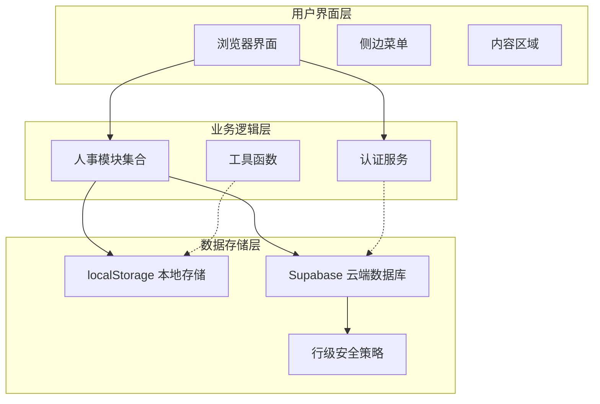

**图表来源**
- [index.html:144-352](file://index.html#L144-L352)
- [js/auth.js:37-48](file://js/auth.js#L37-L48)

系统架构特点：
- **双存储模式**：本地localStorage用于演示和离线功能，Supabase用于生产环境数据持久化
- **安全隔离**：通过Supabase的行级安全策略确保用户数据完全隔离
- **响应式设计**：支持桌面和移动设备访问
- **模块化开发**：每个功能模块独立封装，便于维护和扩展

**章节来源**
- [README.md:88-94](file://README.md#L88-L94)
- [js/auth.js:24-54](file://js/auth.js#L24-L54)

## 详细组件分析

### 组织架构管理模块

组织架构管理模块提供了公司组织结构的可视化展示和管理功能：

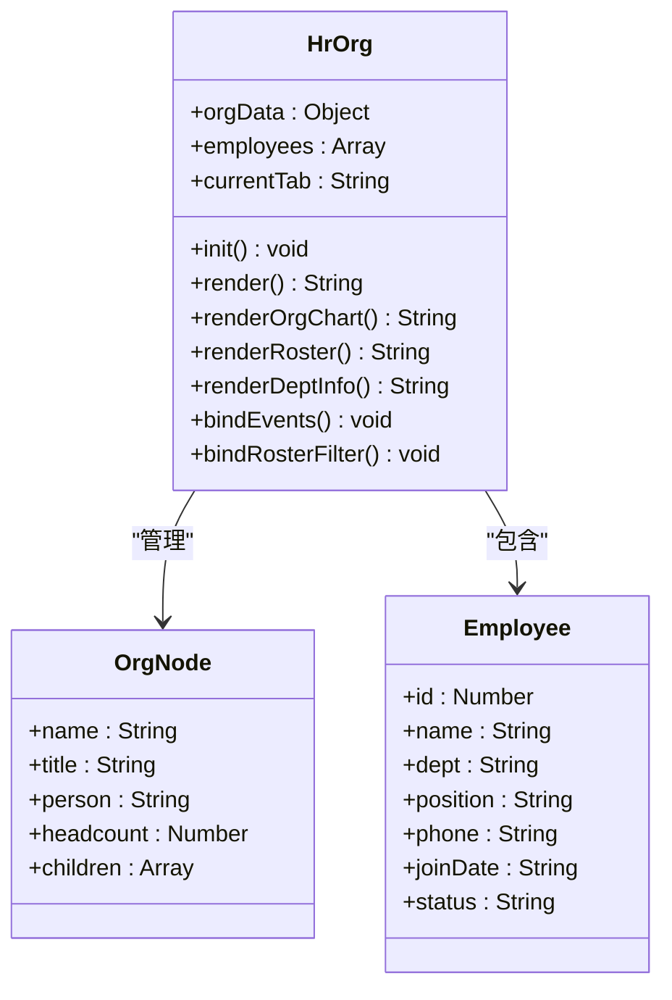

**图表来源**
- [js/hr-org.js:3-293](file://js/hr-org.js#L3-L293)

模块功能特性：
- **组织架构图**：以树形结构展示公司层级关系
- **员工花名册**：支持搜索和筛选功能
- **部门信息**：展示各部门详细信息和人员配置
- **动态切换**：支持三种视图模式的无缝切换

**章节来源**
- [js/hr-org.js:109-293](file://js/hr-org.js#L109-L293)

### 员工档案管理模块

员工档案管理模块实现了完整的员工信息生命周期管理：

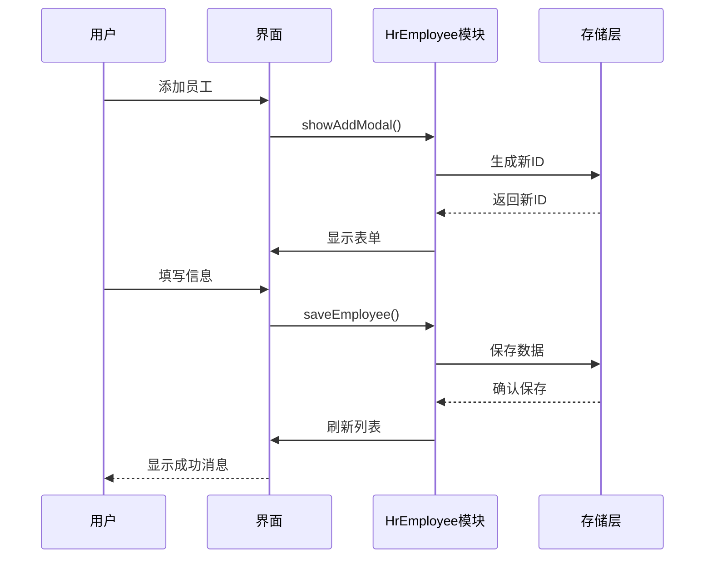

**图表来源**
- [js/hr-employee.js:245-445](file://js/hr-employee.js#L245-L445)

核心功能包括：
- **数据持久化**：支持localStorage和云端数据存储
- **多种视图**：列表视图和卡片视图自由切换
- **高级筛选**：支持姓名、部门、状态等多维度筛选
- **数据导出**：支持CSV格式数据导出

**章节来源**
- [js/hr-employee.js:52-628](file://js/hr-employee.js#L52-L628)

### 招聘管理模块

招聘管理模块提供了完整的招聘流程管理：

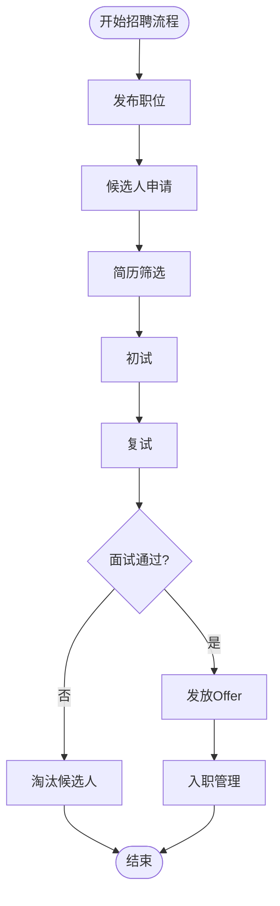

**图表来源**
- [js/hr-recruit.js:542-572](file://js/hr-recruit.js#L542-L572)

模块特色功能：
- **招聘漏斗**：可视化展示招聘流程各阶段转化率
- **候选人管理**：完整的候选人信息跟踪和状态管理
- **进度统计**：实时统计招聘效果和效率指标
- **流程自动化**：支持候选人状态自动推进

**章节来源**
- [js/hr-recruit.js:60-657](file://js/hr-recruit.js#L60-L657)

### 考勤管理模块

考勤管理模块模拟了真实的考勤系统功能：

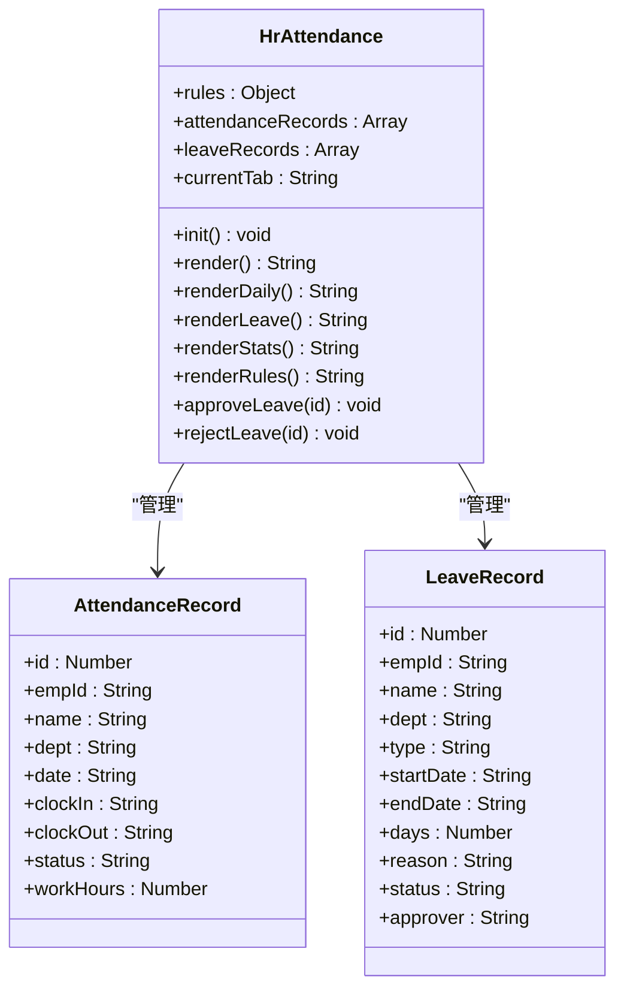

**图表来源**
- [js/hr-attendance.js:3-334](file://js/hr-attendance.js#L3-L334)

功能特性：
- **考勤统计**：实时统计正常出勤、迟到、请假等指标
- **请假管理**：支持多种假期类型的申请和审批
- **部门对比**：提供部门间的考勤数据对比分析
- **规则配置**：灵活的考勤规则设置和管理

**章节来源**
- [js/hr-attendance.js:49-334](file://js/hr-attendance.js#L49-L334)

### 部门管理模块

部门管理模块提供了完整的部门信息管理功能：

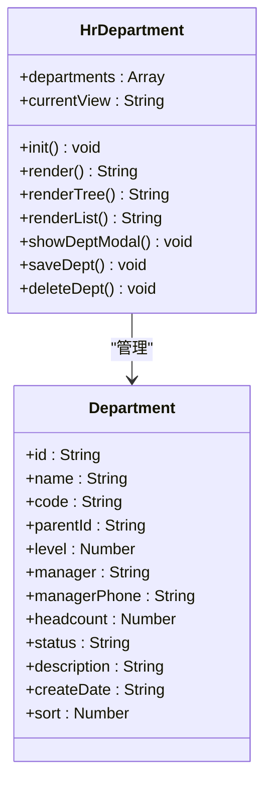

**图表来源**
- [js/hr-department.js:1-426](file://js/hr-department.js#L1-L426)

模块功能：
- **树形展示**：支持树形结构和列表两种视图模式
- **部门层级**：支持多层级部门结构管理
- **状态管理**：支持部门启用/停用状态控制
- **统计分析**：提供部门数量、编制人数等统计信息

**章节来源**
- [js/hr-department.js:19-426](file://js/hr-department.js#L19-L426)

### 入转调离管理模块

入转调离管理模块覆盖了员工全生命周期的各个阶段：

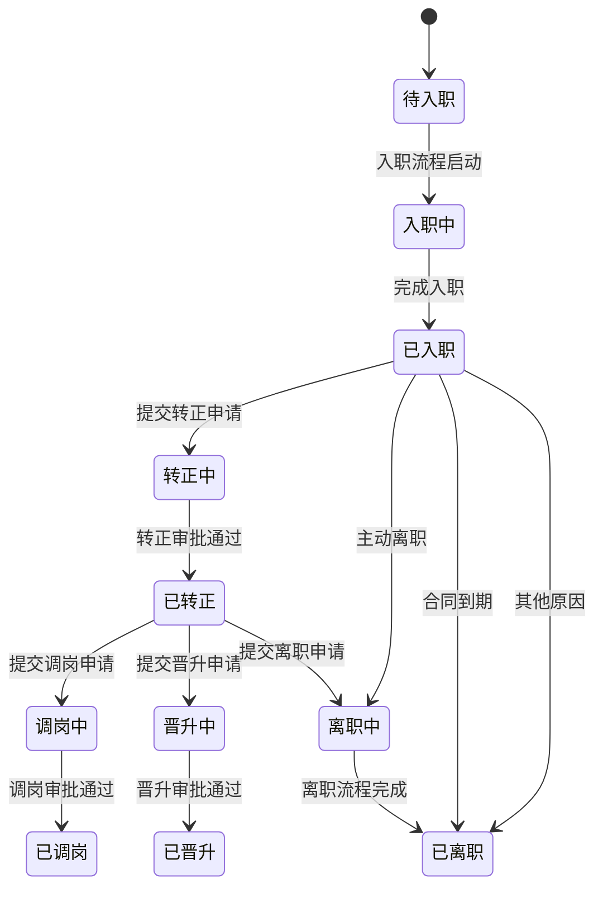

**图表来源**
- [js/hr-lifecycle.js:102-239](file://js/hr-lifecycle.js#L102-L239)

管理范围：
- **入职管理**：新员工入职流程和准备工作
- **转正管理**：试用期转正评估和审批
- **调岗/晋升**：员工内部调动和职业发展
- **离职管理**：员工离职流程和交接管理

**章节来源**
- [js/hr-lifecycle.js:40-256](file://js/hr-lifecycle.js#L40-L256)

### 薪酬管理模块

薪酬管理模块提供了专业的薪酬计算和分析功能：

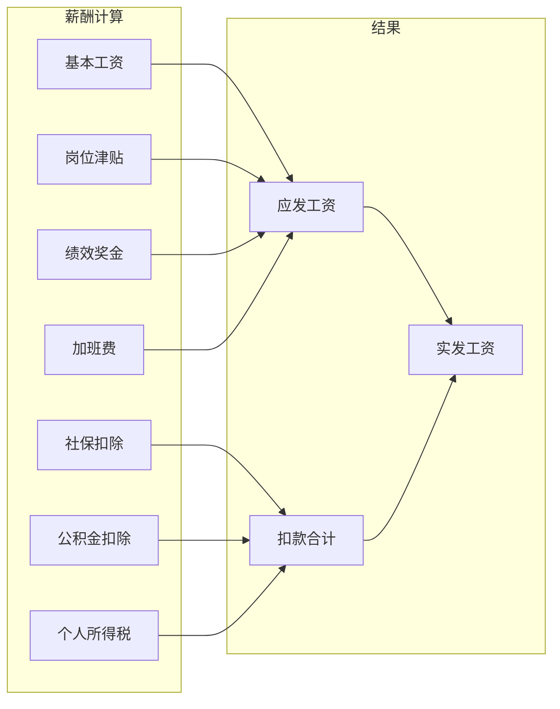

**图表来源**
- [js/hr-salary.js:45-52](file://js/hr-salary.js#L45-L52)

模块功能：
- **工资条生成**：自动生成详细的工资条明细
- **薪酬架构**：支持多层级的薪酬体系管理
- **成本分析**：提供部门人力成本的深度分析
- **统计报表**：生成各类薪酬相关的统计报表

**章节来源**
- [js/hr-salary.js:54-291](file://js/hr-salary.js#L54-L291)

### 培训管理模块

培训管理模块提供了完整的培训与发展功能：

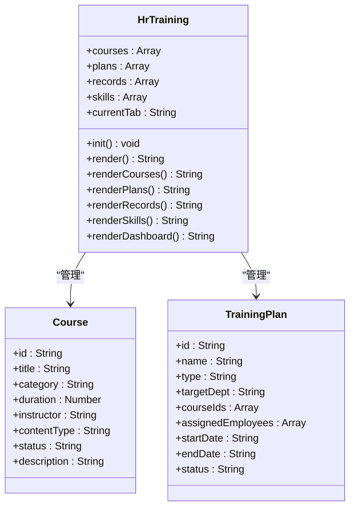

**图表来源**
- [js/hr-training.js:1-436](file://js/hr-training.js#L1-L436)

模块功能：
- **课程库管理**：课程分类、时长、讲师等信息管理
- **培训计划**：部门培训、新员工培训、晋升培训等计划制定
- **学习记录**：员工学习进度、成绩、证书管理
- **技能矩阵**：员工技能评估和发展路径规划
- **培训看板**：培训完成率、部门学时统计等可视化分析

**章节来源**
- [js/hr-training.js:47-436](file://js/hr-training.js#L47-L436)

### 人力资源规划模块

人力资源规划模块提供了全面的人力资源规划和分析功能：

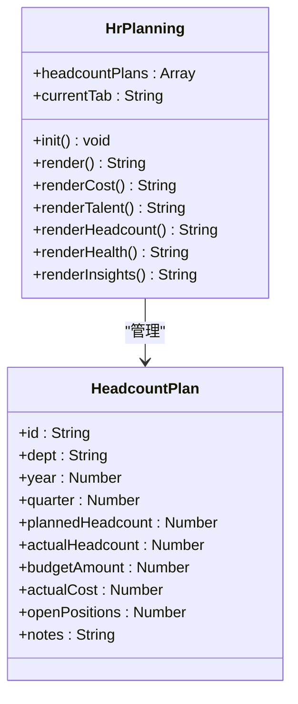

**图表来源**
- [js/hr-planning.js:1-428](file://js/hr-planning.js#L1-L428)

模块功能：
- **人力成本分析**：部门预算vs实际成本对比分析
- **人才盘点**：基于九宫格的人才识别和梯队分析
- **编制规划**：部门编制、实际人数、缺编情况管理
- **组织健康**：性别、学历、司龄、年龄等组织结构分析
- **智能洞察**：离职风险预警、招聘需求预测等AI分析

**章节来源**
- [js/hr-planning.js:17-428](file://js/hr-planning.js#L17-L428)

### 绩效管理模块

绩效管理模块实现了完整的OKR目标管理和360度评估体系：

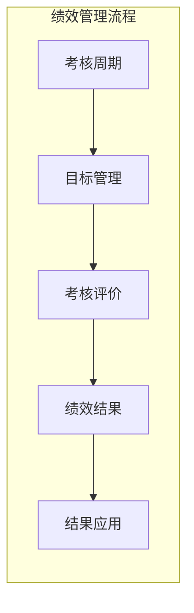

**图表来源**
- [js/hr-performance.js:9-568](file://js/hr-performance.js#L9-L568)

模块功能：
- **考核周期**：季度、半年度、年度考核周期管理
- **目标管理**：OKR目标体系，支持公司、部门、个人三级目标
- **考核评价**：自评+上级评的360度评估体系
- **绩效结果**：综合评分、等级、潜力评估
- **结果应用**：调薪建议、培训推荐、人才发展路径

**章节来源**
- [js/hr-performance.js:57-568](file://js/hr-performance.js#L57-L568)

## 依赖分析

系统采用模块化设计，各组件之间保持松耦合的关系：

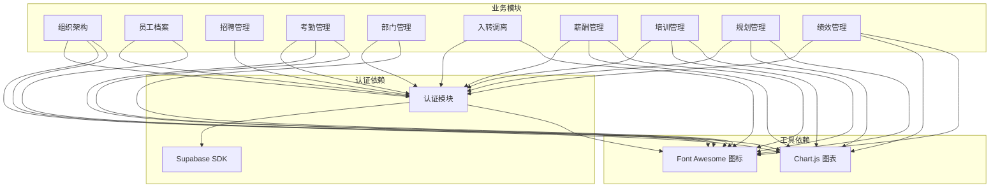

**图表来源**
- [index.html:12-11](file://index.html#L12-L11)
- [index.html:354-378](file://index.html#L354-L378)

依赖关系特点：
- **认证统一入口**：所有业务模块都依赖认证模块进行用户身份验证
- **数据存储抽象**：通过Supabase SDK实现数据访问的统一接口
- **样式模块化**：采用CSS模块化设计，避免样式冲突
- **第三方库集成**：合理使用Chart.js等第三方库增强用户体验

**章节来源**
- [js/auth.js:24-54](file://js/auth.js#L24-L54)
- [index.html:12-11](file://index.html#L12-L11)

## 性能考虑

系统在设计时充分考虑了性能优化和用户体验：

### 数据加载优化
- **懒加载策略**：仅在用户访问相应模块时才加载对应JavaScript文件
- **缓存机制**：利用localStorage缓存常用数据，减少重复请求
- **虚拟滚动**：对于大量数据的表格采用虚拟滚动技术提升渲染性能

### 网络性能
- **CDN加速**：使用CDN加载第三方库，提升资源加载速度
- **压缩优化**：CSS和JavaScript文件经过压缩处理
- **按需加载**：图表库等大型库只在需要时加载

### 用户体验优化
- **响应式设计**：适配不同屏幕尺寸的设备
- **加载指示器**：提供清晰的加载状态反馈
- **错误处理**：完善的错误捕获和用户友好的错误提示

## 故障排除指南

### 常见问题及解决方案

#### 认证问题
**问题**：登录后页面空白
**原因**：Supabase配置错误或网络连接问题
**解决**：检查config.js中的URL和Key配置，确认网络连接正常

**问题**：注册时提示"Email already exists"
**解决**：使用未注册的邮箱地址，或直接登录现有账户

#### 数据同步问题
**问题**：刷新页面后数据丢失
**解决**：确认Supabase配置正确，检查浏览器的localStorage权限

#### 功能异常
**问题**：某些模块功能不可用
**解决**：检查浏览器控制台是否有JavaScript错误，确认所有必需的JavaScript文件都已正确加载

### 调试技巧
- 使用浏览器开发者工具检查网络请求和JavaScript错误
- 查看Supabase Dashboard确认数据存储状态
- 检查localStorage中的数据完整性
- 验证认证状态和会话有效性

**章节来源**
- [DEPLOY.md:164-184](file://DEPLOY.md#L164-L184)
- [js/auth.js:128-137](file://js/auth.js#L128-L137)

## 结论

陈苗人事管理系统是一个功能完整、架构清晰的人力资源管理解决方案。系统采用现代化的技术栈，提供了从组织架构到员工全生命周期管理的完整功能覆盖。

系统的主要优势包括：
- **功能完整性**：涵盖了HR管理的所有核心功能模块
- **用户体验**：直观的界面设计和流畅的交互体验
- **安全性**：基于Supabase的行级安全策略确保数据隔离
- **可扩展性**：模块化设计便于功能扩展和定制

对于HR管理人员和系统管理员来说，该系统提供了高效的工具来管理企业的人力资源，提升了HR工作的效率和准确性。

**更新** 通过本次重大功能增强，系统现已形成完整的人力资源管理生态系统，涵盖了从基础的人事管理到高级的人力资源规划和绩效管理，为企业提供了一站式的数字化人力资源解决方案。

## 附录

### 部署指南

系统支持多种部署方式，推荐使用Vercel进行静态网站托管：

1. **创建Supabase项目**：注册并创建新的Supabase项目
2. **配置数据库**：执行database-setup.sql初始化数据库结构
3. **修改配置**：更新js/config.js中的Supabase凭据
4. **部署上线**：使用Vercel或其他静态托管服务部署

### 最佳实践

- **数据备份**：定期备份重要的人事数据
- **权限管理**：合理设置用户权限，确保数据安全
- **流程规范**：建立标准化的HR管理流程
- **定期维护**：定期清理过期数据，优化系统性能

### 技术支持

系统基于开源技术构建，社区支持完善。遇到技术问题时，可以参考官方文档或寻求社区帮助。

**章节来源**
- [README.md:1-47](file://README.md#L1-L47)
- [DEPLOY.md:1-163](file://DEPLOY.md#L1-L163)