# 员工档案管理

<cite>
**本文档引用的文件**
- [README.md](file://README.md)
- [index.html](file://index.html)
- [js/hr-employee.js](file://js/hr-employee.js)
- [js/hr-org.js](file://js/hr-org.js)
- [js/hr-lifecycle.js](file://js/hr-lifecycle.js)
- [js/hr-recruit.js](file://js/hr-recruit.js)
- [js/hr-attendance.js](file://js/hr-attendance.js)
- [js/hr-salary.js](file://js/hr-salary.js)
- [js/auth.js](file://js/auth.js)
- [js/cloud-storage.js](file://js/cloud-storage.js)
- [database-setup.sql](file://database-setup.sql)
</cite>

## 目录
1. [项目概述](#项目概述)
2. [系统架构](#系统架构)
3. [核心组件](#核心组件)
4. [员工档案管理模块详解](#员工档案管理模块详解)
5. [组织架构管理](#组织架构管理)
6. [员工生命周期管理](#员工生命周期管理)
7. [招聘管理](#招聘管理)
8. [考勤管理](#考勤管理)
9. [薪酬管理](#薪酬管理)
10. [数据模型设计](#数据模型设计)
11. [业务流程](#业务流程)
12. [安全与权限](#安全与权限)
13. [性能考虑](#性能考虑)
14. [故障排除指南](#故障排除指南)
15. [结论](#结论)

## 项目概述

浙杭企服财务CRM管理系统是一个功能完整的云端人力资源管理解决方案。该系统基于现代Web技术栈构建，采用前后端分离架构，支持多设备同步和云端数据存储。

### 系统特性

- **云端数据存储**：基于Supabase PostgreSQL数据库，支持数据持久化和多设备同步
- **用户认证**：集成JWT会话认证，支持邮箱注册和登录
- **数据安全**：实施行级安全策略(RLS)，确保用户数据完全隔离
- **响应式设计**：支持桌面和移动设备访问
- **模块化架构**：采用模块化设计，便于功能扩展和维护

### 技术栈

- **前端**：HTML5 + CSS3 + JavaScript (ES6+)
- **后端**：Supabase PostgreSQL
- **认证**：Supabase Auth
- **部署**：Vercel (推荐)

## 系统架构

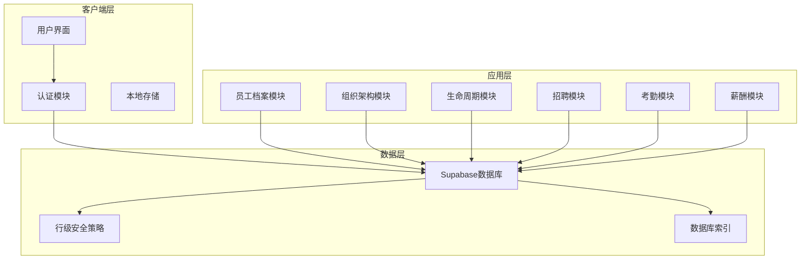

**图表来源**
- [index.html:144-352](file://index.html#L144-L352)
- [js/auth.js:1-259](file://js/auth.js#L1-L259)

### 架构特点

1. **分层架构**：清晰的职责分离，便于维护和扩展
2. **模块化设计**：每个HR功能模块独立封装，降低耦合度
3. **数据持久化**：支持本地存储和云端同步双重保障
4. **安全隔离**：通过RLS确保数据安全和用户隔离

## 核心组件

### 员工档案管理核心组件

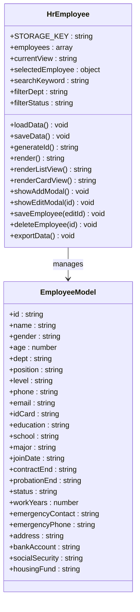

**图表来源**
- [js/hr-employee.js:3-628](file://js/hr-employee.js#L3-L628)

### 模块间关系

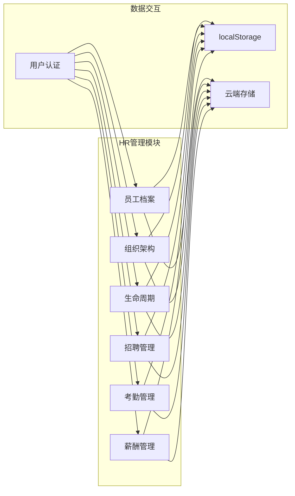

**图表来源**
- [js/hr-employee.js:31-628](file://js/hr-employee.js#L31-L628)
- [js/hr-org.js:3-293](file://js/hr-org.js#L3-L293)
- [js/hr-lifecycle.js:3-800](file://js/hr-lifecycle.js#L3-L800)

## 员工档案管理模块详解

### 数据模型设计

员工档案模块采用JSON对象结构存储员工信息，支持完整的CRUD操作：

#### 基本信息字段

| 字段名 | 类型 | 必填 | 描述 | 示例 |
|--------|------|------|------|------|
| id | string | 是 | 员工工号 | EMP001 |
| name | string | 是 | 员工姓名 | 张三 |
| gender | string | 是 | 性别 | 男/女 |
| age | number | 否 | 年龄 | 25 |
| phone | string | 是 | 手机号码 | 13800001001 |
| email | string | 否 | 邮箱地址 | zhangsan@company.com |
| idCard | string | 否 | 身份证号 | 330102199001011001 |
| address | string | 否 | 住址 | 杭州市西湖区 |

#### 岗位信息字段

| 字段名 | 类型 | 必填 | 描述 | 示例 |
|--------|------|------|------|------|
| dept | string | 是 | 所属部门 | 顾问部 |
| position | string | 是 | 职位 | 部门经理 |
| level | string | 否 | 职级 | L7 |
| joinDate | string | 是 | 入职日期 | 2025-01-01 |
| probationEnd | string | 否 | 试用期截止 | 2025-04-01 |
| contractEnd | string | 否 | 合同到期日 | 2028-01-01 |
| status | string | 否 | 员工状态 | 在职/试用期/已离职 |

#### 教育背景字段

| 字段名 | 类型 | 必填 | 描述 | 示例 |
|--------|------|------|------|------|
| education | string | 否 | 学历 | 本科/硕士 |
| school | string | 否 | 毕业院校 | 浙江大学 |
| major | string | 否 | 专业 | 工商管理 |

#### 财务信息字段

| 字段名 | 类型 | 必填 | 描述 | 示例 |
|--------|------|------|------|------|
| bankAccount | string | 否 | 银行卡号 | 6222021234568001 |
| socialSecurity | string | 否 | 社保状态 | 已缴纳/未缴纳 |
| housingFund | string | 否 | 公积金状态 | 已缴纳/未缴纳 |

### 核心功能实现

#### CRUD操作流程

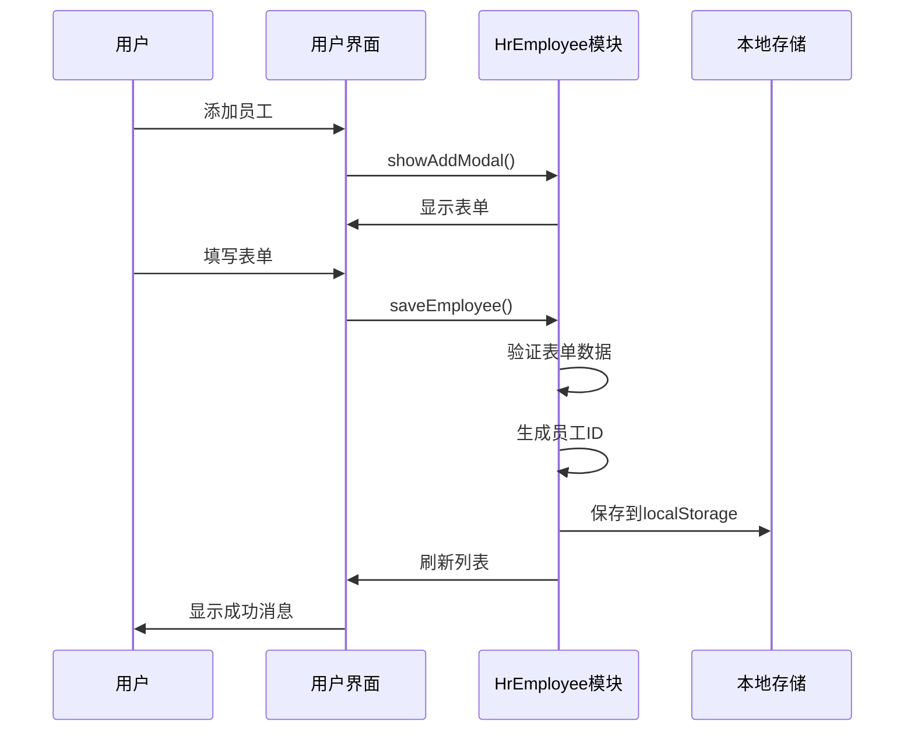

**图表来源**
- [js/hr-employee.js:244-445](file://js/hr-employee.js#L244-L445)

#### 数据验证规则

模块实现了多层次的数据验证：

1. **必填字段验证**：姓名、性别、手机号、部门、职位、入职日期等
2. **格式验证**：手机号格式、邮箱格式、日期格式
3. **业务逻辑验证**：年龄范围(18-65)、工龄计算
4. **唯一性验证**：员工工号自动生成且唯一

#### 搜索和过滤功能

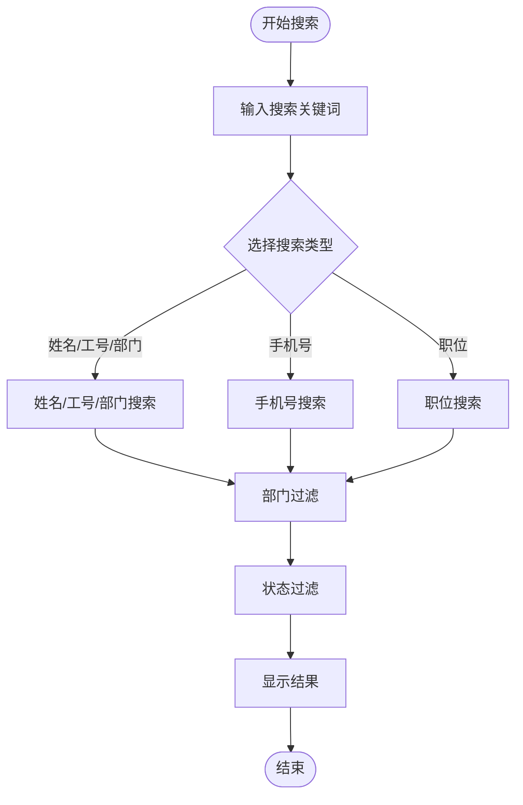

**图表来源**
- [js/hr-employee.js:230-242](file://js/hr-employee.js#L230-L242)

### 视图模式

系统支持两种视图模式：

#### 列表视图
- 适合批量查看和管理
- 支持排序和筛选
- 显示关键信息摘要

#### 卡片视图
- 适合快速浏览
- 展示员工头像和基本信息
- 支持快速查看详情

### 数据导出功能

员工档案支持CSV格式导出，包含以下字段：
- 工号、姓名、性别、年龄
- 部门、职位、职级
- 手机、邮箱、入职日期
- 合同到期、状态

**章节来源**
- [js/hr-employee.js:1-628](file://js/hr-employee.js#L1-L628)

## 组织架构管理

### 组织架构展示

组织架构模块提供了三种展示方式：

#### 组织架构图
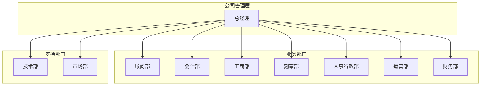

**图表来源**
- [js/hr-org.js:4-74](file://js/hr-org.js#L4-L74)

#### 员工花名册
- 按部门展示员工信息
- 支持搜索和筛选
- 显示联系方式和入职日期

#### 部门信息
- 展示部门负责人
- 显示下设团队
- 统计部门人数

**章节来源**
- [js/hr-org.js:1-293](file://js/hr-org.js#L1-L293)

## 员工生命周期管理

### 生命周期流程

员工生命周期管理涵盖了从入职到离职的完整流程：

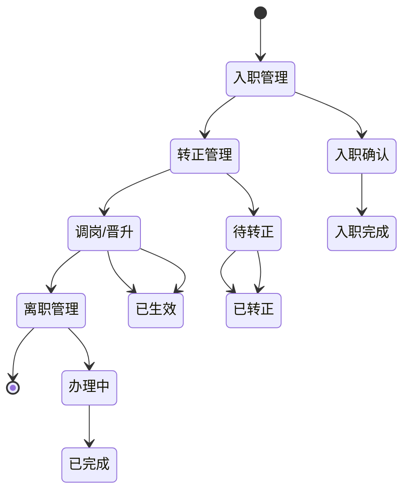

**图表来源**
- [js/hr-lifecycle.js:14-34](file://js/hr-lifecycle.js#L14-L34)

### 入职管理

#### 入职流程
1. **候选人登记**：记录候选人基本信息和应聘职位
2. **入职准备**：准备入职材料和工作安排
3. **入职确认**：确认入职时间和工作内容
4. **入职完成**：正式成为公司员工

#### 入职清单管理
- 劳动合同签订
- 入职体检
- 工牌制作
- 电脑配置
- 账号开通

### 转正管理

#### 转正流程
1. **试用期评估**：评估员工工作表现
2. **转正申请**：员工提交转正申请
3. **审批流程**：上级领导审批
4. **转正完成**：正式转为正式员工

#### 评估标准
- 工作能力评估
- 业务技能考核
- 团队协作表现
- 工作态度评价

### 调岗/晋升管理

#### 变动类型
- **调岗**：部门或职位调整
- **晋升**：职位级别提升
- **降级**：职位级别下调

#### 管理流程
1. **申请提交**：员工或上级提交申请
2. **原因说明**：详细说明变动原因
3. **审批流程**：相关领导审批
4. **生效执行**：正式执行变动

### 离职管理

#### 离职类型
- **主动离职**：员工主动辞职
- **合同到期**：劳动合同期满
- **辞退**：公司解雇员工
- **协商解除**：双方协商解除

#### 离职流程
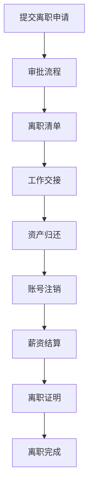

**图表来源**
- [js/hr-lifecycle.js:30-34](file://js/hr-lifecycle.js#L30-L34)

**章节来源**
- [js/hr-lifecycle.js:1-800](file://js/hr-lifecycle.js#L1-L800)

## 招聘管理

### 招聘流程

招聘管理模块实现了完整的招聘流程：

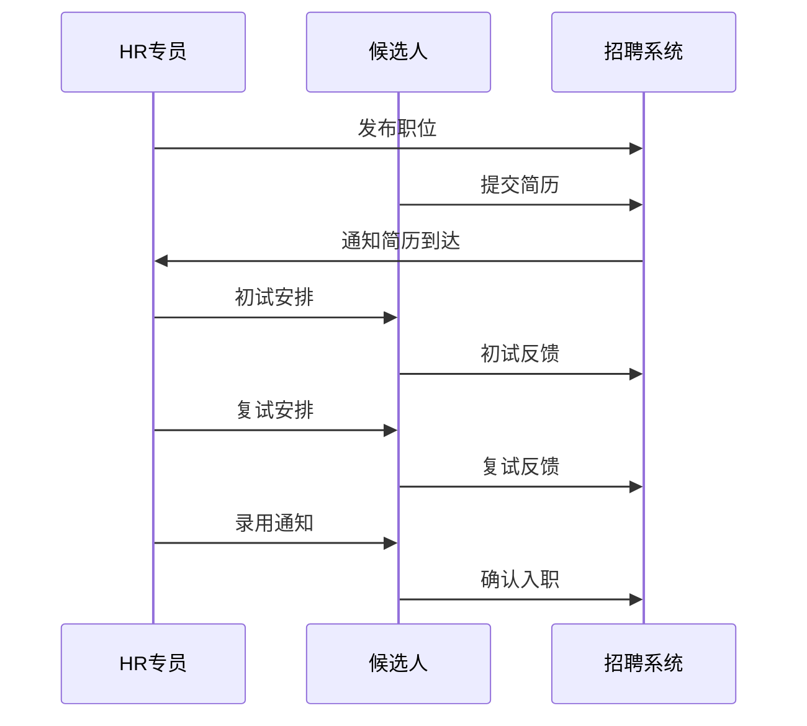

**图表来源**
- [js/hr-recruit.js:11-28](file://js/hr-recruit.js#L11-L28)

### 职位管理

#### 职位信息
- **职位名称**：明确的职位描述
- **所属部门**：归属的具体部门
- **工作类型**：全职/兼职/实习
- **薪资范围**：基本工资区间
- **招聘人数**：需要招聘的名额
- **紧急程度**：普通/急聘
- **任职要求**：学历、经验等要求

#### 职位状态
- **招聘中**：正在招聘
- **暂停**：暂时停止招聘

### 候选人管理

#### 候选人信息
- **基本信息**：姓名、联系方式
- **教育背景**：学历、学校、专业
- **工作经验**：相关工作经历
- **当前阶段**：简历筛选/面试等

#### 面试流程
1. **简历筛选**：初步筛选合适候选人
2. **初试**：第一轮面试
3. **复试**：第二轮面试
4. **面试通过**：通过面试
5. **待入职**：等待入职
6. **已入职**：正式入职
7. **已淘汰**：被淘汰

### 招聘漏斗分析

系统提供招聘漏斗可视化分析：

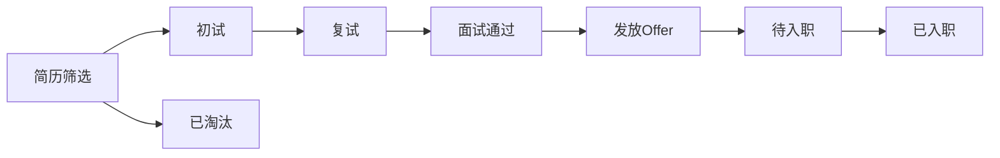

**图表来源**
- [js/hr-recruit.js:238-282](file://js/hr-recruit.js#L238-L282)

**章节来源**
- [js/hr-recruit.js:1-657](file://js/hr-recruit.js#L1-L657)

## 考勤管理

### 考勤规则

系统支持灵活的考勤规则配置：

#### 工作时间规则
- **上班时间**：默认09:00
- **下班时间**：默认18:00
- **午休时间**：12:00-13:30
- **加班起算**：19:00后算加班

#### 容忍时间
- **迟到容忍**：默认10分钟
- **早退容忍**：默认10分钟

#### 工作日设置
- **工作日**：周一至周五
- **支持自定义**：可根据需要调整

### 考勤状态

#### 正常出勤
- **正常**：按时上下班
- **迟到**：超过规定上班时间
- **早退**：早于规定下班时间
- **外勤**：外出办公
- **请假**：各类假期

#### 请假类型
- **事假**：因私事请假
- **病假**：因疾病请假
- **年假**：带薪年假
- **婚假**：婚假
- **产假**：产假
- **陪产假**：陪产假
- **丧假**：丧假
- **调休**：调休

### 考勤统计

系统提供多维度的考勤统计分析：

#### 部门统计
- **出勤率**：正常出勤天数占比
- **迟到次数**：迟到统计
- **请假天数**：各类假期统计

#### 个人统计
- **月度考勤**：个人月度出勤记录
- **出勤率**：个人出勤统计
- **异常情况**：迟到、早退等统计

**章节来源**
- [js/hr-attendance.js:1-863](file://js/hr-attendance.js#L1-L863)

## 薪酬管理

### 薪酬结构

#### 职级体系
系统采用10级职级体系，从L3到L10：

| 职级 | 级别名称 | 基本工资范围 | 岗位津贴范围 |
|------|----------|-------------|-------------|
| L3 | 初级 | 4,000-5,000 | 200-500 |
| L4 | 中级 | 5,000-7,000 | 500-1,000 |
| L5 | 高级 | 7,000-9,000 | 800-1,500 |
| L6 | 资深 | 9,000-12,000 | 1,000-2,000 |
| L7 | 经理 | 12,000-16,000 | 1,500-2,500 |
| L8 | 总监 | 16,000-22,000 | 2,000-3,500 |
| L10 | 总经理 | 30,000-50,000 | 3,000-5,000 |

#### 薪酬构成
- **基本工资**：占40%
- **岗位津贴**：占15%
- **绩效奖金**：占25%
- **补贴**：餐补+交通补贴+加班费(10%)
- **扣除项**：五险一金(10%)

### 工资条管理

#### 工资条字段
- **基本信息**：姓名、部门、职位、职级
- **收入项**：基本工资、岗位津贴、绩效奖金、加班费、补贴
- **扣除项**：五险一金、个人所得税、其他扣除
- **实发工资**：最终到账金额

#### 工资计算公式
```
应发工资 = 基本工资 + 岗位津贴 + 绩效奖金 + 加班费 + 补贴
实发工资 = 应发工资 - 五险一金 - 个人所得税 - 其他扣除
```

### 人力成本分析

系统提供多维度的人力成本分析：

#### 成本构成
- **直接人工成本**：基本工资+绩效奖金
- **间接人工成本**：五险一金
- **管理费用**：HR管理成本

#### 部门对比
- **成本占比**：各部门人工成本占比
- **人均成本**：部门平均人工成本
- **效率分析**：人工成本与产出比

**章节来源**
- [js/hr-salary.js:1-798](file://js/hr-salary.js#L1-L798)

## 数据模型设计

### 数据库设计

系统采用关系型数据库设计，支持完整的HR管理功能：

#### 核心表结构

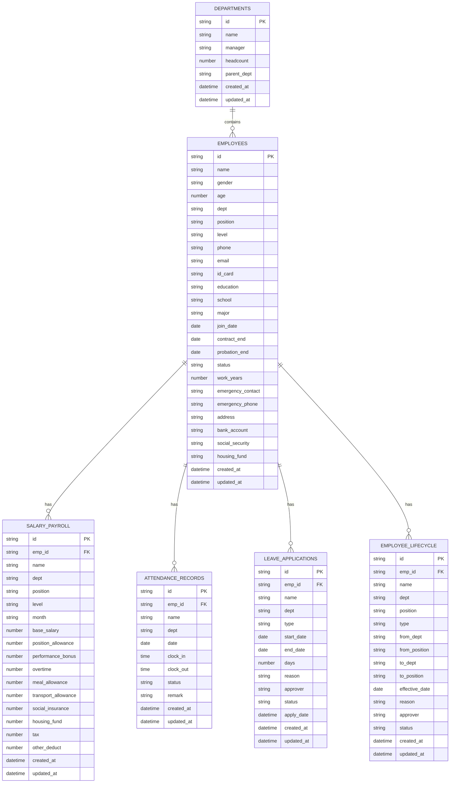

**图表来源**
- [database-setup.sql:11-63](file://database-setup.sql#L11-L63)

### 数据验证规则

#### 字段约束
- **必填字段**：姓名、性别、手机号、部门、职位、入职日期
- **格式约束**：手机号格式、邮箱格式、日期格式
- **数值范围**：年龄(18-65)、薪资(≥0)
- **枚举值**：性别(男/女)、状态(在职/试用期/已离职)

#### 业务规则
- **唯一性**：员工工号唯一
- **关联性**：部门与员工关联
- **时效性**：合同到期日必须晚于入职日期

### 数据安全设计

#### 行级安全策略
- **用户隔离**：每个用户只能访问自己的数据
- **数据加密**：敏感信息加密存储
- **访问控制**：基于角色的权限控制

#### 数据备份
- **自动备份**：定期自动备份数据库
- **增量备份**：支持增量备份策略
- **恢复机制**：支持快速数据恢复

**章节来源**
- [database-setup.sql:78-140](file://database-setup.sql#L78-L140)

## 业务流程

### 员工入职流程

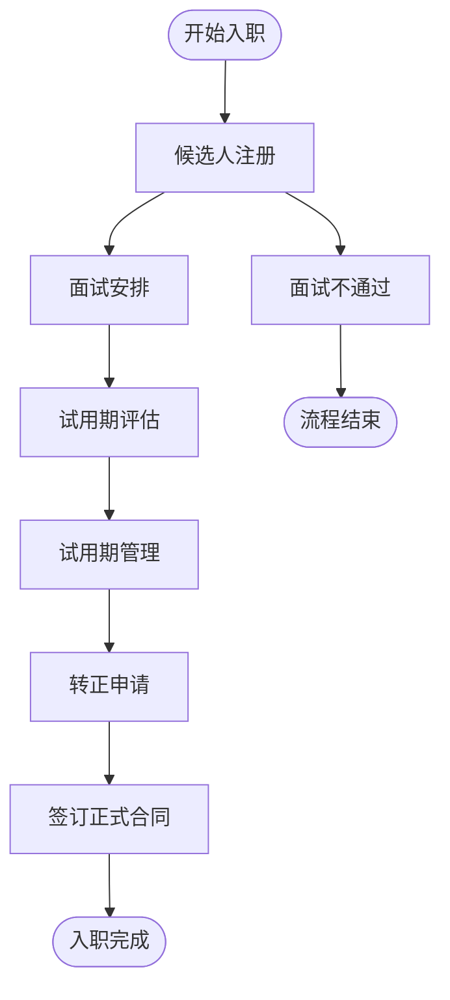

**图表来源**
- [js/hr-lifecycle.js:14-34](file://js/hr-lifecycle.js#L14-L34)

### 员工转正流程

#### 评估标准
- **工作能力**：岗位技能掌握程度
- **业务表现**：工作成果和效率
- **团队协作**：与同事合作情况
- **职业素养**：工作态度和纪律性

#### 审批流程
1. **自我评估**：员工自评
2. **上级评估**：直接上级评估
3. **HR审核**：HR部门审核
4. **领导审批**：部门领导最终审批

### 员工调岗流程

#### 变动类型
- **横向调动**：同级别不同部门
- **纵向晋升**：级别提升
- **纵向降级**：级别下调
- **内部转岗**：不同岗位转换

#### 申请流程
1. **填写申请**：员工或上级填写申请表
2. **说明原因**：详细说明变动原因
3. **评估影响**：评估对工作的影响
4. **审批执行**：相关领导审批后执行

### 员工离职流程

#### 离职类型处理
- **主动离职**：员工辞职处理
- **合同到期**：自然终止处理
- **被动离职**：公司解雇处理

#### 离职手续
- **工作交接**：完成工作移交
- **资产归还**：归还公司物品
- **薪资结算**：结算所有费用
- **关系解除**：正式解除劳动关系

**章节来源**
- [js/hr-lifecycle.js:1-800](file://js/hr-lifecycle.js#L1-L800)

## 安全与权限

### 用户认证机制

系统采用多层安全防护：

#### 登录认证
- **邮箱认证**：支持邮箱密码登录
- **会话管理**：JWT令牌管理
- **自动登出**：超时自动登出
- **多设备同步**：支持多设备同时登录

#### 权限控制
- **角色权限**：基于角色的权限分配
- **数据隔离**：用户数据完全隔离
- **操作审计**：记录所有重要操作

### 数据安全

#### 传输安全
- **HTTPS加密**：所有数据传输加密
- **证书验证**：SSL/TLS证书验证
- **中间人攻击防护**：防止数据被截获

#### 存储安全
- **数据库加密**：敏感数据加密存储
- **访问控制**：严格的访问权限控制
- **备份加密**：备份数据加密保护

### 合规要求

#### 数据保护
- **GDPR合规**：符合通用数据保护条例
- **个人信息保护**：保护员工个人信息
- **数据最小化**：只收集必要数据

#### 审计追踪
- **操作日志**：记录所有用户操作
- **数据变更**：跟踪数据变更历史
- **异常检测**：监控异常访问行为

**章节来源**
- [js/auth.js:1-259](file://js/auth.js#L1-L259)
- [database-setup.sql:78-107](file://database-setup.sql#L78-L107)

## 性能考虑

### 前端性能优化

#### 资源加载
- **懒加载**：模块按需加载
- **缓存策略**：合理利用浏览器缓存
- **压缩优化**：CSS和JavaScript压缩

#### 用户体验
- **响应式设计**：适配各种设备屏幕
- **加载指示**：提供加载状态反馈
- **错误处理**：友好的错误提示

### 后端性能优化

#### 数据库优化
- **索引设计**：合理的索引策略
- **查询优化**：高效的SQL查询
- **连接池**：数据库连接池管理

#### API设计
- **RESTful接口**：标准化的API设计
- **分页处理**：大数据量分页加载
- **缓存机制**：热点数据缓存

### 存储策略

#### 本地存储
- **localStorage**：轻量级数据持久化
- **IndexedDB**：大量数据存储
- **缓存清理**：定期清理过期数据

#### 云端同步
- **增量同步**：只同步变更数据
- **冲突解决**：处理并发修改冲突
- **离线支持**：支持离线数据操作

## 故障排除指南

### 常见问题诊断

#### 登录问题
- **网络连接**：检查网络连接状态
- **认证服务**：确认Supabase服务可用
- **浏览器兼容**：使用支持的浏览器版本

#### 数据同步问题
- **本地存储**：检查localStorage容量
- **云端连接**：验证云端服务状态
- **权限配置**：确认用户权限设置

#### 功能异常
- **JavaScript错误**：检查浏览器控制台
- **模块加载**：确认JS文件正确加载
- **缓存问题**：清除浏览器缓存重试

### 性能问题排查

#### 加载缓慢
- **资源优化**：检查静态资源大小
- **网络延迟**：测试服务器响应时间
- **浏览器性能**：检查浏览器性能指标

#### 内存泄漏
- **事件监听**：确认事件监听器正确移除
- **定时器清理**：检查定时器是否清理
- **DOM引用**：避免循环引用

### 数据恢复

#### 本地数据恢复
- **备份文件**：检查本地备份文件
- **数据导出**：定期导出重要数据
- **恢复流程**：按步骤恢复数据

#### 云端数据恢复
- **版本历史**：利用数据库版本历史
- **备份恢复**：从云端备份恢复
- **数据迁移**：支持跨平台数据迁移

**章节来源**
- [js/auth.js:108-151](file://js/auth.js#L108-L151)
- [js/hr-employee.js:447-454](file://js/hr-employee.js#L447-L454)

## 结论

浙杭企服财务CRM管理系统是一个功能完整、架构清晰的人力资源管理解决方案。系统采用现代化的技术栈，实现了员工档案管理的核心功能，包括：

### 系统优势

1. **功能完整性**：覆盖HR管理的各个关键环节
2. **用户体验**：简洁直观的操作界面
3. **数据安全**：多重安全防护机制
4. **扩展性强**：模块化设计便于功能扩展
5. **云端部署**：支持多设备同步使用

### 技术特色

- **云端架构**：基于Supabase的云端数据存储
- **响应式设计**：适配多种设备访问
- **实时同步**：支持多设备数据同步
- **安全隔离**：用户数据完全隔离

### 应用价值

该系统能够有效提升HR管理效率，降低管理成本，为企业的可持续发展提供有力支撑。通过标准化的业务流程和完善的权限控制，确保了数据的安全性和准确性。

### 发展前景

随着企业规模的扩大和管理需求的提升，系统将继续完善功能，优化用户体验，为企业提供更加智能化的人力资源管理解决方案。