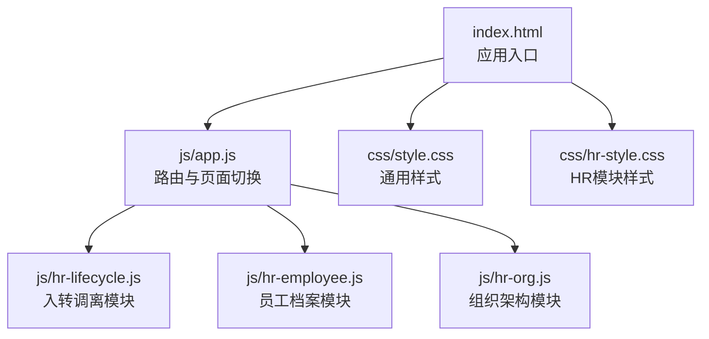
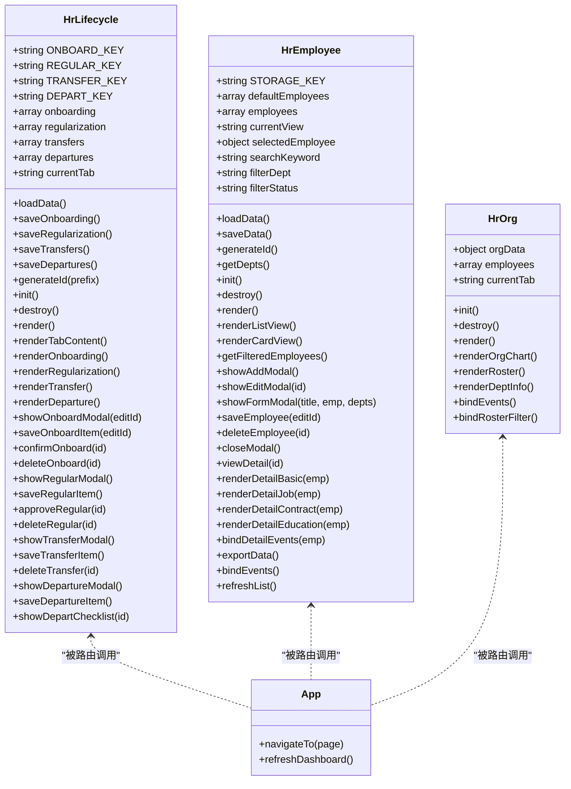
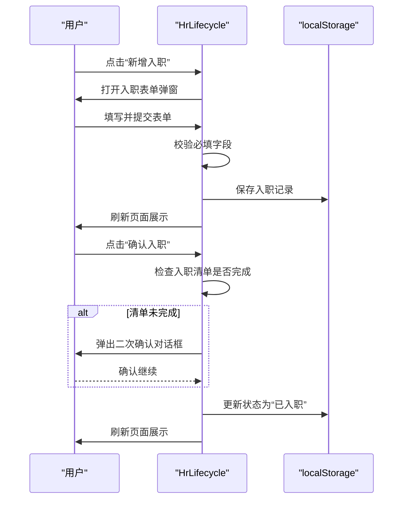
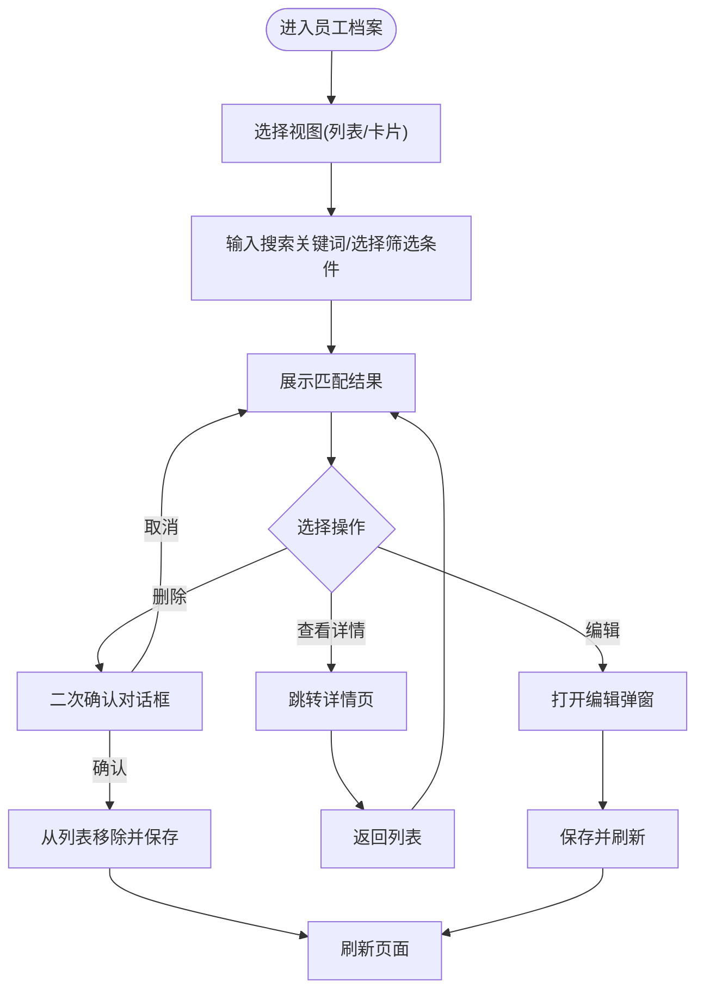
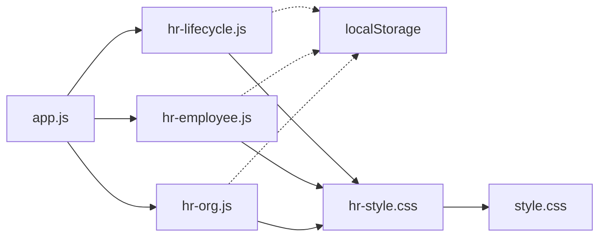

# 员工生命周期管理

<cite>
**本文引用的文件**
- [index.html](file://index.html)
- [js/app.js](file://js/app.js)
- [js/hr-lifecycle.js](file://js/hr-lifecycle.js)
- [js/hr-employee.js](file://js/hr-employee.js)
- [js/hr-org.js](file://js/hr-org.js)
- [css/hr-style.css](file://css/hr-style.css)
- [css/style.css](file://css/style.css)
- [README.md](file://README.md)
</cite>

## 目录
1. [简介](#简介)
2. [项目结构](#项目结构)
3. [核心组件](#核心组件)
4. [架构总览](#架构总览)
5. [详细组件分析](#详细组件分析)
6. [依赖关系分析](#依赖关系分析)
7. [性能考虑](#性能考虑)
8. [故障排查指南](#故障排查指南)
9. [结论](#结论)
10. [附录](#附录)

## 简介
本文件面向HR管理人员与系统使用者，系统性梳理“员工生命周期管理”模块的设计与实现，覆盖从入职到离职的完整流程，包括入职办理、转正评估、调岗/晋升、离职手续等核心环节；同时说明员工状态变更的数据模型与业务规则、审批流程、文档管理与通知机制，以及员工档案更新、权限变更与资产交接等配套功能。文档提供标准流程与操作规范，帮助HR高效完成员工全生命周期管理。

## 项目结构
系统采用前端纯静态页面+本地存储的轻量架构，人事模块位于统一入口页面中，通过左侧菜单导航进入。员工生命周期管理作为独立模块，与其他HR子模块（组织架构、员工档案、招聘、考勤、薪酬）并列存在。

图表来源
- [index.html:1-381](file://index.html#L1-L381)
- [js/app.js:1-156](file://js/app.js#L1-L156)
- [js/hr-lifecycle.js:1-887](file://js/hr-lifecycle.js#L1-L887)
- [js/hr-employee.js:1-628](file://js/hr-employee.js#L1-L628)
- [js/hr-org.js:1-293](file://js/hr-org.js#L1-L293)
- [css/style.css:1-800](file://css/style.css#L1-L800)
- [css/hr-style.css:1-800](file://css/hr-style.css#L1-L800)

章节来源
- [index.html:1-381](file://index.html#L1-L381)
- [js/app.js:1-156](file://js/app.js#L1-L156)

## 核心组件
- 入转调离模块（HrLifecycle）
  - 负责入职、转正、调岗/晋升、离职全流程管理
  - 提供清单化检查、状态流转与操作按钮
- 员工档案模块（HrEmployee）
  - 提供员工信息的增删改查、搜索过滤、视图切换与导出
  - 内置默认数据与本地持久化
- 组织架构模块（HrOrg）
  - 展示公司组织树与花名册，支持搜索与筛选
- 应用路由（app.js）
  - 统一处理页面导航与模块初始化/销毁

章节来源
- [js/hr-lifecycle.js:1-887](file://js/hr-lifecycle.js#L1-L887)
- [js/hr-employee.js:1-628](file://js/hr-employee.js#L1-L628)
- [js/hr-org.js:1-293](file://js/hr-org.js#L1-L293)
- [js/app.js:1-156](file://js/app.js#L1-L156)

## 架构总览
员工生命周期管理模块采用“模块化对象+本地存储”的前端架构：
- 模块对象封装状态、渲染、事件绑定与数据持久化
- 本地存储用于数据持久化（localStorage），便于离线使用与快速迭代
- UI采用卡片、表格与弹窗组合，提供清晰的信息层级与交互反馈

图表来源
- [js/hr-lifecycle.js:1-887](file://js/hr-lifecycle.js#L1-L887)
- [js/hr-employee.js:1-628](file://js/hr-employee.js#L1-L628)
- [js/hr-org.js:1-293](file://js/hr-org.js#L1-L293)
- [js/app.js:1-156](file://js/app.js#L1-L156)

## 详细组件分析

### 入转调离模块（HrLifecycle）
职责与范围
- 入职管理：新增入职、编辑、确认入职、清单勾选
- 转正管理：提交转正、评分与评语、审批通过
- 调岗/晋升：提交调岗/晋升申请、审批与生效
- 离职管理：提交离职、填写交接与离职清单、完成结算

数据模型与状态
- 入职记录：包含姓名、部门、职位、预计入职日期、联系方式、学历、招聘来源、入职导师、状态、入职清单
- 转正记录：包含员工姓名、部门、职位、入职日期、试用期截止、申请日期、评估分数、评估人、评语、状态
- 调岗/晋升记录：包含员工姓名、变动类型、原部门/职位、新部门/职位、生效日期、原因、审批人、状态
- 离职记录：包含员工姓名、部门、职位、入职日期、离职日期、离职类型、原因、交接人、离职清单、状态

业务规则
- 入职确认前必须完成入职清单；若清单未完成，确认入职前进行二次确认
- 转正记录状态为“待转正”，审批后变为“已转正”
- 调岗/晋升记录状态为“已生效”，审批人字段可为空或待审批
- 离职记录状态从“办理中”到“已完成”，需完成所有离职清单项

界面与交互
- 顶部统计卡片显示各类记录数量
- 四个标签页分别对应入职、转正、调岗/晋升、离职
- 每个记录卡片/表格提供编辑、删除、审批、确认等操作按钮
- 弹窗表单用于新增与编辑，支持必填校验与保存

图表来源
- [js/hr-lifecycle.js:338-455](file://js/hr-lifecycle.js#L338-L455)

章节来源
- [js/hr-lifecycle.js:1-887](file://js/hr-lifecycle.js#L1-L887)

### 员工档案模块（HrEmployee）
职责与范围
- 员工信息维护：增删改查、批量导出
- 搜索与筛选：按姓名、工号、部门、职位、手机等关键词搜索，按部门与状态筛选
- 视图切换：列表视图与卡片视图
- 详情页：分标签页展示基本信息、岗位信息、合同社保、教育经历

数据模型
- 员工档案字段：工号、姓名、性别、年龄、部门、职位、职级、入职日期、试用期截止、合同到期、状态、紧急联系人、紧急电话、银行卡号、社保、公积金等
- 默认数据包含多家部门与职位的示例员工

业务规则
- 新增员工时自动生成唯一工号
- 工龄根据入职日期自动计算
- 删除员工前进行二次确认

界面与交互
- 顶部统计卡片显示总人数、在职、试用期、部门数
- 工具栏支持搜索、筛选与视图切换
- 弹窗表单用于新增与编辑，支持必填校验与保存
- 详情页支持标签切换与返回列表

图表来源
- [js/hr-employee.js:244-628](file://js/hr-employee.js#L244-L628)

章节来源
- [js/hr-employee.js:1-628](file://js/hr-employee.js#L1-L628)

### 组织架构模块（HrOrg）
职责与范围
- 展示公司组织树：根节点为公司名称，第二层为部门，第三层为小组
- 员工花名册：按部门与姓名搜索，支持筛选
- 部门信息：展示部门负责人、下设团队等信息

界面与交互
- 三个标签页：组织架构图、员工花名册、部门信息
- 花名册支持搜索与部门筛选

章节来源
- [js/hr-org.js:1-293](file://js/hr-org.js#L1-L293)

### 应用路由与页面切换（app.js）
职责与范围
- 统一处理左侧菜单点击事件
- 根据页面标识初始化对应模块（如 hr-lifecycle、hr-employee、hr-org）
- 在页面切换时清理上一个模块的资源

章节来源
- [js/app.js:1-156](file://js/app.js#L1-L156)

## 依赖关系分析
- 模块间耦合
  - HrLifecycle 与 HrEmployee 通过员工工号建立弱关联（转正记录中的 empId 字段预留，但实际未使用）
  - HrOrg 与 HrEmployee 通过部门字段建立关联
- 外部依赖
  - 本地存储（localStorage）用于数据持久化
  - 样式文件提供统一UI风格与HR模块专属样式
- 可能的循环依赖
  - 模块均以对象形式定义，无显式循环导入，耦合度低

图表来源
- [js/app.js:1-156](file://js/app.js#L1-L156)
- [js/hr-lifecycle.js:1-887](file://js/hr-lifecycle.js#L1-L887)
- [js/hr-employee.js:1-628](file://js/hr-employee.js#L1-L628)
- [js/hr-org.js:1-293](file://js/hr-org.js#L1-L293)
- [css/hr-style.css:1-800](file://css/hr-style.css#L1-L800)
- [css/style.css:1-800](file://css/style.css#L1-L800)

章节来源
- [js/app.js:1-156](file://js/app.js#L1-L156)
- [js/hr-lifecycle.js:1-887](file://js/hr-lifecycle.js#L1-L887)
- [js/hr-employee.js:1-628](file://js/hr-employee.js#L1-L628)
- [js/hr-org.js:1-293](file://js/hr-org.js#L1-L293)

## 性能考虑
- 本地存储读写
  - 模块在初始化时一次性读取并解析localStorage，避免频繁IO
  - 保存时仅写入当前模块对应键值，减少写入体积
- 渲染优化
  - 列表/卡片视图切换时仅重绘内容区域，不重建整个DOM
  - 表格渲染采用模板字符串拼接，避免复杂虚拟DOM
- 事件绑定
  - 使用事件委托与一次性绑定，降低内存占用
- 建议
  - 若数据量增大，建议引入分页或虚拟滚动
  - 对高频操作（如搜索、筛选）增加防抖

## 故障排查指南
常见问题与解决思路
- 页面无法加载或空白
  - 检查浏览器控制台是否有脚本报错
  - 确认index.html中脚本路径正确且资源可访问
- 模块无法切换
  - 检查app.js中页面标识与菜单项是否一致
  - 确认对应模块文件已正确加载
- 数据未持久化
  - 检查浏览器localStorage是否启用
  - 确认模块保存方法被调用（如saveOnboarding/saveRegularization等）
- 表单校验失败
  - 确认必填字段已填写
  - 检查表单验证逻辑与提示信息
- 离职确认异常
  - 确认入职清单是否全部勾选
  - 若未勾选，确认二次确认对话框是否被取消

章节来源
- [js/hr-lifecycle.js:438-455](file://js/hr-lifecycle.js#L438-L455)
- [js/hr-employee.js:416-454](file://js/hr-employee.js#L416-L454)
- [js/app.js:85-135](file://js/app.js#L85-L135)

## 结论
员工生命周期管理模块以简洁的前端架构实现了从入职到离职的全流程管理，结合本地存储与清晰的UI交互，满足HR日常管理需求。模块边界明确、扩展性强，适合在现有基础上逐步引入云端同步与更复杂的审批流。建议后续增强：
- 引入云端数据存储与同步（如Supabase）
- 完善审批流与通知机制
- 增加权限控制与审计日志
- 优化大数据量场景下的性能

## 附录

### 员工生命周期标准流程与操作规范
- 入职管理
  - 新增入职：填写基本信息与入职清单，确认入职前确保清单完成
  - 确认入职：检查清单，必要时二次确认
  - 编辑/删除：支持修改与删除入职记录
- 转正管理
  - 提交转正：填写转正信息、评分与评语
  - 审批通过：将状态从“待转正”改为“已转正”
- 调岗/晋升
  - 提交申请：填写变动类型、原/新部门与职位、生效日期与原因
  - 生效：状态为“已生效”，审批人可为空或待审批
- 离职管理
  - 提交离职：填写离职类型、日期、交接人与原因
  - 办理完成：勾选所有离职清单项，状态从“办理中”变为“已完成”

章节来源
- [js/hr-lifecycle.js:14-800](file://js/hr-lifecycle.js#L14-L800)

### 数据模型与字段说明
- 入职记录字段：id、name、dept、position、expectedDate、phone、education、source、mentor、status、checklist
- 转正记录字段：id、empId、name、dept、position、joinDate、probationEnd、applyDate、score、evaluator、comment、status
- 调岗/晋升记录字段：id、empId、name、type、fromDept、fromPosition、toDept、toPosition、effectiveDate、reason、approver、status
- 离职记录字段：id、name、dept、position、type、joinDate、departDate、handover、applyDate、reason、status、checklist

章节来源
- [js/hr-lifecycle.js:14-800](file://js/hr-lifecycle.js#L14-L800)