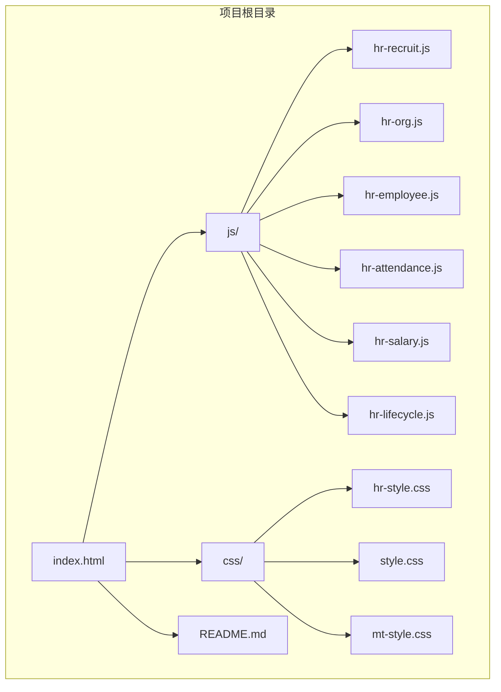
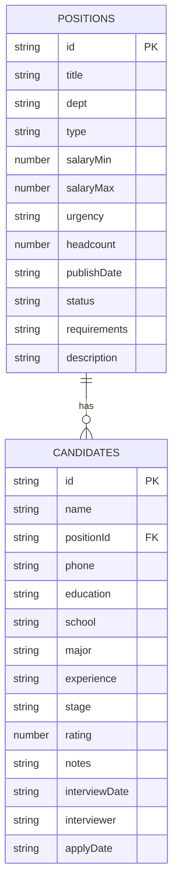
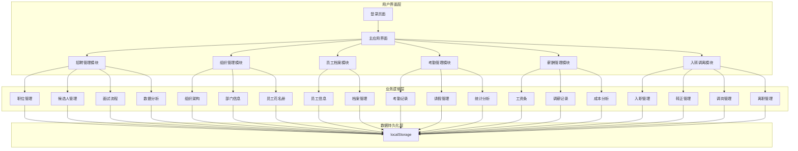
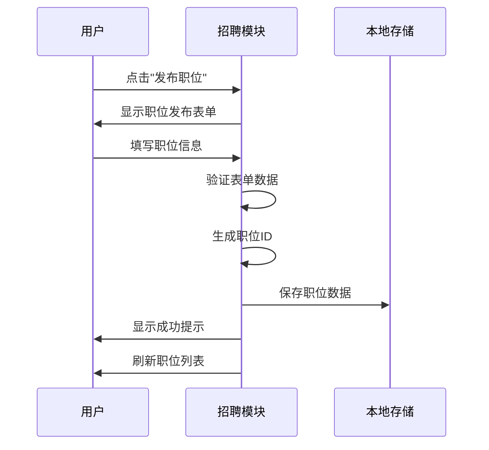
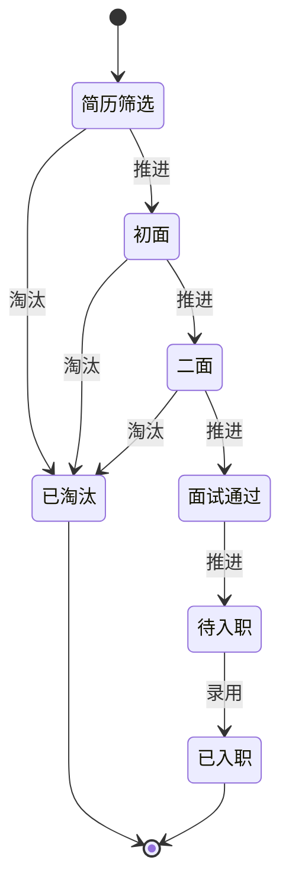
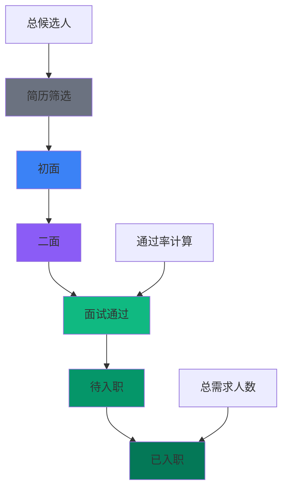
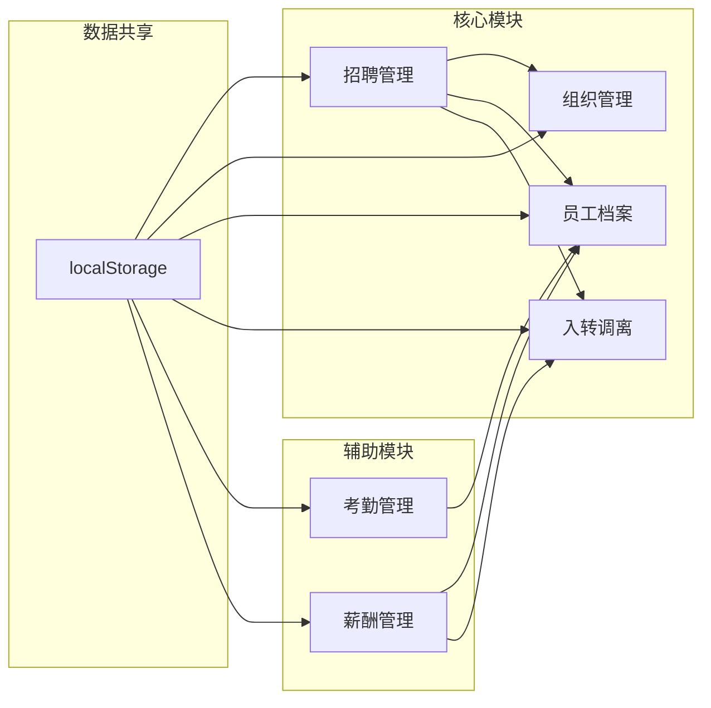

# 招聘管理

<cite>
**本文档引用的文件**
- [index.html](file://index.html)
- [hr-recruit.js](file://js/hr-recruit.js)
- [hr-style.css](file://css/hr-style.css)
- [README.md](file://README.md)
- [hr-org.js](file://js/hr-org.js)
- [hr-employee.js](file://js/hr-employee.js)
- [hr-attendance.js](file://js/hr-attendance.js)
- [hr-salary.js](file://js/hr-salary.js)
- [hr-lifecycle.js](file://js/hr-lifecycle.js)
</cite>

## 目录
1. [项目概述](#项目概述)
2. [项目结构](#项目结构)
3. [核心组件](#核心组件)
4. [架构概览](#架构概览)
5. [详细组件分析](#详细组件分析)
6. [依赖关系分析](#依赖关系分析)
7. [性能考虑](#性能考虑)
8. [故障排除指南](#故障排除指南)
9. [结论](#结论)
10. [附录](#附录)

## 项目概述

本项目是一个基于纯前端技术栈的财务CRM管理系统，包含完整的招聘管理模块。系统采用HTML5 + CSS3 + JavaScript技术栈，无需后端服务器即可运行，所有数据存储在浏览器的localStorage中。

### 系统特性

- **纯前端实现**：无需服务器，直接在浏览器中运行
- **数据持久化**：使用localStorage进行数据存储
- **响应式设计**：适配不同屏幕尺寸的设备
- **模块化架构**：清晰的功能模块划分
- **用户友好界面**：直观的操作界面和交互体验

### 技术栈

- **前端框架**：HTML5 + CSS3 + JavaScript
- **数据存储**：localStorage（本地存储）
- **样式框架**：自定义CSS样式
- **图标系统**：Font Awesome图标库

## 项目结构

**图表来源**
- [index.html:1-381](file://index.html#L1-L381)
- [hr-recruit.js:1-657](file://js/hr-recruit.js#L1-L657)

**章节来源**
- [index.html:1-381](file://index.html#L1-L381)
- [README.md:1-135](file://README.md#L1-L135)

## 核心组件

### 招聘管理模块 (HrRecruit)

招聘管理模块是系统的核心功能模块，提供了完整的招聘流程管理能力：

#### 主要功能
- **职位管理**：发布、编辑、删除招聘职位
- **候选人管理**：添加、筛选、跟踪候选人状态
- **面试流程**：推进候选人面试进程
- **招聘分析**：招聘漏斗和统计数据
- **数据导出**：CSV格式的数据导出功能

#### 数据模型

**图表来源**
- [hr-recruit.js:11-28](file://js/hr-recruit.js#L11-L28)

#### 关键特性
- **实时数据更新**：所有操作即时反映在界面中
- **状态跟踪**：完整的候选人面试状态管理
- **统计分析**：招聘进度和效果的可视化展示
- **批量操作**：支持数据筛选和批量处理

**章节来源**
- [hr-recruit.js:1-657](file://js/hr-recruit.js#L1-L657)

## 架构概览

系统采用模块化单页应用架构，各功能模块相对独立又相互关联：

**图表来源**
- [index.html:170-351](file://index.html#L170-L351)
- [hr-recruit.js:51-657](file://js/hr-recruit.js#L51-L657)

## 详细组件分析

### 招聘职位管理

#### 职位发布流程

**图表来源**
- [hr-recruit.js:285-398](file://js/hr-recruit.js#L285-L398)

#### 职位状态管理

系统支持两种职位状态：
- **招聘中**：职位处于开放状态，可接收简历
- **暂停**：职位暂时停止招聘

**章节来源**
- [hr-recruit.js:136-179](file://js/hr-recruit.js#L136-L179)
- [hr-recruit.js:400-414](file://js/hr-recruit.js#L400-L414)

### 候选人管理

#### 候选人状态跟踪

**图表来源**
- [hr-recruit.js:542-565](file://js/hr-recruit.js#L542-L565)

#### 面试流程设计

系统提供标准的三轮面试流程：
1. **简历筛选**：初步筛选符合条件的候选人
2. **初面**：第一轮面试，主要考察基本素质
3. **二面**：第二轮面试，深入评估专业能力
4. **面试通过**：通过面试，等待录用通知
5. **待入职**：已录用，等待入职手续
6. **已入职**：完成入职流程

**章节来源**
- [hr-recruit.js:416-509](file://js/hr-recruit.js#L416-L509)
- [hr-recruit.js:542-565](file://js/hr-recruit.js#L542-L565)

### 招聘数据分析

#### 招聘漏斗分析

**图表来源**
- [hr-recruit.js:238-283](file://js/hr-recruit.js#L238-L283)

#### 关键指标

系统提供以下关键招聘指标：
- **总候选人数量**：所有投递简历的候选人总数
- **通过率**：通过面试的候选人占总候选人的百分比
- **总需求人数**：所有在招职位的招聘人数总和
- **在招职位数**：当前处于招聘状态的职位数量

**章节来源**
- [hr-recruit.js:238-283](file://js/hr-recruit.js#L238-L283)

### 数据导出功能

系统支持将候选人数据导出为CSV格式，便于进一步分析和处理：

#### 导出字段
- 姓名、应聘职位、手机号
- 学历、院校、专业
- 工作经验、投递日期
- 当前阶段、评分
- 面试日期、面试官、备注

**章节来源**
- [hr-recruit.js:574-587](file://js/hr-recruit.js#L574-L587)

## 依赖关系分析

### 模块间依赖

**图表来源**
- [index.html:247-268](file://index.html#L247-L268)

### 数据一致性保证

由于所有模块都使用localStorage进行数据存储，系统通过以下方式保证数据一致性：

1. **统一数据源**：所有模块共享同一localStorage实例
2. **模块间通信**：通过事件机制实现模块间数据同步
3. **数据验证**：每个模块都有自己的数据验证逻辑
4. **错误处理**：完善的错误处理和数据恢复机制

**章节来源**
- [hr-recruit.js:30-45](file://js/hr-recruit.js#L30-L45)
- [hr-org.js:1-293](file://js/hr-org.js#L1-L293)
- [hr-employee.js:1-628](file://js/hr-employee.js#L1-L628)

## 性能考虑

### 前端性能优化

1. **懒加载策略**：模块按需加载，减少初始加载时间
2. **虚拟滚动**：大数据量时使用虚拟滚动技术
3. **缓存机制**：合理使用浏览器缓存减少重复请求
4. **事件委托**：使用事件委托减少事件处理器数量

### 数据存储优化

1. **数据压缩**：对存储的数据进行适当的压缩
2. **索引优化**：为常用查询字段建立索引
3. **增量更新**：只更新变化的数据，避免全量重载
4. **内存管理**：及时清理不再使用的数据引用

## 故障排除指南

### 常见问题及解决方案

#### 数据丢失问题
**症状**：刷新页面后数据消失
**原因**：浏览器清除缓存或localStorage被清空
**解决方案**：
1. 检查浏览器的隐私设置
2. 确认localStorage功能正常
3. 定期备份重要数据

#### 页面加载缓慢
**症状**：页面响应迟缓
**原因**：数据量过大或网络延迟
**解决方案**：
1. 清理不必要的数据
2. 使用分页加载
3. 优化CSS和JavaScript文件

#### 功能异常
**症状**：某些功能无法正常使用
**原因**：JavaScript错误或浏览器兼容性问题
**解决方案**：
1. 检查浏览器控制台错误
2. 更新到最新版本的浏览器
3. 禁用可能干扰的浏览器扩展

**章节来源**
- [hr-recruit.js:589-598](file://js/hr-recruit.js#L589-L598)

## 结论

本招聘管理模块提供了完整的招聘流程管理功能，具有以下优势：

1. **功能完整**：覆盖了招聘管理的各个环节
2. **易于使用**：直观的界面设计和操作流程
3. **数据安全**：本地存储确保数据隐私
4. **扩展性强**：模块化设计便于功能扩展
5. **维护简单**：纯前端实现降低维护成本

### 改进建议

1. **云端同步**：考虑添加云端数据同步功能
2. **权限管理**：增加用户权限和角色管理
3. **移动端适配**：优化移动端用户体验
4. **报表分析**：增强数据分析和报表功能
5. **集成能力**：提供API接口便于第三方集成

## 附录

### 快速开始指南

1. **环境准备**：确保浏览器支持localStorage功能
2. **数据导入**：首次使用时系统会自动填充示例数据
3. **功能体验**：从招聘管理模块开始体验各项功能
4. **数据备份**：定期导出数据进行备份

### 最佳实践

1. **数据管理**：定期清理过期数据，保持数据整洁
2. **流程规范**：严格按照招聘流程操作，确保数据准确性
3. **权限控制**：合理分配操作权限，保护敏感数据
4. **定期备份**：建立数据备份机制，防止数据丢失
5. **持续优化**：根据实际使用情况调整配置和流程

### 技术支持

如遇技术问题，请参考以下资源：
- 浏览器开发者工具
- 控制台错误信息
- 系统日志文件
- 在线技术社区