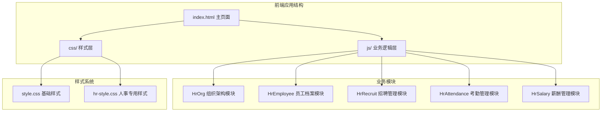
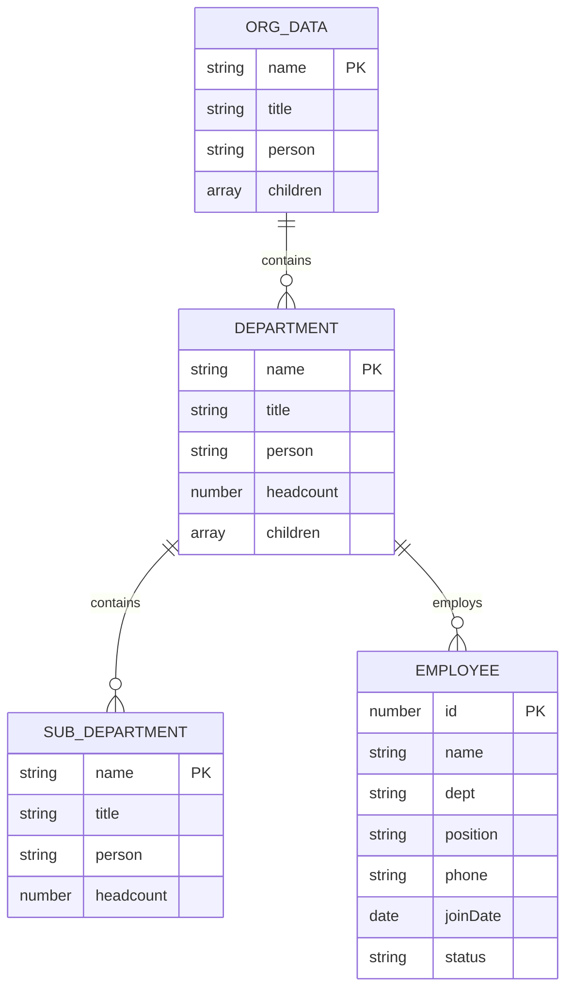
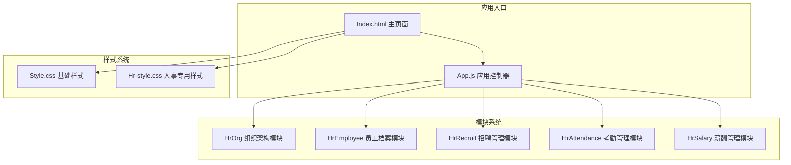
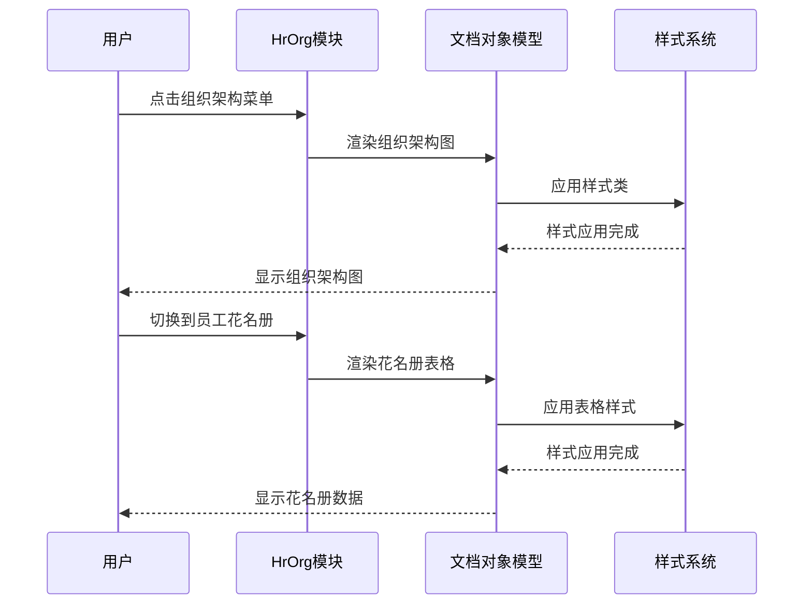
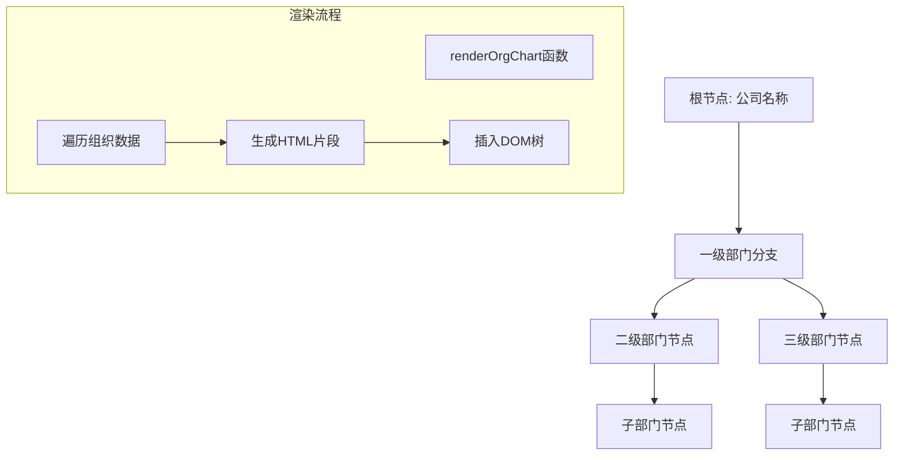
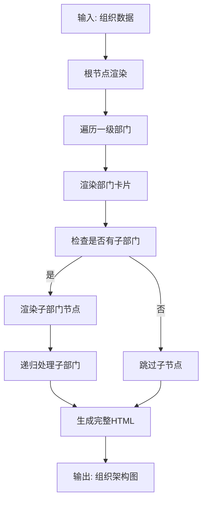
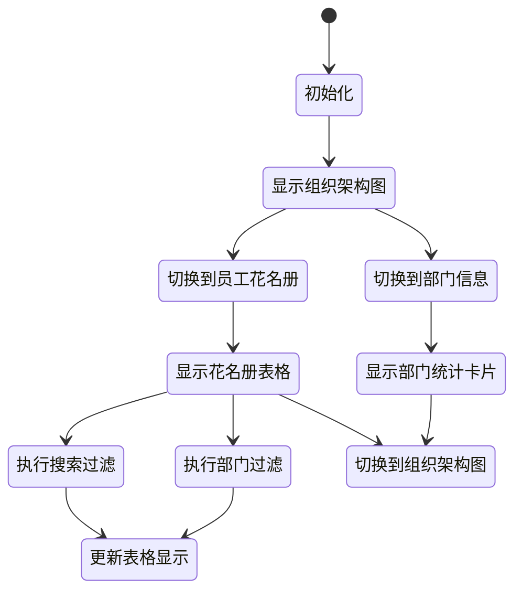
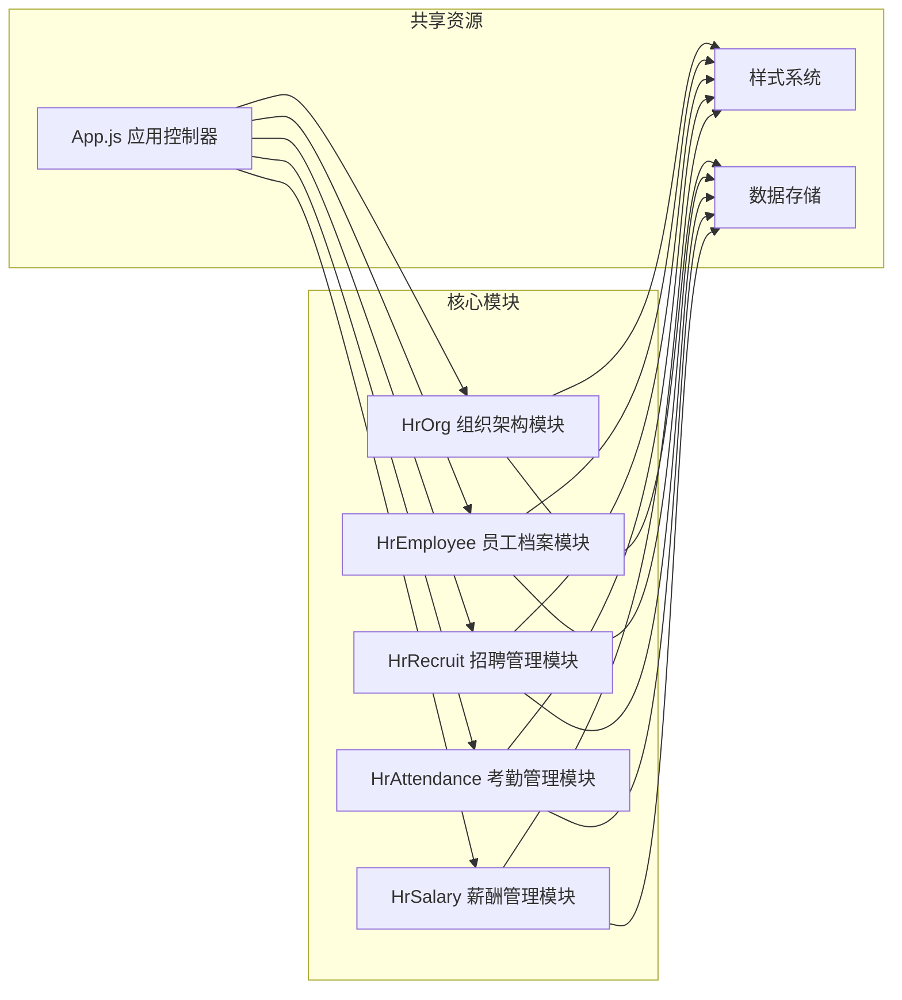

# 组织架构管理

<cite>
**本文档引用的文件**
- [hr-org.js](file://js/hr-org.js)
- [index.html](file://index.html)
- [app.js](file://js/app.js)
- [hr-style.css](file://css/hr-style.css)
- [style.css](file://css/style.css)
- [README.md](file://README.md)
</cite>

## 目录
1. [引言](#引言)
2. [项目结构](#项目结构)
3. [核心组件](#核心组件)
4. [架构概览](#架构概览)
5. [详细组件分析](#详细组件分析)
6. [依赖关系分析](#依赖关系分析)
7. [性能考虑](#性能考虑)
8. [故障排除指南](#故障排除指南)
9. [结论](#结论)
10. [附录](#附录)

## 引言

组织架构管理模块是浙杭企服财务CRM系统中的人事管理核心功能之一。该模块提供了完整的公司组织框架展示、部门管理、职位架构等功能，采用纯前端实现，无需服务器端支持。

本模块的设计理念基于清晰的层级组织结构，通过直观的树形图表展示公司的组织关系，同时提供员工花名册和部门信息统计功能。模块采用模块化设计，便于维护和扩展。

## 项目结构

项目采用经典的前端三层架构：HTML页面结构、CSS样式层、JavaScript业务逻辑层。



**图表来源**
- [index.html:1-381](file://index.html#L1-L381)
- [app.js:1-156](file://js/app.js#L1-L156)

**章节来源**
- [index.html:1-381](file://index.html#L1-L381)
- [README.md:1-135](file://README.md#L1-L135)

## 核心组件

### HrOrg 组织架构模块

HrOrg模块是整个组织架构管理的核心，负责展示公司的层级组织结构。该模块包含以下主要功能：

- **组织架构图渲染**：动态生成树形组织结构图表
- **员工花名册**：展示所有员工的基本信息
- **部门信息统计**：提供部门层面的数据统计和分析
- **多视图切换**：支持组织架构图、员工花名册、部门信息三种视图

### 数据模型设计

模块采用层次化的数据结构来表示组织架构：



**图表来源**
- [hr-org.js:4-97](file://js/hr-org.js#L4-L97)

**章节来源**
- [hr-org.js:1-293](file://js/hr-org.js#L1-L293)

## 架构概览

系统采用模块化架构设计，每个功能模块都是独立的JavaScript对象，具有自己的生命周期和渲染逻辑。



**图表来源**
- [app.js:85-135](file://js/app.js#L85-L135)
- [index.html:354-378](file://index.html#L354-L378)

### 控制流分析

应用的控制流遵循标准的MVC模式：



**图表来源**
- [app.js:110-111](file://js/app.js#L110-L111)
- [hr-org.js:101-105](file://js/hr-org.js#L101-L105)

**章节来源**
- [app.js:1-156](file://js/app.js#L1-L156)
- [hr-org.js:101-133](file://js/hr-org.js#L101-L133)

## 详细组件分析

### 组织架构图渲染机制

组织架构图采用嵌套的HTML结构来表示层级关系：



**图表来源**
- [hr-org.js:135-170](file://js/hr-org.js#L135-L170)

#### 树形结构构建算法

组织架构图的构建采用了递归的数据映射算法：



**图表来源**
- [hr-org.js:147-167](file://js/hr-org.js#L147-L167)

### 数据模型设计

模块的数据模型设计体现了清晰的层次关系：

**组织数据结构**：
- `orgData`: 根节点信息，包含公司名称、标题、负责人
- `children`: 一级部门数组
- 每个部门包含：名称、标题、负责人、编制人数、子部门数组

**员工数据结构**：
- `employees`: 员工数组，包含员工基本信息
- 每个员工包含：唯一标识、姓名、部门、职位、联系方式、入职日期、状态等

**章节来源**
- [hr-org.js:4-97](file://js/hr-org.js#L4-L97)

### 交互逻辑实现

模块实现了完整的用户交互功能：



**图表来源**
- [hr-org.js:246-291](file://js/hr-org.js#L246-L291)

#### 事件绑定机制

模块采用事件委托的方式处理用户交互：

**Tab切换事件**：
- 监听`.hr-org-tab`元素的点击事件
- 动态切换当前显示的视图
- 重新渲染对应的内容区域

**搜索过滤功能**：
- 监听搜索框的输入事件
- 监听部门选择器的变更事件
- 实时过滤员工数据并更新显示

**章节来源**
- [hr-org.js:246-291](file://js/hr-org.js#L246-L291)

### 视觉呈现效果

模块采用了现代化的卡片式设计和响应式布局：

**样式特点**：
- 使用CSS Grid和Flexbox实现灵活布局
- 采用渐变色彩方案增强视觉效果
- 实现了完整的响应式设计，适配不同屏幕尺寸
- 提供了丰富的状态指示器和徽章系统

**组件样式系统**：
- `.org-chart-container`: 组织架构图容器
- `.org-node-card`: 节点卡片样式
- `.dept-cards-grid`: 部门信息网格布局
- `.roster-container`: 员工花名册容器

**章节来源**
- [hr-style.css:1-800](file://css/hr-style.css#L1-L800)
- [style.css:1-800](file://css/style.css#L1-L800)

## 依赖关系分析

### 模块间依赖



**图表来源**
- [app.js:100-135](file://js/app.js#L100-L135)
- [index.html:354-378](file://index.html#L354-L378)

### 外部依赖

系统对外部依赖保持最小化：

**必需依赖**：
- Supabase JavaScript SDK：用于云端数据存储
- Chart.js：用于数据可视化（在其他模块中使用）

**可选依赖**：
- Font Awesome图标库：提供丰富的图标资源

**章节来源**
- [index.html:11-12](file://index.html#L11-L12)
- [index.html:354](file://index.html#L354)

## 性能考虑

### 渲染优化

模块采用了多种性能优化策略：

**虚拟滚动**：对于大量数据的场景，可以考虑实现虚拟滚动来提升渲染性能。

**事件节流**：搜索和过滤操作使用了防抖机制，避免频繁的DOM操作。

**内存管理**：模块在销毁时清理事件监听器，防止内存泄漏。

### 数据处理优化

**数据缓存**：员工数据在内存中缓存，避免重复计算。

**懒加载**：不同视图按需加载，减少初始渲染负担。

## 故障排除指南

### 常见问题及解决方案

**组织架构图不显示**：
1. 检查`orgData`数据结构是否正确
2. 确认DOM元素选择器是否匹配
3. 验证CSS样式是否正确加载

**员工花名册搜索无效**：
1. 检查搜索输入框的事件绑定
2. 确认过滤函数的逻辑正确性
3. 验证数据源是否包含预期字段

**样式显示异常**：
1. 检查CSS文件的加载路径
2. 确认样式类名与HTML结构匹配
3. 验证浏览器兼容性

**章节来源**
- [hr-org.js:264-291](file://js/hr-org.js#L264-L291)

## 结论

组织架构管理模块展现了现代前端开发的最佳实践，通过模块化设计、清晰的数据结构和优雅的用户界面，为HR管理人员提供了完整的组织管理解决方案。

模块的主要优势包括：
- **易用性**：直观的树形结构展示和多视图切换
- **可维护性**：模块化设计，职责分离明确
- **可扩展性**：良好的架构设计支持功能扩展
- **性能**：优化的渲染机制和事件处理

该模块为HR管理人员提供了一个强大而易用的工具，能够有效管理公司的组织架构和员工信息。

## 附录

### 配置示例

**基本配置**：
```javascript
// 在index.html中添加模块引用
<script src="js/hr-org.js"></script>

// 在app.js中注册模块
else if (page === 'hr-org') {
    HrOrg.init();
}
```

**数据格式示例**：
```javascript
// 组织数据格式
const orgData = {
    name: '公司名称',
    title: '职位名称', 
    person: '负责人姓名',
    children: [
        {
            name: '部门名称',
            title: '部门职位',
            person: '部门负责人',
            headcount: 人数,
            children: [
                {
                    name: '子部门名称',
                    title: '子部门职位',
                    person: '子部门负责人',
                    headcount: 人数
                }
            ]
        }
    ]
};
```

### 使用方法

**初始化模块**：
```javascript
// 页面加载完成后初始化
document.addEventListener('DOMContentLoaded', function() {
    HrOrg.init();
});
```

**切换视图**：
```javascript
// 通过点击Tab按钮切换视图
document.querySelectorAll('.hr-org-tab').forEach(tab => {
    tab.addEventListener('click', function() {
        const viewType = this.dataset.tab;
        // 视图切换逻辑
    });
});
```

### 最佳实践

**数据维护**：
- 定期备份组织数据
- 使用一致的数据格式
- 验证数据完整性

**性能优化**：
- 避免不必要的DOM操作
- 使用事件委托处理大量元素
- 实现适当的缓存策略

**用户体验**：
- 提供清晰的状态反馈
- 实现响应式的界面设计
- 优化移动端访问体验

**章节来源**
- [hr-org.js:101-133](file://js/hr-org.js#L101-L133)
- [README.md:1-135](file://README.md#L1-L135)