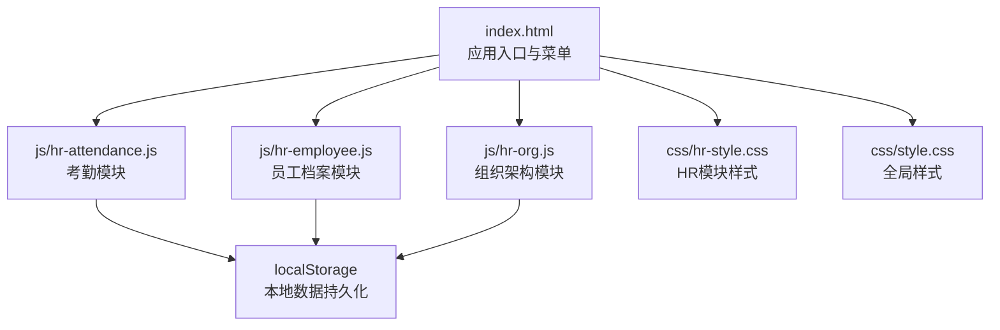
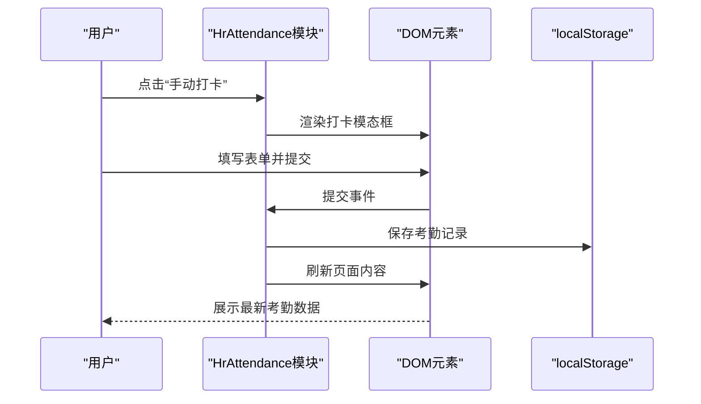
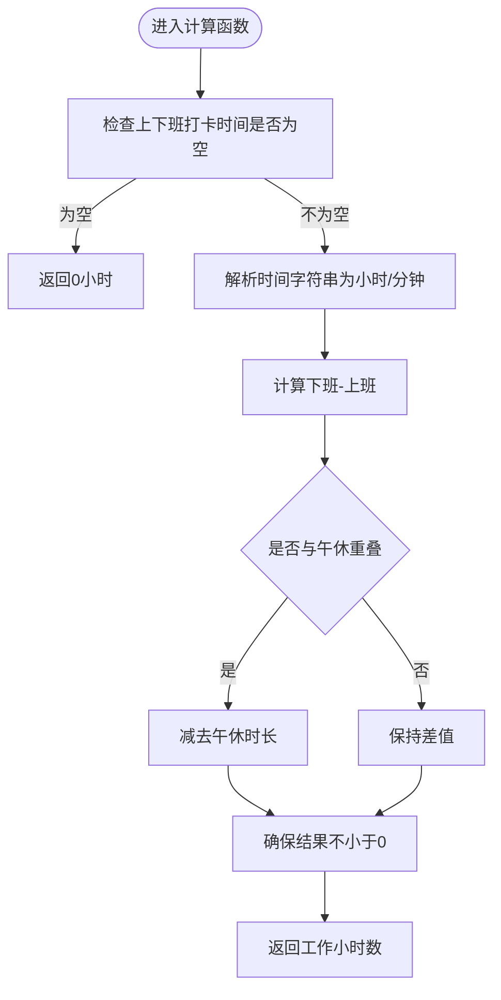
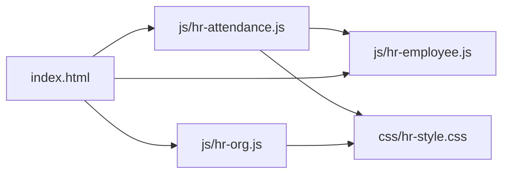

# 考勤管理

<cite>
**本文引用的文件**
- [js/hr-attendance.js](file://js/hr-attendance.js)
- [js/hr-employee.js](file://js/hr-employee.js)
- [js/hr-org.js](file://js/hr-org.js)
- [css/hr-style.css](file://css/hr-style.css)
- [css/style.css](file://css/style.css)
- [index.html](file://index.html)
- [README.md](file://README.md)
- [快速入门.md](file://快速入门.md)
- [database-setup.sql](file://database-setup.sql)
</cite>

## 目录
1. [简介](#简介)
2. [项目结构](#项目结构)
3. [核心组件](#核心组件)
4. [架构概览](#架构概览)
5. [详细组件分析](#详细组件分析)
6. [依赖关系分析](#依赖关系分析)
7. [性能考量](#性能考量)
8. [故障排查指南](#故障排查指南)
9. [结论](#结论)
10. [附录](#附录)

## 简介
本模块为“财务CRM系统”的考勤管理子系统，提供员工打卡记录、请假申请与审批、考勤统计分析、规则配置与报表导出等功能。系统采用纯前端实现，结合本地存储（localStorage）进行数据持久化；同时保留云端版架构基础，便于后续接入Supabase数据库与用户认证体系。

本模块面向HR管理人员，提供标准的考勤采集、统计与分析流程，支持手动打卡、请假审批、规则配置、报表导出与批量调整等能力，帮助HR高效管理企业考勤事务。

## 项目结构
系统采用模块化前端架构，考勤模块位于js/hr-attendance.js，配合样式文件css/hr-style.css与全局样式css/style.css，通过index.html统一加载与渲染。

图表来源
- [index.html:360-378](file://index.html#L360-L378)
- [js/hr-attendance.js:1-10](file://js/hr-attendance.js#L1-L10)
- [css/hr-style.css:1-20](file://css/hr-style.css#L1-L20)
- [css/style.css:30-120](file://css/style.css#L30-L120)

章节来源
- [index.html:360-378](file://index.html#L360-L378)
- [README.md:48-65](file://README.md#L48-L65)

## 核心组件
- 考勤管理模块：负责考勤记录的增删改查、手动打卡、请假申请与审批、统计报表、规则配置与导出。
- 员工档案模块：提供员工信息维护与导出，为考勤模块提供员工列表与基础信息。
- 组织架构模块：提供组织树形结构与花名册，辅助HR理解部门与人员分布。
- 样式模块：提供HR模块专用UI样式与交互反馈。

章节来源
- [js/hr-attendance.js:3-23](file://js/hr-attendance.js#L3-L23)
- [js/hr-employee.js:3-30](file://js/hr-employee.js#L3-L30)
- [js/hr-org.js:3-74](file://js/hr-org.js#L3-L74)
- [css/hr-style.css:708-800](file://css/hr-style.css#L708-L800)

## 架构概览
考勤模块采用单页应用的模块化设计，通过事件绑定与模板渲染实现动态内容更新。模块间通过全局对象与DOM事件协作，数据持久化采用localStorage，确保离线可用与快速响应。

图表来源
- [js/hr-attendance.js:446-506](file://js/hr-attendance.js#L446-L506)
- [js/hr-attendance.js:508-536](file://js/hr-attendance.js#L508-L536)
- [js/hr-attendance.js:780-784](file://js/hr-attendance.js#L780-L784)

章节来源
- [js/hr-attendance.js:75-82](file://js/hr-attendance.js#L75-L82)
- [js/hr-attendance.js:786-843](file://js/hr-attendance.js#L786-L843)

## 详细组件分析

### 考勤数据模型与默认数据
- 考勤记录字段：员工ID、姓名、部门、日期、上班打卡、下班打卡、状态、备注。
- 请假记录字段：员工ID、姓名、部门、假期类型、开始/结束日期、天数、原因、审批人、状态、申请日期。
- 考勤规则字段：工作起止时间、迟到/早退容忍阈值、午休时段、加班起算时间、工作日数组、假期类型集合。
- 默认数据：模块内置演示数据，用于首次加载与演示。

章节来源
- [js/hr-attendance.js:13-23](file://js/hr-attendance.js#L13-L23)
- [js/hr-attendance.js:25-52](file://js/hr-attendance.js#L25-L52)

### 时间计算规则与异常处理
- 工作时长计算：基于上班与下班打卡时间，扣除午休时段后得出实际工作小时数。
- 异常状态判定：根据规则阈值与打卡时间自动判定“迟到”、“早退”、“正常”、“外勤”、“请假”等状态。
- 异常处理：提供手动修改、删除、导出等操作，支持批量调整与数据校验。

图表来源
- [js/hr-attendance.js:433-444](file://js/hr-attendance.js#L433-L444)

章节来源
- [js/hr-attendance.js:433-444](file://js/hr-attendance.js#L433-L444)

### 考勤采集与手动打卡
- 手动打卡：支持选择员工、日期、上下班时间、状态与备注，生成唯一ID并保存。
- 数据校验：表单必填项校验与有效性检查。
- 模态框交互：统一的模态框渲染与事件绑定，支持取消与提交。

章节来源
- [js/hr-attendance.js:446-506](file://js/hr-attendance.js#L446-L506)
- [js/hr-attendance.js:508-536](file://js/hr-attendance.js#L508-L536)

### 请假申请与审批
- 请假申请：选择员工、假期类型、起止日期、天数、审批人与原因，自动生成申请日期与状态。
- 审批流程：HR可对“待审批”状态进行“通过/拒绝”，并更新状态。
- 状态管理：支持“待审批”、“已批准”、“已拒绝”。

章节来源
- [js/hr-attendance.js:604-664](file://js/hr-attendance.js#L604-L664)
- [js/hr-attendance.js:666-717](file://js/hr-attendance.js#L666-L717)

### 考勤统计与报表
- 部门统计：按部门统计正常、迟到、早退、请假、外勤数量与出勤率。
- 个人统计：按员工统计当月出勤情况与出勤率。
- 报表导出：导出CSV格式的考勤记录，包含标题与数据行。

章节来源
- [js/hr-attendance.js:269-367](file://js/hr-attendance.js#L269-L367)
- [js/hr-attendance.js:750-760](file://js/hr-attendance.js#L750-L760)

### 考勤规则配置与排班管理
- 规则配置：支持设置工作起止时间、迟到/早退容忍阈值、午休时段、加班起算时间。
- 假期类型管理：支持添加/删除假期类型，便于灵活配置不同类型的请假。
- 排班管理：通过工作日数组与规则联动，影响统计口径与异常判定。

章节来源
- [js/hr-attendance.js:369-426](file://js/hr-attendance.js#L369-L426)
- [js/hr-attendance.js:719-748](file://js/hr-attendance.js#L719-L748)

### 数据导入导出与批量调整
- 导出：支持导出考勤记录为CSV文件，便于外部分析与归档。
- 批量调整：通过修改现有记录实现批量调整，结合过滤与排序提升效率。
- 数据校验：表单校验与状态转换校验，避免无效数据进入系统。

章节来源
- [js/hr-attendance.js:750-760](file://js/hr-attendance.js#L750-L760)
- [js/hr-attendance.js:780-784](file://js/hr-attendance.js#L780-L784)

### HR管理人员操作规范
- 日常操作：每日查看考勤、处理请假、导出报表、调整规则。
- 审批流程：及时处理待审批请假，确保流程闭环。
- 数据维护：定期核对员工信息与部门归属，保证考勤统计准确性。
- 规则维护：根据节假日与政策调整规则，确保统计口径一致。

章节来源
- [js/hr-attendance.js:786-843](file://js/hr-attendance.js#L786-L843)

## 依赖关系分析
- 模块耦合：考勤模块依赖员工模块提供的员工列表，用于打卡与请假时的人员选择。
- 样式依赖：HR模块样式独立于全局样式，通过类名与组件结构实现解耦。
- 事件绑定：模块内事件绑定集中在bindEvents/bindContentEvents中，便于维护与扩展。

图表来源
- [index.html:360-378](file://index.html#L360-L378)
- [js/hr-attendance.js:762-773](file://js/hr-attendance.js#L762-L773)
- [css/hr-style.css:708-800](file://css/hr-style.css#L708-L800)

章节来源
- [index.html:360-378](file://index.html#L360-L378)
- [js/hr-attendance.js:762-773](file://js/hr-attendance.js#L762-L773)

## 性能考量
- 本地存储：采用localStorage进行数据持久化，减少网络请求，提升响应速度。
- 模板渲染：通过字符串拼接与一次性DOM更新，降低重绘与回流。
- 事件委托：集中绑定事件，减少重复监听与内存占用。
- 统计计算：按需计算与缓存中间结果，避免重复遍历与计算。

## 故障排查指南
- 数据无法保存：检查localStorage是否被禁用或空间不足，确认模块保存函数调用链。
- 表单校验失败：确认必填字段与格式要求，查看表单reportValidity输出。
- 模态框不显示：检查DOM插入与事件绑定是否正确，确认关闭逻辑。
- 统计异常：核对规则配置与日期范围，检查数据过滤逻辑。

章节来源
- [js/hr-attendance.js:508-536](file://js/hr-attendance.js#L508-L536)
- [js/hr-attendance.js:775-778](file://js/hr-attendance.js#L775-L778)
- [js/hr-attendance.js:780-784](file://js/hr-attendance.js#L780-L784)

## 结论
本考勤管理模块以简洁的前端架构实现了完整的考勤采集、统计与分析能力，具备良好的可维护性与扩展性。通过规则配置与报表导出，满足HR日常管理需求；通过与员工档案与组织架构模块的协同，进一步完善了企业人力资源管理的闭环。

## 附录
- 快速开始：参考快速入门文档完成Supabase配置与项目部署。
- 数据库：云端版可选接入Supabase数据库，实现多设备同步与用户隔离。
- 样式定制：可根据企业视觉规范调整HR模块样式与主题色。

章节来源
- [快速入门.md:1-61](file://快速入门.md#L1-L61)
- [README.md:67-86](file://README.md#L67-L86)
- [database-setup.sql:1-148](file://database-setup.sql#L1-L148)