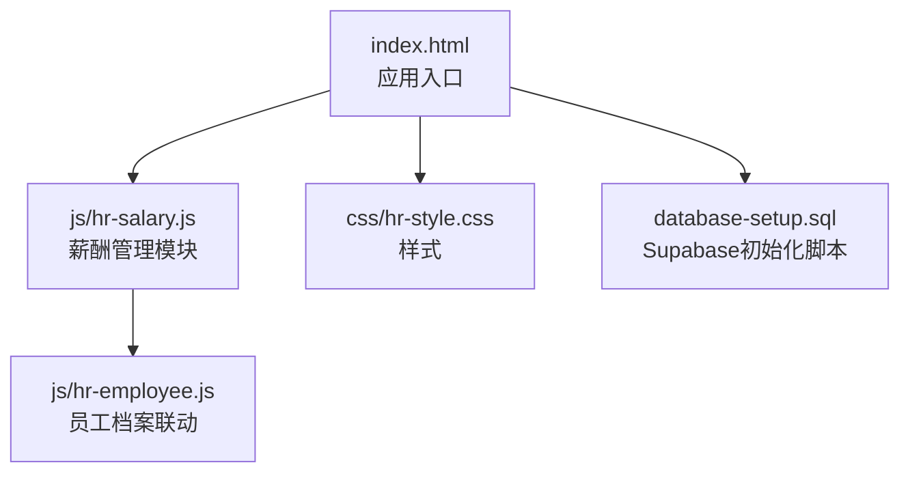
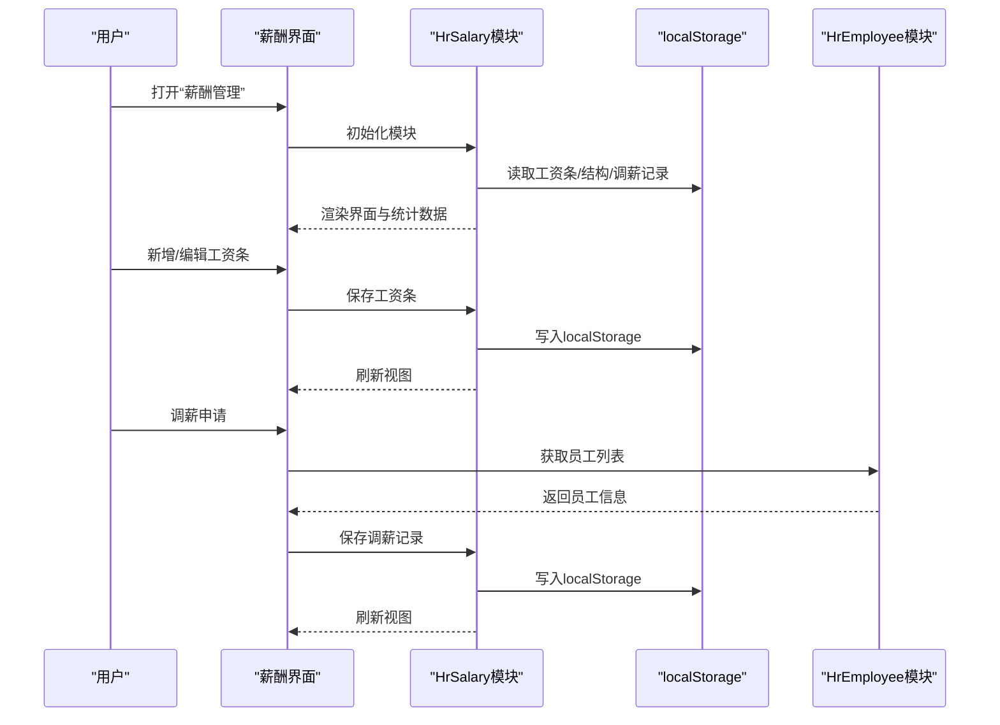
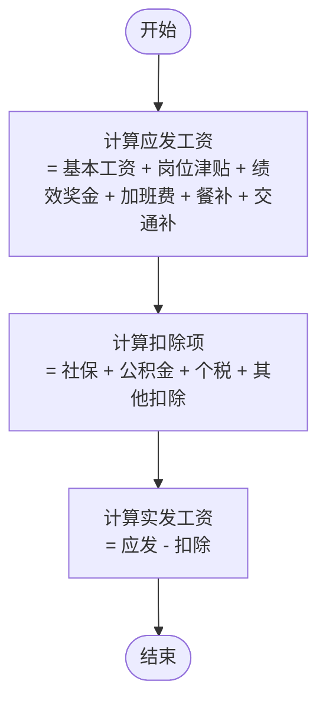
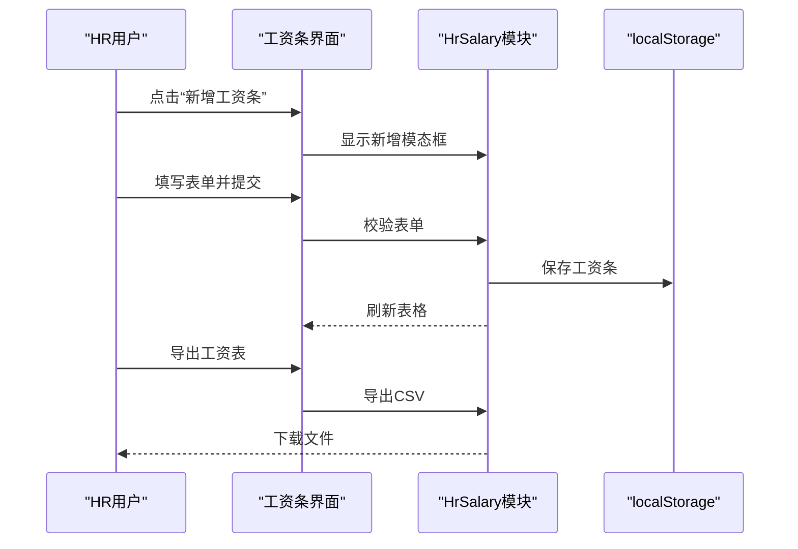
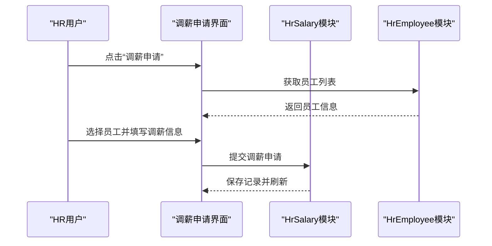
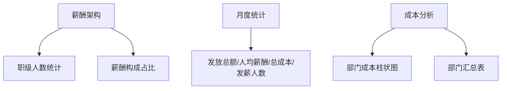
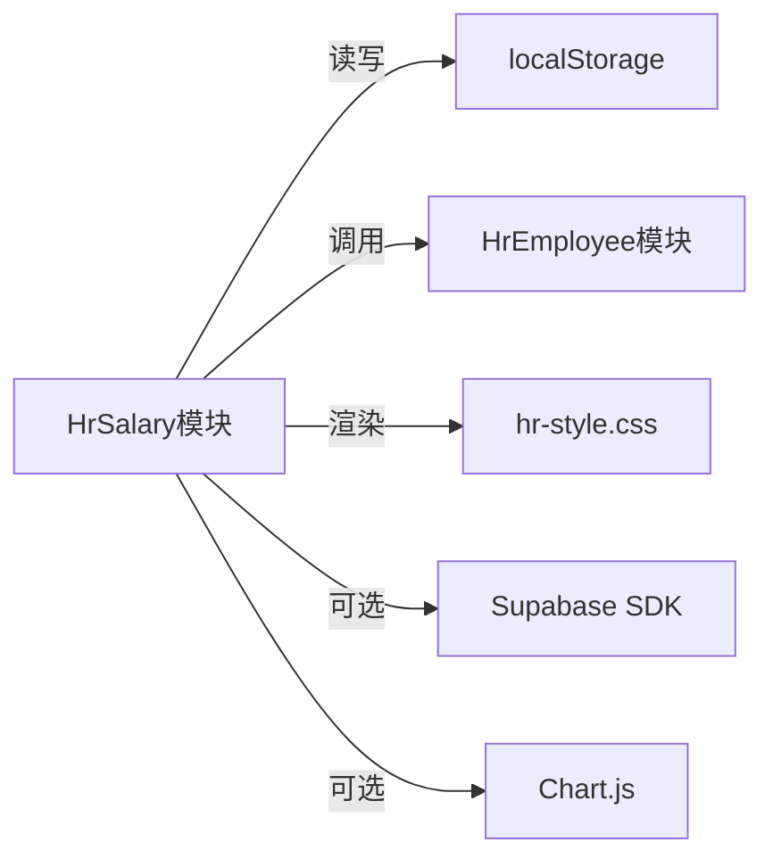

# 薪酬管理

<cite>
**本文引用的文件**
- [README.md](file://README.md)
- [index.html](file://index.html)
- [js/hr-salary.js](file://js/hr-salary.js)
- [css/hr-style.css](file://css/hr-style.css)
- [js/hr-employee.js](file://js/hr-employee.js)
- [database-setup.sql](file://database-setup.sql)
</cite>

## 目录
1. [简介](#简介)
2. [项目结构](#项目结构)
3. [核心组件](#核心组件)
4. [架构概览](#架构概览)
5. [详细组件分析](#详细组件分析)
6. [依赖关系分析](#依赖关系分析)
7. [性能考虑](#性能考虑)
8. [故障排查指南](#故障排查指南)
9. [结论](#结论)
10. [附录](#附录)

## 简介
本模块为“财务CRM管理系统”的薪酬管理子系统，面向HR薪酬人员提供完整的薪资管理能力，覆盖员工薪资计算、发放与统计分析，包括基本工资、岗位津贴、绩效奖金、加班费、餐补/交通补、社保公积金、个人所得税及其它扣除等核心业务。系统采用纯前端实现，结合本地存储与云端存储方案，支持薪酬架构配置、调薪记录、工资条导出、部门人力成本分析等功能，并提供直观的可视化统计卡片与表格视图，帮助HR高效完成薪酬核算与合规管理。

## 项目结构
- 前端入口：index.html
- 核心模块：js/hr-salary.js（薪酬管理）
- 样式：css/hr-style.css（人事模块样式）
- 员工档案：js/hr-employee.js（员工信息，用于联动选择）
- 数据库初始化：database-setup.sql（Supabase PostgreSQL）

图表来源
- [index.html:1-381](file://index.html#L1-L381)
- [js/hr-salary.js:1-798](file://js/hr-salary.js#L1-L798)
- [css/hr-style.css:1-1505](file://css/hr-style.css#L1-L1505)
- [js/hr-employee.js:1-628](file://js/hr-employee.js#L1-L628)
- [database-setup.sql:1-148](file://database-setup.sql#L1-L148)

章节来源
- [README.md:1-135](file://README.md#L1-L135)
- [index.html:1-381](file://index.html#L1-L381)

## 核心组件
- 薪酬管理模块（HrSalary）
  - 职级与薪酬结构配置
  - 工资条维护与计算
  - 调薪申请与记录
  - 月度统计与导出
  - 人力成本分析
- 员工档案模块（HrEmployee）
  - 员工基础信息与状态
  - 与薪酬模块联动（调薪时自动填充）
- 样式模块（hr-style.css）
  - 提供薪酬管理界面的统一视觉规范
- 数据库初始化（database-setup.sql）
  - Supabase数据库表结构与RLS策略（用于后续云端迁移）

章节来源
- [js/hr-salary.js:1-798](file://js/hr-salary.js#L1-L798)
- [js/hr-employee.js:1-628](file://js/hr-employee.js#L1-L628)
- [css/hr-style.css:1-1505](file://css/hr-style.css#L1-L1505)
- [database-setup.sql:1-148](file://database-setup.sql#L1-L148)

## 架构概览
薪酬管理采用纯前端模块化设计：
- 模块化封装：每个功能模块独立文件，职责清晰
- 事件驱动：通过DOM事件绑定与路由切换实现页面交互
- 数据持久化：localStorage作为默认存储介质，便于演示与单机使用
- 可扩展性：预留云端迁移接口（Supabase），便于后续接入

图表来源
- [js/hr-salary.js:77-82](file://js/hr-salary.js#L77-L82)
- [js/hr-salary.js:46-60](file://js/hr-salary.js#L46-L60)
- [js/hr-salary.js:553-633](file://js/hr-salary.js#L553-L633)
- [js/hr-employee.js:31-38](file://js/hr-employee.js#L31-L38)

## 详细组件分析

### 薪酬数据模型与计算公式
- 薪资构成要素
  - 基本工资：按职级确定
  - 岗位津贴：按岗位责任确定
  - 绩效奖金：按月度考核结果确定
  - 加班费：按实际加班时长或标准计算
  - 补贴：餐补、交通补等
  - 扣除：社保（个人）、公积金（个人）、个人所得税、其他扣除
- 计算公式
  - 应发工资 = 基本工资 + 岗位津贴 + 绩效奖金 + 加班费 + 餐补 + 交通补
  - 实发工资 = 应发工资 − 社保 − 公积金 − 个人所得税 − 其他扣除
- 职级结构
  - 默认提供从L3到L10的职级体系，每级包含基本工资与岗位津贴的上下限范围
  - 结构可编辑，支持按月度统计各职级人数

图表来源
- [js/hr-salary.js:66-75](file://js/hr-salary.js#L66-L75)

章节来源
- [js/hr-salary.js:13-21](file://js/hr-salary.js#L13-L21)
- [js/hr-salary.js:66-75](file://js/hr-salary.js#L66-L75)

### 工资条管理（CRUD）
- 新增/编辑工资条
  - 支持批量导入默认示例数据，首次使用自动初始化
  - 表单字段覆盖员工基本信息、收入项、扣除项
  - 自动校验必填项，防止非法输入
- 删除工资条
  - 弹窗确认，避免误删
- 导出工资表
  - 支持CSV格式导出，便于财务核对与报税

图表来源
- [js/hr-salary.js:402-510](file://js/hr-salary.js#L402-L510)
- [js/hr-salary.js:512-544](file://js/hr-salary.js#L512-L544)
- [js/hr-salary.js:729-740](file://js/hr-salary.js#L729-L740)

章节来源
- [js/hr-salary.js:402-510](file://js/hr-salary.js#L402-L510)
- [js/hr-salary.js:512-544](file://js/hr-salary.js#L512-L544)
- [js/hr-salary.js:729-740](file://js/hr-salary.js#L729-L740)

### 调薪管理
- 调薪类型
  - 年度调薪、晋升调薪、特殊调薪、试用期转正
- 自动填充
  - 选择员工后自动回显原基本工资与职级
- 记录追踪
  - 展示调薪日期、类型、幅度、原因、审批人等

图表来源
- [js/hr-salary.js:553-633](file://js/hr-salary.js#L553-L633)
- [js/hr-employee.js:31-38](file://js/hr-employee.js#L31-L38)

章节来源
- [js/hr-salary.js:553-633](file://js/hr-salary.js#L553-L633)

### 薪酬架构与统计分析
- 薪酬架构
  - 展示职级体系与各职级人数统计
  - 薪酬构成占比可视化（基本工资、岗位津贴、绩效奖金、补贴、五险一金）
- 月度统计
  - 本月发放总额、人均薪酬、人力总成本、发薪人数
- 成本分析
  - 按部门汇总应发、实发、五险一金与人均薪酬
  - 柱状图展示部门成本占比

图表来源
- [js/hr-salary.js:277-342](file://js/hr-salary.js#L277-L342)
- [js/hr-salary.js:86-156](file://js/hr-salary.js#L86-L156)
- [js/hr-salary.js:344-400](file://js/hr-salary.js#L344-L400)

章节来源
- [js/hr-salary.js:277-342](file://js/hr-salary.js#L277-L342)
- [js/hr-salary.js:86-156](file://js/hr-salary.js#L86-L156)
- [js/hr-salary.js:344-400](file://js/hr-salary.js#L344-L400)

### 云端与本地存储策略
- 当前实现
  - 使用localStorage进行数据持久化，便于演示与单机使用
- 云端迁移准备
  - database-setup.sql提供Supabase数据库初始化脚本
  - README.md明确标注“云端版”与Supabase集成
  - 可通过替换存储层实现云端同步与多设备共享

章节来源
- [js/hr-salary.js:46-60](file://js/hr-salary.js#L46-L60)
- [database-setup.sql:1-148](file://database-setup.sql#L1-L148)
- [README.md:103-107](file://README.md#L103-L107)

## 依赖关系分析
- 模块间耦合
  - HrSalary与HrEmployee存在弱耦合：调薪时需要员工信息联动
  - HrSalary与localStorage强耦合：当前数据持久化方式
  - HrSalary与样式模块：界面渲染依赖hr-style.css
- 外部依赖
  - Supabase SDK（用于后续云端迁移）
  - Chart.js（用于可视化图表，当前薪酬模块主要使用自绘柱状图）

图表来源
- [js/hr-salary.js:46-60](file://js/hr-salary.js#L46-L60)
- [js/hr-salary.js:553-633](file://js/hr-salary.js#L553-L633)
- [css/hr-style.css:1-1505](file://css/hr-style.css#L1-L1505)
- [index.html:12-378](file://index.html#L12-L378)

章节来源
- [js/hr-salary.js:46-60](file://js/hr-salary.js#L46-L60)
- [js/hr-salary.js:553-633](file://js/hr-salary.js#L553-L633)
- [css/hr-style.css:1-1505](file://css/hr-style.css#L1-L1505)
- [index.html:12-378](file://index.html#L12-L378)

## 性能考虑
- 前端渲染优化
  - 使用模板字符串拼接表格与统计卡片，减少DOM操作次数
  - 月度筛选与统计在内存中完成，避免频繁I/O
- 存储与同步
  - localStorage适合小规模数据；如需大规模并发与多端同步，建议迁移到Supabase
- 可视化性能
  - 成本分析采用简单柱状图绘制，避免复杂图表库带来的性能负担

## 故障排查指南
- 无法显示薪酬数据
  - 检查localStorage中是否存在对应键值（工资条、结构、调薪记录）
  - 若为空，模块会自动初始化默认数据
- 表单校验失败
  - 确认必填字段已填写且数值合法
  - 查看浏览器控制台是否有错误提示
- 导出失败
  - 确认浏览器允许下载弹窗
  - 检查CSV生成逻辑是否正确（字段顺序与编码）
- 调薪后未生效
  - 确认调薪记录已保存至localStorage
  - 切换到“调薪记录”标签页查看最新记录

章节来源
- [js/hr-salary.js:46-60](file://js/hr-salary.js#L46-L60)
- [js/hr-salary.js:512-544](file://js/hr-salary.js#L512-L544)
- [js/hr-salary.js:729-740](file://js/hr-salary.js#L729-L740)

## 结论
本薪酬管理模块以简洁高效的前端架构实现了完整的薪资管理闭环：从薪酬结构配置、工资条维护、调薪记录到统计分析与导出，满足HR日常薪酬核算需求。模块具备良好的可扩展性，可通过替换存储层实现云端迁移，进一步提升数据安全性与多设备协同能力。建议在生产环境中逐步引入云端存储与权限控制，并完善个税与社保公积金的自动化计算逻辑，以满足更严格的合规要求。

## 附录
- 快速开始
  - 在Supabase中创建项目并执行数据库初始化脚本
  - 在config.js中配置Supabase凭据
  - 在浏览器中打开index.html即可使用
- 后续规划
  - 引入云端存储与同步
  - 完善个税与社保公积金自动化计算
  - 增加薪酬报表与税务申报功能

章节来源
- [README.md:67-86](file://README.md#L67-L86)
- [database-setup.sql:1-148](file://database-setup.sql#L1-L148)