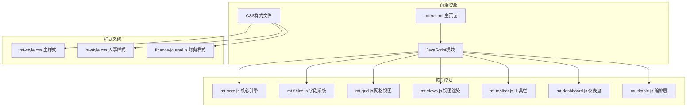
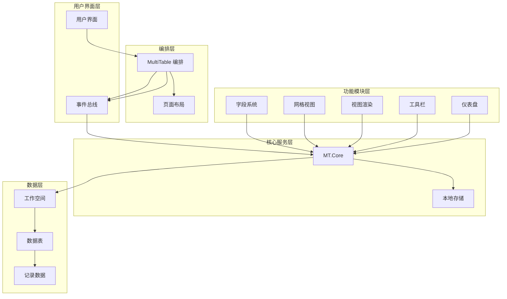
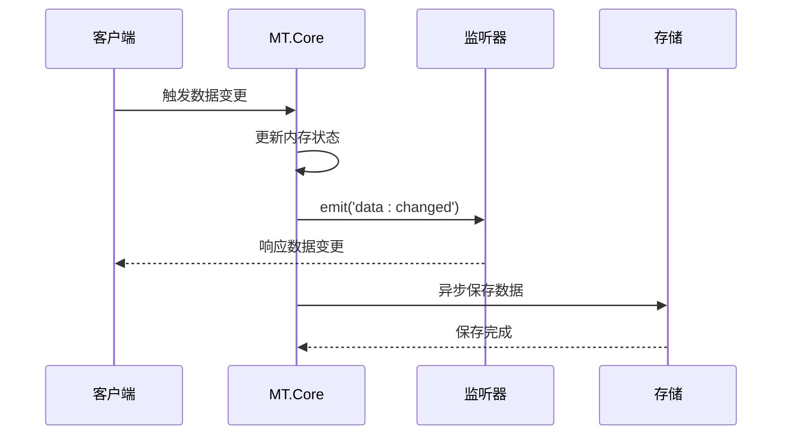
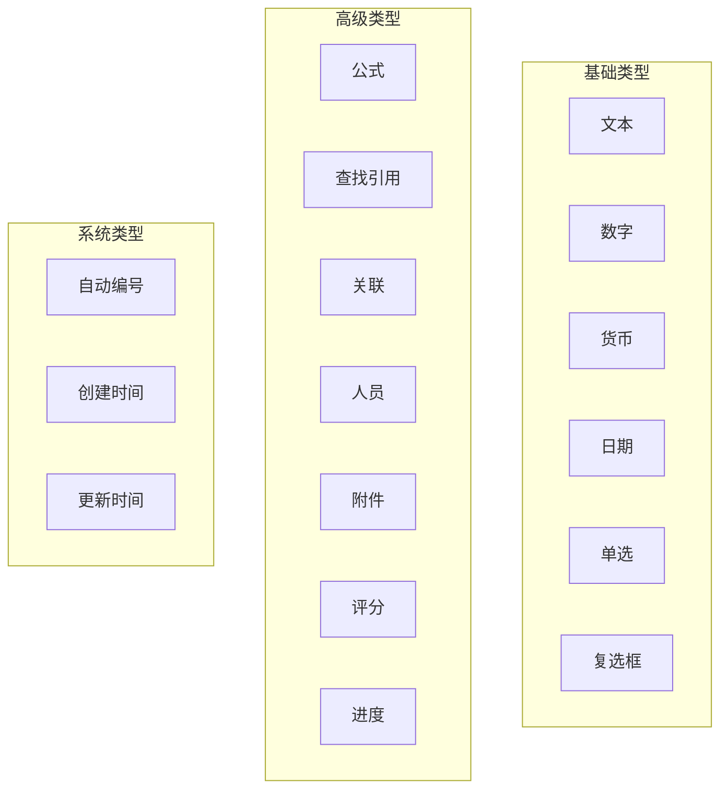
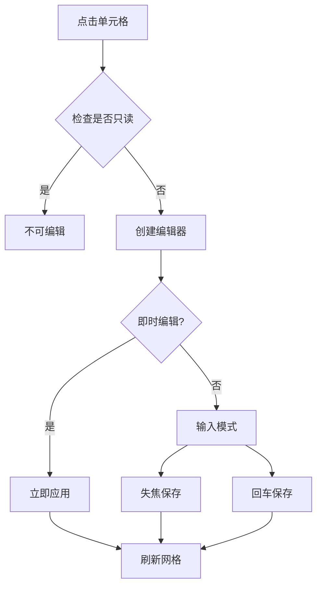
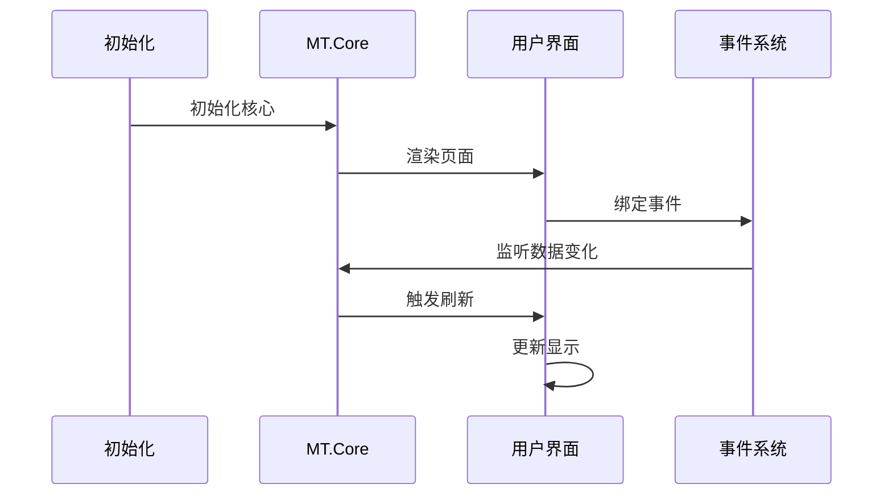
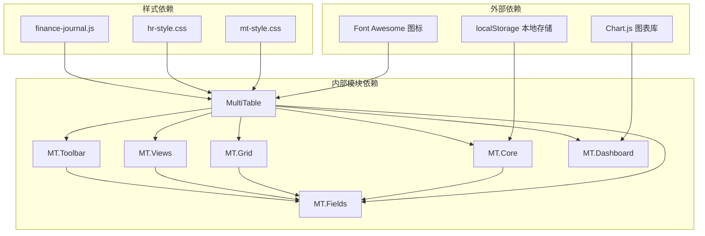

# 多维表格系统

<cite>
**本文档引用的文件**
- [README.md](file://README.md)
- [index.html](file://index.html)
- [mt-core.js](file://js/mt-core.js)
- [mt-fields.js](file://js/mt-fields.js)
- [mt-grid.js](file://js/mt-grid.js)
- [mt-views.js](file://js/mt-views.js)
- [mt-toolbar.js](file://js/mt-toolbar.js)
- [mt-dashboard.js](file://js/mt-dashboard.js)
- [multitable.js](file://js/multitable.js)
- [mt-style.css](file://css/mt-style.css)
</cite>

## 目录
1. [简介](#简介)
2. [项目结构](#项目结构)
3. [核心组件](#核心组件)
4. [架构概览](#架构概览)
5. [详细组件分析](#详细组件分析)
6. [依赖关系分析](#依赖关系分析)
7. [性能考虑](#性能考虑)
8. [故障排除指南](#故障排除指南)
9. [结论](#结论)
10. [附录](#附录)

## 简介
多维表格系统是一个基于纯前端技术构建的数据管理平台，支持多种视图模式（网格、看板、画廊、甘特图、日历、表单）、丰富的字段类型、强大的工具栏功能以及可定制的仪表盘。系统采用模块化设计，通过事件总线实现组件间解耦，并提供本地存储持久化能力。

该系统的核心设计理念是"所见即所得"的数据管理体验，用户可以通过直观的界面操作完成复杂的数据管理工作，同时保持良好的性能表现和用户体验。

## 项目结构
多维表格系统采用清晰的模块化架构，主要文件组织如下：



**图表来源**
- [index.html:1-381](file://index.html#L1-L381)
- [mt-core.js:1-859](file://js/mt-core.js#L1-L859)
- [mt-fields.js:1-632](file://js/mt-fields.js#L1-L632)

**章节来源**
- [index.html:1-381](file://index.html#L1-L381)
- [README.md:48-65](file://README.md#L48-L65)

## 核心组件
多维表格系统由七个核心模块组成，每个模块都有明确的职责分工：

### MT.Core - 核心引擎
负责数据持久化、CRUD操作、事件总线、撤销重做、公式计算等核心功能。提供统一的数据访问接口和状态管理。

### MT.Fields - 字段系统
管理23种字段类型，包括基础类型（文本、数字、日期等）和高级类型（公式、查找引用、关联等）。提供字段渲染、编辑器创建、配置解析等功能。

### MT.Grid - 网格视图
实现增强的表格视图，支持分组、冻结列、条件着色、行高调整、键盘导航、复制粘贴等高级功能。

### MT.Views - 视图渲染
提供多种视图模式的渲染逻辑，包括看板、画廊、甘特图、日历、表单等视图的完整实现。

### MT.Toolbar - 工具栏
集成筛选、排序、分组、隐藏字段、行高、条件着色等工具面板，提供可视化的数据操作界面。

### MT.Dashboard - 仪表盘
实现可拖拽的仪表盘系统，支持多种图表类型和统计组件，提供数据可视化功能。

### MultiTable - 编排层
作为Facade层协调各个模块，处理页面布局、事件委托、记录详情面板等前端交互逻辑。

**章节来源**
- [mt-core.js:8-117](file://js/mt-core.js#L8-L117)
- [mt-fields.js:5-632](file://js/mt-fields.js#L5-L632)
- [mt-grid.js:6-358](file://js/mt-grid.js#L6-L358)
- [mt-views.js:5-379](file://js/mt-views.js#L5-L379)
- [mt-toolbar.js:6-394](file://js/mt-toolbar.js#L6-L394)
- [mt-dashboard.js:1-493](file://js/mt-dashboard.js#L1-L493)
- [multitable.js:7-624](file://js/multitable.js#L7-L624)

## 架构概览
系统采用模块化架构，通过事件总线实现松耦合的组件通信：



**图表来源**
- [multitable.js:13-43](file://js/multitable.js#L13-L43)
- [mt-core.js:15-61](file://js/mt-core.js#L15-L61)
- [mt-fields.js:5-632](file://js/mt-fields.js#L5-L632)

系统采用以下设计原则：
- **模块化设计**：每个功能模块独立封装，职责单一
- **事件驱动**：通过事件总线实现组件间通信
- **数据持久化**：使用localStorage实现数据本地存储
- **可扩展性**：提供插件机制和配置接口

## 详细组件分析

### MT.Core - 数据层核心
MT.Core是整个系统的核心引擎，提供以下关键功能：

#### 数据模型设计
系统采用层次化的数据模型：
- Workspace：顶层工作空间，包含多个数据表
- Table：数据表，包含字段定义和记录集合
- Record：具体记录，包含字段值和元数据
- View：视图配置，定义数据展示方式

#### 事件总线机制


**图表来源**
- [mt-core.js:20-33](file://js/mt-core.js#L20-L33)
- [mt-core.js:51-69](file://js/mt-core.js#L51-L69)

#### CRUD操作实现
MT.Core提供完整的CRUD操作：
- **表操作**：添加、重命名、删除、切换、复制
- **字段操作**：添加、删除、重命名、配置更新、重新排序
- **记录操作**：添加、更新、删除、批量更新、复制

#### 数据管道处理
系统实现多层数据处理管道：
1. **过滤**：应用筛选条件
2. **排序**：按指定字段排序
3. **搜索**：全文搜索匹配
4. **分组**：按字段分组显示

**章节来源**
- [mt-core.js:98-167](file://js/mt-core.js#L98-L167)
- [mt-core.js:394-474](file://js/mt-core.js#L394-L474)

### MT.Fields - 字段系统
字段系统支持23种不同的字段类型，每种类型都有特定的渲染和编辑行为：

#### 字段类型分类


**图表来源**
- [mt-fields.js:6-30](file://js/mt-fields.js#L6-L30)

#### 字段渲染机制
字段渲染采用统一的接口，支持：
- **单元格渲染**：在网格视图中显示字段值
- **详情面板渲染**：在记录详情中显示和编辑字段
- **表单渲染**：在表单视图中显示字段

#### 编辑器系统
系统提供多种编辑器类型：
- **即时编辑器**：支持快速编辑（复选框、评分等）
- **下拉编辑器**：用于选择类字段（单选、多选等）
- **弹窗编辑器**：用于复杂字段（附件、关联等）
- **文本编辑器**：用于文本类字段

**章节来源**
- [mt-fields.js:56-157](file://js/mt-fields.js#L56-L157)
- [mt-fields.js:159-255](file://js/mt-fields.js#L159-L255)

### MT.Grid - 网格视图
网格视图是系统的主要数据展示界面，提供丰富的交互功能：

#### 核心功能特性
- **分组显示**：支持按字段分组，可折叠/展开
- **冻结列**：可将常用列冻结在左侧
- **条件着色**：根据规则自动着色
- **行高调整**：支持紧凑、标准、宽松三种行高
- **键盘导航**：完整的键盘操作支持

#### 编辑功能


**图表来源**
- [mt-grid.js:161-208](file://js/mt-grid.js#L161-L208)

#### 高级功能
- **复制粘贴**：支持单元格、行、区域的复制粘贴
- **列宽调整**：拖拽调整列宽，支持响应式布局
- **全选功能**：支持批量选择和操作
- **搜索功能**：全局搜索和高亮显示

**章节来源**
- [mt-grid.js:14-98](file://js/mt-grid.js#L14-L98)
- [mt-grid.js:160-266](file://js/mt-grid.js#L160-L266)

### MT.Views - 视图渲染系统
系统提供六种不同的视图模式，每种视图都有特定的适用场景：

#### 看板视图
适用于项目管理和任务跟踪，支持：
- **状态分组**：按任务状态分组显示
- **拖拽操作**：支持卡片拖拽改变状态
- **自定义字段**：可配置卡片显示字段
- **封面图片**：支持附件作为卡片封面

#### 画廊视图
适用于媒体管理和内容展示：
- **网格布局**：可配置每行列数
- **封面展示**：支持图片封面显示
- **字段摘要**：显示关键信息摘要

#### 甘特图视图
适用于项目计划和进度管理：
- **时间轴**：支持日、周、月三种缩放级别
- **进度条**：直观显示任务进度
- **时间线**：显示当前时间线
- **字段配置**：可配置开始/结束日期字段

#### 日历视图
适用于日程安排和事件管理：
- **月视图**：完整的月份日历
- **导航控制**：前后月导航
- **事件标记**：在日期上标记事件
- **字段配置**：可配置日期字段

#### 表单视图
适用于数据录入和表单提交：
- **字段映射**：可配置表单字段
- **验证规则**：支持必填等验证
- **提交处理**：自动创建新记录
- **成功反馈**：提交后的成功提示

**章节来源**
- [mt-views.js:7-65](file://js/mt-views.js#L7-L65)
- [mt-views.js:67-103](file://js/mt-views.js#L67-L103)
- [mt-views.js:105-194](file://js/mt-views.js#L105-L194)
- [mt-views.js:196-277](file://js/mt-views.js#L196-L277)
- [mt-views.js:288-378](file://js/mt-views.js#L288-L378)

### MT.Toolbar - 工具栏系统
工具栏提供可视化的数据操作界面：

#### 面板功能
- **筛选面板**：支持多种筛选条件组合
- **排序面板**：支持多字段排序
- **分组面板**：支持按字段分组
- **隐藏字段面板**：控制字段显示/隐藏
- **行高面板**：调整行高设置
- **条件着色面板**：配置条件着色规则

#### 集成功能
- **CSV导入导出**：支持数据导入导出
- **撤销重做**：支持操作撤销重做
- **搜索功能**：全局搜索框
- **快捷操作**：批量删除等快捷操作

**章节来源**
- [mt-toolbar.js:9-36](file://js/mt-toolbar.js#L9-L36)
- [mt-toolbar.js:50-132](file://js/mt-toolbar.js#L50-L132)
- [mt-toolbar.js:167-197](file://js/mt-toolbar.js#L167-L197)

### MT.Dashboard - 仪表盘系统
仪表盘提供数据可视化和统计功能：

#### 组件类型
- **统计卡片**：显示关键指标和趋势
- **图表组件**：支持柱状图、折线图、饼图等多种图表
- **表格组件**：显示数据表格
- **进度组件**：显示状态分布或数值进度
- **列表组件**：显示简要列表信息

#### 布局系统
- **网格布局**：12列网格系统
- **拖拽调整**：支持组件位置和大小调整
- **响应式设计**：适应不同屏幕尺寸

**章节来源**
- [mt-dashboard.js:8-25](file://js/mt-dashboard.js#L8-L25)
- [mt-dashboard.js:27-60](file://js/mt-dashboard.js#L27-L60)
- [mt-dashboard.js:104-172](file://js/mt-dashboard.js#L104-L172)

### MultiTable - 编排层
MultiTable作为Facade层协调各个模块：

#### 生命周期管理


**图表来源**
- [multitable.js:13-29](file://js/multitable.js#L13-L29)

#### 事件处理
- **页面事件**：处理用户交互事件
- **数据事件**：监听核心数据变化
- **视图切换**：管理视图模式切换
- **模态框管理**：统一管理各种对话框

**章节来源**
- [multitable.js:45-162](file://js/multitable.js#L45-L162)
- [multitable.js:177-380](file://js/multitable.js#L177-L380)

## 依赖关系分析



**图表来源**
- [index.html:10-12](file://index.html#L10-L12)
- [index.html:369-378](file://index.html#L369-L378)

### 模块耦合分析
- **低耦合设计**：各模块通过事件总线通信，减少直接依赖
- **清晰边界**：每个模块职责明确，接口稳定
- **可替换性**：字段渲染器、视图渲染器等可独立替换

### 循环依赖检测
系统采用单向依赖结构，避免了循环依赖问题：
- MultiTable → 所有功能模块
- 功能模块 → MT.Core
- MT.Core → 无外部依赖

**章节来源**
- [multitable.js:1-624](file://js/multitable.js#L1-L624)
- [mt-core.js:1-859](file://js/mt-core.js#L1-L859)

## 性能考虑

### 数据处理优化
- **虚拟滚动**：对于大量数据采用虚拟滚动技术
- **增量更新**：只更新发生变化的部分DOM
- **防抖机制**：输入事件采用防抖处理
- **缓存策略**：字段配置和渲染结果缓存

### 内存管理
- **对象池**：复用DOM元素和JavaScript对象
- **垃圾回收**：及时清理事件监听器和定时器
- **内存泄漏防护**：确保组件销毁时清理所有资源

### 网络和存储
- **本地存储**：使用localStorage减少网络请求
- **批量操作**：支持批量数据操作
- **增量同步**：支持数据增量更新

### 用户体验优化
- **响应式设计**：适配不同设备和屏幕尺寸
- **加载指示**：长时间操作显示加载状态
- **错误处理**：友好的错误提示和恢复机制

## 故障排除指南

### 常见问题诊断

#### 数据丢失问题
**症状**：刷新页面后数据消失
**原因**：localStorage存储空间不足或浏览器设置阻止
**解决方案**：
1. 检查浏览器localStorage容量
2. 确认浏览器未禁用localStorage
3. 检查浏览器隐私设置

#### 视图渲染异常
**症状**：某些视图无法正常显示
**原因**：字段类型不匹配或配置错误
**解决方案**：
1. 检查字段配置是否正确
2. 验证字段类型与视图兼容性
3. 重新创建有问题的视图

#### 性能问题
**症状**：页面响应缓慢
**原因**：数据量过大或视图复杂度过高
**解决方案**：
1. 使用筛选和分页功能
2. 减少同时显示的字段数量
3. 优化复杂的公式字段

### 调试工具
系统提供以下调试功能：
- **控制台日志**：详细的操作日志
- **状态检查**：查看当前工作空间状态
- **事件监控**：监控组件间通信

**章节来源**
- [mt-core.js:70-74](file://js/mt-core.js#L70-L74)
- [mt-core.js:476-565](file://js/mt-core.js#L476-L565)

## 结论
多维表格系统通过模块化设计和事件驱动架构，实现了功能丰富、性能优良的数据管理平台。系统的主要优势包括：

### 技术优势
- **模块化架构**：清晰的职责分离和低耦合设计
- **事件驱动**：灵活的组件通信机制
- **可扩展性**：完善的扩展接口和配置系统
- **性能优化**：针对大数据量的优化策略

### 用户价值
- **易用性**：直观的界面和丰富的交互功能
- **灵活性**：多种视图模式满足不同需求
- **可视化**：强大的数据可视化能力
- **协作性**：支持团队协作和数据共享

### 发展前景
系统具备良好的扩展基础，可以进一步：
- 集成云端同步功能
- 增加更多视图和字段类型
- 优化移动端用户体验
- 增强数据安全和权限管理

## 附录

### 使用示例

#### 创建新数据表
```javascript
// 添加新表
MT.Core.addTable('项目管理');

// 添加字段
MT.Core.addField({
    name: '项目名称',
    type: 'text',
    isPrimary: true
});

MT.Core.addField({
    name: '状态',
    type: 'select',
    config: {
        options: [
            { label: '未开始', color: 8 },
            { label: '进行中', color: 0 },
            { label: '已完成', color: 1 }
        ]
    }
});
```

#### 自定义视图
```javascript
// 创建看板视图
MT.Core.addView('kanban', {
    kanbanField: '状态',
    kanbanCardFields: ['项目名称', '负责人'],
    kanbanCardCover: '附件'
});
```

#### 数据导入
```javascript
// CSV导入
const csvText = `项目名称,状态,负责人
项目A,进行中,张三
项目B,未开始,李四`;
MT.Core.importCSV(csvText);
```

### 配置选项

#### 字段配置
- **文本字段**：支持长度限制和占位符
- **数字字段**：支持小数位数和范围限制
- **日期字段**：支持日期格式和范围验证
- **选择字段**：支持颜色配置和选项管理

#### 视图配置
- **网格视图**：列宽、冻结列、行高、条件着色
- **看板视图**：分组字段、卡片字段、封面配置
- **甘特图**：时间字段、缩放级别、进度字段
- **日历视图**：日期字段、视图模式、颜色配置

#### 仪表盘配置
- **组件类型**：统计卡片、图表、表格、进度、列表
- **数据源**：表选择、字段映射、聚合方式
- **布局**：网格定位、尺寸调整、响应式设计

**章节来源**
- [mt-core.js:118-167](file://js/mt-core.js#L118-L167)
- [mt-fields.js:559-630](file://js/mt-fields.js#L559-L630)
- [mt-views.js:326-378](file://js/mt-views.js#L326-L378)
- [mt-dashboard.js:317-407](file://js/mt-dashboard.js#L317-L407)