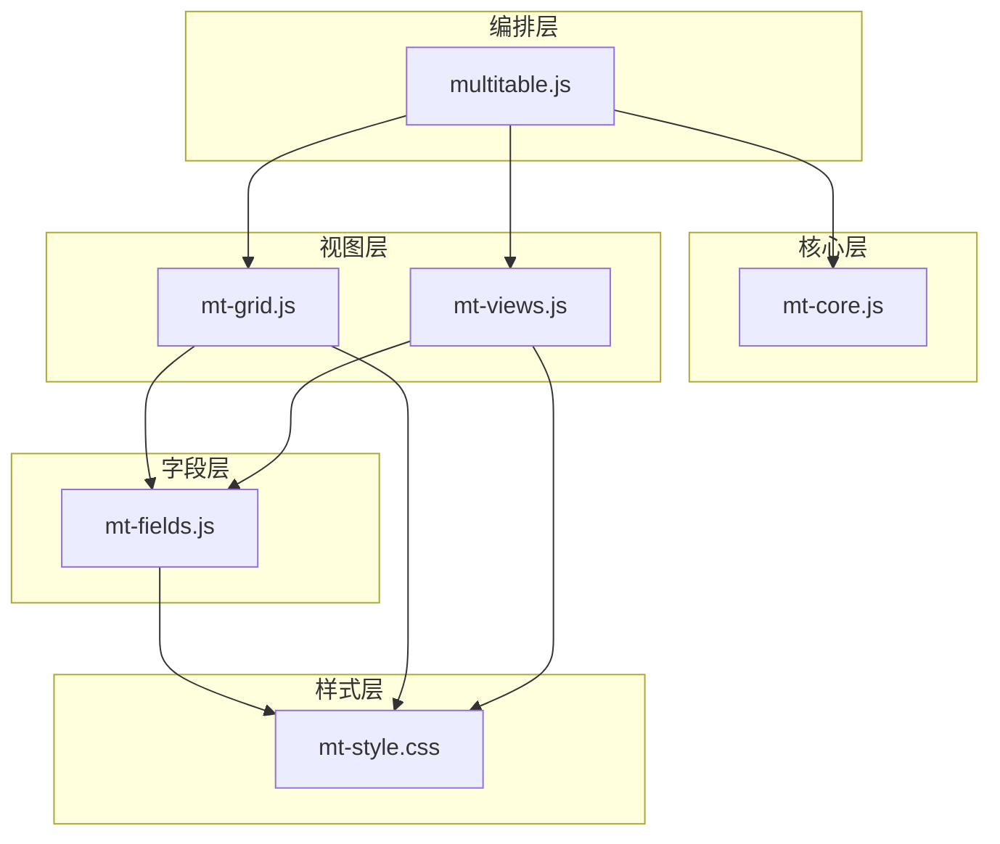
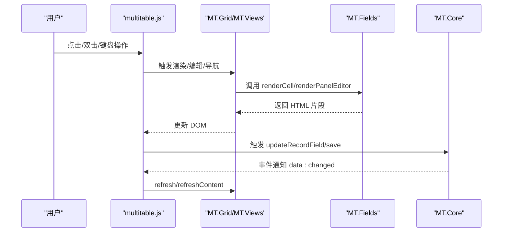
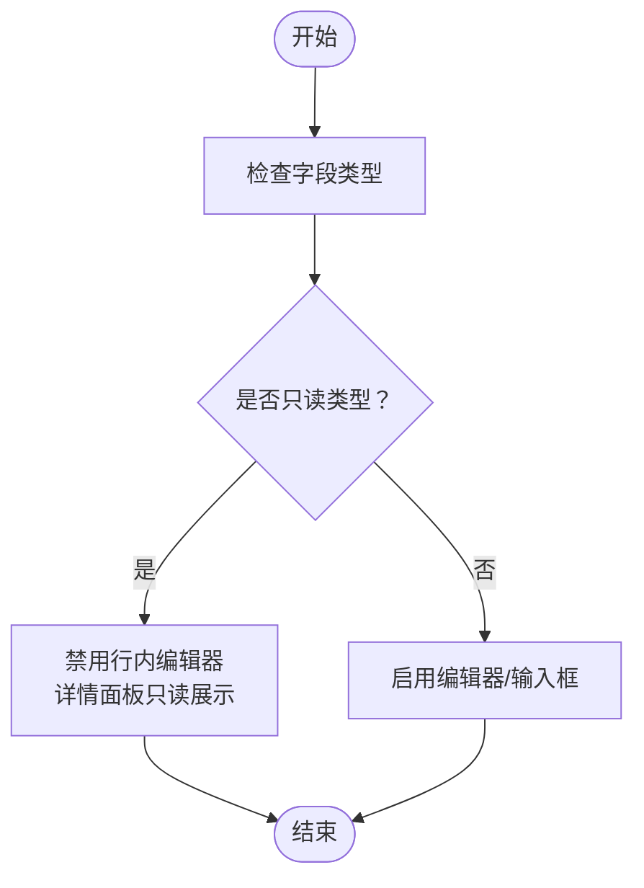
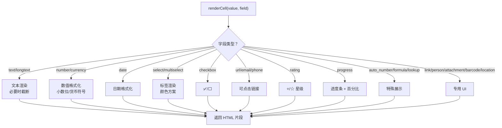
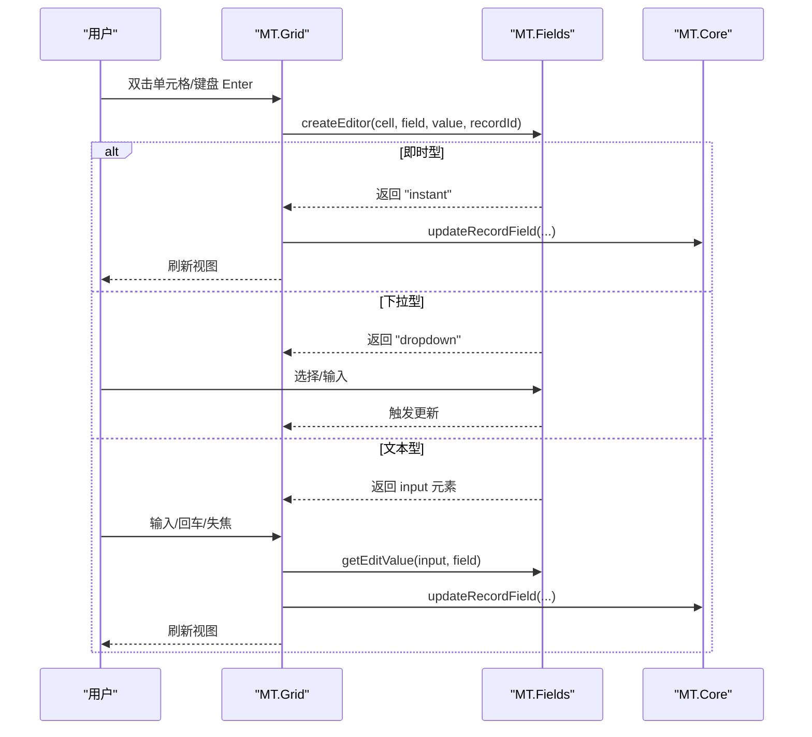
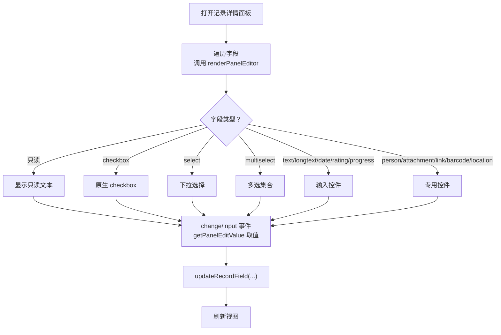
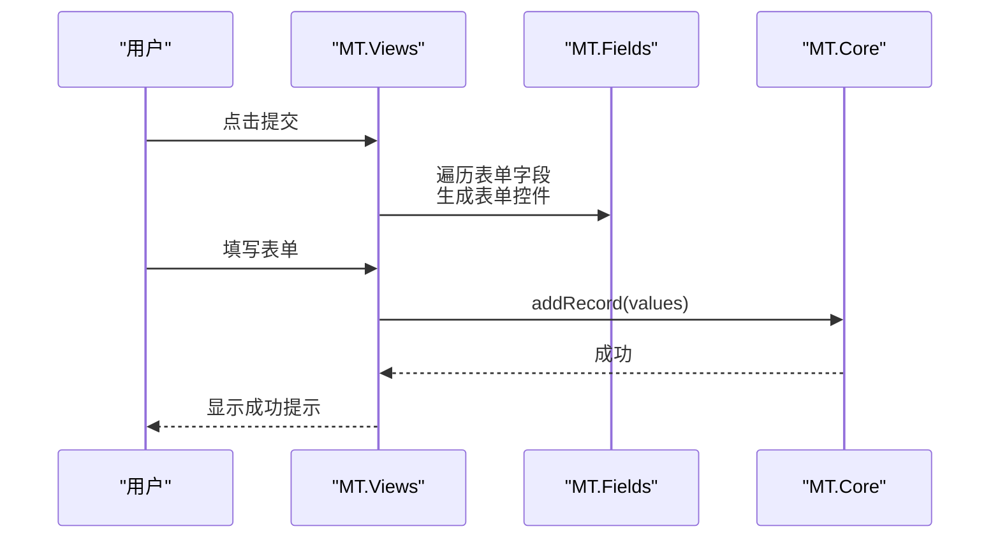
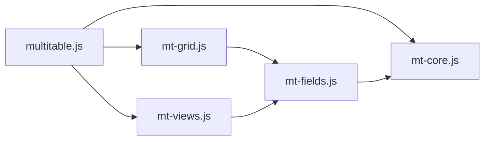

# 字段渲染

<cite>
**本文档引用的文件**
- [mt-fields.js](file://js/mt-fields.js)
- [mt-grid.js](file://js/mt-grid.js)
- [mt-views.js](file://js/mt-views.js)
- [mt-core.js](file://js/mt-core.js)
- [multitable.js](file://js/multitable.js)
- [mt-style.css](file://css/mt-style.css)
- [index.html](file://index.html)
</cite>

## 目录
1. [简介](#简介)
2. [项目结构](#项目结构)
3. [核心组件](#核心组件)
4. [架构总览](#架构总览)
5. [详细组件分析](#详细组件分析)
6. [依赖关系分析](#依赖关系分析)
7. [性能考虑](#性能考虑)
8. [故障排查指南](#故障排查指南)
9. [结论](#结论)
10. [附录](#附录)

## 简介
本文件面向“陈苗多维表格”字段渲染系统，系统性阐述字段在不同视图中的渲染机制，涵盖网格视图、详情面板、表单视图等场景。重点说明：
- 字段类型与渲染规则：如何根据字段类型生成 HTML 输出、应用样式与交互行为
- 只读状态处理：哪些字段类型不可编辑，以及在不同视图中的呈现差异
- 空值与错误状态：空值、null、undefined 的统一处理，公式错误的可视化提示
- 性能优化：批量渲染、虚拟滚动、事件委托与最小 DOM 更新策略
- 扩展与定制：如何开发自定义渲染器与满足特殊渲染需求

## 项目结构
多维表格采用“编排层 + 核心层 + 视图层 + 字段层 + 样式层”的分层架构：
- 编排层（multitable.js）负责页面布局、事件委托、模块协调与记录详情面板
- 核心层（mt-core.js）负责工作区、表、视图、记录、字段的 CRUD 与数据管道
- 视图层（mt-grid.js、mt-views.js）负责网格、看板、画廊、甘特图、日历、表单等视图渲染
- 字段层（mt-fields.js）负责字段类型识别、单元格渲染、编辑器创建与面板编辑器
- 样式层（mt-style.css）提供统一的视觉规范与交互反馈

**图表来源**
- [multitable.js:45-162](file://js/multitable.js#L45-L162)
- [mt-core.js:8-34](file://js/mt-core.js#L8-L34)
- [mt-grid.js:14-37](file://js/mt-grid.js#L14-L37)
- [mt-views.js:7-65](file://js/mt-views.js#L7-L65)
- [mt-fields.js:57-157](file://js/mt-fields.js#L57-L157)
- [mt-style.css:462-620](file://css/mt-style.css#L462-L620)

**章节来源**
- [index.html:370-379](file://index.html#L370-L379)
- [multitable.js:13-43](file://js/multitable.js#L13-L43)

## 核心组件
- 字段类型与渲染器（MT.Fields）
  - 类型枚举与图标/标签映射
  - 只读类型判定
  - 单元格渲染（renderCell）
  - 行内编辑器创建（createEditor）与取值（getEditValue）
  - 详情面板编辑器（renderPanelEditor）与取值（getPanelEditValue）
  - 添加字段对话框与配置解析
- 网格视图（MT.Grid）
  - 可见字段排序与冻结列
  - 行高控制
  - 条件着色（行/单元格）
  - 编辑流程（开始/结束编辑、键盘导航、复制粘贴、列宽拖拽）
- 视图渲染（MT.Views）
  - 看板、画廊、甘特图、日历、表单视图
  - 在各视图中复用字段渲染器
- 核心数据与事件（MT.Core）
  - 工作区、表、视图、记录、字段的 CRUD
  - 数据管道（过滤、排序、搜索、分组）
  - 公式与查找引用计算
  - 事件总线与持久化
- 编排层（multitable.js）
  - 页面骨架、侧边栏、顶部视图标签
  - 事件委托与视图切换
  - 记录详情面板的打开/关闭与字段变更处理

**章节来源**
- [mt-fields.js:5-632](file://js/mt-fields.js#L5-L632)
- [mt-grid.js:6-358](file://js/mt-grid.js#L6-L358)
- [mt-views.js:5-379](file://js/mt-views.js#L5-L379)
- [mt-core.js:8-800](file://js/mt-core.js#L8-L800)
- [multitable.js:7-624](file://js/multitable.js#L7-L624)

## 架构总览
字段渲染贯穿“读取数据 → 选择渲染器 → 生成HTML → 应用样式 → 绑定交互”的完整链路。在不同视图中，渲染器被复用，但交互方式与样式略有差异。

**图表来源**
- [multitable.js:178-308](file://js/multitable.js#L178-L308)
- [mt-grid.js:161-208](file://js/mt-grid.js#L161-L208)
- [mt-views.js:289-379](file://js/mt-views.js#L289-L379)
- [mt-fields.js:57-157](file://js/mt-fields.js#L57-L157)
- [mt-core.js:20-33](file://js/mt-core.js#L20-L33)

## 详细组件分析

### 字段类型与只读状态
- 类型识别与图标/标签
  - 类型清单包含基础、选择、高级、系统、关联等类别
  - 提供 getTypeIcon/getTypeLabel 辅助函数
- 只读类型判定
  - isReadOnly 返回 true 的类型：created_time、updated_time、auto_number、formula、lookup
  - 这些类型在网格视图的行内编辑器中被禁用，在详情面板中以只读展示

**图表来源**
- [mt-fields.js:52-54](file://js/mt-fields.js#L52-L54)
- [mt-fields.js:160-195](file://js/mt-fields.js#L160-L195)
- [mt-fields.js:426-440](file://js/mt-fields.js#L426-L440)

**章节来源**
- [mt-fields.js:5-30](file://js/mt-fields.js#L5-L30)
- [mt-fields.js:52-54](file://js/mt-fields.js#L52-L54)

### 单元格渲染（Grid Cell）
- 统一入口：renderCell(value, field)
- 渲染策略
  - 文本/长文本：截断与省略
  - 数字/货币：格式化与小数位控制
  - 日期：本地化日期格式
  - 选择/多选：带颜色的主题标签
  - 复选框：emoji 显示
  - 链接/邮箱/电话：可点击的锚点
  - 评分/进度：星级与进度条
  - 自动编号/公式/查找引用：特殊展示
  - 关联/人员/附件/条码/地理位置：专用 UI
  - 空值：统一为空字符串，避免渲染异常
- 样式类
  - 使用 .mt-v-* 前缀的类名，配合 mt-style.css 控制外观

**图表来源**
- [mt-fields.js:57-157](file://js/mt-fields.js#L57-L157)
- [mt-style.css:724-830](file://css/mt-style.css#L724-L830)

**章节来源**
- [mt-fields.js:57-157](file://js/mt-fields.js#L57-L157)
- [mt-style.css:724-830](file://css/mt-style.css#L724-L830)

### 行内编辑器（Grid Inline Editor）
- 启动条件
  - 非只读字段
  - 双击单元格或键盘 Enter
- 编辑器类型
  - 即时型：checkbox/rating 直接更新
  - 下拉型：select/multiselect/person/link/attachment
  - 文本型：text/longtext/date/number/currency/url/email/phone/barcode/location
- 结束编辑
  - 失焦或回车触发 getEditValue 取值并调用 updateRecordField
  - 触发 view:refresh 重新渲染

**图表来源**
- [mt-grid.js:161-194](file://js/mt-grid.js#L161-L194)
- [mt-fields.js:160-286](file://js/mt-fields.js#L160-L286)
- [mt-fields.js:257-263](file://js/mt-fields.js#L257-L263)

**章节来源**
- [mt-grid.js:161-208](file://js/mt-grid.js#L161-L208)
- [mt-fields.js:160-286](file://js/mt-fields.js#L160-L286)
- [mt-fields.js:257-263](file://js/mt-fields.js#L257-L263)

### 详情面板编辑器（Record Panel）
- 入口：点击记录或双击行号
- 渲染策略
  - 只读类型：显示只读文本
  - 复选框：原生 checkbox
  - 单选/多选：select/复选框集合
  - 文本/长文本/日期/评分/进度：对应输入控件
  - 人员/附件/关联/条码/地理位置：专用控件
- 保存策略
  - change/input 事件触发 getPanelEditValue 取值并更新
  - 使用防抖（300ms）减少频繁写入

**图表来源**
- [multitable.js:408-458](file://js/multitable.js#L408-L458)
- [mt-fields.js:426-527](file://js/mt-fields.js#L426-L527)
- [mt-fields.js:520-527](file://js/mt-fields.js#L520-L527)

**章节来源**
- [multitable.js:408-458](file://js/multitable.js#L408-L458)
- [mt-fields.js:426-527](file://js/mt-fields.js#L426-L527)
- [mt-fields.js:520-527](file://js/mt-fields.js#L520-L527)

### 表单视图编辑器（Form View）
- 入口：视图类型为 form
- 渲染策略
  - 仅渲染非只读字段
  - 根据字段类型生成对应表单控件（input/select/textarea/range/checkbox 等）
  - 支持必填标记与帮助文本
- 提交流程
  - 收集表单值，调用 addRecord 并显示成功提示

**图表来源**
- [mt-views.js:289-379](file://js/mt-views.js#L289-L379)
- [mt-fields.js:314-348](file://js/mt-fields.js#L314-L348)

**章节来源**
- [mt-views.js:289-379](file://js/mt-views.js#L289-L379)
- [mt-fields.js:314-348](file://js/mt-fields.js#L314-L348)

### 网格视图与条件着色
- 可见字段与冻结列
  - 支持 fieldOrder 与 hiddenFields 控制列顺序与可见性
  - 冻结列使用 position: sticky 保持左侧列固定
- 行高控制
  - compact/tall/medium 三种行高，影响 .mt-g-cell/.mt-gh-cell 的高度
- 条件着色
  - 行级与单元格级颜色规则匹配（等于/不等于/包含/大小比较/空值/布尔值等）
- 键盘导航与复制粘贴
  - Arrow keys 移动焦点，Enter 开始编辑，Delete 清空单元格
  - Ctrl+C/Ctrl+V 支持单值与多单元格粘贴

**章节来源**
- [mt-grid.js:39-52](file://js/mt-grid.js#L39-L52)
- [mt-grid.js:124-158](file://js/mt-grid.js#L124-L158)
- [mt-grid.js:210-266](file://js/mt-grid.js#L210-L266)
- [mt-grid.js:268-325](file://js/mt-grid.js#L268-L325)

### 其他视图中的字段渲染
- 看板视图：卡片字段使用 renderCell 渲染，支持封面图
- 画廊视图：卡片字段使用 renderCell 渲染，支持封面图
- 甘特图/日历/表单：均通过字段层统一渲染，确保一致性

**章节来源**
- [mt-views.js:7-103](file://js/mt-views.js#L7-L103)
- [mt-views.js:105-194](file://js/mt-views.js#L105-L194)
- [mt-views.js:196-277](file://js/mt-views.js#L196-L277)
- [mt-views.js:289-379](file://js/mt-views.js#L289-L379)

## 依赖关系分析
- 组件耦合
  - multitable.js 依赖 MT.Core、MT.Fields、MT.Grid、MT.Views、MT.Toolbar、MT.Dashboard
  - MT.Grid 依赖 MT.Fields 与 MT.Core
  - MT.Views 依赖 MT.Fields 与 MT.Core
  - MT.Fields 依赖 MT.Core（格式化、默认值、配置）
- 事件流
  - MT.Core.emit('data:changed') 推动 multitable.js 刷新
  - MT.Core.emit('view:refresh') 推动视图局部刷新

**图表来源**
- [multitable.js:20-29](file://js/multitable.js#L20-L29)
- [mt-grid.js:161-172](file://js/mt-grid.js#L161-L172)
- [mt-views.js:289-308](file://js/mt-views.js#L289-L308)
- [mt-fields.js:57-93](file://js/mt-fields.js#L57-L93)

**章节来源**
- [multitable.js:20-29](file://js/multitable.js#L20-L29)
- [mt-grid.js:161-172](file://js/mt-grid.js#L161-L172)
- [mt-views.js:289-308](file://js/mt-views.js#L289-L308)
- [mt-fields.js:57-93](file://js/mt-fields.js#L57-L93)

## 性能考虑
- 渲染性能
  - 单元格渲染采用轻量 HTML 拼接，避免复杂 DOM 结构
  - 长文本截断与 ellipsis，减少渲染压力
  - 仅在必要时创建输入元素，下拉编辑器延迟挂载
- 交互性能
  - 行内编辑器即时更新（checkbox/rating），减少 DOM 变更
  - 详情面板输入使用 300ms 防抖，降低频繁写入
  - 键盘导航与复制粘贴在网格中实现，避免全表重绘
- 数据管道
  - 过滤/排序/搜索/分组在 MT.Core.apply* 中集中实现，减少重复计算
  - 公式与查找引用在 recalcComputedFields 中批量计算

**章节来源**
- [mt-fields.js:57-157](file://js/mt-fields.js#L57-L157)
- [mt-grid.js:161-208](file://js/mt-grid.js#L161-L208)
- [multitable.js:445-457](file://js/multitable.js#L445-L457)
- [mt-core.js:394-474](file://js/mt-core.js#L394-L474)
- [mt-core.js:628-650](file://js/mt-core.js#L628-L650)

## 故障排查指南
- 字段未显示或显示异常
  - 检查字段类型是否在 TYPES 中定义
  - 确认字段 config 是否正确（如 options、symbol、decimals、max 等）
- 编辑无效或报错
  - 确认字段类型不在只读列表中
  - 检查 getEditValue/getPanelEditValue 的取值逻辑
  - 查看 MT.Core.updateRecordField 的调用是否成功
- 公式/查找引用错误
  - 公式返回 “#ERROR” 时，字段层会以红色显示错误提示
  - 查找引用需正确配置 linkFieldId、sourceTableId、sourceFieldId
- 视图刷新不生效
  - 确认事件监听是否正常（data:changed/view:refresh）
  - 检查 MT.Core.save() 是否触发持久化

**章节来源**
- [mt-fields.js:52-54](file://js/mt-fields.js#L52-L54)
- [mt-fields.js:111-117](file://js/mt-fields.js#L111-L117)
- [mt-fields.js:641-650](file://js/mt-fields.js#L641-L650)
- [mt-core.js:20-33](file://js/mt-core.js#L20-L33)
- [mt-core.js:51-61](file://js/mt-core.js#L51-L61)

## 结论
字段渲染系统通过“类型识别 + 渲染器 + 样式 + 交互”的清晰分层，实现了在网格、详情面板、表单等多种视图中的一致体验。其设计强调：
- 可维护性：字段类型与渲染逻辑解耦，便于扩展
- 可靠性：只读状态、空值与错误状态的统一处理
- 可扩展性：下拉编辑器与专用控件为复杂字段提供定制能力
- 可用性：键盘导航、复制粘贴、条件着色等提升效率

## 附录

### 字段类型与渲染对照（摘要）
- 文本/长文本：文本渲染，长文本截断
- 数字/货币：数值格式化，货币符号与小数位
- 日期：本地化日期格式
- 单选/多选：颜色标签，多选为标签集合
- 复选框：emoji 显示
- 链接/邮箱/电话：可点击链接
- 评分：星级显示
- 进度：进度条 + 百分比
- 自动编号/公式/查找引用：特殊展示
- 关联/人员/附件/条码/地理位置：专用 UI

**章节来源**
- [mt-fields.js:57-157](file://js/mt-fields.js#L57-L157)
- [mt-style.css:724-830](file://css/mt-style.css#L724-L830)