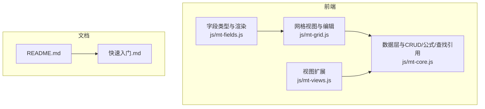
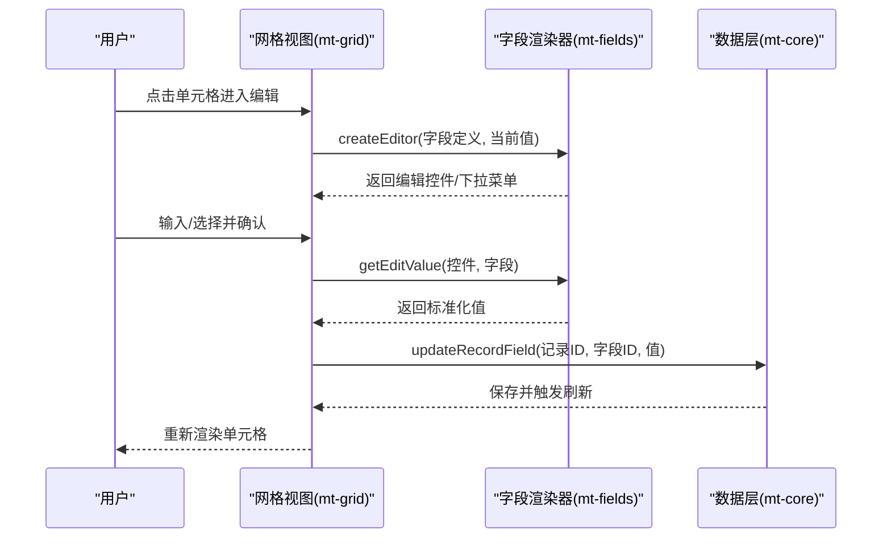
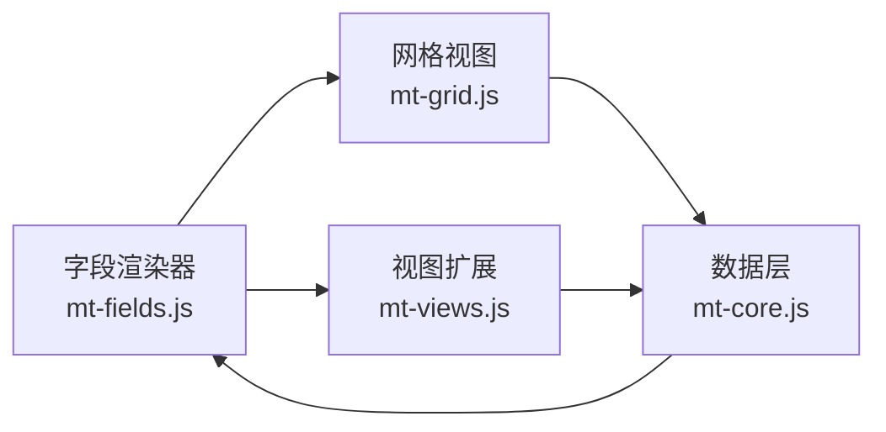

# 字段类型

<cite>
**本文档引用的文件**
- [mt-fields.js](file://js/mt-fields.js)
- [mt-grid.js](file://js/mt-grid.js)
- [mt-core.js](file://js/mt-core.js)
- [mt-views.js](file://js/mt-views.js)
- [README.md](file://README.md)
- [快速入门.md](file://快速入门.md)
</cite>

## 目录
1. [简介](#简介)
2. [项目结构](#项目结构)
3. [核心组件](#核心组件)
4. [架构总览](#架构总览)
5. [详细组件分析](#详细组件分析)
6. [依赖关系分析](#依赖关系分析)
7. [性能考量](#性能考量)
8. [故障排查指南](#故障排查指南)
9. [结论](#结论)
10. [附录](#附录)

## 简介
本文件面向“陈苗多维表格”项目，系统性梳理并解释23种字段类型的设计与实现，涵盖基础类型（文本、数字、日期、选择等）、高级类型（公式、查找引用、关联等）与系统类型（自动编号、时间戳等）。文档从渲染机制、编辑器实现、数据存储格式、适用场景与最佳实践等维度展开，并提供字段类型扩展与自定义开发方法，帮助开发者与使用者高效构建与维护数据模型。

## 项目结构
- 前端采用纯HTML/CSS/JavaScript实现，核心逻辑集中在js目录：
  - 字段类型与渲染：js/mt-fields.js
  - 网格视图与编辑交互：js/mt-grid.js
  - 数据层与CRUD/公式/查找引用：js/mt-core.js
  - 视图扩展（看板/画廊/甘特/日历/表单）：js/mt-views.js
  - 项目说明与快速入门：README.md、快速入门.md

图表来源
- [mt-fields.js:1-632](file://js/mt-fields.js#L1-L632)
- [mt-grid.js:1-358](file://js/mt-grid.js#L1-L358)
- [mt-core.js:1-859](file://js/mt-core.js#L1-L859)
- [mt-views.js:1-379](file://js/mt-views.js#L1-L379)
- [README.md:1-135](file://README.md#L1-L135)
- [快速入门.md:1-61](file://快速入门.md#L1-L61)

章节来源
- [README.md:1-135](file://README.md#L1-L135)
- [快速入门.md:1-61](file://快速入门.md#L1-L61)

## 核心组件
- 字段类型注册与渲染器：负责字段类型清单、图标/标签映射、只读判定、单元格渲染、行内编辑器、详情面板编辑器、字段配置UI与解析。
- 网格视图与编辑流程：负责网格渲染、焦点与键盘导航、复制粘贴、列宽拖拽、编辑态切换与值提交。
- 数据层与计算：负责默认值、新增/更新记录、撤销/重做、公式引擎、查找引用、导入导出、演示数据。
- 视图扩展：看板、画廊、甘特图、日历、表单视图均通过字段渲染器统一消费字段类型。

章节来源
- [mt-fields.js:5-632](file://js/mt-fields.js#L5-L632)
- [mt-grid.js:6-358](file://js/mt-grid.js#L6-L358)
- [mt-core.js:8-859](file://js/mt-core.js#L8-L859)
- [mt-views.js:5-379](file://js/mt-views.js#L5-L379)

## 架构总览
字段类型体系由“类型注册—渲染—编辑—存储—计算”构成闭环。网格视图触发编辑，字段渲染器决定UI形态；数据层负责默认值、更新与公式/查找引用计算；视图扩展则以字段类型为通用抽象。

图表来源
- [mt-grid.js:160-208](file://js/mt-grid.js#L160-L208)
- [mt-fields.js:160-263](file://js/mt-fields.js#L160-L263)
- [mt-core.js:255-267](file://js/mt-core.js#L255-L267)

## 详细组件分析

### 字段类型清单与分组
- 类型清单包含23种字段类型，按“基础/选择/高级/关联/系统”分组，便于添加字段时的分类浏览与选择。
- 类型图标与标签用于界面显示与帮助用户识别字段用途。

章节来源
- [mt-fields.js:6-30](file://js/mt-fields.js#L6-L30)

### 渲染机制
- 单元格渲染：根据字段类型与配置，输出对应的HTML片段，支持文本截断、数值格式化、日期格式化、标签/颜色、链接、评分星形、进度条、附件数量、地理位置、人员头像等。
- 详情面板渲染：针对表单视图与详情面板，提供只读或可编辑的输入控件，部分系统类型（如创建/更新时间、自动编号、公式、查找引用）在详情面板中为只读展示。

章节来源
- [mt-fields.js:57-157](file://js/mt-fields.js#L57-L157)
- [mt-fields.js:426-518](file://js/mt-fields.js#L426-L518)

### 编辑器实现
- 行内编辑器：支持即时切换（复选框、评分）、下拉编辑器（单选/多选/人员/附件/关联）、范围滑条（进度/评分）、文本/数字/日期/邮箱/链接/电话/条码/地理位置输入框等。
- 详情面板编辑器：提供与行内编辑器一致的输入控件集合，但对系统类型与公式/查找引用采用只读展示。
- 获取编辑值：根据字段类型解析输入控件的值，如数字/货币、评分/进度、人员对象、地理位置对象等。

章节来源
- [mt-fields.js:160-286](file://js/mt-fields.js#L160-L286)
- [mt-fields.js:426-527](file://js/mt-fields.js#L426-L527)

### 数据存储格式
- 默认值：不同字段类型有默认值策略，如数字/货币为0、布尔为false、数组为空数组、时间戳为当前时间ISO字符串、自动编号为空字符串、公式/查找引用为空值、地理位置为地址与经纬度对象等。
- 新增记录：自动编号按配置生成序号，创建/更新时间同步写入；批量更新与重复记录时，系统类型与自动编号按规则重算。
- 存储键：字段值以“记录ID -> 字段ID -> 值”的结构存放在工作区中，支持JSON序列化与本地持久化。

章节来源
- [mt-core.js:213-228](file://js/mt-core.js#L213-L228)
- [mt-core.js:231-254](file://js/mt-core.js#L231-L254)
- [mt-core.js:255-267](file://js/mt-core.js#L255-L267)
- [mt-core.js:302-323](file://js/mt-core.js#L302-L323)

### 字段类型详解与最佳实践

#### 基础类型
- 单行文本（text）
  - 渲染：普通文本展示，支持转义。
  - 编辑：文本输入框。
  - 最佳实践：适合简短描述，避免超长文本；配合“多行文本”用于长描述。
- 多行文本（longtext）
  - 渲染：截断显示，鼠标悬停查看全文。
  - 编辑：多行文本域。
  - 最佳实践：用于富文本或备注，注意性能与搜索。
- 数字（number）
  - 渲染：按配置的小数位数格式化。
  - 编辑：数字输入框，步进由小数位控制。
  - 最佳实践：与“货币”区分用途；避免过小步进导致精度问题。
- 货币（currency）
  - 渲染：带货币符号与小数位格式化。
  - 编辑：数字输入框，步进为0.01。
  - 最佳实践：统一货币符号与小数位；与“数字”配合用于财务场景。
- 日期（date）
  - 渲染：本地化日期格式。
  - 编辑：HTML5日期输入框。
  - 最佳实践：与“甘特图/日历视图”联动；注意时区与ISO字符串。
- 链接（url）
  - 渲染：可点击链接，外链打开。
  - 编辑：URL输入框，带默认前缀提示。
  - 最佳实践：校验URL格式；避免无效链接。
- 邮箱（email）
  - 渲染：邮件链接。
  - 编辑：邮箱输入框。
  - 最佳实践：前端校验与后端验证结合。
- 电话（phone）
  - 渲染：电话链接。
  - 编辑：电话输入框。
  - 最佳实践：支持国际号码；避免隐藏区号。
- 评分（rating）
  - 渲染：星形显示，支持最大分值配置。
  - 编辑：范围输入或点击递增。
  - 最佳实践：最大分值与业务评分一致；与“进度”区分使用场景。
- 地址/地理位置（location）
  - 渲染：带地标图标与地址展示。
  - 编辑：文本输入框，存储为地址+经纬度对象。
  - 最佳实践：预留地理编码能力；避免隐私敏感信息泄露。

章节来源
- [mt-fields.js:61-149](file://js/mt-fields.js#L61-L149)
- [mt-fields.js:197-244](file://js/mt-fields.js#L197-L244)
- [mt-fields.js:426-518](file://js/mt-fields.js#L426-L518)
- [mt-core.js:213-228](file://js/mt-core.js#L213-L228)

#### 选择类型
- 单选（select）
  - 渲染：彩色标签，颜色来自配置。
  - 编辑：下拉选择，支持“清除”。
  - 最佳实践：选项数量不宜过多；颜色与语义匹配。
- 多选（multiselect）
  - 渲染：多个彩色标签。
  - 编辑：复选框集合，动态更新数组。
  - 最佳实践：与“标签/分类”场景结合；注意性能与搜索。
- 复选框（checkbox）
  - 渲染：勾选/未勾选图标。
  - 编辑：即时切换，无需确认。
  - 最佳实践：布尔语义明确；与“状态”字段搭配。

章节来源
- [mt-fields.js:76-94](file://js/mt-fields.js#L76-L94)
- [mt-fields.js:288-323](file://js/mt-fields.js#L288-L323)
- [mt-fields.js:163-172](file://js/mt-fields.js#L163-L172)

#### 高级类型
- 进度（progress）
  - 渲染：进度条+百分比。
  - 编辑：范围滑条，支持详情面板滑条。
  - 最佳实践：与“目标/完成度”场景结合；与“评分”区分。
- 公式（formula）
  - 渲染：公式结果，错误时显示错误标识。
  - 计算：安全表达式求值，支持IF/SUM/AVG/MAX/MIN/LEN/ABS/ROUND等函数。
  - 最佳实践：字段引用使用花括号；避免循环引用；缓存计算结果。
- 人员（person）
  - 渲染：头像首字母+姓名。
  - 编辑：下拉选择人员列表。
  - 最佳实践：与“负责人/经办人”场景结合；支持多人时与“多选”区分。
- 附件（attachment）
  - 渲染：附件图标+数量。
  - 编辑：拖拽上传，支持删除；文件大小限制。
  - 最佳实践：限制单文件大小与数量；考虑云存储集成。
- 条码（barcode）
  - 渲染：条码文本展示。
  - 编辑：文本输入框，支持格式选择。
  - 最佳实践：与库存/资产场景结合；注意条码格式兼容性。

章节来源
- [mt-fields.js:105-145](file://js/mt-fields.js#L105-L145)
- [mt-fields.js:265-286](file://js/mt-fields.js#L265-L286)
- [mt-fields.js:324-344](file://js/mt-fields.js#L324-L344)
- [mt-fields.js:345-380](file://js/mt-fields.js#L345-L380)
- [mt-fields.js:567-580](file://js/mt-fields.js#L567-L580)
- [mt-core.js:567-650](file://js/mt-core.js#L567-L650)

#### 关联类型
- 关联（link）
  - 渲染：显示关联记录的主字段标签。
  - 编辑：下拉搜索并勾选目标记录，支持搜索过滤。
  - 最佳实践：建立清晰的主字段；与“查找引用”配合使用。
- 查找引用（lookup）
  - 渲染：从关联记录提取指定字段值。
  - 计算：基于配置的源表/源字段与关联字段进行提取。
  - 最佳实践：避免深度嵌套；关注性能与一致性。

章节来源
- [mt-fields.js:120-131](file://js/mt-fields.js#L120-L131)
- [mt-fields.js:381-423](file://js/mt-fields.js#L381-L423)
- [mt-core.js:641-650](file://js/mt-core.js#L641-L650)

#### 系统类型
- 自动编号（auto_number）
  - 渲染：编号文本。
  - 生成：新增记录时按前缀与位数生成。
  - 最佳实践：前缀与位数与业务规则一致；避免冲突。
- 创建时间（created_time）
  - 渲染：本地化时间格式。
  - 设置：新增记录时自动写入当前时间。
- 更新时间（updated_time）
  - 渲染：本地化时间格式。
  - 设置：更新记录时自动更新。

章节来源
- [mt-fields.js:109-153](file://js/mt-fields.js#L109-L153)
- [mt-core.js:175-182](file://js/mt-core.js#L175-L182)
- [mt-core.js:236-263](file://js/mt-core.js#L236-L263)

### 字段类型选择指南
- 仅展示不编辑：使用系统类型与公式/查找引用。
- 状态/阶段：使用“单选”，颜色与语义匹配。
- 分类/标签：使用“多选”，注意选项数量。
- 评分/满意度：使用“评分”，与“进度”区分。
- 财务：使用“货币”，统一符号与小数位。
- 时间：使用“日期”，与“甘特图/日历视图”联动。
- 资产/库存：使用“条码”，与“附件”区分。
- 人员：使用“人员”，与“单选”区分。

章节来源
- [mt-fields.js:52-54](file://js/mt-fields.js#L52-L54)
- [mt-core.js:213-228](file://js/mt-core.js#L213-L228)

### 字段类型扩展与自定义开发
- 扩展步骤
  1) 在类型清单中注册新类型，定义图标与分组。
  2) 实现单元格渲染与详情面板渲染。
  3) 实现行内编辑器与值解析。
  4) 如需配置项，在“添加字段”对话框中增加配置区域与解析逻辑。
  5) 如涉及计算（公式/查找引用），在数据层补充计算逻辑。
  6) 在视图扩展中确保字段类型可用（如表单视图）。
- 注意事项
  - 只读类型：在只读判定中加入新类型，避免误编辑。
  - 默认值：为新类型提供合理的默认值策略。
  - 性能：复杂渲染与计算需考虑大数据量场景。
  - 安全：公式引擎仅允许安全函数与字符集。

章节来源
- [mt-fields.js:44-54](file://js/mt-fields.js#L44-L54)
- [mt-fields.js:529-583](file://js/mt-fields.js#L529-L583)
- [mt-core.js:567-650](file://js/mt-core.js#L567-L650)
- [mt-views.js:288-348](file://js/mt-views.js#L288-L348)

## 依赖关系分析

图表来源
- [mt-fields.js:57-157](file://js/mt-fields.js#L57-L157)
- [mt-grid.js:92-96](file://js/mt-grid.js#L92-L96)
- [mt-views.js:51-58](file://js/mt-views.js#L51-L58)
- [mt-core.js:255-267](file://js/mt-core.js#L255-L267)

章节来源
- [mt-fields.js:57-157](file://js/mt-fields.js#L57-L157)
- [mt-grid.js:92-96](file://js/mt-grid.js#L92-L96)
- [mt-views.js:51-58](file://js/mt-views.js#L51-L58)
- [mt-core.js:255-267](file://js/mt-core.js#L255-L267)

## 性能考量
- 渲染性能
  - 大文本截断与多标签渲染需避免频繁DOM操作；可采用虚拟滚动或分页。
  - 评分/进度条渲染应减少重排重绘，使用CSS动画与最小化样式变更。
- 编辑性能
  - 下拉编辑器与附件上传需节流与防抖，避免高频更新。
  - 复制粘贴多单元格时，批量更新优于逐条更新。
- 计算性能
  - 公式引擎与查找引用计算应在记录批量更新后统一触发，避免重复计算。
  - 对大数据量表，建议延迟计算或异步处理。

[本节为通用指导，无需特定文件来源]

## 故障排查指南
- 编辑无效或无法保存
  - 检查字段类型是否为只读（系统类型/公式/查找引用）。
  - 确认编辑器返回值解析逻辑与字段类型一致。
- 公式报错
  - 检查表达式语法与字段引用是否正确；确认安全求值器支持的函数与字符集。
- 查找引用为空
  - 检查关联字段配置（源表/源字段/关联字段）是否完整且有效。
- 附件上传失败
  - 检查文件大小限制与上传区域绑定事件；确认文件读取成功。
- 时间显示异常
  - 检查日期输入框与本地化格式；确认ISO字符串与时区处理。

章节来源
- [mt-fields.js:52-54](file://js/mt-fields.js#L52-L54)
- [mt-fields.js:257-263](file://js/mt-fields.js#L257-L263)
- [mt-core.js:567-650](file://js/mt-core.js#L567-L650)

## 结论
字段类型体系通过“类型注册—渲染—编辑—存储—计算”的闭环设计，实现了灵活而一致的数据建模能力。基础/选择/高级/关联/系统类型覆盖了常见业务场景，配合公式与查找引用形成强大的数据联动能力。通过规范的扩展流程与性能优化策略，可在保证易用性的同时满足复杂业务需求。

[本节为总结，无需特定文件来源]

## 附录
- 字段类型清单（分组）
  - 基础：单行文本、多行文本、数字、货币、日期、链接、邮箱、电话、评分、地理位置
  - 选择：单选、多选、复选框
  - 高级：进度、公式、人员、附件、条码
  - 关联：关联、查找引用
  - 系统：自动编号、创建时间、更新时间
- 适用场景与最佳实践
  - 状态/分类：单选/多选
  - 财务：货币
  - 时间：日期+甘特图/日历
  - 人员：人员
  - 资产：条码
  - 数据联动：公式/查找引用
  - 只读展示：系统类型/公式/查找引用

[本节为概览，无需特定文件来源]