# 字段系统

<cite>
**本文档引用的文件**
- [mt-fields.js](file://js/mt-fields.js)
- [mt-grid.js](file://js/mt-grid.js)
- [mt-views.js](file://js/mt-views.js)
- [multitable.js](file://js/multitable.js)
- [mt-core.js](file://js/mt-core.js)
- [README.md](file://README.md)
</cite>

## 目录
1. [简介](#简介)
2. [项目结构](#项目结构)
3. [核心组件](#核心组件)
4. [架构概览](#架构概览)
5. [详细组件分析](#详细组件分析)
6. [依赖关系分析](#依赖关系分析)
7. [性能考虑](#性能考虑)
8. [故障排除指南](#故障排除指南)
9. [结论](#结论)
10. [附录](#附录)

## 简介
本文档深入解析陈苗多维表格的字段系统，这是一个基于纯前端技术栈构建的云端数据管理平台。该系统提供了23种不同的字段类型，支持多种视图渲染方式，具备强大的数据验证和格式化能力。

系统采用模块化架构设计，通过MT.Fields命名空间统一管理所有字段相关的功能，包括字段类型定义、渲染器、编辑器、验证规则和配置管理等核心功能。

## 项目结构
项目采用清晰的模块化组织结构，每个核心功能都封装在独立的JavaScript文件中：

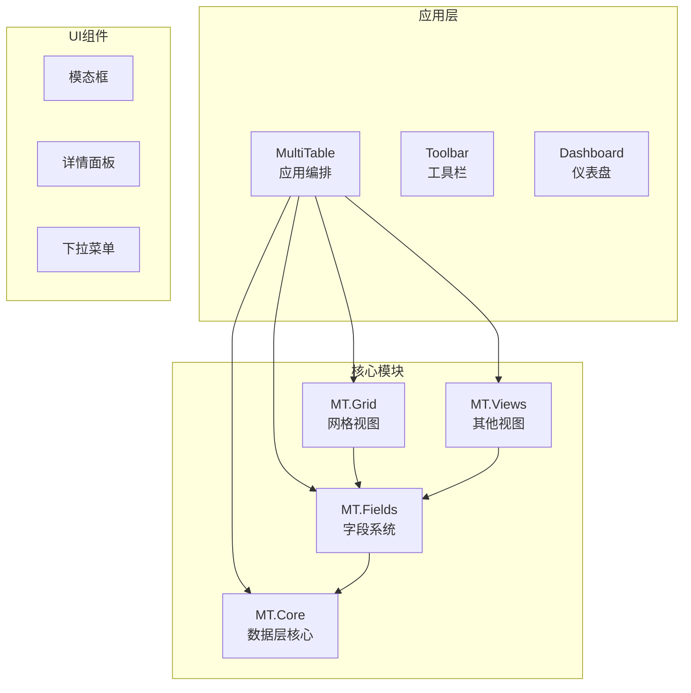

**图表来源**
- [multitable.js:1-624](file://js/multitable.js#L1-L624)
- [mt-fields.js:1-632](file://js/mt-fields.js#L1-L632)
- [mt-grid.js:1-358](file://js/mt-grid.js#L1-L358)
- [mt-views.js:1-379](file://js/mt-views.js#L1-L379)

**章节来源**
- [README.md:48-65](file://README.md#L48-L65)
- [multitable.js:46-162](file://js/multitable.js#L46-L162)

## 核心组件
字段系统由多个核心组件构成，每个组件都有明确的职责分工：

### 字段类型系统
系统支持23种不同的字段类型，按功能分为以下几类：
- **基础类型**: 文本、数字、日期、链接、邮箱、电话等
- **选择类型**: 单选、多选、复选框
- **高级类型**: 评分、进度、人员、附件、条码、地理位置
- **系统类型**: 自动编号、公式、查找引用、关联、创建时间、更新时间

### 渲染器架构
每个字段类型都有对应的渲染器，负责在不同视图中的显示格式：
- **单元格渲染**: 网格视图中的数据展示
- **详情面板渲染**: 记录详情中的编辑界面
- **表单渲染**: 表单视图中的输入控件

### 编辑器系统
系统提供多种编辑器类型：
- **即时编辑器**: 复选框、评分等简单交互
- **下拉编辑器**: 单选、多选、人员选择
- **文本编辑器**: 文本框、日期选择器、数字输入框
- **复杂编辑器**: 附件上传、关联选择、进度调节

**章节来源**
- [mt-fields.js:5-30](file://js/mt-fields.js#L5-L30)
- [mt-fields.js:57-157](file://js/mt-fields.js#L57-L157)
- [mt-fields.js:160-255](file://js/mt-fields.js#L160-L255)

## 架构概览
字段系统采用分层架构设计，确保了良好的可维护性和扩展性：

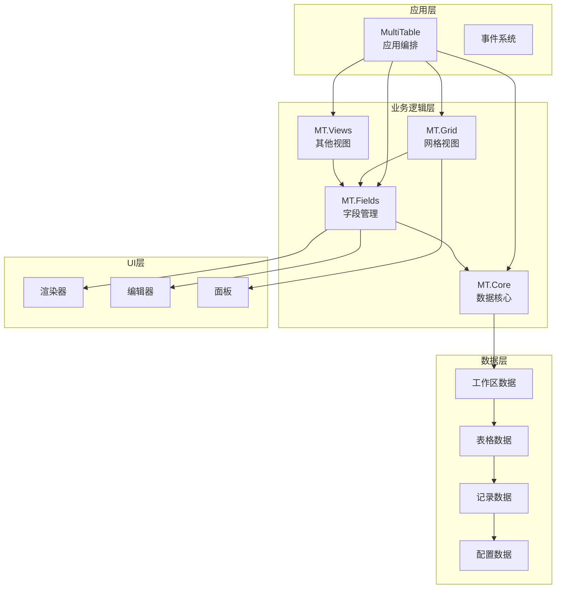

**图表来源**
- [multitable.js:7-44](file://js/multitable.js#L7-L44)
- [mt-fields.js:1-632](file://js/mt-fields.js#L1-L632)
- [mt-core.js:8-117](file://js/mt-core.js#L8-L117)

### 数据流架构
字段系统的数据流遵循严格的单向数据流原则：

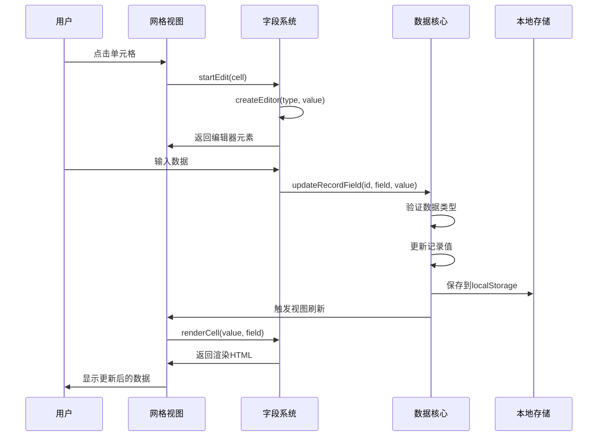

**图表来源**
- [mt-grid.js:161-208](file://js/mt-grid.js#L161-L208)
- [mt-fields.js:160-255](file://js/mt-fields.js#L160-L255)
- [mt-core.js:255-267](file://js/mt-core.js#L255-L267)

**章节来源**
- [mt-grid.js:14-37](file://js/mt-grid.js#L14-L37)
- [mt-fields.js:529-583](file://js/mt-fields.js#L529-L583)

## 详细组件分析

### 字段类型系统
字段类型系统是整个字段系统的核心，定义了所有支持的字段类型及其属性。

#### 字段类型定义
系统定义了23种字段类型，每种类型都有特定的用途和配置选项：

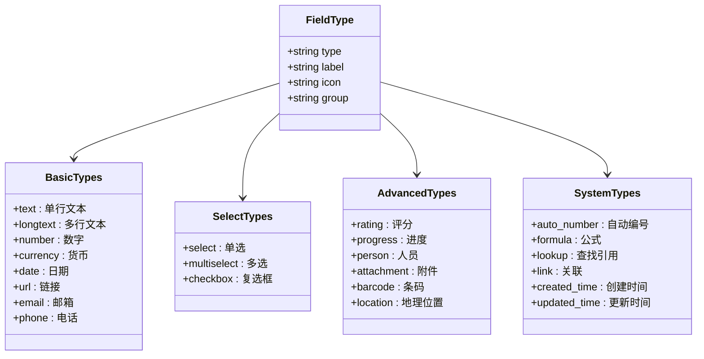

**图表来源**
- [mt-fields.js:6-30](file://js/mt-fields.js#L6-L30)

#### 字段配置系统
每种字段类型都有特定的配置选项，通过配置对象进行管理：

| 字段类型 | 配置选项 | 默认值 |
|---------|---------|--------|
| number | decimals: 小数位数 | 0 |
| currency | symbol: 货币符号 decimals: 小数位数 | ¥, 2 |
| rating | max: 最高分 | 5 |
| progress | color: 进度颜色 | #4f46e5 |
| select/multiselect | options: 选项数组 | 空数组 |
| auto_number | prefix: 前缀 digits: 位数 | 空字符串, 4 |
| formula | expression: 公式表达式 resultType: 结果类型 | 空字符串, number |
| link | targetTableId: 目标表ID | 空字符串 |
| lookup | linkFieldId: 关联字段ID sourceTableId: 源表ID sourceFieldId: 源字段ID | 空字符串 |
| barcode | format: 条码格式 | CODE128 |

**章节来源**
- [mt-fields.js:559-630](file://js/mt-fields.js#L559-L630)

### 渲染器系统
渲染器系统负责将字段数据转换为用户可见的UI元素，支持多种渲染场景。

#### 单元格渲染器
单元格渲染器负责在网格视图中显示字段数据：

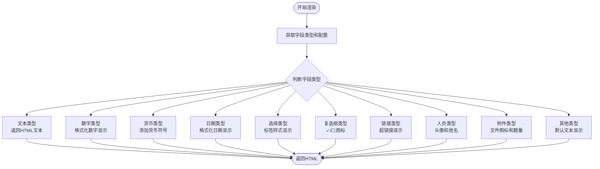

**图表来源**
- [mt-fields.js:57-157](file://js/mt-fields.js#L57-L157)

#### 详情面板渲染器
详情面板渲染器提供更丰富的编辑体验：

| 字段类型 | 渲染方式 | 交互特性 |
|---------|---------|----------|
| text/longtext | textarea | 多行文本编辑 |
| number/currency | input[type=number] | 数字输入，步进控制 |
| date | input[type=date] | 日期选择器 |
| select | select下拉框 | 选项选择 |
| multiselect | 复选框组 | 多选项选择 |
| checkbox | checkbox | 布尔值切换 |
| rating | range输入 + 星星显示 | 评分调节 |
| progress | range输入 + 百分比显示 | 进度调节 |
| person | select下拉框 | 人员选择 |
| attachment | 文件列表 + 上传按钮 | 附件管理 |
| link | 关联记录列表 + 编辑按钮 | 关联管理 |

**章节来源**
- [mt-fields.js:426-518](file://js/mt-fields.js#L426-L518)

### 编辑器系统
编辑器系统提供多样化的数据输入方式，满足不同字段类型的需求。

#### 编辑器创建流程
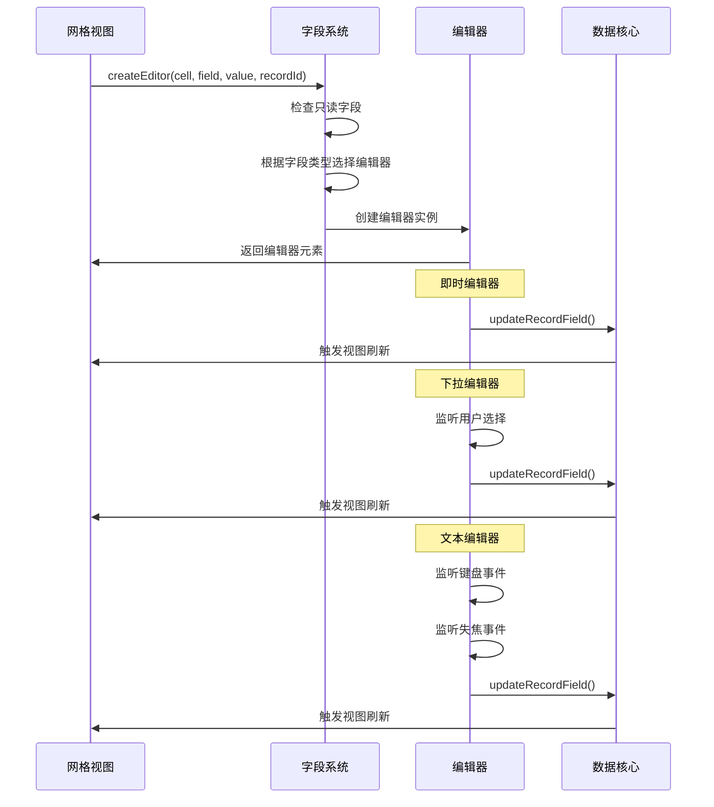

**图表来源**
- [mt-grid.js:161-208](file://js/mt-grid.js#L161-L208)
- [mt-fields.js:160-255](file://js/mt-fields.js#L160-L255)

#### 编辑器类型分类

##### 即时编辑器
- **复选框**: 点击切换布尔值
- **评分**: 点击增加评分，达到上限重置为0
- **单选/多选/人员**: 打开下拉菜单选择

##### 下拉编辑器
- **单选**: 下拉选项，点击选择
- **多选**: 复选框列表，勾选多个选项
- **附件**: 文件上传区域，支持拖拽上传
- **关联**: 目标表记录列表，复选框选择

##### 文本编辑器
- **文本/长文本**: 文本输入框
- **数字/货币**: 数字输入框，支持小数点
- **日期**: 日期选择器
- **邮箱/URL/电话**: 类型化输入框

**章节来源**
- [mt-fields.js:160-423](file://js/mt-fields.js#L160-L423)

### 数据验证和格式化
系统内置了完善的数据验证和格式化机制，确保数据的完整性和一致性。

#### 数据类型验证
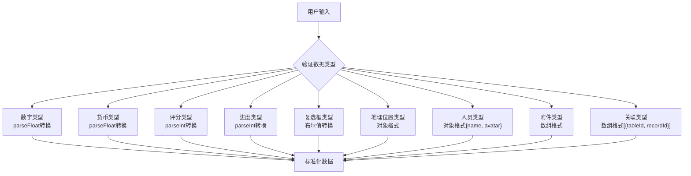

**图表来源**
- [mt-fields.js:257-263](file://js/mt-fields.js#L257-L263)
- [mt-fields.js:520-527](file://js/mt-fields.js#L520-L527)

#### 格式化规则
系统提供多种格式化功能：

| 字段类型 | 格式化规则 | 示例输出 |
|---------|-----------|----------|
| number | localeString格式化 | 12,345.67 |
| currency | 货币符号 + 数字格式 | ¥12,345.67 |
| date | 本地日期格式 | 2024/1/15 |
| datetime | 本地日期时间格式 | 2024/1/15 14:30:00 |
| rating | 星星符号重复 | ★★★☆☆ |
| progress | 进度条 + 百分比 | 60% |
| attachment | 文件数量显示 | 3个文件 |

**章节来源**
- [mt-core.js:758-761](file://js/mt-core.js#L758-L761)
- [mt-fields.js:65-157](file://js/mt-fields.js#L65-L157)

### 字段配置对话框
字段配置对话框提供了直观的字段创建和配置界面。

#### 对话框结构
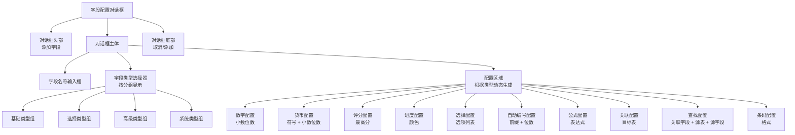

**图表来源**
- [mt-fields.js:530-554](file://js/mt-fields.js#L530-L554)
- [mt-fields.js:559-583](file://js/mt-fields.js#L559-L583)

#### 动态配置生成
配置对话框根据字段类型动态生成相应的配置表单：

| 字段类型 | 配置表单项 | 验证规则 |
|---------|-----------|----------|
| number | 小数位数(0-4) | 必须为数字且在范围内 |
| currency | 货币符号(文本) | 任意文本 |
| currency | 小数位数(0-4) | 必须为数字且在范围内 |
| rating | 最高分(1-10) | 必须为数字且在范围内 |
| progress | 进度颜色(color) | 有效的CSS颜色值 |
| select/multiselect | 选项列表(逗号分隔) | 非空且去重 |
| auto_number | 前缀(文本) | 任意文本 |
| auto_number | 位数(1-8) | 必须为数字且在范围内 |
| formula | 公式表达式(文本) | 支持的函数语法 |
| link | 目标表选择 | 必须选择有效表 |
| lookup | 关联字段选择 | 必须选择有效字段 |
| lookup | 源表选择 | 必须选择有效表 |
| lookup | 源字段ID | 必须为有效字段ID |
| barcode | 条码格式 | CODE128/EAN13 |

**章节来源**
- [mt-fields.js:559-630](file://js/mt-fields.js#L559-L630)

### 字段管理功能
系统提供了完整的字段生命周期管理功能。

#### 字段CRUD操作
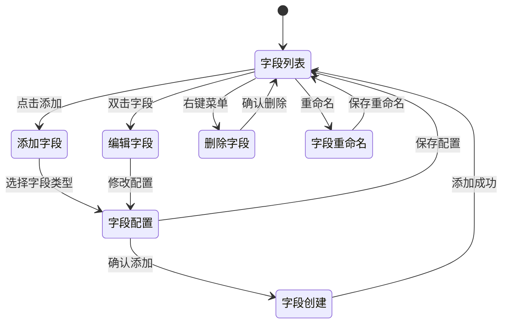

#### 字段默认值系统
系统为每种字段类型定义了合理的默认值：

| 字段类型 | 默认值 | 说明 |
|---------|--------|------|
| number | 0 | 数值类型默认为0 |
| currency | 0 | 货币类型默认为0 |
| checkbox | false | 布尔类型默认为false |
| rating | 0 | 评分类型默认为0 |
| progress | 0 | 进度类型默认为0 |
| multiselect | [] | 多选类型默认为空数组 |
| link | [] | 关联类型默认为空数组 |
| attachment | [] | 附件类型默认为空数组 |
| person | null或[] | 人员类型根据是否允许多选决定 |
| created_time | 当前时间 | 创建时间自动设置 |
| updated_time | 当前时间 | 更新时间自动设置 |
| auto_number | 空字符串 | 自动编号待生成 |
| formula | null | 公式字段待计算 |
| lookup | null | 查找字段待引用 |

**章节来源**
- [mt-core.js:213-228](file://js/mt-core.js#L213-L228)
- [mt-core.js:169-186](file://js/mt-core.js#L169-L186)

## 依赖关系分析

### 模块间依赖关系
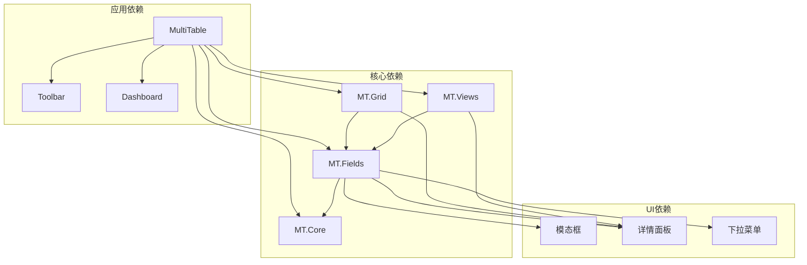

**图表来源**
- [multitable.js:1-624](file://js/multitable.js#L1-L624)
- [mt-fields.js:1-632](file://js/mt-fields.js#L1-L632)
- [mt-grid.js:1-358](file://js/mt-grid.js#L1-L358)
- [mt-views.js:1-379](file://js/mt-views.js#L1-L379)

### 数据依赖关系
字段系统的数据依赖关系体现了清晰的层次结构：

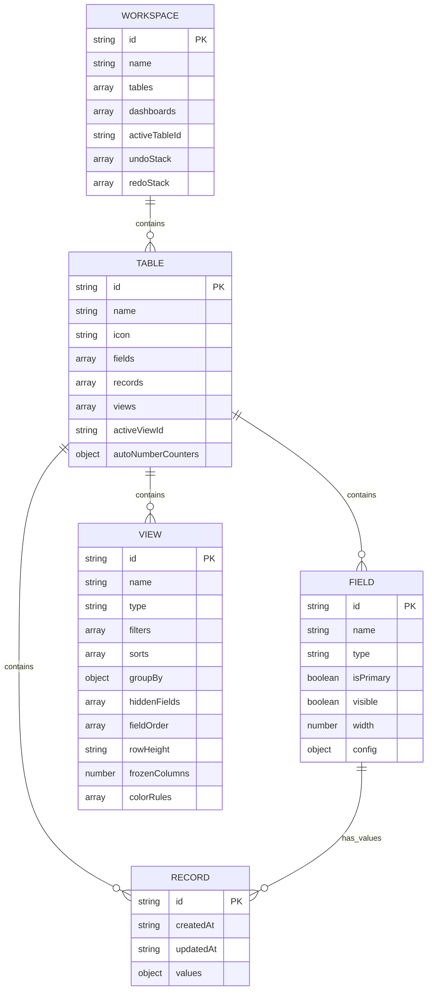

**图表来源**
- [mt-core.js:97-117](file://js/mt-core.js#L97-L117)
- [mt-core.js:119-154](file://js/mt-core.js#L119-L154)

**章节来源**
- [mt-core.js:1-200](file://js/mt-core.js#L1-L200)

## 性能考虑
字段系统在设计时充分考虑了性能优化，采用了多种策略来确保良好的用户体验。

### 渲染性能优化
- **虚拟滚动**: 大数据集时采用虚拟滚动减少DOM节点数量
- **懒加载**: 字段配置对话框按需加载，避免不必要的DOM操作
- **事件委托**: 使用事件委托减少事件监听器数量
- **防抖处理**: 详情面板输入采用防抖机制，避免频繁保存

### 内存管理
- **对象池**: 复用DOM元素，减少垃圾回收压力
- **弱引用**: 使用WeakMap存储DOM引用，避免内存泄漏
- **及时清理**: 模态框和面板关闭时及时清理事件监听器

### 数据缓存
- **本地存储**: 使用localStorage缓存工作区数据
- **增量更新**: 只更新变化的数据，避免全量重绘
- **计算缓存**: 公式和查找结果缓存，避免重复计算

## 故障排除指南

### 常见问题诊断
1. **字段类型不显示**
   - 检查字段类型定义是否正确
   - 确认字段配置对象格式
   - 验证字段类型分组设置

2. **编辑器无法打开**
   - 检查字段是否为只读类型
   - 确认网格视图编辑状态
   - 验证字段权限设置

3. **数据格式错误**
   - 检查数据类型转换逻辑
   - 验证格式化函数参数
   - 确认本地化设置

### 调试技巧
- 使用浏览器开发者工具监控事件流
- 检查localStorage中的数据结构
- 监听事件总线查看数据变更
- 分析DOM结构确认渲染结果

**章节来源**
- [mt-core.js:36-75](file://js/mt-core.js#L36-L75)

## 结论
陈苗多维表格的字段系统是一个设计精良、功能完善的前端数据管理解决方案。系统通过模块化设计实现了高度的可维护性和扩展性，通过丰富的字段类型和灵活的配置选项满足了各种业务场景的需求。

系统的核心优势包括：
- **完整的字段类型体系**: 23种字段类型覆盖主流业务需求
- **灵活的渲染机制**: 支持多种视图和交互方式
- **强大的配置系统**: 动态配置生成，易于扩展
- **完善的验证机制**: 数据类型验证和格式化保障数据质量
- **优秀的性能表现**: 多种优化策略确保流畅的用户体验

该系统为后续的功能扩展和定制化开发奠定了坚实的基础，是构建企业级数据管理应用的良好范例。

## 附录

### 字段类型完整列表
系统支持的所有字段类型及其特性：

| 类型 | 名称 | 描述 | 只读 | 配置选项 |
|------|------|------|------|----------|
| text | 单行文本 | 基础文本输入 | 否 | 无 |
| longtext | 多行文本 | 多行文本编辑 | 否 | 无 |
| number | 数字 | 数值输入 | 否 | decimals: 小数位数 |
| currency | 货币 | 货币数值 | 否 | symbol: 符号 decimals: 小数位数 |
| date | 日期 | 日期选择器 | 否 | 无 |
| select | 单选 | 下拉选择 | 否 | options: 选项数组 |
| multiselect | 多选 | 复选框组 | 否 | options: 选项数组 |
| checkbox | 复选框 | 布尔值 | 否 | 无 |
| url | 链接 | URL输入 | 否 | 无 |
| email | 邮箱 | 邮箱验证 | 否 | 无 |
| phone | 电话 | 电话号码 | 否 | 无 |
| rating | 评分 | 星星评分 | 否 | max: 最高分 |
| progress | 进度 | 进度条 | 否 | color: 颜色 |
| auto_number | 自动编号 | 自动生成编号 | 是 | prefix: 前缀 digits: 位数 |
| formula | 公式 | 计算字段 | 是 | expression: 表达式 resultType: 结果类型 |
| lookup | 查找引用 | 引用其他表字段 | 是 | linkFieldId: 关联字段 sourceTableId: 源表 sourceFieldId: 源字段 |
| link | 关联 | 关联其他记录 | 否 | targetTableId: 目标表 |
| person | 人员 | 人员选择 | 否 | options: 人员列表 |
| attachment | 附件 | 文件上传 | 否 | 无 |
| barcode | 条码 | 条码生成 | 否 | format: 格式 |
| location | 地理位置 | 地址输入 | 否 | 无 |
| created_time | 创建时间 | 自动记录创建时间 | 是 | 无 |
| updated_time | 更新时间 | 自动记录更新时间 | 是 | 无 |

### 开发最佳实践
1. **字段类型扩展**: 新增字段类型时，需要同时实现渲染器、编辑器和配置对话框
2. **数据验证**: 在updateRecordField中添加必要的数据验证逻辑
3. **性能优化**: 大数据集时考虑使用虚拟滚动和分页
4. **错误处理**: 完善的错误处理和用户反馈机制
5. **兼容性**: 确保在不同浏览器和设备上的兼容性