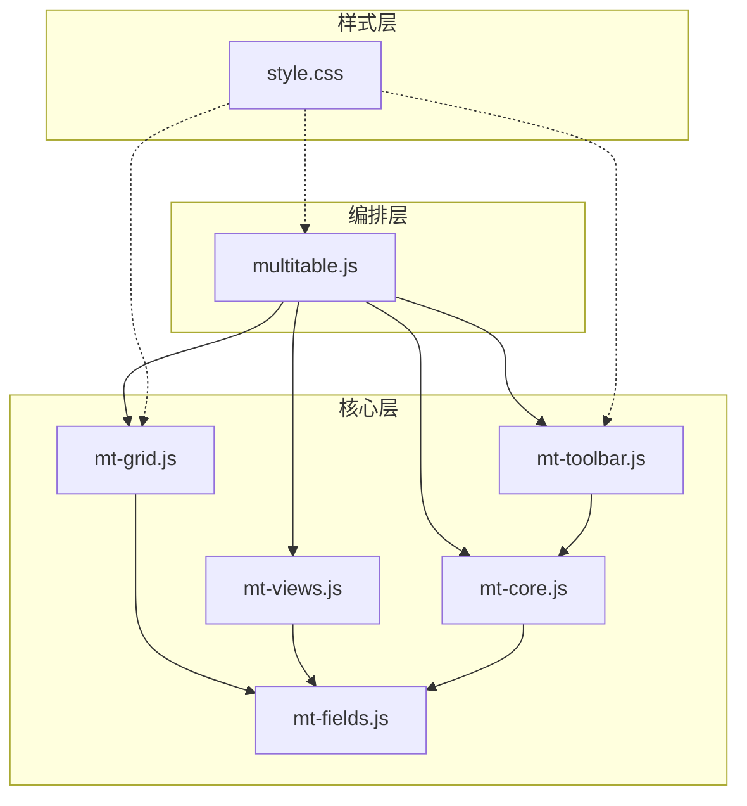
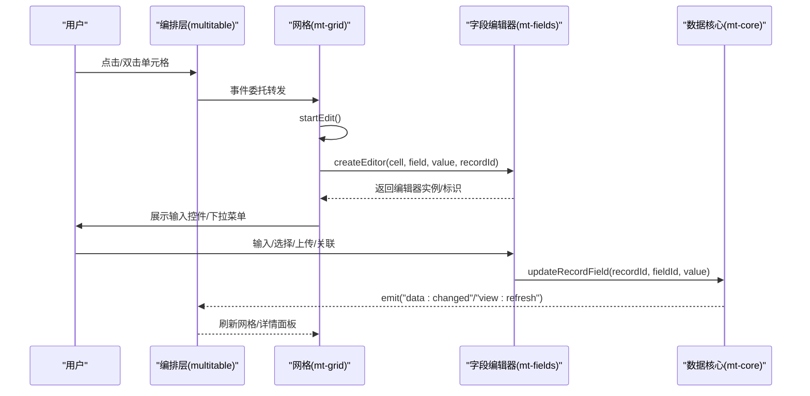
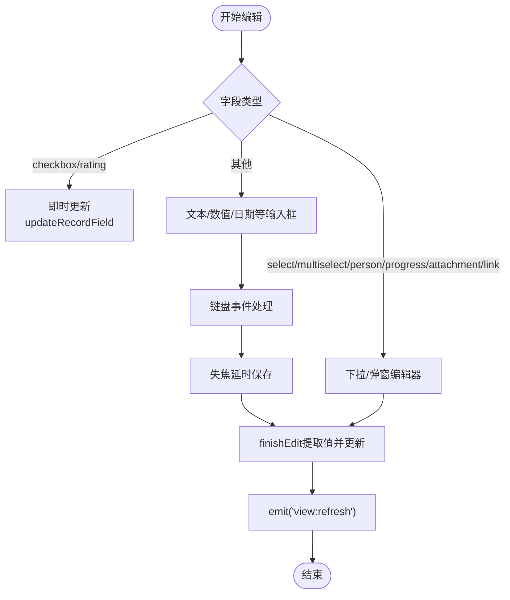
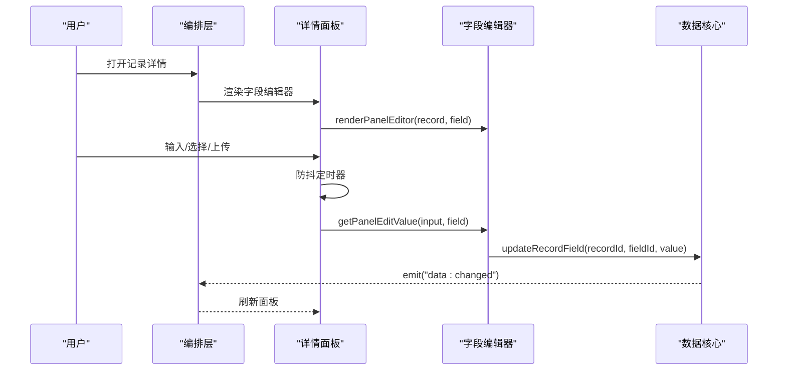
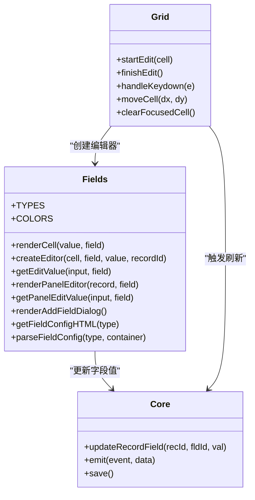
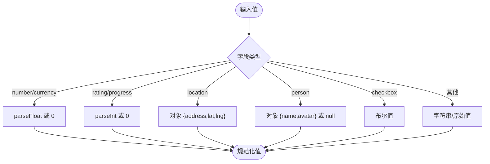
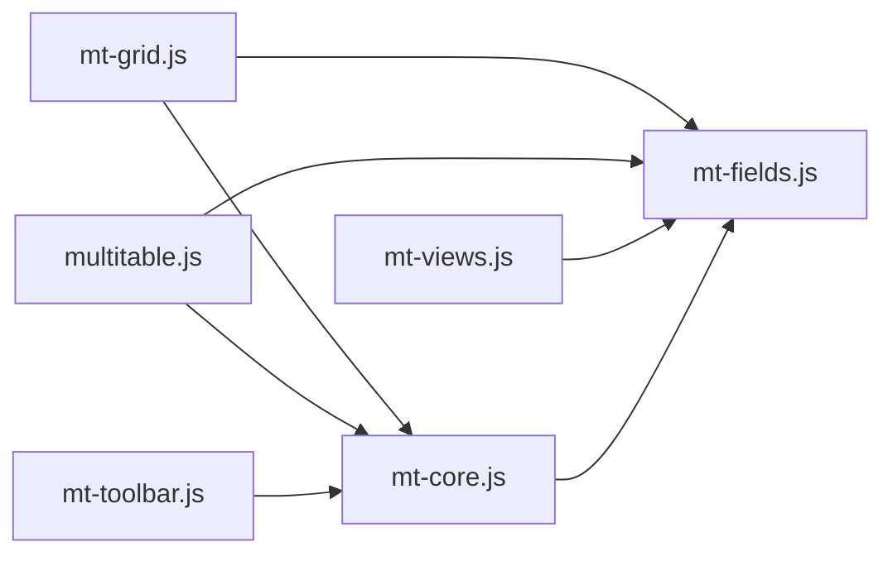

# 字段编辑器

<cite>
**本文档引用的文件**
- [mt-fields.js](file://js/mt-fields.js)
- [mt-grid.js](file://js/mt-grid.js)
- [mt-core.js](file://js/mt-core.js)
- [multitable.js](file://js/multitable.js)
- [mt-toolbar.js](file://js/mt-toolbar.js)
- [mt-views.js](file://js/mt-views.js)
- [style.css](file://css/style.css)
</cite>

## 目录
1. [简介](#简介)
2. [项目结构](#项目结构)
3. [核心组件](#核心组件)
4. [架构总览](#架构总览)
5. [详细组件分析](#详细组件分析)
6. [依赖关系分析](#依赖关系分析)
7. [性能考虑](#性能考虑)
8. [故障排查指南](#故障排查指南)
9. [结论](#结论)
10. [附录](#附录)

## 简介
本技术文档围绕“字段编辑器”系统，系统性阐述多维表格中行内编辑器与详情面板编辑器的实现机制，涵盖编辑器创建、事件处理、值更新流程；详细说明选择器、下拉菜单、文件上传、关联选择等交互组件；解释数据验证、格式化与错误处理机制；并提供编辑器扩展与自定义开发指南及性能优化与用户体验改进建议。目标读者既包括开发者，也包括需要理解系统工作原理的非技术用户。

## 项目结构
该系统采用模块化分层：
- 多维表格编排层：负责页面布局、事件委托、模块协调（multitable.js）
- 数据核心层：负责事件总线、CRUD、数据管道、撤销重做、公式计算（mt-core.js）
- 视图渲染层：网格、看板、画廊、甘特图、日历、表单视图（mt-grid.js、mt-views.js）
- 工具栏面板系统：筛选、排序、分组、隐藏字段、行高、冻结列、条件着色、CSV导入（mt-toolbar.js）
- 字段渲染与编辑器：单元格渲染、行内编辑器、详情面板编辑器、字段配置与解析（mt-fields.js）

**图表来源**
- [multitable.js:12-624](file://js/multitable.js#L12-L624)
- [mt-core.js:8-800](file://js/mt-core.js#L8-L800)
- [mt-fields.js:5-632](file://js/mt-fields.js#L5-L632)
- [mt-grid.js:6-358](file://js/mt-grid.js#L6-L358)
- [mt-views.js:5-379](file://js/mt-views.js#L5-L379)
- [mt-toolbar.js:6-394](file://js/mt-toolbar.js#L6-L394)
- [style.css:1-200](file://css/style.css#L1-L200)

**章节来源**
- [multitable.js:12-624](file://js/multitable.js#L12-L624)
- [mt-core.js:8-800](file://js/mt-core.js#L8-L800)
- [mt-fields.js:5-632](file://js/mt-fields.js#L5-L632)
- [mt-grid.js:6-358](file://js/mt-grid.js#L6-L358)
- [mt-views.js:5-379](file://js/mt-views.js#L5-L379)
- [mt-toolbar.js:6-394](file://js/mt-toolbar.js#L6-L394)
- [style.css:1-200](file://css/style.css#L1-L200)

## 核心组件
- 字段类型与渲染：统一管理23种字段类型，提供单元格渲染与默认值策略（mt-fields.js）
- 行内编辑器：在网格单元格内即时编辑，支持多种输入控件与交互（mt-fields.js + mt-grid.js）
- 详情面板编辑器：在右侧弹出面板中逐项编辑，适合复杂字段与批量编辑（multitable.js + mt-fields.js）
- 数据核心：事件总线、CRUD、数据管道、撤销重做、公式与查找引用计算（mt-core.js）
- 视图与工具栏：网格、看板、画廊、甘特图、日历、表单视图，以及筛选/排序/分组/条件着色等工具面板（mt-grid.js、mt-views.js、mt-toolbar.js）

**章节来源**
- [mt-fields.js:5-632](file://js/mt-fields.js#L5-L632)
- [mt-grid.js:6-358](file://js/mt-grid.js#L6-L358)
- [mt-core.js:8-800](file://js/mt-core.js#L8-L800)
- [mt-views.js:5-379](file://js/mt-views.js#L5-L379)
- [mt-toolbar.js:6-394](file://js/mt-toolbar.js#L6-L394)

## 架构总览
字段编辑器贯穿“编排层-核心层-视图层-样式层”，通过事件总线驱动数据变更与视图刷新，确保一致性与可扩展性。

**图表来源**
- [mt-grid.js:161-208](file://js/mt-grid.js#L161-L208)
- [mt-fields.js:160-286](file://js/mt-fields.js#L160-L286)
- [mt-core.js:255-267](file://js/mt-core.js#L255-L267)
- [multitable.js:381-385](file://js/multitable.js#L381-L385)

## 详细组件分析

### 行内编辑器（网格单元格）
- 创建流程：根据字段类型动态创建输入控件或下拉菜单，部分类型（如复选框、评分）为“即时更新”
- 事件处理：键盘事件（Enter、Esc、Tab）、失焦延迟保存、点击空白关闭下拉
- 值更新：finishEdit统一提取输入值并调用核心更新接口

**图表来源**
- [mt-grid.js:161-208](file://js/mt-grid.js#L161-L208)
- [mt-fields.js:160-286](file://js/mt-fields.js#L160-L286)

**章节来源**
- [mt-grid.js:161-208](file://js/mt-grid.js#L161-L208)
- [mt-fields.js:160-286](file://js/mt-fields.js#L160-L286)

### 详情面板编辑器（右侧弹出）
- 渲染：遍历字段，按类型渲染输入控件或只读展示
- 事件：面板内输入/选择变化触发防抖保存，避免频繁写入
- 值提取：统一通过 getPanelEditValue 提取并调用核心更新

**图表来源**
- [multitable.js:407-488](file://js/multitable.js#L407-L488)
- [mt-fields.js:426-527](file://js/mt-fields.js#L426-L527)
- [mt-core.js:255-267](file://js/mt-core.js#L255-L267)

**章节来源**
- [multitable.js:407-488](file://js/multitable.js#L407-L488)
- [mt-fields.js:426-527](file://js/mt-fields.js#L426-L527)

### 字段类型与编辑器特性
- 文本/长文本/链接/邮箱/电话/条码/地理位置：文本输入，支持占位符与格式化
- 数字/货币：数值输入，支持步进与小数位控制
- 日期：日期选择器
- 评分/进度：滑块输入，支持范围与即时更新
- 单选/多选/人员：下拉菜单，支持颜色标签与多选
- 附件：拖拽上传、文件大小限制、列表展示与删除
- 关联：跨表选择，支持搜索过滤与批量勾选
- 公式/查找引用：只读展示，依赖核心计算

**图表来源**
- [mt-fields.js:5-632](file://js/mt-fields.js#L5-L632)
- [mt-grid.js:6-358](file://js/mt-grid.js#L6-L358)
- [mt-core.js:255-267](file://js/mt-core.js#L255-L267)

**章节来源**
- [mt-fields.js:57-157](file://js/mt-fields.js#L57-L157)
- [mt-fields.js:160-527](file://js/mt-fields.js#L160-L527)

### 数据验证、格式化与错误处理
- 格式化：数字/货币/日期/时间格式化工具函数，保障显示一致性
- 类型转换：getEditValue/getPanelEditValue统一提取值并转换为字段期望类型
- 只读字段：isReadOnly统一屏蔽不可编辑字段的编辑入口
- 错误处理：核心层在公式计算异常时返回错误标记，单元格渲染以错误样式提示

**图表来源**
- [mt-fields.js:257-263](file://js/mt-fields.js#L257-L263)
- [mt-fields.js:520-527](file://js/mt-fields.js#L520-L527)
- [mt-fields.js:52-54](file://js/mt-fields.js#L52-L54)

**章节来源**
- [mt-fields.js:257-263](file://js/mt-fields.js#L257-L263)
- [mt-fields.js:520-527](file://js/mt-fields.js#L520-L527)
- [mt-fields.js:52-54](file://js/mt-fields.js#L52-L54)
- [mt-core.js:568-650](file://js/mt-core.js#L568-L650)

### 编辑器扩展与自定义开发指南
- 新增字段类型步骤
  1) 在 TYPES 中注册新类型与图标/分组
  2) 在 renderCell 中添加渲染逻辑
  3) 在 createEditor 中添加编辑器创建逻辑
  4) 在 getEditValue 中添加值提取逻辑
  5) 在 renderPanelEditor 中添加详情面板渲染
  6) 在 getPanelEditValue 中添加值提取逻辑
  7) 如需配置项，在 renderAddFieldDialog 与 parseFieldConfig 中添加配置界面与解析
- 示例路径
  - [新增字段类型注册:6-30](file://js/mt-fields.js#L6-L30)
  - [单元格渲染扩展:57-157](file://js/mt-fields.js#L57-L157)
  - [行内编辑器扩展:160-286](file://js/mt-fields.js#L160-L286)
  - [详情面板编辑器扩展:426-527](file://js/mt-fields.js#L426-L527)
  - [字段配置对话框:529-583](file://js/mt-fields.js#L529-L583)
  - [配置解析:584-630](file://js/mt-fields.js#L584-L630)

**章节来源**
- [mt-fields.js:6-30](file://js/mt-fields.js#L6-L30)
- [mt-fields.js:57-157](file://js/mt-fields.js#L57-L157)
- [mt-fields.js:160-286](file://js/mt-fields.js#L160-L286)
- [mt-fields.js:426-527](file://js/mt-fields.js#L426-L527)
- [mt-fields.js:529-583](file://js/mt-fields.js#L529-L583)
- [mt-fields.js:584-630](file://js/mt-fields.js#L584-L630)

## 依赖关系分析
- 组件耦合
  - mt-grid 依赖 mt-fields 创建编辑器，依赖 mt-core 触发刷新
  - multitable 依赖 mt-fields 渲染详情面板，依赖 mt-core 触发刷新
  - mt-toolbar 依赖 mt-core 保存视图配置
  - mt-views 依赖 mt-fields 渲染视图卡片
- 外部依赖
  - localStorage 作为本地持久化（mt-core.save/load）
  - DOM 事件委托与样式（style.css）

**图表来源**
- [mt-grid.js:161-208](file://js/mt-grid.js#L161-L208)
- [mt-fields.js:160-286](file://js/mt-fields.js#L160-L286)
- [mt-core.js:255-267](file://js/mt-core.js#L255-L267)
- [multitable.js:407-488](file://js/multitable.js#L407-L488)
- [mt-toolbar.js:260-339](file://js/mt-toolbar.js#L260-L339)
- [mt-views.js:5-379](file://js/mt-views.js#L5-L379)

**章节来源**
- [mt-grid.js:161-208](file://js/mt-grid.js#L161-L208)
- [mt-fields.js:160-286](file://js/mt-fields.js#L160-L286)
- [mt-core.js:255-267](file://js/mt-core.js#L255-L267)
- [multitable.js:407-488](file://js/multitable.js#L407-L488)
- [mt-toolbar.js:260-339](file://js/mt-toolbar.js#L260-L339)
- [mt-views.js:5-379](file://js/mt-views.js#L5-L379)

## 性能考虑
- 防抖保存：详情面板输入采用防抖（约300ms），减少频繁写入与重绘
- 延迟刷新：行内编辑器失焦后统一刷新，避免多次重绘
- 事件委托：编排层集中处理事件，降低监听器数量
- 懒渲染：视图切换时仅刷新内容区域，保持侧边栏与工具栏稳定
- 本地存储节流：保存操作使用定时器合并，避免频繁写入
- 键盘导航：仅在非编辑状态下启用，避免冲突

**章节来源**
- [multitable.js:445-457](file://js/multitable.js#L445-L457)
- [mt-grid.js:187-193](file://js/mt-grid.js#L187-L193)
- [mt-core.js:51-61](file://js/mt-core.js#L51-L61)

## 故障排查指南
- 编辑无效
  - 检查字段是否为只读类型（如 created_time、updated_time、auto_number、formula、lookup）
  - 确认 startEdit 是否被调用且未处于编辑状态
- 值未更新
  - 确认 finishEdit 是否触发，或详情面板是否启用防抖导致延迟
  - 检查 getEditValue/getPanelEditValue 的类型转换逻辑
- 下拉菜单不消失
  - 点击空白区域或外部元素应触发关闭
  - 确认事件委托是否正确传递
- 保存失败
  - 检查 localStorage 是否可用，查看存储警告事件
  - 确认事件总线 emit 是否触发 view:refresh

**章节来源**
- [mt-fields.js:52-54](file://js/mt-fields.js#L52-L54)
- [mt-grid.js:161-208](file://js/mt-grid.js#L161-L208)
- [mt-core.js:255-267](file://js/mt-core.js#L255-L267)
- [mt-core.js:36-74](file://js/mt-core.js#L36-L74)

## 结论
字段编辑器系统通过清晰的分层与事件驱动，实现了多样化的字段类型支持与一致的编辑体验。行内编辑器强调效率，详情面板编辑器强调完整性。配合防抖、延迟刷新与本地存储节流，系统在性能与用户体验之间取得良好平衡。扩展性强，便于新增字段类型与自定义编辑器。

## 附录
- 样式与主题：通过 CSS 变量统一主题色与组件样式，保证视觉一致性
- 快捷键：支持 Ctrl+Z/Ctrl+Y 撤销/重做、Ctrl+C/Ctrl+V 复制/粘贴、Esc 关闭面板等

**章节来源**
- [style.css:7-21](file://css/style.css#L7-L21)
- [multitable.js:364-379](file://js/multitable.js#L364-L379)