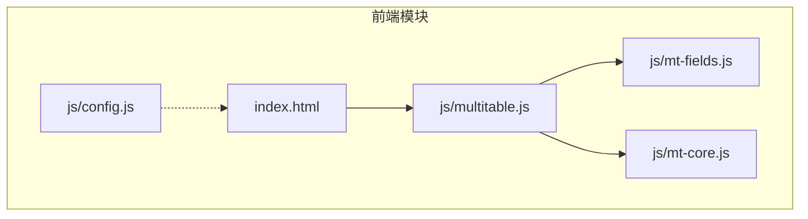
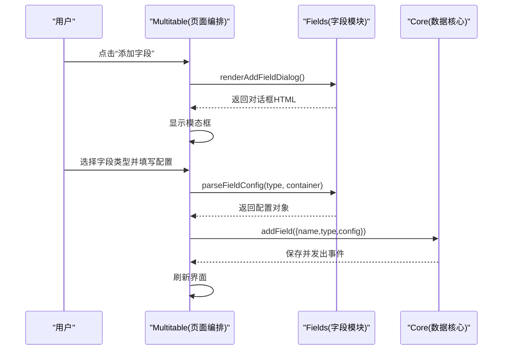
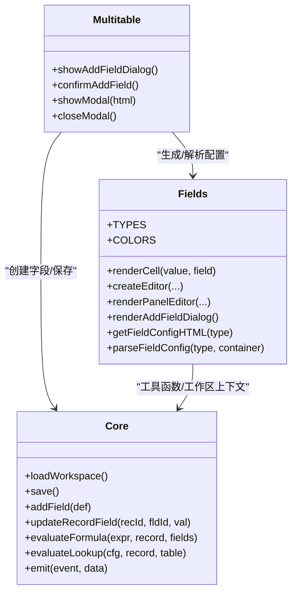

# 字段配置

<cite>
**本文引用的文件**
- [mt-fields.js](file://js/mt-fields.js)
- [mt-core.js](file://js/mt-core.js)
- [multitable.js](file://js/multitable.js)
- [config.js](file://js/config.js)
- [README.md](file://README.md)
- [快速入门.md](file://快速入门.md)
- [index.html](file://index.html)
</cite>

## 目录
1. [简介](#简介)
2. [项目结构](#项目结构)
3. [核心组件](#核心组件)
4. [架构总览](#架构总览)
5. [详细组件分析](#详细组件分析)
6. [依赖关系分析](#依赖关系分析)
7. [性能考量](#性能考量)
8. [故障排查指南](#故障排查指南)
9. [结论](#结论)
10. [附录](#附录)

## 简介
本文件面向“陈苗多维表格字段配置系统”，聚焦于字段配置对话框的实现机制，包括：
- 配置表单的动态生成
- 配置项的解析与校验
- 配置数据的序列化与反序列化
- 各字段类型的配置选项（如数字字段的小数位数、货币字段的符号与精度、评分字段的最大分值等）
- 配置扩展与新增配置选项的开发指南
- 最佳实践与常见问题解决方案

该系统采用纯前端实现，数据持久化基于本地存储；同时提供云端模式（Supabase），可在配置完成后启用。

## 项目结构
- 前端核心由多个模块协同组成：字段渲染与编辑器（mt-fields.js）、数据核心（mt-core.js）、页面编排（multitable.js）、配置（config.js）、入口页面（index.html）以及文档（README.md、快速入门.md）。
- 字段配置对话框位于页面编排模块中，通过调用字段模块的渲染与解析能力完成动态表单生成与配置收集。

图表来源
- [index.html](file://index.html)
- [config.js](file://js/config.js)
- [multitable.js](file://js/multitable.js)
- [mt-fields.js](file://js/mt-fields.js)
- [mt-core.js](file://js/mt-core.js)

章节来源
- [README.md](file://README.md)
- [快速入门.md](file://快速入门.md)

## 核心组件
- 字段类型与渲染器：负责字段类型枚举、渲染单元格、行内编辑器、详情面板编辑器、添加字段对话框的HTML生成与配置解析。
- 数据核心：负责工作区加载/保存、字段增删改、记录增删改、视图管理、公式/查找引用计算、撤销/重做、导入导出等。
- 页面编排：负责页面骨架、事件委托、模态框管理、字段配置对话框的显示与确认提交。

章节来源
- [mt-fields.js](file://js/mt-fields.js)
- [mt-core.js](file://js/mt-core.js)
- [multitable.js](file://js/multitable.js)

## 架构总览
字段配置对话框的交互流程如下：
- 用户点击“添加字段”触发页面编排层弹出对话框
- 字段模块根据所选类型动态生成配置表单
- 用户填写配置后点击“添加”，页面编排层收集配置并通过数据核心创建字段
- 字段模块负责渲染与编辑器，数据核心负责持久化与计算

图表来源
- [multitable.js](file://js/multitable.js)
- [mt-fields.js](file://js/mt-fields.js)
- [mt-core.js](file://js/mt-core.js)

## 详细组件分析

### 字段类型与配置表单
- 字段类型枚举：包含基础、选择、高级、关联、系统等分组，用于对话框的类型选择与图标标注。
- 动态表单生成：根据所选类型返回对应的配置表单项（如数字的小数位、货币的符号与精度、评分的最大分值、自动编号的前缀与位数、公式表达式、关联表/字段、条码格式等）。
- 配置解析：从表单容器中提取各配置项，转换为字段配置对象，包含默认值与边界约束。

章节来源
- [mt-fields.js:560-583](file://js/mt-fields.js#L560-L583)
- [mt-fields.js:584-630](file://js/mt-fields.js#L584-L630)

### 字段渲染与编辑器
- 单元格渲染：根据字段类型与配置渲染不同UI（如数字/货币按精度显示、评分按最大值渲染星标、进度条、标签色块、附件数量、链接/邮箱/电话等）。
- 行内编辑器：针对不同字段类型提供即时编辑体验（如复选框/评分的快速切换、范围输入、下拉选择、附件上传、关联选择等）。
- 详情面板编辑器：在记录详情面板中提供统一的输入控件，支持变更事件与防抖保存。

章节来源
- [mt-fields.js:57-157](file://js/mt-fields.js#L57-L157)
- [mt-fields.js:160-255](file://js/mt-fields.js#L160-L255)
- [mt-fields.js:426-527](file://js/mt-fields.js#L426-L527)

### 数据核心与持久化
- 工作区加载/保存：从本地存储加载工作区，迁移版本，定时保存，提供存储用量提示。
- 字段增删改：addField/deleteField/renameField/updateFieldConfig/reorderFields/defaultVal等。
- 记录增删改：addRecord/updateRecordField/deleteRecord/batchUpdate/duplicateRecord等。
- 公式与查找引用：evaluateFormula/evaluateLookup/recalcComputedFields。
- 撤销/重做：pushUndo/canUndo/canRedo/undo/redo及动作回放。

章节来源
- [mt-core.js:36-74](file://js/mt-core.js#L36-L74)
- [mt-core.js:170-228](file://js/mt-core.js#L170-L228)
- [mt-core.js:255-323](file://js/mt-core.js#L255-L323)
- [mt-core.js:568-650](file://js/mt-core.js#L568-L650)
- [mt-core.js:477-565](file://js/mt-core.js#L477-L565)

### 页面编排与对话框
- 弹出与关闭：showModal/closeModal管理模态框生命周期。
- 添加字段对话框：renderAddFieldDialog显示类型选择与配置区域；confirmAddField收集配置并调用数据核心创建字段。
- 事件委托：统一处理点击、双击、输入、键盘等事件，触发相应业务逻辑。

章节来源
- [multitable.js:529-545](file://js/multitable.js#L529-L545)
- [multitable.js:608-622](file://js/multitable.js#L608-L622)
- [multitable.js:191-308](file://js/multitable.js#L191-L308)

### 配置数据的序列化与反序列化
- 序列化：字段配置对象作为JSON存储在字段的config属性中，随工作区一起保存。
- 反序列化：加载工作区时解析JSON，迁移版本后恢复字段配置；渲染时读取config进行UI展示与编辑。
- 云端模式：当Supabase可用时，可通过云端存储层进行同步（本仓库未提供具体实现代码，但配置文件已预留客户端初始化位置）。

章节来源
- [mt-core.js:36-61](file://js/mt-core.js#L36-L61)
- [config.js:1-20](file://js/config.js#L1-L20)

### 各字段类型的配置选项
- 数字(number)：小数位数（0~4，默认0）
- 货币(currency)：货币符号（默认¥）、小数位数（0~4，默认2）
- 评分(rating)：最高分（1~10，默认5）
- 进度(progress)：颜色（默认#4f46e5，最大值固定100）
- 单选/select：选项列表（逗号分隔，自动分配颜色）
- 多选/multiselect：选项列表（逗号分隔，自动分配颜色）
- 自动编号(auto_number)：前缀（字符串）、位数（1~8，默认4）
- 公式(formula)：表达式（支持 + - * / IF SUM AVG MAX MIN LEN ABS ROUND 等）
- 关联(link)：目标表（下拉选择）
- 查找引用(lookup)：关联字段、源表、源字段ID
- 条码(barcode)：格式（CODE128/EAN13）

章节来源
- [mt-fields.js:560-583](file://js/mt-fields.js#L560-L583)
- [mt-fields.js:584-630](file://js/mt-fields.js#L584-L630)

### 验证与保存流程
- 表单验证：字段名称必填；类型选择必选；部分配置项有数值范围限制（如小数位、最高分、位数）。
- 保存流程：parseFieldConfig提取配置 -> addField写入字段定义 -> 为已有记录填充默认值 -> 保存工作区 -> 触发界面刷新。
- 编辑器值提取：行内编辑器与详情面板编辑器分别提供getEditValue/getPanelEditValue，确保类型转换与格式化正确。

章节来源
- [multitable.js:534-545](file://js/multitable.js#L534-L545)
- [mt-fields.js:257-263](file://js/mt-fields.js#L257-L263)
- [mt-fields.js:520-527](file://js/mt-fields.js#L520-L527)

### 配置扩展与新增配置选项的开发指南
- 新增字段类型：在字段类型枚举中添加新类型，并在渲染器中补充对应渲染与编辑器逻辑。
- 新增配置项：
  - 在getFieldConfigHTML中添加表单项
  - 在parseFieldConfig中解析并赋默认值
  - 在渲染器中读取config进行UI展示
  - 如涉及计算（如公式/查找引用），在数据核心中扩展相关逻辑
- 注意事项：
  - 保持配置对象的向后兼容性
  - 为新配置项提供合理的默认值与边界检查
  - 在渲染器中避免对不存在的config键进行访问（使用可选链或默认值）
  - 若涉及云端同步，确保配置结构与云端Schema一致

章节来源
- [mt-fields.js:6-30](file://js/mt-fields.js#L6-L30)
- [mt-fields.js:559-583](file://js/mt-fields.js#L559-L583)
- [mt-fields.js:584-630](file://js/mt-fields.js#L584-L630)

## 依赖关系分析
- 字段模块依赖数据核心提供的工具函数（转义、格式化、ID生成、日期格式化）与工作区上下文。
- 页面编排模块依赖字段模块生成对话框HTML与解析配置，并调用数据核心进行字段创建与持久化。
- 数据核心依赖本地存储进行工作区的加载/保存，同时提供事件总线供上层刷新UI。

图表来源
- [mt-fields.js](file://js/mt-fields.js)
- [mt-core.js](file://js/mt-core.js)
- [multitable.js](file://js/multitable.js)

章节来源
- [mt-fields.js:57-157](file://js/mt-fields.js#L57-L157)
- [mt-core.js:36-74](file://js/mt-core.js#L36-L74)
- [multitable.js:529-545](file://js/multitable.js#L529-L545)

## 性能考量
- 渲染性能：单元格渲染与编辑器创建均基于字段类型分支，复杂度与字段数量线性相关；建议在大数据量场景下：
  - 使用虚拟滚动或分页
  - 减少不必要的DOM重绘（如批量更新时合并保存）
- 保存性能：数据核心使用定时器节流保存，避免频繁写入；在移动端或低端设备上可适当延长节流间隔。
- 计算性能：公式/查找引用计算在记录变更时触发，建议：
  - 控制公式复杂度与字段数量
  - 对重复计算的结果进行缓存（如查找引用结果）
- 云端模式：若启用Supabase，注意网络请求的频率与错误重试策略，避免阻塞UI。

[本节为通用指导，无需特定文件引用]

## 故障排查指南
- 对话框无法弹出
  - 检查页面编排层的事件绑定与模态框显示逻辑
  - 确认字段模块的renderAddFieldDialog返回了有效HTML
- 配置项无效
  - 检查parseFieldConfig是否正确读取表单项
  - 确认数值型配置的边界（如小数位、最高分、位数）未越界
- 字段未生效
  - 检查addField是否被调用且保存成功
  - 确认工作区已刷新，字段出现在表结构中
- 渲染异常
  - 检查字段config是否存在缺失键，必要时提供默认值
  - 确认渲染器对null/undefined值的处理
- 云端同步问题
  - 检查Supabase配置是否正确加载
  - 确认本地存储与云端Schema一致

章节来源
- [multitable.js:529-545](file://js/multitable.js#L529-L545)
- [mt-fields.js:584-630](file://js/mt-fields.js#L584-L630)
- [mt-core.js:36-74](file://js/mt-core.js#L36-L74)
- [config.js:1-20](file://js/config.js#L1-L20)

## 结论
本系统通过“页面编排层 + 字段模块 + 数据核心”的分层设计，实现了灵活的字段配置对话框与强大的字段渲染/编辑能力。其配置表单动态生成、配置解析与持久化、以及公式/查找引用计算构成了完整的字段配置生态。遵循本文的扩展指南与最佳实践，可平滑新增字段类型与配置项，并在云端模式下实现数据同步。

[本节为总结，无需特定文件引用]

## 附录

### 字段类型与配置项一览
- 基础类型：text、longtext、date、url、email、phone、auto_number、created_time、updated_time
- 选择类型：select、multiselect、checkbox
- 高级类型：formula、lookup、link、person、attachment、barcode、location、progress
- 系统类型：auto_number、formula、lookup、created_time、updated_time

章节来源
- [mt-fields.js:6-30](file://js/mt-fields.js#L6-L30)

### 字段配置项默认值与范围
- 数字：decimals ∈ [0,4]，默认0
- 货币：symbol默认¥，decimals ∈ [0,4]，默认2
- 评分：max ∈ [1,10]，默认5
- 进度：color默认#4f46e5，max固定100
- 单选/多选：options逗号分隔，自动分配颜色
- 自动编号：prefix字符串，digits ∈ [1,8]，默认4
- 公式：expression字符串，resultType默认number
- 关联/link：targetTableId
- 查找引用/lookup：linkFieldId、sourceTableId、sourceFieldId
- 条码/barcode：format ∈ {CODE128,EAN13}

章节来源
- [mt-fields.js:560-583](file://js/mt-fields.js#L560-L583)
- [mt-fields.js:584-630](file://js/mt-fields.js#L584-L630)

### 云端模式配置
- Supabase客户端初始化位置已在配置文件中预留，若SDK可用则创建客户端实例；否则回退至本地模式。
- 云端存储层文件存在但未在本仓库中提供具体实现代码，可在后续开发中接入。

章节来源
- [config.js:1-20](file://js/config.js#L1-L20)
- [README.md](file://README.md)