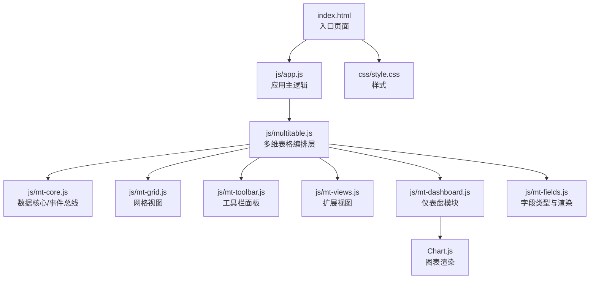
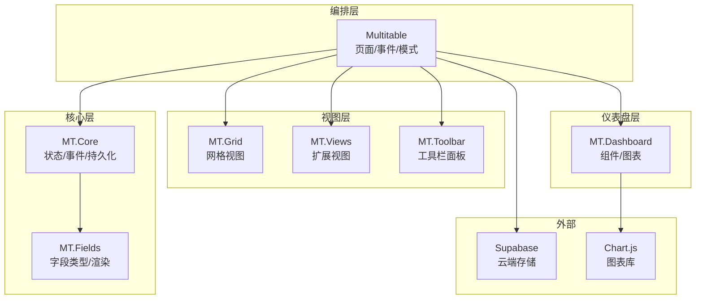
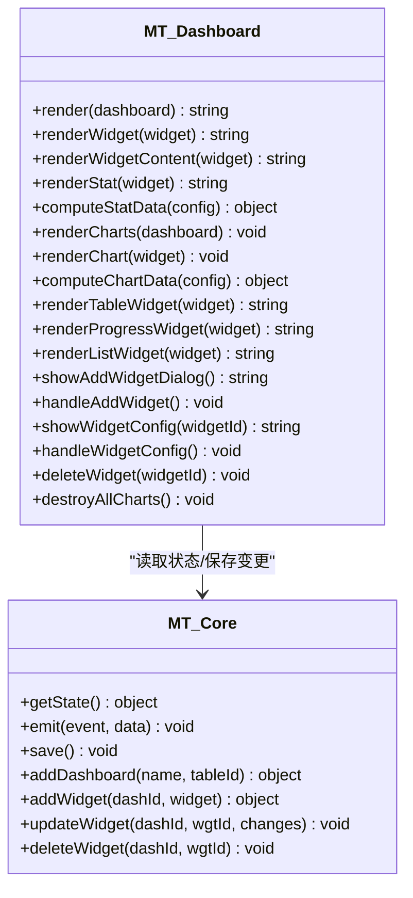
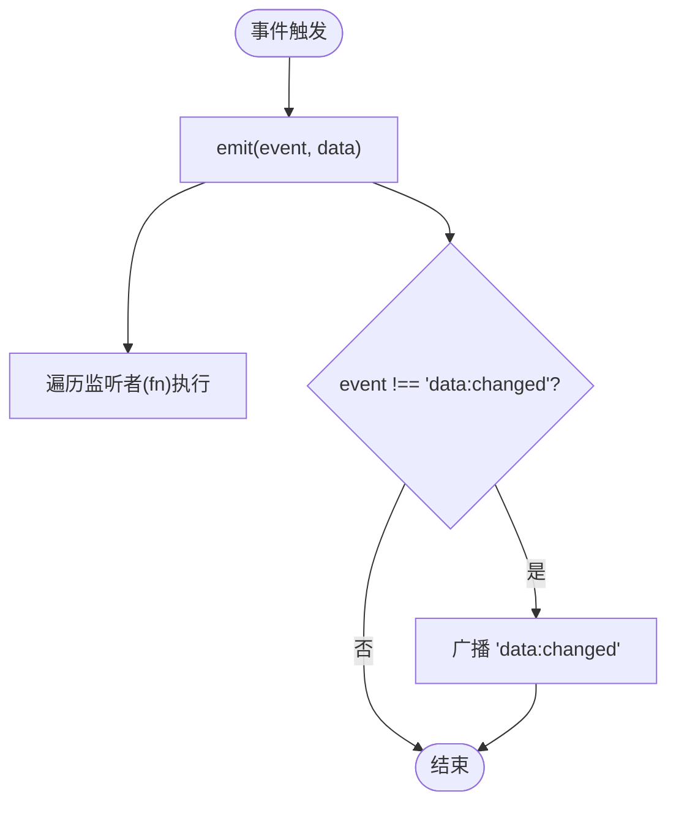
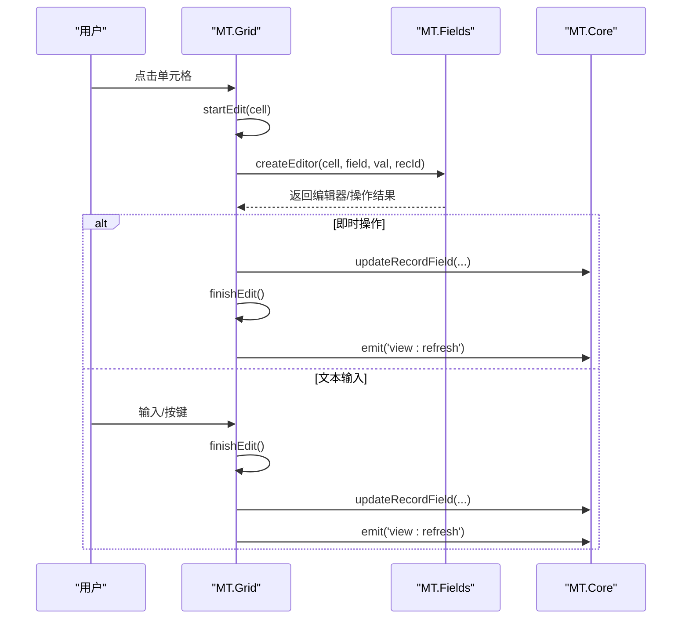
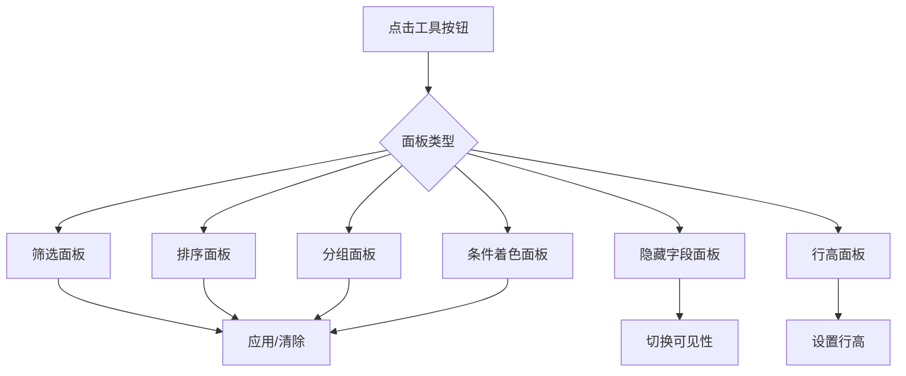
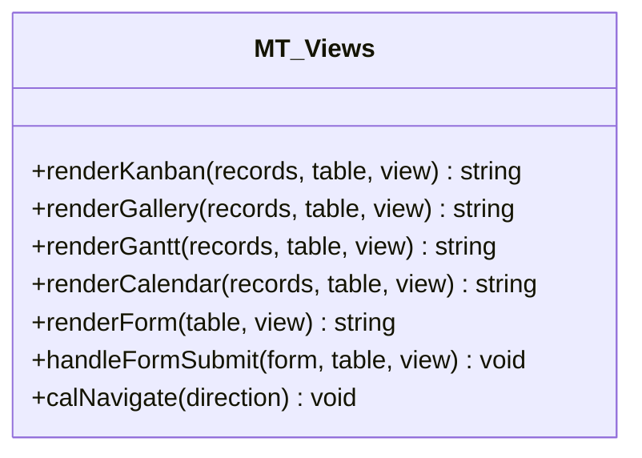
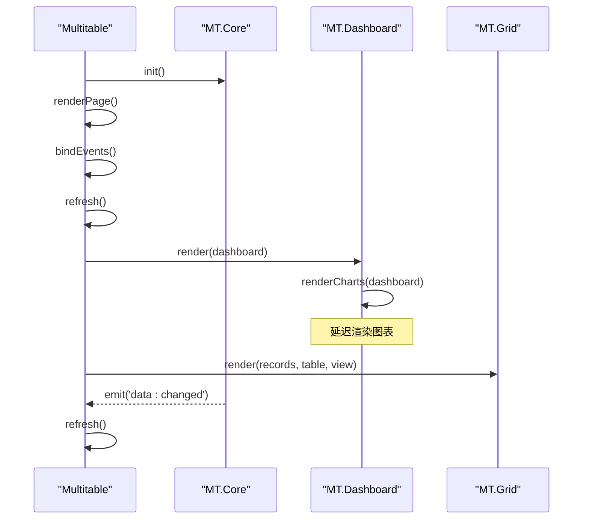
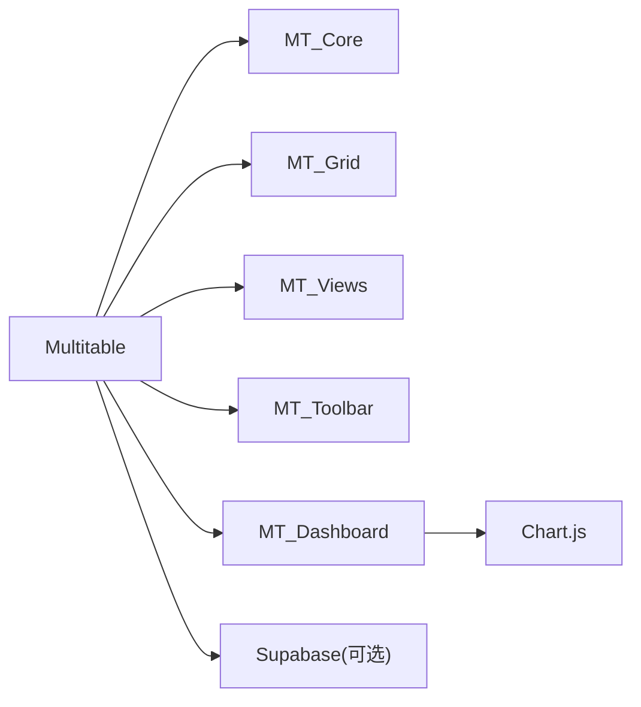

# 仪表板系统

<cite>
**本文档引用的文件**
- [index.html](file://index.html)
- [README.md](file://README.md)
- [js/config.js](file://js/config.js)
- [js/app.js](file://js/app.js)
- [js/multitable.js](file://js/multitable.js)
- [js/mt-core.js](file://js/mt-core.js)
- [js/mt-fields.js](file://js/mt-fields.js)
- [js/mt-grid.js](file://js/mt-grid.js)
- [js/mt-toolbar.js](file://js/mt-toolbar.js)
- [js/mt-views.js](file://js/mt-views.js)
- [js/mt-dashboard.js](file://js/mt-dashboard.js)
- [css/style.css](file://css/style.css)
</cite>

## 目录
1. [简介](#简介)
2. [项目结构](#项目结构)
3. [核心组件](#核心组件)
4. [架构总览](#架构总览)
5. [详细组件分析](#详细组件分析)
6. [依赖关系分析](#依赖关系分析)
7. [性能考虑](#性能考虑)
8. [故障排查指南](#故障排查指南)
9. [结论](#结论)
10. [附录](#附录)

## 简介
本项目是一个基于纯前端的财务CRM仪表板系统，采用HTML5 + CSS3 + JavaScript技术栈，结合Chart.js实现图表渲染，通过Supabase提供云端数据存储与认证能力。系统围绕“多维表格”构建，提供表格、看板、画廊、甘特图、日历、表单等多种视图，并在此基础上提供“仪表盘”模块，支持统计卡片、图表、表格、进度、列表等组件的自由组合与配置。

## 项目结构
项目采用模块化组织，核心文件分布如下：
- 入口页面：index.html
- 应用主逻辑：js/app.js
- 多维表格编排层：js/multitable.js
- 数据核心与事件总线：js/mt-core.js
- 字段类型与渲染：js/mt-fields.js
- 网格视图增强：js/mt-grid.js
- 工具栏面板系统：js/mt-toolbar.js
- 视图扩展（看板/画廊/甘特图/日历/表单）：js/mt-views.js
- 仪表盘模块：js/mt-dashboard.js
- 样式：css/style.css

**图表来源**
- [index.html](file://index.html)
- [js/app.js](file://js/app.js)
- [js/multitable.js](file://js/multitable.js)
- [js/mt-core.js](file://js/mt-core.js)
- [js/mt-grid.js](file://js/mt-grid.js)
- [js/mt-toolbar.js](file://js/mt-toolbar.js)
- [js/mt-views.js](file://js/mt-views.js)
- [js/mt-dashboard.js](file://js/mt-dashboard.js)
- [js/mt-fields.js](file://js/mt-fields.js)
- [css/style.css](file://css/style.css)

**章节来源**
- [index.html](file://index.html)
- [README.md](file://README.md)

## 核心组件
- 数据核心（MT.Core）
  - 提供命名空间、事件总线、工作区持久化、CRUD、数据管道、撤销/重做、公式引擎、仪表盘管理等能力。
  - 关键职责：状态管理、数据迁移、视图过滤/排序/分组、导出/导入CSV、公式计算、仪表盘增删改查。
- 字段系统（MT.Fields）
  - 定义23种字段类型及其渲染器与编辑器，支持只读字段、颜色方案、下拉编辑、附件上传、关联编辑等。
- 网格视图（MT.Grid）
  - 增强表格视图，支持分组、冻结列、条件着色、行高、键盘导航、复制粘贴、列宽拖拽。
- 工具栏（MT.Toolbar）
  - 提供筛选、排序、分组、隐藏字段、行高、条件着色、CSV导入导出、撤销/重做等面板。
- 扩展视图（MT.Views）
  - 看板、画廊、甘特图、日历、表单视图的渲染与交互。
- 仪表盘（MT.Dashboard）
  - 支持统计卡片、柱线饼环雷达图、表格、进度、列表等组件，提供拖拽布局、配置对话框、图表渲染与销毁。
- 应用编排（Multitable）
  - 页面布局、事件委托、模块协调、记录详情面板、仪表盘/表格模式切换。

**章节来源**
- [js/mt-core.js](file://js/mt-core.js)
- [js/mt-fields.js](file://js/mt-fields.js)
- [js/mt-grid.js](file://js/mt-grid.js)
- [js/mt-toolbar.js](file://js/mt-toolbar.js)
- [js/mt-views.js](file://js/mt-views.js)
- [js/mt-dashboard.js](file://js/mt-dashboard.js)
- [js/multitable.js](file://js/multitable.js)

## 架构总览
系统采用“编排层 + 核心层 + 视图层 + 仪表盘层”的分层架构：
- 编排层（Multitable）负责页面骨架、事件分发、模式切换与模块协调。
- 核心层（MT.Core）提供统一的数据模型、事件总线与持久化。
- 视图层（Grid/Views）提供多种视图渲染与交互。
- 仪表盘层（Dashboard）提供组件化的小部件与图表渲染。

**图表来源**
- [js/multitable.js](file://js/multitable.js)
- [js/mt-core.js](file://js/mt-core.js)
- [js/mt-fields.js](file://js/mt-fields.js)
- [js/mt-grid.js](file://js/mt-grid.js)
- [js/mt-views.js](file://js/mt-views.js)
- [js/mt-toolbar.js](file://js/mt-toolbar.js)
- [js/mt-dashboard.js](file://js/mt-dashboard.js)

## 详细组件分析

### 仪表盘模块（MT.Dashboard）
- 组件类型
  - 统计卡片：支持计数、求和、平均、最大、最小等聚合。
  - 图表：柱状图、折线图、饼图、环形图、雷达图。
  - 表格：展示指定字段与记录数量。
  - 进度：支持数值进度与选项分布进度。
  - 列表：展示标题与副标题字段。
- 布局与交互
  - 使用CSS Grid实现12列网格布局，支持列宽/行高配置。
  - 提供添加组件、配置组件、删除组件的对话框与操作。
  - 图表渲染基于Chart.js，支持响应式与插件配置。
- 数据绑定与聚合
  - 从MT.Core状态中读取当前表与记录，按配置字段与聚合方式进行数据计算。
  - 统计卡片与图表共享同一数据计算逻辑，确保一致性。
- 生命周期管理
  - 组件创建/更新/删除均通过MT.Core保存并触发“dashboard:refresh”事件。
  - 销毁时释放Chart实例，避免内存泄漏。

**图表来源**
- [js/mt-dashboard.js](file://js/mt-dashboard.js)
- [js/mt-core.js](file://js/mt-core.js)

**章节来源**
- [js/mt-dashboard.js](file://js/mt-dashboard.js)

### 数据核心（MT.Core）
- 事件总线
  - on/off/emit提供模块间解耦通信；非“data:changed”事件会转发为“data:changed”以统一通知。
- 持久化
  - 使用localStorage存储工作区，提供节流保存、容量监控与警告。
- 数据管道
  - 过滤（eq/neq/contains/gt/lt/empty/is_true等）、排序（数字/日期/字符串）、搜索、分组。
- 仪表盘管理
  - 新建/删除仪表盘、增删改查组件、聚合数据计算。
- 公式引擎
  - 支持IF/SUM/AVG/MAX/MIN/LEN/ABS/ROUND等内置函数与字段替换。

**图表来源**
- [js/mt-core.js](file://js/mt-core.js)

**章节来源**
- [js/mt-core.js](file://js/mt-core.js)

### 网格视图（MT.Grid）
- 增强特性
  - 分组显示与汇总行、冻结列、条件着色、行高设置、键盘导航（上下左右/回车/删除/Tab）、复制粘贴。
- 编辑与输入
  - 行内编辑器支持多种字段类型，即时保存与撤销/重做。
- 列宽拖拽
  - 拖拽列头调整宽度，实时更新并持久化。

**图表来源**
- [js/mt-grid.js](file://js/mt-grid.js)
- [js/mt-fields.js](file://js/mt-fields.js)
- [js/mt-core.js](file://js/mt-core.js)

**章节来源**
- [js/mt-grid.js](file://js/mt-grid.js)

### 工具栏面板（MT.Toolbar）
- 面板类型
  - 筛选、排序、分组、隐藏字段、行高、条件着色、CSV导入导出、撤销/重做。
- 交互流程
  - 点击工具按钮弹出下拉面板，支持动态增删规则、应用/清除、字段映射与导入预览。

**图表来源**
- [js/mt-toolbar.js](file://js/mt-toolbar.js)

**章节来源**
- [js/mt-toolbar.js](file://js/mt-toolbar.js)

### 扩展视图（MT.Views）
- 看板视图：按单选字段分组，支持卡片字段与封面图配置。
- 画廊视图：按列数布局，支持封面图与字段展示。
- 甘特图：按开始/结束日期绘制条形，支持缩放与进度显示。
- 日历视图：按月显示事件，支持导航与字段配置。
- 表单视图：按字段渲染表单，支持必填、帮助文本与提交成功反馈。

**图表来源**
- [js/mt-views.js](file://js/mt-views.js)

**章节来源**
- [js/mt-views.js](file://js/mt-views.js)

### 应用编排（Multitable）
- 生命周期
  - init：初始化MT.Core，渲染页面骨架，绑定事件，订阅核心事件。
  - destroy：解绑事件、销毁图表、清理全局快捷键。
- 模式切换
  - 表格模式与仪表盘模式互斥切换，分别渲染对应内容区域。
- 事件委托
  - 统一处理点击、双击、输入、键盘、鼠标按下等事件，委派至具体模块。

**图表来源**
- [js/multitable.js](file://js/multitable.js)
- [js/mt-dashboard.js](file://js/mt-dashboard.js)
- [js/mt-grid.js](file://js/mt-grid.js)
- [js/mt-core.js](file://js/mt-core.js)

**章节来源**
- [js/multitable.js](file://js/multitable.js)

## 依赖关系分析
- 模块耦合
  - Multitable作为编排层，向上依赖MT.Core，向下依赖Grid/Views/Toolbar/Dashboard/Fields。
  - Dashboard依赖Chart.js进行图表渲染，依赖MT.Core的状态与配置。
  - Grid/Views/Toolbar均通过MT.Core的事件总线与持久化接口与核心层交互。
- 外部依赖
  - Chart.js：图表渲染库。
  - Supabase：云端存储与认证（可选，若未加载则退化为本地模式）。

**图表来源**
- [js/multitable.js](file://js/multitable.js)
- [js/mt-dashboard.js](file://js/mt-dashboard.js)
- [index.html](file://index.html)

**章节来源**
- [index.html](file://index.html)
- [js/config.js](file://js/config.js)

## 性能考虑
- 渲染优化
  - 仪表盘图表采用延迟渲染（DOM就绪后再渲染），减少首屏阻塞。
  - 网格视图支持冻结列与条件着色，建议合理设置冻结列数量与颜色规则数量。
- 事件与保存
  - MT.Core保存采用200ms防抖，降低频繁写入localStorage的开销。
  - 仪表盘组件的保存与刷新通过事件总线统一调度，避免重复渲染。
- 图表实例管理
  - 删除/切换时销毁Chart实例，防止内存泄漏；新增时重建实例，保证状态一致。
- 数据管道
  - 过滤/排序/搜索在客户端执行，建议控制记录数量或使用分页/虚拟滚动（当前未实现，可作为后续优化点）。

[本节为通用指导，无需特定文件引用]

## 故障排查指南
- Supabase初始化失败
  - 若未正确加载SDK或凭据无效，系统会退化为本地模式并输出警告。检查js/config.js中的URL与Key。
- 仪表盘图表不显示
  - 确认Canvas元素存在且容器已渲染；检查computeChartData返回的labels/values是否为空；确认Chart.js已加载。
- 事件不生效
  - 确认Multitable已绑定事件；检查事件委托的目标元素与data-action属性；查看控制台是否有异常。
- 本地存储异常
  - 当localStorage容量不足时，会触发存储警告事件；可通过清理或升级存储方案解决。

**章节来源**
- [js/config.js](file://js/config.js)
- [js/mt-dashboard.js](file://js/mt-dashboard.js)
- [js/multitable.js](file://js/multitable.js)
- [js/mt-core.js](file://js/mt-core.js)

## 结论
该仪表板系统以“多维表格”为核心，通过模块化的架构实现了从数据管理到可视化呈现的完整链路。仪表盘模块提供了灵活的组件化布局与丰富的图表类型，结合强大的数据管道与事件总线，能够满足多样化的业务看板需求。建议在生产环境中进一步完善云端同步、权限控制与性能优化（如虚拟滚动、懒加载图表等）。

[本节为总结，无需特定文件引用]

## 附录

### 支持的图表类型与配置
- 类型：柱状图、折线图、饼图、环形图、雷达图。
- 配置：数据源表、分组字段、数值字段、聚合方式、图表颜色主题、图例显示等。
- 样式：背景色、描边色、透明度、填充、曲线张力等。

**章节来源**
- [js/mt-dashboard.js](file://js/mt-dashboard.js)

### 自定义小部件开发指南
- 步骤
  - 在仪表盘添加组件时，选择“自定义类型”，在配置中指定数据源与字段。
  - 通过MT.Core.getState()读取当前表与记录，实现自定义聚合与渲染。
  - 使用MT.Core.emit('dashboard:refresh')触发仪表盘刷新。
- 注意事项
  - 保持配置字段与数据类型匹配，避免渲染异常。
  - 合理设置列宽/行高，确保布局美观。
  - 图表组件需在DOM就绪后渲染，避免Canvas缺失。

**章节来源**
- [js/mt-dashboard.js](file://js/mt-dashboard.js)
- [js/mt-core.js](file://js/mt-core.js)

### 响应式设计与布局
- 布局
  - 仪表盘采用CSS Grid，支持12列网格与动态span。
  - 工具栏与视图切换栏在不同模式下动态显示/隐藏。
- 响应式
  - 网格视图支持列宽拖拽与冻结列，适合大屏与桌面端。
  - 仪表盘组件在小屏设备上可考虑全屏模式与滚动优化。

**章节来源**
- [css/style.css](file://css/style.css)
- [js/multitable.js](file://js/multitable.js)