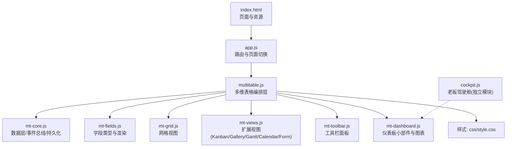
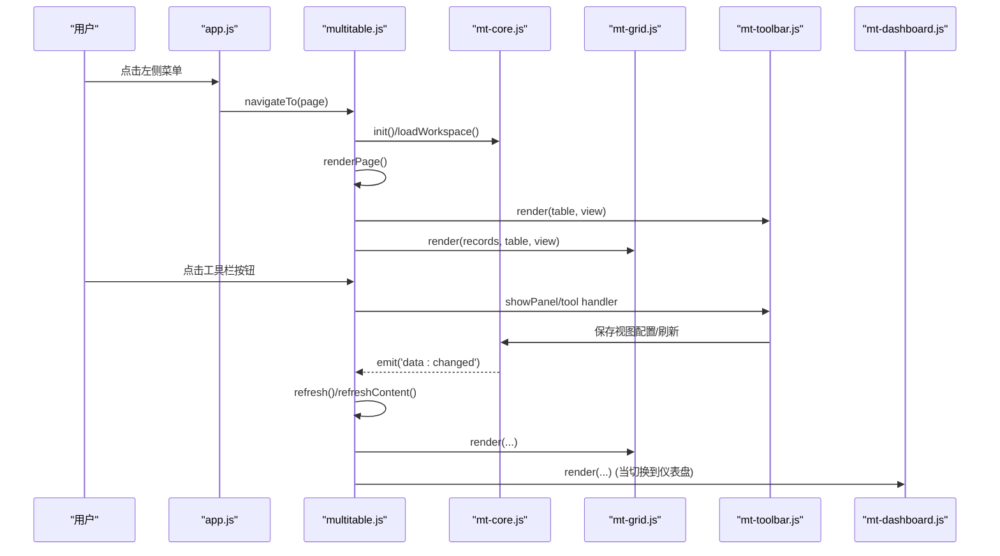
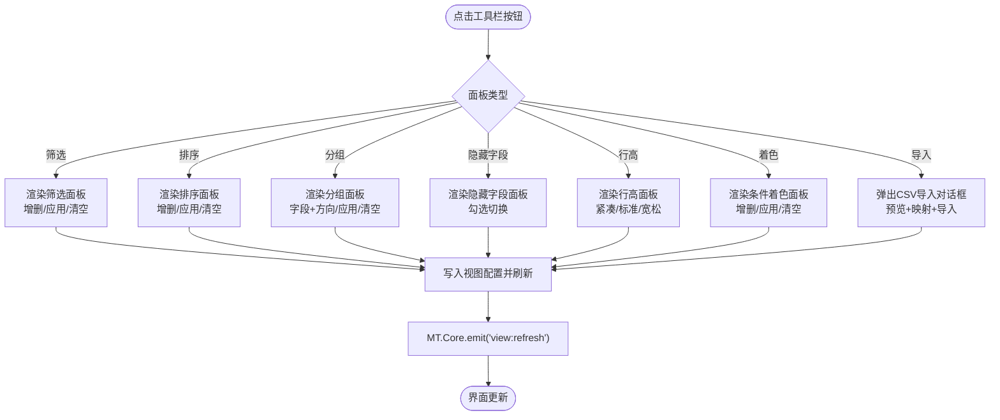
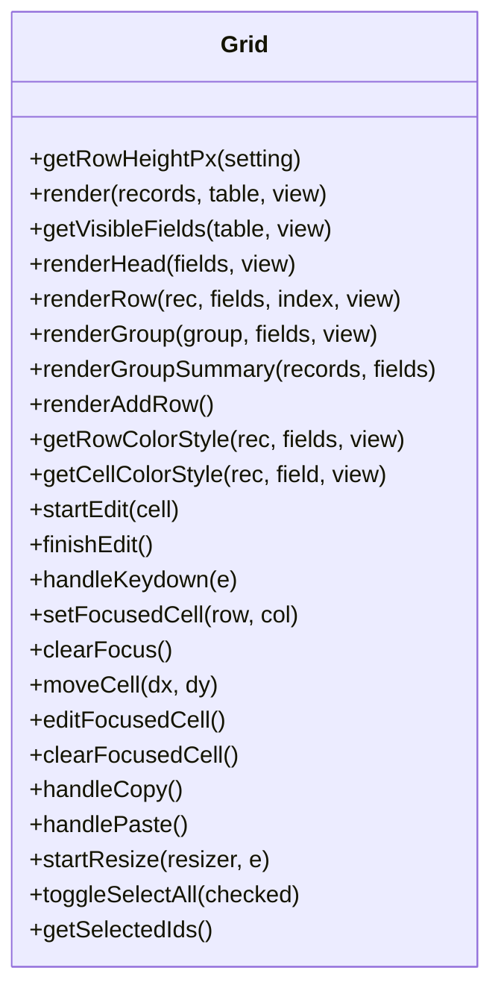
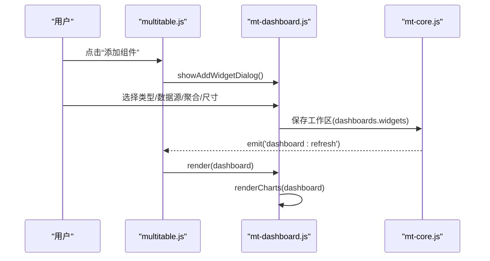
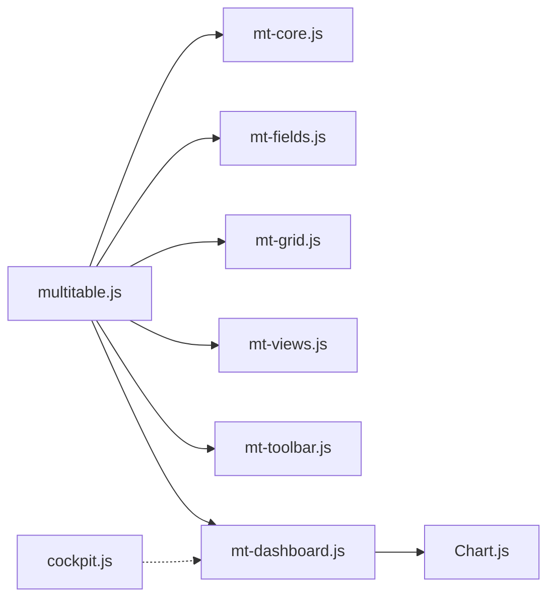

# 工具栏与仪表板

<cite>
**本文引用的文件**
- [index.html](file://index.html)
- [js/app.js](file://js/app.js)
- [js/multitable.js](file://js/multitable.js)
- [js/mt-core.js](file://js/mt-core.js)
- [js/mt-fields.js](file://js/mt-fields.js)
- [js/mt-grid.js](file://js/mt-grid.js)
- [js/mt-toolbar.js](file://js/mt-toolbar.js)
- [js/mt-dashboard.js](file://js/mt-dashboard.js)
- [js/mt-views.js](file://js/mt-views.js)
- [js/cockpit.js](file://js/cockpit.js)
- [css/style.css](file://css/style.css)
</cite>

## 目录
1. [简介](#简介)
2. [项目结构](#项目结构)
3. [核心组件](#核心组件)
4. [架构总览](#架构总览)
5. [详细组件分析](#详细组件分析)
6. [依赖关系分析](#依赖关系分析)
7. [性能考量](#性能考量)
8. [故障排查指南](#故障排查指南)
9. [结论](#结论)
10. [附录](#附录)

## 简介
本技术文档面向“陈苗多维表格工具栏与仪表板系统”，系统提供强大的表格视图、筛选/排序/分组/隐藏列/行高/条件着色等工具栏能力，以及基于 Chart.js 的仪表板小部件渲染与管理。文档从架构、组件职责、数据流、交互处理、扩展与定制、性能优化与用户体验设计等方面进行深入解析，帮助开发者快速理解与二次开发。

## 项目结构
系统采用模块化分层：
- 页面与路由：index.html + app.js
- 多维表格编排层：multitable.js
- 核心数据层：mt-core.js
- 字段类型与渲染：mt-fields.js
- 网格视图：mt-grid.js
- 视图扩展（看板/画廊/甘特/日历/表单）：mt-views.js
- 工具栏面板：mt-toolbar.js
- 仪表板：mt-dashboard.js
- 老板驾驶舱（独立模块）：cockpit.js
- 样式：css/style.css

图表来源
- [index.html:1-381](file://index.html#L1-L381)
- [js/app.js:1-156](file://js/app.js#L1-L156)
- [js/multitable.js:1-624](file://js/multitable.js#L1-L624)
- [js/mt-core.js:1-200](file://js/mt-core.js#L1-L200)
- [js/mt-fields.js:1-632](file://js/mt-fields.js#L1-L632)
- [js/mt-grid.js:1-358](file://js/mt-grid.js#L1-L358)
- [js/mt-views.js:1-200](file://js/mt-views.js#L1-L200)
- [js/mt-toolbar.js:1-394](file://js/mt-toolbar.js#L1-L394)
- [js/mt-dashboard.js:1-493](file://js/mt-dashboard.js#L1-L493)
- [js/cockpit.js:1-624](file://js/cockpit.js#L1-L624)
- [css/style.css:1-200](file://css/style.css#L1-L200)

章节来源
- [index.html:1-381](file://index.html#L1-L381)
- [js/app.js:1-156](file://js/app.js#L1-L156)

## 核心组件
- 多维表格编排层（multitable.js）：负责页面布局、事件委托、模块协调、记录详情面板、视图切换、仪表盘渲染与刷新。
- 数据层（mt-core.js）：命名空间、事件总线、工作区持久化、CRUD、数据管道、撤销/重做、公式引擎。
- 字段系统（mt-fields.js）：23种字段类型渲染器与编辑器，标签配色、只读判断、面板编辑器、字段配置对话框。
- 网格视图（mt-grid.js）：支持分组、冻结列、条件着色、行高、键盘导航、复制粘贴、列宽拖拽。
- 扩展视图（mt-views.js）：看板、画廊、甘特图、日历、表单视图。
- 工具栏（mt-toolbar.js）：筛选、排序、分组、隐藏字段、行高、条件着色、CSV导入/导出、右键菜单。
- 仪表板（mt-dashboard.js）：统计卡片、柱线饼环雷达图、表格/进度/列表小部件、拖拽布局、配置与删除。
- 老板驾驶舱（cockpit.js）：独立模块，模拟数据与图表渲染。

章节来源
- [js/multitable.js:1-624](file://js/multitable.js#L1-L624)
- [js/mt-core.js:1-200](file://js/mt-core.js#L1-L200)
- [js/mt-fields.js:1-632](file://js/mt-fields.js#L1-L632)
- [js/mt-grid.js:1-358](file://js/mt-grid.js#L1-L358)
- [js/mt-views.js:1-200](file://js/mt-views.js#L1-L200)
- [js/mt-toolbar.js:1-394](file://js/mt-toolbar.js#L1-L394)
- [js/mt-dashboard.js:1-493](file://js/mt-dashboard.js#L1-L493)
- [js/cockpit.js:1-624](file://js/cockpit.js#L1-L624)

## 架构总览
多维表格系统通过“编排层 + 核心层 + 视图层 + 工具栏 + 仪表板”的分层设计，实现清晰的职责分离与高扩展性。编排层统一调度数据层与视图层，工具栏与仪表板作为增强交互与可视化的能力模块，既可独立使用，也可与表格视图联动。

图表来源
- [js/app.js:85-135](file://js/app.js#L85-L135)
- [js/multitable.js:13-624](file://js/multitable.js#L13-L624)
- [js/mt-core.js:15-95](file://js/mt-core.js#L15-L95)
- [js/mt-grid.js:14-37](file://js/mt-grid.js#L14-L37)
- [js/mt-toolbar.js:9-36](file://js/mt-toolbar.js#L9-L36)
- [js/mt-dashboard.js:9-25](file://js/mt-dashboard.js#L9-L25)

## 详细组件分析

### 工具栏与面板系统（mt-toolbar.js）
- 渲染：根据视图配置动态显示筛选/排序/分组/隐藏字段/行高/着色等按钮，并在搜索框中显示当前查询。
- 面板类型：
  - 筛选面板：支持字段、运算符、值输入；批量增删；应用/清空。
  - 排序面板：字段+升降序；批量增删；应用/清空。
  - 分组面板：分组字段与排序方向；应用/清空。
  - 隐藏字段面板：勾选显示/隐藏字段。
  - 行高面板：紧凑/标准/宽松三档。
  - 条件着色面板：字段、运算符、值、背景色；批量增删；应用/清空。
  - CSV导入：文件选择、预览、字段映射、导入。
- 事件处理：统一委托到 handlePanelAction，写入视图配置并触发刷新。
- 右键菜单：字段菜单与表菜单，支持重命名、插入列、隐藏、冻结、删除等。
- 动态显示逻辑：按钮根据视图状态（filters/sorts/groupBy/hiddenFields/rowHeight/colorRules）高亮或显示数量。

图表来源
- [js/mt-toolbar.js:9-394](file://js/mt-toolbar.js#L9-L394)
- [js/multitable.js:191-308](file://js/multitable.js#L191-L308)

章节来源
- [js/mt-toolbar.js:1-394](file://js/mt-toolbar.js#L1-L394)
- [js/multitable.js:191-308](file://js/multitable.js#L191-L308)

### 网格视图与条件着色（mt-grid.js）
- 行高：根据视图 rowHeight 设置行高像素值，渲染不同类名。
- 可见字段：结合 fieldOrder 与 hiddenFields 排序与过滤可见字段。
- 条件着色：行级与单元格级匹配规则，支持多种运算符（等于/不等于/包含/大小比较/空值/布尔）。
- 编辑：行内编辑器创建与即时保存，支持键盘 Enter/Escape/Tab 导航。
- 键盘导航：上下左右移动焦点，Enter 进入编辑，Delete/Backspace 清空当前单元格。
- 复制粘贴：支持单值与多单元格区域粘贴，自动类型转换。
- 列宽拖拽：拖动列头右侧拖拽条调整列宽，实时更新并保存。
- 冻结列：根据 frozenColumns 设置左侧固定列，使用 sticky 定位。

图表来源
- [js/mt-grid.js:6-358](file://js/mt-grid.js#L6-L358)

章节来源
- [js/mt-grid.js:1-358](file://js/mt-grid.js#L1-L358)

### 字段类型与渲染（mt-fields.js）
- 字段类型：23种类型，含基础、选择、高级、系统、关联等类别，提供图标与标签。
- 渲染：单元格渲染器针对不同类型输出对应 HTML（文本、标签、评分、进度、附件、链接、日期等）。
- 编辑器：行内编辑器与面板编辑器，支持下拉、多选、人员、进度、附件、链接等复杂编辑场景。
- 配置：字段配置对话框，支持小数位、货币符号、最高分、颜色、选项、自动编号前缀与位数、公式表达式、关联表/字段等。
- 只读判断：对创建/更新时间、自动编号、公式、查找引用等字段标记只读。

章节来源
- [js/mt-fields.js:1-632](file://js/mt-fields.js#L1-L632)

### 扩展视图（mt-views.js）
- 看板视图：基于单选字段分组，支持卡片字段与封面字段配置。
- 画廊视图：支持列数配置，封面图片优先。
- 甘特图：支持开始/结束/进度字段配置，缩放（日/周/月），今日线。
- 日历视图：基于日期字段展示事件。
- 表单视图：基于字段渲染表单。

章节来源
- [js/mt-views.js:1-200](file://js/mt-views.js#L1-L200)

### 仪表板系统（mt-dashboard.js）
- 渲染：仪表盘容器、头部、网格布局、小部件列表。
- 小部件类型：
  - 统计卡片：支持计数/求和/平均/最大/最小聚合。
  - 图表：柱状/折线/饼图/环形/雷达图，按分组字段与数值字段聚合。
  - 表格：展示指定字段与记录数量。
  - 进度：数值进度或单选状态分布。
  - 列表：标题/副标题字段展示。
- 配置与管理：添加/删除/配置小部件，支持列宽与行高调整。
- 图表渲染：延迟渲染，销毁旧实例，避免内存泄漏。
- 事件：监听 dashboard:refresh，触发重新渲染与图表重绘。

图表来源
- [js/multitable.js:579-622](file://js/multitable.js#L579-L622)
- [js/mt-dashboard.js:9-493](file://js/mt-dashboard.js#L9-L493)

章节来源
- [js/mt-dashboard.js:1-493](file://js/mt-dashboard.js#L1-L493)
- [js/multitable.js:579-622](file://js/multitable.js#L579-L622)

### 老板驾驶舱（cockpit.js）
- 独立模块，提供模拟数据与图表渲染，包含 KPI、趋势图、分布图、排行榜与活动提醒。
- 图表使用 Chart.js，包含折线图、环形图、柱状图等。

章节来源
- [js/cockpit.js:1-624](file://js/cockpit.js#L1-L624)

## 依赖关系分析
- 多维表格编排层依赖核心层与视图层，同时与工具栏、仪表板进行事件通信。
- 工具栏依赖核心层读取/写入视图配置，依赖字段系统渲染单元格与编辑器。
- 仪表板依赖核心层获取工作区数据，依赖 Chart.js 渲染图表。
- 老板驾驶舱为独立模块，不依赖多维表格核心层。

图表来源
- [js/multitable.js:1-624](file://js/multitable.js#L1-L624)
- [js/mt-core.js:1-200](file://js/mt-core.js#L1-L200)
- [js/mt-fields.js:1-632](file://js/mt-fields.js#L1-L632)
- [js/mt-grid.js:1-358](file://js/mt-grid.js#L1-L358)
- [js/mt-views.js:1-200](file://js/mt-views.js#L1-L200)
- [js/mt-toolbar.js:1-394](file://js/mt-toolbar.js#L1-L394)
- [js/mt-dashboard.js:1-493](file://js/mt-dashboard.js#L1-L493)
- [js/cockpit.js:1-624](file://js/cockpit.js#L1-L624)

章节来源
- [js/multitable.js:1-624](file://js/multitable.js#L1-L624)

## 性能考量
- 渲染优化
  - 网格视图：列宽拖拽与冻结列使用 CSS sticky，减少重排；条件着色按规则匹配，建议控制规则数量。
  - 仪表板：图表实例缓存与销毁，避免重复创建；延迟渲染图表，确保 DOM 就绪。
- 事件与刷新
  - 工具栏面板操作统一通过视图配置变更触发刷新，避免多次重绘。
  - 记录详情面板输入采用防抖保存，降低频繁写入。
- 存储与容量
  - 核心层提供存储使用量监控与警告事件，建议定期清理或压缩数据。
- 键盘与复制粘贴
  - 网格视图的键盘导航与复制粘贴在大数据集上应谨慎使用，建议配合筛选/分页。

章节来源
- [js/mt-grid.js:327-358](file://js/mt-grid.js#L327-L358)
- [js/mt-dashboard.js:104-172](file://js/mt-dashboard.js#L104-L172)
- [js/mt-core.js:70-74](file://js/mt-core.js#L70-L74)
- [js/multitable.js:445-458](file://js/multitable.js#L445-L458)

## 故障排查指南
- 工具栏面板不显示
  - 检查视图 filters/sorts/groupBy/hiddenFields/rowHeight/colorRules 是否存在且正确。
  - 确认 MT.Core.emit('view:refresh') 是否被触发。
- 图表不渲染
  - 确认 Canvas 元素存在，Chart.js 已加载。
  - 检查 computeChartData 返回的 labels/values 是否为空。
  - 注意图表实例销毁与重建时机。
- 条件着色无效
  - 检查 colorRules 的字段 ID、运算符与值是否匹配。
  - 确认视图 rowHeight 与 frozenColumns 不影响样式覆盖。
- CSV 导入失败
  - 检查文件编码与分隔符，确认字段映射正确。
  - 确认 applyImport 调用与视图刷新。
- 键盘导航异常
  - 确认网格处于焦点状态，且非编辑模式。
  - 检查键盘事件绑定与事件冒泡。

章节来源
- [js/mt-toolbar.js:259-339](file://js/mt-toolbar.js#L259-L339)
- [js/mt-dashboard.js:115-172](file://js/mt-dashboard.js#L115-L172)
- [js/mt-grid.js:124-158](file://js/mt-grid.js#L124-L158)
- [js/mt-grid.js:210-266](file://js/mt-grid.js#L210-L266)

## 结论
该系统通过清晰的分层与模块化设计，提供了强大的表格工具栏与仪表板能力。工具栏面板具备完善的筛选/排序/分组/隐藏列/行高/条件着色与 CSV 能力；网格视图支持丰富的交互与性能优化；仪表板提供多样化的可视化小部件与图表渲染。整体架构易于扩展与定制，适合在多维数据管理与可视化场景中落地。

## 附录

### 开发与扩展指南
- 工具栏扩展
  - 在 MT.Toolbar 中新增面板类型：渲染 HTML、处理面板动作、写入视图配置并触发刷新。
  - 若涉及字段选择，复用 MT.Core.tbl().fields 与 MT.Core.viw()。
- 仪表板扩展
  - 新增小部件类型：在 renderWidgetContent 中添加类型分支，实现渲染与配置对话框。
  - 图表类型：在 renderCharts 中识别类型并调用 computeChartData。
- 性能优化建议
  - 对大数据集使用虚拟滚动或分页。
  - 控制条件着色规则数量，避免过多匹配。
  - 图表渲染采用延迟与节流策略。
- 用户体验设计
  - 提供默认值与占位提示，提升首次使用体验。
  - 保持一致的图标与文案风格，遵循 css/style.css 的主题变量。

章节来源
- [js/mt-toolbar.js:9-394](file://js/mt-toolbar.js#L9-L394)
- [js/mt-dashboard.js:27-493](file://js/mt-dashboard.js#L27-L493)
- [css/style.css:1-200](file://css/style.css#L1-L200)