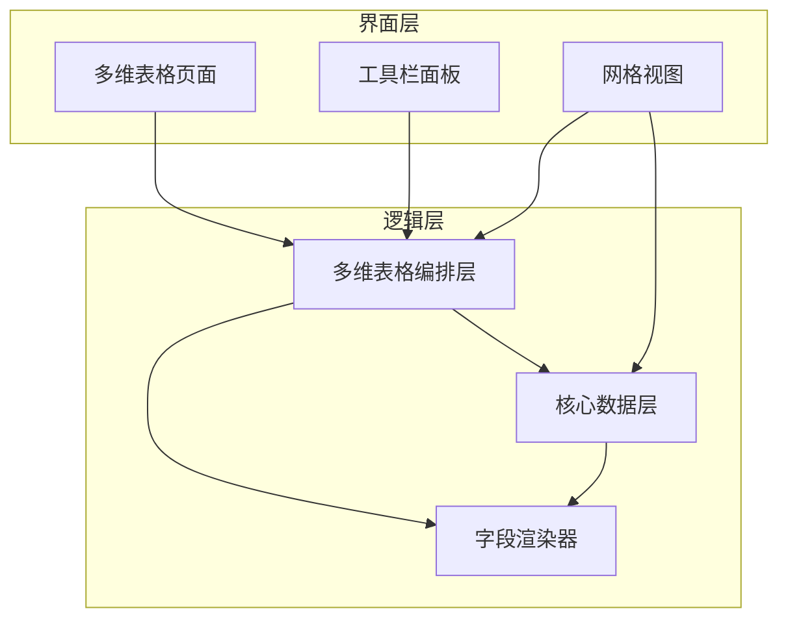
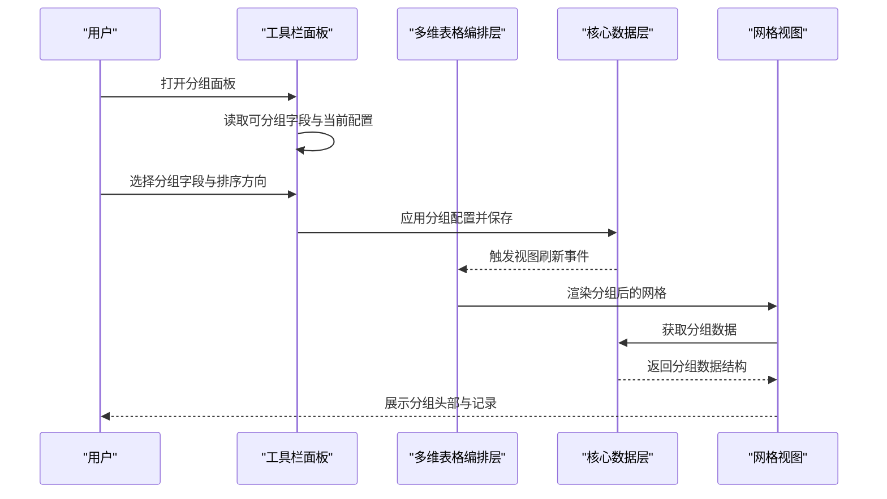
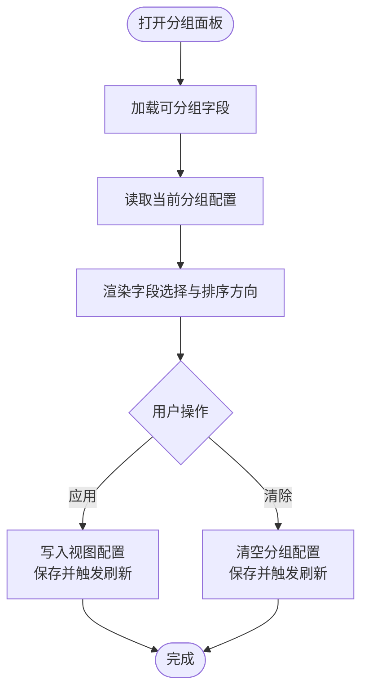
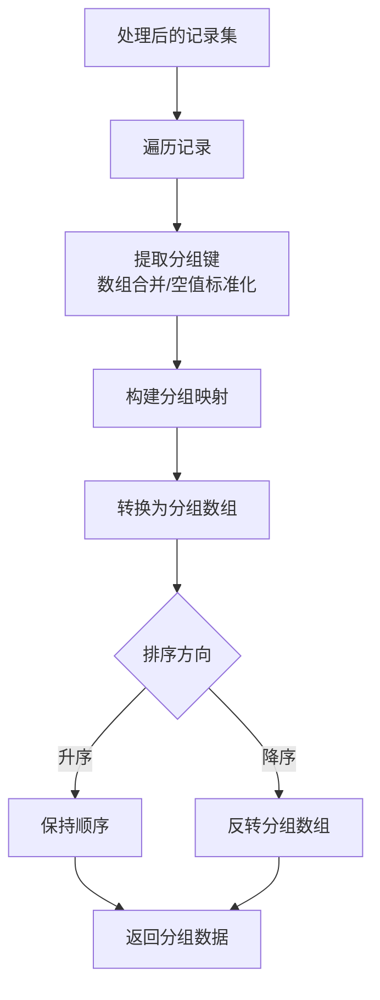
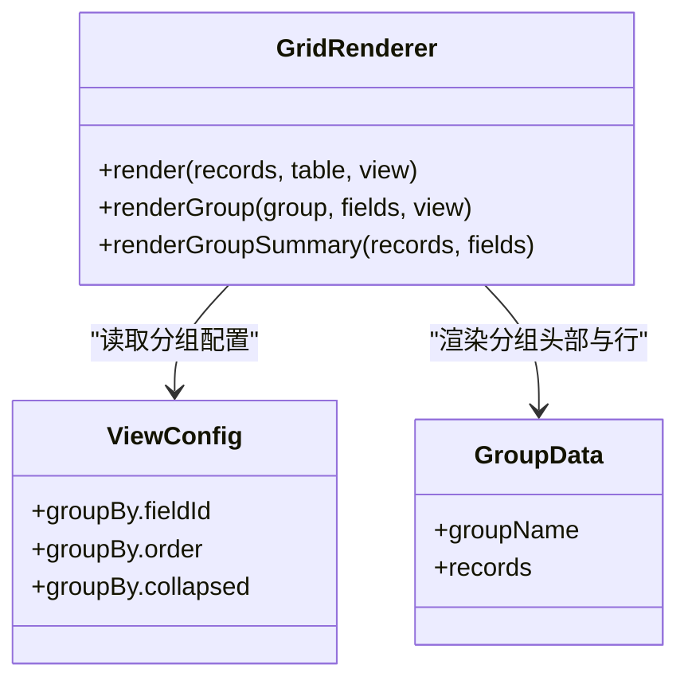
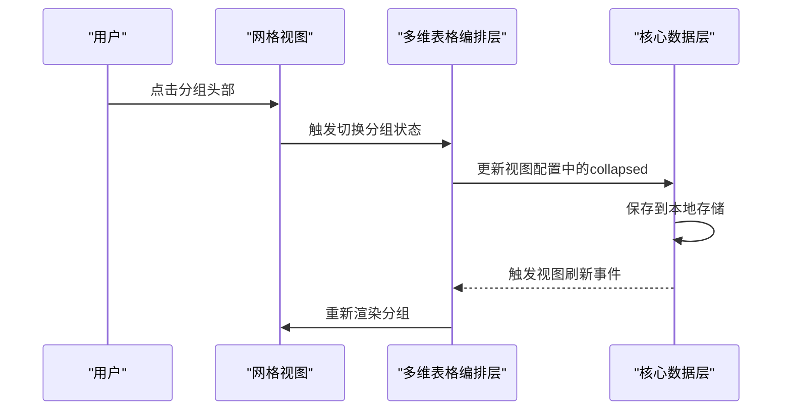
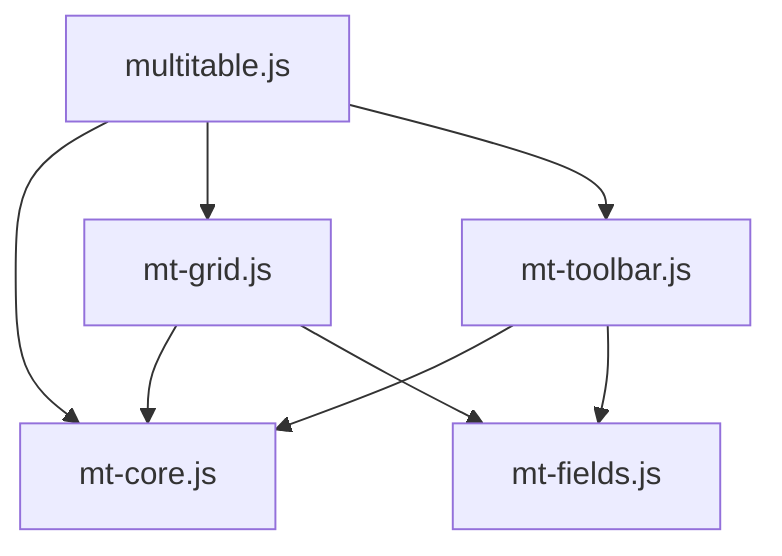

# 分组面板

<cite>
**本文档引用的文件**
- [index.html](file://index.html)
- [README.md](file://README.md)
- [multitable.js](file://js/multitable.js)
- [mt-grid.js](file://js/mt-grid.js)
- [mt-core.js](file://js/mt-core.js)
- [mt-toolbar.js](file://js/mt-toolbar.js)
- [mt-fields.js](file://js/mt-fields.js)
</cite>

## 目录
1. [简介](#简介)
2. [项目结构](#项目结构)
3. [核心组件](#核心组件)
4. [架构概览](#架构概览)
5. [详细组件分析](#详细组件分析)
6. [依赖分析](#依赖分析)
7. [性能考虑](#性能考虑)
8. [故障排除指南](#故障排除指南)
9. [结论](#结论)
10. [附录](#附录)

## 简介
本文件为陈苗多维表格系统的分组面板技术文档，聚焦于分组功能的实现原理与工程实践。文档覆盖以下关键主题：
- 可分组字段的筛选条件（select、multiselect、checkbox、person、rating 类型）
- 分组字段的选择机制、分组顺序设置（升序/降序）
- 分组展开/折叠的状态管理与持久化
- 分组数据的聚合计算与分组头部渲染逻辑
- 分组层级关系处理与大数据量下的性能优化策略
- 复杂分组场景的实现示例与用户体验优化建议

## 项目结构
多维表格系统采用模块化架构，分组功能由多个模块协同实现：
- 多维表格编排层：负责页面布局、事件委托与模块协调
- 核心数据层：提供数据管道、分组算法与持久化
- 网格视图：负责分组渲染、分组头部与行渲染
- 工具栏面板：提供分组配置面板与交互入口
- 字段渲染器：提供字段类型与渲染逻辑

**图表来源**
- [index.html](file://index.html)
- [multitable.js](file://js/multitable.js)
- [mt-grid.js](file://js/mt-grid.js)
- [mt-core.js](file://js/mt-core.js)
- [mt-fields.js](file://js/mt-fields.js)

**章节来源**
- [index.html](file://index.html)
- [README.md](file://README.md)

## 核心组件
分组功能的核心由以下组件构成：
- 分组配置面板：通过工具栏面板选择分组字段与排序方向，并应用到当前视图
- 数据管道：在过滤、排序、搜索之后执行分组，生成分组数据结构
- 网格渲染：根据分组数据渲染分组头部、展开/折叠状态与聚合摘要
- 状态管理：维护分组展开/折叠状态并在视图配置中持久化

关键实现要点：
- 可分组字段类型限定为 select、multiselect、checkbox、person、rating
- 分组顺序支持升序/降序
- 展开/折叠状态存储在视图配置的 collapsed 数组中
- 聚合计算基于数值型字段进行汇总

**章节来源**
- [mt-toolbar.js](file://js/mt-toolbar.js)
- [mt-core.js](file://js/mt-core.js)
- [mt-grid.js](file://js/mt-grid.js)

## 架构概览
分组功能的运行时架构如下：

**图表来源**
- [mt-toolbar.js](file://js/mt-toolbar.js)
- [multitable.js](file://js/multitable.js)
- [mt-core.js](file://js/mt-core.js)
- [mt-grid.js](file://js/mt-grid.js)

## 详细组件分析

### 组件A：分组配置面板
分组配置面板负责：
- 字段筛选：仅显示可见且类型为 select、multiselect、checkbox、person、rating 的字段
- 排序方向：支持升序/降序
- 应用与清除：将配置写入当前视图并触发刷新，或清除分组配置

**图表来源**
- [mt-toolbar.js](file://js/mt-toolbar.js)

**章节来源**
- [mt-toolbar.js](file://js/mt-toolbar.js)

### 组件B：数据管道与分组算法
数据管道在过滤、排序、搜索后执行分组，生成分组数据结构：
- 输入：处理后的记录集（已应用过滤、排序、搜索）
- 分组键：从记录值提取，数组类型合并为字符串，空值统一为 "(空)"
- 结果：分组数组，每个元素包含 groupName 与 records

**图表来源**
- [mt-core.js](file://js/mt-core.js)

**章节来源**
- [mt-core.js](file://js/mt-core.js)

### 组件C：网格渲染与分组头部
网格视图负责：
- 渲染分组头部：包含展开/折叠图标、分组名称、记录数量、聚合摘要
- 展开/折叠控制：点击分组头部切换 collapsed 状态
- 行渲染：仅在展开状态下渲染分组内的记录

**图表来源**
- [mt-grid.js](file://js/mt-grid.js)
- [mt-core.js](file://js/mt-core.js)

**章节来源**
- [mt-grid.js](file://js/mt-grid.js)

### 组件D：状态管理与持久化
状态管理涉及：
- 展开/折叠状态：存储在视图配置的 collapsed 数组中
- 持久化：每次状态变更后保存到本地存储
- 刷新：状态变更触发视图刷新

**图表来源**
- [multitable.js](file://js/multitable.js)
- [mt-grid.js](file://js/mt-grid.js)
- [mt-core.js](file://js/mt-core.js)

**章节来源**
- [multitable.js](file://js/multitable.js)
- [mt-grid.js](file://js/mt-grid.js)
- [mt-core.js](file://js/mt-core.js)

## 依赖分析
分组功能的模块依赖关系如下：

**图表来源**
- [mt-toolbar.js](file://js/mt-toolbar.js)
- [mt-core.js](file://js/mt-core.js)
- [mt-grid.js](file://js/mt-grid.js)
- [multitable.js](file://js/multitable.js)
- [mt-fields.js](file://js/mt-fields.js)

**章节来源**
- [mt-toolbar.js](file://js/mt-toolbar.js)
- [mt-core.js](file://js/mt-core.js)
- [mt-grid.js](file://js/mt-grid.js)
- [multitable.js](file://js/multitable.js)
- [mt-fields.js](file://js/mt-fields.js)

## 性能考虑
针对大数据量分组的性能优化建议：
- 分组前的数据预处理：优先应用过滤与排序，减少参与分组的数据量
- 虚拟滚动：在超大分组场景下采用虚拟滚动渲染，仅渲染可视区域
- 懒加载：分组头部展开时再请求/渲染该分组的记录
- 本地缓存：对分组结果进行缓存，避免重复计算
- 异步渲染：在主线程空闲时进行分组渲染，保证交互流畅性
- 字段索引：对常用分组字段建立索引，加速分组键提取

## 故障排除指南
常见问题与排查步骤：
- 分组字段不可见
  - 检查字段是否可见且类型为 select、multiselect、checkbox、person、rating
  - 确认字段在视图中未被隐藏
- 分组不生效
  - 检查视图配置中的 groupBy 是否正确设置
  - 确认数据中对应字段值非空且可识别
- 展开/折叠状态异常
  - 检查 collapsed 数组是否正确更新
  - 确认本地存储保存成功
- 聚合计算错误
  - 检查聚合字段类型是否为数值型
  - 确认数据中数值字段的格式正确

**章节来源**
- [mt-toolbar.js](file://js/mt-toolbar.js)
- [mt-core.js](file://js/mt-core.js)
- [mt-grid.js](file://js/mt-grid.js)

## 结论
分组面板通过清晰的模块划分与数据管道设计，实现了灵活的分组配置、高效的分组渲染与稳定的状态持久化。结合性能优化策略，可在大数据量场景下保持良好的用户体验。

## 附录
- 复杂分组场景示例
  - 多字段组合分组：通过自定义字段或公式字段实现复合分组键
  - 动态分组：根据用户选择动态切换分组字段与排序方向
  - 分组嵌套：在看板视图中结合分组实现二级分组
- 用户体验优化建议
  - 提供分组预览与批量操作
  - 增加分组统计信息与导出功能
  - 优化移动端分组交互与响应速度