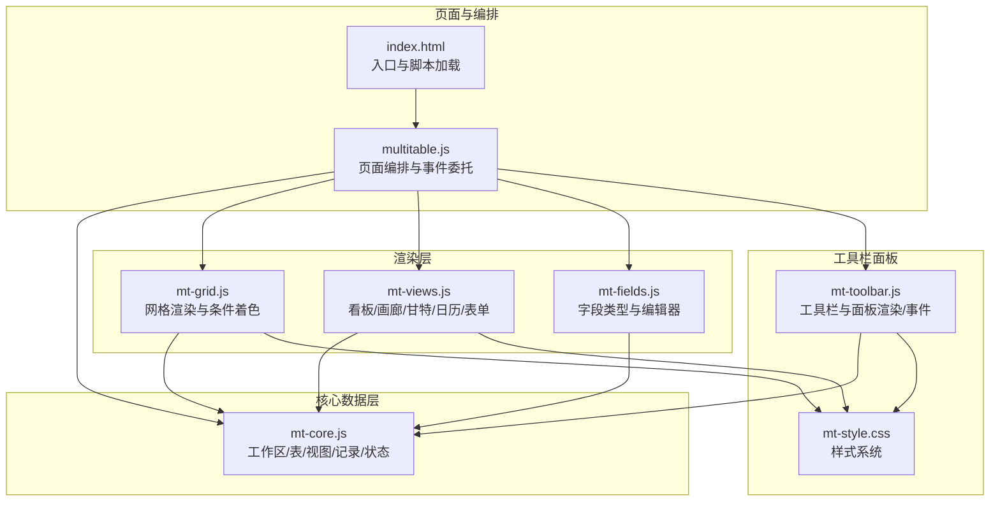
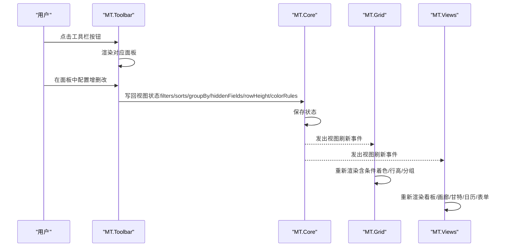
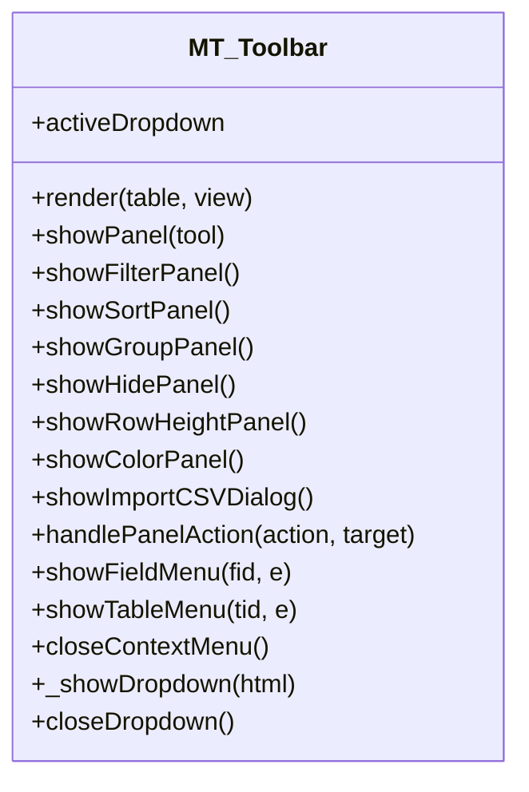
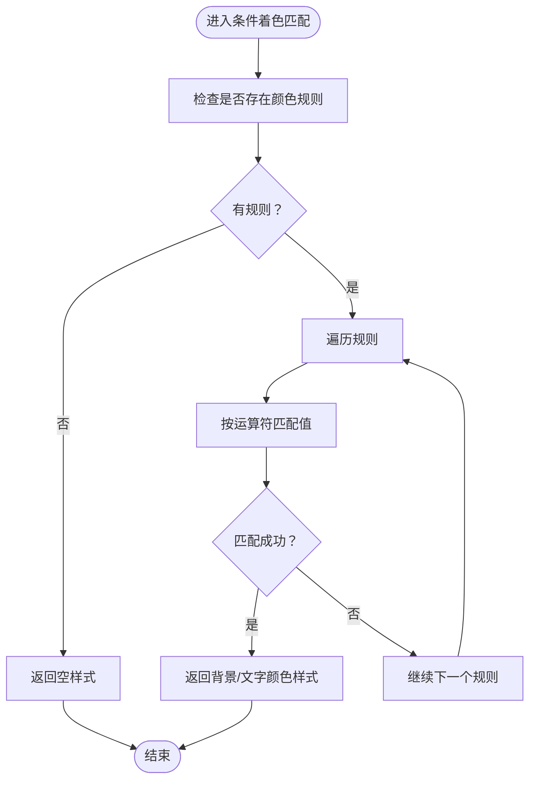
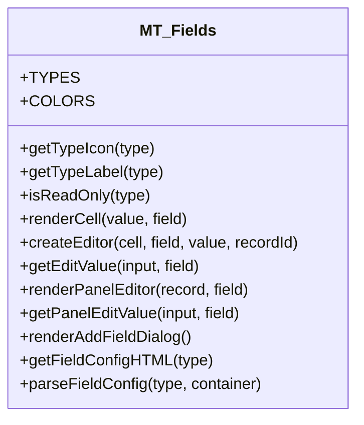
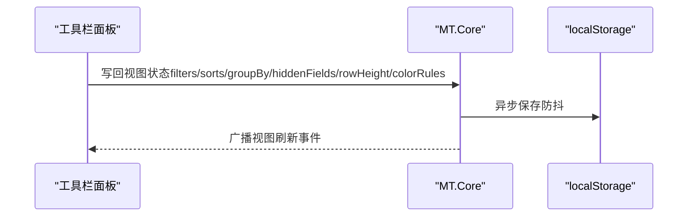
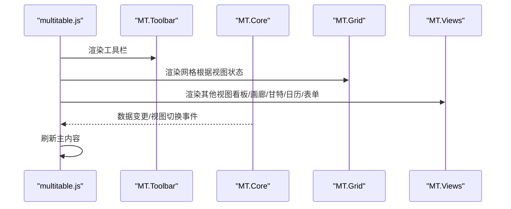
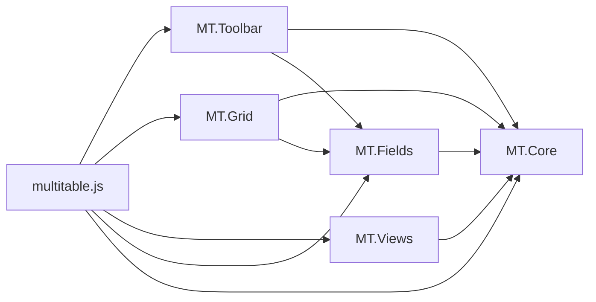

# 工具栏面板系统

<cite>
**本文引用的文件列表**
- [mt-toolbar.js](file://js/mt-toolbar.js)
- [mt-grid.js](file://js/mt-grid.js)
- [mt-fields.js](file://js/mt-fields.js)
- [mt-core.js](file://js/mt-core.js)
- [multitable.js](file://js/multitable.js)
- [mt-views.js](file://js/mt-views.js)
- [index.html](file://index.html)
- [mt-style.css](file://css/mt-style.css)
</cite>

## 目录
1. [简介](#简介)
2. [项目结构](#项目结构)
3. [核心组件](#核心组件)
4. [架构总览](#架构总览)
5. [详细组件分析](#详细组件分析)
6. [依赖关系分析](#依赖关系分析)
7. [性能考量](#性能考量)
8. [故障排查指南](#故障排查指南)
9. [结论](#结论)
10. [附录](#附录)

## 简介
本技术文档聚焦“多维表格工具栏面板系统”，系统性阐述筛选、排序、分组、隐藏字段、行高、条件着色等面板的UI结构、交互逻辑与数据处理机制；解释面板的动态显示、事件绑定与状态管理；梳理面板间协作与数据流转；并提供扩展与自定义开发指南，帮助开发者快速新增面板类型并遵循最佳实践。

## 项目结构
多维表格采用模块化分层设计：
- 多维表格编排层负责页面布局、事件委托与模块协调
- 核心数据层负责工作区、表、视图、记录、过滤/排序/分组/条件着色等状态管理
- 视图渲染层负责网格、看板、画廊、甘特图、日历、表单等视图
- 工具栏面板系统负责工具栏按钮与各下拉面板的渲染与交互
- 字段渲染器负责字段类型渲染与编辑器
- 样式系统提供统一的视觉规范

**图表来源**
- [index.html:369-378](file://index.html#L369-L378)
- [multitable.js:1-200](file://js/multitable.js#L1-L200)
- [mt-core.js:1-200](file://js/mt-core.js#L1-L200)
- [mt-grid.js:1-358](file://js/mt-grid.js#L1-L358)
- [mt-views.js:1-379](file://js/mt-views.js#L1-L379)
- [mt-fields.js:1-632](file://js/mt-fields.js#L1-L632)
- [mt-toolbar.js:1-394](file://js/mt-toolbar.js#L1-L394)
- [mt-style.css:1-200](file://css/mt-style.css#L1-L200)

**章节来源**
- [index.html:369-378](file://index.html#L369-L378)
- [multitable.js:1-200](file://js/multitable.js#L1-L200)

## 核心组件
- 工具栏与面板系统（MT.Toolbar）
  - 提供工具栏按钮渲染与下拉面板渲染
  - 统一的面板事件处理与状态写回
  - 下拉面板的动态显示/关闭与上下文菜单
- 网格渲染与条件着色（MT.Grid）
  - 行高设置与行类名控制
  - 条件着色规则匹配与样式注入
  - 分组渲染与折叠控制
- 字段类型与编辑器（MT.Fields）
  - 23种字段类型的渲染与编辑器
  - 下拉/多选/人员/附件/链接等复杂编辑器
- 核心数据层（MT.Core）
  - 工作区、表、视图、记录的CRUD与持久化
  - 过滤、排序、分组、条件着色等视图状态
  - 事件总线与撤销/重做栈
- 页面编排层（multitable.js）
  - 页面骨架、侧边栏、顶部视图切换栏
  - 事件委托与刷新主内容
  - 与工具栏、网格、视图、字段的协作

**章节来源**
- [mt-toolbar.js:1-394](file://js/mt-toolbar.js#L1-L394)
- [mt-grid.js:1-358](file://js/mt-grid.js#L1-L358)
- [mt-fields.js:1-632](file://js/mt-fields.js#L1-L632)
- [mt-core.js:1-200](file://js/mt-core.js#L1-L200)
- [multitable.js:1-200](file://js/multitable.js#L1-L200)

## 架构总览
工具栏面板系统通过事件委托与状态写回实现“视图状态 -> 核心数据 -> 视图渲染”的闭环：
- 用户在工具栏点击面板按钮，触发面板渲染
- 用户在面板中进行配置（增删改），面板事件处理器写回视图状态
- 核心数据层保存状态并通过事件通知渲染层刷新
- 渲染层根据视图状态重新渲染网格/视图，完成数据流闭环

**图表来源**
- [mt-toolbar.js:38-196](file://js/mt-toolbar.js#L38-L196)
- [mt-core.js:20-33](file://js/mt-core.js#L20-L33)
- [mt-grid.js:14-37](file://js/mt-grid.js#L14-L37)
- [mt-views.js:6-65](file://js/mt-views.js#L6-L65)

## 详细组件分析

### 工具栏与面板系统（MT.Toolbar）
- 工具栏渲染
  - 根据当前视图状态决定按钮激活态与徽标数量
  - 搜索输入框与撤销/重做按钮动态显示
- 面板渲染
  - 筛选面板：字段选择、运算符、值输入、增删清空
  - 排序面板：字段选择、升降序、增删清空
  - 分组面板：分组字段与排序方向
  - 隐藏字段面板：字段可见性切换
  - 行高面板：紧凑/标准/宽松
  - 条件着色面板：字段、运算符、值、背景色
  - CSV导入对话框：文件选择、预览、字段映射、导入
- 事件处理
  - 面板动作：增删、应用、清除、切换行高、颜色规则增删应用清除
  - 上下文菜单：字段/表右键菜单
  - 下拉面板生命周期：打开/关闭
- 动态显示逻辑
  - 筛选/排序按钮根据当前规则数量显示徽标
  - 分组按钮根据是否分组显示
  - 撤销/重做按钮根据能力动态显示

**图表来源**
- [mt-toolbar.js:6-394](file://js/mt-toolbar.js#L6-L394)

**章节来源**
- [mt-toolbar.js:9-394](file://js/mt-toolbar.js#L9-L394)

### 网格渲染与条件着色（MT.Grid）
- 行高控制
  - 根据视图rowHeight设置行类名，影响行高像素
- 条件着色
  - 行级与单元格级颜色匹配，支持多种运算符
  - 匹配失败返回空样式，避免污染
- 分组渲染
  - 分组头部可折叠/展开，汇总统计
- 编辑与键盘导航
  - 单元格编辑器创建与即时/下拉/文本输入三种模式
  - 键盘方向键导航、Enter编辑、Delete清空、Tab移动
- 复制粘贴
  - 单元格复制，多单元格粘贴批量更新
- 列宽拖拽
  - 拖拽调整列宽并持久化
- 全选与选择
  - 全选/反选与获取选中ID集合

**图表来源**
- [mt-grid.js:124-158](file://js/mt-grid.js#L124-L158)

**章节来源**
- [mt-grid.js:10-358](file://js/mt-grid.js#L10-L358)

### 字段类型与编辑器（MT.Fields）
- 字段类型
  - 23种字段类型，含基础、选择、高级、系统、关联等
  - 类型图标、标签与只读判断
- 单元格渲染
  - 文本、长文本、数字、货币、日期、单选/多选标签、复选框、链接、评分、进度、自动编号、公式、查找引用、关联、人员、附件、条码、地理位置、创建/更新时间等
- 行内编辑器
  - 复选框/评分即时切换
  - 单选/多选/人员/进度/附件/链接下拉编辑器
  - 文本类编辑器（文本/长文本/日期/数字/货币/邮箱/URL/电话/条码/位置）
- 详情面板编辑器
  - 面板内字段编辑器，支持多选、评分、进度、附件、链接等
- 添加字段对话框
  - 按类型生成配置项（小数位、货币符号、最高分、颜色、选项、前缀/位数、公式、目标表、源表/字段等）

**图表来源**
- [mt-fields.js:5-632](file://js/mt-fields.js#L5-L632)

**章节来源**
- [mt-fields.js:1-632](file://js/mt-fields.js#L1-L632)

### 核心数据层（MT.Core）
- 初始化与持久化
  - 加载/保存工作区，迁移版本，存储配额监控
- 事件总线
  - on/off/emit，统一广播数据变更
- 表/视图/字段/记录访问器
  - 当前表、当前视图、字段、记录、按ID查询
- 表/字段CRUD
  - 新建/重命名/删除/复制/切换表
  - 新增字段并初始化默认值
- 视图状态
  - 过滤、排序、分组、隐藏字段、行高、冻结列、条件着色规则
  - 搜索查询、分组记录聚合
- 撤销/重做
  - 操作入栈与状态回滚

**图表来源**
- [mt-core.js:51-61](file://js/mt-core.js#L51-L61)
- [mt-core.js:28-33](file://js/mt-core.js#L28-L33)

**章节来源**
- [mt-core.js:1-200](file://js/mt-core.js#L1-L200)

### 页面编排层（multitable.js）
- 页面骨架
  - 侧边栏（表列表/仪表盘）、顶部视图切换栏、工具栏区域、内容区
- 事件委托
  - 点击、双击、输入、键盘、鼠标按下、变更
  - 全局键盘快捷键
- 刷新主内容
  - 根据当前视图类型渲染网格/看板/画廊/甘特/日历/表单
  - 工具栏渲染与视图状态联动
- 模块协调
  - 与MT.Core、MT.Toolbar、MT.Grid、MT.Views、MT.Fields协作

**图表来源**
- [multitable.js:46-162](file://js/multitable.js#L46-L162)

**章节来源**
- [multitable.js:1-200](file://js/multitable.js#L1-L200)

## 依赖关系分析
- 组件耦合
  - MT.Toolbar依赖MT.Core读取/写入视图状态，依赖MT.Fields用于字段图标与类型信息
  - MT.Grid依赖MT.Core的数据处理结果与视图状态，依赖MT.Fields进行单元格渲染
  - MT.Views依赖MT.Core的数据与视图配置，独立渲染各自视图
  - multitable.js作为编排层，协调上述模块
- 外部依赖
  - localStorage持久化
  - DOM事件委托与全局键盘事件
  - 样式系统提供统一视觉规范

**图表来源**
- [mt-toolbar.js:1-394](file://js/mt-toolbar.js#L1-L394)
- [mt-grid.js:1-358](file://js/mt-grid.js#L1-L358)
- [mt-views.js:1-379](file://js/mt-views.js#L1-L379)
- [mt-fields.js:1-632](file://js/mt-fields.js#L1-L632)
- [mt-core.js:1-200](file://js/mt-core.js#L1-L200)
- [multitable.js:1-200](file://js/multitable.js#L1-L200)

**章节来源**
- [mt-toolbar.js:1-394](file://js/mt-toolbar.js#L1-L394)
- [mt-grid.js:1-358](file://js/mt-grid.js#L1-L358)
- [mt-fields.js:1-632](file://js/mt-fields.js#L1-L632)
- [mt-core.js:1-200](file://js/mt-core.js#L1-L200)
- [multitable.js:1-200](file://js/multitable.js#L1-L200)

## 性能考量
- 防抖保存
  - 核心数据层对保存操作进行防抖，减少频繁写入localStorage
- 虚拟滚动与最小DOM更新
  - 网格渲染按需计算列宽与可见字段，避免不必要的DOM重建
- 条件着色匹配
  - 仅在存在规则时进行匹配，规则较少时开销可控
- 事件委托
  - 使用事件委托减少监听器数量，降低内存占用
- 样式系统
  - 使用CSS变量统一主题，减少重复样式定义

[本节为通用性能建议，无需特定文件引用]

## 故障排查指南
- 面板无法关闭
  - 检查点击空白处是否触发关闭逻辑
  - 确认全局点击事件是否正确移除下拉面板
- 面板配置未生效
  - 确认面板事件处理器是否正确写回视图状态
  - 检查核心数据层保存与事件广播是否正常
- 条件着色不生效
  - 检查颜色规则是否正确配置
  - 确认匹配运算符与值类型一致
- 行高设置无效
  - 检查视图rowHeight是否被正确写回
  - 确认网格渲染时是否应用了对应的行类名
- 分组不显示
  - 检查分组字段是否为允许分组的类型
  - 确认分组规则是否正确写回并触发刷新

**章节来源**
- [mt-toolbar.js:378-393](file://js/mt-toolbar.js#L378-L393)
- [mt-grid.js:124-158](file://js/mt-grid.js#L124-L158)
- [mt-core.js:51-61](file://js/mt-core.js#L51-L61)

## 结论
工具栏面板系统通过清晰的职责划分与事件驱动的刷新机制，实现了筛选、排序、分组、隐藏字段、行高、条件着色等功能的统一管理。其与核心数据层、网格渲染层、视图渲染层及字段系统紧密协作，形成稳定高效的多维表格体验。开发者可基于现有模式扩展新的面板类型，并遵循状态写回、事件广播与防抖保存的最佳实践。

## 附录

### 面板UI结构与交互要点
- 筛选面板
  - 字段选择、运算符、值输入、增删清空
  - 应用后写回filters并刷新
- 排序面板
  - 字段选择、升/降序、增删清空
  - 应用后写回sorts并刷新
- 分组面板
  - 分组字段与排序方向
  - 应用后写回groupBy并刷新
- 隐藏字段面板
  - 字段可见性切换
  - 写回hiddenFields并刷新
- 行高面板
  - 紧凑/标准/宽松
  - 写回rowHeight并刷新
- 条件着色面板
  - 字段、运算符、值、背景色
  - 应用后写回colorRules并刷新
- CSV导入对话框
  - 文件选择、预览、字段映射、导入
  - 导入后刷新视图

**章节来源**
- [mt-toolbar.js:50-196](file://js/mt-toolbar.js#L50-L196)

### 面板扩展与自定义开发指南
- 新增面板类型步骤
  - 在工具栏渲染函数中添加按钮与徽标逻辑
  - 实现面板渲染函数，返回下拉面板HTML
  - 在面板事件处理函数中写回视图状态
  - 在网格/视图渲染中读取并应用新状态
- 最佳实践
  - 面板状态应写回视图对象（filters/sorts/groupBy/hiddenFields/rowHeight/colorRules等）
  - 写回后调用保存与视图刷新事件
  - 使用事件委托统一处理面板动作
  - 对复杂面板（如CSV导入）使用模态框与预览
  - 保持UI与行为一致性，遵循现有样式与交互模式

**章节来源**
- [mt-toolbar.js:9-394](file://js/mt-toolbar.js#L9-L394)
- [mt-grid.js:14-37](file://js/mt-grid.js#L14-L37)
- [mt-views.js:6-65](file://js/mt-views.js#L6-L65)
- [mt-fields.js:529-583](file://js/mt-fields.js#L529-L583)