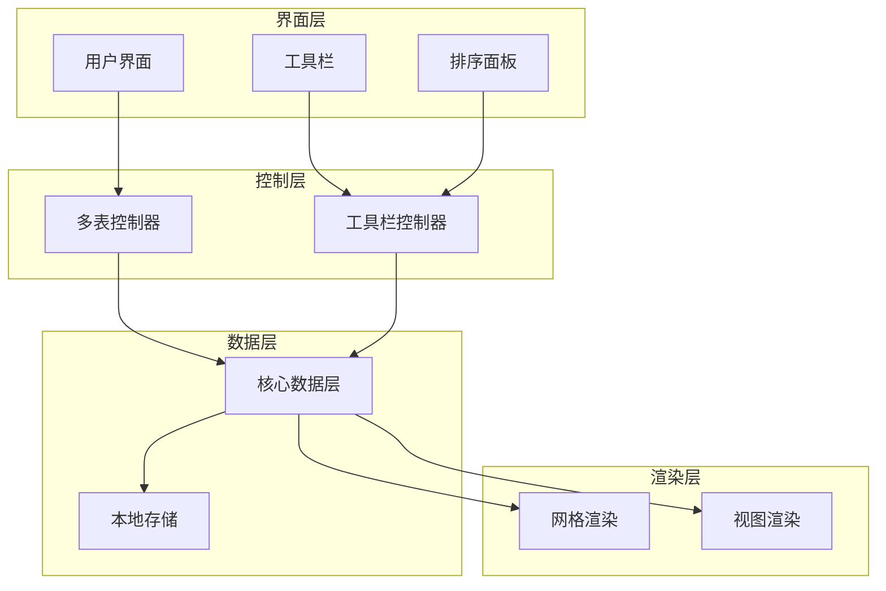
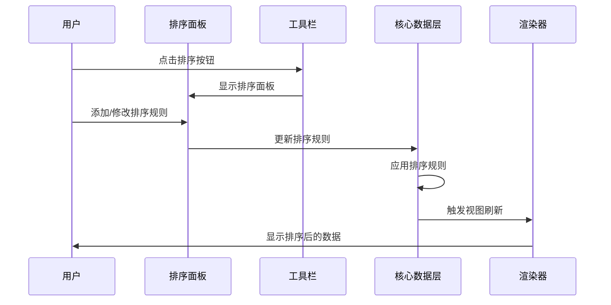
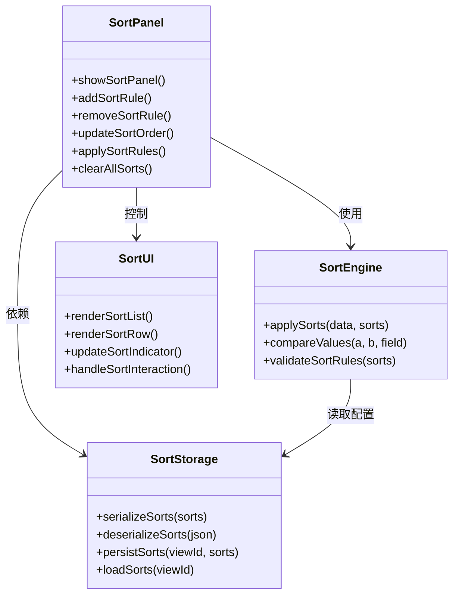
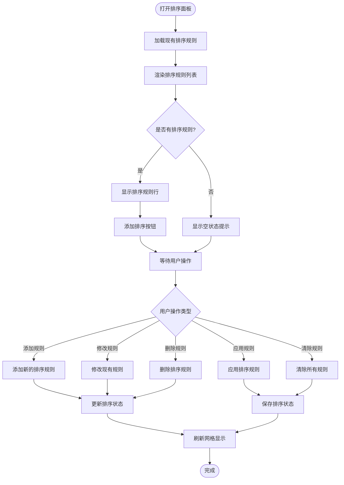
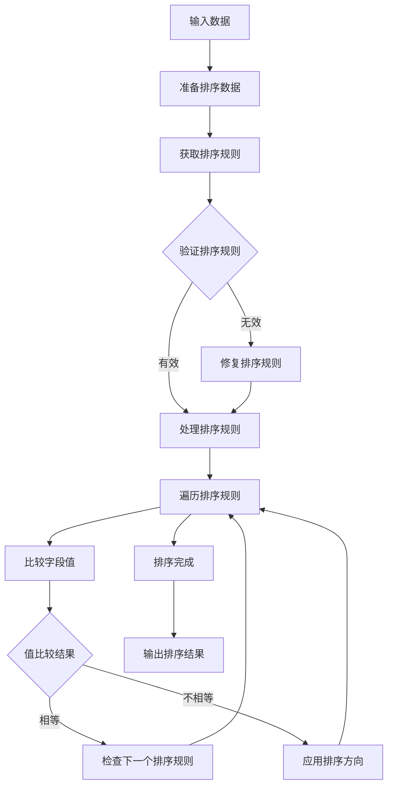
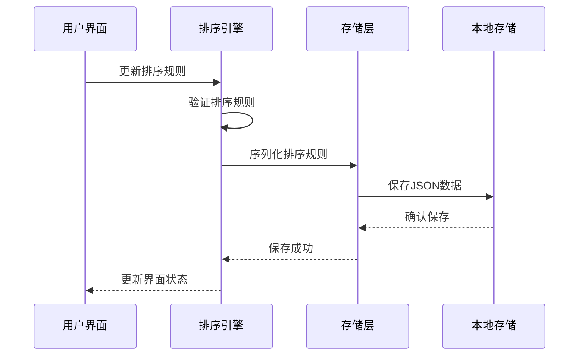
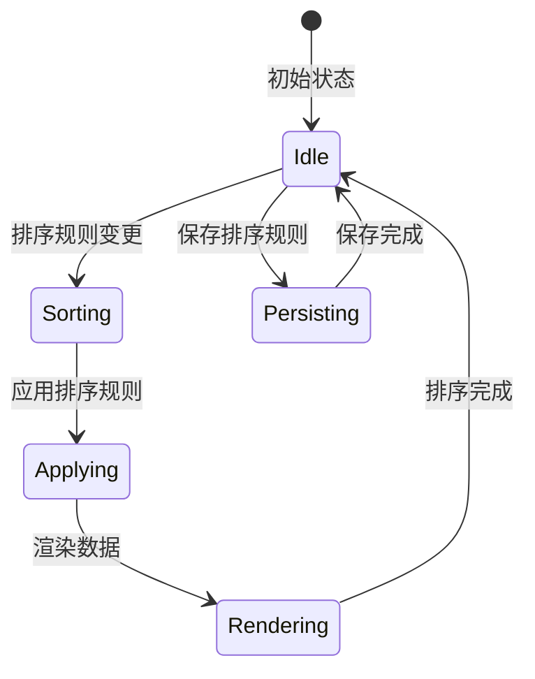
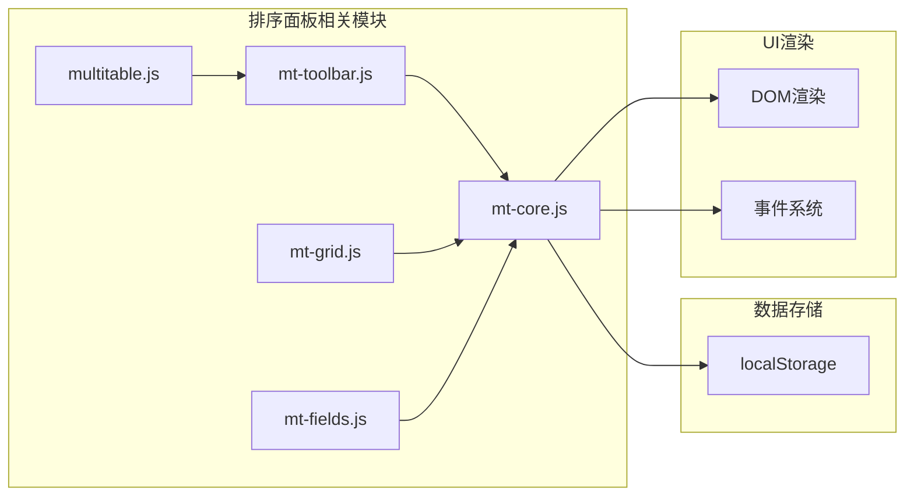
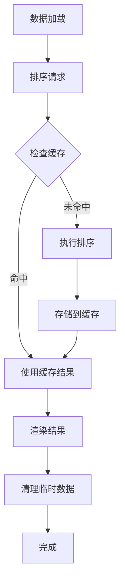

# 排序面板

<cite>
**本文档引用的文件**
- [index.html](file://index.html)
- [mt-core.js](file://js/mt-core.js)
- [mt-toolbar.js](file://js/mt-toolbar.js)
- [mt-grid.js](file://js/mt-grid.js)
- [multitable.js](file://js/multitable.js)
- [mt-fields.js](file://js/mt-fields.js)
- [style.css](file://css/style.css)
</cite>

## 目录
1. [简介](#简介)
2. [项目结构](#项目结构)
3. [核心组件](#核心组件)
4. [架构概览](#架构概览)
5. [详细组件分析](#详细组件分析)
6. [依赖关系分析](#依赖关系分析)
7. [性能考虑](#性能考虑)
8. [故障排除指南](#故障排除指南)
9. [结论](#结论)

## 简介

排序面板是陈苗多维表格系统中的关键功能模块，负责管理数据的排序规则和应用机制。该系统支持多字段排序、升序/降序切换、排序规则的序列化存储以及与表格渲染系统的协同工作。

排序面板采用模块化设计，通过事件驱动的方式与核心数据层和UI渲染层进行交互，实现了高效的排序功能和良好的用户体验。

## 项目结构

多维表格系统采用分层架构设计，主要包含以下核心模块：



**图表来源**
- [index.html:370-378](file://index.html#L370-L378)
- [multitable.js:13-29](file://js/multitable.js#L13-L29)

**章节来源**
- [index.html:1-382](file://index.html#L1-L382)
- [multitable.js:1-624](file://js/multitable.js#L1-L624)

## 核心组件

### 排序规则数据结构

排序面板的核心数据结构采用标准化的排序规则格式：

| 属性 | 类型 | 描述 | 示例 |
|------|------|------|------|
| field | string | 字段ID | "fld_12345" |
| order | string | 排序方向 | "asc" 或 "desc" |
| priority | number | 排序优先级 | 0, 1, 2... |

排序规则遵循稳定排序算法，确保相同值的记录保持原有相对顺序。

### 排序应用流程



**图表来源**
- [mt-toolbar.js:83-103](file://js/mt-toolbar.js#L83-L103)
- [mt-core.js:436-448](file://js/mt-core.js#L436-L448)

**章节来源**
- [mt-toolbar.js:1-394](file://js/mt-toolbar.js#L1-L394)
- [mt-core.js:1-800](file://js/mt-core.js#L1-L800)

## 架构概览

### 排序系统架构



**图表来源**
- [mt-toolbar.js:83-103](file://js/mt-toolbar.js#L83-L103)
- [mt-core.js:436-448](file://js/mt-core.js#L436-L448)

### 排序状态管理

排序状态通过以下方式管理：

1. **内存状态**：当前视图的排序规则存储在内存中
2. **持久化存储**：排序规则序列化后存储到localStorage
3. **实时应用**：排序规则变更立即应用到数据管道
4. **状态同步**：与UI状态保持同步更新

**章节来源**
- [mt-core.js:394-474](file://js/mt-core.js#L394-L474)
- [mt-toolbar.js:260-339](file://js/mt-toolbar.js#L260-L339)

## 详细组件分析

### 排序面板UI组件

#### 排序面板渲染

排序面板采用下拉式设计，提供直观的排序规则管理界面：



**图表来源**
- [mt-toolbar.js:83-103](file://js/mt-toolbar.js#L83-L103)
- [mt-toolbar.js:282-299](file://js/mt-toolbar.js#L282-L299)

#### 排序规则管理

排序面板支持以下操作：

1. **添加排序规则**：支持多字段排序，每个字段可独立设置升序/降序
2. **调整排序优先级**：通过拖拽调整多个排序字段的优先级顺序
3. **删除排序规则**：移除不需要的排序字段
4. **批量操作**：应用、清除所有排序规则

**章节来源**
- [mt-toolbar.js:83-103](file://js/mt-toolbar.js#L83-L103)
- [mt-toolbar.js:282-299](file://js/mt-toolbar.js#L282-L299)

### 排序引擎组件

#### 排序算法实现

排序引擎采用稳定的多键排序算法，确保排序结果的可靠性：



**图表来源**
- [mt-core.js:436-448](file://js/mt-core.js#L436-L448)

#### 数据类型处理

排序引擎针对不同数据类型提供专门的处理逻辑：

| 数据类型 | 排序处理方式 | 特殊考虑 |
|----------|-------------|----------|
| 数字/货币 | 数值比较 | 自动转换为浮点数 |
| 日期 | 时间戳比较 | 转换为毫秒时间戳 |
| 文本 | 字符串比较 | 不区分大小写 |
| 布尔值 | 数值比较 | true=1, false=0 |
| 多选/数组 | 长度比较 | 数组元素数量 |

**章节来源**
- [mt-core.js:436-448](file://js/mt-core.js#L436-L448)

### 排序状态持久化

#### 序列化存储机制

排序规则通过JSON格式进行序列化存储：



**图表来源**
- [mt-core.js:51-61](file://js/mt-core.js#L51-L61)
- [mt-core.js:394-403](file://js/mt-core.js#L394-L403)

#### 存储格式规范

排序规则的存储格式遵循以下规范：

```json
{
  "sorts": [
    {
      "field": "field_id_1",
      "order": "asc",
      "priority": 0
    },
    {
      "field": "field_id_2", 
      "order": "desc",
      "priority": 1
    }
  ]
}
```

**章节来源**
- [mt-core.js:51-61](file://js/mt-core.js#L51-L61)
- [mt-core.js:394-403](file://js/mt-core.js#L394-L403)

### 与表格渲染系统的集成

#### 实时应用机制

排序规则变更通过事件系统实现实时应用：



**图表来源**
- [mt-core.js:28-33](file://js/mt-core.js#L28-L33)
- [mt-core.js:394-403](file://js/mt-core.js#L394-L403)

#### 渲染优化策略

为了提高渲染性能，系统采用了以下优化策略：

1. **增量更新**：只更新受影响的DOM节点
2. **虚拟滚动**：大数据集时启用虚拟滚动
3. **防抖处理**：对频繁的排序操作进行防抖
4. **缓存机制**：缓存排序结果避免重复计算

**章节来源**
- [mt-core.js:28-33](file://js/mt-core.js#L28-L33)
- [mt-grid.js:14-37](file://js/mt-grid.js#L14-L37)

## 依赖关系分析

### 模块间依赖关系



**图表来源**
- [mt-toolbar.js:1-394](file://js/mt-toolbar.js#L1-L394)
- [mt-core.js:1-800](file://js/mt-core.js#L1-L800)

### 关键依赖点

1. **事件系统依赖**：排序面板通过事件系统与核心数据层通信
2. **数据管道依赖**：排序规则直接影响数据管道的处理流程
3. **UI状态依赖**：排序状态与工具栏按钮状态保持同步
4. **存储依赖**：排序规则的持久化依赖于核心存储机制

**章节来源**
- [mt-toolbar.js:260-339](file://js/mt-toolbar.js#L260-L339)
- [mt-core.js:28-33](file://js/mt-core.js#L28-L33)

## 性能考虑

### 排序性能优化

#### 大数据集排序优化策略

对于大数据集的排序，系统采用了以下优化策略：

1. **延迟计算**：排序操作采用延迟计算，避免不必要的重复排序
2. **增量更新**：只有当数据发生变化时才重新排序
3. **内存管理**：及时释放不再使用的排序中间结果
4. **算法优化**：使用高效的排序算法减少时间复杂度

#### 内存使用优化



**图表来源**
- [mt-core.js:436-448](file://js/mt-core.js#L436-L448)

### 排序性能指标

| 操作类型 | 时间复杂度 | 空间复杂度 | 优化策略 |
|----------|------------|------------|----------|
| 单字段排序 | O(n log n) | O(n) | 使用原地排序 |
| 多字段排序 | O(k × n log n) | O(n) | 优化比较函数 |
| 大数据集排序 | O(n log n) | O(log n) | 分块处理 |
| 实时排序 | O(Δn log Δn) | O(Δn) | 增量更新 |

**章节来源**
- [mt-core.js:436-448](file://js/mt-core.js#L436-L448)

## 故障排除指南

### 常见问题及解决方案

#### 排序规则不生效

**问题描述**：修改排序规则后数据没有重新排序

**可能原因**：
1. 排序规则未正确保存到存储
2. 事件系统未触发视图刷新
3. 数据管道未重新计算

**解决步骤**：
1. 检查localStorage中排序规则是否存在
2. 验证事件监听器是否正常工作
3. 确认数据管道重新计算流程

#### 排序性能问题

**问题描述**：大数据集排序时出现卡顿

**优化建议**：
1. 减少排序字段数量
2. 使用更精确的过滤条件
3. 考虑分页加载数据
4. 启用虚拟滚动

#### 排序结果异常

**问题描述**：排序结果不符合预期

**排查步骤**：
1. 检查字段类型是否正确
2. 验证数据格式一致性
3. 确认排序方向设置
4. 查看特殊值处理逻辑

**章节来源**
- [mt-core.js:51-61](file://js/mt-core.js#L51-L61)
- [mt-toolbar.js:260-339](file://js/mt-toolbar.js#L260-L339)

## 结论

陈苗多维表格的排序面板是一个设计精良的功能模块，具有以下特点：

1. **模块化设计**：清晰的职责分离和依赖关系
2. **高性能实现**：针对大数据集的优化策略
3. **用户友好**：直观的UI设计和实时反馈
4. **稳定性强**：完善的错误处理和状态管理
5. **可扩展性**：支持复杂的排序场景和自定义需求

该排序系统为用户提供了强大的数据管理能力，通过合理的架构设计和性能优化，确保了在各种使用场景下的良好体验。未来可以进一步增强的功能包括排序规则的导入导出、更丰富的排序算法选择以及更精细的性能监控。