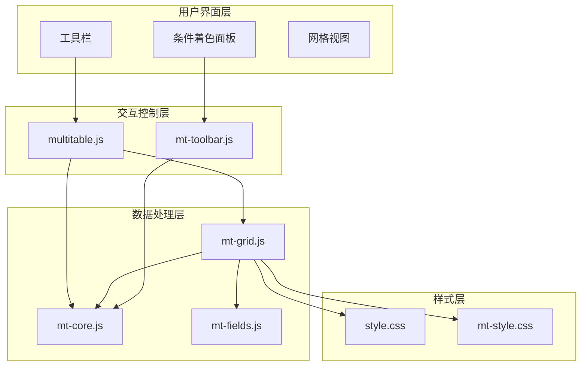
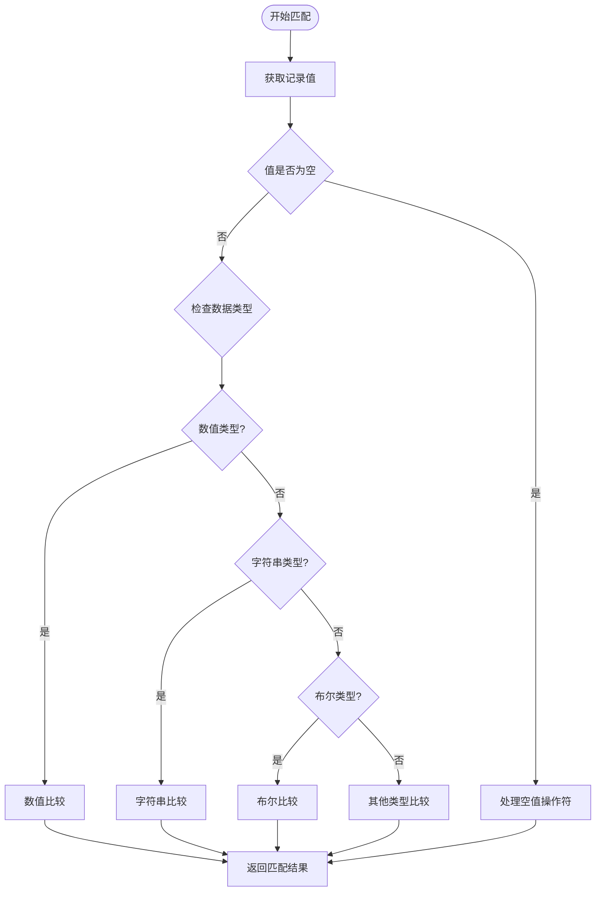
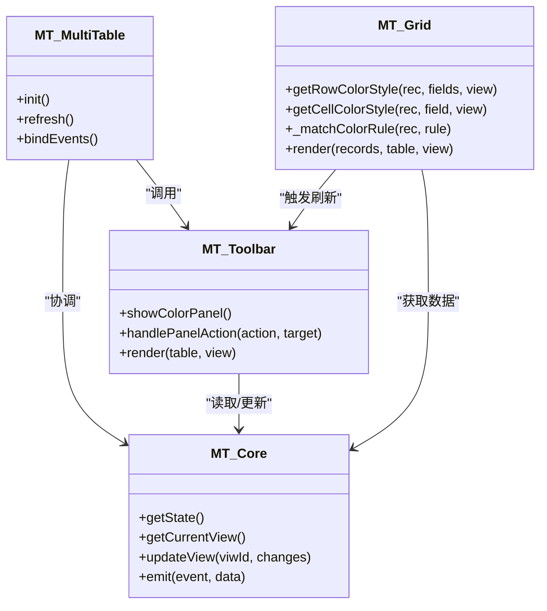
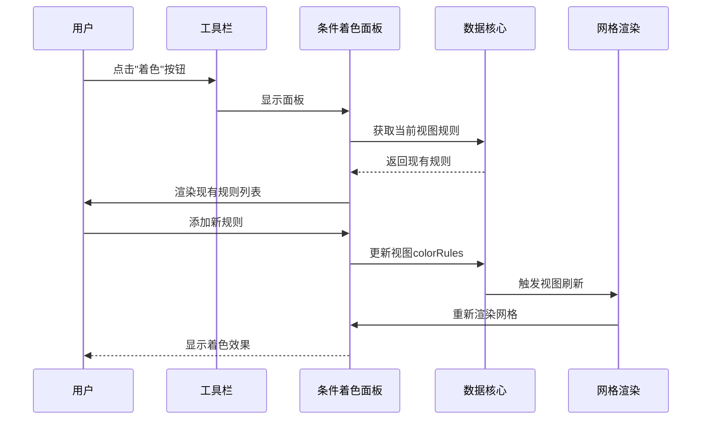
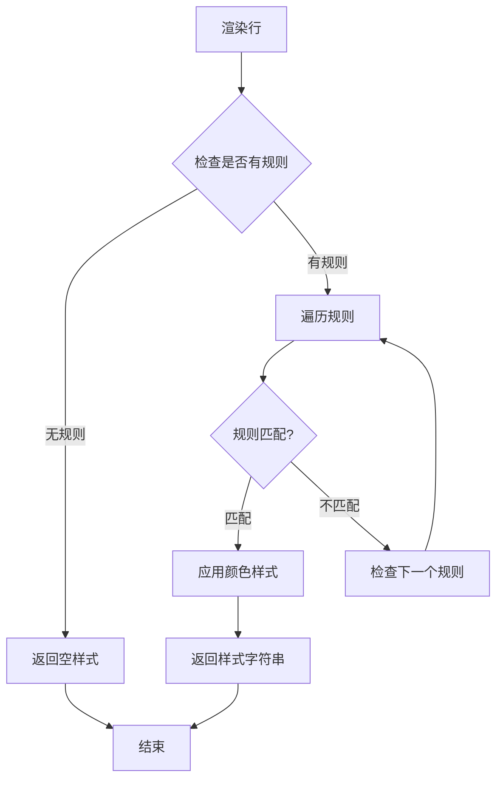
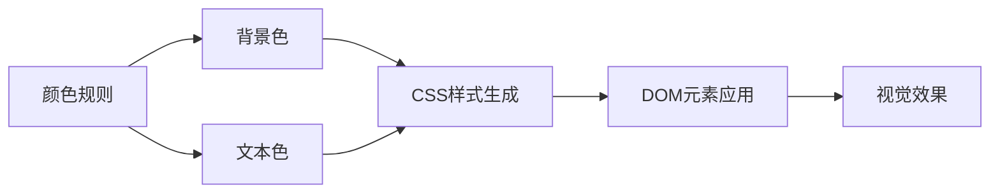
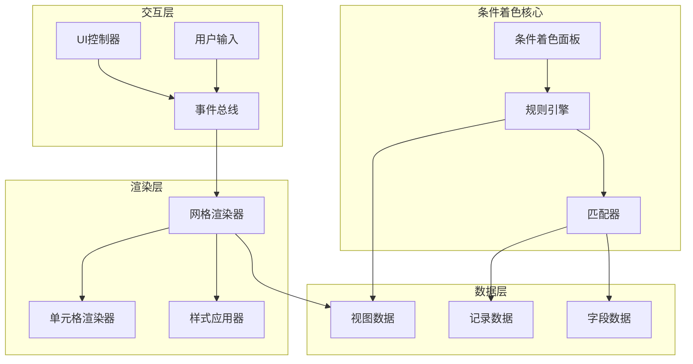
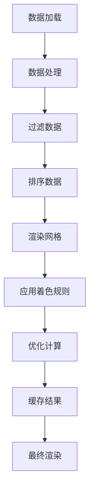

# 条件着色面板

<cite>
**本文档引用的文件**
- [index.html](file://index.html)
- [mt-grid.js](file://js/mt-grid.js)
- [mt-toolbar.js](file://js/mt-toolbar.js)
- [mt-fields.js](file://js/mt-fields.js)
- [mt-core.js](file://js/mt-core.js)
- [multitable.js](file://js/multitable.js)
- [style.css](file://css/style.css)
- [mt-style.css](file://css/mt-style.css)
</cite>

## 目录
1. [简介](#简介)
2. [项目结构](#项目结构)
3. [核心组件](#核心组件)
4. [架构概览](#架构概览)
5. [详细组件分析](#详细组件分析)
6. [依赖关系分析](#依赖关系分析)
7. [性能考虑](#性能考虑)
8. [故障排除指南](#故障排除指南)
9. [结论](#结论)

## 简介

条件着色面板是陈苗多维表格系统中的一个核心功能模块，它允许用户根据自定义规则为表格数据设置动态的颜色样式。该功能通过条件匹配算法实现，支持多种操作符类型，包括等于、包含、大于、小于、为真等，并提供直观的用户界面来管理着色规则。

该系统采用模块化设计，将条件着色功能集成在多维表格的工具栏面板中，用户可以通过简单的界面操作来创建、编辑和删除着色规则。每个规则都包含字段选择、操作符类型、目标值和颜色配置等要素。

## 项目结构

多维表格系统采用分层架构设计，条件着色功能位于数据层、渲染层和交互层之间：

**图表来源**
- [multitable.js:1-624](file://js/multitable.js#L1-L624)
- [mt-toolbar.js:1-394](file://js/mt-toolbar.js#L1-L394)
- [mt-grid.js:1-358](file://js/mt-grid.js#L1-L358)

**章节来源**
- [index.html:1-382](file://index.html#L1-L382)
- [multitable.js:1-624](file://js/multitable.js#L1-L624)

## 核心组件

条件着色功能由以下核心组件构成：

### 数据结构定义

条件着色规则采用标准化的数据结构，包含以下关键属性：

- **fieldId**: 目标字段的唯一标识符
- **operator**: 比较操作符类型
- **value**: 目标比较值
- **bgColor**: 背景色值
- **textColor**: 文本色值

### 规则匹配算法

系统实现了高效的规则匹配算法，支持多种数据类型的比较：

**图表来源**
- [mt-grid.js:143-158](file://js/mt-grid.js#L143-L158)

### 颜色配置系统

系统提供了丰富的颜色配置选项，包括预设颜色方案和自定义颜色选择器：

- **预设颜色**: 提供9种预设颜色组合
- **颜色选择器**: 使用HTML5 color input控件
- **背景色和文本色**: 支持独立的颜色配置

**章节来源**
- [mt-grid.js:124-158](file://js/mt-grid.js#L124-L158)
- [mt-toolbar.js:167-196](file://js/mt-toolbar.js#L167-L196)
- [mt-fields.js:32-42](file://js/mt-fields.js#L32-L42)

## 架构概览

条件着色功能的架构设计体现了清晰的职责分离和模块化原则：

**图表来源**
- [mt-grid.js:6-358](file://js/mt-grid.js#L6-L358)
- [mt-toolbar.js:6-394](file://js/mt-toolbar.js#L6-L394)
- [mt-core.js:8-200](file://js/mt-core.js#L8-L200)
- [multitable.js:7-624](file://js/multitable.js#L7-L624)

## 详细组件分析

### 条件着色面板实现

条件着色面板提供了直观的用户界面来管理着色规则：

#### 面板结构设计

**图表来源**
- [mt-toolbar.js:167-196](file://js/mt-toolbar.js#L167-L196)
- [mt-toolbar.js:317-337](file://js/mt-toolbar.js#L317-L337)

#### 规则管理功能

面板支持完整的规则生命周期管理：

1. **添加规则**: 通过"+ 添加规则"按钮创建新规则
2. **编辑规则**: 通过下拉菜单选择字段和操作符
3. **删除规则**: 通过"×"按钮移除不需要的规则
4. **应用规则**: 通过"应用"按钮保存更改
5. **清除规则**: 通过"清除全部"按钮重置所有规则

**章节来源**
- [mt-toolbar.js:167-196](file://js/mt-toolbar.js#L167-L196)
- [mt-toolbar.js:317-337](file://js/mt-toolbar.js#L317-L337)

### 渲染机制实现

条件着色的渲染机制采用了高效的计算和缓存策略：

#### 行级着色渲染

**图表来源**
- [mt-grid.js:125-133](file://js/mt-grid.js#L125-L133)

#### 单元格级着色渲染

单元格级别的着色渲染更加精细，支持针对特定字段的着色：

1. **字段匹配**: 首先检查规则是否适用于当前字段
2. **值比较**: 对比记录值与规则目标值
3. **样式应用**: 将匹配的样式应用到单元格

**章节来源**
- [mt-grid.js:134-142](file://js/mt-grid.js#L134-L142)

### 操作符类型支持

系统支持多种操作符类型，满足不同的着色需求：

| 操作符 | 描述 | 适用数据类型 | 示例 |
|--------|------|-------------|------|
| eq | 等于 | 所有类型 | 数值比较、字符串比较 |
| neq | 不等于 | 所有类型 | 排除特定值 |
| contains | 包含 | 字符串 | 文本搜索匹配 |
| gt | 大于 | 数值 | 数字范围判断 |
| lt | 小于 | 数值 | 数字范围判断 |
| is_true | 为真 | 布尔值 | 布尔状态显示 |
| empty | 为空 | 所有类型 | 空值检测 |
| not_empty | 不为空 | 所有类型 | 非空值检测 |

**章节来源**
- [mt-grid.js:143-158](file://js/mt-grid.js#L143-L158)
- [mt-toolbar.js:179-185](file://js/mt-toolbar.js#L179-L185)

### 颜色选择器集成

颜色选择器提供了直观的颜色配置体验：

#### 颜色配置选项

1. **背景色配置**: 通过HTML5 color input控件选择背景颜色
2. **文本色配置**: 支持自定义文本颜色
3. **预设颜色**: 提供常用颜色组合的快速选择

#### 颜色渲染机制

颜色值通过CSS样式应用到网格单元格：

**图表来源**
- [mt-grid.js:129-139](file://js/mt-grid.js#L129-L139)

**章节来源**
- [mt-toolbar.js:187](file://js/mt-toolbar.js#L187)
- [mt-fields.js:32-42](file://js/mt-fields.js#L32-L42)

## 依赖关系分析

条件着色功能的依赖关系体现了清晰的模块化设计：

**图表来源**
- [mt-grid.js:124-158](file://js/mt-grid.js#L124-L158)
- [mt-toolbar.js:167-196](file://js/mt-toolbar.js#L167-L196)
- [mt-core.js:395-403](file://js/mt-core.js#L395-L403)

**章节来源**
- [mt-core.js:395-403](file://js/mt-core.js#L395-L403)
- [mt-grid.js:124-158](file://js/mt-grid.js#L124-L158)

## 性能考虑

条件着色功能在设计时充分考虑了性能优化，特别是在处理大量数据时的表现：

### 渲染性能优化

1. **规则缓存**: 已匹配的规则结果进行缓存，避免重复计算
2. **增量更新**: 仅在规则或数据变化时重新计算着色
3. **虚拟滚动**: 结合虚拟滚动技术处理大量数据行

### 计算复杂度优化

**图表来源**
- [mt-core.js:395-403](file://js/mt-core.js#L395-L403)

### 内存使用优化

1. **对象池**: 复用DOM元素和样式对象
2. **懒加载**: 仅在需要时加载和计算着色规则
3. **垃圾回收**: 及时释放不再使用的样式和事件监听器

**章节来源**
- [mt-core.js:395-403](file://js/mt-core.js#L395-L403)
- [mt-grid.js:124-158](file://js/mt-grid.js#L124-L158)

## 故障排除指南

### 常见问题及解决方案

#### 规则不生效

**问题描述**: 添加的着色规则没有显示预期的效果

**可能原因**:
1. 规则字段选择错误
2. 操作符与数据类型不匹配
3. 目标值格式不正确

**解决步骤**:
1. 检查规则中的字段是否正确
2. 确认操作符与目标数据类型兼容
3. 验证目标值的格式和范围

#### 性能问题

**问题描述**: 在大数据量情况下，着色功能响应缓慢

**优化建议**:
1. 减少着色规则数量
2. 使用更精确的匹配条件
3. 考虑分页显示数据

#### 颜色显示异常

**问题描述**: 颜色显示不符合预期或与其他样式冲突

**解决方法**:
1. 检查CSS样式优先级
2. 验证颜色值格式（十六进制）
3. 确认背景色和文本色的对比度

**章节来源**
- [mt-grid.js:124-158](file://js/mt-grid.js#L124-L158)
- [mt-toolbar.js:167-196](file://js/mt-toolbar.js#L167-L196)

## 结论

条件着色面板作为陈苗多维表格系统的核心功能之一，展现了优秀的架构设计和用户体验。通过模块化的组件设计、高效的渲染机制和完善的性能优化策略，该功能能够满足各种复杂的着色需求。

系统的主要优势包括：

1. **易用性**: 直观的界面设计和简单的工作流程
2. **灵活性**: 支持多种操作符和颜色配置选项
3. **性能**: 高效的计算和渲染机制，适合大数据量场景
4. **扩展性**: 模块化设计便于功能扩展和维护

未来可以考虑的功能增强包括：
- 更高级的条件表达式支持
- 预设着色模板
- 实时着色预览功能
- 导出着色规则配置

该功能为用户提供了强大的数据可视化能力，显著提升了多维表格的实用性和用户体验。