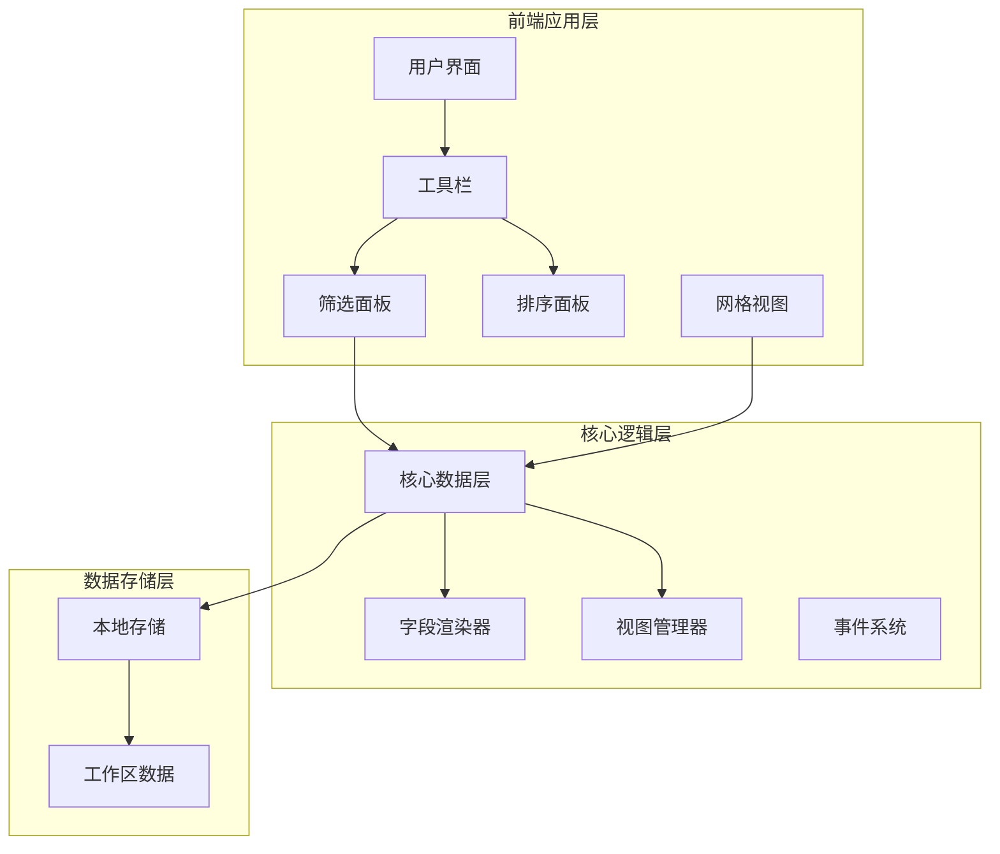
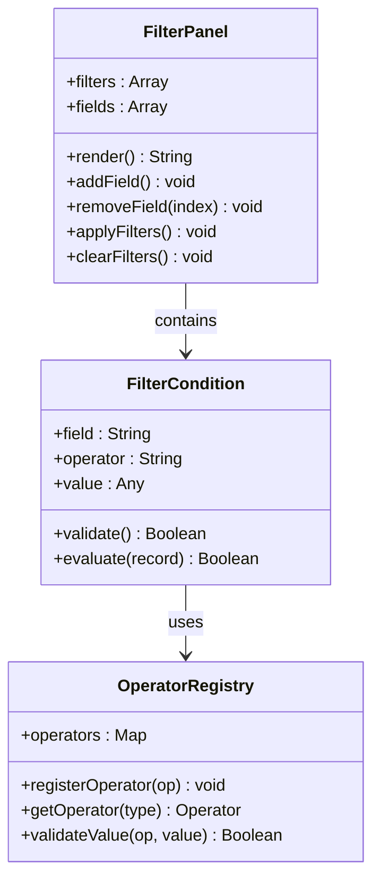
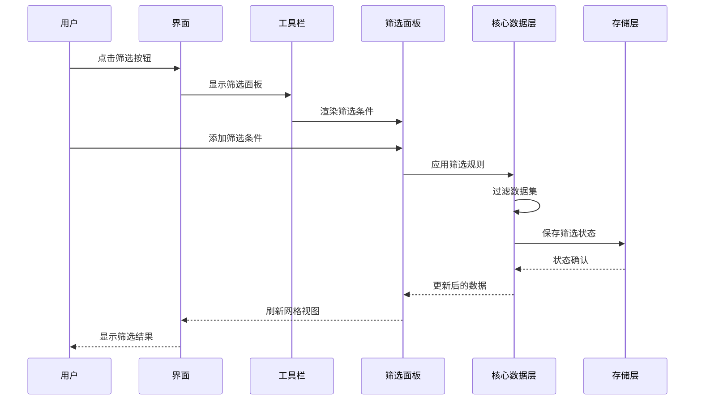
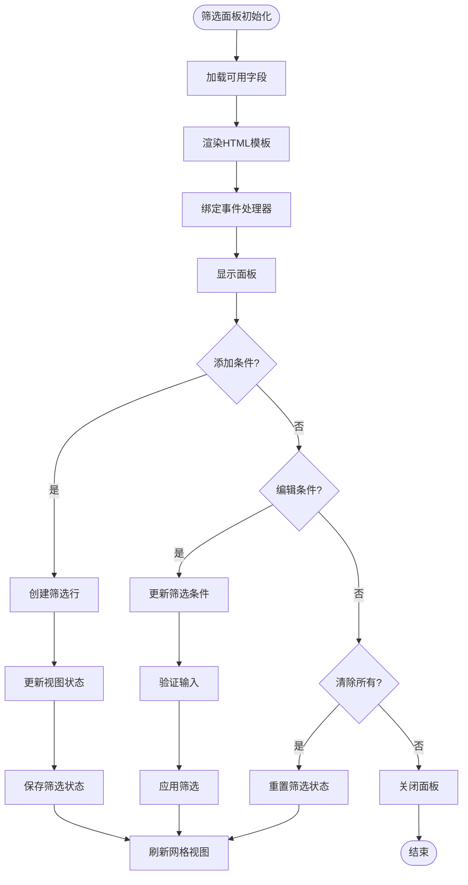
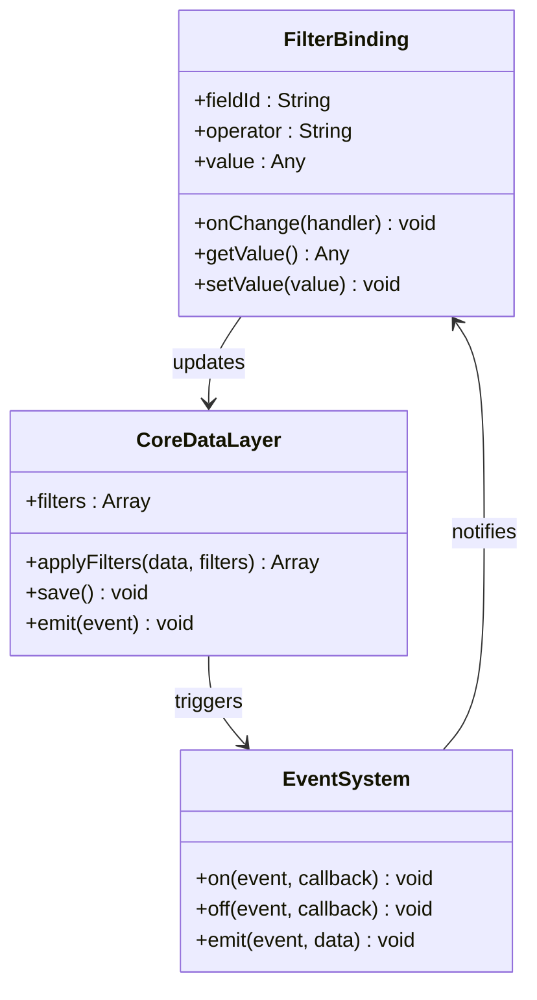
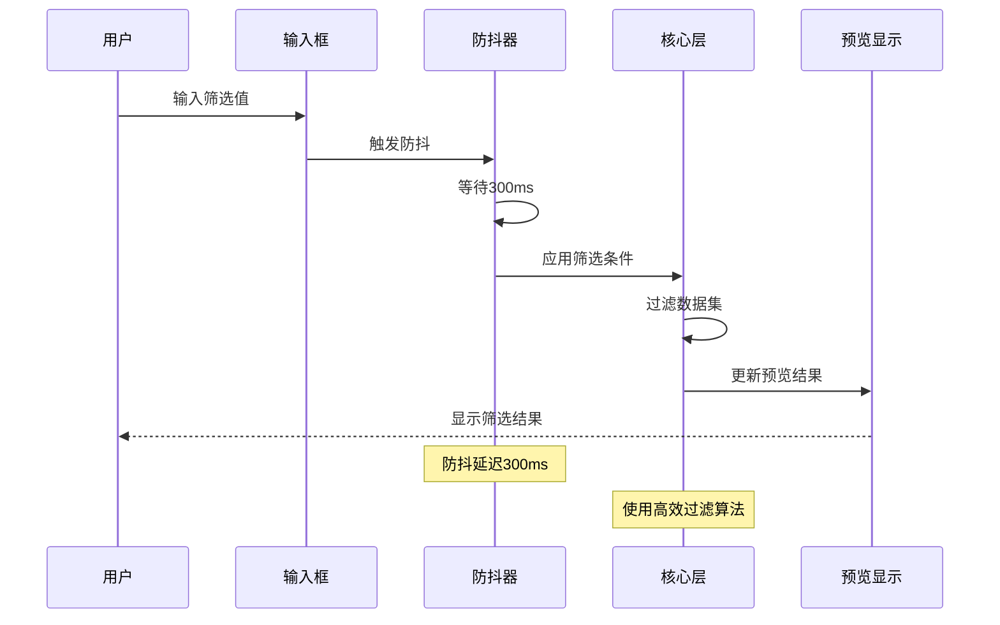
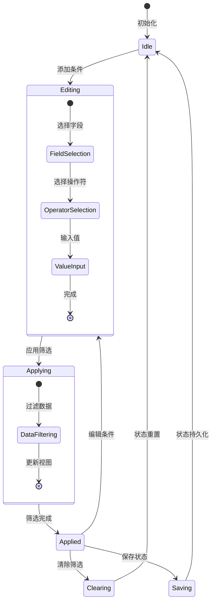
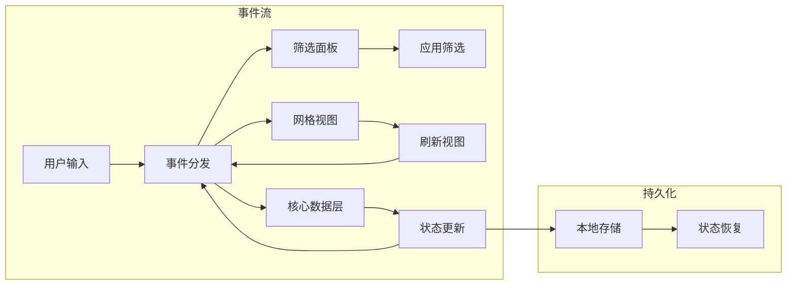
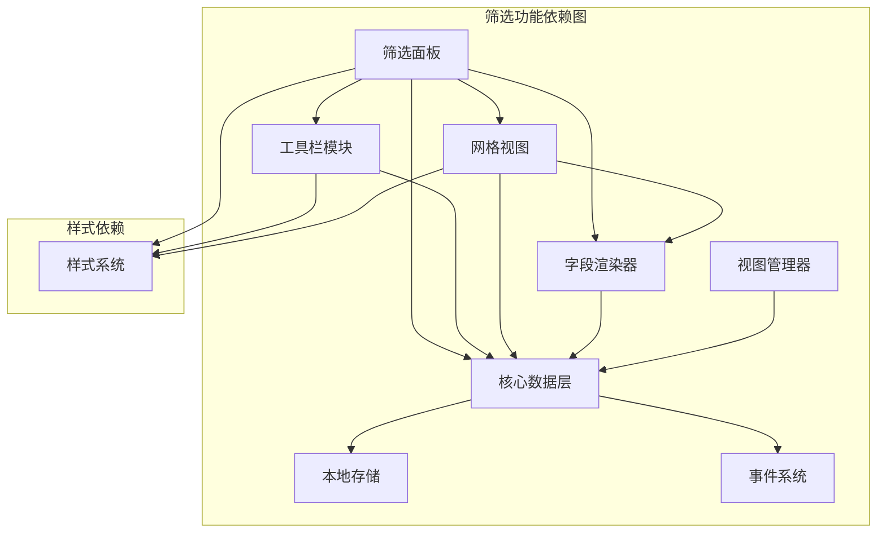
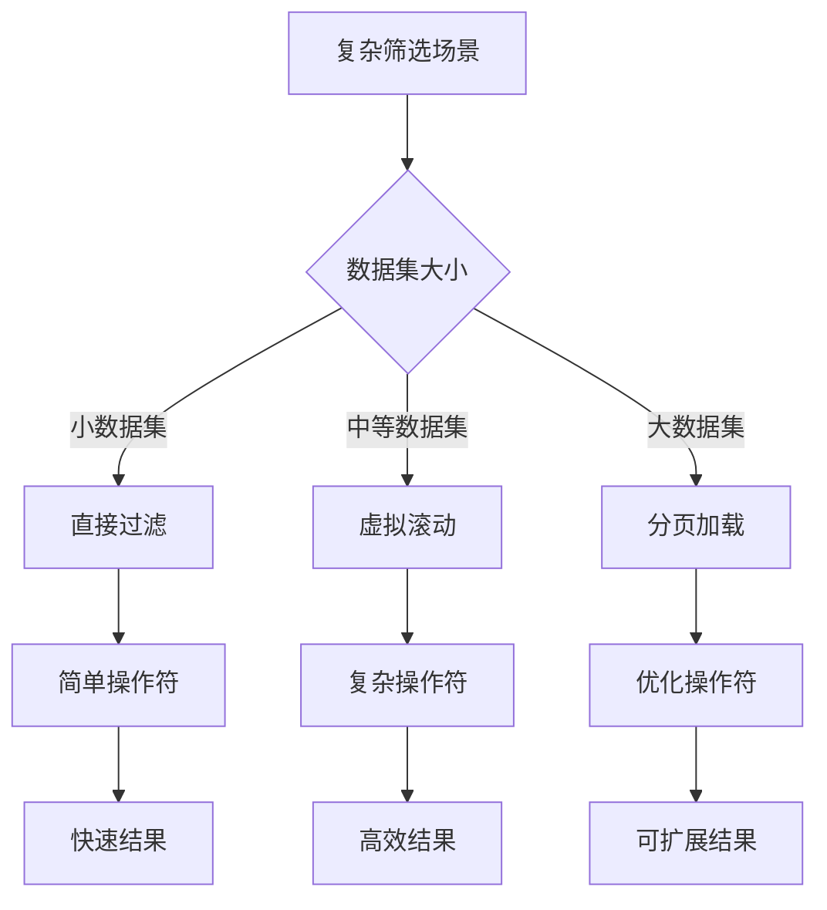

# 筛选面板

<cite>
**本文档引用的文件**
- [index.html](file://index.html)
- [README.md](file://README.md)
- [multitable.js](file://js/multitable.js)
- [mt-toolbar.js](file://js/mt-toolbar.js)
- [mt-core.js](file://js/mt-core.js)
- [mt-grid.js](file://js/mt-grid.js)
- [mt-fields.js](file://js/mt-fields.js)
- [mt-views.js](file://js/mt-views.js)
- [mt-style.css](file://css/mt-style.css)
</cite>

## 目录
1. [简介](#简介)
2. [项目结构](#项目结构)
3. [核心组件](#核心组件)
4. [架构概览](#架构概览)
5. [详细组件分析](#详细组件分析)
6. [依赖关系分析](#依赖关系分析)
7. [性能考虑](#性能考虑)
8. [故障排除指南](#故障排除指南)
9. [结论](#结论)

## 简介

筛选面板是陈苗多维表格系统的核心功能模块之一，为用户提供强大的数据筛选能力。该系统支持多种筛选操作符，包括包含、等于、不等于、大于、小于、为空、不为空、日期早于、日期晚于等操作符，能够满足复杂的业务需求。

多维表格系统采用模块化架构设计，通过事件驱动的方式实现各个组件间的解耦。筛选面板作为工具栏面板系统的一部分，与网格视图、字段渲染器、核心数据层等模块紧密协作，提供完整的数据筛选体验。

## 项目结构

多维表格系统采用清晰的模块化组织结构：

**图表来源**
- [multitable.js:1-624](file://js/multitable.js#L1-L624)
- [mt-toolbar.js:1-394](file://js/mt-toolbar.js#L1-L394)
- [mt-core.js:1-859](file://js/mt-core.js#L1-L859)

**章节来源**
- [index.html:1-382](file://index.html#L1-L382)
- [README.md:1-135](file://README.md#L1-L135)

## 核心组件

### 筛选面板架构

筛选面板采用响应式设计，支持动态添加、编辑和删除筛选条件：

**图表来源**
- [mt-toolbar.js:50-81](file://js/mt-toolbar.js#L50-L81)
- [mt-core.js:413-435](file://js/mt-core.js#L413-L435)

### 筛选操作符类型

系统支持以下九种筛选操作符：

| 操作符类型 | 描述 | 适用字段类型 | 示例 |
|-----------|------|-------------|------|
| contains | 包含 | 文本、多选、人员 | "包含'开发'" |
| eq | 等于 | 所有字段 | "等于'进行中'" |
| neq | 不等于 | 所有字段 | "不等于'已完成'" |
| gt | 大于 | 数字、货币、日期 | "大于1000" |
| lt | 小于 | 数字、货币、日期 | "小于500" |
| empty | 为空 | 所有字段 | "为空" |
| not_empty | 不为空 | 所有字段 | "不为空" |
| date_before | 日期早于 | 日期字段 | "日期早于2024-01-01" |
| date_after | 日期晚于 | 日期字段 | "日期晚于2024-12-31" |

**章节来源**
- [mt-toolbar.js:60-70](file://js/mt-toolbar.js#L60-L70)
- [mt-core.js:417-432](file://js/mt-core.js#L417-L432)

## 架构概览

多维表格系统采用分层架构设计，确保各层职责明确且松耦合：

**图表来源**
- [mt-toolbar.js:260-282](file://js/mt-toolbar.js#L260-L282)
- [mt-core.js:394-403](file://js/mt-core.js#L394-L403)

## 详细组件分析

### 筛选面板渲染机制

筛选面板采用模板渲染的方式，支持动态增删条件：

**图表来源**
- [mt-toolbar.js:50-81](file://js/mt-toolbar.js#L50-L81)
- [mt-toolbar.js:260-282](file://js/mt-toolbar.js#L260-L282)

### 数据绑定机制

筛选面板通过双向数据绑定实现与核心数据层的同步：

**图表来源**
- [mt-core.js:394-403](file://js/mt-core.js#L394-L403)
- [mt-toolbar.js:260-339](file://js/mt-toolbar.js#L260-L339)

### 实时预览功能

系统实现了高效的实时预览机制，通过防抖技术优化性能：

**图表来源**
- [mt-core.js:762](file://js/mt-core.js#L762)
- [mt-toolbar.js:271-278](file://js/mt-toolbar.js#L271-L278)

**章节来源**
- [mt-toolbar.js:50-81](file://js/mt-toolbar.js#L50-L81)
- [mt-core.js:394-403](file://js/mt-core.js#L394-L403)

### 状态管理

筛选面板采用集中式状态管理模式：

**图表来源**
- [mt-toolbar.js:260-339](file://js/mt-toolbar.js#L260-L339)
- [mt-core.js:394-403](file://js/mt-core.js#L394-L403)

**章节来源**
- [mt-toolbar.js:260-339](file://js/mt-toolbar.js#L260-L339)
- [mt-core.js:394-403](file://js/mt-core.js#L394-L403)

### 事件处理机制

系统采用事件驱动架构，确保组件间松耦合：

**图表来源**
- [mt-toolbar.js:260-339](file://js/mt-toolbar.js#L260-L339)
- [mt-core.js:20-33](file://js/mt-core.js#L20-L33)

**章节来源**
- [mt-toolbar.js:260-339](file://js/mt-toolbar.js#L260-L339)
- [mt-core.js:20-33](file://js/mt-core.js#L20-L33)

## 依赖关系分析

多维表格系统的筛选功能涉及多个模块的协同工作：

**图表来源**
- [multitable.js:1-624](file://js/multitable.js#L1-L624)
- [mt-toolbar.js:1-394](file://js/mt-toolbar.js#L1-L394)
- [mt-core.js:1-859](file://js/mt-core.js#L1-L859)

**章节来源**
- [multitable.js:1-624](file://js/multitable.js#L1-L624)
- [mt-toolbar.js:1-394](file://js/mt-toolbar.js#L1-L394)
- [mt-core.js:1-859](file://js/mt-core.js#L1-L859)

## 性能考虑

### 筛选性能优化策略

系统采用了多项性能优化措施来确保筛选操作的流畅性：

1. **防抖机制**：输入防抖延迟300ms，避免频繁的筛选操作
2. **增量更新**：只更新受影响的网格单元格而非整个视图
3. **内存管理**：及时清理事件监听器和DOM引用
4. **虚拟滚动**：大数据集时采用虚拟滚动减少DOM节点数量

### 复杂筛选场景处理

对于复杂的筛选场景，系统提供了以下优化方案：

**图表来源**
- [mt-core.js:762](file://js/mt-core.js#L762)
- [mt-grid.js:327-348](file://js/mt-grid.js#L327-L348)

**章节来源**
- [mt-core.js:762](file://js/mt-core.js#L762)
- [mt-grid.js:327-348](file://js/mt-grid.js#L327-L348)

## 故障排除指南

### 常见问题及解决方案

| 问题类型 | 症状 | 可能原因 | 解决方案 |
|---------|------|---------|----------|
| 筛选无效果 | 筛选后数据不变 | 操作符选择错误 | 检查操作符与字段类型匹配 |
| 性能问题 | 筛选响应缓慢 | 数据量过大 | 使用分页或优化筛选条件 |
| 状态丢失 | 刷新后筛选条件消失 | 本地存储异常 | 检查localStorage容量和权限 |
| 样式异常 | 筛选面板显示错乱 | CSS冲突 | 检查自定义样式覆盖 |

### 调试技巧

1. **开发者工具**：使用浏览器开发者工具监控事件流和数据变化
2. **控制台日志**：启用调试模式查看详细的筛选过程日志
3. **性能分析**：使用性能面板分析筛选操作的性能瓶颈
4. **网络监控**：检查是否有意外的数据请求或存储操作

**章节来源**
- [mt-core.js:51-61](file://js/mt-core.js#L51-L61)
- [mt-toolbar.js:378-393](file://js/mt-toolbar.js#L378-L393)

## 结论

陈苗多维表格筛选面板是一个功能完整、性能优异的数据筛选系统。通过模块化设计和事件驱动架构，系统实现了高度的可维护性和扩展性。

主要特点包括：
- **丰富的操作符支持**：涵盖文本、数值、日期等多种数据类型的筛选需求
- **实时预览**：通过防抖机制提供流畅的用户体验
- **状态持久化**：确保用户筛选条件的可靠保存和恢复
- **性能优化**：针对大数据集的专门优化策略
- **模块化架构**：清晰的组件分离便于维护和扩展

该系统为用户提供了直观易用的数据筛选体验，同时为后续的功能扩展奠定了坚实的基础。