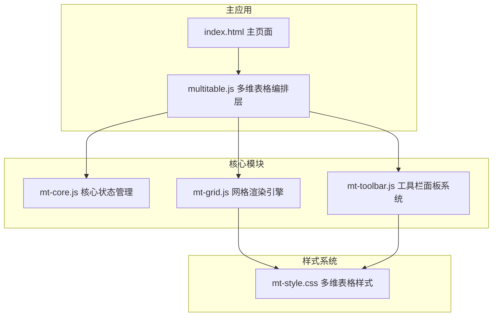
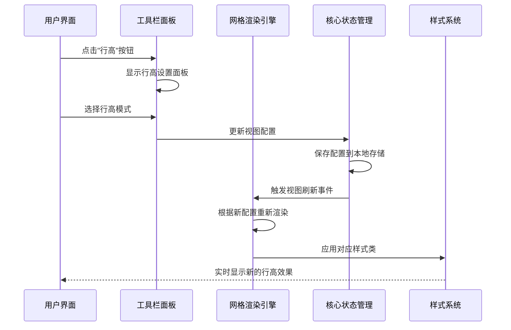
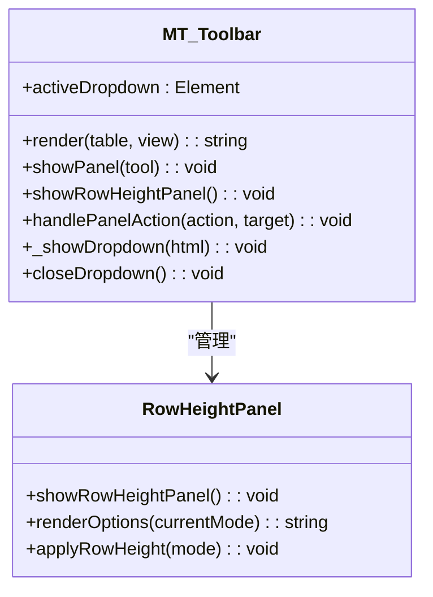
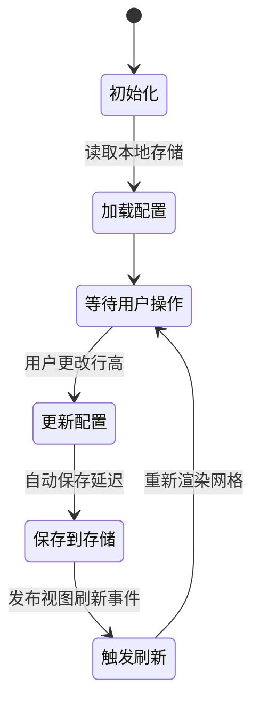
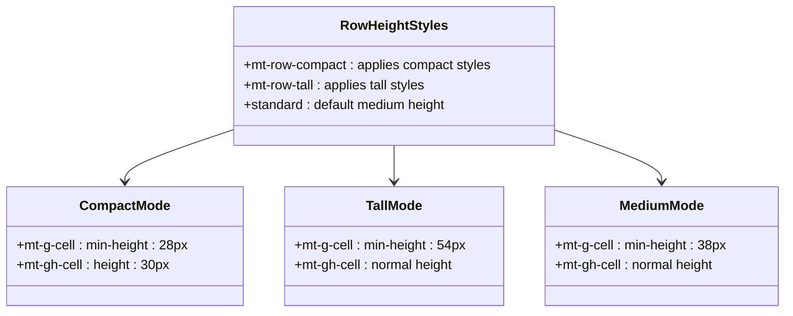
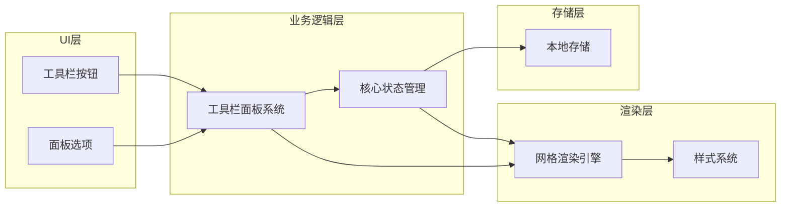

# 行高设置面板

<cite>
**本文档引用的文件**
- [index.html](file://index.html)
- [mt-grid.js](file://js/mt-grid.js)
- [mt-toolbar.js](file://js/mt-toolbar.js)
- [mt-core.js](file://js/mt-core.js)
- [mt-style.css](file://css/mt-style.css)
- [multitable.js](file://js/multitable.js)
</cite>

## 目录
1. [简介](#简介)
2. [项目结构](#项目结构)
3. [核心组件](#核心组件)
4. [架构概览](#架构概览)
5. [详细组件分析](#详细组件分析)
6. [依赖关系分析](#依赖关系分析)
7. [性能考虑](#性能考虑)
8. [故障排除指南](#故障排除指南)
9. [结论](#结论)

## 简介

行高设置面板是陈苗多维表格系统中的重要功能模块，负责管理表格行的高度配置。该面板提供了三种行高模式：紧凑、标准和宽松，每种模式都有其特定的设计理念和适用场景。

本文档深入分析了行高设置面板的技术实现，包括设计理念、用户交互机制、状态切换逻辑、实时预览功能、存储方式以及与表格渲染引擎的集成关系。同时涵盖了响应式适配、移动端优化策略和用户偏好记忆功能的实现方案。

## 项目结构

多维表格系统采用模块化架构设计，行高设置面板作为工具栏面板的一部分，与其他功能模块协同工作：



**图表来源**
- [index.html:1-382](file://index.html#L1-L382)
- [multitable.js:1-624](file://js/multitable.js#L1-L624)

**章节来源**
- [index.html:1-382](file://index.html#L1-L382)
- [multitable.js:1-624](file://js/multitable.js#L1-L624)

## 核心组件

### 行高设置面板架构

行高设置面板基于以下核心组件构建：

1. **工具栏面板系统** - 提供统一的面板渲染和事件处理机制
2. **网格渲染引擎** - 负责根据行高设置渲染表格
3. **核心状态管理** - 管理行高配置的持久化存储
4. **样式系统** - 提供不同行高模式的视觉样式

### 行高模式定义

系统支持三种行高模式，每种模式都有明确的像素高度定义：

| 模式 | 类别 | 像素高度 | 适用场景 |
|------|------|----------|----------|
| compact | 紧凑 | 28px | 高密度数据展示，节省空间 |
| medium | 标准 | 38px | 默认推荐，平衡可读性和空间利用率 |
| tall | 宽松 | 54px | 低密度数据，强调可读性 |

**章节来源**
- [mt-grid.js:10-12](file://js/mt-grid.js#L10-L12)
- [mt-style.css:615-619](file://css/mt-style.css#L615-L619)

## 架构概览

行高设置面板的完整架构流程如下：



**图表来源**
- [mt-toolbar.js:151-165](file://js/mt-toolbar.js#L151-L165)
- [mt-grid.js:14-37](file://js/mt-grid.js#L14-L37)
- [mt-core.js:326-372](file://js/mt-core.js#L326-L372)

## 详细组件分析

### 工具栏面板系统

工具栏面板系统负责管理所有面板的生命周期和事件处理：



**图表来源**
- [mt-toolbar.js:6-394](file://js/mt-toolbar.js#L6-L394)

#### 面板渲染机制

行高设置面板通过以下步骤渲染：

1. **获取当前视图配置** - 从核心状态管理器获取当前视图的行高设置
2. **生成选项HTML** - 创建三个行高选项的HTML结构
3. **设置激活状态** - 根据当前配置标记对应的选项为激活状态
4. **绑定事件处理器** - 为每个选项绑定点击事件处理器

**章节来源**
- [mt-toolbar.js:151-165](file://js/mt-toolbar.js#L151-L165)

### 网格渲染引擎

网格渲染引擎根据行高设置动态应用相应的CSS类：

```mermaid
flowchart TD
A[接收视图配置] --> B{检查rowHeight属性}
B --> |compact| C[添加"mt-row-compact"类]
B --> |tall| D[添加"mt-row-tall"类]
B --> |其他| E[添加空类或默认类]
C --> F[渲染网格容器]
D --> F
E --> F
F --> G[应用CSS样式]
G --> H[返回渲染结果]
```

**图表来源**
- [mt-grid.js:14-16](file://js/mt-grid.js#L14-L16)

#### 行高计算逻辑

网格引擎提供行高像素值计算函数：

| 行高模式 | 像素值 | 计算公式 |
|----------|--------|----------|
| compact | 28px | 基础紧凑模式 |
| tall | 54px | 基础宽松模式 |
| medium | 38px | 默认标准模式 |

**章节来源**
- [mt-grid.js:10-12](file://js/mt-grid.js#L10-L12)

### 核心状态管理

核心状态管理器负责行高配置的持久化存储：



**图表来源**
- [mt-core.js:326-372](file://js/mt-core.js#L326-L372)

#### 配置存储机制

行高配置存储在视图对象的 `rowHeight` 属性中，默认值为 'medium'：

- **存储位置**：`workspace.tables[viewId].rowHeight`
- **默认值**：'medium'
- **持久化**：自动保存到localStorage
- **同步机制**：通过事件系统通知渲染引擎

**章节来源**
- [mt-core.js:335](file://js/mt-core.js#L335)
- [mt-core.js:51-74](file://js/mt-core.js#L51-L74)

### 样式系统

样式系统为不同的行高模式提供专门的CSS类：



**图表来源**
- [mt-style.css:615-619](file://css/mt-style.css#L615-L619)

#### 样式应用机制

样式通过以下方式应用到网格元素：

1. **动态类名添加** - 根据行高设置向网格容器添加相应的CSS类
2. **CSS变量支持** - 使用CSS自定义属性实现主题化
3. **响应式适配** - 支持不同屏幕尺寸下的自适应显示

**章节来源**
- [mt-style.css:615-619](file://css/mt-style.css#L615-L619)

## 依赖关系分析

行高设置面板的依赖关系如下：



**图表来源**
- [mt-toolbar.js:14-36](file://js/mt-toolbar.js#L14-L36)
- [mt-grid.js:14-37](file://js/mt-grid.js#L14-L37)
- [mt-core.js:51-74](file://js/mt-core.js#L51-L74)

### 关键依赖点

1. **事件依赖**：工具栏按钮点击事件依赖面板系统
2. **状态依赖**：网格渲染依赖核心状态管理器
3. **样式依赖**：渲染结果依赖样式系统的CSS类
4. **存储依赖**：配置持久化依赖本地存储机制

**章节来源**
- [mt-toolbar.js:315-316](file://js/mt-toolbar.js#L315-L316)
- [mt-grid.js:16](file://js/mt-grid.js#L16-L16)

## 性能考虑

### 渲染性能优化

1. **延迟保存机制**：使用setTimeout防抖，避免频繁保存操作
2. **事件委托**：使用事件冒泡减少DOM监听器数量
3. **CSS类切换**：通过类名切换而非内联样式，提高渲染效率

### 内存管理

1. **面板销毁**：自动清理面板DOM节点和事件监听器
2. **存储限制**：监控localStorage使用情况，防止超出容量限制
3. **状态同步**：通过事件系统确保状态一致性，避免重复渲染

### 响应式性能

1. **媒体查询**：利用CSS媒体查询实现自适应布局
2. **触摸优化**：为移动设备优化触摸目标大小
3. **加载优化**：按需加载面板内容，减少初始渲染负担

## 故障排除指南

### 常见问题及解决方案

#### 行高设置不生效

**症状**：更改行高后表格高度没有变化

**可能原因**：
1. 视图配置未正确保存
2. CSS类未正确应用到网格容器
3. 浏览器缓存问题

**解决步骤**：
1. 检查localStorage中是否包含正确的rowHeight配置
2. 验证网格容器是否包含相应的CSS类
3. 刷新页面清除浏览器缓存

#### 面板显示异常

**症状**：行高设置面板无法正常显示或关闭

**可能原因**：
1. 事件监听器冲突
2. DOM节点未正确创建
3. 样式冲突

**解决步骤**：
1. 检查控制台是否有JavaScript错误
2. 验证面板HTML结构是否正确
3. 检查相关CSS样式是否被覆盖

#### 性能问题

**症状**：页面响应缓慢或卡顿

**可能原因**：
1. 频繁的视图刷新操作
2. 大量DOM节点渲染
3. 存储操作阻塞主线程

**优化建议**：
1. 减少不必要的视图刷新
2. 使用虚拟滚动处理大量数据
3. 优化存储操作频率

**章节来源**
- [mt-core.js:51-74](file://js/mt-core.js#L51-L74)
- [mt-toolbar.js:388-392](file://js/mt-toolbar.js#L388-L392)

## 结论

行高设置面板作为多维表格系统的重要组成部分，展现了良好的模块化设计和用户体验。通过精心设计的架构，系统实现了以下目标：

1. **设计理念清晰**：三种行高模式满足不同数据密度和使用场景需求
2. **交互体验优秀**：实时预览和即时反馈提供流畅的用户体验
3. **技术实现稳健**：模块化架构确保系统的可维护性和扩展性
4. **性能表现良好**：通过多种优化策略保证系统的响应速度

该实现为类似的数据表格应用提供了优秀的参考范例，特别是在行高管理、状态持久化和用户体验优化方面都具有重要的借鉴价值。