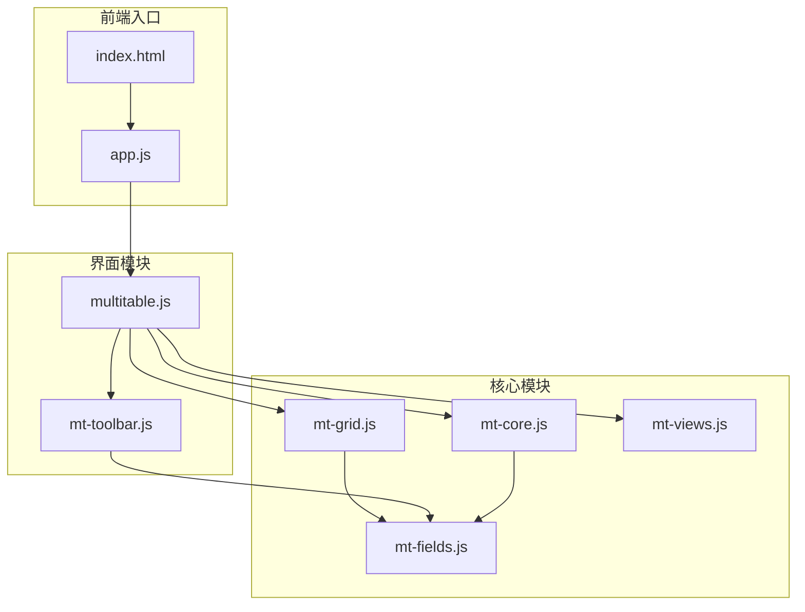
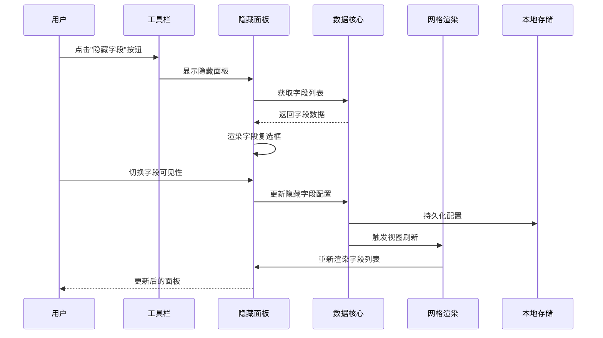
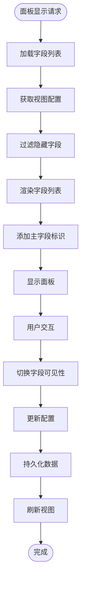
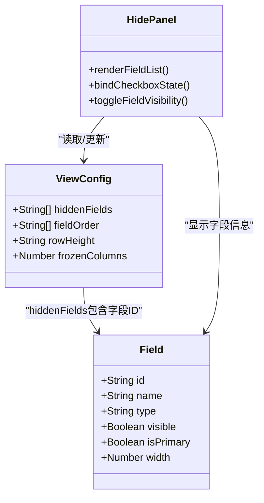
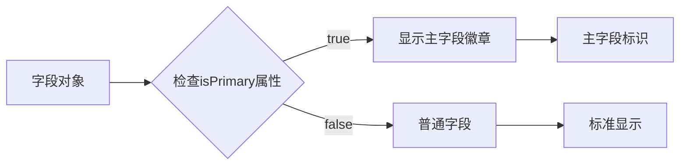
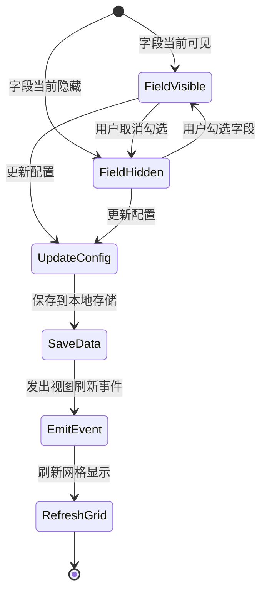
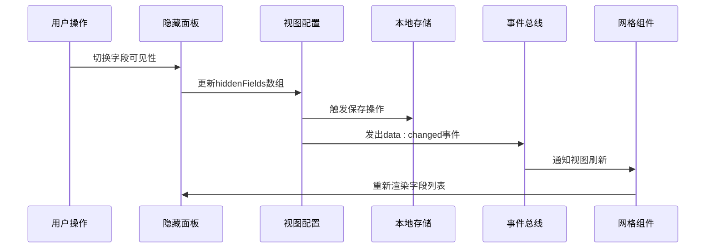
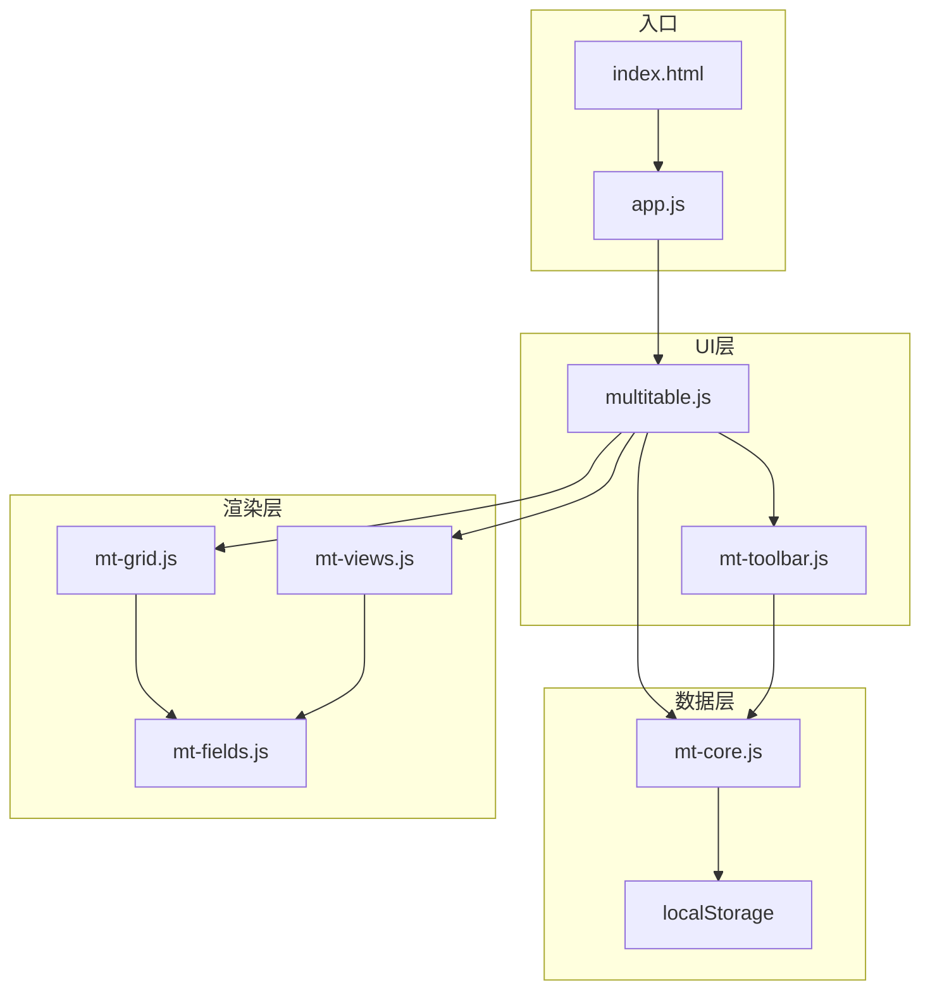

# 隐藏字段面板

<cite>
**本文档引用的文件**
- [index.html](file://index.html)
- [app.js](file://js/app.js)
- [multitable.js](file://js/multitable.js)
- [mt-core.js](file://js/mt-core.js)
- [mt-toolbar.js](file://js/mt-toolbar.js)
- [mt-grid.js](file://js/mt-grid.js)
- [mt-fields.js](file://js/mt-fields.js)
- [mt-views.js](file://js/mt-views.js)
</cite>

## 目录
1. [简介](#简介)
2. [项目结构](#项目结构)
3. [核心组件](#核心组件)
4. [架构概览](#架构概览)
5. [详细组件分析](#详细组件分析)
6. [依赖分析](#依赖分析)
7. [性能考虑](#性能考虑)
8. [故障排除指南](#故障排除指南)
9. [结论](#结论)

## 简介

隐藏字段面板是多维表格系统中的关键功能模块，负责管理字段的可见性控制。该面板允许用户通过复选框直观地显示或隐藏表格中的字段，提供灵活的视图定制能力。本文档深入分析了隐藏字段面板的实现机制，包括字段列表的动态生成、复选框状态绑定、字段显示/隐藏的切换逻辑，以及与整个系统的集成关系。

## 项目结构

多维表格系统采用模块化架构设计，主要文件分布如下：



**图表来源**
- [index.html:370-379](file://index.html#L370-L379)
- [multitable.js:12-29](file://js/multitable.js#L12-L29)

**章节来源**
- [index.html:370-379](file://index.html#L370-L379)
- [app.js:86-138](file://js/app.js#L86-L138)

## 核心组件

隐藏字段面板涉及以下核心组件：

### 1. 工具栏系统 (MT.Toolbar)
- 负责渲染工具栏界面
- 管理各种面板的显示/隐藏
- 处理用户交互事件

### 2. 字段管理系统 (MT.Fields)
- 提供字段类型信息和图标
- 管理字段的渲染和编辑器
- 维护字段类型配置

### 3. 数据核心 (MT.Core)
- 管理工作区数据持久化
- 处理视图配置存储
- 维护字段可见性状态

### 4. 网格渲染器 (MT.Grid)
- 根据视图配置渲染表格
- 应用字段可见性过滤
- 处理字段排序和宽度

**章节来源**
- [mt-toolbar.js:6-48](file://js/mt-toolbar.js#L6-L48)
- [mt-fields.js:5-632](file://js/mt-fields.js#L5-L632)
- [mt-core.js:8-116](file://js/mt-core.js#L8-L116)
- [mt-grid.js:39-52](file://js/mt-grid.js#L39-L52)

## 架构概览

隐藏字段面板的架构采用分层设计，确保各模块职责清晰分离：



**图表来源**
- [mt-toolbar.js:134-149](file://js/mt-toolbar.js#L134-L149)
- [mt-toolbar.js:308-314](file://js/mt-toolbar.js#L308-L314)
- [mt-core.js:51-61](file://js/mt-core.js#L51-L61)

## 详细组件分析

### 隐藏面板渲染机制

隐藏面板采用动态渲染策略，根据当前视图的配置实时生成字段列表：



**图表来源**
- [mt-toolbar.js:134-149](file://js/mt-toolbar.js#L134-L149)
- [mt-grid.js:39-52](file://js/mt-grid.js#L39-L52)

#### 字段列表动态生成

隐藏面板通过以下步骤生成字段列表：

1. **字段收集**: 从当前表获取所有字段
2. **可见性过滤**: 排除已被标记为不可见的字段
3. **主字段识别**: 识别主字段并添加特殊标识
4. **图标显示**: 为每个字段显示对应类型图标

#### 复选框状态绑定

复选框的状态与视图配置中的隐藏字段数组保持双向绑定：



**图表来源**
- [mt-toolbar.js:134-149](file://js/mt-toolbar.js#L134-L149)
- [mt-core.js:92-92](file://js/mt-core.js#L92-L92)

**章节来源**
- [mt-toolbar.js:134-149](file://js/mt-toolbar.js#L134-L149)
- [mt-grid.js:39-52](file://js/mt-grid.js#L39-L52)

### 字段类型图标系统

系统为23种字段类型提供了对应的图标显示机制：

#### 图标映射机制

字段类型与图标之间的映射关系存储在类型定义数组中：

| 字段类型 | 图标 | 分组 |
|---------|------|------|
| text | T | 基础 |
| longtext | ¶ | 基础 |
| number | # | 基础 |
| currency | ¥ | 基础 |
| date | 📅 | 基础 |
| select | ◉ | 选择 |
| multiselect | ☑ | 选择 |
| checkbox | ✓ | 选择 |
| url | 🔗 | 基础 |
| email | ✉ | 基础 |
| phone | 📞 | 基础 |
| rating | ★ | 基础 |
| progress | 📊 | 高级 |
| auto_number | 🔢 | 系统 |
| formula | ƒ | 高级 |
| lookup | 🔍 | 关联 |
| link | ⛓ | 关联 |
| person | 👤 | 高级 |
| attachment | 📎 | 高级 |
| barcode | ⫶ | 高级 |
| location | 📍 | 高级 |
| created_time | ⏱ | 系统 |
| updated_time | ⏰ | 系统 |

#### 图标渲染逻辑

图标渲染通过专门的方法实现，确保在不同上下文中的一致性：

**章节来源**
- [mt-fields.js:6-30](file://js/mt-fields.js#L6-L30)
- [mt-fields.js:44-54](file://js/mt-fields.js#L44-L54)

### 主字段标识处理

主字段（主键字段）在隐藏面板中有特殊的视觉标识：

#### 主字段检测机制

系统通过字段配置中的 `isPrimary` 属性识别主字段：



**图表来源**
- [mt-toolbar.js:141-145](file://js/mt-toolbar.js#L141-L145)
- [mt-grid.js:66-66](file://js/mt-grid.js#L66-L66)

#### 主字段特殊处理

主字段在隐藏面板中的特殊处理包括：
- 显示"主"字标识
- 通常不允许被隐藏（取决于具体实现）
- 在网格头部有特殊样式

**章节来源**
- [mt-toolbar.js:141-145](file://js/mt-toolbar.js#L141-L145)
- [mt-grid.js:66-66](file://js/mt-grid.js#L66-L66)

### 字段可见性切换逻辑

字段可见性的切换采用即时生效的设计模式：

#### 切换流程



**图表来源**
- [mt-toolbar.js:308-314](file://js/mt-toolbar.js#L308-L314)
- [mt-core.js:51-61](file://js/mt-core.js#L51-L61)

#### 配置更新机制

切换操作涉及多个层面的数据更新：

1. **视图配置更新**: 修改 `hiddenFields` 数组
2. **数据持久化**: 保存到本地存储
3. **事件通知**: 触发视图刷新事件
4. **界面更新**: 重新渲染表格

**章节来源**
- [mt-toolbar.js:308-314](file://js/mt-toolbar.js#L308-L314)
- [mt-core.js:51-61](file://js/mt-core.js#L51-L61)

### 实时更新机制

隐藏字段面板实现了完整的实时更新机制：

#### 事件驱动更新

系统采用事件驱动架构，确保状态变化的及时传播：



**图表来源**
- [mt-core.js:28-33](file://js/mt-core.js#L28-L33)
- [mt-core.js:51-61](file://js/mt-core.js#L51-L61)

#### 状态同步保证

系统通过以下机制保证状态同步：

1. **即时保存**: 配置变更后立即触发保存
2. **事件广播**: 通过事件总线通知所有监听者
3. **批量更新**: 避免重复渲染和性能问题
4. **错误恢复**: 提供数据恢复和一致性检查

**章节来源**
- [mt-core.js:28-33](file://js/mt-core.js#L28-L33)
- [mt-core.js:51-61](file://js/mt-core.js#L51-L61)

## 依赖分析

隐藏字段面板的依赖关系体现了清晰的模块化设计：



**图表来源**
- [index.html:370-379](file://index.html#L370-L379)
- [multitable.js:12-29](file://js/multitable.js#L12-L29)

### 模块耦合度分析

隐藏字段面板的模块耦合度控制良好：

- **低耦合**: 各模块间通过接口通信，减少直接依赖
- **高内聚**: 相关功能集中在特定模块中
- **清晰边界**: 每个模块职责明确，边界清晰

### 外部依赖

系统对外部依赖的管理：

- **浏览器API**: 依赖现代浏览器的本地存储和事件系统
- **第三方库**: 使用Chart.js进行数据可视化
- **CDN资源**: 通过CDN加载字体图标和样式库

**章节来源**
- [index.html:370-379](file://index.html#L370-L379)
- [multitable.js:12-29](file://js/multitable.js#L12-L29)

## 性能考虑

针对大量字段场景的性能优化策略：

### 1. 虚拟滚动优化

对于字段数量较多的情况，建议实现虚拟滚动技术：

- **延迟渲染**: 仅渲染可视区域内的字段
- **动态加载**: 滚动时动态加载更多字段
- **内存管理**: 及时释放不可见字段的DOM节点

### 2. 渲染缓存机制

```javascript
// 建议的缓存策略
const fieldRenderCache = new Map();
const panelRenderCache = new Map();

function getCachedFieldRender(fieldId) {
    if (fieldRenderCache.has(fieldId)) {
        return fieldRenderCache.get(fieldId);
    }
    const rendered = renderField(fieldId);
    fieldRenderCache.set(fieldId, rendered);
    return rendered;
}
```

### 3. 批量更新优化

避免频繁的DOM操作：

- **批量保存**: 合并多个配置变更后再保存
- **防抖处理**: 对快速连续的操作进行防抖
- **增量更新**: 仅更新发生变化的部分

### 4. 内存使用优化

- **对象池**: 复用DOM元素和JavaScript对象
- **垃圾回收**: 及时清理不再使用的引用
- **数据压缩**: 对大型数据进行压缩存储

## 故障排除指南

### 常见问题及解决方案

#### 1. 字段状态不同步

**症状**: 切换字段可见性后，界面没有更新

**排查步骤**:
1. 检查事件是否正确触发
2. 验证配置更新是否保存
3. 确认视图刷新事件是否发出

**解决方法**:
```javascript
// 确保正确的事件处理链
MT.Toolbar.handlePanelAction('toggle-field', checkboxElement);
MT.Core.save();
MT.Core.emit('view:refresh', {});
```

#### 2. 主字段被意外隐藏

**症状**: 主字段在某些情况下被隐藏

**排查步骤**:
1. 检查主字段的 `isPrimary` 属性
2. 验证隐藏逻辑是否正确处理主字段
3. 查看是否有强制隐藏的配置

**解决方法**:
```javascript
// 在隐藏逻辑中排除主字段
if (field.isPrimary) {
    return; // 不允许隐藏主字段
}
```

#### 3. 性能问题

**症状**: 字段数量较多时界面响应缓慢

**排查步骤**:
1. 检查DOM节点数量
2. 分析JavaScript执行时间
3. 监控内存使用情况

**解决方法**:
- 实现虚拟滚动
- 添加渲染缓存
- 优化事件处理

**章节来源**
- [mt-toolbar.js:308-314](file://js/mt-toolbar.js#L308-L314)
- [mt-core.js:51-61](file://js/mt-core.js#L51-L61)

## 结论

隐藏字段面板作为多维表格系统的重要组成部分，展现了优秀的模块化设计和用户体验。其核心优势包括：

### 技术优势

1. **清晰的架构设计**: 分层架构确保了模块间的低耦合和高内聚
2. **实时更新机制**: 事件驱动的更新系统保证了状态的一致性
3. **灵活的配置管理**: 支持复杂的字段可见性配置组合
4. **良好的扩展性**: 模块化设计便于功能扩展和维护

### 用户体验特点

1. **直观的操作界面**: 通过复选框提供直观的字段控制
2. **即时反馈**: 用户操作后立即得到界面响应
3. **一致的视觉设计**: 统一的图标和样式系统
4. **无障碍访问**: 支持键盘导航和屏幕阅读器

### 最佳实践建议

1. **性能优化**: 对大量字段场景实施虚拟滚动和缓存策略
2. **错误处理**: 建立完善的错误捕获和恢复机制
3. **测试覆盖**: 确保关键功能的自动化测试
4. **文档维护**: 保持技术文档与代码同步更新

隐藏字段面板为多维表格提供了强大的视图定制能力，是提升用户体验和工作效率的关键功能模块。通过持续的优化和改进，该系统能够满足各种复杂的数据管理需求。