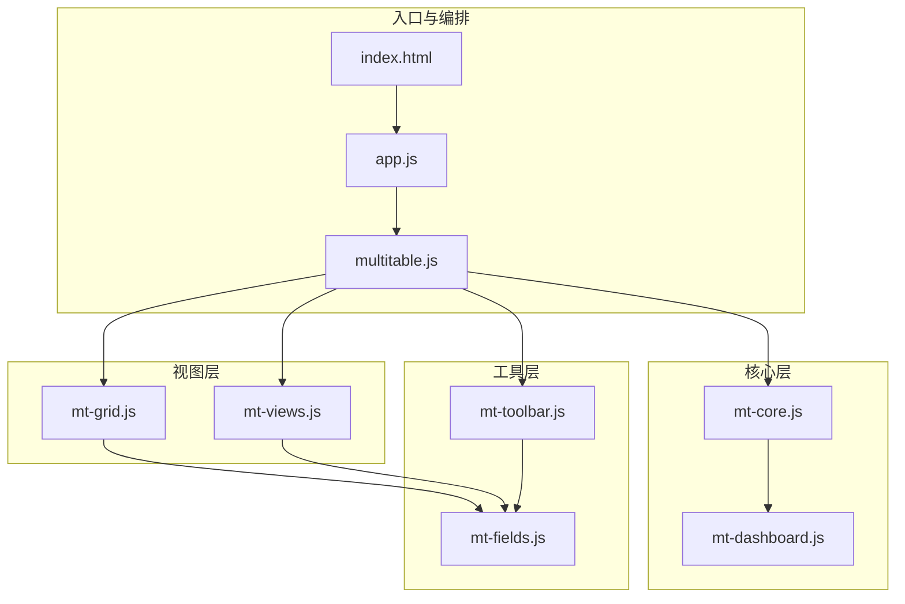
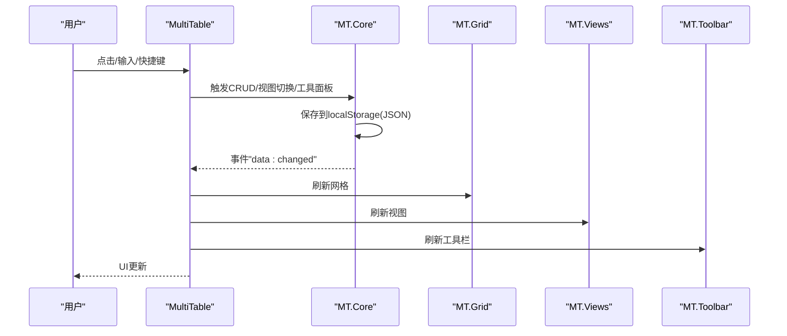
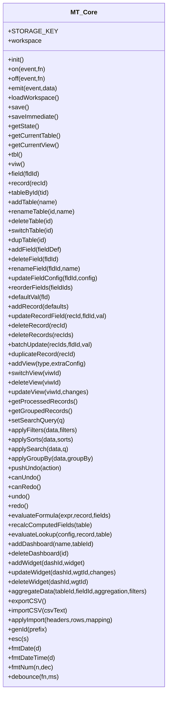
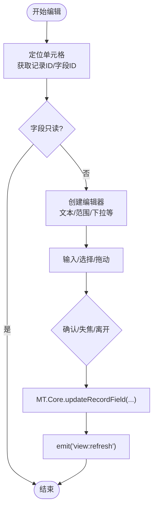
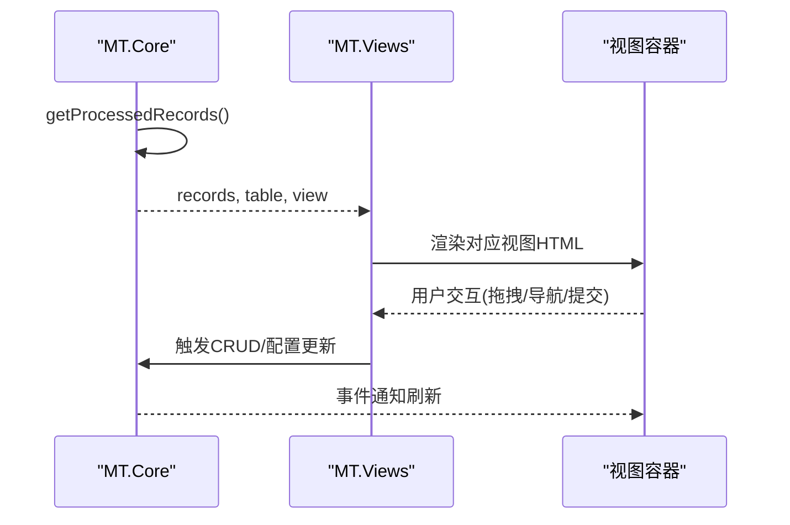
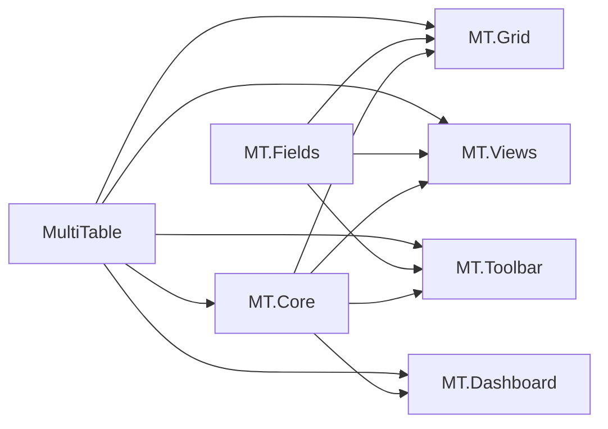

# 核心模块

<cite>
**本文档引用的文件**
- [mt-core.js](file://js/mt-core.js)
- [mt-grid.js](file://js/mt-grid.js)
- [mt-views.js](file://js/mt-views.js)
- [mt-fields.js](file://js/mt-fields.js)
- [mt-toolbar.js](file://js/mt-toolbar.js)
- [mt-dashboard.js](file://js/mt-dashboard.js)
- [multitable.js](file://js/multitable.js)
- [app.js](file://js/app.js)
- [index.html](file://index.html)
- [README.md](file://README.md)
</cite>

## 目录
1. [简介](#简介)
2. [项目结构](#项目结构)
3. [核心组件](#核心组件)
4. [架构总览](#架构总览)
5. [详细组件分析](#详细组件分析)
6. [依赖关系分析](#依赖关系分析)
7. [性能考虑](#性能考虑)
8. [故障排查指南](#故障排查指南)
9. [结论](#结论)
10. [附录](#附录)

## 简介
本文件面向“陈苗多维表格”项目的MT-Core核心模块，系统性阐述其状态管理、数据持久化、事件系统、工作区与表/视图/记录管理、数据处理管道、缓存与同步策略、核心API与使用示例、扩展与自定义指南，以及错误处理、性能监控与调试方法。目标读者包括前端工程师、产品与运营人员及希望二次开发的开发者。

## 项目结构
多维表格采用“核心层 + 视图层 + 工具层 + 编排层”的分层架构：
- 核心层（MT.Core）：状态、事件、持久化、CRUD、数据管道、撤销/重做、公式/查找引用、仪表盘与聚合。
- 视图层（MT.Grid、MT.Views）：网格增强、看板/画廊/甘特/日历/表单等视图渲染。
- 工具层（MT.Fields、MT.Toolbar）：字段类型渲染/编辑、工具栏面板与交互。
- 编排层（MultiTable）：页面布局、事件委托、模块协调、记录详情面板。
- 入口与路由（index.html、app.js）：页面与模块加载、菜单导航、生命周期管理。

**图表来源**
- [index.html](file://index.html)
- [app.js](file://js/app.js)
- [multitable.js](file://js/multitable.js)
- [mt-core.js](file://js/mt-core.js)
- [mt-grid.js](file://js/mt-grid.js)
- [mt-views.js](file://js/mt-views.js)
- [mt-fields.js](file://js/mt-fields.js)
- [mt-toolbar.js](file://js/mt-toolbar.js)
- [mt-dashboard.js](file://js/mt-dashboard.js)

**章节来源**
- [index.html](file://index.html)
- [app.js](file://js/app.js)
- [README.md](file://README.md)

## 核心组件
- MT.Core：命名空间、事件总线、工作区/表/视图/记录访问器、CRUD、数据管道、撤销/重做、公式/查找引用、仪表盘与聚合、CSV导入导出、本地持久化。
- MT.Grid：网格视图增强（分组、冻结列、条件着色、行高、键盘导航、复制粘贴、列宽拖拽）。
- MT.Views：看板/画廊/甘特/日历/表单视图渲染与交互。
- MT.Fields：23种字段类型渲染器与编辑器、只读判断、颜色体系。
- MT.Toolbar：筛选/排序/分组/隐藏字段/行高/条件着色/CSV导入导出/撤销重做等工具面板。
- MultiTable：页面骨架、事件委托、模块协调、记录详情面板、快捷键与刷新策略。
- MT.Dashboard：统计卡片、图表（Chart.js）、表格/进度/列表组件、拖拽布局与配置。

**章节来源**
- [mt-core.js](file://js/mt-core.js)
- [mt-grid.js](file://js/mt-grid.js)
- [mt-views.js](file://js/mt-views.js)
- [mt-fields.js](file://js/mt-fields.js)
- [mt-toolbar.js](file://js/mt-toolbar.js)
- [mt-dashboard.js](file://js/mt-dashboard.js)
- [multitable.js](file://js/multitable.js)

## 架构总览
MT-Core通过事件总线解耦各模块，统一管理状态与持久化；视图层基于核心数据管道进行过滤/排序/搜索/分组；工具层提供强大的字段与面板能力；编排层负责UI骨架与交互事件分发。

**图表来源**
- [multitable.js](file://js/multitable.js)
- [mt-core.js](file://js/mt-core.js)
- [mt-grid.js](file://js/mt-grid.js)
- [mt-views.js](file://js/mt-views.js)
- [mt-toolbar.js](file://js/mt-toolbar.js)

## 详细组件分析

### MT.Core：状态管理、持久化与事件系统
- 命名空间与事件总线
  - 提供 on/off/emit 事件机制，自动广播“data:changed”以驱动UI刷新。
- 工作区与数据模型
  - 工作区包含 tables、activeTableId、dashboards、undoStack、redoStack、version 等。
  - 提供 getState()/getCurrentTable()/getCurrentView()/field()/record()/tableById() 等访问器。
- 持久化与迁移
  - 使用 localStorage 以 JSON 字符串存储，键为固定常量。
  - 提供版本迁移（v1→v2），补齐缺失字段与默认值。
  - 保存采用防抖（setTimeout 200ms）降低写入频率；失败时发出“storage:warning”事件。
- 表/字段/记录/视图管理
  - 表：增删改/切换/复制/重命名；字段：增删改/重排/默认值；记录：增删改/批量更新/复制；视图：增删改/切换/配置。
  - 自动编号字段维护计数器，记录创建时自动生成编号。
- 数据处理管道
  - getProcessedRecords()/getGroupedRecords() 组合 filters/sorts/search/groupBy。
  - applyFilters/applySorts/applySearch/applyGroupBy 实现具体算法。
- 撤销/重做
  - pushUndo/undo/redo 维护动作栈，支持多种动作回滚与重做。
- 公式引擎与查找引用
  - evaluateFormula 支持 IF/SUM/AVG/MAX/MIN/LEN/ABS/ROUND/TODAY/CONCAT 等内置函数与字段替换。
  - evaluateLookup 支持跨表引用与聚合。
- 仪表盘与聚合
  - addDashboard/deleteDashboard/addWidget/updateWidget/deleteWidget。
  - aggregateData 支持 count/sum/avg/min/max。
- CSV导入导出
  - exportCSV/importCSV/applyImport 实现CSV解析与批量导入。
- 工具函数
  - genId/esc/fmtDate/fmtDateTime/fmtNum/debounce 等。

**图表来源**
- [mt-core.js](file://js/mt-core.js)

**章节来源**
- [mt-core.js](file://js/mt-core.js)

### MT.Grid：网格视图与增强功能
- 可见字段与列宽：根据视图配置与隐藏字段计算可见列，支持冻结列与列宽拖拽。
- 分组与汇总：支持按字段分组，显示组头与汇总行。
- 条件着色：按规则匹配字段值设置行/单元格背景与文字颜色。
- 编辑与键盘导航：双击进入编辑，支持 Enter/Tab/方向键导航、Delete/Clear。
- 复制粘贴：支持单值与区域粘贴，自动类型转换。
- 行高与选择：支持紧凑/标准/宽松三种行高，全选与多选。

**图表来源**
- [mt-grid.js](file://js/mt-grid.js)
- [mt-fields.js](file://js/mt-fields.js)
- [mt-core.js](file://js/mt-core.js)

**章节来源**
- [mt-grid.js](file://js/mt-grid.js)

### MT.Views：多视图渲染与交互
- 看板视图：按单选字段分组，支持卡片字段与封面图配置。
- 画廊视图：按列数与封面字段展示卡片。
- 甘特图：按开始/结束日期绘制条形，支持缩放与进度显示。
- 日历视图：按月/日展示事件，支持导航与字段配置。
- 表单视图：按字段集合渲染表单，支持必填/帮助文案与提交成功提示。

**图表来源**
- [mt-views.js](file://js/mt-views.js)
- [mt-core.js](file://js/mt-core.js)

**章节来源**
- [mt-views.js](file://js/mt-views.js)

### MT.Fields：字段类型与渲染/编辑
- 类型与图标：内置23种字段类型，提供图标与标签。
- 只读判断：对系统/公式/查找引用字段标记为只读。
- 单元格渲染：针对不同字段类型输出HTML（文本/标签/评分/进度/链接/附件/地理位置等）。
- 行内编辑器：支持即时切换（复选/评分）、下拉选择、范围滑条、附件上传、关联选择等。
- 详情面板编辑器：提供更丰富的表单控件与校验。
- 配置解析：根据字段类型生成配置表单并解析为字段配置对象。

**章节来源**
- [mt-fields.js](file://js/mt-fields.js)

### MT.Toolbar：工具栏面板系统
- 面板：筛选、排序、分组、隐藏字段、行高、条件着色、导入导出、撤销重做、搜索。
- 交互：面板内增删改配置，应用后保存并触发刷新。
- CSV导入：文件选择、预览、字段映射、批量导入。

**章节来源**
- [mt-toolbar.js](file://js/mt-toolbar.js)

### MultiTable：页面编排与事件协调
- 生命周期：init/destroy，绑定事件与监听核心事件。
- 页面骨架：侧边栏（表/仪表盘）、顶部视图切换、工具栏区域、内容区。
- 事件委托：点击/双击/输入/键盘/鼠标/变更等，委派至具体模块。
- 记录详情面板：打开/关闭/删除/复制记录，防抖保存。
- 快捷键：Ctrl+Z/Y、Ctrl+C/V、Esc 关闭面板/下拉/菜单。

**章节来源**
- [multitable.js](file://js/multitable.js)

### MT.Dashboard：仪表盘与图表
- 组件：统计卡片、柱状/折线/饼/环/雷达/表格/进度/列表。
- 渲染：按配置计算数据，使用Chart.js渲染图表；表格/进度/列表组件独立渲染。
- 配置：标题、类型、数据源表、分组/数值字段、聚合方式、网格尺寸等。
- 销毁：统一销毁图表实例，避免内存泄漏。

**章节来源**
- [mt-dashboard.js](file://js/mt-dashboard.js)

## 依赖关系分析
- 模块依赖
  - MT.Grid 依赖 MT.Fields、MT.Core。
  - MT.Views 依赖 MT.Fields、MT.Core。
  - MT.Toolbar 依赖 MT.Fields、MT.Core。
  - MultiTable 依赖 MT.Core、MT.Fields、MT.Grid、MT.Views、MT.Toolbar、MT.Dashboard。
  - MT.Dashboard 依赖 MT.Core、Chart.js。
- 事件耦合
  - MT.Core.emit("data:changed") 驱动 MultiTable 刷新。
  - MT.Core.emit("view:refresh") 驱动 Grid/Views 刷新。
  - MT.Core.emit("storage:warning") 驱动 UI 提示存储配额告警。
- 数据流
  - MultiTable 从 MT.Core 获取状态，渲染视图，用户交互触发 MT.Core 修改状态，再通过事件回流刷新 UI。

**图表来源**
- [mt-core.js](file://js/mt-core.js)
- [mt-grid.js](file://js/mt-grid.js)
- [mt-views.js](file://js/mt-views.js)
- [mt-fields.js](file://js/mt-fields.js)
- [mt-toolbar.js](file://js/mt-toolbar.js)
- [mt-dashboard.js](file://js/mt-dashboard.js)
- [multitable.js](file://js/multitable.js)

**章节来源**
- [mt-core.js](file://js/mt-core.js)
- [mt-grid.js](file://js/mt-grid.js)
- [mt-views.js](file://js/mt-views.js)
- [mt-fields.js](file://js/mt-fields.js)
- [mt-toolbar.js](file://js/mt-toolbar.js)
- [mt-dashboard.js](file://js/mt-dashboard.js)
- [multitable.js](file://js/multitable.js)

## 性能考虑
- 防抖保存：MT.Core.save() 使用定时器合并多次写入，减少 localStorage 压力。
- 数据管道：过滤/排序/搜索/分组在视图渲染前一次性计算，避免重复遍历。
- 视图懒渲染：仪表盘图表延迟渲染，确保DOM就绪后再初始化。
- 编辑体验：Grid 编辑器按需创建，完成输入后统一提交，减少频繁重绘。
- 批量操作：批量更新/删除记录时统一推送撤销栈，避免逐条保存。
- 建议
  - 大数据量场景建议分页/虚拟滚动（当前未实现，可扩展）。
  - 对复杂公式/查找引用，建议在后台线程或异步计算，避免阻塞主线程。

[本节为通用指导，无需特定文件引用]

## 故障排查指南
- 本地存储配额不足
  - 现象：保存失败并发出“storage:warning”事件。
  - 处理：检查 getStorageUsage() 返回的已用KB/限制KB/百分比，清理或降量使用。
- 恢复工作区
  - 现象：工作区损坏或解析异常。
  - 处理：loadWorkspace() 中包含异常分支，会回退到演示数据；可手动删除localStorage键重置。
- 撤销/重做异常
  - 现象：撤销/重做后数据不一致。
  - 处理：检查 pushUndo 的动作类型与_applyUndoAction/_applyRedoAction 是否完整覆盖。
- 公式/查找引用错误
  - 现象：公式返回“#ERROR”，查找引用为空。
  - 处理：核对字段名称与ID、表达式语法、源表/字段配置。
- 视图渲染异常
  - 现象：看板/甘特/日历等视图空白或报错。
  - 处理：确认视图配置字段存在且类型匹配；检查 MT.Core.getProcessedRecords() 结果。

**章节来源**
- [mt-core.js](file://js/mt-core.js)

## 结论
MT-Core 以事件总线为核心，结合本地持久化与数据管道，构建了稳定、可扩展的多维表格数据层。通过 MultiTable 的编排与 MT.Grid/MT.Views 的丰富视图能力，实现了从数据到界面的一体化体验。配合 MT.Toolbar 与 MT.Dashboard，满足日常管理与可视化分析需求。建议在后续迭代中引入虚拟滚动、公式异步计算与云端同步，进一步提升性能与协作能力。

[本节为总结，无需特定文件引用]

## 附录

### 核心API与使用示例（路径指引）
- 初始化与持久化
  - [MT.Core.init](file://js/mt-core.js)
  - [MT.Core.loadWorkspace](file://js/mt-core.js)
  - [MT.Core.save](file://js/mt-core.js)
  - [MT.Core.saveImmediate](file://js/mt-core.js)
  - [MT.Core.getStorageUsage](file://js/mt-core.js)
- 工作区与访问器
  - [MT.Core.getState](file://js/mt-core.js)
  - [MT.Core.getCurrentTable](file://js/mt-core.js)
  - [MT.Core.getCurrentView](file://js/mt-core.js)
  - [MT.Core.tbl/viw/field/record/tableById](file://js/mt-core.js)
- 表/字段/记录/视图管理
  - [MT.Core.addTable/renameTable/deleteTable/switchTable/dupTable](file://js/mt-core.js)
  - [MT.Core.addField/deleteField/renameField/updateFieldConfig/reorderFields/defaultVal](file://js/mt-core.js)
  - [MT.Core.addRecord/updateRecordField/deleteRecord/deleteRecords/batchUpdate/duplicateRecord](file://js/mt-core.js)
  - [MT.Core.addView/switchView/deleteView/updateView](file://js/mt-core.js)
- 数据处理管道
  - [MT.Core.getProcessedRecords/getGroupedRecords/setSearchQuery](file://js/mt-core.js)
  - [MT.Core.applyFilters/applySorts/applySearch/applyGroupBy](file://js/mt-core.js)
- 撤销/重做
  - [MT.Core.pushUndo/canUndo/canRedo/undo/redo](file://js/mt-core.js)
- 公式与查找引用
  - [MT.Core.evaluateFormula/recalcComputedFields/evaluateLookup](file://js/mt-core.js)
- 仪表盘与聚合
  - [MT.Core.addDashboard/deleteDashboard/addWidget/updateWidget/deleteWidget](file://js/mt-core.js)
  - [MT.Core.aggregateData](file://js/mt-core.js)
- CSV导入导出
  - [MT.Core.exportCSV/importCSV/applyImport](file://js/mt-core.js)
- 工具函数
  - [MT.Core.genId/esc/fmtDate/fmtDateTime/fmtNum/debounce](file://js/mt-core.js)

**章节来源**
- [mt-core.js](file://js/mt-core.js)

### 扩展与自定义指南
- 新增字段类型
  - 在 MT.Fields 中注册类型、图标与只读判断，并补充渲染/编辑器与详情面板编辑器。
  - 在 MT.Core.defaultVal 中提供默认值策略。
- 新增视图类型
  - 在 MT.Views 中实现渲染函数，必要时在 MT.Core.addView 中注入默认配置。
- 新增工具面板
  - 在 MT.Toolbar 中新增面板HTML与事件处理，调用 MT.Core.updateView 或保存到视图配置。
- 新增仪表盘组件
  - 在 MT.Dashboard 中新增渲染与配置逻辑，支持新的图表/组件类型。
- 云端同步（可选）
  - 当前为本地存储；若需云端同步，可在 MT.Core.save/load 中接入云存储API，并在 MultiTable 中增加同步按钮与状态提示。

**章节来源**
- [mt-fields.js](file://js/mt-fields.js)
- [mt-views.js](file://js/mt-views.js)
- [mt-toolbar.js](file://js/mt-toolbar.js)
- [mt-dashboard.js](file://js/mt-dashboard.js)
- [mt-core.js](file://js/mt-core.js)
- [multitable.js](file://js/multitable.js)