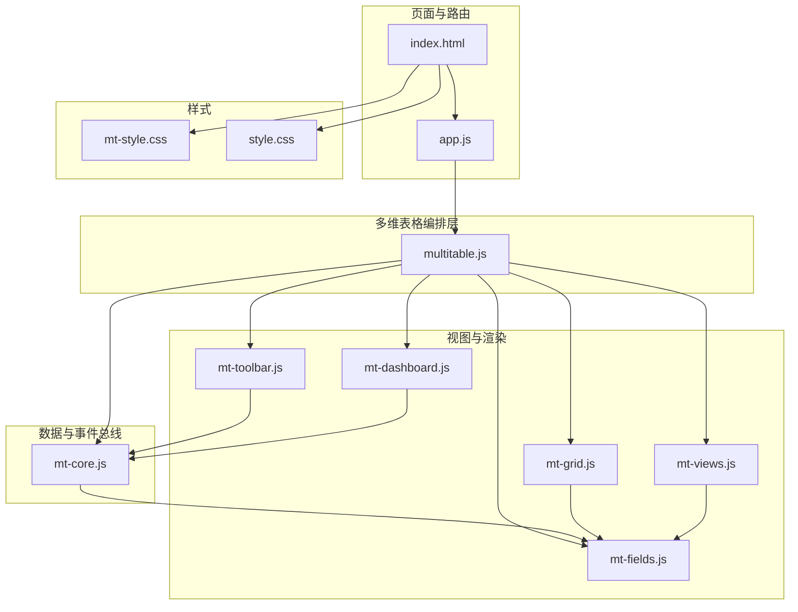
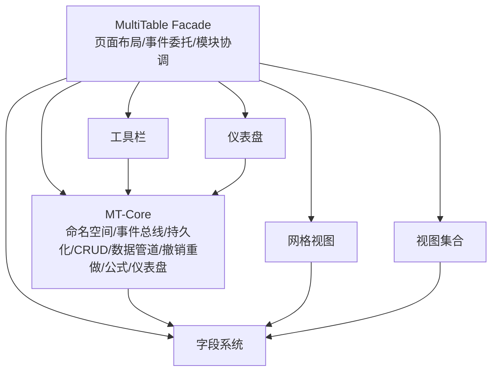
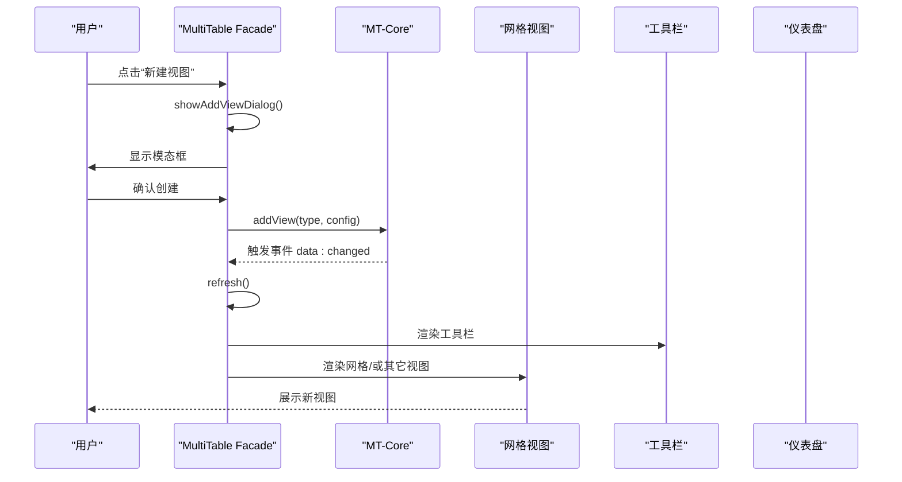
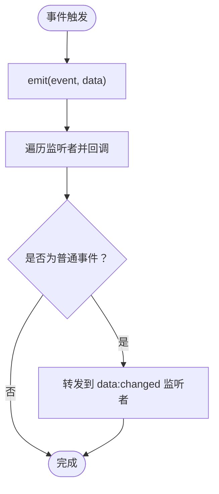
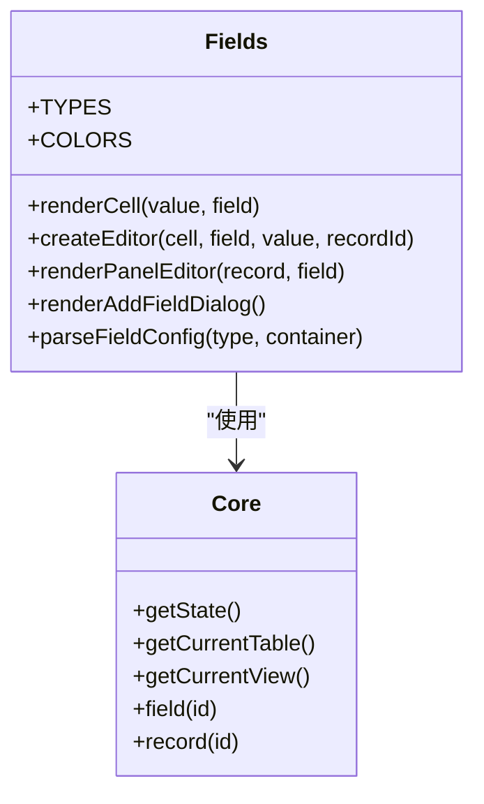
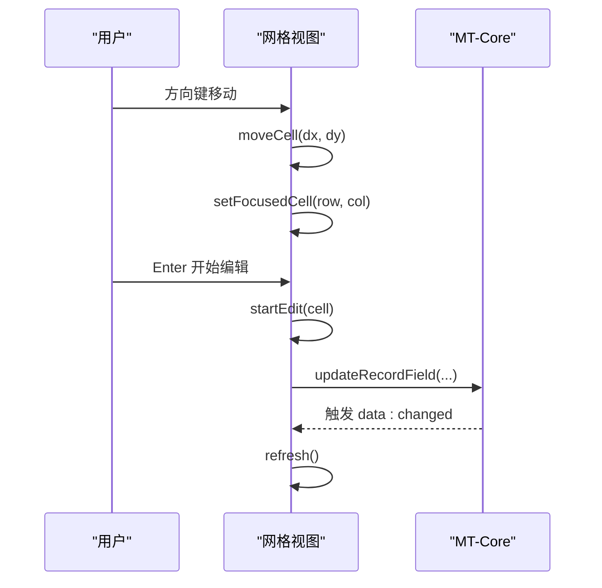
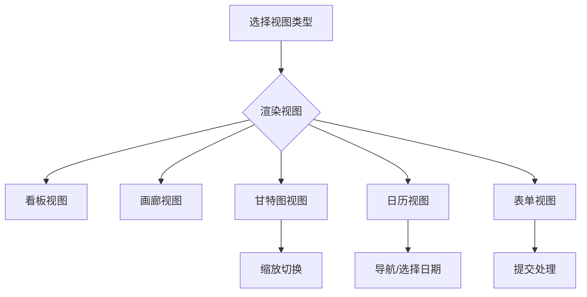
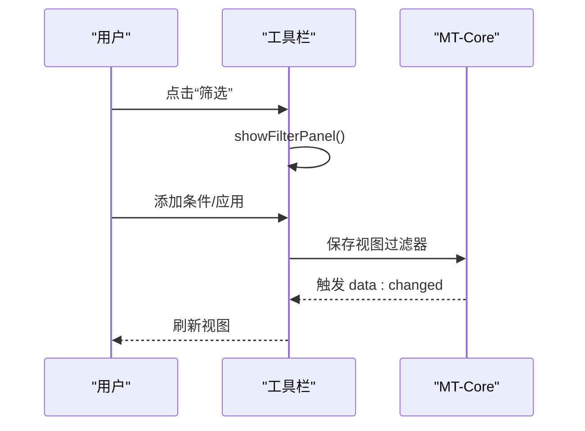
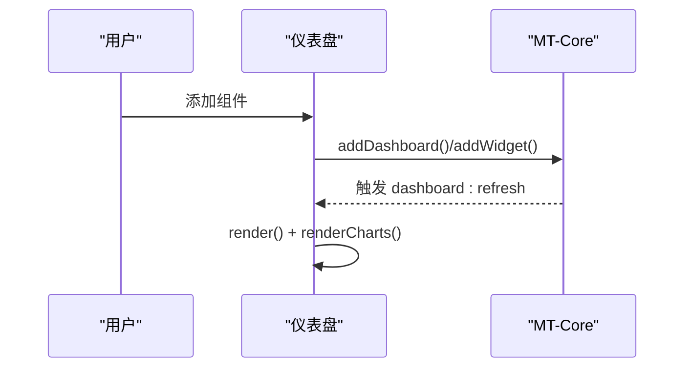
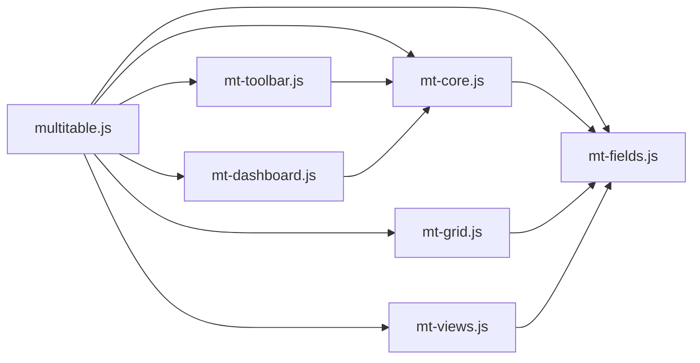

# 系统架构

<cite>
**本文档引用的文件**
- [README.md](file://README.md)
- [index.html](file://index.html)
- [app.js](file://js/app.js)
- [multitable.js](file://js/multitable.js)
- [mt-core.js](file://js/mt-core.js)
- [mt-fields.js](file://js/mt-fields.js)
- [mt-grid.js](file://js/mt-grid.js)
- [mt-views.js](file://js/mt-views.js)
- [mt-toolbar.js](file://js/mt-toolbar.js)
- [mt-dashboard.js](file://js/mt-dashboard.js)
- [mt-style.css](file://css/mt-style.css)
- [style.css](file://css/style.css)
</cite>

## 目录
1. [引言](#引言)
2. [项目结构](#项目结构)
3. [核心组件](#核心组件)
4. [架构总览](#架构总览)
5. [详细组件分析](#详细组件分析)
6. [依赖关系分析](#依赖关系分析)
7. [性能考量](#性能考量)
8. [故障排查指南](#故障排查指南)
9. [结论](#结论)
10. [附录](#附录)

## 引言
本项目是一个基于前端技术栈的财务CRM管理系统，采用“多维表格”作为核心数据模型与交互载体。系统通过“MultiTable Facade 编排层”统一调度 MT-Core 数据层与各视图/工具模块，实现页面布局、事件委托、模块协调与记录详情面板管理；MT-Core 提供命名空间、事件总线、数据持久化、CRUD、数据管道、撤销重做、公式引擎与仪表盘能力；其余模块（字段渲染、网格视图、视图集合、工具栏、仪表盘）分别负责具体的数据展示与交互。

## 项目结构
系统采用“页面 + 模块化JS + 样式”的组织方式：
- 页面与路由：index.html 定义页面骨架与菜单，app.js 负责页面切换与模块生命周期管理。
- 多维表格模块：multitable.js 作为 Facade 层，协调 MT-Core 与各子模块。
- 数据与事件：mt-core.js 提供工作区状态、CRUD、事件总线、持久化、撤销重做、公式引擎等。
- 视图与渲染：mt-grid.js（网格）、mt-views.js（看板/画廊/甘特/日历/表单）、mt-fields.js（字段类型渲染与编辑器）、mt-toolbar.js（筛选/排序/分组/隐藏/着色/导入导出）、mt-dashboard.js（仪表盘）。
- 样式：mt-style.css 提供多维表格专用样式，style.css 提供整体页面布局与通用UI。

**图表来源**
- [index.html](file://index.html)
- [app.js](file://js/app.js)
- [multitable.js](file://js/multitable.js)
- [mt-core.js](file://js/mt-core.js)
- [mt-fields.js](file://js/mt-fields.js)
- [mt-grid.js](file://js/mt-grid.js)
- [mt-views.js](file://js/mt-views.js)
- [mt-toolbar.js](file://js/mt-toolbar.js)
- [mt-dashboard.js](file://js/mt-dashboard.js)
- [mt-style.css](file://css/mt-style.css)
- [style.css](file://css/style.css)

**章节来源**
- [index.html](file://index.html)
- [app.js](file://js/app.js)

## 核心组件
- MultiTable Facade（multitable.js）
  - 职责：页面布局、事件委托、模块协调、记录详情面板管理、视图/仪表盘切换、快捷键处理。
  - 关键点：统一渲染骨架、事件委托、刷新主内容、记录面板、模态框管理、快捷键（Ctrl+Z/Y、复制粘贴、Esc）。
- MT-Core（mt-core.js）
  - 职责：命名空间、事件总线、数据持久化（localStorage）、CRUD、数据管道（过滤/排序/搜索/分组）、撤销/重做、公式引擎、仪表盘、导入导出。
  - 关键点：工作区状态管理、访问器、表/字段/记录/视图/仪表盘操作、计算字段与查找引用、CSV导入导出。
- 字段系统（mt-fields.js）
  - 职责：23种字段类型渲染器与编辑器、只读判断、颜色方案、字段配置解析与生成。
  - 关键点：单元格渲染、行内编辑器、详情面板编辑器、添加字段对话框、字段配置HTML与解析。
- 网格视图（mt-grid.js）
  - 职责：增强网格（分组、冻结列、条件着色、行高、键盘导航、复制粘贴、列宽拖拽）。
  - 关键点：可见字段排序、冻结列、条件着色规则匹配、键盘导航、复制粘贴、列宽拖拽、全选与选中记录。
- 视图集合（mt-views.js）
  - 职责：看板、画廊、甘特图、日历、表单视图渲染与交互。
  - 关键点：甘特图时间轴与条形、日历月份网格、表单提交与成功反馈。
- 工具栏（mt-toolbar.js）
  - 职责：筛选、排序、分组、隐藏字段、行高、条件着色、CSV导入、撤销/重做、搜索。
  - 关键点：下拉面板、字段菜单、表菜单、CSV预览与映射导入。
- 仪表盘（mt-dashboard.js）
  - 职责：统计卡片、柱/折/饼/环/雷达图、表格组件、进度组件、列表组件、拖拽布局、图表实例管理。
  - 关键点：组件类型与配置、统计计算、图表渲染与销毁、全屏模式。

**章节来源**
- [multitable.js](file://js/multitable.js)
- [mt-core.js](file://js/mt-core.js)
- [mt-fields.js](file://js/mt-fields.js)
- [mt-grid.js](file://js/mt-grid.js)
- [mt-views.js](file://js/mt-views.js)
- [mt-toolbar.js](file://js/mt-toolbar.js)
- [mt-dashboard.js](file://js/mt-dashboard.js)

## 架构总览
系统采用“Facade + Core + Modules”的分层架构：
- Facade 层（MultiTable）负责页面布局、事件委托与模块协调，屏蔽底层复杂性。
- Core 层（MT-Core）提供统一的数据与事件中心，保证状态一致性与可扩展性。
- Modules 层（Grid/Views/Fields/Toolbar/Dashboard）各自专注特定领域，通过 Core 解耦协作。

**图表来源**
- [multitable.js](file://js/multitable.js)
- [mt-core.js](file://js/mt-core.js)
- [mt-fields.js](file://js/mt-fields.js)
- [mt-grid.js](file://js/mt-grid.js)
- [mt-views.js](file://js/mt-views.js)
- [mt-toolbar.js](file://js/mt-toolbar.js)
- [mt-dashboard.js](file://js/mt-dashboard.js)

## 详细组件分析

### MultiTable Facade 编排层
- 页面骨架与布局
  - 渲染侧边栏（表/视图/仪表盘入口）、顶部视图切换栏、工具栏区域、内容区。
  - 通过 MT.Core.getState()/getCurrentTable()/getCurrentView() 获取上下文，动态渲染。
- 事件委托与快捷键
  - 统一监听 click/doubleclick/input/keydown/mousedown/change，委派至对应处理分支。
  - 全局快捷键：Ctrl+Z/Y（撤销/重做）、Ctrl+C/V（复制/粘贴）、Escape（关闭面板/模态框）。
- 模块协调
  - 切换表/视图/仪表盘，刷新侧边栏与内容区。
  - 委托工具栏面板内的操作（筛选/排序/分组/隐藏/着色等）。
- 记录详情面板
  - 打开/关闭、变更处理（防抖保存）、删除记录。
- 模态框管理
  - 添加字段/视图对话框、仪表盘组件配置与添加、导入CSV对话框。

**图表来源**
- [multitable.js](file://js/multitable.js)
- [mt-core.js](file://js/mt-core.js)
- [mt-grid.js](file://js/mt-grid.js)
- [mt-toolbar.js](file://js/mt-toolbar.js)
- [mt-dashboard.js](file://js/mt-dashboard.js)

**章节来源**
- [multitable.js](file://js/multitable.js)

### MT-Core 状态管理与事件系统
- 命名空间与事件总线
  - window.MT 命名空间，on/off/emit 事件机制，自动转发非 data:changed 事件到 data:changed。
- 数据持久化
  - localStorage 存储工作区，200ms 防抖保存，容量不足时触发存储告警。
- CRUD 与数据管道
  - 表/字段/记录/视图/仪表盘 CRUD，过滤/排序/搜索/分组链式处理。
- 撤销/重做
  - 50步栈，支持单字段更新、删除记录/批量、删除字段、批量化更新等动作回滚。
- 公式引擎与查找引用
  - 安全表达式求值（内置函数与比较运算），查找引用跨表取值。
- 仪表盘与导入导出
  - 统计聚合、图表数据计算、CSV 导入/导出。

**图表来源**
- [mt-core.js](file://js/mt-core.js)

**章节来源**
- [mt-core.js](file://js/mt-core.js)

### 字段系统（渲染与编辑）
- 字段类型与渲染
  - 23种字段类型（文本/数字/日期/选择/复选/评分/进度/自动编号/公式/查找引用/关联/人员/附件/条码/地理位置/时间戳等）。
  - 单元格渲染（标签/链接/评分/进度/附件/地理位置/时间等）与详情面板编辑器。
- 编辑器策略
  - 即时编辑（复选/评分）、下拉编辑（单选/多选/人员）、范围输入（进度）、附件上传、关联选择等。
- 配置与校验
  - 添加字段对话框、字段配置HTML生成、配置解析与默认值。

**图表来源**
- [mt-fields.js](file://js/mt-fields.js)
- [mt-core.js](file://js/mt-core.js)

**章节来源**
- [mt-fields.js](file://js/mt-fields.js)

### 网格视图（增强功能）
- 结构与渲染
  - 可见字段排序、冻结列、行高变体、分组头与汇总、添加行。
- 条件着色
  - 行/单元格颜色规则匹配（等于/包含/大小/空值/布尔等）。
- 交互能力
  - 键盘导航（方向键/Tab/Enter/Delete）、聚焦单元格、清空单元格、复制粘贴、列宽拖拽。
- 选择与批量
  - 全选/反选、获取选中记录ID。

**图表来源**
- [mt-grid.js](file://js/mt-grid.js)
- [mt-core.js](file://js/mt-core.js)

**章节来源**
- [mt-grid.js](file://js/mt-grid.js)

### 视图集合（看板/画廊/甘特/日历/表单）
- 看板视图
  - 基于单选字段分组，支持卡片字段与封面字段配置。
- 画廊视图
  - 网格布局，封面图与字段展示。
- 甘特图
  - 时间轴缩放（日/周/月）、条形进度、今日线、开始/结束字段配置。
- 日历视图
  - 月视图网格、日期导航、事件标记。
- 表单视图
  - 自定义字段集合、必填/帮助文本、提交成功反馈。

**图表来源**
- [mt-views.js](file://js/mt-views.js)

**章节来源**
- [mt-views.js](file://js/mt-views.js)

### 工具栏（筛选/排序/分组/隐藏/着色/导入导出）
- 面板系统
  - 筛选/排序/分组/隐藏字段/行高/条件着色面板，支持增删改与应用/清除。
- 右键菜单
  - 字段菜单（重命名/插入/隐藏/冻结）、表菜单（重命名/复制/删除）。
- CSV 导入
  - 文件选择、CSV 预览、字段映射、批量导入。

**图表来源**
- [mt-toolbar.js](file://js/mt-toolbar.js)
- [mt-core.js](file://js/mt-core.js)

**章节来源**
- [mt-toolbar.js](file://js/mt-toolbar.js)

### 仪表盘（统计/图表/组件）
- 组件类型
  - 统计卡片、柱/折/饼/环/雷达图、表格、进度、列表。
- 数据计算
  - 按表/字段/聚合方式（计数/求和/平均/最大/最小）计算。
- 图表渲染
  - Chart.js 实例管理、销毁与重建、响应式配置。
- 布局与交互
  - 12列网格布局、拖拽调整尺寸、全屏模式、组件配置与删除。

**图表来源**
- [mt-dashboard.js](file://js/mt-dashboard.js)
- [mt-core.js](file://js/mt-core.js)

**章节来源**
- [mt-dashboard.js](file://js/mt-dashboard.js)

## 依赖关系分析
- 模块耦合
  - MultiTable 对 MT-Core、Grid、Views、Toolbar、Dashboard、Fields 存在直接依赖，但通过 Core 解耦，降低紧耦合风险。
  - Grid/Views/Fields 依赖 Core 的状态与事件，避免直接依赖其他模块。
- 事件驱动
  - Core 的事件总线贯穿各模块，形成松耦合的发布/订阅机制。
- 样式与页面
  - mt-style.css 专用于多维表格组件，style.css 用于整体页面布局，两者互不干扰。

**图表来源**
- [multitable.js](file://js/multitable.js)
- [mt-core.js](file://js/mt-core.js)
- [mt-fields.js](file://js/mt-fields.js)
- [mt-grid.js](file://js/mt-grid.js)
- [mt-views.js](file://js/mt-views.js)
- [mt-toolbar.js](file://js/mt-toolbar.js)
- [mt-dashboard.js](file://js/mt-dashboard.js)

**章节来源**
- [multitable.js](file://js/multitable.js)
- [mt-core.js](file://js/mt-core.js)

## 性能考量
- 渲染与刷新
  - MultiTable.refresh()/refreshContent() 控制刷新粒度，避免不必要的 DOM 重建。
  - Grid/Views 的渲染按视图类型分支，减少无效计算。
- 事件与存储
  - Core.save() 防抖（200ms），localStorage 存储，容量不足时发出警告。
  - 撤销/重做栈长度限制（50步），防止内存膨胀。
- 图表与大列表
  - 仪表盘图表实例按需销毁与重建，避免重复实例导致的内存泄漏。
  - 日历/甘特等视图按需渲染，控制DOM节点数量。

[本节为通用指导，无需列出具体文件来源]

## 故障排查指南
- 页面无法切换或模块不生效
  - 检查 app.js 中页面切换逻辑与 MultiTable.destroy()/init() 生命周期。
  - 确认 index.html 中脚本加载顺序（mt-core.js → mt-fields.js → mt-grid.js → mt-views.js → mt-toolbar.js → mt-dashboard.js → multitable.js → app.js）。
- 事件不触发或刷新异常
  - 检查 MultiTable.bindEvents() 是否正确绑定，事件委托目标是否包含 data-action。
  - 确认 Core.emit() 是否被调用，监听者是否正确注册。
- 数据未持久化或丢失
  - 检查 localStorage 是否可用，容量是否超限，Core.save() 是否被防抖延迟。
- 撤销/重做无效
  - 确认操作是否被记录到 undoStack，动作类型是否受支持。
- 图表不显示
  - 检查 Chart.js 是否加载，Canvas 是否存在，实例是否被销毁或重建。

**章节来源**
- [app.js](file://js/app.js)
- [index.html](file://index.html)
- [multitable.js](file://js/multitable.js)
- [mt-core.js](file://js/mt-core.js)
- [mt-dashboard.js](file://js/mt-dashboard.js)

## 结论
本系统通过 MultiTable Facade 将复杂的多维表格交互抽象为统一的编排层，结合 MT-Core 的事件驱动与状态管理，实现了清晰的模块边界与良好的可扩展性。字段系统、网格视图、视图集合、工具栏与仪表盘各司其职，配合样式系统的模块化设计，形成了稳定且易维护的前端架构。未来可在以下方面持续演进：
- 增加模块间契约与类型约束，强化可测试性。
- 引入虚拟滚动与懒加载，优化大数据集渲染性能。
- 扩展公式引擎与查找引用的计算能力，支持更复杂的业务场景。
- 加强国际化与无障碍访问支持。

[本节为总结性内容，无需列出具体文件来源]

## 附录
- 架构决策与权衡
  - 采用 Facade + Core + Modules 的分层，平衡了可维护性与灵活性。
  - 事件总线替代直接依赖，降低模块耦合，便于扩展新功能。
  - localStorage 作为持久化介质，满足轻量级数据存储需求，兼顾离线体验。
- 可扩展性与模块化原则
  - 每个模块聚焦单一职责，通过 Core 与事件总线协作。
  - 字段系统与视图系统解耦，新增字段类型只需扩展渲染与编辑器。
  - 视图类型通过配置驱动，易于扩展新的视图形态。

[本节为概念性内容，无需列出具体文件来源]