# 日历视图

<cite>
**本文档引用的文件**
- [index.html](file://index.html)
- [mt-views.js](file://js/mt-views.js)
- [mt-grid.js](file://js/mt-grid.js)
- [multitable.js](file://js/multitable.js)
- [mt-core.js](file://js/mt-core.js)
- [mt-style.css](file://css/mt-style.css)
- [app.js](file://js/app.js)
</cite>

## 目录
1. [简介](#简介)
2. [项目结构](#项目结构)
3. [核心组件](#核心组件)
4. [架构概览](#架构概览)
5. [详细组件分析](#详细组件分析)
6. [依赖关系分析](#依赖关系分析)
7. [性能考虑](#性能考虑)
8. [故障排除指南](#故障排除指南)
9. [结论](#结论)

## 简介

日历视图是陈苗多维表格系统中的重要功能模块，为用户提供直观的日期事件管理界面。该视图支持月份网格显示、事件标记、导航控制等功能，能够有效帮助用户管理和安排日程事务。

## 项目结构

多维表格系统采用模块化架构设计，日历视图作为其中的一个核心组件，与其他视图类型协同工作：

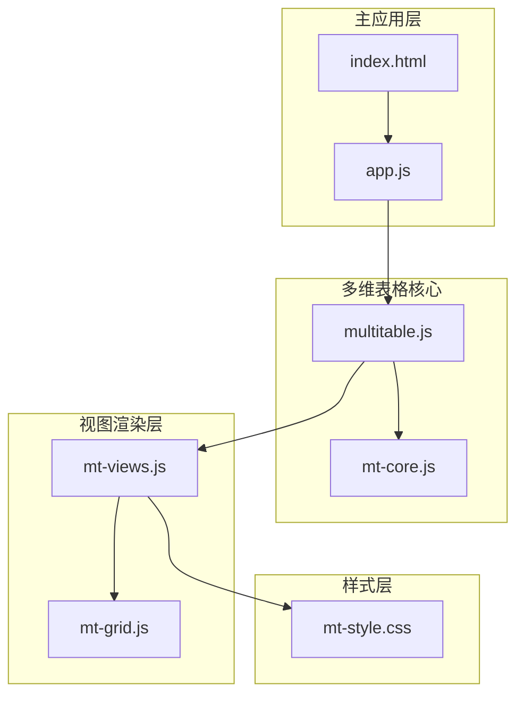

**图表来源**
- [index.html:1-382](file://index.html#L1-L382)
- [multitable.js:1-624](file://js/multitable.js#L1-L624)
- [mt-views.js:1-379](file://js/mt-views.js#L1-L379)

**章节来源**
- [index.html:1-382](file://index.html#L1-L382)
- [multitable.js:1-624](file://js/multitable.js#L1-L624)

## 核心组件

日历视图系统由多个相互协作的组件构成，每个组件都有明确的职责分工：

### 主要组件职责

| 组件 | 职责 | 关键功能 |
|------|------|----------|
| MT.Views | 视图渲染核心 | 日历视图渲染、事件处理、导航控制 |
| MT.Grid | 网格视图支持 | 与日历视图的数据交互 |
| MultiTable | 页面编排 | 事件委托、视图切换、数据刷新 |
| MT.Core | 数据管理层 | 工作区管理、CRUD操作、数据管道 |

### 核心数据结构

日历视图使用以下数据结构来组织和展示信息：

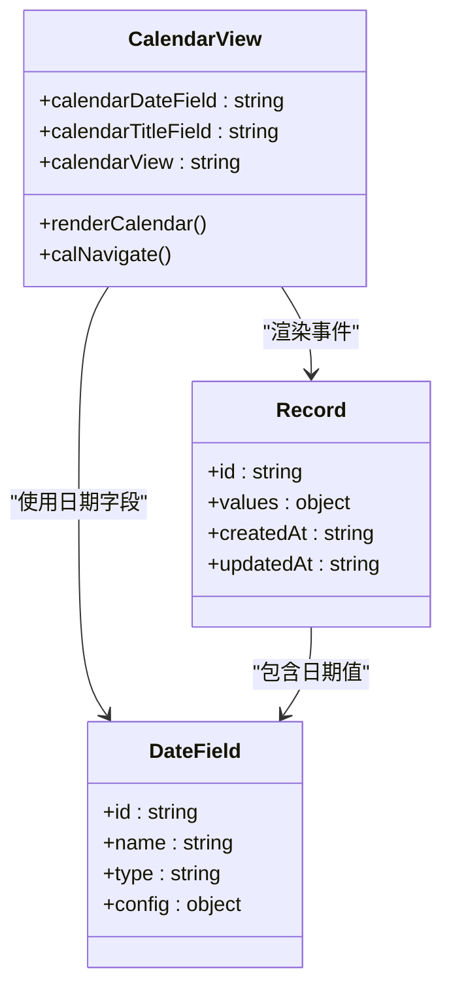

**图表来源**
- [mt-views.js:196-211](file://js/mt-views.js#L196-L211)
- [mt-core.js:352-359](file://js/mt-core.js#L352-L359)

**章节来源**
- [mt-views.js:196-211](file://js/mt-views.js#L196-L211)
- [mt-core.js:352-359](file://js/mt-core.js#L352-L359)

## 架构概览

日历视图采用分层架构设计，确保各层之间的职责清晰分离：

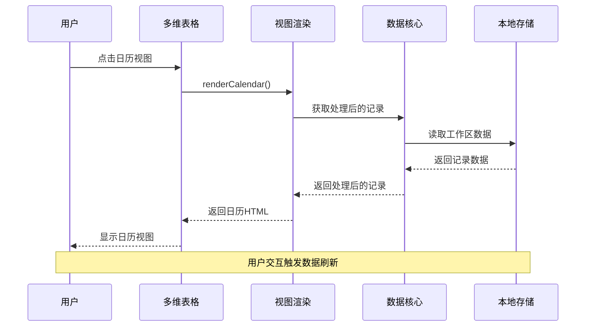

**图表来源**
- [multitable.js:140-162](file://js/multitable.js#L140-L162)
- [mt-views.js:196-211](file://js/mt-views.js#L196-L211)

## 详细组件分析

### 月份网格生成算法

日历视图的核心是月份网格生成算法，该算法负责创建完整的日历网格并正确显示当月的所有日期。

#### 起始偏移计算

算法通过计算当月第一天是星期几来确定网格的起始位置：

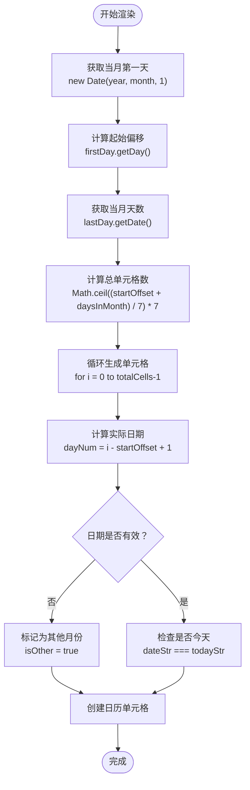

**图表来源**
- [mt-views.js:215-236](file://js/mt-views.js#L215-L236)

#### 天数填充逻辑

算法使用网格布局来填充所有日期单元格，确保日历网格始终有42个单元格（6行×7列）：

| 步骤 | 操作 | 说明 |
|------|------|------|
| 1 | 计算起始偏移 | 获取当月第一天是星期几（0=周日） |
| 2 | 计算总单元格数 | 使用公式 `Math.ceil((startOffset + daysInMonth) / 7) * 7` |
| 3 | 循环生成单元格 | 遍历从0到totalCells-1的所有位置 |
| 4 | 计算实际日期 | `dayNum = i - startOffset + 1` |
| 5 | 标记边界日期 | 小于1或大于当月天数的日期标记为其他月份 |
| 6 | 设置今日标识 | 匹配当前日期的单元格标记为今天 |

#### 周末标识实现

算法通过检查日期的星期数来自动识别周末日期：

```mermaid
graph LR
subgraph "星期计算"
Sun[周日<br/>getDay() === 0]
Mon[周一<br/>getDay() === 1]
Tue[周二<br/>getDay() === 2]
Wed[周三<br/>getDay() === 3]
Thu[周四<br/>getDay() === 4]
Fri[周五<br/>getDay() === 5]
Sat[周六<br/>getDay() === 6]
end
subgraph "样式应用"
WeekendClass[mt-cal-weekend<br/>周末样式]
WeekdayClass[mt-cal-weekday<br/>工作日样式]
end
Sun -.-> WeekendClass
Sat -.-> WeekendClass
Mon -.-> WeekdayClass
Tue -.-> WeekdayClass
Wed -.-> WeekdayClass
Thu -.-> WeekdayClass
Fri -.-> WeekdayClass
```

**图表来源**
- [mt-views.js:218](file://js/mt-views.js#L218)
- [mt-style.css:1348](file://css/mt-style.css#L1348)

**章节来源**
- [mt-views.js:215-236](file://js/mt-views.js#L215-L236)
- [mt-style.css:1348-1366](file://css/mt-style.css#L1348-L1366)

### 日期事件渲染机制

日历视图为每个日期单元格渲染相关的事件，实现事件标记和溢出处理功能。

#### 事件标记系统

算法按日期对记录进行分组，然后在对应的日期单元格中显示事件：

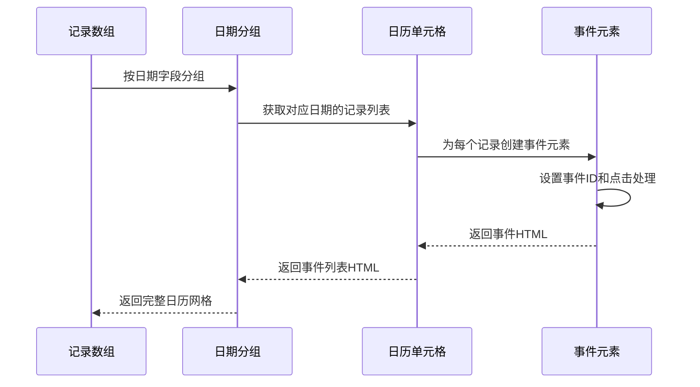

**图表来源**
- [mt-views.js:223-231](file://js/mt-views.js#L223-L231)
- [mt-views.js:247-251](file://js/mt-views.js#L247-L251)

#### 溢出处理机制

为了保持界面整洁，算法限制每个日期单元格显示的事件数量：

| 配置参数 | 默认值 | 说明 |
|----------|--------|------|
| maxShow | 3 | 每个日期最多显示的事件数量 |
| 溢出提示 | "+N更多" | 当事件超过限制时显示的提示文本 |

溢出处理的工作流程：

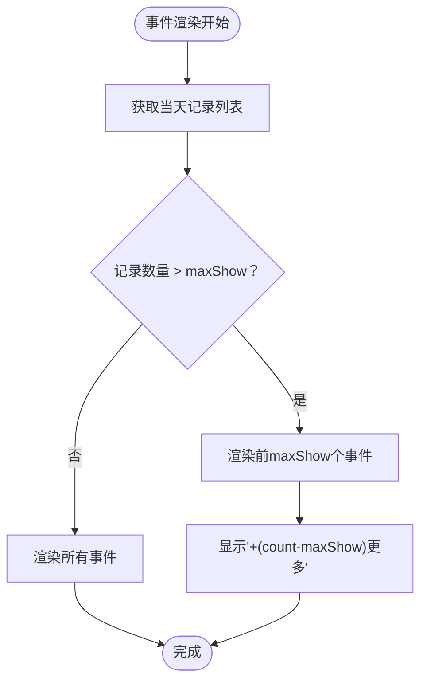

**图表来源**
- [mt-views.js:243](file://js/mt-views.js#L243)
- [mt-views.js:251](file://js/mt-views.js#L251)

#### 点击跳转功能

每个事件元素都绑定了点击事件处理器，支持跳转到记录详情：

| 事件类型 | 处理器 | 功能 |
|----------|--------|------|
| expand-record | 打开记录面板 | 显示记录详情对话框 |
| calendar-day-click | 日期点击处理 | 处理日期单元格点击事件 |

**章节来源**
- [mt-views.js:247-251](file://js/mt-views.js#L247-L251)
- [mt-views.js:245](file://js/mt-views.js#L245)

### 日历导航实现

日历视图提供了完整的导航控制系统，支持月份切换、今天定位等功能。

#### 导航控制机制

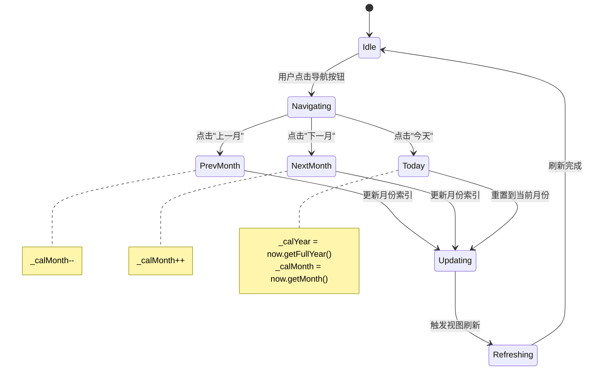

**图表来源**
- [mt-views.js:279-286](file://js/mt-views.js#L279-L286)
- [multitable.js:285-288](file://js/multitable.js#L285-L288)

#### 月份切换算法

导航算法使用简单的数学运算来切换月份：

| 操作 | 算法 | 边界处理 |
|------|------|----------|
| 上一月 | `_calMonth--` | 当_month < 0 时，`_calMonth = 11`，`_calYear--` |
| 下一月 | `_calMonth++` | 当_month > 11 时，`_calMonth = 0`，`_calYear++` |
| 今天 | 重置到当前日期 | `year = now.getFullYear()`，`month = now.getMonth()` |

#### 导航事件处理

导航事件通过事件委托机制统一处理：

```mermaid
graph TD
subgraph "事件处理流程"
Click[用户点击] --> Delegate[事件委托]
Delegate --> Switch[switch语句]
Switch --> Prev[case 'cal-prev']
Switch --> Next[case 'cal-next']
Switch --> Today[case 'cal-today']
Prev --> NavigatePrev[MT.Views.calNavigate(-1)]
Next --> NavigateNext[MT.Views.calNavigate(1)]
Today --> NavigateToday[MT.Views.calNavigate(0)]
NavigatePrev --> Refresh[this.refreshContent()]
NavigateNext --> Refresh
NavigateToday --> Refresh
end
```

**图表来源**
- [multitable.js:285-288](file://js/multitable.js#L285-L288)
- [mt-views.js:279-286](file://js/mt-views.js#L279-L286)

**章节来源**
- [mt-views.js:279-286](file://js/mt-views.js#L279-L286)
- [multitable.js:285-288](file://js/multitable.js#L285-L288)

### 配置选项详解

日历视图支持丰富的配置选项，允许用户自定义视图行为和外观。

#### 日期字段映射

| 配置项 | 类型 | 默认值 | 描述 |
|--------|------|--------|------|
| calendarDateField | string | 自动选择第一个日期字段 | 用于显示事件日期的字段ID |
| calendarTitleField | string | 主字段（标题字段） | 用于显示事件标题的字段ID |
| calendarView | string | 'month' | 视图类型（当前版本仅支持'month'） |

#### 视图模式配置

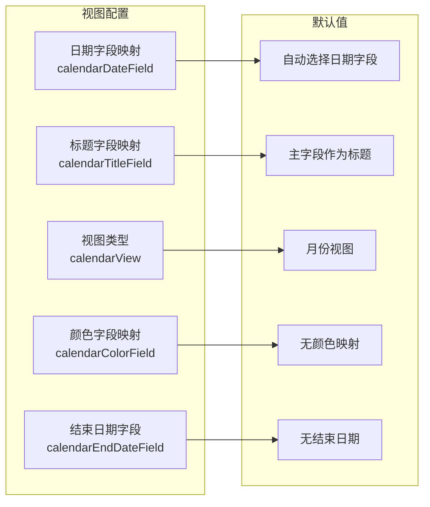

**图表来源**
- [mt-core.js:352-359](file://js/mt-core.js#L352-L359)
- [mt-views.js:197-202](file://js/mt-views.js#L197-L202)

#### 字段映射规则

1. **日期字段映射**：必须是日期类型的字段
2. **标题字段映射**：可以是任意可见字段，默认使用主字段
3. **结束日期字段**：可选配置，用于支持跨日期事件
4. **颜色字段映射**：可选配置，用于事件颜色标识

**章节来源**
- [mt-core.js:352-359](file://js/mt-core.js#L352-L359)
- [mt-views.js:197-202](file://js/mt-views.js#L197-L202)

## 依赖关系分析

日历视图与其他组件之间存在复杂的依赖关系，这些关系确保了系统的整体性和一致性。

### 组件依赖图

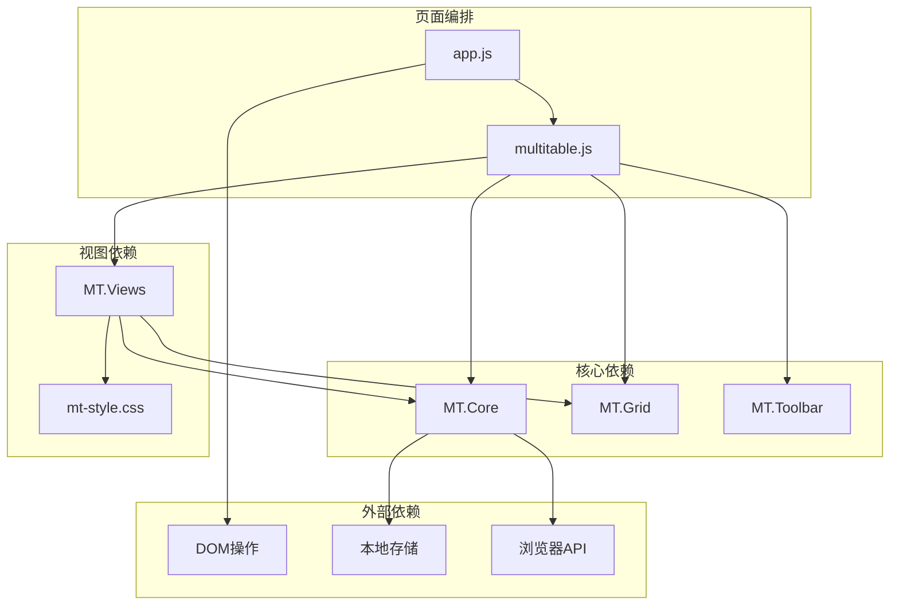

**图表来源**
- [multitable.js:12-29](file://js/multitable.js#L12-L29)
- [mt-views.js:5-6](file://js/mt-views.js#L5-L6)
- [mt-core.js:8-33](file://js/mt-core.js#L8-L33)

### 数据流依赖

日历视图的数据流遵循严格的层次结构：

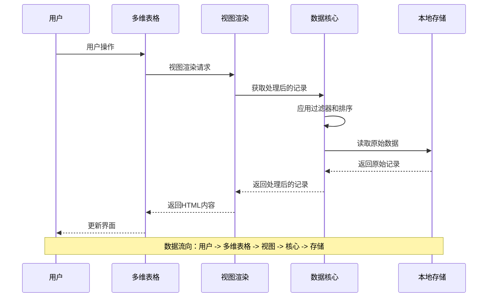

**图表来源**
- [mt-core.js:395-403](file://js/mt-core.js#L395-L403)
- [multitable.js:138-162](file://js/multitable.js#L138-L162)

**章节来源**
- [multitable.js:12-29](file://js/multitable.js#L12-L29)
- [mt-core.js:395-403](file://js/mt-core.js#L395-L403)

## 性能考虑

日历视图在设计时充分考虑了性能优化，采用了多种策略来确保良好的用户体验。

### 渲染性能优化

1. **虚拟滚动**：虽然当前版本使用完整DOM渲染，但网格布局天然支持滚动优化
2. **事件委托**：使用事件委托减少事件监听器数量
3. **延迟加载**：记录详情面板采用延迟加载机制

### 内存管理

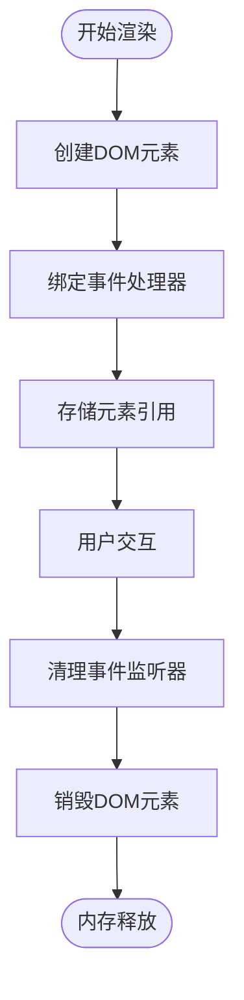

### 数据处理优化

| 优化策略 | 实现方式 | 性能收益 |
|----------|----------|----------|
| 日期索引 | 使用对象字典按日期分组 | O(n)分组复杂度 |
| 事件截断 | 限制每个日期显示的事件数量 | 减少DOM节点数量 |
| 样式缓存 | 复用CSS类名和样式 | 减少样式计算开销 |

## 故障排除指南

### 常见问题及解决方案

#### 问题1：日历视图无法显示数据

**症状**：日历显示为空白或只显示标题

**可能原因**：
1. 缺少日期字段配置
2. 数据格式不正确
3. 字段类型不匹配

**解决步骤**：
1. 检查视图配置中的 `calendarDateField` 是否正确设置
2. 验证日期字段的数据格式是否为标准日期格式
3. 确认记录中该字段的值不为空

#### 问题2：事件不显示或显示异常

**症状**：事件无法在日历中正确显示

**可能原因**：
1. 日期字段值格式错误
2. 事件数量超过显示限制
3. 样式冲突

**解决步骤**：
1. 检查日期字段值是否符合ISO 8601标准格式
2. 确认事件数量没有超过 `maxShow` 限制
3. 检查CSS样式是否被其他样式覆盖

#### 问题3：导航功能失效

**症状**：上一月/下一月按钮点击无效

**可能原因**：
1. 事件处理器未正确绑定
2. 状态变量未正确更新
3. 视图刷新机制故障

**解决步骤**：
1. 检查事件委托机制是否正常工作
2. 验证 `_calYear` 和 `_calMonth` 状态变量
3. 确认 `refreshContent()` 方法被正确调用

**章节来源**
- [mt-views.js:197-202](file://js/mt-views.js#L197-L202)
- [multitable.js:285-288](file://js/multitable.js#L285-L288)

## 结论

陈苗多维表格的日历视图是一个功能完整、设计合理的日期管理组件。它通过精心设计的算法实现了高效的月份网格生成，通过灵活的事件渲染机制提供了良好的用户体验，通过完善的导航系统确保了操作的便利性。

该系统的主要优势包括：

1. **算法效率**：月份网格生成算法简洁高效，时间复杂度为O(n)
2. **用户体验**：事件溢出处理和样式设计提升了界面友好性
3. **扩展性**：模块化设计便于功能扩展和维护
4. **性能优化**：多种优化策略确保了良好的运行性能

未来可以考虑的改进方向包括：
- 添加季度和年度视图支持
- 实现事件拖拽功能
- 增加更多自定义配置选项
- 优化大数据量场景下的性能表现