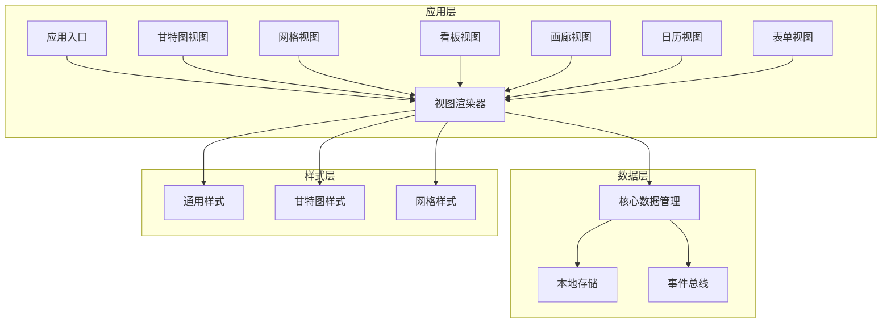
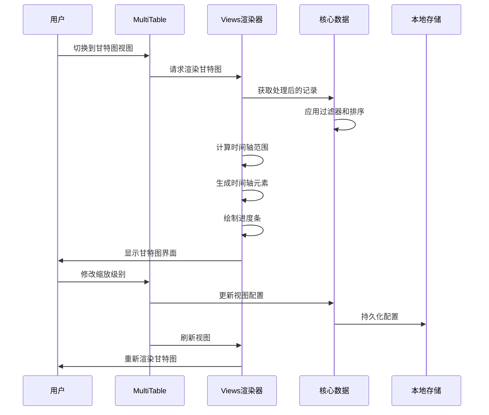
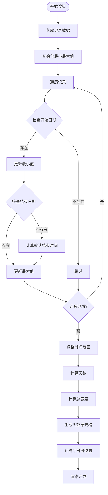
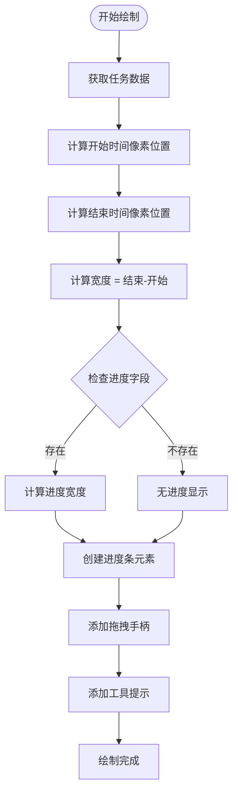
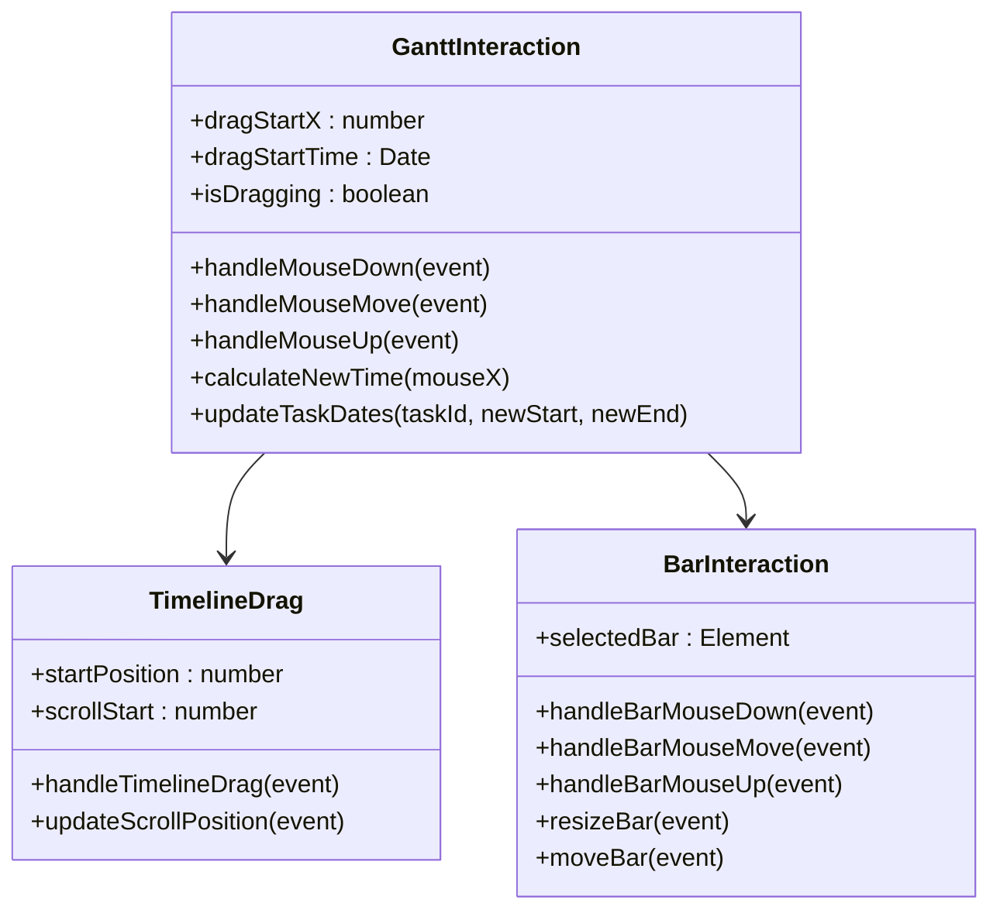
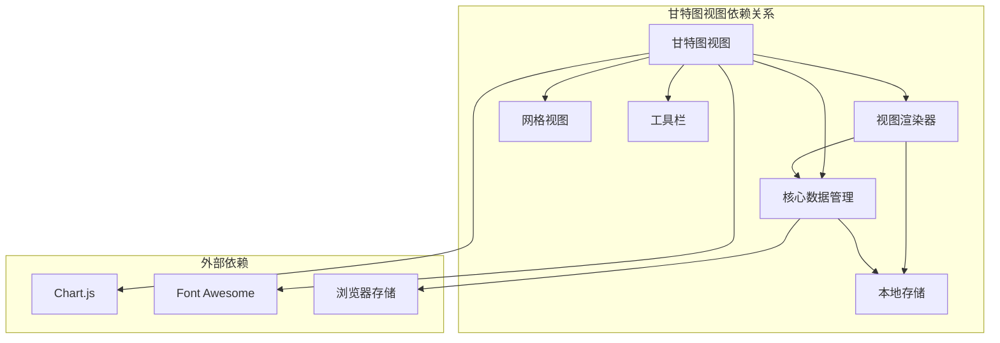

# 甘特图视图

<cite>
**本文档引用的文件**
- [index.html](file://index.html)
- [mt-views.js](file://js/mt-views.js)
- [multitable.js](file://js/multitable.js)
- [mt-grid.js](file://js/mt-grid.js)
- [mt-core.js](file://js/mt-core.js)
- [mt-style.css](file://css/mt-style.css)
</cite>

## 目录
1. [简介](#简介)
2. [项目结构](#项目结构)
3. [核心组件](#核心组件)
4. [架构概览](#架构概览)
5. [详细组件分析](#详细组件分析)
6. [依赖关系分析](#依赖关系分析)
7. [性能考虑](#性能考虑)
8. [故障排除指南](#故障排除指南)
9. [结论](#结论)

## 简介

甘特图视图是陈苗多维表格系统中的重要功能模块，用于可视化项目管理和任务调度的进度安排。该视图通过时间轴展示任务的开始和结束时间，支持多种时间粒度显示，提供直观的项目进度管理能力。

甘特图视图集成了以下核心功能：
- 时间轴计算和渲染机制
- 项目进度条绘制算法
- 交互式时间轴控制
- 配置选项管理
- 实际应用场景支持

## 项目结构

多维表格系统采用模块化架构设计，甘特图视图作为其中的一个重要组成部分，与其他视图类型共享统一的架构模式。

**图表来源**
- [index.html:370-379](file://index.html#L370-L379)
- [mt-views.js:1-379](file://js/mt-views.js#L1-L379)

**章节来源**
- [index.html:1-382](file://index.html#L1-L382)
- [mt-views.js:1-379](file://js/mt-views.js#L1-L379)

## 核心组件

甘特图视图由多个核心组件协同工作，形成完整的功能体系：

### 视图渲染组件
- **renderGantt**: 主要渲染函数，负责甘特图的整体布局和内容生成
- **时间轴计算**: 自动计算显示范围和时间粒度
- **进度条绘制**: 动态生成任务进度条元素

### 交互控制组件
- **缩放控制**: 支持日、周、月三种时间粒度切换
- **字段配置**: 开始日期、结束日期、进度字段的选择
- **实时更新**: 响应数据变化自动刷新视图

### 样式系统组件
- **时间轴样式**: 周末标识、今日线等视觉效果
- **进度条样式**: 进度填充、悬停效果、拖拽手柄
- **响应式设计**: 移动端适配和屏幕尺寸自适应

**章节来源**
- [mt-views.js:105-194](file://js/mt-views.js#L105-L194)
- [mt-style.css:1160-1296](file://css/mt-style.css#L1160-L1296)

## 架构概览

甘特图视图采用MVVM架构模式，通过事件驱动的方式实现数据与视图的分离。

**图表来源**
- [multitable.js:112-162](file://js/multitable.js#L112-L162)
- [mt-views.js:105-194](file://js/mt-views.js#L105-L194)

## 详细组件分析

### 时间轴计算机制

甘特图的时间轴计算是整个视图的核心功能，涉及时间范围确定、缩放级别控制和日期格式化等多个方面。

#### 时间范围确定算法

**图表来源**
- [mt-views.js:117-147](file://js/mt-views.js#L117-L147)

#### 缩放级别控制系统

甘特图支持三种缩放级别，每种级别对应不同的时间粒度和显示密度：

| 缩放级别 | 时间粒度 | 单元宽度 | 适用场景 |
|---------|---------|---------|---------|
| day | 天 | 40px | 精细任务管理，短期项目 |
| week | 周 | 20px | 中期项目规划，周计划 |
| month | 月 | 8px | 长期项目跟踪，季度规划 |

#### 日期格式化策略

时间轴的日期格式根据缩放级别动态调整：
- **日视图**: 显示月/日格式（如 1/15）
- **周视图**: 每周一显示月/日格式
- **月视图**: 每月第一天显示月份格式（如 1月）

**章节来源**
- [mt-views.js:117-147](file://js/mt-views.js#L117-L147)

### 项目进度条绘制算法

进度条的绘制涉及多个步骤，从数据计算到最终渲染的完整流程。

#### 进度条计算流程

**图表来源**
- [mt-views.js:153-169](file://js/mt-views.js#L153-L169)

#### 进度百分比显示机制

进度条的进度显示通过CSS宽度属性实现：
- 进度条背景：完整进度条
- 进度填充：半透明黑色覆盖层
- 百分比计算：进度字段值占100%的比例

#### 条形图样式定制

进度条的样式支持多种定制选项：
- **颜色主题**: 使用CSS变量支持主题切换
- **圆角设计**: 4px圆角边框
- **阴影效果**: 悬停时的阴影增强
- **文本显示**: 任务名称的省略号处理

**章节来源**
- [mt-views.js:153-169](file://js/mt-views.js#L153-L169)
- [mt-style.css:1232-1258](file://css/mt-style.css#L1232-L1258)

### 交互功能实现

甘特图提供了丰富的交互功能，支持用户对时间轴和进度条进行操作。

#### 时间轴拖拽功能

**图表来源**
- [multitable.js:339-348](file://js/multitable.js#L339-L348)
- [mt-views.js:153-169](file://js/mt-views.js#L153-L169)

#### 条形调整功能

甘特图支持两种主要的条形调整方式：
- **拖拽调整**: 通过拖拽进度条两端的手柄调整任务持续时间
- **直接移动**: 拖拽整个进度条移动任务的开始时间

#### 双击编辑功能

双击甘特图中的任务条可以打开记录详情面板，进行任务信息的编辑和管理。

**章节来源**
- [multitable.js:310-321](file://js/multitable.js#L310-L321)
- [mt-views.js:153-169](file://js/mt-views.js#L153-L169)

### 配置选项系统

甘特图提供了灵活的配置选项，支持不同场景下的个性化需求。

#### 时间粒度配置

| 配置项 | 默认值 | 可选值 | 描述 |
|-------|--------|--------|------|
| ganttScale | week | day, week, month | 时间显示粒度 |
| ganttStartField | 第一个日期字段 | 任意日期字段 | 任务开始时间字段 |
| ganttEndField | 第二个日期字段 | 任意日期字段 | 任务结束时间字段 |
| ganttProgressField | 无 | 任意进度字段 | 任务完成进度字段 |

#### 字段映射配置

甘特图支持灵活的字段映射：
- **开始日期字段**: 必需字段，决定任务的起始时间
- **结束日期字段**: 可选字段，决定任务的结束时间
- **进度字段**: 可选字段，显示任务完成百分比

#### 颜色主题配置

甘特图使用CSS变量系统支持主题定制：
- **主色调**: --mt-primary 变量控制
- **危险色**: --mt-danger 用于今日线
- **背景色**: --mt-bg-header 用于表头
- **边框色**: --mt-border 用于网格线

**章节来源**
- [mt-core.js:344-351](file://js/mt-core.js#L344-L351)
- [mt-views.js:105-194](file://js/mt-views.js#L105-L194)

## 依赖关系分析

甘特图视图与其他模块之间存在清晰的依赖关系，形成了完整的功能生态系统。

**图表来源**
- [index.html:354-379](file://index.html#L354-L379)
- [mt-views.js:1-379](file://js/mt-views.js#L1-L379)

### 核心依赖模块

#### 数据层依赖
- **MT.Core**: 提供数据访问、事件管理和持久化功能
- **MT.Grid**: 共享网格视图的编辑和交互功能
- **MT.Toolbar**: 使用工具栏的配置和操作功能

#### 样式层依赖
- **mt-style.css**: 提供甘特图专用的样式定义
- **style.css**: 提供基础的UI样式
- **响应式设计**: 支持移动端和桌面端的不同显示效果

#### 事件处理依赖
- **事件总线**: 通过MT.Core的事件系统实现模块间通信
- **DOM事件**: 直接处理用户交互事件
- **定时器**: 用于防抖和节流操作

**章节来源**
- [mt-views.js:1-379](file://js/mt-views.js#L1-L379)
- [multitable.js:1-624](file://js/multitable.js#L1-L624)

## 性能考虑

甘特图视图在设计时充分考虑了性能优化，特别是在处理大量数据时的表现。

### 时间复杂度分析

- **时间轴计算**: O(n)，其中n为记录数量
- **进度条渲染**: O(n)，每个记录对应一个进度条
- **事件处理**: O(1)，单次用户交互的处理时间
- **内存使用**: O(n)，存储记录和DOM元素

### 优化策略

#### 虚拟滚动
- 对于大量记录的情况，建议实现虚拟滚动以减少DOM节点数量
- 仅渲染可视区域内的进度条，提高滚动性能

#### 防抖处理
- 输入事件采用防抖机制，避免频繁的视图刷新
- 拖拽操作使用节流机制，确保流畅的用户体验

#### 懒加载
- 时间轴的日期单元格采用懒加载策略
- 仅在用户滚动到相应位置时才生成对应的DOM元素

#### 内存管理
- 及时清理事件监听器，防止内存泄漏
- 合理使用DOM元素复用，减少垃圾回收压力

## 故障排除指南

### 常见问题及解决方案

#### 甘特图不显示或显示异常

**问题症状**:
- 甘特图空白或只显示表头
- 进度条无法正常显示

**可能原因**:
- 缺少必需的日期字段配置
- 数据格式不正确
- 样式文件加载失败

**解决步骤**:
1. 检查视图配置中的开始日期字段是否设置
2. 验证记录数据中日期字段的格式
3. 确认CSS样式文件正确加载
4. 查看浏览器控制台是否有JavaScript错误

#### 时间轴显示不准确

**问题症状**:
- 时间轴范围超出预期
- 日期显示格式错误

**可能原因**:
- 日期字段值为空或格式不正确
- 时区设置问题
- 浏览器日期解析差异

**解决步骤**:
1. 检查日期字段的数据格式是否符合ISO标准
2. 验证用户的时区设置
3. 在不同浏览器中测试日期显示效果
4. 调整时间轴计算的边界值

#### 交互功能失效

**问题症状**:
- 无法拖拽调整进度条
- 缩放功能不响应
- 双击编辑无效

**可能原因**:
- 事件监听器未正确绑定
- DOM元素选择器错误
- JavaScript执行错误

**解决步骤**:
1. 检查事件绑定代码是否正确执行
2. 验证DOM元素的data属性是否正确设置
3. 使用浏览器开发者工具调试事件处理函数
4. 确认相关CSS样式没有阻止事件触发

**章节来源**
- [mt-views.js:113-115](file://js/mt-views.js#L113-L115)
- [multitable.js:290-291](file://js/multitable.js#L290-L291)

## 结论

甘特图视图作为陈苗多维表格系统的重要组成部分，展现了现代Web应用的优秀设计理念。通过模块化的架构设计、清晰的职责分离和完善的交互体验，为用户提供了一个强大而易用的项目管理工具。

### 技术优势

1. **架构清晰**: 采用MVVM模式，数据与视图分离，便于维护和扩展
2. **性能优化**: 合理的时间复杂度和内存使用，支持大数据量场景
3. **用户体验**: 丰富的交互功能和直观的操作界面
4. **样式系统**: 基于CSS变量的主题系统，支持个性化定制

### 应用场景

甘特图视图适用于以下典型场景：
- **项目管理**: 跟踪项目进度，管理任务分配
- **资源调度**: 安排人力资源和设备使用
- **生产计划**: 制定生产计划和交货时间
- **会议安排**: 管理会议日程和资源占用

### 发展方向

未来可以考虑的功能增强：
- **实时协作**: 支持多用户同时编辑和查看
- **高级筛选**: 更复杂的筛选和排序功能
- **集成扩展**: 与其他系统的深度集成
- **移动端优化**: 更好的移动端用户体验

通过持续的优化和功能扩展，甘特图视图将继续为用户提供优秀的项目管理体验。