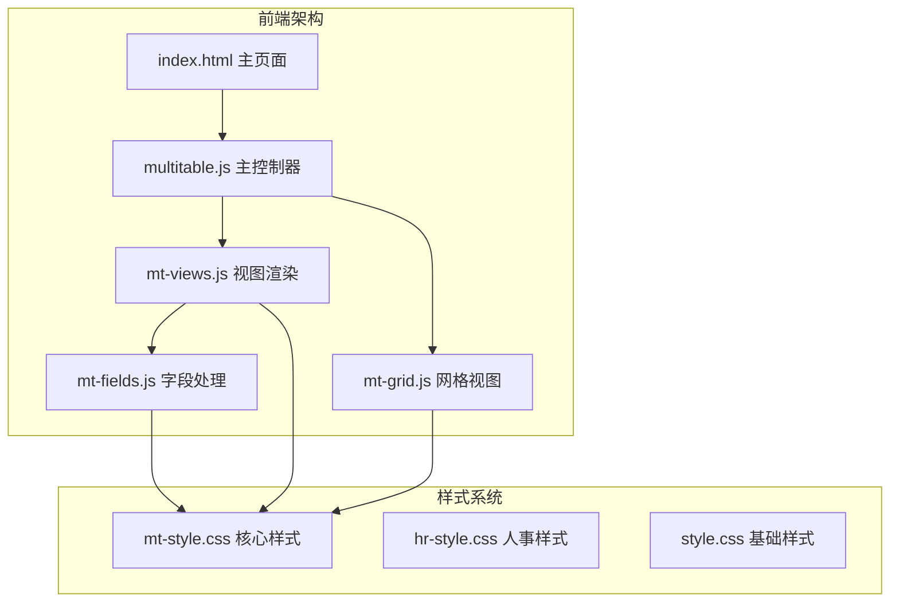
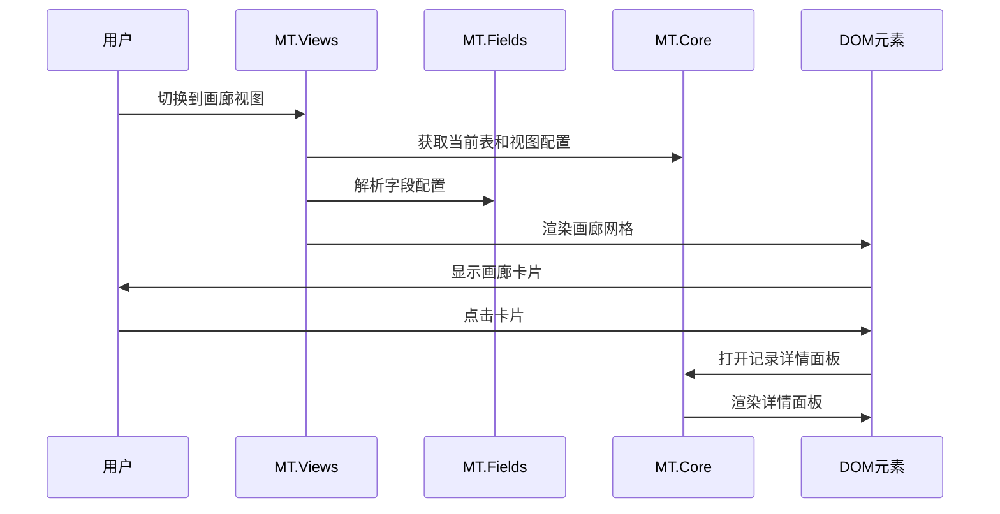
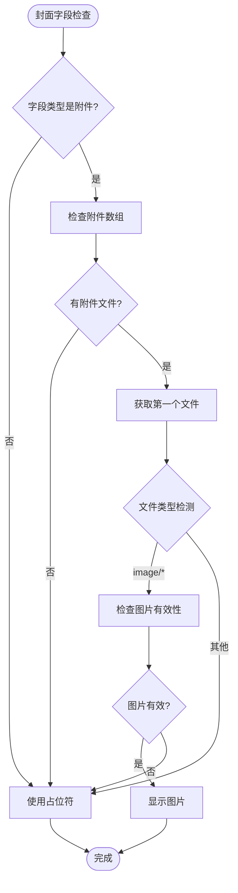
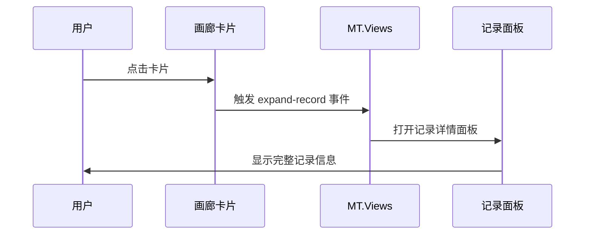
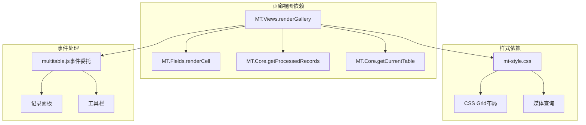

# 画廊视图

<cite>
**本文档引用的文件**
- [index.html](file://index.html)
- [mt-views.js](file://js/mt-views.js)
- [mt-grid.js](file://js/mt-grid.js)
- [mt-fields.js](file://js/mt-fields.js)
- [mt-style.css](file://css/mt-style.css)
- [multitable.js](file://js/multitable.js)
</cite>

## 目录
1. [简介](#简介)
2. [项目结构](#项目结构)
3. [核心组件](#核心组件)
4. [架构概览](#架构概览)
5. [详细组件分析](#详细组件分析)
6. [依赖关系分析](#依赖关系分析)
7. [性能考虑](#性能考虑)
8. [故障排除指南](#故障排除指南)
9. [结论](#结论)

## 简介

画廊视图是陈苗多维表格系统中的一个重要视图模式，它提供了类似相册或画廊的网格布局方式来展示数据记录。该视图采用响应式网格布局，支持动态列数配置，能够优雅地展示带有封面图片的数据项。

画廊视图的核心特性包括：
- **网格布局算法**：基于CSS Grid的响应式网格系统
- **动态列数配置**：支持2-5列的灵活配置
- **封面图片处理**：智能识别和展示附件字段中的图片
- **交互式卡片**：支持点击展开详情和全屏预览
- **响应式设计**：适配不同屏幕尺寸的设备

## 项目结构

多维表格系统采用模块化架构，画廊视图作为视图渲染模块的一部分，与其他核心模块协同工作：

**图表来源**
- [index.html:1-382](file://index.html#L1-L382)
- [mt-views.js:1-379](file://js/mt-views.js#L1-L379)
- [mt-grid.js:1-358](file://js/mt-grid.js#L1-L358)
- [mt-fields.js:1-632](file://js/mt-fields.js#L1-L632)

**章节来源**
- [index.html:370-378](file://index.html#L370-L378)
- [mt-views.js:67-103](file://js/mt-views.js#L67-L103)

## 核心组件

### 视图渲染引擎

画廊视图的渲染逻辑集中在 `MT.Views.renderGallery` 函数中，该函数负责：

1. **配置解析**：从视图配置中读取列数设置
2. **封面字段识别**：自动识别附件类型的封面字段
3. **卡片生成**：为每个记录生成画廊卡片
4. **字段映射**：配置要显示的字段集合

### 样式系统

画廊视图的样式通过CSS Grid实现，支持响应式布局：

- **基础网格**：默认4列布局
- **动态列数**：支持2、3、4、5列配置
- **响应式断点**：在小屏幕上自动调整列数

**章节来源**
- [mt-views.js:67-103](file://js/mt-views.js#L67-L103)
- [mt-style.css:1089-1159](file://css/mt-style.css#L1089-L1159)

## 架构概览

画廊视图在整个系统中的位置和交互关系：

**图表来源**
- [mt-views.js:147-149](file://js/mt-views.js#L147-L149)
- [multitable.js:140-161](file://js/multitable.js#L140-L161)

## 详细组件分析

### 布局算法实现

画廊视图采用CSS Grid布局系统，实现了高效的网格排列算法：

#### 网格配置系统

**图表来源**
- [mt-views.js:68-102](file://js/mt-views.js#L68-L102)

#### 响应式网格系统

画廊视图的响应式设计通过CSS媒体查询实现：

| 屏幕宽度 | 列数配置 | 适用场景 |
|---------|---------|----------|
| ≥768px | 4列 | 桌面端大屏幕 |
| 768px以下 | 2列 | 平板设备 |
| 480px以下 | 1列 | 移动设备 |

**章节来源**
- [mt-style.css:1089-1159](file://css/mt-style.css#L1089-L1159)
- [mt-style.css:2155-2169](file://css/mt-style.css#L2155-L2169)

### 封面图片处理机制

画廊视图的封面图片处理是一个复杂的子系统，负责从附件字段中提取和展示图片：

#### 图片识别和验证

**图表来源**
- [mt-views.js:84-90](file://js/mt-views.js#L84-L90)

#### 文件类型检测系统

画廊视图支持多种图片格式的自动检测：

| 文件类型 | MIME类型 | 支持情况 |
|---------|---------|----------|
| JPEG | image/jpeg | ✅ 支持 |
| PNG | image/png | ✅ 支持 |
| GIF | image/gif | ✅ 支持 |
| WebP | image/webp | ✅ 支持 |
| SVG | image/svg+xml | ⚠️ 部分支持 |

**章节来源**
- [mt-views.js:87-89](file://js/mt-views.js#L87-L89)

### 交互功能实现

画廊视图提供了丰富的交互功能，主要通过事件委托机制实现：

#### 卡片点击展开

**图表来源**
- [mt-views.js:91](file://js/mt-views.js#L91)
- [multitable.js:267](file://js/multitable.js#L267)

#### 全屏预览功能

虽然画廊视图本身不直接实现全屏预览，但通过记录面板可以实现类似效果：

- **详情面板**：提供完整的记录查看界面
- **模态显示**：使用CSS动画实现平滑的展开效果
- **响应式布局**：在移动设备上自动适配

**章节来源**
- [mt-style.css:159-177](file://css/mt-style.css#L159-L177)
- [multitable.js:408-458](file://js/multitable.js#L408-L458)

### 自定义选项配置

画廊视图支持多种自定义配置选项：

#### 列数配置系统

| 配置项 | 默认值 | 可选值 | 描述 |
|-------|--------|--------|------|
| galleryColumns | 4 | 2, 3, 4, 5 | 设置画廊的列数 |
| galleryCoverField | null | 任意附件字段 | 指定封面图片字段 |
| galleryCardFields | 自动生成 | 任意可见字段 | 配置卡片显示字段 |

#### 字段显示配置

画廊视图会自动选择合适的字段进行显示：

1. **主字段**：优先显示主字段作为标题
2. **可见字段**：自动选择可见字段
3. **数量限制**：最多显示4个字段

**章节来源**
- [mt-views.js:69-74](file://js/mt-views.js#L69-L74)
- [mt-views.js:76-81](file://js/mt-views.js#L76-L81)

## 依赖关系分析

画廊视图与其他模块的依赖关系：

**图表来源**
- [mt-views.js:67-103](file://js/mt-views.js#L67-L103)
- [mt-style.css:1089-1159](file://css/mt-style.css#L1089-L1159)
- [multitable.js:177-308](file://js/multitable.js#L177-L308)

**章节来源**
- [mt-views.js:147-149](file://js/mt-views.js#L147-L149)
- [multitable.js:140-161](file://js/multitable.js#L140-L161)

## 性能考虑

### 渲染优化

画廊视图在性能方面采用了多项优化措施：

1. **虚拟滚动**：对于大量记录的情况，建议实现虚拟滚动
2. **懒加载**：图片资源采用懒加载策略
3. **缓存机制**：字段渲染结果进行缓存
4. **事件委托**：减少事件监听器的数量

### 内存管理

- **DOM复用**：通过事件委托避免重复创建DOM元素
- **垃圾回收**：及时清理不再使用的事件监听器
- **内存泄漏防护**：确保在组件销毁时清理所有资源

## 故障排除指南

### 常见问题及解决方案

#### 画廊布局异常

**问题描述**：画廊卡片布局错乱或显示不正常

**可能原因**：
1. CSS Grid兼容性问题
2. 样式冲突
3. 屏幕尺寸变化导致的布局问题

**解决步骤**：
1. 检查浏览器对CSS Grid的支持
2. 确认没有其他样式覆盖画廊样式
3. 验证响应式断点设置

#### 图片显示问题

**问题描述**：封面图片无法正确显示

**可能原因**：
1. 附件字段类型不正确
2. 文件格式不受支持
3. 图片URL无效

**解决步骤**：
1. 确认封面字段类型为附件
2. 检查文件格式是否在支持列表中
3. 验证图片URL的有效性

#### 性能问题

**问题描述**：大量记录时画廊视图响应缓慢

**解决步骤**：
1. 实现虚拟滚动
2. 优化图片加载
3. 减少DOM节点数量

**章节来源**
- [mt-views.js:84-90](file://js/mt-views.js#L84-L90)
- [mt-style.css:2155-2169](file://css/mt-style.css#L2155-L2169)

## 结论

画廊视图作为多维表格系统的重要组成部分，展现了现代Web应用的优秀设计理念。其基于CSS Grid的响应式布局、智能的封面图片处理机制以及丰富的交互功能，为用户提供了直观、高效的数据显示体验。

该系统的成功之处在于：

1. **模块化设计**：清晰的职责分离和依赖关系
2. **响应式架构**：适应不同设备和屏幕尺寸
3. **性能优化**：合理的渲染策略和资源管理
4. **扩展性**：灵活的配置选项和自定义能力

未来可以进一步改进的方向包括：
- 实现虚拟滚动以支持大量数据
- 增加图片懒加载功能
- 提供更多的自定义样式选项
- 优化移动端交互体验

通过持续的优化和改进，画廊视图将继续为用户提供优秀的数据可视化体验。