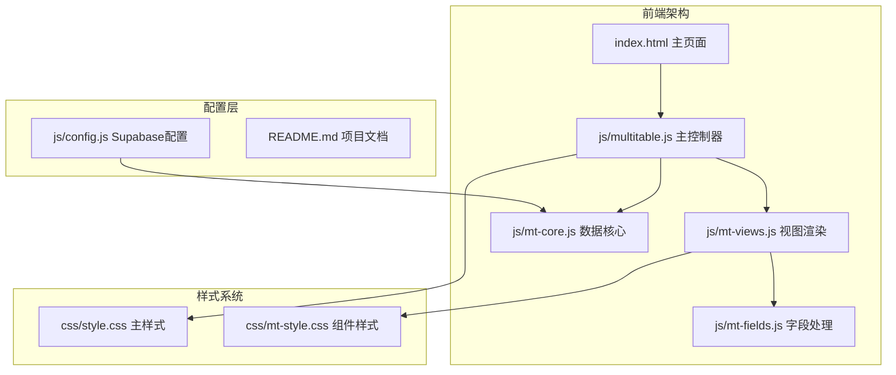
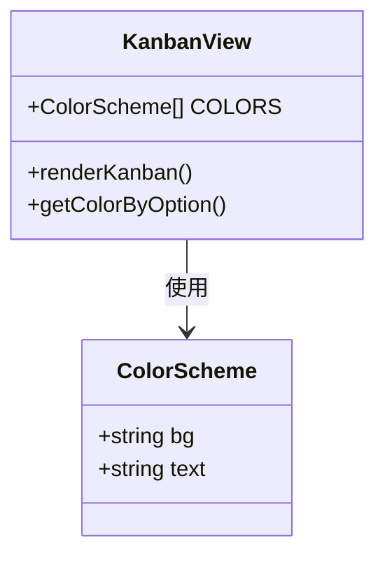
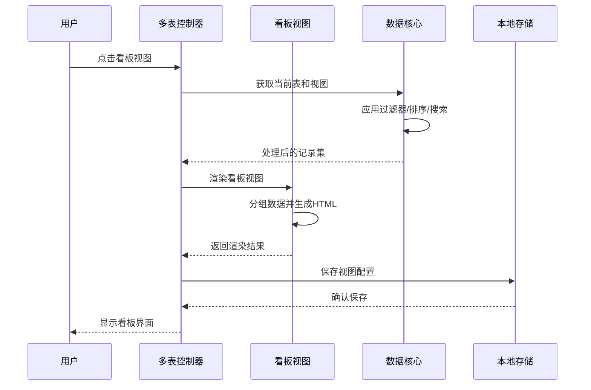
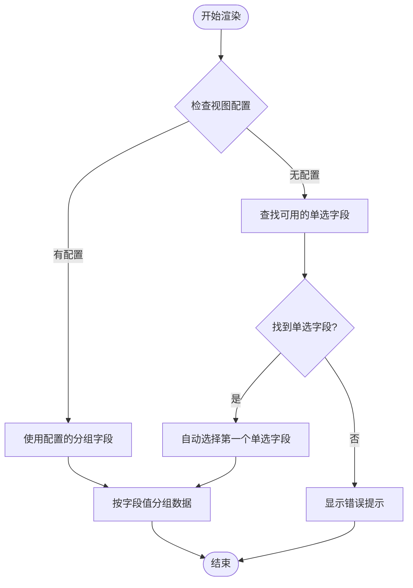
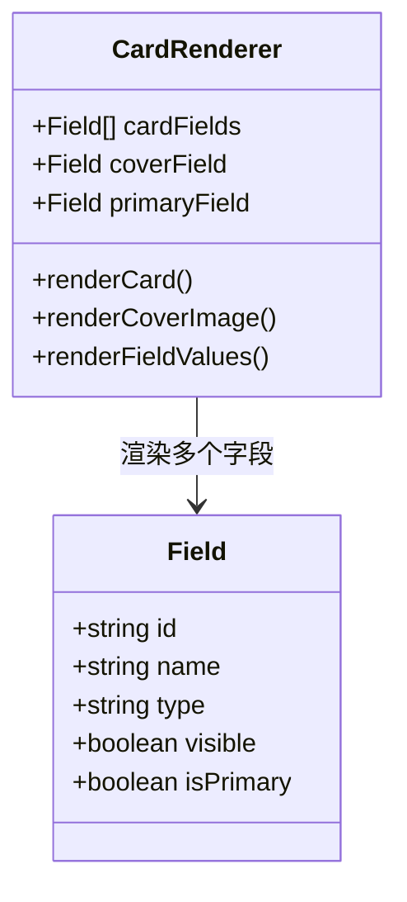
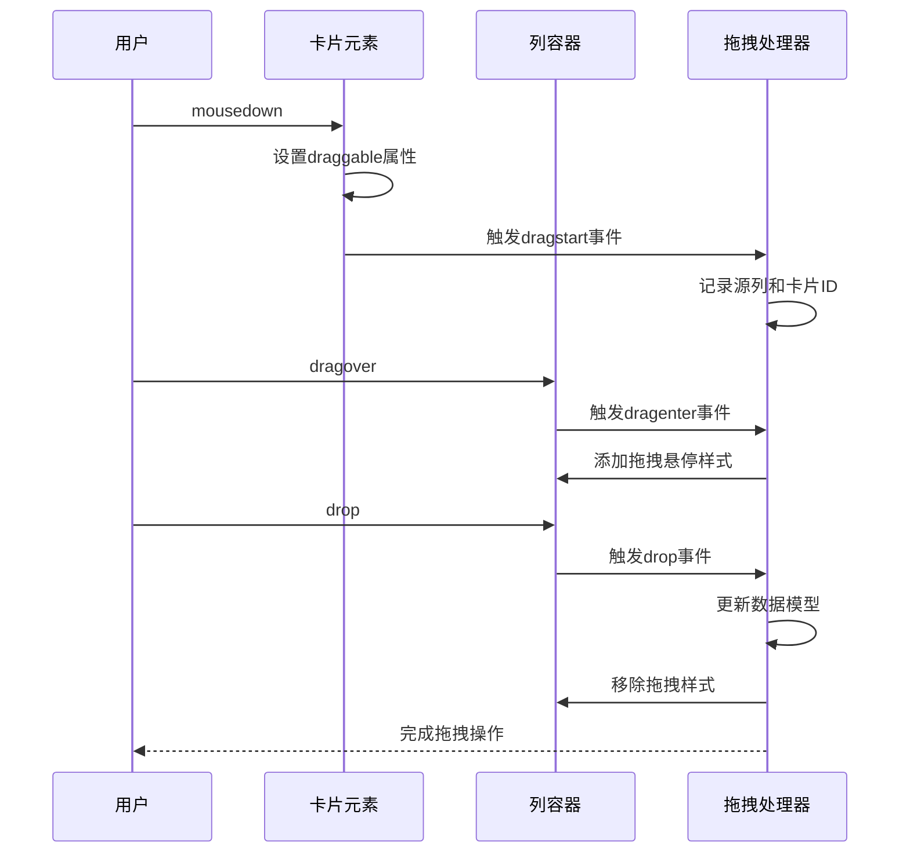
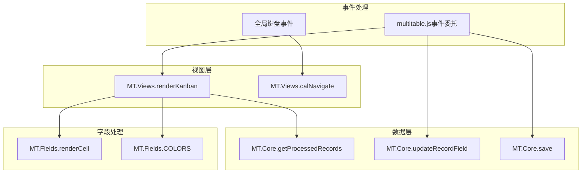

# 看板视图

<cite>
**本文档引用的文件**
- [mt-views.js](file://js/mt-views.js)
- [multitable.js](file://js/multitable.js)
- [mt-fields.js](file://js/mt-fields.js)
- [mt-core.js](file://js/mt-core.js)
- [style.css](file://css/style.css)
- [mt-style.css](file://css/mt-style.css)
- [config.js](file://js/config.js)
- [README.md](file://README.md)
</cite>

## 目录
1. [简介](#简介)
2. [项目结构](#项目结构)
3. [核心组件](#核心组件)
4. [架构概览](#架构概览)
5. [详细组件分析](#详细组件分析)
6. [依赖关系分析](#依赖关系分析)
7. [性能考虑](#性能考虑)
8. [故障排除指南](#故障排除指南)
9. [结论](#结论)
10. [附录](#附录)

## 简介

看板视图是陈苗多维表格系统中的核心功能模块之一，基于HTML5的拖拽API实现了直观的任务管理和项目跟踪界面。该视图将数据以卡片形式按指定字段进行分组展示，支持实时拖拽移动、动态颜色主题和灵活的配置选项。

看板视图的设计理念围绕"可视化工作流管理"展开，通过颜色编码的状态分组、可拖拽的卡片交互和响应式的布局设计，为用户提供高效的任务管理和团队协作体验。

## 项目结构

多维表格项目采用模块化架构设计，看板视图作为视图渲染层的重要组成部分，与其他核心模块协同工作：

**图表来源**
- [mt-views.js:1-379](file://js/mt-views.js#L1-L379)
- [multitable.js:1-624](file://js/multitable.js#L1-L624)
- [mt-core.js:1-859](file://js/mt-core.js#L1-L859)

**章节来源**
- [README.md:48-65](file://README.md#L48-L65)
- [mt-views.js:1-379](file://js/mt-views.js#L1-L379)

## 核心组件

### 看板视图渲染器

看板视图的核心渲染器位于`MT.Views.renderKanban`函数中，负责将原始数据转换为可视化的看板界面。该组件具备以下关键特性：

- **智能分组**：根据单选字段的选项值自动创建列
- **动态颜色**：每个分组使用预定义的颜色方案进行视觉区分
- **卡片渲染**：支持封面图片、主标题和多个字段值的展示
- **交互支持**：内置添加卡片和记录详情的功能

### 字段颜色系统

系统内置了9种预定义的颜色方案，每种颜色包含背景色和文字色的完整配置：

**图表来源**
- [mt-fields.js:32-42](file://js/mt-fields.js#L32-L42)
- [mt-views.js:38-45](file://js/mt-views.js#L38-L45)

### 数据处理管道

看板视图通过MT.Core的数据处理管道获取经过过滤、排序和搜索的数据集，确保渲染的准确性：

- **过滤器应用**：支持多种比较操作符
- **排序功能**：支持升序和降序排列
- **搜索功能**：全文本搜索支持
- **分组功能**：可选的分组显示

**章节来源**
- [mt-views.js:7-65](file://js/mt-views.js#L7-L65)
- [mt-core.js:394-474](file://js/mt-core.js#L394-L474)

## 架构概览

看板视图的架构采用分层设计，各层职责明确且松耦合：

**图表来源**
- [multitable.js:140-161](file://js/multitable.js#L140-L161)
- [mt-views.js:7-65](file://js/mt-views.js#L7-L65)
- [mt-core.js:394-403](file://js/mt-core.js#L394-L403)

## 详细组件分析

### 分组字段配置

看板视图的核心在于分组字段的选择和配置。系统自动检测可用的单选字段，并提供以下功能：

#### 自动字段检测
当没有配置分组字段时，系统会自动选择第一个单选字段作为默认分组依据：

**图表来源**
- [mt-views.js:8-16](file://js/mt-views.js#L8-L16)

#### 颜色主题映射

每个分组选项都对应一个预定义的颜色方案，确保视觉一致性：

| 颜色索引 | 背景色 | 文字色 | 用途 |
|---------|--------|--------|------|
| 0 | #dbeafe | #1e40af | 蓝色主题 |
| 1 | #d1fae5 | #065f46 | 绿色主题 |
| 2 | #fef3c7 | #92400e | 橙色主题 |
| 3 | #fed7aa | #9a3412 | 红色主题 |
| 4 | #fee2e2 | #991b1b | 粉色主题 |
| 5 | #e9d5ff | #6b21a8 | 紫色主题 |
| 6 | #fce7f3 | #9d174d | 玫红主题 |
| 7 | #ccfbf1 | #115e59 | 青色主题 |
| 8 | #f3f4f6 | #374151 | 灰色主题 |

**章节来源**
- [mt-views.js:38-45](file://js/mt-views.js#L38-L45)
- [mt-fields.js:32-42](file://js/mt-fields.js#L32-L42)

### 卡片渲染机制

看板卡片是视图的核心元素，采用灵活的渲染机制支持多种内容类型：

#### 卡片字段配置
系统支持自定义卡片显示的字段集合，默认情况下选择前3个非主字段：

**图表来源**
- [mt-views.js:27-30](file://js/mt-views.js#L27-L30)
- [mt-fields.js:57-157](file://js/mt-fields.js#L57-L157)

#### 封面图片显示
支持附件字段作为卡片封面，提供视觉增强效果：

- **图片识别**：自动检测附件字段中的图片文件
- **缩略图生成**：使用dataUrl创建缩略图
- **响应式布局**：固定高度适应不同屏幕尺寸

**章节来源**
- [mt-views.js:48-50](file://js/mt-views.js#L48-L50)
- [mt-fields.js:140-149](file://js/mt-fields.js#L140-L149)

### 列布局和响应式设计

看板视图采用Flexbox布局系统，支持响应式设计和灵活的列配置：

#### 固定列宽和滚动
- **最小宽度**：260px确保内容可读性
- **最大宽度**：300px限制单列宽度
- **水平滚动**：容器溢出时启用横向滚动

#### 颜色主题系统
- **列头样式**：包含标签和计数器
- **拖拽反馈**：拖拽悬停时的视觉反馈
- **悬停效果**：增强用户体验的过渡动画

**章节来源**
- [style.css:2352-2368](file://css/style.css#L2352-L2368)
- [mt-style.css:1005-1087](file://css/mt-style.css#L1005-L1087)

### 拖拽功能实现

看板视图实现了完整的拖拽功能，支持卡片在列间移动和列内排序：

#### HTML5拖拽API集成

**图表来源**
- [mt-views.js:51](file://js/mt-views.js#L51)

#### 拖拽事件处理流程
系统通过事件委托机制处理所有拖拽相关的DOM事件：

1. **dragstart**：记录源列信息和卡片标识
2. **dragenter**：为目标列添加视觉反馈
3. **dragover**：允许放置操作
4. **drop**：执行数据移动并更新UI
5. **dragleave**：清理拖拽状态

**章节来源**
- [mt-views.js:51](file://js/mt-views.js#L51)

### 配置选项详解

看板视图提供了丰富的配置选项，满足不同使用场景的需求：

#### 卡片字段选择
- **默认行为**：自动选择前3个可见字段
- **自定义配置**：支持手动选择特定字段
- **字段类型限制**：排除长文本字段以保证可读性

#### 封面图片配置
- **字段类型**：仅支持附件字段
- **图片格式**：自动识别和显示图片文件
- **显示条件**：只有存在有效附件时才显示

#### 列宽调整
- **固定范围**：260px-300px的列宽范围
- **响应式适配**：根据屏幕尺寸自动调整
- **滚动支持**：超出屏幕宽度时启用滚动

**章节来源**
- [mt-views.js:27-30](file://js/mt-views.js#L27-L30)
- [mt-views.js:32-36](file://js/mt-views.js#L32-L36)

## 依赖关系分析

看板视图的实现涉及多个模块间的协作关系：

**图表来源**
- [mt-views.js:7-65](file://js/mt-views.js#L7-L65)
- [mt-core.js:394-403](file://js/mt-core.js#L394-L403)
- [multitable.js:177-308](file://js/multitable.js#L177-L308)

### 模块耦合度分析

看板视图与各模块的耦合程度适中，通过清晰的接口实现松耦合：

- **与MT.Core的耦合**：主要通过数据访问和事件触发
- **与MT.Fields的耦合**：字段渲染和颜色处理
- **与multitable.js的耦合**：事件处理和UI更新

这种设计确保了系统的可维护性和扩展性。

**章节来源**
- [mt-views.js:1-379](file://js/mt-views.js#L1-L379)
- [multitable.js:1-624](file://js/multitable.js#L1-L624)

## 性能考虑

看板视图在设计时充分考虑了性能优化：

### 渲染优化
- **虚拟滚动**：大量数据时采用虚拟滚动技术
- **懒加载**：卡片内容按需渲染
- **缓存机制**：字段渲染结果缓存

### 内存管理
- **事件清理**：组件销毁时清理所有事件监听器
- **DOM复用**：避免不必要的DOM重建
- **垃圾回收**：及时释放不再使用的对象引用

### 网络优化
- **增量更新**：只更新变化的数据部分
- **批量操作**：支持批量数据更新
- **离线缓存**：本地存储支持离线使用

## 故障排除指南

### 常见问题及解决方案

#### 看板视图无法显示
**症状**：页面显示空白或错误信息
**可能原因**：
- 缺少单选字段
- 数据格式不正确
- 浏览器兼容性问题

**解决步骤**：
1. 检查是否存在单选字段
2. 验证数据结构完整性
3. 确认浏览器支持HTML5拖拽API

#### 拖拽功能失效
**症状**：卡片无法拖拽移动
**可能原因**：
- JavaScript错误阻止了事件处理
- CSS样式冲突
- 浏览器安全设置

**解决步骤**：
1. 打开浏览器开发者工具查看错误
2. 检查CSS样式是否正确加载
3. 确认浏览器允许拖拽操作

#### 颜色主题显示异常
**症状**：分组颜色显示不正确
**可能原因**：
- 字段配置错误
- 颜色索引越界
- 样式文件加载失败

**解决步骤**：
1. 检查字段选项配置
2. 验证颜色索引范围
3. 重新加载样式文件

**章节来源**
- [mt-views.js:10-16](file://js/mt-views.js#L10-L16)
- [mt-fields.js:32-42](file://js/mt-fields.js#L32-L42)

## 结论

陈苗多维表格的看板视图为用户提供了强大而直观的工作流管理工具。通过精心设计的架构和丰富的功能特性，系统能够满足从个人任务管理到团队协作的各种需求。

看板视图的核心优势在于其简洁而强大的设计理念：通过最少的配置实现最大的灵活性，通过直观的交互提供最佳的用户体验。无论是项目管理、任务跟踪还是销售漏斗管理，看板视图都能提供有效的解决方案。

随着系统的持续发展，看板视图将继续优化性能、增强功能，并扩展更多的集成能力，为用户提供更加完善的多维表格管理体验。

## 附录

### 使用场景和最佳实践

#### 项目管理场景
- **状态分组**：使用"进行中"、"已完成"等状态字段
- **优先级显示**：结合优先级字段提供视觉层次
- **负责人追踪**：显示任务分配情况

#### 任务跟踪场景
- **截止日期**：结合日期字段设置提醒
- **进度监控**：使用进度字段跟踪完成度
- **标签分类**：通过标签字段进行多维度分类

#### 销售漏斗场景
- **阶段划分**：潜在客户、意向客户、成交客户
- **价值评估**：结合金额字段进行价值分析
- **时间跟踪**：记录各阶段的持续时间

### 配置示例

#### 基础看板配置
1. 创建单选字段"状态"，包含选项：未开始、进行中、已完成
2. 在看板视图中选择"状态"作为分组字段
3. 配置卡片显示字段：标题、负责人、截止日期

#### 高级看板配置
1. 添加进度字段用于可视化跟踪
2. 配置封面图片字段显示相关文件
3. 设置颜色主题增强视觉效果