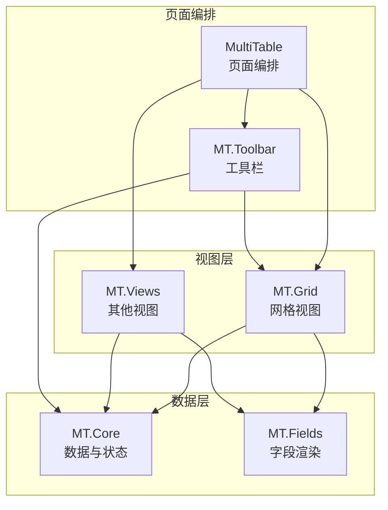
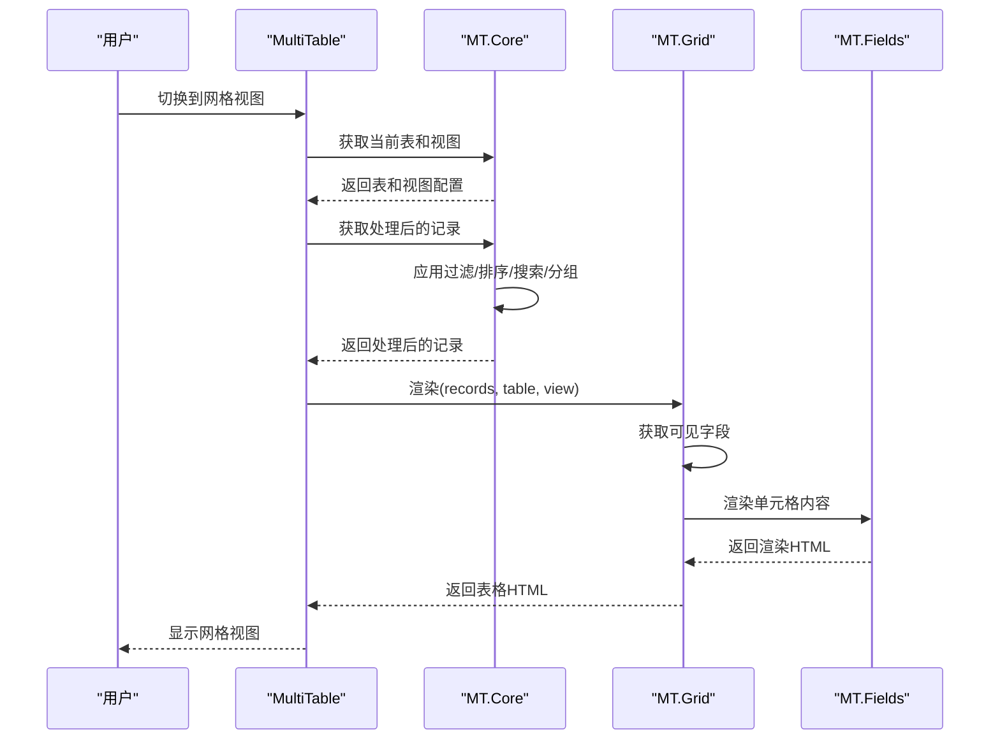
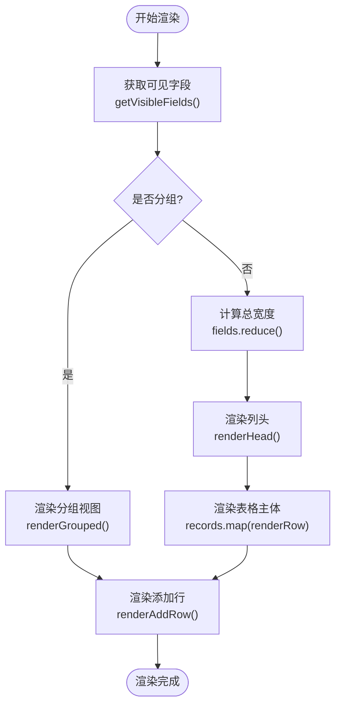
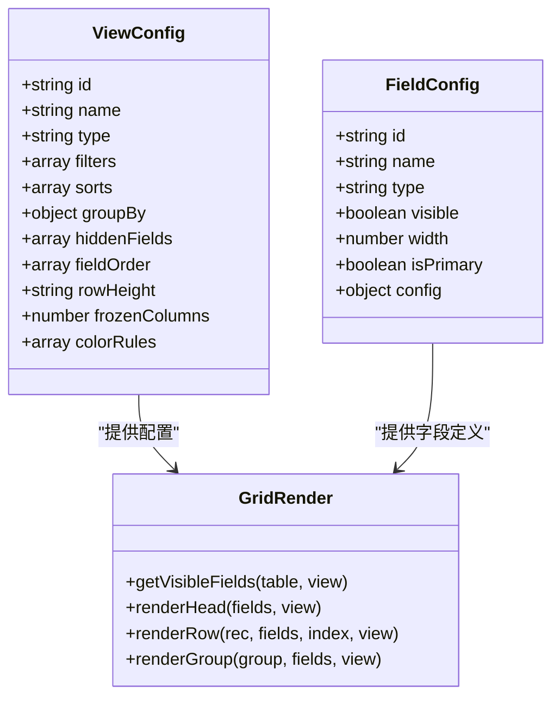
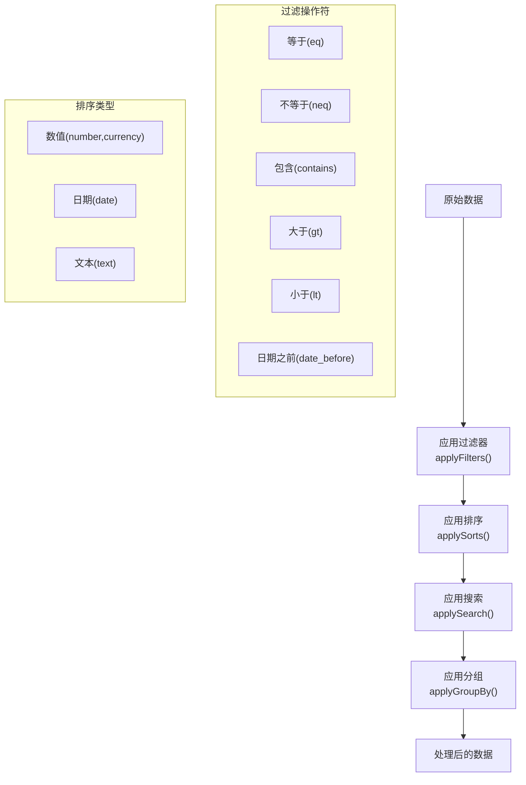
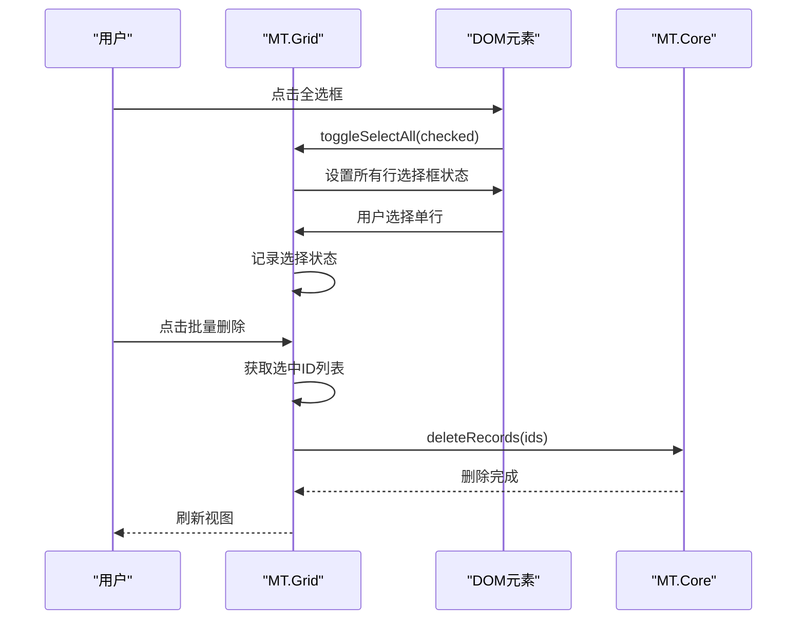
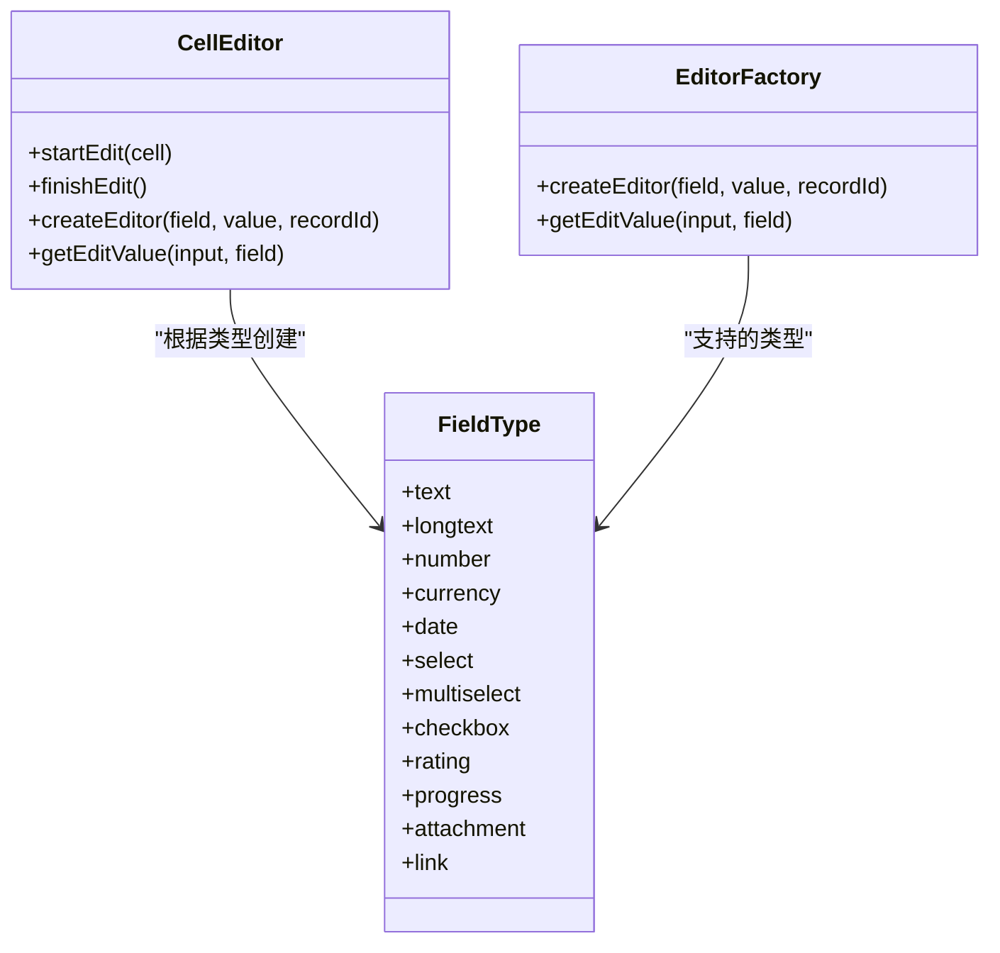
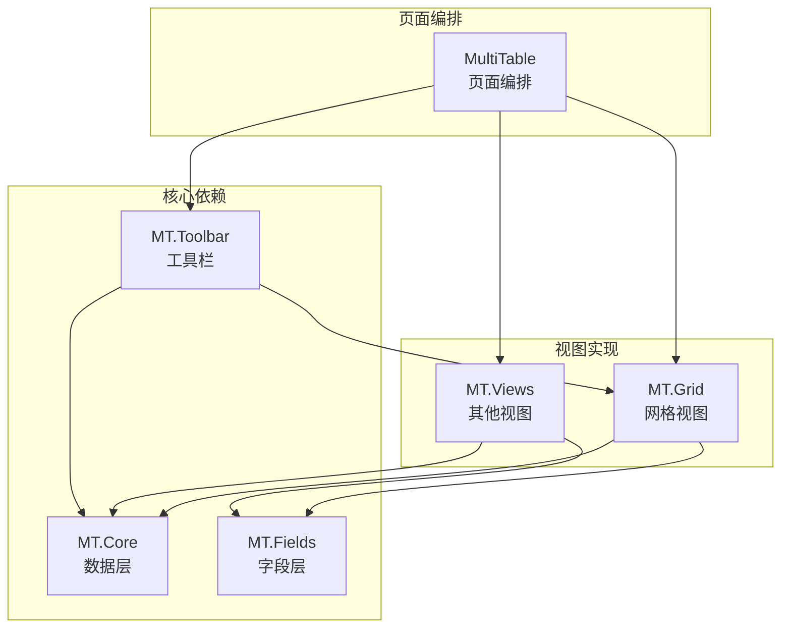
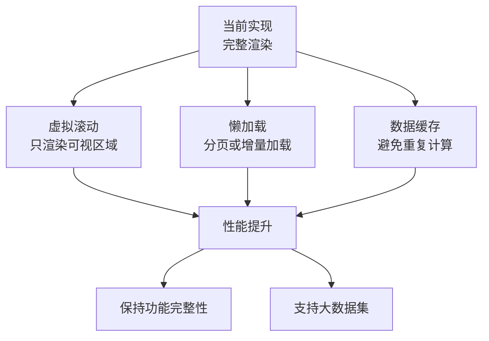

# 网格视图

<cite>
**本文档引用的文件**
- [mt-grid.js](file://js/mt-grid.js)
- [mt-core.js](file://js/mt-core.js)
- [mt-fields.js](file://js/mt-fields.js)
- [mt-views.js](file://js/mt-views.js)
- [mt-toolbar.js](file://js/mt-toolbar.js)
- [multitable.js](file://js/multitable.js)
- [index.html](file://index.html)
- [mt-style.css](file://css/mt-style.css)
</cite>

## 目录
1. [简介](#简介)
2. [项目结构](#项目结构)
3. [核心组件](#核心组件)
4. [架构概览](#架构概览)
5. [详细组件分析](#详细组件分析)
6. [依赖关系分析](#依赖关系分析)
7. [性能考虑](#性能考虑)
8. [故障排除指南](#故障排除指南)
9. [结论](#结论)
10. [附录](#附录)

## 简介
本文档深入解析陈苗多维表格系统的网格视图实现，涵盖数据表格渲染、列定义与配置、排序与筛选、行选择与批量操作等核心功能。同时详细说明了网格视图的性能优化策略（虚拟滚动、懒加载、数据缓存），交互行为（拖拽排序、单元格编辑、右键菜单），以及如何配置和自定义网格视图，包括与其他视图类型的切换机制。

## 项目结构
多维表格采用模块化架构，网格视图作为核心渲染模块之一，与其他模块协同工作：
- MT.Grid：网格视图渲染与交互
- MT.Core：数据层与状态管理
- MT.Fields：字段类型渲染与编辑器
- MT.Views：其他视图类型（看板、画廊、甘特图、日历、表单）
- MT.Toolbar：工具栏与配置面板
- MultiTable：页面编排与事件处理

**图表来源**
- [multitable.js:13-162](file://js/multitable.js#L13-L162)
- [mt-grid.js:14-37](file://js/mt-grid.js#L14-L37)
- [mt-core.js:98-107](file://js/mt-core.js#L98-L107)
- [mt-fields.js:57-157](file://js/mt-fields.js#L57-L157)
- [mt-views.js:7-65](file://js/mt-views.js#L7-L65)

**章节来源**
- [index.html:369-378](file://index.html#L369-L378)
- [multitable.js:13-162](file://js/multitable.js#L13-L162)

## 核心组件
网格视图的核心组件包括：
- 渲染引擎：负责表格的整体渲染、列头渲染、行渲染、分组渲染
- 编辑系统：支持多种字段类型的行内编辑与即时更新
- 交互控制：键盘导航、复制粘贴、列宽拖拽、行选择
- 条件着色：基于规则的行/单元格条件着色
- 数据管道：过滤、排序、搜索、分组的数据处理链

**章节来源**
- [mt-grid.js:6-358](file://js/mt-grid.js#L6-L358)
- [mt-core.js:395-474](file://js/mt-core.js#L395-L474)

## 架构概览
网格视图的运行时架构展示了从页面编排到具体渲染的完整流程：

**图表来源**
- [multitable.js:138-161](file://js/multitable.js#L138-L161)
- [mt-core.js:395-403](file://js/mt-core.js#L395-L403)
- [mt-grid.js:14-37](file://js/mt-grid.js#L14-L37)
- [mt-fields.js:57-157](file://js/mt-fields.js#L57-L157)

## 详细组件分析

### 数据表格渲染引擎
网格视图的渲染引擎负责将数据转换为HTML表格结构，支持以下特性：
- 动态列头渲染：包含行号、选择列、字段列头
- 行渲染：包含行号、选择框、数据单元格
- 冻结列：支持左侧N列冻结显示
- 分组渲染：支持按字段分组显示
- 最小宽度计算：根据列宽动态计算容器最小宽度

**图表来源**
- [mt-grid.js:14-37](file://js/mt-grid.js#L14-L37)
- [mt-grid.js:39-52](file://js/mt-grid.js#L39-L52)
- [mt-grid.js:54-75](file://js/mt-grid.js#L54-L75)
- [mt-grid.js:77-98](file://js/mt-grid.js#L77-L98)

**章节来源**
- [mt-grid.js:14-98](file://js/mt-grid.js#L14-L98)

### 列定义与配置
网格视图的列定义支持多种配置选项：
- 字段可见性：通过hiddenFields控制字段显示/隐藏
- 字段顺序：通过fieldOrder控制列的显示顺序
- 冻结列：通过frozenColumns配置冻结的列数
- 列宽：每个字段的width属性控制列宽
- 主字段标识：isPrimary字段在列头显示主标识

**图表来源**
- [mt-grid.js:39-52](file://js/mt-grid.js#L39-L52)
- [mt-grid.js:54-98](file://js/mt-grid.js#L54-L98)

**章节来源**
- [mt-grid.js:39-98](file://js/mt-grid.js#L39-L98)

### 排序与筛选功能
网格视图实现了完整的数据管道处理：
- 过滤：支持多种操作符（等于、不等于、包含、大于、小于等）
- 排序：支持多字段排序，区分数值、日期、文本类型
- 搜索：全局搜索功能，支持多字段匹配
- 分组：按指定字段分组，支持分组折叠/展开

**图表来源**
- [mt-core.js:413-435](file://js/mt-core.js#L413-L435)
- [mt-core.js:436-448](file://js/mt-core.js#L436-L448)
- [mt-core.js:449-458](file://js/mt-core.js#L449-L458)
- [mt-core.js:459-474](file://js/mt-core.js#L459-L474)

**章节来源**
- [mt-core.js:395-474](file://js/mt-core.js#L395-L474)

### 行选择与批量操作
网格视图提供了完善的行选择机制：
- 全选/取消全选：通过头部的选择框控制
- 单行选择：通过行内选择框进行选择
- 批量删除：支持选择多行后批量删除
- 选择状态管理：通过DOM状态和视图配置共同维护

**图表来源**
- [mt-grid.js:351-356](file://js/mt-grid.js#L351-L356)
- [multitable.js:515-521](file://js/multitable.js#L515-L521)

**章节来源**
- [mt-grid.js:351-356](file://js/mt-grid.js#L351-L356)
- [multitable.js:515-521](file://js/multitable.js#L515-L521)

### 单元格编辑系统
网格视图支持多种字段类型的行内编辑：
- 即时编辑：复选框、评分等支持即时更新
- 下拉编辑：单选、多选、人员等下拉选择
- 文本编辑：文本、长文本、数字、货币等输入框
- 专用编辑器：进度条、附件、关联等复杂字段

**图表来源**
- [mt-grid.js:161-208](file://js/mt-grid.js#L161-L208)
- [mt-fields.js:160-255](file://js/mt-fields.js#L160-L255)
- [mt-fields.js:257-263](file://js/mt-fields.js#L257-L263)

**章节来源**
- [mt-grid.js:161-208](file://js/mt-grid.js#L161-L208)
- [mt-fields.js:160-263](file://js/mt-fields.js#L160-L263)

### 条件着色系统
网格视图支持基于规则的条件着色：
- 行级条件着色：根据规则匹配整行背景色
- 单元格条件着色：针对特定字段的单元格着色
- 支持的操作符：等于、不等于、包含、大于、小于、为空、布尔值等
- 颜色配置：支持背景色和文字色的自定义

**章节来源**
- [mt-grid.js:125-158](file://js/mt-grid.js#L125-L158)
- [mt-grid.js:134-142](file://js/mt-grid.js#L134-L142)

### 键盘导航与快捷操作
网格视图提供了完整的键盘导航体验：
- 方向键导航：上下左右移动焦点单元格
- Enter键编辑：在焦点单元格上启动编辑
- Delete/Backspace：清空焦点单元格内容
- Tab键：在单元格间移动
- Ctrl+C/V：复制粘贴功能
- Ctrl+Z/Y：撤销/重做操作

**章节来源**
- [mt-grid.js:211-266](file://js/mt-grid.js#L211-L266)
- [mt-grid.js:269-325](file://js/mt-grid.js#L269-L325)
- [multitable.js:364-379](file://js/multitable.js#L364-L379)

### 列宽拖拽与冻结列
网格视图支持灵活的列宽调整和冻结功能：
- 列宽拖拽：通过列头的拖拽条调整列宽
- 冻结列：设置frozenColumns参数冻结左侧N列
- 冻结样式：冻结列使用position: sticky保持可见
- 响应式布局：根据列宽动态计算容器宽度

**章节来源**
- [mt-grid.js:328-348](file://js/mt-grid.js#L328-L348)
- [mt-grid.js:55-74](file://js/mt-grid.js#L55-L74)

## 依赖关系分析

**图表来源**
- [multitable.js:13-29](file://js/multitable.js#L13-L29)
- [mt-grid.js:6-12](file://js/mt-grid.js#L6-L12)
- [mt-core.js:8-33](file://js/mt-core.js#L8-L33)
- [mt-fields.js:5-54](file://js/mt-fields.js#L5-L54)
- [mt-toolbar.js:37-48](file://js/mt-toolbar.js#L37-L48)

**章节来源**
- [multitable.js:13-29](file://js/multitable.js#L13-L29)
- [mt-grid.js:6-12](file://js/mt-grid.js#L6-L12)

## 性能考虑

### 当前实现特点
基于代码分析，网格视图当前采用的是完整渲染策略：
- **完整渲染**：每次视图刷新都会重新渲染整个表格
- **DOM操作频繁**：通过innerHTML方式批量更新DOM
- **内存占用**：所有记录都在DOM中，适合中小规模数据集

### 性能优化建议

**潜在优化方向**：
1. **虚拟滚动**：只渲染可视区域内的行，大幅减少DOM节点数量
2. **懒加载**：支持分页或增量加载，适用于大量数据场景
3. **数据缓存**：缓存过滤、排序、分组结果，避免重复计算
4. **增量更新**：只更新发生变化的单元格而非整行
5. **Web Workers**：将复杂的计算逻辑放到后台线程

**章节来源**
- [mt-grid.js:14-37](file://js/mt-grid.js#L14-L37)
- [mt-core.js:395-403](file://js/mt-core.js#L395-L403)

## 故障排除指南

### 常见问题与解决方案

#### 1. 视图切换异常
**症状**：切换到其他视图后再切回网格视图，布局错乱
**原因**：事件监听器未正确绑定或解绑
**解决**：检查MultiTable的事件绑定和解绑逻辑

#### 2. 编辑功能失效
**症状**：双击单元格无法进入编辑状态
**原因**：编辑器创建失败或事件冒泡被阻止
**解决**：检查字段类型是否受支持，确认事件处理逻辑

#### 3. 数据更新不生效
**症状**：修改单元格后数据未保存
**原因**：finishEdit方法未正确调用或事件未触发
**解决**：验证编辑生命周期和事件发射机制

#### 4. 性能问题
**症状**：大数据集时渲染缓慢
**原因**：完整渲染策略不适合大规模数据
**解决**：考虑引入虚拟滚动或分页加载

**章节来源**
- [multitable.js:178-380](file://js/multitable.js#L178-L380)
- [mt-grid.js:161-208](file://js/mt-grid.js#L161-L208)
- [mt-core.js:255-267](file://js/mt-core.js#L255-L267)

## 结论
陈苗多维表格的网格视图实现了完整的表格功能，包括数据渲染、编辑、交互、条件着色等核心特性。其模块化设计使得功能扩展相对容易，但当前实现更适合中小规模数据集。对于大规模数据场景，建议引入虚拟滚动、懒加载等性能优化策略，同时保持现有功能的完整性。

## 附录

### 配置选项参考
网格视图的主要配置选项包括：
- `filters`: 筛选条件数组
- `sorts`: 排序规则数组  
- `groupBy`: 分组配置对象
- `hiddenFields`: 隐藏字段ID数组
- `fieldOrder`: 字段显示顺序数组
- `rowHeight`: 行高设置（compact/medium/tall）
- `frozenColumns`: 冻结列数
- `colorRules`: 条件着色规则数组

### 自定义示例路径
以下路径展示了如何配置和自定义网格视图：
- [添加视图配置:568-576](file://js/multitable.js#L568-L576)
- [工具栏面板配置:50-173](file://js/mt-toolbar.js#L50-L173)
- [条件着色配置:167-173](file://js/mt-toolbar.js#L167-L173)
- [行高设置:151-165](file://js/mt-toolbar.js#L151-L165)