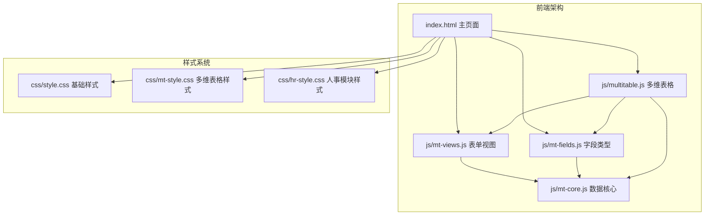
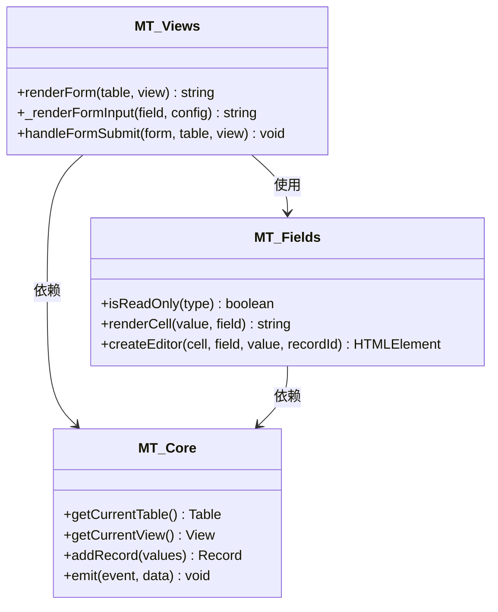
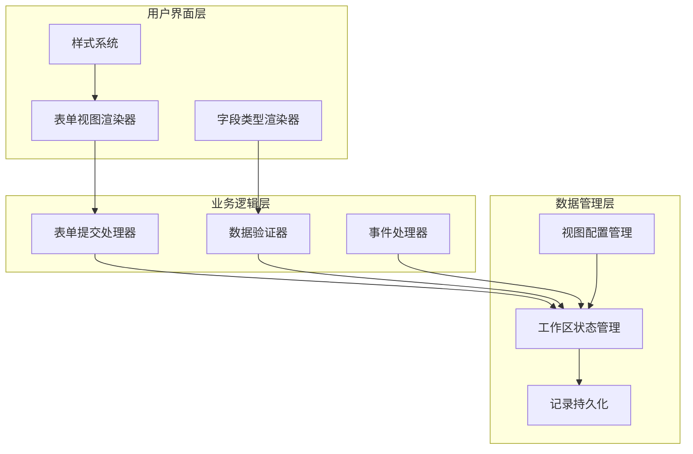
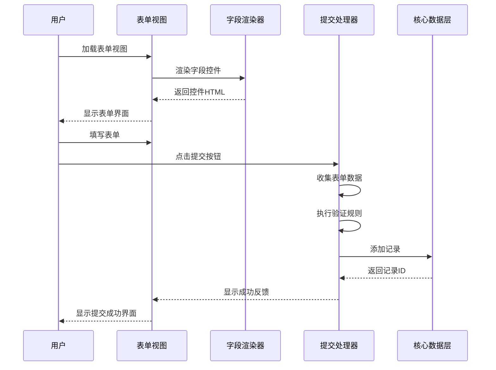
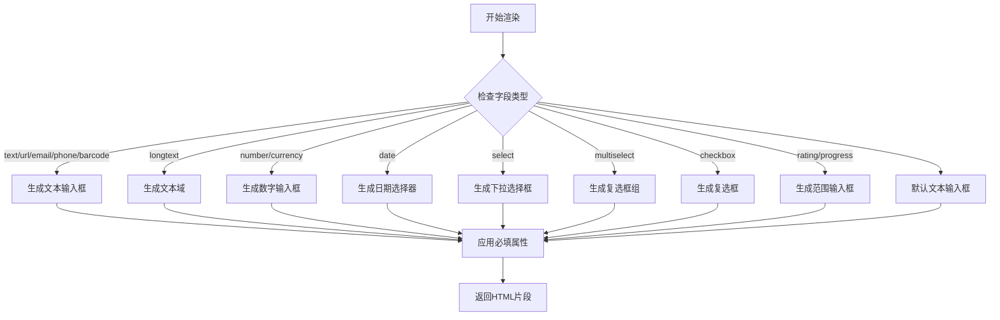
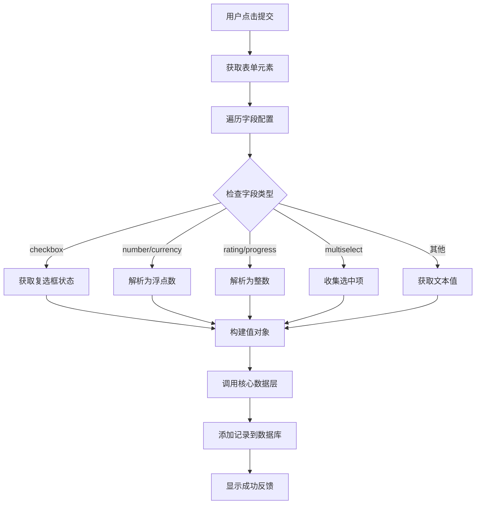
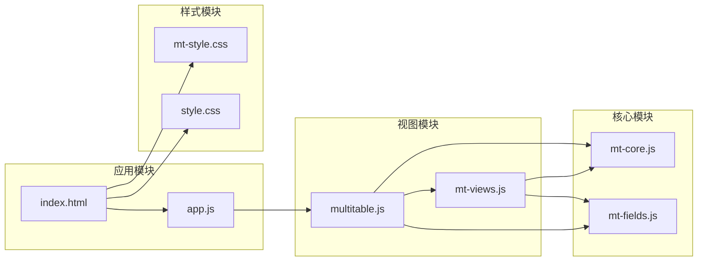

# 表单视图

<cite>
**本文档引用的文件**
- [index.html](file://index.html)
- [README.md](file://README.md)
- [js/mt-views.js](file://js/mt-views.js)
- [js/mt-fields.js](file://js/mt-fields.js)
- [js/multitable.js](file://js/multitable.js)
- [js/mt-core.js](file://js/mt-core.js)
- [js/app.js](file://js/app.js)
- [css/style.css](file://css/style.css)
- [css/mt-style.css](file://css/mt-style.css)
- [css/hr-style.css](file://css/hr-style.css)
</cite>

## 目录
1. [简介](#简介)
2. [项目结构](#项目结构)
3. [核心组件](#核心组件)
4. [架构概览](#架构概览)
5. [详细组件分析](#详细组件分析)
6. [依赖关系分析](#依赖关系分析)
7. [性能考虑](#性能考虑)
8. [故障排除指南](#故障排除指南)
9. [结论](#结论)
10. [附录](#附录)

## 简介

表单视图是陈苗多维表格系统中的核心功能模块，为用户提供了一个灵活且强大的在线表单创建和数据收集平台。该系统基于飞书多维表格的设计理念，提供了丰富的字段类型支持、动态表单生成机制、以及完整的数据验证和提交处理流程。

### 主要特性

- **动态表单生成**：根据字段类型自动生成相应的输入控件
- **多字段类型支持**：涵盖文本、数字、日期、选择、评分等多种字段类型
- **灵活的配置选项**：支持字段选择、必填设置、帮助文本等配置
- **完整的验证机制**：内置数据验证和错误处理
- **响应式设计**：支持多种设备和屏幕尺寸
- **主题定制**：提供完整的样式定制能力

## 项目结构

陈苗多维表格项目采用模块化的架构设计，主要包含以下核心模块：



**图表来源**
- [index.html:1-382](file://index.html#L1-L382)
- [js/mt-views.js:1-379](file://js/mt-views.js#L1-L379)
- [js/mt-fields.js:1-632](file://js/mt-fields.js#L1-L632)

**章节来源**
- [index.html:1-382](file://index.html#L1-L382)
- [README.md:1-135](file://README.md#L1-L135)

## 核心组件

### 表单视图渲染器

表单视图的核心组件是 `MT.Views` 对象中的 `renderForm` 方法，负责动态生成表单界面。



**图表来源**
- [js/mt-views.js:288-378](file://js/mt-views.js#L288-L378)
- [js/mt-fields.js:52-54](file://js/mt-fields.js#L52-L54)
- [js/mt-core.js:97-116](file://js/mt-core.js#L97-L116)

### 字段类型系统

系统支持23种不同的字段类型，每种类型都有对应的渲染器和编辑器：

| 字段类型 | 描述 | 输入控件 | 验证规则 |
|---------|------|----------|----------|
| text | 单行文本 | 文本输入框 | 必填验证 |
| longtext | 多行文本 | 文本域 | 长度限制 |
| number | 数字 | 数字输入框 | 数值范围 |
| currency | 货币 | 数字输入框 | 货币格式 |
| date | 日期 | 日期选择器 | 日期验证 |
| select | 单选 | 下拉选择框 | 选项验证 |
| multiselect | 多选 | 复选框组 | 选择数量 |
| checkbox | 复选框 | 复选框 | 布尔值 |
| url | 链接 | 文本输入框 | URL格式 |
| email | 邮箱 | 邮箱输入框 | 邮箱格式 |
| phone | 电话 | 电话输入框 | 电话格式 |
| rating | 评分 | 范围输入框 | 评分范围 |
| progress | 进度 | 范围输入框 | 0-100范围 |

**章节来源**
- [js/mt-fields.js:6-30](file://js/mt-fields.js#L6-L30)
- [js/mt-fields.js:314-347](file://js/mt-fields.js#L314-L347)

## 架构概览

表单视图采用分层架构设计，确保了良好的模块分离和可维护性：



**图表来源**
- [js/mt-views.js:288-378](file://js/mt-views.js#L288-L378)
- [js/mt-core.js:8-33](file://js/mt-core.js#L8-L33)

### 控制流分析

表单视图的典型交互流程如下：



**图表来源**
- [js/mt-views.js:349-377](file://js/mt-views.js#L349-L377)
- [js/multitable.js:296-301](file://js/multitable.js#L296-L301)

## 详细组件分析

### 表单渲染机制

表单视图的核心渲染逻辑位于 `renderForm` 方法中，该方法根据视图配置动态生成表单界面：

#### 字段映射和配置

每个表单字段都通过 `view.formFields` 数组进行配置，包含以下属性：

- `fieldId`: 字段标识符
- `required`: 是否必填
- `helpText`: 帮助文本

#### 输入控件生成

根据字段类型动态生成相应的HTML控件：



**图表来源**
- [js/mt-views.js:314-348](file://js/mt-views.js#L314-L348)

**章节来源**
- [js/mt-views.js:288-313](file://js/mt-views.js#L288-L313)
- [js/mt-views.js:314-348](file://js/mt-views.js#L314-L348)

### 数据收集和验证

表单提交处理流程包含完整的数据收集、验证和存储机制：

#### 数据收集过程



**图表来源**
- [js/mt-views.js:349-367](file://js/mt-views.js#L349-L367)

#### 验证规则应用

系统支持多种内置验证规则：

| 字段类型 | 验证规则 | 错误处理 |
|----------|----------|----------|
| email | 标准邮箱格式验证 | 显示格式错误提示 |
| url | URL格式验证 | 显示无效链接提示 |
| phone | 电话号码格式验证 | 显示格式错误提示 |
| number | 数值范围验证 | 显示超出范围提示 |
| currency | 货币数值验证 | 显示格式错误提示 |
| date | 有效日期验证 | 显示日期格式错误 |
| required | 必填字段检查 | 显示必填标记 |

**章节来源**
- [js/mt-views.js:349-377](file://js/mt-views.js#L349-L377)

### 样式定制系统

表单视图采用CSS变量和模块化样式设计，提供了完整的定制能力：

#### 主题变量系统

```css
:root {
    --mt-primary: #4f46e5;
    --mt-primary-hover: #4338ca;
    --mt-danger: #ef4444;
    --mt-success: #10b981;
    --mt-text-primary: #0f172a;
    --mt-border: #e2e8f0;
    --mt-bg-page: #ffffff;
    --mt-radius-md: 6px;
    --mt-shadow-md: 0 4px 12px rgba(0,0,0,0.08);
}
```

#### 响应式设计

表单视图支持多种屏幕尺寸的自适应布局：

- **桌面端**：最大宽度640px，居中显示
- **平板端**：自适应宽度，保持良好的可读性
- **移动端**：优化触摸交互，简化表单布局

**章节来源**
- [css/mt-style.css:1388-1466](file://css/mt-style.css#L1388-L1466)
- [css/style.css:7-21](file://css/style.css#L7-L21)

## 依赖关系分析

### 模块间依赖



**图表来源**
- [js/mt-core.js:6-10](file://js/mt-core.js#L6-L10)
- [js/mt-views.js:5-6](file://js/mt-views.js#L5-L6)

### 关键依赖链

表单视图的运行依赖于以下关键链路：

1. **数据层依赖**：`MT.Views` → `MT.Core` → `localStorage`
2. **字段类型依赖**：`MT.Views` → `MT.Fields` → `MT.Core`
3. **UI渲染依赖**：`Multitable` → `MT.Views` → DOM操作
4. **样式依赖**：`表单样式` → `全局样式` → `主题变量`

**章节来源**
- [js/mt-views.js:288-378](file://js/mt-views.js#L288-L378)
- [js/multitable.js:13-29](file://js/multitable.js#L13-L29)

## 性能考虑

### 渲染优化

表单视图采用了多项性能优化措施：

- **延迟渲染**：仅在需要时渲染表单控件
- **事件委托**：使用事件委托减少事件监听器数量
- **虚拟滚动**：对于大量记录的场景提供虚拟滚动支持
- **缓存机制**：缓存字段配置和渲染结果

### 内存管理

- **DOM元素复用**：避免频繁创建和销毁DOM元素
- **垃圾回收**：及时清理事件监听器和定时器
- **内存泄漏防护**：确保组件销毁时释放所有资源

### 网络优化

- **增量更新**：仅更新变化的数据部分
- **防抖机制**：对高频操作进行防抖处理
- **懒加载**：按需加载额外的功能模块

## 故障排除指南

### 常见问题及解决方案

#### 表单无法提交

**问题症状**：点击提交按钮无响应

**可能原因**：
1. 字段配置错误
2. JavaScript错误阻止了提交
3. 事件监听器未正确绑定

**解决步骤**：
1. 检查浏览器控制台是否有JavaScript错误
2. 验证表单字段配置是否正确
3. 确认事件监听器是否正常工作

#### 字段显示异常

**问题症状**：某些字段无法正确显示或渲染

**可能原因**：
1. 字段类型不支持
2. 字段配置缺失
3. 样式冲突

**解决步骤**：
1. 检查字段类型是否在支持列表中
2. 验证字段配置参数是否完整
3. 检查CSS样式是否正确加载

#### 数据保存失败

**问题症状**：表单提交后数据未保存

**可能原因**：
1. 本地存储空间不足
2. 数据格式不正确
3. 权限问题

**解决步骤**：
1. 检查浏览器存储空间
2. 验证数据格式是否符合要求
3. 确认用户权限设置

**章节来源**
- [js/mt-views.js:349-377](file://js/mt-views.js#L349-L377)
- [js/mt-core.js:51-69](file://js/mt-core.js#L51-L69)

## 结论

陈苗多维表格的表单视图系统展现了现代Web应用的优秀设计实践。通过模块化的架构设计、完善的字段类型支持、灵活的配置选项，以及优秀的用户体验，该系统为用户提供了强大而易用的在线表单创建和数据收集能力。

### 技术优势

1. **高度模块化**：清晰的模块边界和依赖关系
2. **扩展性强**：支持新的字段类型和视图类型
3. **用户体验优秀**：直观的界面设计和流畅的交互体验
4. **性能优化**：多项性能优化措施确保系统响应速度
5. **可维护性好**：清晰的代码结构和完善的注释

### 应用场景

表单视图系统适用于以下应用场景：

- **在线登记**：员工入职、客户注册等信息收集
- **数据采集**：调研问卷、调查表单等数据收集
- **用户反馈**：意见征集、评价表单等用户互动
- **业务流程**：审批流程、申请表单等业务操作

## 附录

### 配置选项参考

#### 表单视图配置

| 配置项 | 类型 | 默认值 | 描述 |
|--------|------|--------|------|
| formTitle | string | "提交记录" | 表单标题 |
| formDescription | string | "" | 表单描述文本 |
| formFields | array | 自动生成 | 字段配置数组 |
| formSubmitText | string | "提交" | 提交按钮文本 |
| formSuccessMessage | string | "提交成功！" | 成功反馈消息 |

#### 字段配置选项

| 选项 | 类型 | 默认值 | 描述 |
|------|------|--------|------|
| required | boolean | false | 是否必填 |
| helpText | string | "" | 帮助文本 |
| options | array | [] | 选择项列表 |
| max | number | 5 | 最大评分值 |
| decimals | number | 0/2 | 小数位数 |
| symbol | string | "¥" | 货币符号 |

### 最佳实践

1. **字段设计**：合理设计字段类型和验证规则
2. **用户体验**：提供清晰的表单指导和错误提示
3. **性能优化**：避免过多的字段和复杂的验证逻辑
4. **安全性**：实施适当的数据验证和清理措施
5. **可访问性**：确保表单对残障用户友好