# 视图系统

<cite>
**本文档引用的文件**
- [index.html](file://index.html)
- [mt-views.js](file://js/mt-views.js)
- [mt-grid.js](file://js/mt-grid.js)
- [mt-fields.js](file://js/mt-fields.js)
- [mt-toolbar.js](file://js/mt-toolbar.js)
- [mt-core.js](file://js/mt-core.js)
- [mt-dashboard.js](file://js/mt-dashboard.js)
- [multitable.js](file://js/multitable.js)
- [mt-style.css](file://css/mt-style.css)
</cite>

## 目录
1. [项目概述](#项目概述)
2. [系统架构](#系统架构)
3. [核心组件](#核心组件)
4. [视图类型详解](#视图类型详解)
5. [数据渲染机制](#数据渲染机制)
6. [交互行为分析](#交互行为分析)
7. [性能优化策略](#性能优化策略)
8. [视图配置与自定义](#视图配置与自定义)
9. [响应式设计与移动端适配](#响应式设计与移动端适配)
10. [故障排除指南](#故障排除指南)
11. [总结](#总结)

## 项目概述

陈苗多维表格视图系统是一个基于纯前端技术构建的云端数据管理平台，支持多种视图类型的灵活切换和丰富的交互功能。该系统采用模块化架构设计，通过事件驱动的方式实现各个组件间的解耦协作。

### 系统特性
- **多视图支持**：网格、看板、画廊、甘特图、日历、表单视图
- **云端数据存储**：基于Supabase的云端数据同步
- **实时协作**：多设备实时数据同步
- **响应式设计**：适配桌面端和移动端设备
- **可视化仪表盘**：集成Chart.js图表展示

## 系统架构

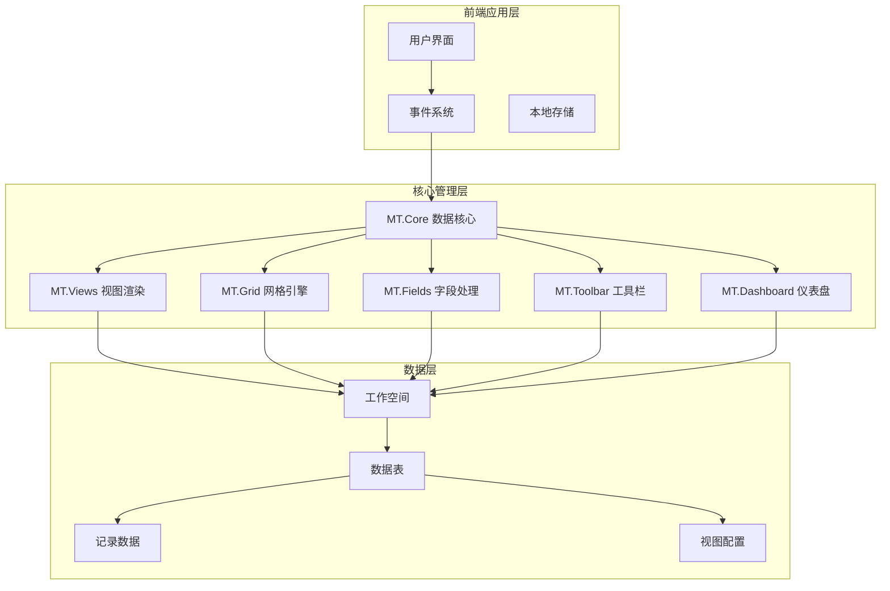

**图表来源**
- [mt-core.js:1-80](file://js/mt-core.js#L1-L80)
- [multitable.js:1-60](file://js/multitable.js#L1-L60)
- [mt-views.js:1-20](file://js/mt-views.js#L1-L20)

**章节来源**
- [mt-core.js:1-80](file://js/mt-core.js#L1-L80)
- [multitable.js:1-60](file://js/multitable.js#L1-L60)

## 核心组件

### MT.Core 数据核心
MT.Core是整个系统的核心数据管理层，负责：
- 工作空间的持久化存储
- 数据模型的CRUD操作
- 事件总线机制
- 数据管道处理（过滤、排序、搜索）

### MT.Views 视图渲染器
专门处理各种视图类型的渲染逻辑，包括：
- 看板视图（Kanban）
- 画廊视图（Gallery）
- 甘特图（Gantt）
- 日历视图（Calendar）
- 表单视图（Form）

### MT.Grid 网格引擎
增强的网格视图实现，支持：
- 分组显示
- 冻结列功能
- 条件着色
- 行高自定义
- 键盘导航
- 复制粘贴

**章节来源**
- [mt-core.js:1-120](file://js/mt-core.js#L1-L120)
- [mt-views.js:1-30](file://js/mt-views.js#L1-L30)
- [mt-grid.js:1-40](file://js/mt-grid.js#L1-L40)

## 视图类型详解

### 网格视图（Grid View）

网格视图是最基础和强大的数据展示方式，提供完整的数据编辑和管理功能。

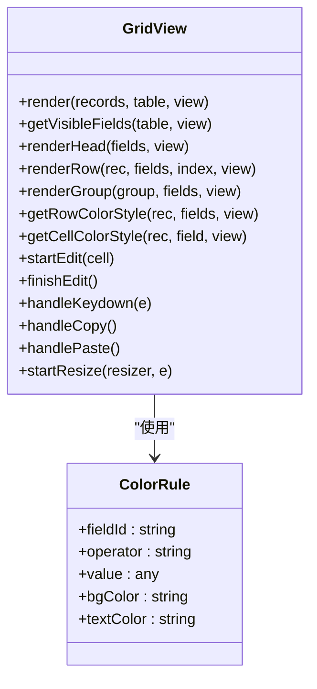

**图表来源**
- [mt-grid.js:14-358](file://js/mt-grid.js#L14-L358)

#### 核心功能特性
- **条件着色**：支持基于规则的动态颜色渲染
- **分组显示**：按字段值自动分组数据
- **冻结列**：固定重要列在可视区域内
- **键盘导航**：支持Tab键和方向键导航
- **批量编辑**：支持Ctrl+C/V进行批量复制粘贴

**章节来源**
- [mt-grid.js:14-358](file://js/mt-grid.js#L14-L358)

### 看板视图（Kanban View）

看板视图为项目管理和任务跟踪提供了直观的可视化界面。

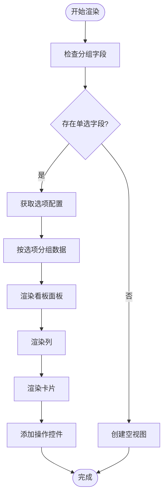

**图表来源**
- [mt-views.js:7-65](file://js/mt-views.js#L7-L65)

#### 关键特性
- **动态分组**：自动根据单选字段选项创建列
- **拖拽操作**：支持卡片在列间拖拽
- **封面图片**：支持附件字段作为卡片封面
- **快速添加**：每列支持快速添加新卡片

**章节来源**
- [mt-views.js:7-65](file://js/mt-views.js#L7-L65)

### 画廊视图（Gallery View）

画廊视图为媒体内容和富文本数据提供了美观的网格展示。

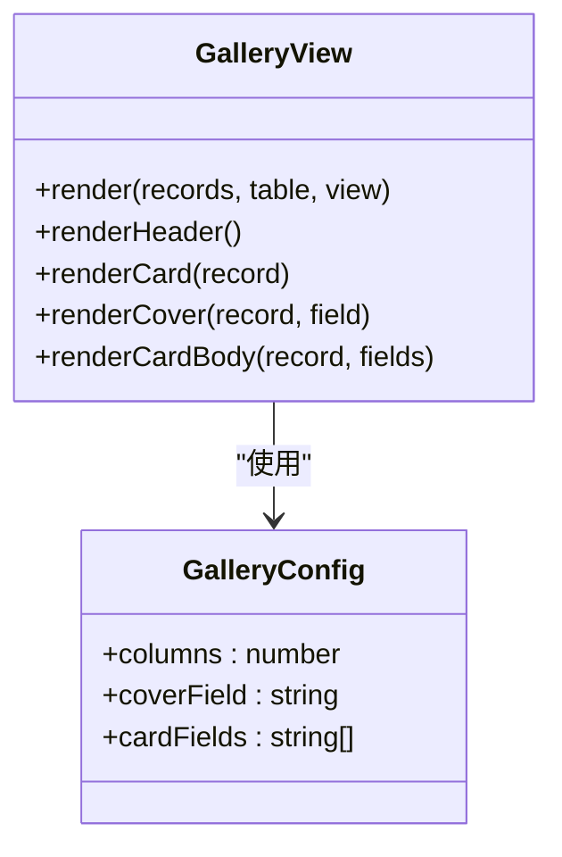

**图表来源**
- [mt-views.js:68-103](file://js/mt-views.js#L68-L103)

#### 设计特色
- **响应式布局**：支持2-5列自适应布局
- **封面展示**：自动识别图片附件作为封面
- **字段定制**：可配置显示的字段集合
- **展开预览**：支持点击展开完整记录

**章节来源**
- [mt-views.js:68-103](file://js/mt-views.js#L68-L103)

### 甘特图视图（Gantt View）

甘特图为项目计划和进度管理提供了专业的可视化工具。

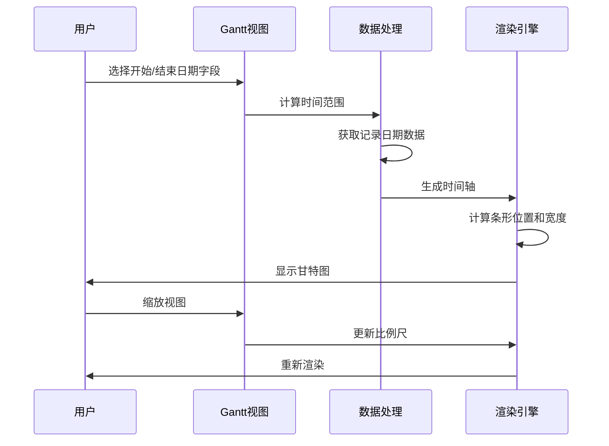

**图表来源**
- [mt-views.js:106-194](file://js/mt-views.js#L106-L194)

#### 专业功能
- **时间轴缩放**：支持日、周、月三种视图比例
- **进度显示**：可配置进度字段显示完成百分比
- **今日标记**：自动标注当前日期线
- **交互编辑**：支持拖拽调整任务时间

**章节来源**
- [mt-views.js:106-194](file://js/mt-views.js#L106-L194)

### 日历视图（Calendar View）

日历视图为时间敏感的数据提供了直观的日程管理界面。

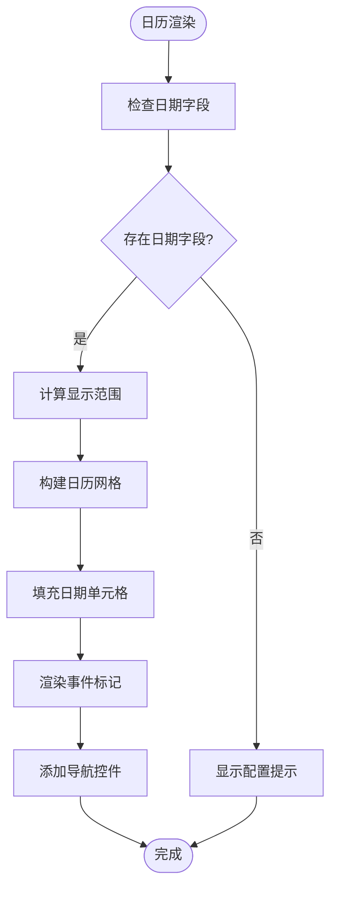

**图表来源**
- [mt-views.js:197-277](file://js/mt-views.js#L197-L277)

#### 交互特性
- **月份导航**：支持前后月切换和回到今天
- **事件标记**：在日期单元格显示事件摘要
- **快速跳转**：支持直接跳转到指定日期
- **多事件显示**：每个日期最多显示3个事件

**章节来源**
- [mt-views.js:197-277](file://js/mt-views.js#L197-L277)

### 表单视图（Form View）

表单视图为数据录入提供了简洁高效的界面。

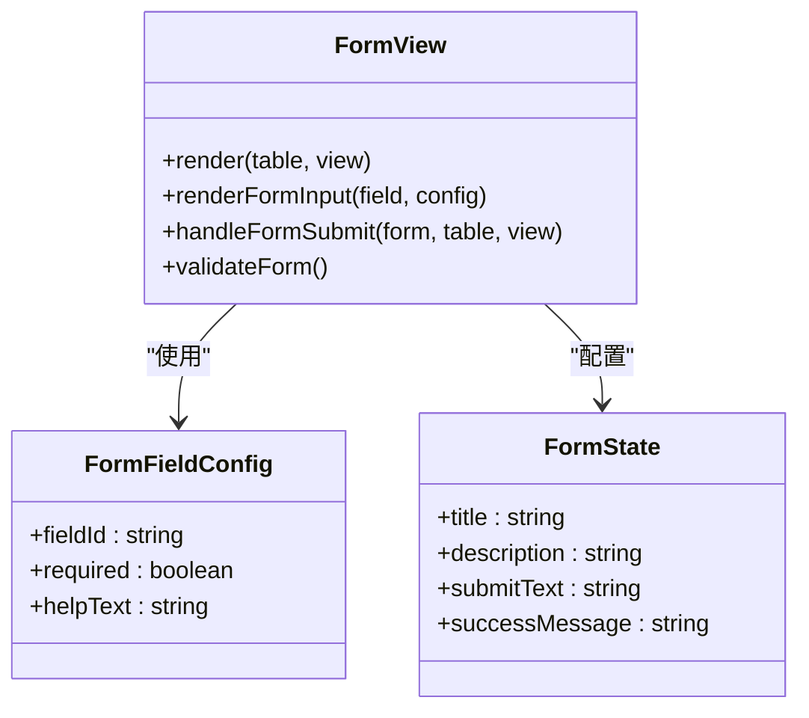

**图表来源**
- [mt-views.js:289-378](file://js/mt-views.js#L289-L378)

#### 表单优势
- **字段映射**：自动映射可用字段到表单控件
- **验证支持**：支持必填字段验证
- **成功反馈**：提交成功后的友好提示
- **灵活配置**：可自定义标题、描述和按钮文本

**章节来源**
- [mt-views.js:289-378](file://js/mt-views.js#L289-L378)

## 数据渲染机制

### 数据管道处理

系统采用链式数据处理管道，确保数据在渲染前经过适当的过滤和排序：

**图表来源**
- [mt-core.js:395-403](file://js/mt-core.js#L395-L403)

### 字段类型系统

系统支持23种不同的字段类型，每种类型都有对应的渲染器和编辑器：

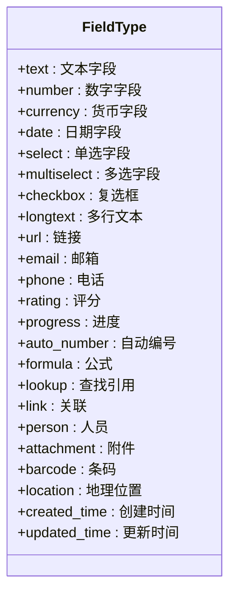

**图表来源**
- [mt-fields.js:6-30](file://js/mt-fields.js#L6-L30)

**章节来源**
- [mt-core.js:395-474](file://js/mt-core.js#L395-L474)
- [mt-fields.js:6-30](file://js/mt-fields.js#L6-L30)

## 交互行为分析

### 事件驱动架构

系统采用事件驱动的设计模式，通过事件总线实现组件间的松耦合通信：

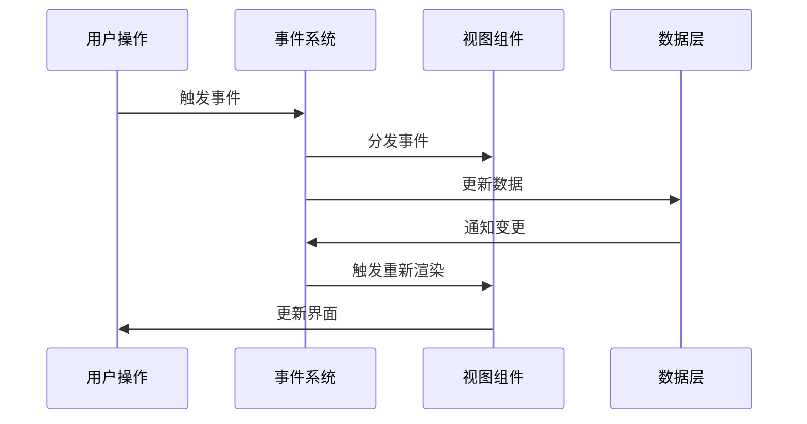

**图表来源**
- [mt-core.js:19-33](file://js/mt-core.js#L19-L33)

### 键盘快捷键支持

系统提供丰富的键盘快捷键支持，提升用户体验：

| 快捷键 | 功能 | 适用场景 |
|--------|------|----------|
| Ctrl+C | 复制单元格内容 | 网格视图 |
| Ctrl+V | 粘贴内容到单元格 | 网格视图 |
| Ctrl+Z | 撤销操作 | 所有视图 |
| Ctrl+Y | 重做操作 | 所有视图 |
| Tab | 单元格导航 | 网格视图 |
| Enter | 开始编辑 | 网格视图 |
| 方向键 | 导航移动 | 网格视图 |

**章节来源**
- [mt-grid.js:211-266](file://js/mt-grid.js#L211-L266)
- [multitable.js:364-379](file://js/multitable.js#L364-L379)

## 性能优化策略

### 渲染优化

系统采用了多种渲染优化技术来确保大数量数据的流畅显示：

1. **虚拟滚动**：只渲染可见区域内的行
2. **防抖处理**：搜索和过滤操作使用防抖机制
3. **增量更新**：局部更新而非整页重绘
4. **缓存机制**：常用计算结果缓存避免重复计算

### 内存管理

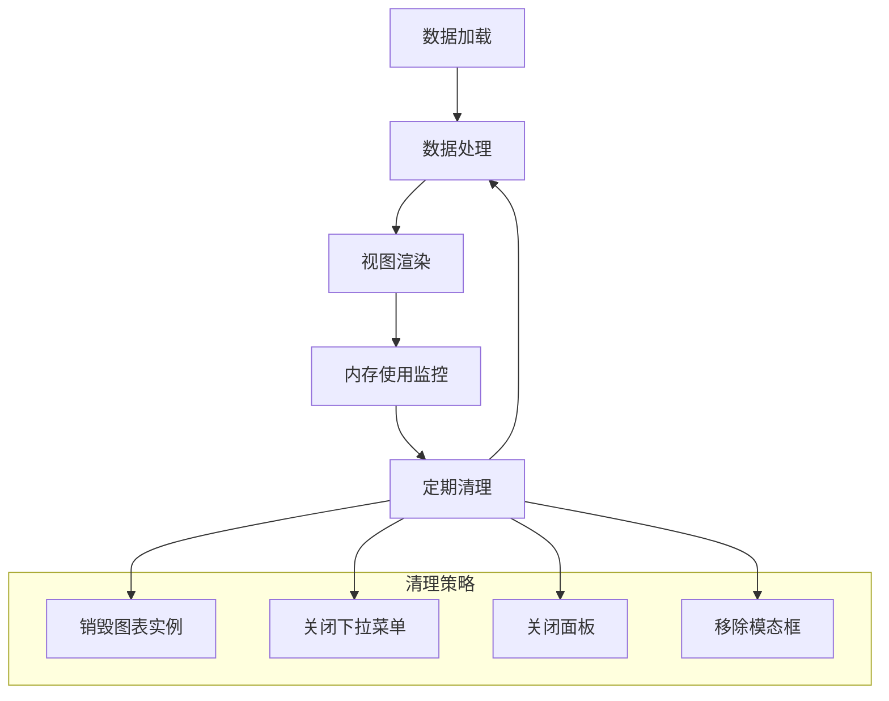

**图表来源**
- [mt-dashboard.js:480-487](file://js/mt-dashboard.js#L480-L487)
- [multitable.js:31-43](file://js/multitable.js#L31-L43)

### 存储优化

- **增量保存**：200ms防抖延迟保存，减少存储压力
- **版本迁移**：自动数据格式迁移
- **存储配额监控**：实时监控localStorage使用情况

**章节来源**
- [mt-core.js:51-74](file://js/mt-core.js#L51-L74)
- [mt-dashboard.js:480-487](file://js/mt-dashboard.js#L480-L487)

## 视图配置与自定义

### 视图配置选项

每个视图类型都支持丰富的配置选项：

#### 网格视图配置
- **冻结列数量**：设置左侧固定列数
- **行高设置**：紧凑/标准/宽松三种模式
- **字段顺序**：自定义列显示顺序
- **隐藏字段**：控制字段显示/隐藏
- **条件着色**：设置背景色和文字色规则

#### 看板视图配置
- **分组字段**：选择用于分组的单选字段
- **卡片字段**：配置卡片上显示的字段
- **封面字段**：设置卡片封面图片字段
- **列宽调整**：自定义列宽

#### 甘特图配置
- **开始/结束字段**：设置时间字段
- **进度字段**：显示任务完成进度
- **缩放级别**：日/周/月视图切换
- **分组字段**：按字段分组显示

**章节来源**
- [mt-core.js:326-392](file://js/mt-core.js#L326-L392)
- [mt-grid.js:39-52](file://js/mt-grid.js#L39-L52)

### 自定义视图实现

系统支持创建自定义视图类型，开发者可以通过以下步骤实现：

1. **扩展MT.Views对象**：添加新的渲染方法
2. **注册视图类型**：在视图类型枚举中添加新类型
3. **实现配置界面**：提供视图配置面板
4. **数据处理逻辑**：实现特定的数据转换逻辑

**章节来源**
- [mt-views.js:1-379](file://js/mt-views.js#L1-L379)

## 响应式设计与移动端适配

### 响应式布局

系统采用Flexbox布局和CSS Grid技术实现响应式设计：

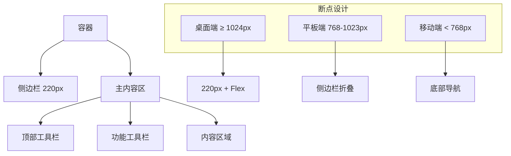

**图表来源**
- [mt-style.css:40-47](file://css/mt-style.css#L40-L47)

### 移动端优化

- **触摸友好的交互**：按钮和控件尺寸适合触摸操作
- **手势支持**：支持滑动、长按等移动端手势
- **简化界面**：移动端显示精简的功能面板
- **性能优化**：减少动画效果，提升加载速度

**章节来源**
- [mt-style.css:1-200](file://css/mt-style.css#L1-L200)

## 故障排除指南

### 常见问题诊断

#### 视图渲染异常
1. **检查数据完整性**：确认字段配置正确
2. **验证视图配置**：检查必需字段是否配置
3. **查看控制台错误**：定位JavaScript错误

#### 性能问题
1. **检查数据量**：大量数据可能导致渲染缓慢
2. **优化过滤器**：复杂的过滤条件影响性能
3. **启用虚拟滚动**：大数据集使用虚拟滚动

#### 事件处理问题
1. **确认事件绑定**：检查事件监听器是否正确绑定
2. **验证作用域**：确保事件处理器有正确的上下文
3. **调试事件流**：使用浏览器开发者工具调试

### 调试工具

系统提供了完善的调试工具：
- **事件日志**：记录所有系统事件
- **性能监控**：监控渲染性能指标
- **存储检查**：检查数据存储状态
- **错误报告**：收集和报告系统错误

**章节来源**
- [mt-core.js:19-33](file://js/mt-core.js#L19-L33)

## 总结

陈苗多维表格视图系统是一个功能完整、架构清晰的前端数据管理解决方案。系统通过模块化设计实现了高度的可扩展性和可维护性，支持多种视图类型的灵活切换和丰富的交互功能。

### 核心优势

1. **模块化架构**：清晰的组件分离和职责划分
2. **事件驱动**：松耦合的组件通信机制
3. **丰富视图**：满足不同场景的数据展示需求
4. **性能优化**：针对大数据量的优化策略
5. **响应式设计**：适配多终端设备

### 技术亮点

- **纯前端实现**：无需后端服务器即可运行
- **云端同步**：基于Supabase的实时数据同步
- **可视化仪表盘**：集成Chart.js的专业图表展示
- **键盘快捷键**：提升数据录入和编辑效率

该系统为用户提供了专业级的数据管理体验，同时保持了良好的可扩展性和维护性，是构建企业级数据应用的理想选择。