# 代码规范与风格

<cite>
**本文档引用的文件**
- [README.md](file://README.md)
- [index.html](file://index.html)
- [app.js](file://js/app.js)
- [config.js](file://js/config.js)
- [auth.js](file://js/auth.js)
- [cockpit.js](file://js/cockpit.js)
- [home.js](file://js/home.js)
- [messages.js](file://js/messages.js)
- [hr-org.js](file://js/hr-org.js)
- [mt-core.js](file://js/mt-core.js)
- [mt-fields.js](file://js/mt-fields.js)
- [mt-grid.js](file://js/mt-grid.js)
- [mt-views.js](file://js/mt-views.js)
- [mt-toolbar.js](file://js/mt-toolbar.js)
- [mt-dashboard.js](file://js/mt-dashboard.js)
</cite>

## 目录
1. [项目概述](#项目概述)
2. [项目结构](#项目结构)
3. [核心组件](#核心组件)
4. [架构概览](#架构概览)
5. [详细组件分析](#详细组件分析)
6. [依赖关系分析](#依赖关系分析)
7. [性能考虑](#性能考虑)
8. [故障排除指南](#故障排除指南)
9. [结论](#结论)

## 项目概述

这是一个基于HTML5 + CSS3 + JavaScript的财务CRM管理系统，采用云端架构设计，支持用户认证、云端数据存储和多设备同步。项目采用纯前端实现，无需后端服务器，通过Supabase提供云端数据服务。

### 技术栈特点
- **前端技术**: HTML5 + CSS3 + JavaScript (ES6+)
- **数据存储**: Supabase PostgreSQL (云端)
- **认证系统**: Supabase Auth JWT
- **部署平台**: Vercel (推荐)
- **模块化架构**: 基于命名空间的模块化设计

### 核心功能模块
- 用户认证系统
- 客户关系管理
- 合同生命周期管理
- 财务收支管理
- 发票管理
- 数据看板分析
- 多维表格系统
- 人事管理系统
- 消息沟通系统

## 项目结构

项目采用清晰的文件组织结构，按照功能模块进行划分：

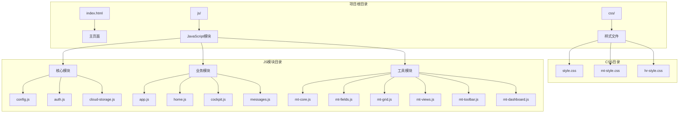

**图表来源**
- [index.html:1-381](file://index.html#L1-L381)
- [config.js:1-20](file://js/config.js#L1-L20)

**章节来源**
- [README.md:48-65](file://README.md#L48-L65)
- [index.html:1-381](file://index.html#L1-L381)

## 核心组件

### 应用主控制器
应用采用模块化架构，每个功能模块都是独立的JavaScript对象，通过统一的导航系统进行管理。

### 数据持久化层
系统实现了完整的数据持久化机制，支持本地存储和云端同步两种模式：

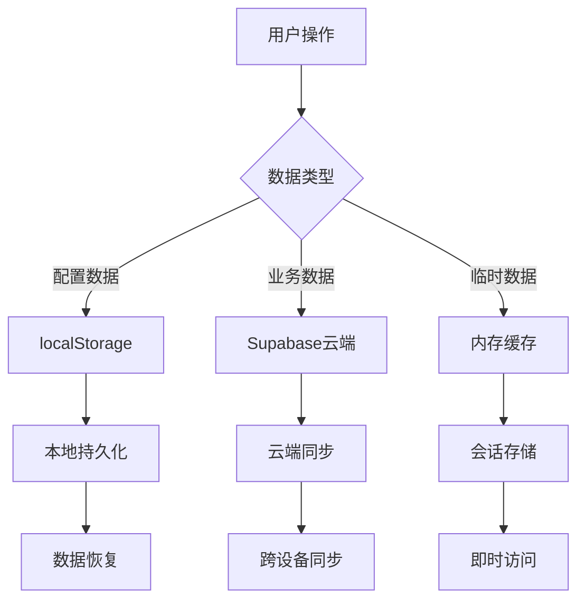

**图表来源**
- [config.js:8-19](file://js/config.js#L8-L19)
- [auth.js:13-22](file://js/auth.js#L13-L22)

### 多维表格系统
系统内置强大的多维表格功能，支持23种字段类型和多种视图模式：

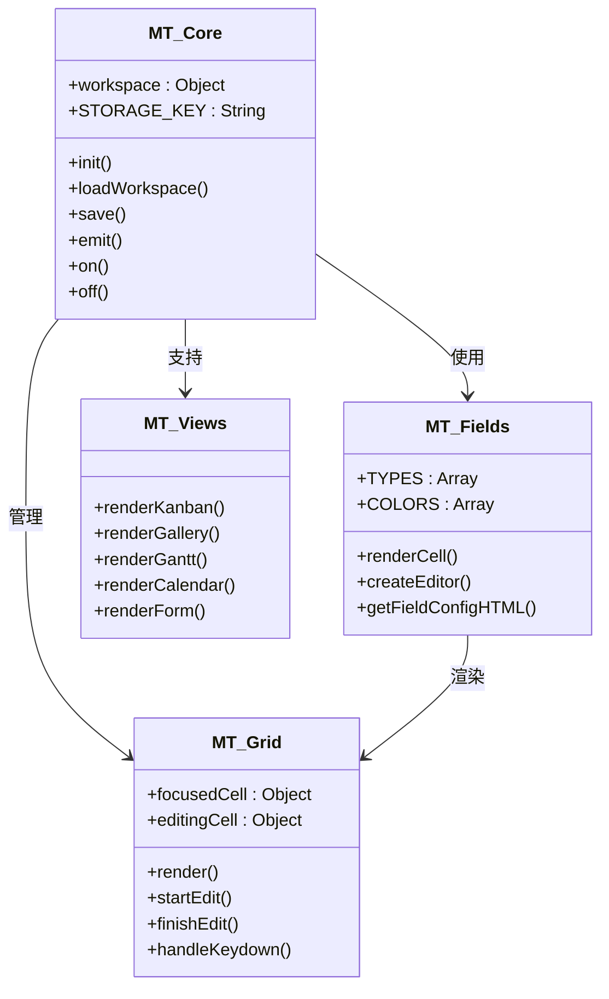

**图表来源**
- [mt-core.js:8-107](file://js/mt-core.js#L8-L107)
- [mt-fields.js:5-51](file://js/mt-fields.js#L5-L51)
- [mt-grid.js:6-37](file://js/mt-grid.js#L6-L37)
- [mt-views.js:5-31](file://js/mt-views.js#L5-L31)

**章节来源**
- [app.js:3-31](file://js/app.js#L3-L31)
- [mt-core.js:8-107](file://js/mt-core.js#L8-L107)
- [mt-fields.js:5-51](file://js/mt-fields.js#L5-L51)

## 架构概览

系统采用分层架构设计，从底层到上层依次为：

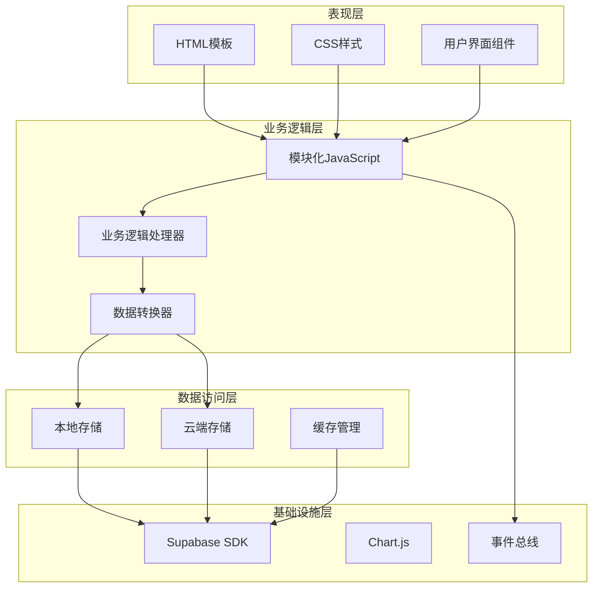

**图表来源**
- [index.html:355-378](file://index.html#L355-L378)
- [auth.js:3-54](file://js/auth.js#L3-L54)
- [mt-core.js:15-50](file://js/mt-core.js#L15-L50)

### 模块间通信机制

系统采用事件驱动的通信模式，通过全局事件总线实现模块间的解耦：

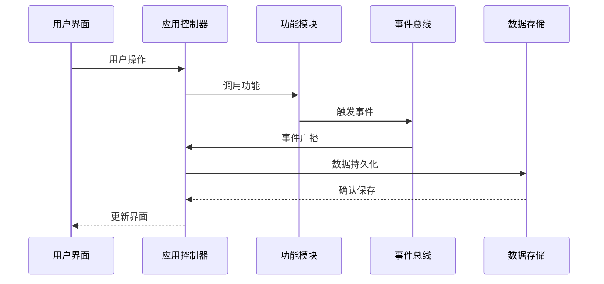

**图表来源**
- [mt-core.js:20-33](file://js/mt-core.js#L20-L33)
- [app.js:85-135](file://js/app.js#L85-L135)

## 详细组件分析

### 用户认证模块

认证模块实现了完整的用户身份验证流程，支持本地测试和云端认证两种模式：

#### 认证流程设计

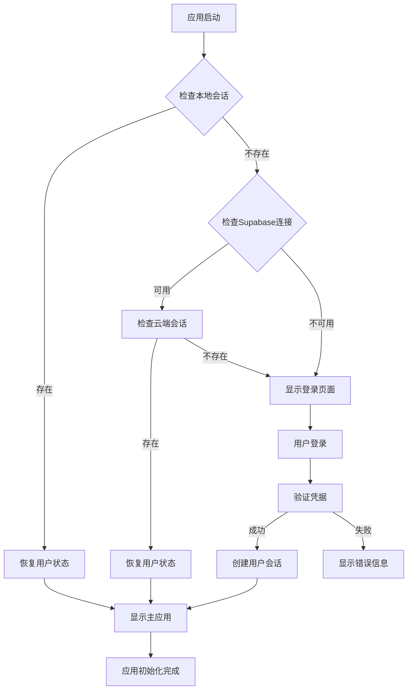

**图表来源**
- [auth.js:7-54](file://js/auth.js#L7-L54)
- [auth.js:108-151](file://js/auth.js#L108-L151)

#### 认证状态管理

认证模块采用状态管理模式，通过单一职责原则管理用户认证状态：

**章节来源**
- [auth.js:3-252](file://js/auth.js#L3-L252)

### 多维表格核心系统

#### 数据模型设计

系统实现了完整的数据建模能力，支持复杂的数据关系和计算：

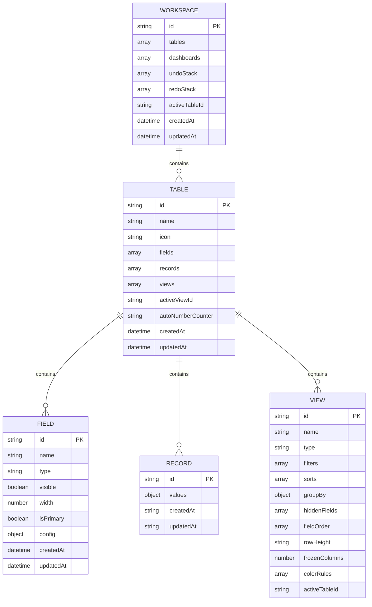

**图表来源**
- [mt-core.js:98-117](file://js/mt-core.js#L98-L117)
- [mt-core.js:119-167](file://js/mt-core.js#L119-L167)

#### 字段类型系统

系统支持23种不同的字段类型，每种类型都有专门的渲染器和编辑器：

**章节来源**
- [mt-fields.js:6-30](file://js/mt-fields.js#L6-L30)
- [mt-core.js:213-228](file://js/mt-core.js#L213-L228)

### 视图渲染系统

#### 视图类型架构

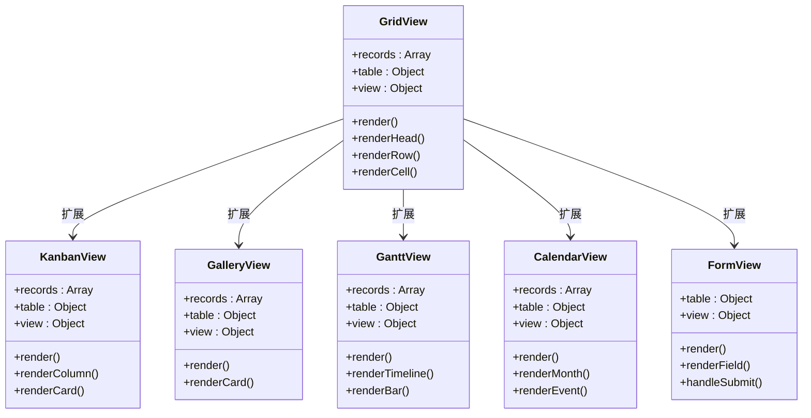

**图表来源**
- [mt-grid.js:14-37](file://js/mt-grid.js#L14-L37)
- [mt-views.js:7-65](file://js/mt-views.js#L7-L65)
- [mt-views.js:68-103](file://js/mt-views.js#L68-L103)
- [mt-views.js:106-194](file://js/mt-views.js#L106-L194)
- [mt-views.js:197-277](file://js/mt-views.js#L197-L277)
- [mt-views.js:289-378](file://js/mt-views.js#L289-L378)

**章节来源**
- [mt-grid.js:14-358](file://js/mt-grid.js#L14-L358)
- [mt-views.js:1-379](file://js/mt-views.js#L1-L379)

### 仪表盘系统

#### 组件化设计

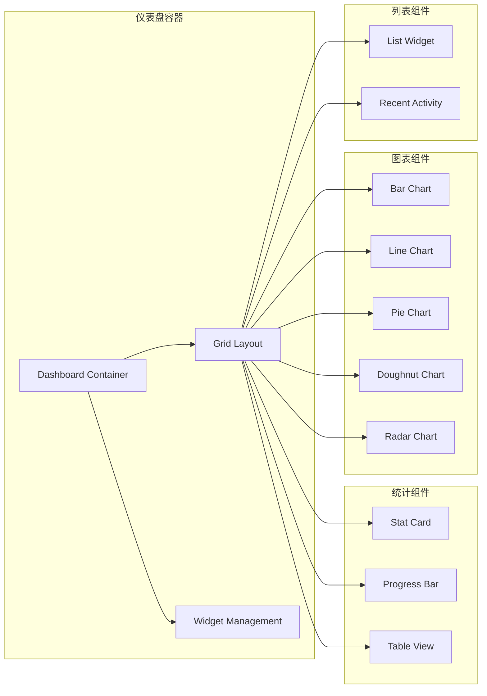

**图表来源**
- [mt-dashboard.js:9-25](file://js/mt-dashboard.js#L9-L25)
- [mt-dashboard.js:28-43](file://js/mt-dashboard.js#L28-L43)
- [mt-dashboard.js:106-172](file://js/mt-dashboard.js#L106-L172)

**章节来源**
- [mt-dashboard.js:1-493](file://js/mt-dashboard.js#L1-L493)

## 依赖关系分析

### 模块依赖图

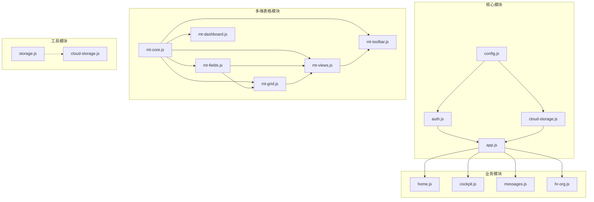

**图表来源**
- [index.html:355-378](file://index.html#L355-L378)
- [app.js:50-83](file://js/app.js#L50-L83)

### 数据流分析

系统采用单向数据流设计，确保数据的一致性和可预测性：

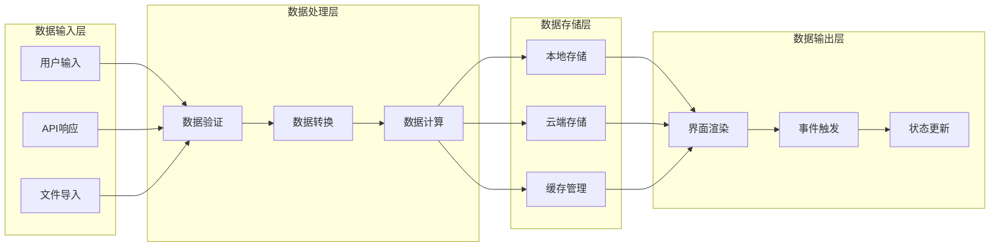

**图表来源**
- [mt-core.js:51-69](file://js/mt-core.js#L51-L69)
- [mt-core.js:395-403](file://js/mt-core.js#L395-L403)

**章节来源**
- [index.html:355-378](file://index.html#L355-L378)
- [mt-core.js:51-69](file://js/mt-core.js#L51-L69)

## 性能考虑

### 内存管理
- 使用防抖机制避免频繁的DOM操作
- 实现垃圾回收友好的数据结构
- 合理的事件监听器管理

### 网络优化
- 云端数据缓存策略
- 批量数据操作减少网络请求
- 懒加载机制优化首屏性能

### 存储优化
- 本地存储容量监控
- 数据压缩和序列化优化
- 增量更新减少存储开销

## 故障排除指南

### 常见问题诊断

#### 认证相关问题
1. **登录失败**: 检查Supabase配置和网络连接
2. **会话丢失**: 验证localStorage权限和存储容量
3. **权限错误**: 确认用户角色和数据访问策略

#### 数据同步问题
1. **数据不同步**: 检查云端连接状态和网络延迟
2. **存储空间不足**: 监控localStorage使用情况
3. **数据损坏**: 实现数据完整性校验和恢复机制

#### 性能问题
1. **页面加载缓慢**: 优化资源加载顺序和压缩策略
2. **交互响应迟缓**: 检查事件处理和DOM操作优化
3. **内存泄漏**: 定期清理事件监听器和定时器

**章节来源**
- [auth.js:50-53](file://js/auth.js#L50-L53)
- [config.js:16-19](file://js/config.js#L16-L19)
- [mt-core.js:70-74](file://js/mt-core.js#L70-L74)

## 结论

本项目展现了现代JavaScript应用开发的最佳实践，通过模块化设计、事件驱动架构和云端集成，构建了一个功能完整的企业级应用。项目在代码组织、数据管理、用户体验等方面都体现了专业的开发水准。

### 主要优势
- **模块化架构**: 清晰的职责分离和依赖管理
- **云端集成**: 完善的云端数据同步机制
- **用户体验**: 流畅的交互设计和响应式布局
- **扩展性**: 灵活的插件系统和组件化设计

### 改进建议
- 实现更完善的错误处理和日志记录
- 增加单元测试和集成测试覆盖率
- 优化代码注释和文档完整性
- 实现自动化部署和持续集成流程