# 开发指南

<cite>
**本文档引用的文件**
- [README.md](file://README.md)
- [DEPLOY.md](file://DEPLOY.md)
- [index.html](file://index.html)
- [database-setup.sql](file://database-setup.sql)
- [js/config.js](file://js/config.js)
- [js/auth.js](file://js/auth.js)
- [js/app.js](file://js/app.js)
- [js/home.js](file://js/home.js)
- [js/cockpit.js](file://js/cockpit.js)
- [js/leads.js](file://js/leads.js)
- [js/storage.js](file://js/storage.js)
- [js/cloud-storage.js](file://js/cloud-storage.js)
- [js/mt-core.js](file://js/mt-core.js)
- [js/multitable.js](file://js/multitable.js)
- [css/style.css](file://css/style.css)
</cite>

## 目录
1. [简介](#简介)
2. [项目结构](#项目结构)
3. [核心组件](#核心组件)
4. [架构概览](#架构概览)
5. [详细组件分析](#详细组件分析)
6. [依赖关系分析](#依赖关系分析)
7. [性能考虑](#性能考虑)
8. [故障排除指南](#故障排除指南)
9. [结论](#结论)
10. [附录](#附录)

## 简介

陈苗财务CRM管理系统是一个基于云端的财务管理解决方案，采用HTML5 + CSS3 + JavaScript技术栈构建。该系统支持用户认证、云端数据存储、多设备同步和数据安全隔离。

### 主要特性
- **用户认证系统**：基于Supabase Auth的邮箱注册/登录
- **云端数据存储**：使用Supabase PostgreSQL数据库
- **多设备同步**：实时数据同步功能
- **数据安全**：行级安全策略(RLS)和JWT会话认证
- **模块化架构**：清晰的功能模块划分

### 技术栈
- **前端**：HTML5 + CSS3 + JavaScript (ES6+)
- **数据库**：Supabase PostgreSQL
- **认证**：Supabase Auth
- **部署**：Vercel (推荐)

## 项目结构

项目采用模块化的文件组织方式，主要分为以下几个部分：

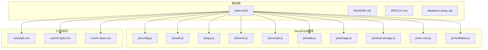

**图表来源**
- [index.html:1-381](file://index.html#L1-L381)
- [js/config.js:1-20](file://js/config.js#L1-L20)
- [css/style.css:1-800](file://css/style.css#L1-L800)

### 文件组织结构

项目采用按功能模块划分的组织方式：

- **核心模块**：config.js、auth.js、app.js
- **业务模块**：home.js、cockpit.js、leads.js等
- **数据模块**：storage.js、cloud-storage.js
- **多维表格模块**：mt-core.js、mt-fields.js、mt-grid.js等
- **样式模块**：style.css、mt-style.css、hr-style.css

**章节来源**
- [README.md:48-65](file://README.md#L48-L65)
- [index.html:1-381](file://index.html#L1-L381)

## 核心组件

### 应用主控制器 (app.js)

应用主控制器负责页面路由管理和模块初始化：

```mermaid
flowchart TD
A[页面加载] --> B[初始化导航事件]
B --> C[处理菜单点击]
C --> D{页面类型判断}
D --> |home| E[Home.init()]
D --> |cockpit| F[Cockpit.init()]
D --> |leads| G[Leads.init()]
D --> |其他| H[显示占位符]
E --> I[清理前一页]
F --> I
G --> I
H --> I
I --> J[更新当前页面状态]
```

**图表来源**
- [js/app.js:85-135](file://js/app.js#L85-L135)

### 认证系统 (auth.js)

认证系统实现了完整的用户认证流程：

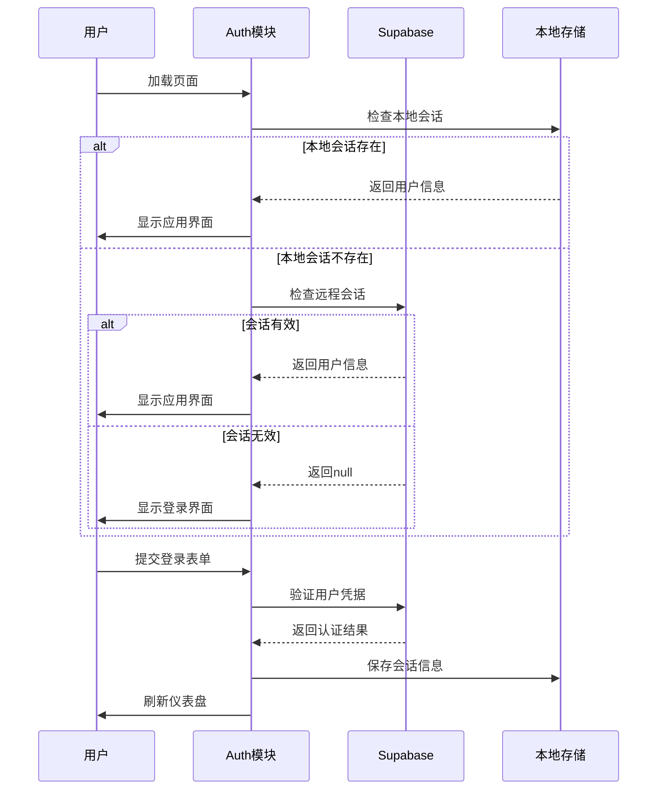

**图表来源**
- [js/auth.js:7-54](file://js/auth.js#L7-L54)
- [js/auth.js:108-151](file://js/auth.js#L108-L151)

### 数据存储层

系统提供了两种数据存储方案：

1. **本地存储**：用于演示和测试
2. **云端存储**：生产环境使用

**章节来源**
- [js/app.js:1-156](file://js/app.js#L1-L156)
- [js/auth.js:1-259](file://js/auth.js#L1-L259)
- [js/storage.js:1-208](file://js/storage.js#L1-L208)
- [js/cloud-storage.js:1-9](file://js/cloud-storage.js#L1-L9)

## 架构概览

系统采用前后端分离的架构设计，结合云端数据库和静态托管服务：

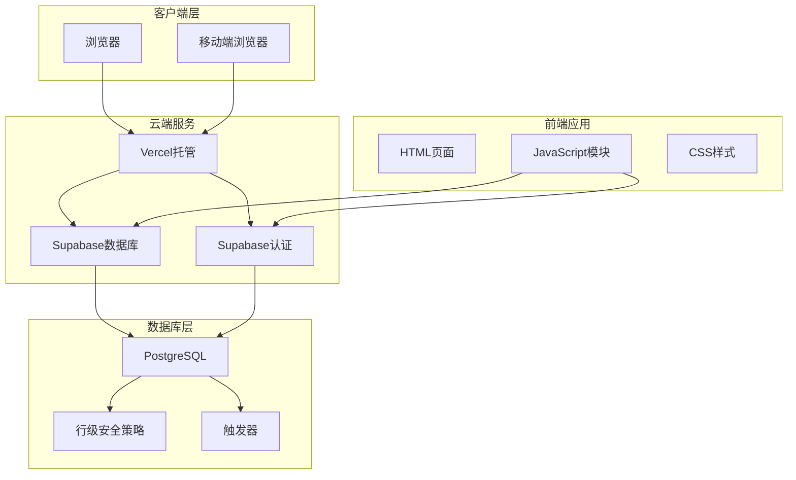

**图表来源**
- [DEPLOY.md:3-7](file://DEPLOY.md#L3-L7)
- [database-setup.sql:78-107](file://database-setup.sql#L78-L107)

### 数据流架构

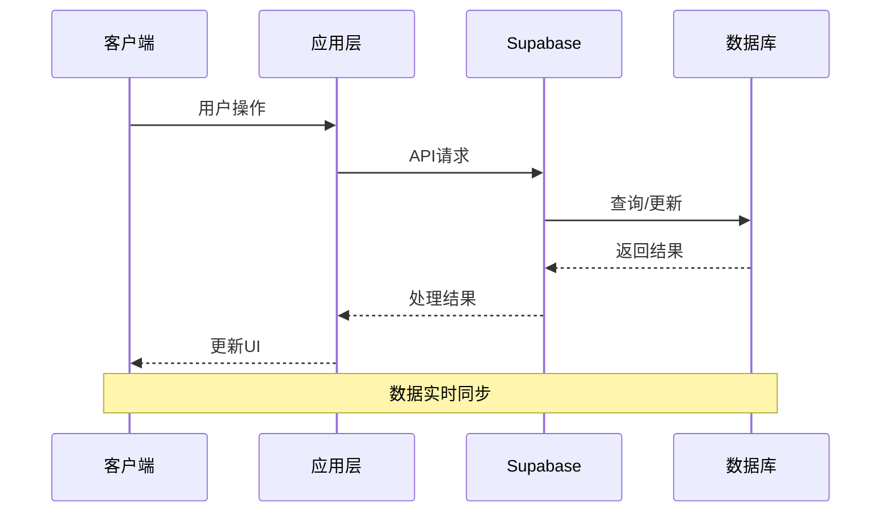

**图表来源**
- [js/config.js:8-19](file://js/config.js#L8-L19)
- [js/auth.js:57-65](file://js/auth.js#L57-L65)

## 详细组件分析

### 首页模块 (home.js)

首页模块提供用户欢迎界面和快捷功能入口：

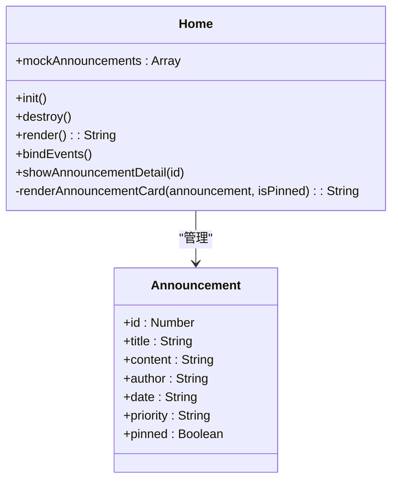

**图表来源**
- [js/home.js:8-266](file://js/home.js#L8-L266)

### 老板驾驶舱 (cockpit.js)

驾驶舱模块提供数据分析和可视化功能：

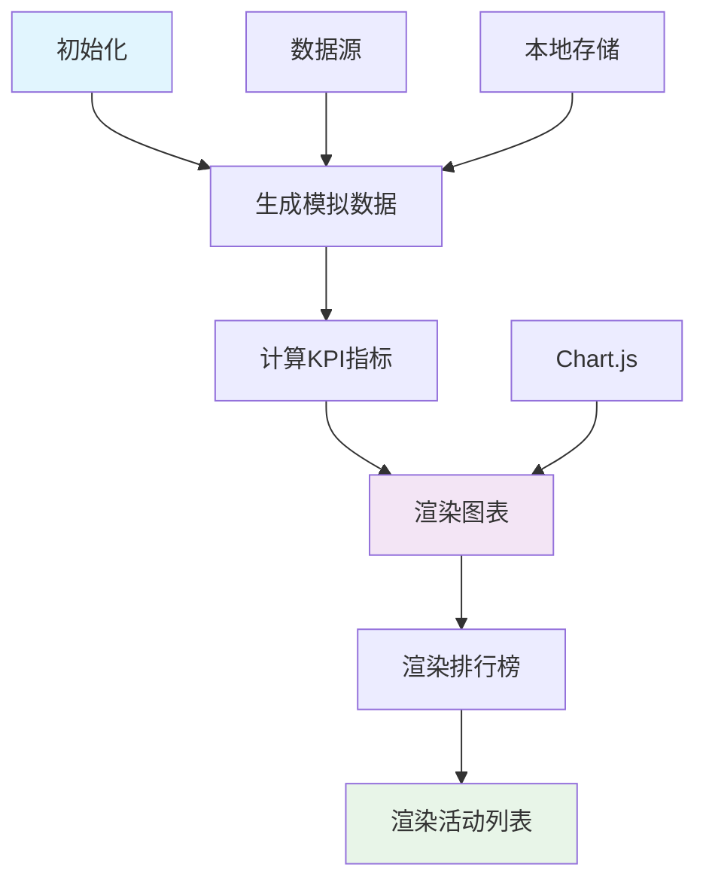

**图表来源**
- [js/cockpit.js:217-224](file://js/cockpit.js#L217-L224)
- [js/cockpit.js:342-347](file://js/cockpit.js#L342-L347)

### 线索管理 (leads.js)

线索管理模块实现完整的CRM功能：

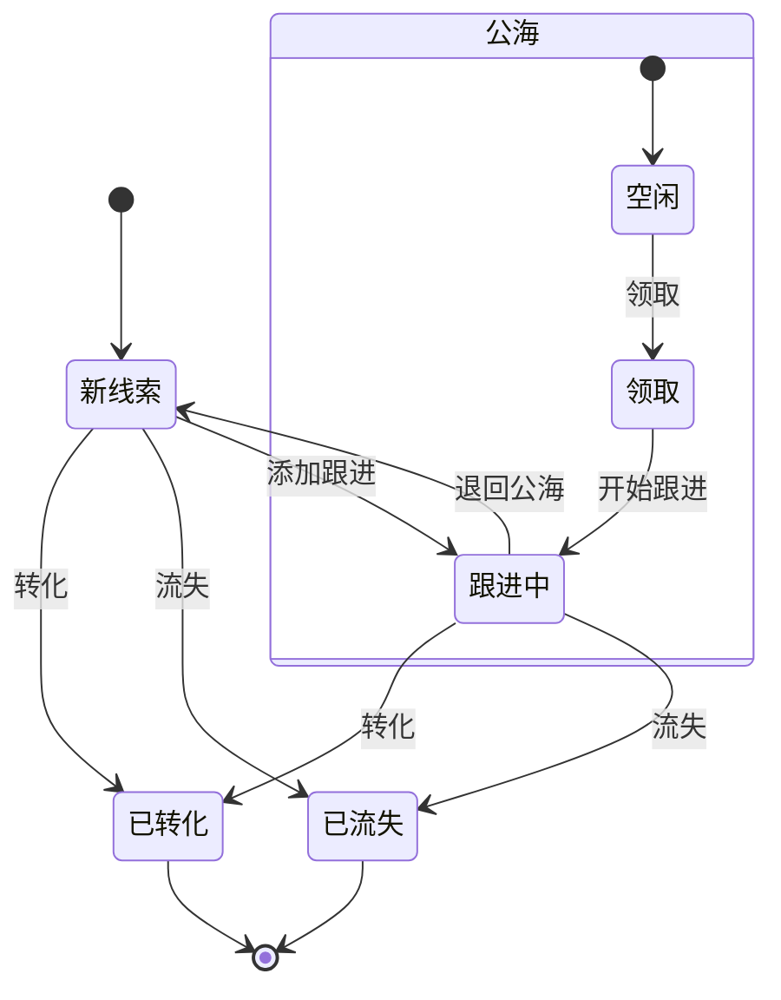

**图表来源**
- [js/leads.js:105-122](file://js/leads.js#L105-L122)

### 多维表格系统

多维表格系统采用模块化设计：

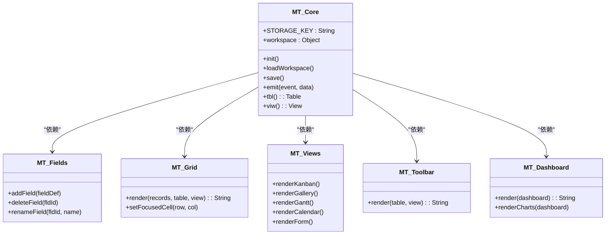

**图表来源**
- [js/mt-core.js:8-117](file://js/mt-core.js#L8-L117)
- [js/multitable.js:7-43](file://js/multitable.js#L7-L43)

**章节来源**
- [js/home.js:1-266](file://js/home.js#L1-L266)
- [js/cockpit.js:1-624](file://js/cockpit.js#L1-L624)
- [js/leads.js:1-679](file://js/leads.js#L1-L679)
- [js/mt-core.js:1-200](file://js/mt-core.js#L1-L200)
- [js/multitable.js:1-200](file://js/multitable.js#L1-L200)

## 依赖关系分析

### 模块依赖图

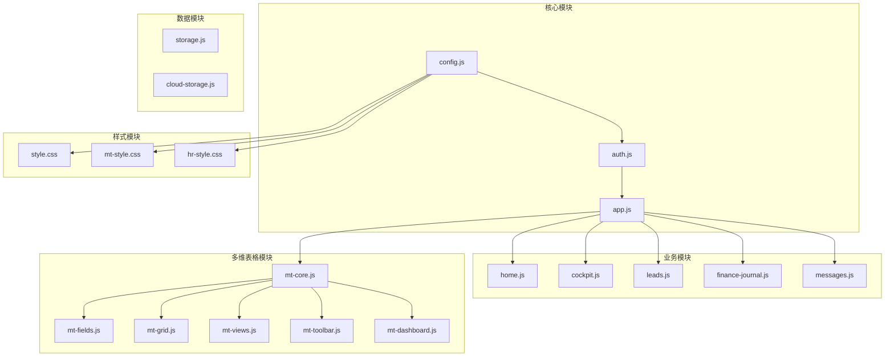

**图表来源**
- [index.html:355-378](file://index.html#L355-L378)
- [js/app.js:3-31](file://js/app.js#L3-L31)

### 数据流依赖

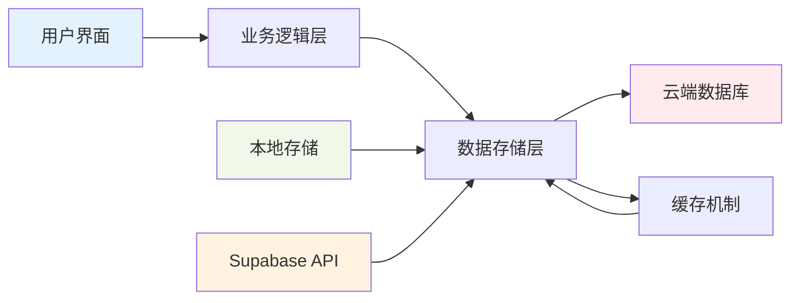

**图表来源**
- [js/storage.js:1-88](file://js/storage.js#L1-L88)
- [js/cloud-storage.js:1-9](file://js/cloud-storage.js#L1-L9)

**章节来源**
- [index.html:355-378](file://index.html#L355-L378)
- [js/app.js:1-156](file://js/app.js#L1-L156)

## 性能考虑

### 内存管理最佳实践

1. **模块销毁机制**
   - 每个模块都实现了 `destroy()` 方法
   - 清理DOM事件监听器
   - 释放图表资源

2. **数据缓存策略**
   - 使用localStorage减少网络请求
   - 实现增量更新机制
   - 避免重复渲染

3. **资源优化**
   - 按需加载JavaScript模块
   - 图表延迟初始化
   - 事件委托减少监听器数量

### 性能监控

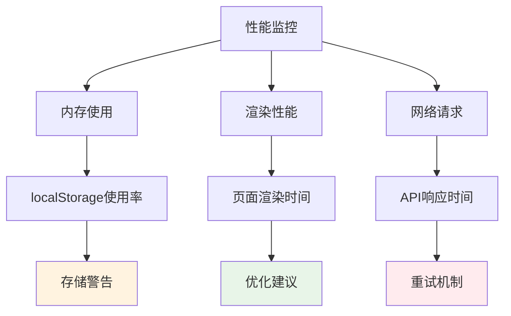

### 优化建议

1. **代码分割**：按需加载非关键模块
2. **虚拟滚动**：大数据集使用虚拟滚动
3. **防抖节流**：输入框和搜索功能使用防抖
4. **懒加载**：图片和大组件懒加载

## 故障排除指南

### 常见问题及解决方案

#### 认证相关问题

| 问题 | 可能原因 | 解决方案 |
|------|----------|----------|
| 登录失败 | 凭据错误或网络问题 | 检查用户名密码，确认Supabase连接 |
| 会话过期 | JWT令牌失效 | 重新登录，检查浏览器存储 |
| 多设备不同步 | 云端连接异常 | 检查网络，重启应用 |

#### 数据相关问题

| 问题 | 可能原因 | 解决方案 |
|------|----------|----------|
| 数据丢失 | 本地存储空间不足 | 清理浏览器缓存，检查存储配额 |
| 同步延迟 | 网络延迟 | 等待自动同步完成 |
| 权限问题 | RLS策略限制 | 检查用户权限设置 |

#### 性能问题

| 问题 | 可能原因 | 解决方案 |
|------|----------|----------|
| 页面加载慢 | 资源过大 | 启用代码分割，压缩资源 |
| 操作卡顿 | DOM过多 | 实施虚拟滚动，优化渲染 |
| 图表渲染慢 | 数据量大 | 分批渲染，使用Web Workers |

### 调试技巧

1. **浏览器开发者工具**
   - 使用Network面板监控API请求
   - 使用Console面板查看错误信息
   - 使用Performance面板分析性能

2. **日志记录**
   - 在关键函数添加console.log
   - 使用try-catch捕获异常
   - 记录用户操作轨迹

3. **断点调试**
   - 在异步操作处设置断点
   - 监控Promise状态变化
   - 跟踪数据流向

**章节来源**
- [DEPLOY.md:164-190](file://DEPLOY.md#L164-L190)
- [js/auth.js:50-54](file://js/auth.js#L50-L54)

## 结论

陈苗财务CRM管理系统采用现代化的技术架构，提供了完整的云端CRM解决方案。系统具有良好的模块化设计、清晰的代码结构和完善的错误处理机制。

### 优势特点
- **技术先进**：采用最新的Web技术栈
- **架构清晰**：模块化设计便于维护和扩展
- **安全可靠**：基于Supabase的完整安全体系
- **易于部署**：支持多种部署方式

### 改进建议
1. **测试覆盖**：增加单元测试和集成测试
2. **文档完善**：补充API文档和开发指南
3. **性能优化**：实施更严格的性能监控
4. **用户体验**：优化移动端适配

## 附录

### 开发环境配置

#### 必需工具
- **Node.js**：版本14+
- **文本编辑器**：VS Code推荐
- **浏览器**：Chrome最新版本
- **Git**：版本控制系统

#### 项目设置步骤

1. **克隆项目**
   ```bash
   git clone <repository-url>
   cd 陈苗
   ```

2. **安装依赖**
   ```bash
   # 项目无需npm依赖，直接运行即可
   ```

3. **配置Supabase**
   - 创建Supabase项目
   - 执行数据库初始化脚本
   - 配置认证设置

4. **本地测试**
   ```bash
   # 直接用浏览器打开index.html
   ```

#### 开发工作流程

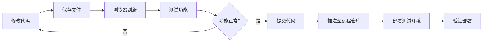

### 版本控制规范

#### 分支管理
- **main**：生产环境代码
- **develop**：开发环境代码
- **feature/**：功能开发分支
- **hotfix/**：紧急修复分支

#### 提交规范
```text
<type>(<scope>): <subject>

<body>

<footer>
```

#### 示例
```text
feat(auth): 添加邮箱验证功能

- 实现邮箱验证逻辑
- 添加验证邮件发送
- 更新用户状态管理

Closes #123
```

### 部署流程

#### 生产环境部署

1. **代码审查**
   - 代码质量检查
   - 安全性评估
   - 性能测试

2. **构建优化**
   - 代码压缩
   - 资源优化
   - 缓存配置

3. **部署执行**
   - 部署到Vercel
   - 配置域名
   - 启用HTTPS

4. **验证测试**
   - 功能完整性测试
   - 性能基准测试
   - 安全性检查

#### 回滚机制
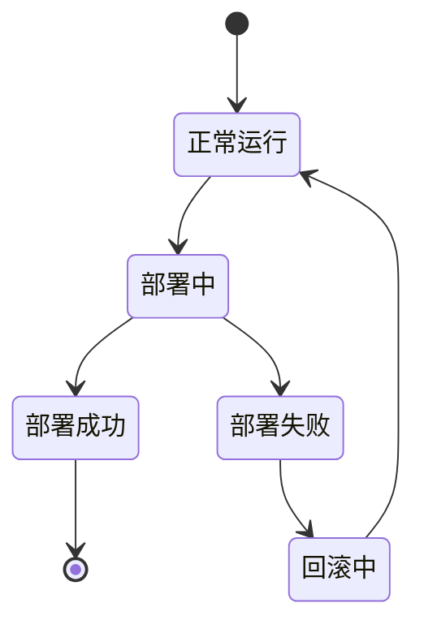

**章节来源**
- [README.md:67-87](file://README.md#L67-L87)
- [DEPLOY.md:1-224](file://DEPLOY.md#L1-L224)
- [database-setup.sql:1-148](file://database-setup.sql#L1-L148)