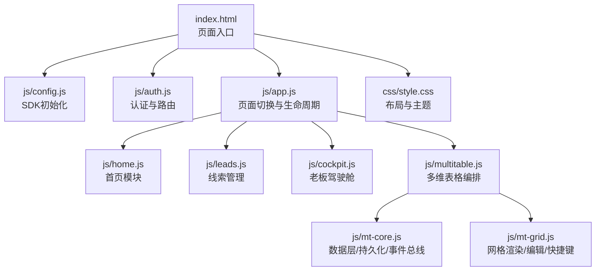
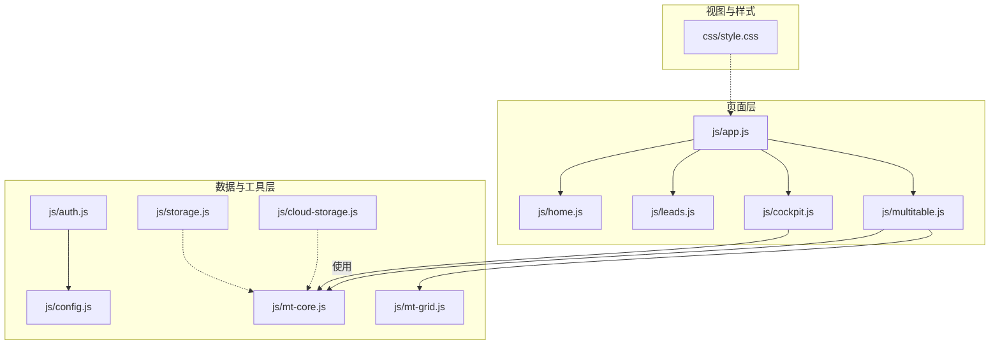
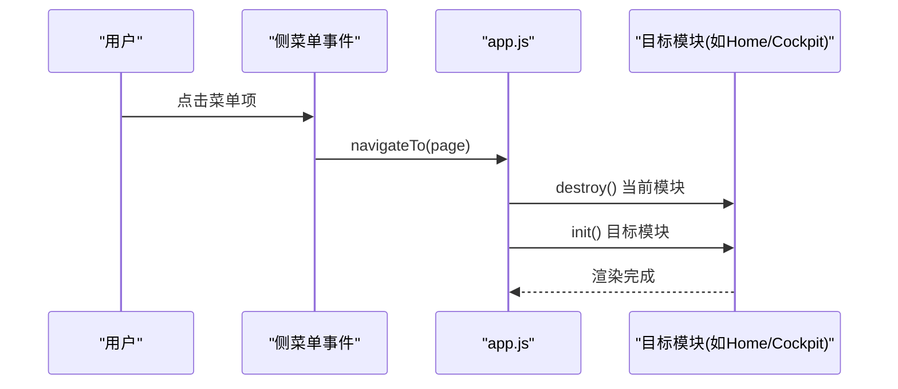
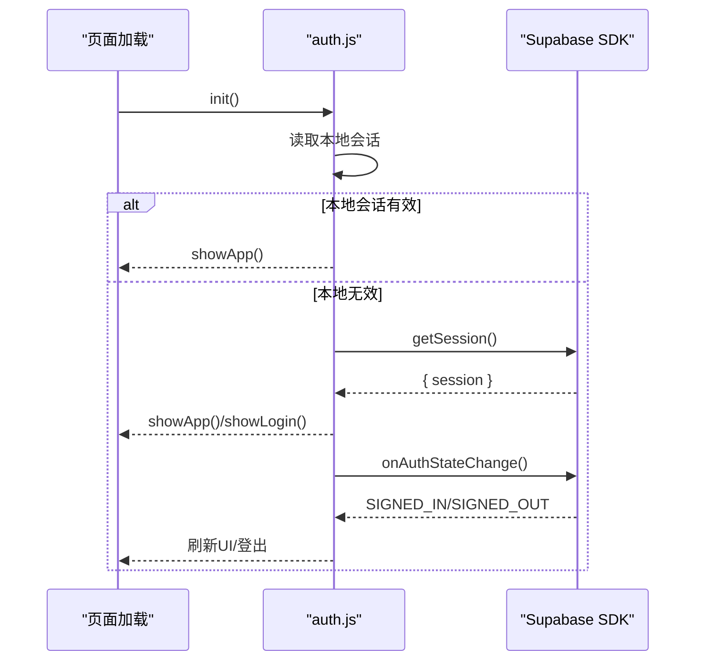
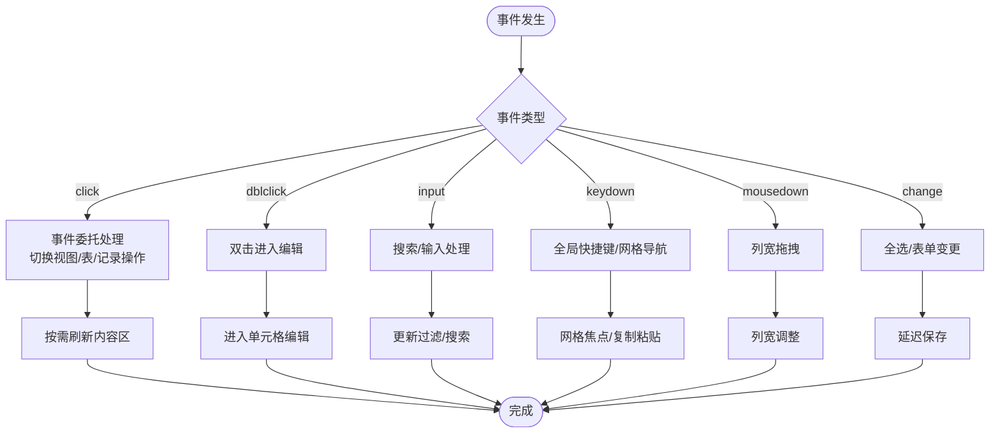
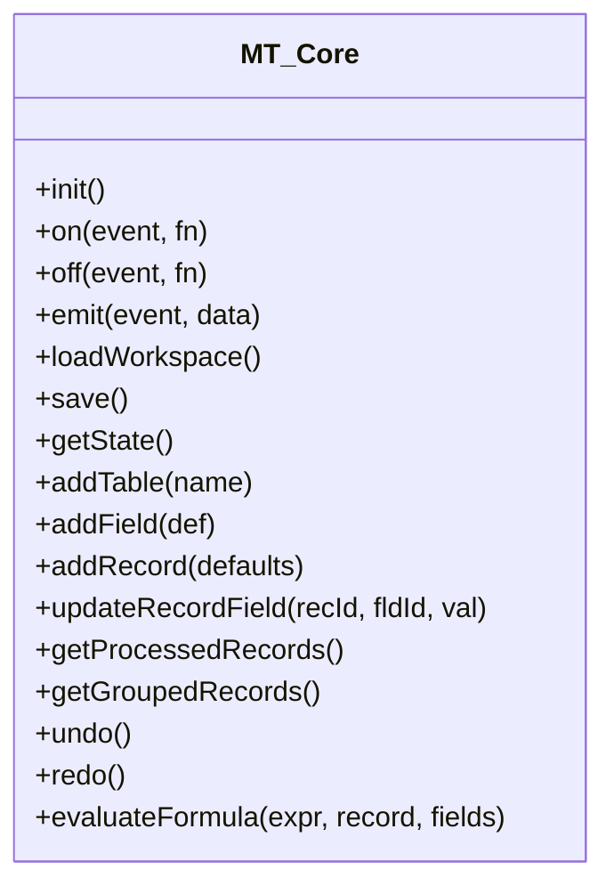
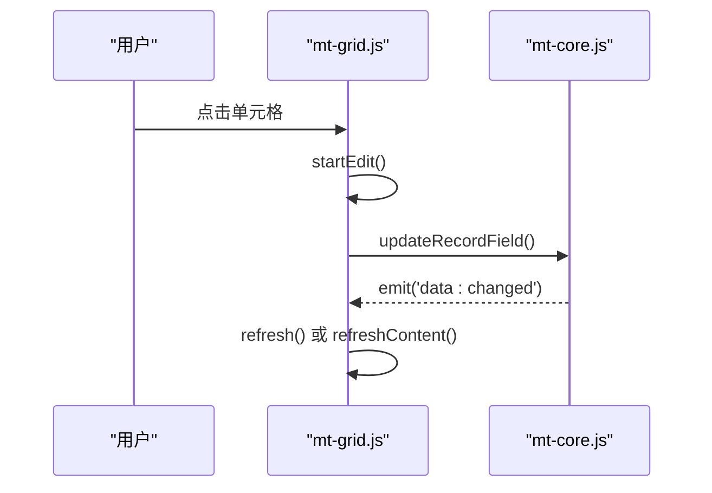
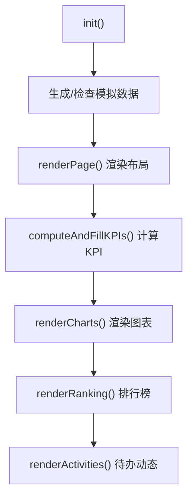
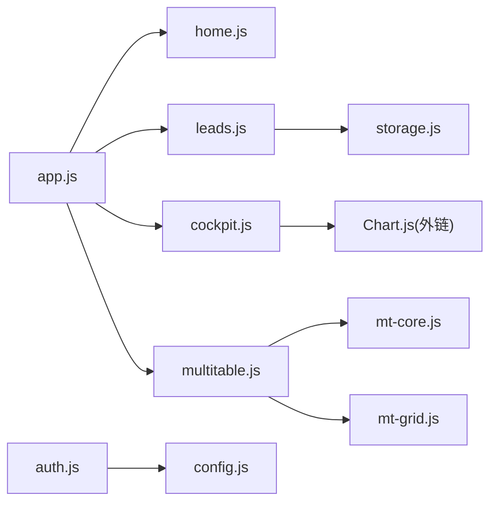

# 性能优化

<cite>
**本文档引用的文件**
- [index.html](file://index.html)
- [README.md](file://README.md)
- [js/app.js](file://js/app.js)
- [js/auth.js](file://js/auth.js)
- [js/config.js](file://js/config.js)
- [js/storage.js](file://js/storage.js)
- [js/leads.js](file://js/leads.js)
- [js/home.js](file://js/home.js)
- [js/cockpit.js](file://js/cockpit.js)
- [js/multitable.js](file://js/multitable.js)
- [js/mt-core.js](file://js/mt-core.js)
- [js/mt-grid.js](file://js/mt-grid.js)
- [js/cloud-storage.js](file://js/cloud-storage.js)
- [css/style.css](file://css/style.css)
</cite>

## 目录
1. [简介](#简介)
2. [项目结构](#项目结构)
3. [核心组件](#核心组件)
4. [架构总览](#架构总览)
5. [详细组件分析](#详细组件分析)
6. [依赖关系分析](#依赖关系分析)
7. [性能考量](#性能考量)
8. [故障排查指南](#故障排查指南)
9. [结论](#结论)
10. [附录](#附录)

## 简介
本文件面向“前端性能优化与内存管理”的最佳实践，结合仓库现有代码结构与实现，系统性梳理前端性能优化策略（JavaScript 优化、DOM 操作优化、事件处理优化）、网络请求优化（缓存策略、请求合并、异步加载）、内存泄漏预防与检测、图片与静态资源优化、移动端性能优化要点，并给出性能监控与分析工具的使用建议及具体性能指标与基准测试方法。

## 项目结构
该项目采用“HTML + CSS + 原生 JavaScript”纯前端架构，模块化拆分为多个功能页面与共享模块：
- 入口页面：index.html
- 应用主逻辑：js/app.js
- 认证模块：js/auth.js
- 配置模块：js/config.js
- 本地存储：js/storage.js
- 云端存储占位：js/cloud-storage.js
- 功能模块：leads.js、home.js、cockpit.js、multitable.js 等
- 多维表格核心与网格：js/mt-core.js、js/mt-grid.js
- 样式：css/style.css

**图表来源**
- [index.html](file://index.html)
- [js/app.js](file://js/app.js)
- [js/auth.js](file://js/auth.js)
- [js/config.js](file://js/config.js)
- [js/leads.js](file://js/leads.js)
- [js/home.js](file://js/home.js)
- [js/cockpit.js](file://js/cockpit.js)
- [js/multitable.js](file://js/multitable.js)
- [js/mt-core.js](file://js/mt-core.js)
- [js/mt-grid.js](file://js/mt-grid.js)
- [css/style.css](file://css/style.css)

**章节来源**
- [index.html](file://index.html)
- [README.md](file://README.md)

## 核心组件
- 应用主控制器：负责页面切换、模块销毁、全局工具函数与生命周期钩子。
- 认证模块：负责登录/注册/登出、会话监听、UI 切换与加载态。
- 多维表格编排层：负责页面骨架、事件委托、视图切换、记录面板等。
- 数据层与网格：负责数据持久化、CRUD、视图过滤/排序/分组、键盘导航、复制粘贴、列宽拖拽等。
- 本地存储：封装 localStorage 的 CRUD 与导入导出。
- 驱动舱模块：负责图表渲染与 KPI 计算，涉及大量 DOM 与 Canvas 操作。

**章节来源**
- [js/app.js](file://js/app.js)
- [js/auth.js](file://js/auth.js)
- [js/multitable.js](file://js/multitable.js)
- [js/mt-core.js](file://js/mt-core.js)
- [js/mt-grid.js](file://js/mt-grid.js)
- [js/storage.js](file://js/storage.js)
- [js/cockpit.js](file://js/cockpit.js)

## 架构总览
整体采用“页面级模块 + 数据层模块”的分层架构，页面模块通过事件委托与轻量路由进行交互；数据层模块负责状态管理、持久化与计算；图表模块独立渲染，避免阻塞主线程。

**图表来源**
- [js/app.js](file://js/app.js)
- [js/auth.js](file://js/auth.js)
- [js/config.js](file://js/config.js)
- [js/storage.js](file://js/storage.js)
- [js/cloud-storage.js](file://js/cloud-storage.js)
- [js/leads.js](file://js/leads.js)
- [js/home.js](file://js/home.js)
- [js/cockpit.js](file://js/cockpit.js)
- [js/multitable.js](file://js/multitable.js)
- [js/mt-core.js](file://js/mt-core.js)
- [js/mt-grid.js](file://js/mt-grid.js)
- [css/style.css](file://css/style.css)

## 详细组件分析

### 页面切换与生命周期（js/app.js）
- 使用事件委托处理左侧菜单点击，支持子菜单展开/收起与页面跳转。
- 在离开页面时调用模块的 destroy 方法释放资源（如图表销毁）。
- 提供全局工具函数与页面占位渲染。

**图表来源**
- [js/app.js](file://js/app.js)

**章节来源**
- [js/app.js](file://js/app.js)

### 认证与会话（js/auth.js）
- 初始化时优先读取本地会话，再尝试 Supabase 会话；监听认证状态变化，触发 UI 切换与数据刷新。
- 登录/注册/登出均使用异步流程，配合加载态遮罩。
- 提供本地测试账号逻辑，便于开发调试。

**图表来源**
- [js/auth.js](file://js/auth.js)
- [js/config.js](file://js/config.js)

**章节来源**
- [js/auth.js](file://js/auth.js)
- [js/config.js](file://js/config.js)

### 多维表格编排层（js/multitable.js）
- 事件委托集中处理：点击、双击、输入、键盘、鼠标按下、变更等。
- 全局快捷键：撤销/重做、复制/粘贴、ESC 关闭面板/模态框。
- 侧边栏/顶栏/内容区三段式布局，按需刷新。
- 记录详情面板采用 Overlay 方案，减少 DOM 重建。

**图表来源**
- [js/multitable.js](file://js/multitable.js)
- [js/mt-grid.js](file://js/mt-grid.js)

**章节来源**
- [js/multitable.js](file://js/multitable.js)
- [js/mt-grid.js](file://js/mt-grid.js)

### 数据层与持久化（js/mt-core.js）
- 事件总线：统一的数据变更通知，避免跨模块耦合。
- 持久化：localStorage 分批保存，带节流与配额警告。
- 数据管道：过滤、排序、搜索、分组，支持视图维度组合。
- 撤销/重做：基于动作栈，限制长度，保证性能。
- 公式引擎：安全表达式求值，避免 eval 风险。

**图表来源**
- [js/mt-core.js](file://js/mt-core.js)

**章节来源**
- [js/mt-core.js](file://js/mt-core.js)

### 网格渲染与交互（js/mt-grid.js）
- 渲染策略：按可见字段与视图配置生成 DOM，支持冻结列、行高、条件着色。
- 编辑策略：单元格编辑器按字段类型创建，支持即时编辑与下拉编辑。
- 键盘导航：方向键移动焦点、Enter 编辑、Delete 清空、Tab 切换。
- 复制粘贴：支持单值与多单元格粘贴，自动类型转换。
- 列宽拖拽：按字段粒度调整宽度，批量更新样式。

**图表来源**
- [js/mt-grid.js](file://js/mt-grid.js)
- [js/mt-core.js](file://js/mt-core.js)

**章节来源**
- [js/mt-grid.js](file://js/mt-grid.js)
- [js/mt-core.js](file://js/mt-core.js)

### 驱动舱（js/cockpit.js）
- 模拟数据生成：首次访问生成本地模拟数据，避免空数据影响体验。
- 图表渲染：使用 Chart.js 渲染多类图表，支持销毁复用。
- KPI 计算：基于本地数据聚合，格式化展示。
- 活动与排行：基于线索与合同数据生成待办与排行。

**图表来源**
- [js/cockpit.js](file://js/cockpit.js)

**章节来源**
- [js/cockpit.js](file://js/cockpit.js)

### 线索管理（js/leads.js）
- 本地存储封装：统一的 CRUD 与批量导入。
- 自动回收：7 天未跟进自动退回公海。
- 搜索与筛选：防抖搜索、多维筛选。
- 详情面板：弹窗式详情，支持状态变更、跟进记录、删除。

**章节来源**
- [js/leads.js](file://js/leads.js)
- [js/storage.js](file://js/storage.js)

### 首页（js/home.js）
- 快捷入口与公告卡片，使用转义函数防止 XSS。
- 待办与快速数据模块，布局简洁。

**章节来源**
- [js/home.js](file://js/home.js)

## 依赖关系分析
- js/app.js 作为页面级编排，依赖各模块 init/destroy。
- js/multitable.js 依赖 js/mt-core.js 与 js/mt-grid.js，形成“编排-数据-渲染”三层。
- js/leads.js 依赖本地存储模块。
- js/auth.js 依赖 js/config.js 与 Supabase SDK。
- js/cockpit.js 依赖 Chart.js 与本地模拟数据。

**图表来源**
- [js/app.js](file://js/app.js)
- [js/multitable.js](file://js/multitable.js)
- [js/mt-core.js](file://js/mt-core.js)
- [js/mt-grid.js](file://js/mt-grid.js)
- [js/leads.js](file://js/leads.js)
- [js/storage.js](file://js/storage.js)
- [js/auth.js](file://js/auth.js)
- [js/config.js](file://js/config.js)
- [js/cockpit.js](file://js/cockpit.js)
- [index.html](file://index.html)

**章节来源**
- [js/app.js](file://js/app.js)
- [js/multitable.js](file://js/multitable.js)
- [js/mt-core.js](file://js/mt-core.js)
- [js/mt-grid.js](file://js/mt-grid.js)
- [js/leads.js](file://js/leads.js)
- [js/storage.js](file://js/storage.js)
- [js/auth.js](file://js/auth.js)
- [js/config.js](file://js/config.js)
- [js/cockpit.js](file://js/cockpit.js)
- [index.html](file://index.html)

## 性能考量

### JavaScript 代码优化
- 事件委托与按需刷新：多维表格采用事件委托集中处理，减少重复绑定；仅刷新内容区，避免整页重绘。
- 防抖与节流：搜索输入使用防抖，降低频繁过滤带来的计算压力。
- 延迟保存：数据层对保存操作进行节流，避免频繁写入 localStorage。
- 撤销/重做栈限制：控制动作栈长度，避免内存膨胀。
- 安全表达式：公式引擎使用白名单与安全求值，避免高风险计算。

**章节来源**
- [js/multitable.js](file://js/multitable.js)
- [js/mt-core.js](file://js/mt-core.js)
- [js/mt-grid.js](file://js/mt-grid.js)

### DOM 操作优化
- 模块销毁：离开页面时调用 destroy，释放图表与事件监听，避免残留节点与监听器。
- 模态框与详情面板：采用 Overlay 方案，减少 DOM 重建。
- 列宽拖拽：按字段批量更新样式，避免逐元素遍历。
- 冻结列：使用 position: sticky 与 left 偏移，减少滚动时重排。

**章节来源**
- [js/app.js](file://js/app.js)
- [js/multitable.js](file://js/multitable.js)
- [js/mt-grid.js](file://js/mt-grid.js)

### 事件处理优化
- 事件委托：统一在容器上绑定事件，减少事件冒泡与捕获开销。
- 全局快捷键：集中处理 Ctrl+Z/Y、Ctrl+C/V、Esc 等，避免重复监听。
- 输入事件防抖：搜索框输入使用定时器去抖，降低过滤频率。

**章节来源**
- [js/multitable.js](file://js/multitable.js)
- [js/leads.js](file://js/leads.js)

### 网络请求优化
- Supabase SDK：通过配置模块统一初始化，支持本地降级与错误提示。
- 云端存储占位：预留云端同步能力，建议后续实现增量同步与离线队列。
- 资源版本：HTML 中静态资源带版本参数，便于缓存失效与更新。

**章节来源**
- [js/config.js](file://js/config.js)
- [js/cloud-storage.js](file://js/cloud-storage.js)
- [index.html](file://index.html)

### 内存泄漏预防与检测
- 模块销毁：每个页面模块提供 destroy，调用时清理图表实例与事件监听。
- 事件解绑：多维表格在 destroy 中移除全局键盘监听与事件总线监听。
- 本地存储配额：保存失败时发出存储警告，提示用户清理或降级数据规模。
- DOM 泄漏：Overlay 面板在关闭时移除，避免残留节点。

**章节来源**
- [js/app.js](file://js/app.js)
- [js/multitable.js](file://js/multitable.js)
- [js/mt-core.js](file://js/mt-core.js)

### 图片与静态资源优化
- 外链资源：使用 CDN 加载 Chart.js 与 Font Awesome，利用浏览器缓存与边缘加速。
- 版本参数：CSS/JS 引用带版本参数，便于强制刷新。
- SVG：大量使用 SVG 图标，体积小、可缩放、无需额外请求。

**章节来源**
- [index.html](file://index.html)

### 移动端性能优化
- 视口设置：HTML 中设置 viewport，适配移动端宽度。
- 网格行高与冻结列：通过视图配置支持紧凑/高密度展示，减少滚动与重排。
- 键盘导航：支持方向键与 Tab 导航，提升移动端可访问性。

**章节来源**
- [index.html](file://index.html)
- [js/mt-grid.js](file://js/mt-grid.js)

### 性能监控与分析工具
- 浏览器开发者工具：使用 Performance 面板录制交互，定位长任务与重排热点。
- Lighthouse：定期跑分，关注首屏加载、交互延迟、内存占用等指标。
- 控制台日志：对关键路径（保存、渲染、图表）输出耗时日志，辅助定位瓶颈。
- 存储监控：观察 localStorage 使用量与配额警告，避免超出上限导致失败。

**章节来源**
- [js/mt-core.js](file://js/mt-core.js)

### 具体性能指标与基准测试
- 首屏时间：从导航到首页内容渲染完成的时间。
- 交互延迟：点击菜单到页面切换完成的时间。
- 图表渲染：绘制多类图表的耗时，建议分步渲染与延迟初始化。
- 数据量扩展：在不同记录数量下测量过滤/排序/分组的响应时间。
- 内存占用：长时间运行后检查内存增长，确保 destroy 与事件解绑生效。

[本节为通用指导，不直接分析具体文件]

## 故障排查指南
- 登录/认证异常：检查 Supabase 初始化与会话监听，确认网络与凭证配置。
- 页面切换卡顿：检查是否存在未销毁的图表或未解绑的事件监听。
- 搜索无响应：确认防抖定时器是否正确清理与重置。
- 保存失败：查看存储配额警告，必要时清理历史数据或降低数据规模。
- 图表不刷新：确认 destroy 是否被调用以及事件总线是否正常触发。

**章节来源**
- [js/auth.js](file://js/auth.js)
- [js/app.js](file://js/app.js)
- [js/mt-core.js](file://js/mt-core.js)
- [js/leads.js](file://js/leads.js)

## 结论
本项目在页面级模块化、事件委托与按需刷新方面具备良好基础，数据层通过事件总线与持久化策略提升了可维护性。建议在后续迭代中引入：
- 更细粒度的懒加载与虚拟滚动（针对大数据集）
- 离线优先的数据同步与冲突解决
- 性能埋点与基准测试体系
- 图表与复杂渲染的异步化与分帧渲染

[本节为总结性内容，不直接分析具体文件]

## 附录
- 依赖项：Chart.js、Font Awesome、Supabase JS SDK
- 部署建议：使用 CDN 与版本参数优化缓存，结合压缩与按需加载

**章节来源**
- [index.html](file://index.html)
- [README.md](file://README.md)