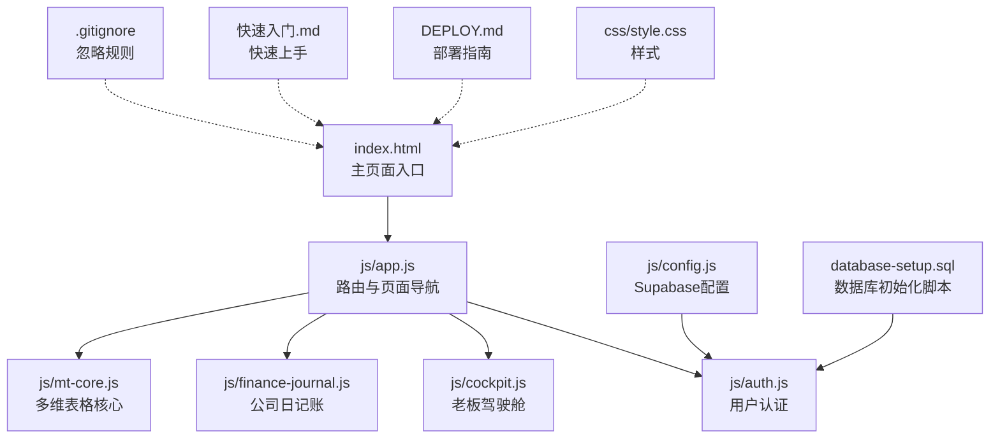
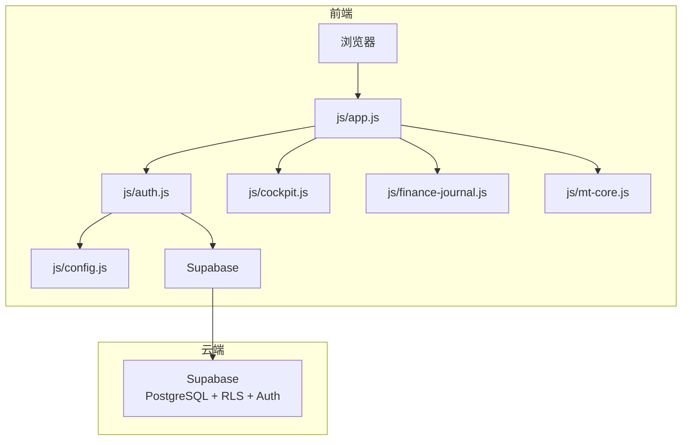
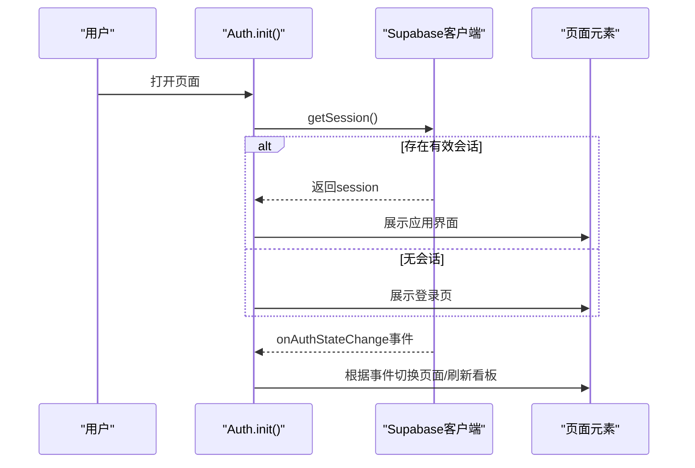
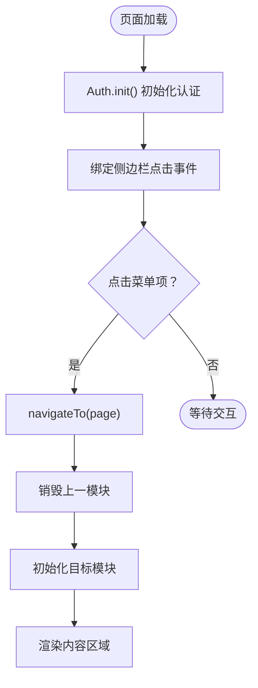
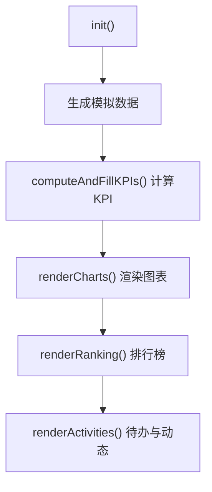
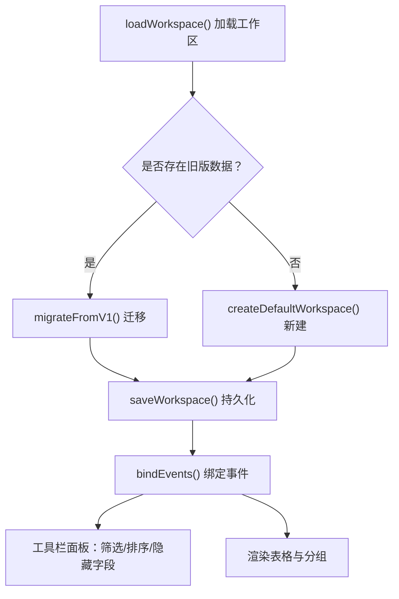
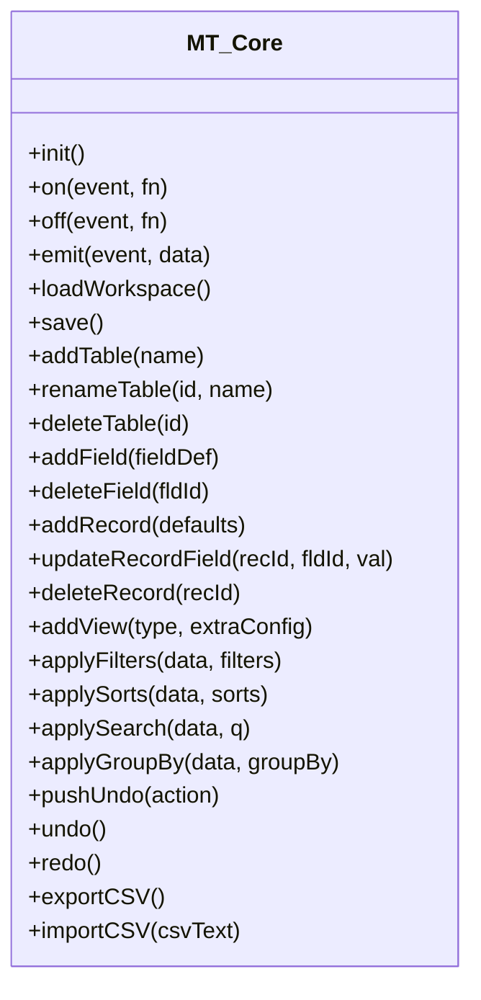
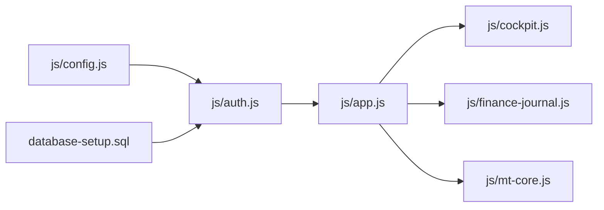

# 版本控制与协作

<cite>
**本文引用的文件**
- [README.md](file://README.md)
- [DEPLOY.md](file://DEPLOY.md)
- [快速入门.md](file://快速入门.md)
- [.gitignore](file://.gitignore)
- [database-setup.sql](file://database-setup.sql)
- [js/config.js](file://js/config.js)
- [js/auth.js](file://js/auth.js)
- [js/cloud-storage.js](file://js/cloud-storage.js)
- [js/app.js](file://js/app.js)
- [js/cockpit.js](file://js/cockpit.js)
- [js/finance-journal.js](file://js/finance-journal.js)
- [js/mt-core.js](file://js/mt-core.js)
</cite>

## 目录
1. [简介](#简介)
2. [项目结构](#项目结构)
3. [核心组件](#核心组件)
4. [架构总览](#架构总览)
5. [详细组件分析](#详细组件分析)
6. [依赖关系分析](#依赖关系分析)
7. [性能考量](#性能考量)
8. [故障排查指南](#故障排查指南)
9. [结论](#结论)
10. [附录](#附录)

## 简介
本项目是一个基于前端技术栈的财务CRM系统，采用Supabase作为后端数据库与认证服务，前端通过浏览器直连云端，实现用户认证、数据存储与多设备同步。项目当前处于云端版v2.0阶段，具备用户数据隔离与行级安全策略（RLS），并提供部署到Vercel的完整指南。

为支撑团队协作与高质量交付，本文档围绕“版本控制与团队协作”主题，结合现有项目现状，给出Git工作流、分支管理、合并策略、冲突解决、代码审查与PR规范、版本标签与发布管理、CI/CD配置思路、沟通与文档管理、以及备份与灾难恢复策略，并提供可落地的模板与示例。

## 项目结构
项目采用按功能模块划分的前端组织方式，核心入口为index.html，样式位于css目录，业务逻辑分布在js目录下的多个模块；数据库初始化脚本位于根目录；部署与快速上手文档分别位于根目录与中文文档。

**图表来源**
- [index.html](file://index.html)
- [js/app.js](file://js/app.js)
- [js/auth.js](file://js/auth.js)
- [js/cockpit.js](file://js/cockpit.js)
- [js/finance-journal.js](file://js/finance-journal.js)
- [js/mt-core.js](file://js/mt-core.js)
- [css/style.css](file://css/style.css)
- [js/config.js](file://js/config.js)
- [database-setup.sql](file://database-setup.sql)
- [DEPLOY.md](file://DEPLOY.md)
- [快速入门.md](file://快速入门.md)
- [.gitignore](file://.gitignore)

**章节来源**
- [README.md:48-65](file://README.md#L48-L65)
- [DEPLOY.md:1-10](file://DEPLOY.md#L1-L10)
- [快速入门.md:32-44](file://快速入门.md#L32-L44)

## 核心组件
- 应用入口与路由：负责页面导航、模块切换与占位渲染。
- 认证模块：处理登录、注册、登出与会话监听，兼容本地测试与Supabase会话。
- 业务模块：
  - 老板驾驶舱：模拟数据生成与可视化展示。
  - 公司日记账：多表管理、工具栏、筛选/排序/分组/隐藏/搜索、列右键菜单等。
  - 多维表格核心：事件总线、持久化、CRUD、数据管道、撤销/重做、公式引擎、仪表盘与导入导出。
- 云端存储：提供云存储可用性检测（待实现）。
- Supabase配置：集中管理项目URL与密钥，初始化客户端。

**章节来源**
- [js/app.js:1-156](file://js/app.js#L1-L156)
- [js/auth.js:1-259](file://js/auth.js#L1-L259)
- [js/cockpit.js:1-624](file://js/cockpit.js#L1-L624)
- [js/finance-journal.js:1-800](file://js/finance-journal.js#L1-L800)
- [js/mt-core.js:1-800](file://js/mt-core.js#L1-L800)
- [js/cloud-storage.js:1-9](file://js/cloud-storage.js#L1-L9)
- [js/config.js:1-20](file://js/config.js#L1-L20)

## 架构总览
系统采用“前端直连云端”的架构：浏览器通过Vercel托管前端，前端通过Supabase SDK访问数据库与认证服务。认证状态变化驱动UI切换与数据刷新，业务模块通过统一的事件总线与持久化机制协同工作。

**图表来源**
- [js/app.js:152-156](file://js/app.js#L152-L156)
- [js/auth.js:24-54](file://js/auth.js#L24-L54)
- [js/config.js:8-19](file://js/config.js#L8-L19)
- [database-setup.sql:78-107](file://database-setup.sql#L78-L107)

## 详细组件分析

### 认证模块（Auth）
职责：初始化认证状态、绑定登录/注册/登出事件、监听会话变化、本地与云端会话兼容、错误提示与加载态管理。

**图表来源**
- [js/auth.js:6-54](file://js/auth.js#L6-L54)
- [js/auth.js:107-137](file://js/auth.js#L107-L137)
- [js/auth.js:153-197](file://js/auth.js#L153-L197)
- [js/auth.js:200-219](file://js/auth.js#L200-L219)

**章节来源**
- [js/auth.js:1-259](file://js/auth.js#L1-L259)

### 应用主模块（App）
职责：页面导航、菜单交互、模块初始化与销毁、格式化工具函数、全局刷新回调。

**图表来源**
- [js/app.js:50-135](file://js/app.js#L50-L135)
- [js/app.js:145-150](file://js/app.js#L145-L150)

**章节来源**
- [js/app.js:1-156](file://js/app.js#L1-L156)

### 老板驾驶舱（Cockpit）
职责：模拟数据生成、KPI计算、图表渲染、排行榜与活动提醒。

**图表来源**
- [js/cockpit.js:214-224](file://js/cockpit.js#L214-L224)
- [js/cockpit.js:277-339](file://js/cockpit.js#L277-L339)
- [js/cockpit.js:341-499](file://js/cockpit.js#L341-L499)
- [js/cockpit.js:501-540](file://js/cockpit.js#L501-L540)
- [js/cockpit.js:542-622](file://js/cockpit.js#L542-L622)

**章节来源**
- [js/cockpit.js:1-624](file://js/cockpit.js#L1-L624)

### 公司日记账（Finance Journal）
职责：多表管理、工具栏、筛选/排序/分组/隐藏/搜索、列右键菜单、本地持久化与工作区迁移。

**图表来源**
- [js/finance-journal.js:43-82](file://js/finance-journal.js#L43-L82)
- [js/finance-journal.js:540-587](file://js/finance-journal.js#L540-L587)
- [js/finance-journal.js:635-713](file://js/finance-journal.js#L635-L713)

**章节来源**
- [js/finance-journal.js:1-800](file://js/finance-journal.js#L1-L800)

### 多维表格核心（MT Core）
职责：命名空间、事件总线、持久化、CRUD、数据管道、撤销/重做、公式引擎、仪表盘、导入导出。

**图表来源**
- [js/mt-core.js:8-75](file://js/mt-core.js#L8-L75)
- [js/mt-core.js:118-168](file://js/mt-core.js#L118-L168)
- [js/mt-core.js:230-324](file://js/mt-core.js#L230-L324)
- [js/mt-core.js:394-474](file://js/mt-core.js#L394-L474)
- [js/mt-core.js:476-565](file://js/mt-core.js#L476-L565)
- [js/mt-core.js:701-754](file://js/mt-core.js#L701-L754)

**章节来源**
- [js/mt-core.js:1-800](file://js/mt-core.js#L1-L800)

## 依赖关系分析
- 认证模块依赖Supabase客户端与配置模块，负责会话状态与UI切换。
- 应用主模块依赖各业务模块，负责页面导航与模块生命周期管理。
- 业务模块之间相对独立，通过事件总线与持久化间接耦合。
- 数据库脚本定义了RLS策略与索引，保障数据隔离与查询性能。

**图表来源**
- [js/config.js:8-19](file://js/config.js#L8-L19)
- [js/auth.js:24-54](file://js/auth.js#L24-L54)
- [js/app.js:152-156](file://js/app.js#L152-L156)
- [database-setup.sql:78-107](file://database-setup.sql#L78-L107)

**章节来源**
- [js/config.js:1-20](file://js/config.js#L1-L20)
- [js/auth.js:1-259](file://js/auth.js#L1-L259)
- [js/app.js:1-156](file://js/app.js#L1-L156)
- [database-setup.sql:1-148](file://database-setup.sql#L1-L148)

## 性能考量
- 前端直连云端：减少中间层，降低延迟；但需注意网络波动与并发限制。
- 本地持久化：多维表格与日记账模块使用localStorage，注意容量限制与序列化开销。
- 数据查询：数据库脚本包含索引与RLS策略，建议在高频查询字段上保持索引。
- 图表渲染：驾驶舱模块使用Canvas渲染，避免大量DOM操作；建议在大数据量场景下分页或虚拟滚动。

[本节为通用指导，无需列出具体文件来源]

## 故障排查指南
- 登录失败：检查Supabase配置与网络连通性；查看浏览器控制台错误信息。
- 数据未保存：确认Supabase客户端初始化成功；检查RLS策略与用户会话。
- 部署异常：参考部署文档中的验证清单与常见问题解答。
- 本地数据丢失：多维表格与日记账模块依赖localStorage，注意容量与清理策略。

**章节来源**
- [DEPLOY.md:164-190](file://DEPLOY.md#L164-L190)
- [js/config.js:8-19](file://js/config.js#L8-L19)
- [js/auth.js:50-53](file://js/auth.js#L50-L53)

## 结论
本项目采用轻量级前端直连云端架构，具备清晰的模块划分与完善的部署文档。为支撑团队协作与持续演进，建议引入标准化的Git工作流、代码审查流程与版本标签策略，并结合CI/CD自动化部署与监控告警，以提升交付质量与运维效率。

[本节为总结性内容，无需列出具体文件来源]

## 附录

### Git工作流与协作规范（模板与示例）

- 分支模型
  - main：稳定发布分支，仅允许通过PR合并。
  - develop：集成分支，每日构建与测试。
  - feature/*：功能开发分支，基于develop创建，完成后合并回develop。
  - hotfix/*：线上紧急修复分支，基于main创建，修复后同时合并至main与develop。
  - release/*：发布准备分支，基于develop创建，完成测试与文档后合并至main与develop。

- 提交信息规范
  - 类型：feat、fix、docs、style、refactor、test、chore、perf、build
  - 格式：type(scope): subject
  - 示例：feat(auth): 添加邮箱验证流程

- 代码审查（PR）规范
  - PR标题：简明扼要描述变更内容
  - 描述：背景、动机、改动范围、风险评估、测试要点
  - 关联：关联Issue或需求卡片
  - 审查：至少一名同事批准，修复审查意见后方可合并
  - 合并：squash或rebase以保持提交历史整洁

- 版本标签与发布管理
  - 语义化版本：主版本.次版本.修订号
  - 标签策略：v1.0.0、v2.1.3
  - 发布说明：记录新增、修复、破坏性变更与迁移指南
  - 回归测试：每次发布前执行端到端测试

- 持续集成与持续部署（CI/CD）
  - CI：拉取请求触发构建与测试（前端打包、语法检查、单元测试）
  - CD：main分支推送触发部署到预发布环境；release分支合并触发生产部署
  - 部署策略：蓝绿/金丝雀发布，配合健康检查与回滚预案
  - 监控与告警：部署后监控错误率、响应时间与可用性

- 团队协作与文档管理
  - 沟通渠道：Slack/钉钉/企业微信，问题与决策记录在Issue/文档
  - 文档：README、DEPLOY.md、快速入门、API文档、架构图、变更日志
  - 知识库：FAQ、最佳实践、故障排查手册

- 备份与灾难恢复
  - 数据备份：Supabase定期备份策略；前端本地数据定期导出（CSV/JSON）
  - 配置备份：敏感配置放入密钥管理服务，不在仓库中存储
  - 恢复演练：每季度进行一次恢复演练，验证备份完整性与恢复速度
  - 灾难预案：DNS/CDN/数据库故障时的应急响应流程与通知机制

- 具体示例（示例路径）
  - 分支创建与合并示例：[示例路径:101-113](file://README.md#L101-L113)
  - 部署验证清单：[示例路径:113-127](file://DEPLOY.md#L113-L127)
  - 快速上手步骤：[示例路径:19-28](file://快速入门.md#L19-L28)

**章节来源**
- [README.md:101-113](file://README.md#L101-L113)
- [DEPLOY.md:113-127](file://DEPLOY.md#L113-L127)
- [快速入门.md:19-28](file://快速入门.md#L19-L28)