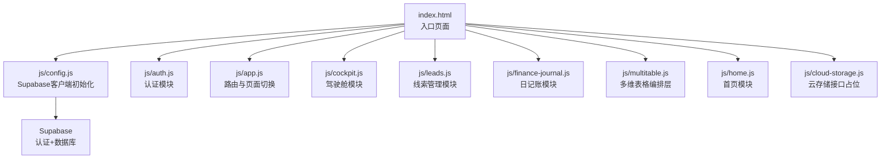
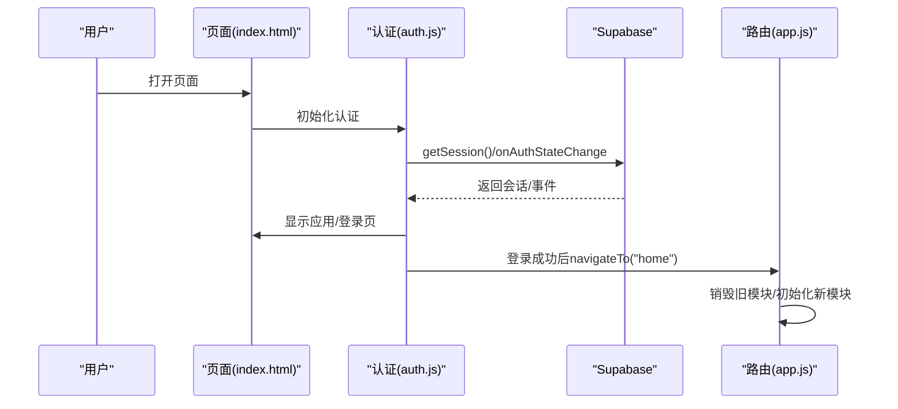
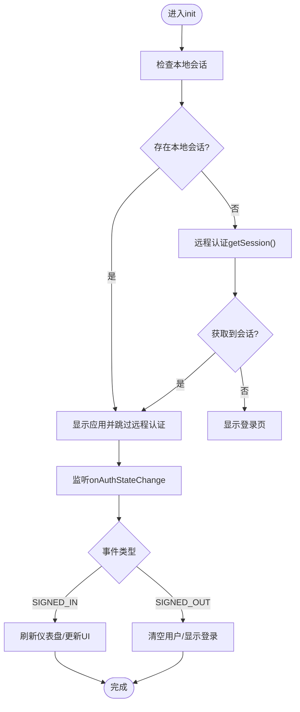
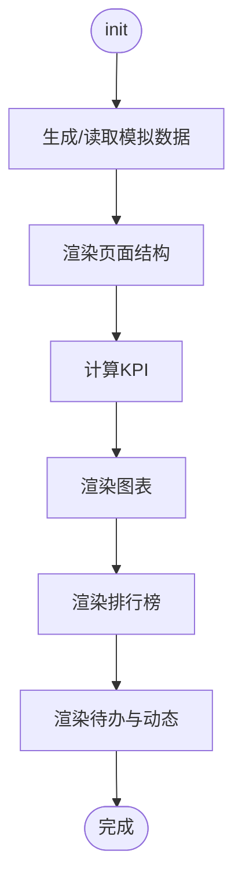
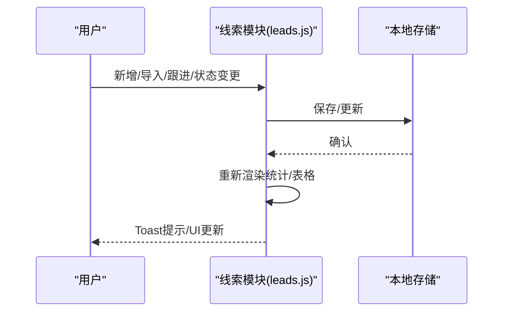
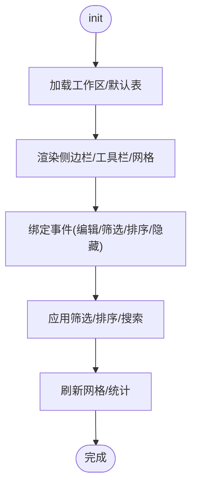
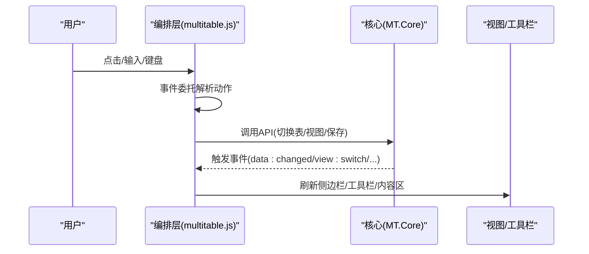
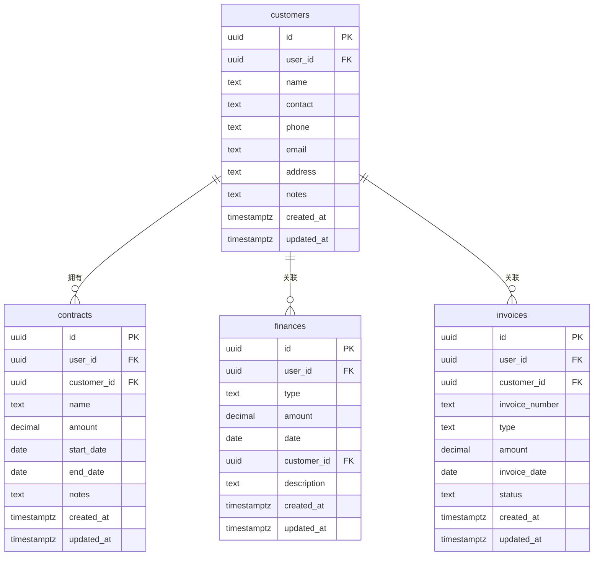
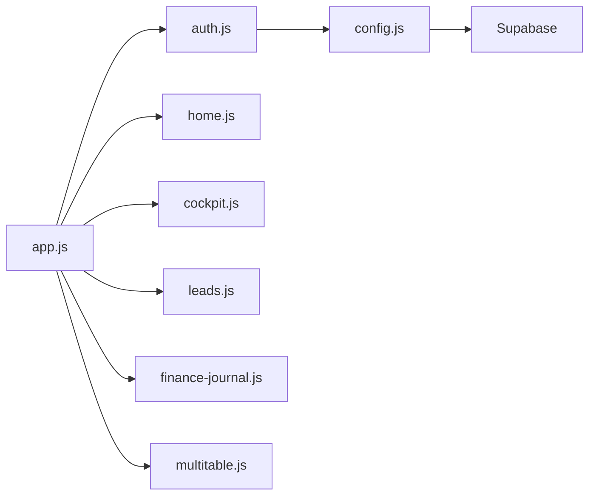

# 调试与测试

<cite>
**本文档引用的文件**
- [README.md](file://README.md)
- [DEPLOY.md](file://DEPLOY.md)
- [index.html](file://index.html)
- [js/config.js](file://js/config.js)
- [js/auth.js](file://js/auth.js)
- [js/app.js](file://js/app.js)
- [js/cockpit.js](file://js/cockpit.js)
- [js/leads.js](file://js/leads.js)
- [js/finance-journal.js](file://js/finance-journal.js)
- [js/multitable.js](file://js/multitable.js)
- [js/home.js](file://js/home.js)
- [js/cloud-storage.js](file://js/cloud-storage.js)
- [database-setup.sql](file://database-setup.sql)
</cite>

## 目录
1. [简介](#简介)
2. [项目结构](#项目结构)
3. [核心组件](#核心组件)
4. [架构总览](#架构总览)
5. [详细组件分析](#详细组件分析)
6. [依赖关系分析](#依赖关系分析)
7. [性能考量](#性能考量)
8. [故障排查指南](#故障排查指南)
9. [结论](#结论)
10. [附录](#附录)

## 简介
本文件面向“调试与测试”主题，结合本项目的前端架构与Supabase后端，系统性给出：
- 浏览器开发者工具的使用方法（控制台、断点、网络请求分析）
- Supabase数据库查询调试与性能分析
- 单元测试与集成测试编写指南（用例设计、Mock数据准备）
- 自动化测试工具选择与配置建议
- 日志记录与错误追踪最佳实践
- 常见Bug定位与修复方法

## 项目结构
项目采用纯前端SPA架构，通过模块化JS文件组织功能模块，Supabase提供认证与数据持久化能力。页面通过路由式切换加载不同模块。

**图表来源**
- [index.html:1-381](file://index.html#L1-L381)
- [js/config.js:1-20](file://js/config.js#L1-L20)
- [js/auth.js:1-259](file://js/auth.js#L1-L259)
- [js/app.js:1-156](file://js/app.js#L1-L156)
- [js/cockpit.js:1-624](file://js/cockpit.js#L1-L624)
- [js/leads.js:1-679](file://js/leads.js#L1-L679)
- [js/finance-journal.js:1-1155](file://js/finance-journal.js#L1-L1155)
- [js/multitable.js:1-624](file://js/multitable.js#L1-L624)
- [js/home.js:1-266](file://js/home.js#L1-L266)
- [js/cloud-storage.js:1-9](file://js/cloud-storage.js#L1-L9)

**章节来源**
- [README.md:48-65](file://README.md#L48-L65)
- [index.html:1-381](file://index.html#L1-L381)

## 核心组件
- 认证模块（auth.js）：负责登录/注册/登出、会话监听、UI切换
- 应用路由（app.js）：菜单点击、页面切换、模块生命周期管理
- 驱动舱模块（cockpit.js）：模拟数据、图表渲染、KPI计算
- 线索管理（leads.js）：本地存储、筛选、详情、跟进
- 日记账模块（finance-journal.js）：多表、多视图、工具栏、筛选/排序/隐藏字段
- 多维表格编排（multitable.js）：页面布局、事件委托、记录面板、仪表盘
- 首页（home.js）：欢迎语、快捷入口、公告
- Supabase配置（config.js）：客户端初始化、降级处理
- 云存储接口（cloud-storage.js）：云端能力占位

**章节来源**
- [js/auth.js:1-259](file://js/auth.js#L1-L259)
- [js/app.js:1-156](file://js/app.js#L1-L156)
- [js/cockpit.js:1-624](file://js/cockpit.js#L1-L624)
- [js/leads.js:1-679](file://js/leads.js#L1-L679)
- [js/finance-journal.js:1-1155](file://js/finance-journal.js#L1-L1155)
- [js/multitable.js:1-624](file://js/multitable.js#L1-L624)
- [js/home.js:1-266](file://js/home.js#L1-L266)
- [js/config.js:1-20](file://js/config.js#L1-L20)
- [js/cloud-storage.js:1-9](file://js/cloud-storage.js#L1-L9)

## 架构总览
前端通过Supabase SDK与后端交互，采用匿名密钥进行非敏感操作，认证状态变化驱动UI切换与数据刷新。

**图表来源**
- [js/auth.js:6-54](file://js/auth.js#L6-L54)
- [js/app.js:85-135](file://js/app.js#L85-L135)
- [index.html:355-378](file://index.html#L355-L378)

**章节来源**
- [js/auth.js:1-259](file://js/auth.js#L1-L259)
- [js/app.js:1-156](file://js/app.js#L1-L156)
- [index.html:1-381](file://index.html#L1-L381)

## 详细组件分析

### 认证模块调试要点
- 控制台调试
  - 断点：在登录/注册/登出关键路径设置断点，观察返回对象与错误分支
  - 监听：利用onAuthStateChange观察事件流，验证登录态切换
- 断点调试
  - 关注会话获取、错误抛出、UI切换等分支
- 网络请求分析
  - 打开Network标签，过滤XHR/Fetch，观察认证相关请求（登录/登出/会话）
  - 关注响应状态、错误信息、请求头（Authorization）
- 本地模式降级
  - 当SDK未加载或初始化失败时，模块会降级为本地模式，便于离线调试

**图表来源**
- [js/auth.js:6-54](file://js/auth.js#L6-L54)
- [js/app.js:146-150](file://js/app.js#L146-L150)

**章节来源**
- [js/auth.js:1-259](file://js/auth.js#L1-L259)
- [js/config.js:1-20](file://js/config.js#L1-L20)

### 驱动舱模块调试要点
- 模拟数据
  - 首次进入会生成模拟数据并缓存到localStorage，便于无后端也能调试
  - 可通过标记位判断是否已播种，避免重复生成
- 图表渲染
  - 使用Chart.js渲染多类图表，关注数据聚合与标签格式化
- KPI计算
  - 月度对比、转化率、净利润等指标计算，注意边界值与格式化

**图表来源**
- [js/cockpit.js:214-224](file://js/cockpit.js#L214-L224)
- [js/cockpit.js:277-339](file://js/cockpit.js#L277-L339)
- [js/cockpit.js:341-499](file://js/cockpit.js#L341-L499)
- [js/cockpit.js:501-540](file://js/cockpit.js#L501-L540)
- [js/cockpit.js:542-622](file://js/cockpit.js#L542-L622)

**章节来源**
- [js/cockpit.js:1-624](file://js/cockpit.js#L1-L624)

### 线索管理模块调试要点
- 本地存储
  - 所有数据保存在localStorage，便于离线调试与快速验证
- 事件绑定
  - 使用事件委托处理表格、弹窗、详情面板等交互
- XSS防护
  - 所有输出均进行HTML转义，调试时可临时关闭以复现问题
- 自动回收
  - 7天未跟进自动退回公海，注意时间阈值与状态变更

**图表来源**
- [js/leads.js:22-102](file://js/leads.js#L22-L102)
- [js/leads.js:390-466](file://js/leads.js#L390-L466)
- [js/leads.js:617-642](file://js/leads.js#L617-L642)

**章节来源**
- [js/leads.js:1-679](file://js/leads.js#L1-L679)

### 日记账模块调试要点
- 多表/多视图
  - 工作区保存在localStorage，支持筛选、排序、搜索、隐藏字段
- 工具栏
  - 筛选/排序/隐藏字段/搜索面板，调试时可逐步开启/关闭面板验证逻辑
- 单元格编辑
  - 单击进入编辑，失焦保存；注意数值/日期/选择类型差异
- 分组与行高
  - 分组渲染与行高设置影响滚动与可见性

**图表来源**
- [js/finance-journal.js:27-40](file://js/finance-journal.js#L27-L40)
- [js/finance-journal.js:408-538](file://js/finance-journal.js#L408-L538)
- [js/finance-journal.js:170-231](file://js/finance-journal.js#L170-L231)

**章节来源**
- [js/finance-journal.js:1-1155](file://js/finance-journal.js#L1-L1155)

### 多维表格编排层调试要点
- 事件委托
  - 通过facade层集中处理点击/双击/输入/键盘等事件，便于定位交互问题
- 记录面板
  - 打开/关闭、字段变更、删除记录，注意防抖保存
- 仪表盘
  - 切换模式、添加/配置部件、渲染图表

**图表来源**
- [js/multitable.js:12-43](file://js/multitable.js#L12-L43)
- [js/multitable.js:177-308](file://js/multitable.js#L177-L308)
- [js/multitable.js:381-386](file://js/multitable.js#L381-L386)

**章节来源**
- [js/multitable.js:1-624](file://js/multitable.js#L1-L624)

### Supabase数据库调试与性能分析
- 数据库初始化
  - 使用提供的SQL脚本创建表、索引、RLS策略与触发器
- 查询调试
  - 在Supabase SQL Editor中执行查询，结合EXPLAIN/EXPLAIN ANALYZE分析慢查询
  - 注意RLS策略对查询结果的影响
- 索引优化
  - 为常用过滤/排序字段建立索引，减少全表扫描
- 触发器
  - updated_at自动更新触发器确保数据一致性

**图表来源**
- [database-setup.sql:10-63](file://database-setup.sql#L10-L63)
- [database-setup.sql:66-76](file://database-setup.sql#L66-L76)
- [database-setup.sql:77-108](file://database-setup.sql#L77-L108)
- [database-setup.sql:110-140](file://database-setup.sql#L110-L140)

**章节来源**
- [database-setup.sql:1-148](file://database-setup.sql#L1-L148)

## 依赖关系分析
- 模块耦合
  - app.js作为路由中枢，依赖各模块的init/destroy接口
  - 认证模块与路由联动，登录成功后刷新仪表盘
  - 驱动舱、日记账、多维表格等模块内部高度内聚，对外通过统一接口暴露
- 外部依赖
  - Supabase SDK（运行时注入）
  - Chart.js（图表渲染）

**图表来源**
- [js/app.js:85-135](file://js/app.js#L85-L135)
- [js/auth.js:1-259](file://js/auth.js#L1-L259)
- [js/config.js:1-20](file://js/config.js#L1-L20)
- [index.html:355-378](file://index.html#L355-L378)

**章节来源**
- [js/app.js:1-156](file://js/app.js#L1-L156)
- [js/auth.js:1-259](file://js/auth.js#L1-L259)
- [js/config.js:1-20](file://js/config.js#L1-L20)
- [index.html:1-381](file://index.html#L1-L381)

## 性能考量
- 前端
  - 避免频繁重绘：使用事件委托、批量更新DOM
  - 搜索/筛选防抖：降低输入事件对渲染的压力
  - 图表懒渲染：DOM就绪后再渲染，减少首屏阻塞
- 后端
  - 为高频查询字段建立索引
  - 使用RLS策略时注意查询计划，必要时拆分查询或加物化视图
- 缓存
  - 本地存储用于离线体验，注意版本迁移与清理策略

[本节为通用指导，无需特定文件引用]

## 故障排查指南
- 登录后页面空白
  - 检查浏览器控制台错误，通常为config.js配置错误导致SDK未加载
- 注册/登录失败
  - 查看Network中认证请求的错误信息；确认Supabase项目URL与Key正确
- 数据无法保存
  - 若为本地模式（SDK未加载），数据仅保存在localStorage；云端模式需检查Supabase连接
- 图表不显示
  - 确认Canvas容器尺寸、Chart.js版本、数据格式
- 自动回收未生效
  - 检查时间阈值与状态字段last_follow_date

**章节来源**
- [DEPLOY.md:169-171](file://DEPLOY.md#L169-L171)
- [js/config.js:8-19](file://js/config.js#L8-L19)
- [js/leads.js:124-147](file://js/leads.js#L124-L147)

## 结论
本项目前端采用模块化设计，配合Supabase实现认证与数据持久化。调试时应充分利用浏览器开发者工具与Supabase控制台，结合本地存储与模拟数据快速定位问题。性能优化应兼顾前端渲染与数据库查询，测试策略建议覆盖单元测试、集成测试与端到端测试。

[本节为总结，无需特定文件引用]

## 附录

### 浏览器开发者工具使用清单
- 控制台
  - 打印变量、调用函数、观察异步状态
- 断点
  - 在关键函数入口与分支处设置断点
- 网络请求
  - 过滤XHR/Fetch，观察认证与数据请求
- 存储
  - 查看/清理localStorage，验证数据持久化

[本节为通用指导，无需特定文件引用]

### 单元测试与集成测试指南
- 单元测试
  - 针对纯函数（如格式化、计算、过滤）编写测试
  - Mock外部依赖（如localStorage、Chart.js）
- 集成测试
  - 模拟用户流程（登录→导航→操作→数据落库）
  - 使用真实Supabase实例或测试副本
- 测试用例设计
  - 正常路径、边界值、异常路径（网络失败、权限不足）
- Mock数据准备
  - 为驱动舱与日记账准备稳定模拟数据集
  - 为线索管理准备多状态样本

[本节为通用指导，无需特定文件引用]

### 自动化测试工具选择与配置
- 前端
  - 单元测试：Jest + jsdom
  - 端到端：Playwright/Cypress
- 后端
  - Supabase测试：使用测试数据库副本与迁移脚本
- CI/CD
  - 在流水线中执行单元测试与端到端测试，失败即阻断

[本节为通用指导，无需特定文件引用]

### 日志记录与错误追踪最佳实践
- 前端
  - 使用结构化日志，区分级别（info/warn/error）
  - 对关键路径增加埋点（登录、保存、图表渲染）
- 后端
  - 记录慢查询与错误堆栈
  - 使用Supabase日志面板监控异常

[本节为通用指导，无需特定文件引用]