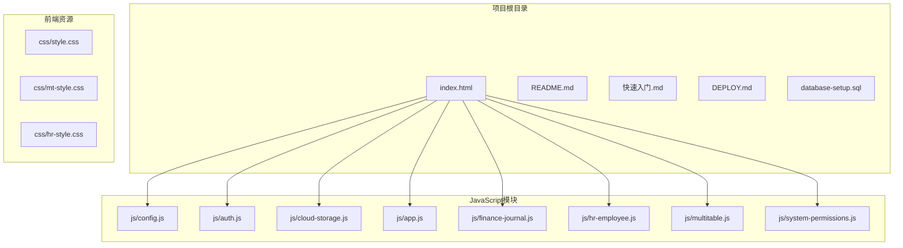
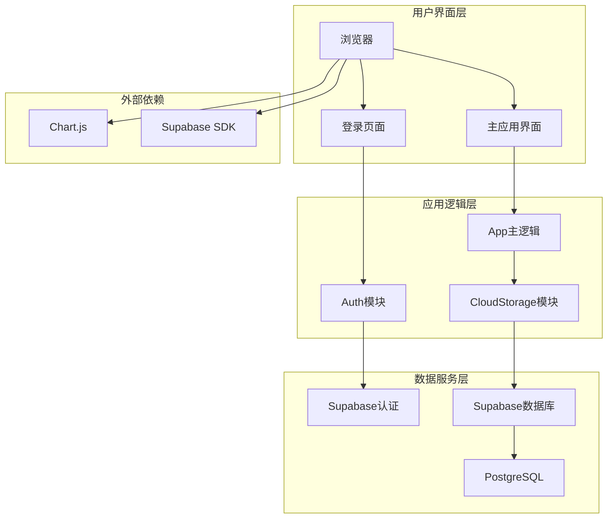
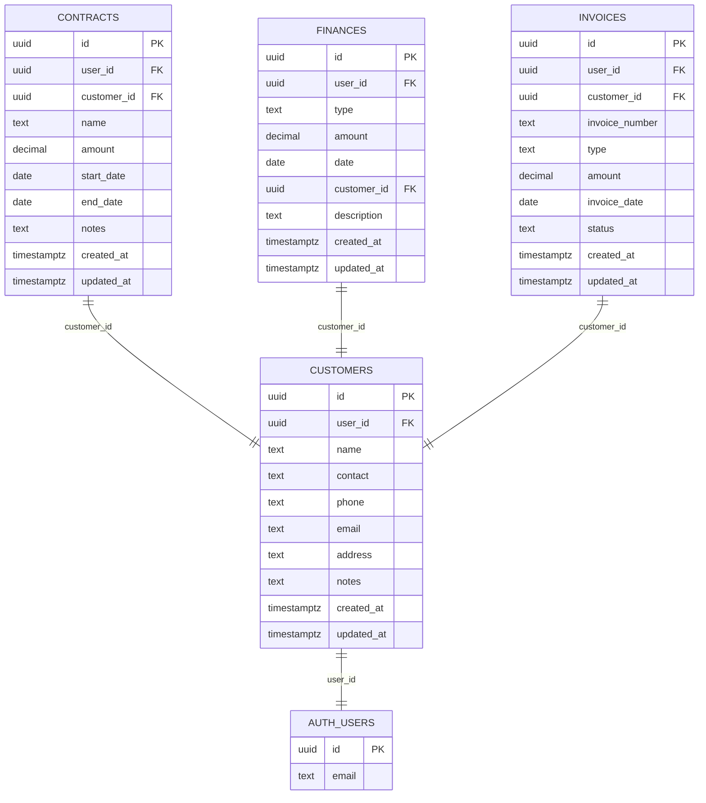
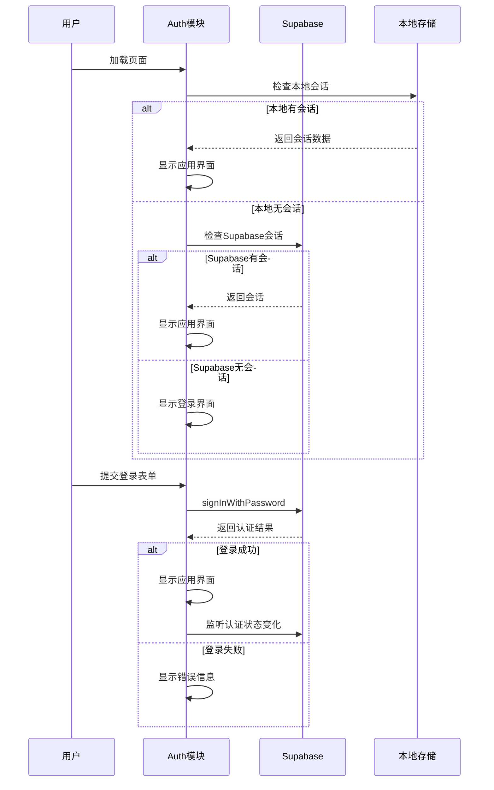
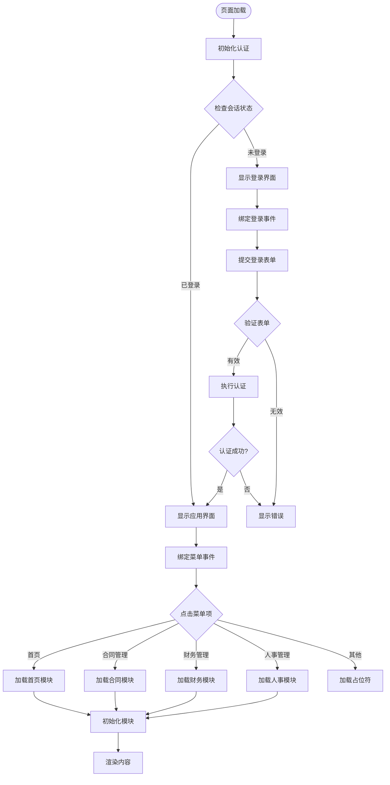
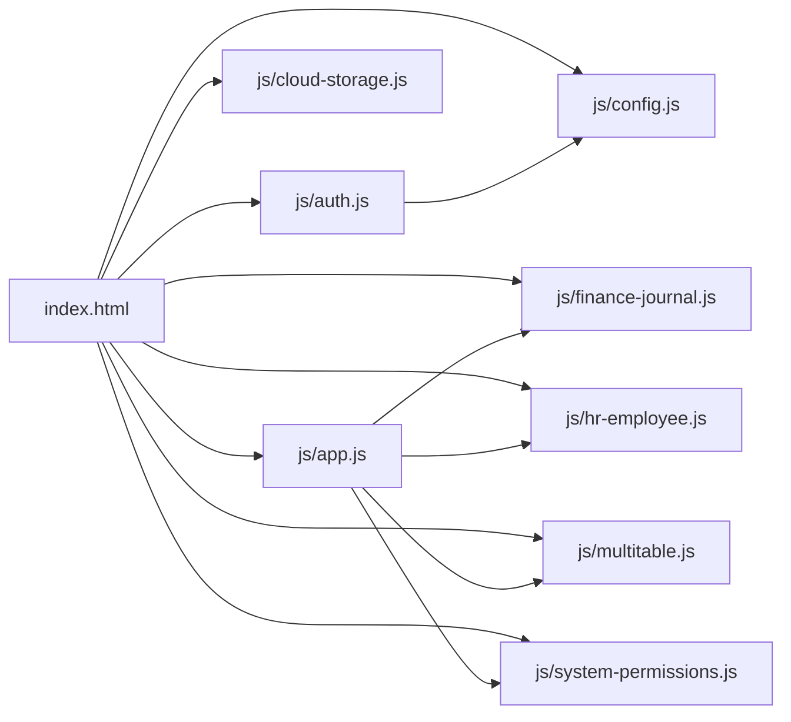

# 快速开始

<cite>
**本文引用的文件**
- [README.md](file://README.md)
- [快速入门.md](file://快速入门.md)
- [DEPLOY.md](file://DEPLOY.md)
- [database-setup.sql](file://database-setup.sql)
- [index.html](file://index.html)
- [js/config.js](file://js/config.js)
- [js/auth.js](file://js/auth.js)
- [js/cloud-storage.js](file://js/cloud-storage.js)
- [js/app.js](file://js/app.js)
- [css/style.css](file://css/style.css)
</cite>

## 目录
1. [简介](#简介)
2. [项目结构](#项目结构)
3. [核心组件](#核心组件)
4. [架构概览](#架构概览)
5. [详细组件分析](#详细组件分析)
6. [依赖关系分析](#依赖关系分析)
7. [性能考虑](#性能考虑)
8. [故障排除指南](#故障排除指南)
9. [结论](#结论)
10. [附录](#附录)

## 简介
本指南面向首次接触陈苗财务CRM系统的用户，提供从零开始的完整部署流程，帮助您在5分钟内完成Supabase项目创建、数据库初始化配置、项目配置修改和本地运行测试。系统基于Supabase PostgreSQL数据库和认证服务，支持用户认证、云端数据存储和多设备同步。

## 项目结构
陈苗系统采用前后端分离的纯静态Web架构，主要文件组织如下：
- 根目录包含入口页面和部署文档
- js目录存放所有JavaScript模块
- css目录存放样式文件
- database-setup.sql提供数据库初始化脚本

**图表来源**
- [index.html:1-381](file://index.html#L1-L381)
- [js/config.js:1-20](file://js/config.js#L1-L20)
- [js/auth.js:1-259](file://js/auth.js#L1-L259)

**章节来源**
- [README.md:48-65](file://README.md#L48-L65)
- [index.html:1-381](file://index.html#L1-L381)

## 核心组件
系统的核心组件包括认证模块、配置模块、云存储模块和应用主逻辑：

### 认证模块 (Auth)
负责用户注册、登录、登出和会话管理，支持Supabase认证和本地测试模式。

### 配置模块 (Config)
管理Supabase客户端初始化，包含URL和匿名密钥配置。

### 云存储模块 (CloudStorage)
提供云端数据存储能力检测接口。

### 应用主逻辑 (App)
处理页面导航、菜单交互和模块初始化。

**章节来源**
- [js/auth.js:1-259](file://js/auth.js#L1-L259)
- [js/config.js:1-20](file://js/config.js#L1-L20)
- [js/cloud-storage.js:1-9](file://js/cloud-storage.js#L1-L9)
- [js/app.js:1-156](file://js/app.js#L1-L156)

## 架构概览
系统采用三层架构设计：前端Web应用、Supabase认证服务和PostgreSQL数据库。

**图表来源**
- [index.html:11-12](file://index.html#L11-L12)
- [js/auth.js:24-53](file://js/auth.js#L24-L53)
- [js/config.js:8-19](file://js/config.js#L8-L19)

## 详细组件分析

### Supabase配置流程
配置过程分为四个关键步骤：

#### 步骤1：创建Supabase项目
1. 访问 https://supabase.com 注册账号
2. 创建新项目，选择Singapore区域
3. 复制Project URL和anon key（在Settings → API）
4. 在SQL Editor中执行database-setup.sql

#### 步骤2：修改配置文件
打开js/config.js文件，修改以下两行：
- SUPABASE_URL：替换为你的项目ID
- SUPABASE_ANON_KEY：替换为你的anon密钥

#### 步骤3：本地测试运行
1. 双击打开index.html
2. 注册一个新账号
3. 登录并添加一些客户数据
4. 刷新页面，验证数据是否保存成功

#### 步骤4：部署上线（可选）
参考DEPLOY.md文件中的详细部署指南，推荐部署到Vercel。

**章节来源**
- [快速入门.md:3-28](file://快速入门.md#L3-L28)
- [DEPLOY.md:9-66](file://DEPLOY.md#L9-L66)

### 数据库初始化流程
系统使用database-setup.sql脚本进行数据库初始化，包含以下核心表结构：

**图表来源**
- [database-setup.sql:11-22](file://database-setup.sql#L11-L22)
- [database-setup.sql:25-36](file://database-setup.sql#L25-L36)
- [database-setup.sql:39-49](file://database-setup.sql#L39-L49)
- [database-setup.sql:52-63](file://database-setup.sql#L52-L63)

**章节来源**
- [database-setup.sql:1-148](file://database-setup.sql#L1-L148)

### 认证工作流程
系统支持两种认证模式：Supabase认证和本地测试模式。

**图表来源**
- [js/auth.js:6-54](file://js/auth.js#L6-L54)
- [js/auth.js:108-138](file://js/auth.js#L108-L138)

**章节来源**
- [js/auth.js:1-259](file://js/auth.js#L1-L259)

### 页面导航流程
应用采用模块化页面设计，支持动态内容加载：

**图表来源**
- [js/app.js:50-135](file://js/app.js#L50-L135)
- [js/auth.js:84-105](file://js/auth.js#L84-L105)

**章节来源**
- [js/app.js:1-156](file://js/app.js#L1-L156)

## 依赖关系分析
系统依赖关系清晰，主要依赖包括：

### 外部依赖
- **Supabase SDK**: 提供认证和数据库访问能力
- **Chart.js**: 支持数据可视化图表
- **Font Awesome**: 提供图标字体支持

### 内部模块依赖
- index.html依赖所有JavaScript模块
- auth.js依赖config.js提供的Supabase客户端
- app.js依赖各个功能模块的初始化函数

**图表来源**
- [index.html:355-378](file://index.html#L355-L378)
- [js/auth.js:1-259](file://js/auth.js#L1-L259)

**章节来源**
- [index.html:1-381](file://index.html#L1-L381)
- [js/config.js:1-20](file://js/config.js#L1-L20)

## 性能考虑
系统在设计时考虑了以下性能因素：

### 数据库性能优化
- 为关键字段创建索引以提高查询性能
- 使用触发器自动更新updated_at字段
- 实施行级安全策略确保数据隔离

### 前端性能优化
- 模块化加载，按需初始化功能模块
- 使用本地存储缓存用户会话
- 图表组件延迟加载

### 网络性能优化
- 使用CDN分发静态资源
- 支持HTTPS加密传输
- 最小化HTTP请求次数

## 故障排除指南

### 常见问题及解决方案

#### 问题1：注册时提示"Email already exists"
**原因**: 该邮箱已被注册
**解决方法**: 直接登录或更换其他邮箱地址

#### 问题2：登录后页面空白
**原因**: config.js配置错误或Supabase SDK未正确加载
**解决方法**: 
1. 检查浏览器控制台(F12)是否有错误
2. 确认SUPABASE_URL和SUPABASE_ANON_KEY配置正确
3. 验证Supabase项目状态正常

#### 问题3：添加数据时提示"未登录"
**原因**: 登录会话已过期
**解决方法**: 退出账号后重新登录

#### 问题4：数据库初始化失败
**原因**: SQL脚本执行错误或权限不足
**解决方法**:
1. 确认SQL Editor中选择了正确的数据库
2. 检查SQL语法是否完整
3. 验证Supabase项目状态正常

#### 问题5：本地测试模式无法使用
**原因**: Supabase SDK未正确加载
**解决方法**: 
1. 检查网络连接
2. 确认CDN资源可访问
3. 验证浏览器控制台无网络错误

**章节来源**
- [DEPLOY.md:164-183](file://DEPLOY.md#L164-L183)

### 验证步骤
完成部署后，建议进行以下验证测试：

1. **功能验证**:
   - [ ] 可以用邮箱注册新账号
   - [ ] 可以成功登录
   - [ ] 可以添加客户数据
   - [ ] 刷新页面后数据仍然存在
   - [ ] 在手机浏览器登录同一账号，数据同步显示

2. **数据库验证**:
   - [ ] 回到Supabase Dashboard
   - [ ] 点击Table Editor
   - [ ] 查看customers、contracts等表
   - [ ] 验证数据完整性

3. **性能验证**:
   - [ ] 页面加载时间小于3秒
   - [ ] 数据操作响应时间小于2秒
   - [ ] 多设备数据同步正常

**章节来源**
- [DEPLOY.md:113-127](file://DEPLOY.md#L113-L127)

## 结论
陈苗财务CRM系统提供了完整的云端解决方案，通过5分钟即可完成从零开始的部署和测试。系统基于Supabase构建，具有以下优势：

- **快速部署**: 5分钟完成基础部署
- **数据安全**: 基于Supabase的行级安全策略
- **多设备同步**: 支持跨设备数据同步
- **易于扩展**: 模块化架构便于功能扩展

建议新用户按照本指南逐步完成配置，在本地环境中充分测试后再进行生产部署。

## 附录

### 环境要求
- **浏览器**: 支持现代浏览器(Chrome/Firefox/Safari最新版本)
- **网络**: 稳定的互联网连接
- **存储**: 至少100MB可用空间
- **Supabase**: 免费账户即可满足基本需求

### 前置条件
- 有效的Supabase项目ID
- 有效的Supabase匿名密钥
- 已启用的邮箱认证功能
- 完成数据库初始化脚本执行

### 快速验证清单
- [ ] Supabase项目创建完成
- [ ] database-setup.sql执行成功
- [ ] js/config.js配置正确
- [ ] index.html本地测试通过
- [ ] 数据库连接正常
- [ ] 用户认证功能正常

**章节来源**
- [README.md:95-99](file://README.md#L95-L99)
- [快速入门.md:56-61](file://快速入门.md#L56-L61)