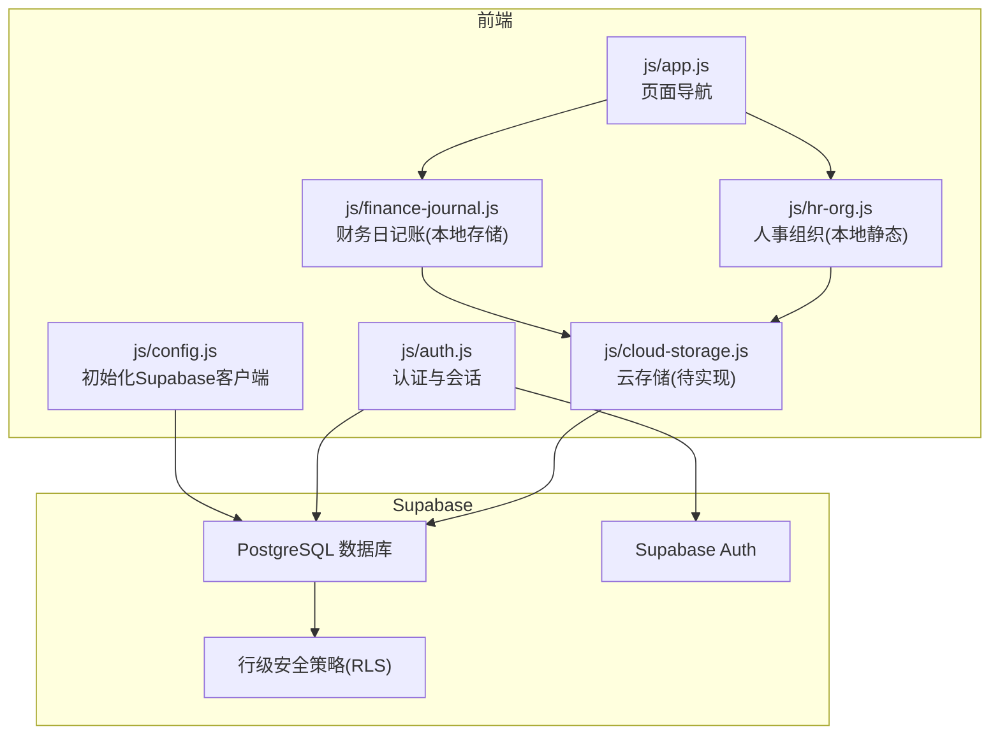
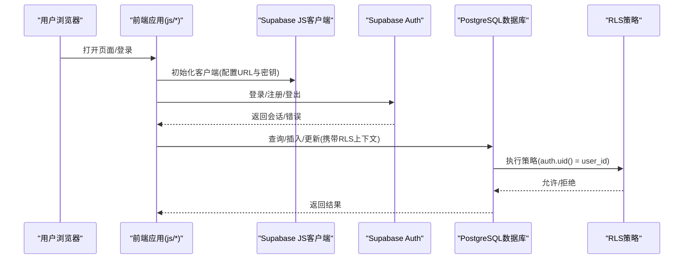
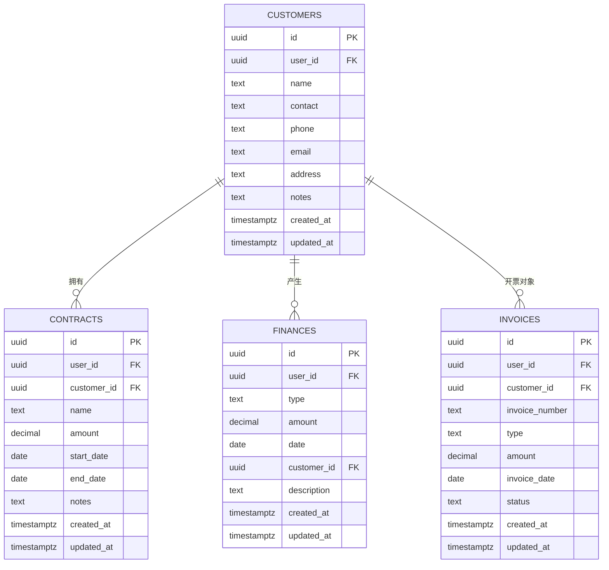
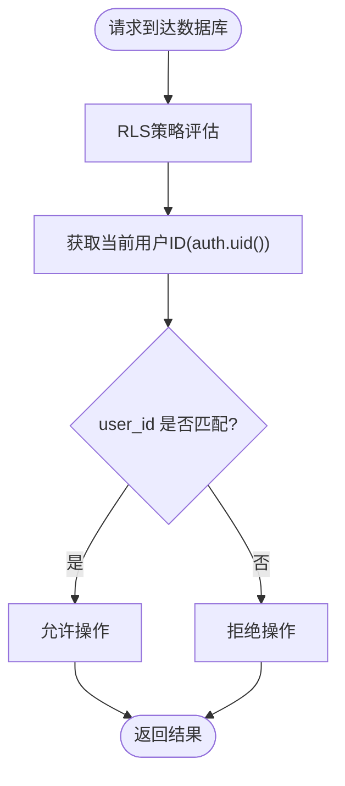
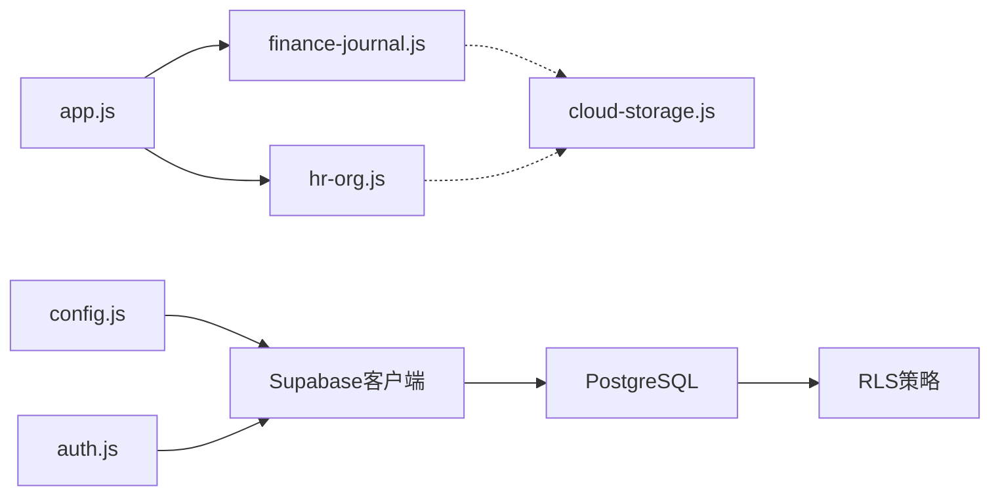

# 数据库设计

<cite>
**本文引用的文件**
- [database-setup.sql](file://database-setup.sql)
- [README.md](file://README.md)
- [DEPLOY.md](file://DEPLOY.md)
- [快速入门.md](file://快速入门.md)
- [config.js](file://js/config.js)
- [auth.js](file://js/auth.js)
- [cloud-storage.js](file://js/cloud-storage.js)
- [app.js](file://js/app.js)
- [finance-journal.js](file://js/finance-journal.js)
- [hr-org.js](file://js/hr-org.js)
</cite>

## 目录
1. [简介](#简介)
2. [项目结构](#项目结构)
3. [核心组件](#核心组件)
4. [架构总览](#架构总览)
5. [详细组件分析](#详细组件分析)
6. [依赖分析](#依赖分析)
7. [性能考虑](#性能考虑)
8. [故障排查指南](#故障排查指南)
9. [结论](#结论)
10. [附录](#附录)

## 简介
本文件面向“陈苗系统”的数据库设计，聚焦于Supabase PostgreSQL数据库的表结构、表间关系、外键约束、索引策略、行级安全策略（RLS）与初始化脚本执行流程。系统采用Supabase认证与数据库一体化能力，通过RLS实现用户数据隔离，并在前端通过Supabase JS客户端进行读写操作。

## 项目结构
围绕数据库设计的关键文件与职责如下：
- database-setup.sql：数据库初始化脚本，负责创建核心表、索引、RLS策略与更新时间戳触发器。
- README.md / DEPLOY.md / 快速入门.md：部署与使用说明，指导如何在Supabase中执行初始化脚本并配置前端。
- js/config.js：前端Supabase客户端初始化，提供URL与匿名密钥。
- js/auth.js：用户认证模块，负责登录、注册、登出与会话状态监听。
- js/cloud-storage.js：云存储模块占位，当前未实现具体数据库操作。
- js/app.js：应用主逻辑，页面导航与生命周期管理。
- js/finance-journal.js：财务日记账模块，当前为纯前端本地存储，未直接对接数据库。
- js/hr-org.js：人事组织模块，当前为纯前端静态数据，未直接对接数据库。

**图表来源**
- [config.js:1-20](file://js/config.js#L1-L20)
- [auth.js:1-259](file://js/auth.js#L1-L259)
- [app.js:1-156](file://js/app.js#L1-L156)
- [finance-journal.js:1-1155](file://js/finance-journal.js#L1-L1155)
- [hr-org.js:1-293](file://js/hr-org.js#L1-L293)
- [cloud-storage.js:1-9](file://js/cloud-storage.js#L1-L9)
- [database-setup.sql:1-148](file://database-setup.sql#L1-L148)

**章节来源**
- [README.md:1-135](file://README.md#L1-L135)
- [DEPLOY.md:1-224](file://DEPLOY.md#L1-L224)
- [快速入门.md:1-61](file://快速入门.md#L1-L61)

## 核心组件
本节对数据库初始化脚本中的核心表进行逐项解析，包括字段语义、约束与索引策略。

- 客户表（customers）
  - 关键点：UUID主键；user_id外键关联Supabase内置用户表；自动时间戳字段；RLS策略限制仅本人可见。
  - 索引：按user_id建立索引，便于按用户过滤。
  - 复杂度：查询按用户过滤为O(log N) + 扫描结果，写入为O(1)。

- 合同表（contracts）
  - 关键点：UUID主键；user_id外键；customer_id外键（删除时置空）；金额非负校验；日期范围字段；RLS策略。
  - 索引：按user_id与customer_id建立索引，提升按客户与用户过滤效率。
  - 复杂度：查询按用户/客户过滤为O(log N)，写入为O(1)。

- 财务记录表（finances）
  - 关键点：UUID主键；user_id外键；type枚举（收入/支出）；amount非负；date字段；customer_id外键（删除时置空）；RLS策略。
  - 索引：按user_id、type、date建立索引，支持按类型与日期聚合。
  - 复杂度：查询按用户/类型/日期过滤为O(log N)，写入为O(1)。

- 发票表（invoices）
  - 关键点：UUID主键；user_id外键；customer_id外键（删除时置空）；invoice_number唯一性（脚本未显式声明，建议补充）；type字段；amount非负；invoice_date；status默认值；RLS策略。
  - 索引：按user_id与customer_id建立索引，便于按用户与客户检索。
  - 复杂度：查询按用户/客户过滤为O(log N)，写入为O(1)。

- 触发器与更新时间戳
  - 为上述四表分别创建更新触发器，统一在UPDATE前设置updated_at为当前时间，避免重复逻辑。

- 行级安全策略（RLS）
  - 对四表启用RLS，并为每张表创建策略：所有操作均要求auth.uid()与user_id相等，从而实现“用户数据隔离”。

**章节来源**
- [database-setup.sql:10-76](file://database-setup.sql#L10-L76)
- [database-setup.sql:77-108](file://database-setup.sql#L77-L108)
- [database-setup.sql:110-140](file://database-setup.sql#L110-L140)

## 架构总览
系统整体采用“前端静态页面 + Supabase认证与数据库”的架构。前端通过Supabase JS客户端发起请求，数据库通过RLS强制执行用户隔离；部署阶段在Supabase SQL Editor中执行初始化脚本完成表结构、索引、RLS与触发器的创建。

**图表来源**
- [config.js:1-20](file://js/config.js#L1-L20)
- [auth.js:1-259](file://js/auth.js#L1-L259)
- [database-setup.sql:77-108](file://database-setup.sql#L77-L108)

**章节来源**
- [README.md:1-135](file://README.md#L1-L135)
- [DEPLOY.md:1-224](file://DEPLOY.md#L1-L224)
- [快速入门.md:1-61](file://快速入门.md#L1-L61)

## 详细组件分析

### 数据模型与ER关系
基于初始化脚本，核心实体与关系如下：

**图表来源**
- [database-setup.sql:10-63](file://database-setup.sql#L10-L63)

**章节来源**
- [database-setup.sql:10-63](file://database-setup.sql#L10-L63)

### RLS策略实现与数据访问控制
- 启用RLS：对customers、contracts、finances、invoices四表分别启用RLS。
- 策略规则：FOR ALL USING与WITH CHECK均要求auth.uid() = user_id，确保用户只能访问/修改自己的数据。
- 会话上下文：前端通过Supabase Auth获取会话，RLS在数据库侧生效，形成“用户隔离”机制。

**图表来源**
- [database-setup.sql:77-108](file://database-setup.sql#L77-L108)

**章节来源**
- [database-setup.sql:77-108](file://database-setup.sql#L77-L108)
- [auth.js:1-259](file://js/auth.js#L1-L259)

### 索引优化策略
- customers：按user_id建立索引，加速按用户过滤。
- contracts：按user_id与customer_id建立索引，支持按用户与客户过滤。
- finances：按user_id、type、date建立索引，支持按类型与日期聚合。
- invoices：按user_id与customer_id建立索引，支持按用户与客户过滤。
- 建议：若频繁按invoice_number查询，可在invoices上增加唯一索引或唯一约束。

**章节来源**
- [database-setup.sql:66-76](file://database-setup.sql#L66-L76)

### 触发器与更新时间戳
- 为四表分别创建触发器，在UPDATE前自动更新updated_at字段，减少重复逻辑与遗漏风险。
- 触发器函数为通用逻辑，适用于所有表。

**章节来源**
- [database-setup.sql:110-140](file://database-setup.sql#L110-L140)

### 前端集成与数据库交互现状
- Supabase客户端初始化：前端通过config.js创建客户端实例，依赖window.supabase。
- 认证：auth.js负责登录、注册、登出与会话监听，与Supabase Auth联动。
- 业务模块：
  - finance-journal.js：当前为本地存储，未直接对接数据库。
  - hr-org.js：当前为本地静态数据，未直接对接数据库。
  - cloud-storage.js：模块占位，当前未实现具体数据库操作。
- 建议：后续在各业务模块中引入Supabase JS客户端进行CRUD操作，并遵循RLS策略。

**章节来源**
- [config.js:1-20](file://js/config.js#L1-L20)
- [auth.js:1-259](file://js/auth.js#L1-L259)
- [finance-journal.js:1-1155](file://js/finance-journal.js#L1-L1155)
- [hr-org.js:1-293](file://js/hr-org.js#L1-L293)
- [cloud-storage.js:1-9](file://js/cloud-storage.js#L1-L9)

## 依赖分析
- 前端对Supabase的依赖：config.js初始化客户端；auth.js处理认证；app.js承载页面导航。
- 数据库对RLS的依赖：RLS策略依赖auth.uid()上下文，要求前端正确传递会话。
- 业务模块对数据库的依赖：当前finance-journal.js与hr-org.js为本地存储，未直接依赖数据库；cloud-storage.js为占位。

**图表来源**
- [config.js:1-20](file://js/config.js#L1-L20)
- [auth.js:1-259](file://js/auth.js#L1-L259)
- [app.js:1-156](file://js/app.js#L1-L156)
- [finance-journal.js:1-1155](file://js/finance-journal.js#L1-L1155)
- [hr-org.js:1-293](file://js/hr-org.js#L1-L293)
- [cloud-storage.js:1-9](file://js/cloud-storage.js#L1-L9)
- [database-setup.sql:77-108](file://database-setup.sql#L77-L108)

**章节来源**
- [config.js:1-20](file://js/config.js#L1-L20)
- [auth.js:1-259](file://js/auth.js#L1-L259)
- [app.js:1-156](file://js/app.js#L1-L156)
- [finance-journal.js:1-1155](file://js/finance-journal.js#L1-L1155)
- [hr-org.js:1-293](file://js/hr-org.js#L1-L293)
- [cloud-storage.js:1-9](file://js/cloud-storage.js#L1-L9)
- [database-setup.sql:77-108](file://database-setup.sql#L77-L108)

## 性能考虑
- 索引覆盖：已针对高频过滤字段建立索引；建议根据实际查询模式补充复合索引（如finances上的(user_id, date)、(user_id, type)）。
- 写入路径：触发器在UPDATE前执行，避免重复逻辑；批量更新时注意触发器开销。
- 查询模式：RLS在WHERE子句中强制过滤，建议在应用层缓存常用过滤参数，减少无效查询。
- 数据规模：当前为轻量级应用，建议关注查询计划与慢查询日志，逐步优化。

[本节为通用性能建议，无需特定文件引用]

## 故障排查指南
- 注册/登录异常
  - 检查Supabase项目中是否已启用邮箱认证提供程序。
  - 确认前端config.js中的URL与匿名密钥正确。
- 数据不可见或被拒绝
  - 确认当前会话有效，RLS策略要求auth.uid()与user_id一致。
  - 若使用本地测试账号，请确认前端逻辑未绕过会话。
- 初始化脚本执行失败
  - 在Supabase SQL Editor中确认database-setup.sql完整执行且无语法错误。
  - 检查表是否创建成功，可参考脚本末尾的验证注释。

**章节来源**
- [DEPLOY.md:164-184](file://DEPLOY.md#L164-L184)
- [config.js:1-20](file://js/config.js#L1-L20)
- [auth.js:1-259](file://js/auth.js#L1-L259)
- [database-setup.sql:144-148](file://database-setup.sql#L144-L148)

## 结论
本数据库设计方案以Supabase为基础，通过RLS实现用户数据隔离，结合索引与触发器保障查询性能与数据一致性。前端通过Supabase JS客户端与认证模块实现安全访问。当前业务模块仍以本地存储为主，建议后续在各模块中引入数据库操作，统一遵循RLS策略与索引设计，持续优化查询性能与用户体验。

[本节为总结性内容，无需特定文件引用]

## 附录

### 数据库初始化脚本执行流程
- 在Supabase中创建项目并获取URL与匿名密钥。
- 在SQL Editor中执行database-setup.sql，完成表结构、索引、RLS与触发器创建。
- 在前端config.js中填入正确的Supabase凭据。
- 通过auth.js进行登录/注册，验证数据隔离与同步。

**章节来源**
- [DEPLOY.md:32-45](file://DEPLOY.md#L32-L45)
- [快速入门.md:3-9](file://快速入门.md#L3-L9)
- [config.js:1-20](file://js/config.js#L1-L20)
- [database-setup.sql:1-148](file://database-setup.sql#L1-L148)

### 数据迁移与版本管理建议
- 当前脚本为一次性初始化，建议后续引入版本化迁移策略（如基于版本号的迁移脚本），并在Supabase中维护迁移历史。
- 对于新增字段或索引，建议在新版本脚本中添加，避免破坏现有数据。
- 对于RLS策略变更，应先在测试环境验证，再在生产环境灰度发布。

[本节为通用建议，无需特定文件引用]