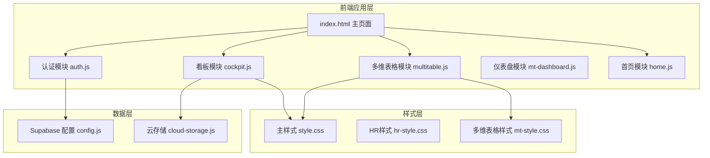
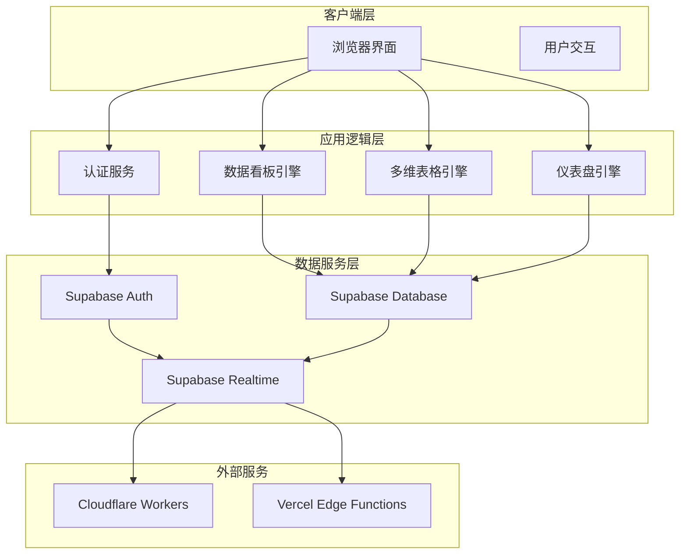
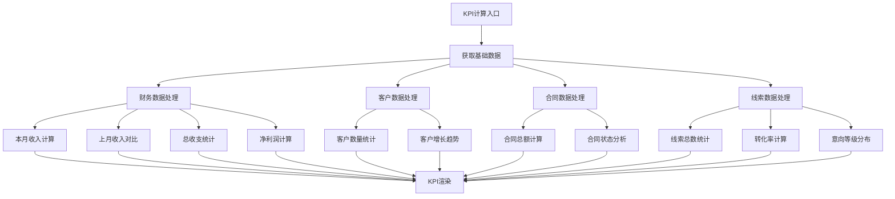
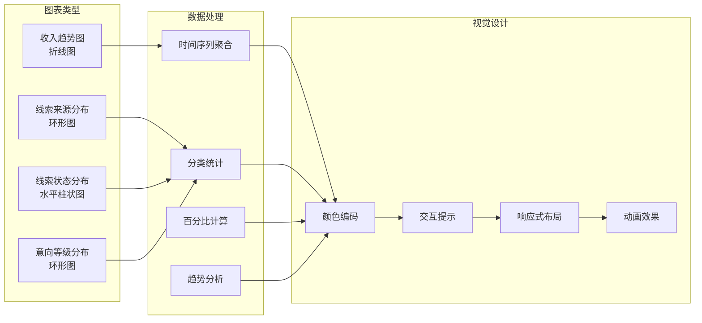
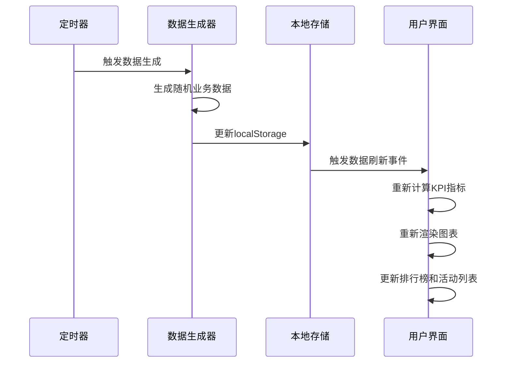
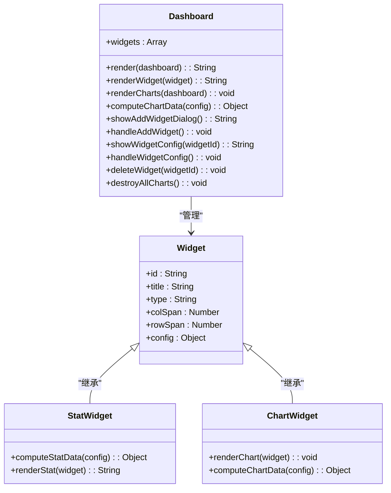
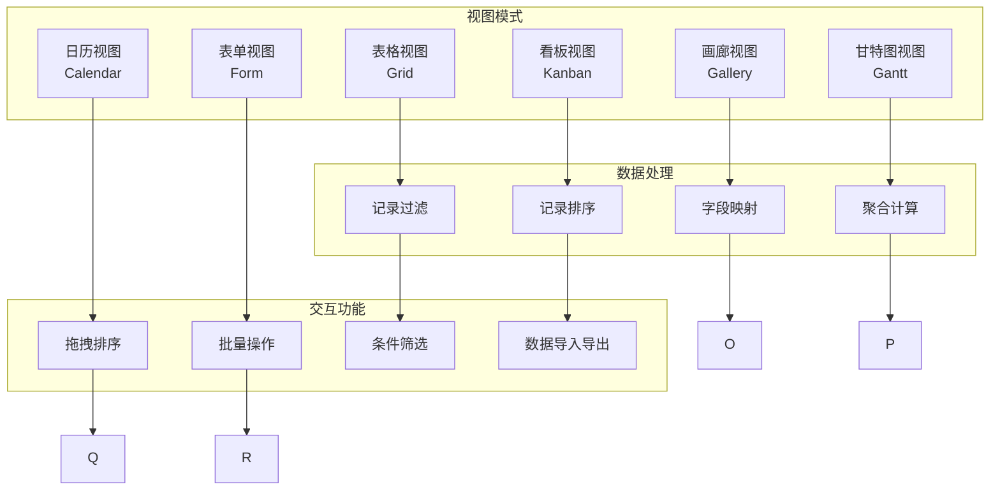
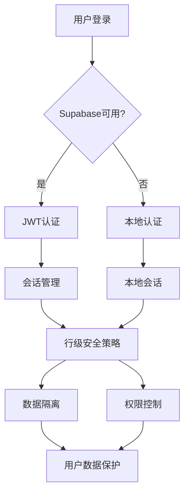
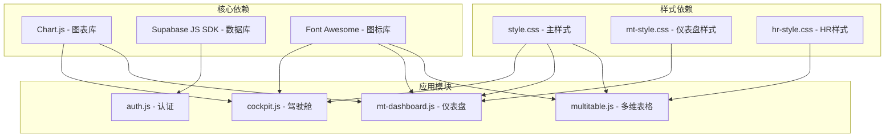

# 数据看板与分析

<cite>
**本文档引用的文件**
- [index.html](file://index.html)
- [README.md](file://README.md)
- [js/config.js](file://js/config.js)
- [js/auth.js](file://js/auth.js)
- [js/cloud-storage.js](file://js/cloud-storage.js)
- [js/cockpit.js](file://js/cockpit.js)
- [js/mt-dashboard.js](file://js/mt-dashboard.js)
- [js/multitable.js](file://js/multitable.js)
- [js/home.js](file://js/home.js)
- [css/style.css](file://css/style.css)
</cite>

## 目录
1. [引言](#引言)
2. [项目结构](#项目结构)
3. [核心组件](#核心组件)
4. [架构概览](#架构概览)
5. [详细组件分析](#详细组件分析)
6. [依赖关系分析](#依赖关系分析)
7. [性能考虑](#性能考虑)
8. [故障排除指南](#故障排除指南)
9. [结论](#结论)
10. [附录](#附录)

## 引言
本项目是一个基于浏览器的财务CRM管理系统，专注于为管理层提供实时的数据看板与分析功能。系统采用HTML5+CSS3+JavaScript技术栈，结合Supabase PostgreSQL数据库实现云端数据存储与同步。本文档将深入解析老板驾驶舱的设计理念、实现原理以及KPI指标计算方法，详细介绍图表可视化实现、实时数据更新机制、看板定制功能和用户个性化配置，并提供数据分析最佳实践和性能优化策略。

## 项目结构
项目采用模块化设计，主要分为以下几个核心模块：

**图表来源**
- [index.html:1-381](file://index.html#L1-L381)
- [js/auth.js:1-259](file://js/auth.js#L1-L259)
- [js/cockpit.js:1-624](file://js/cockpit.js#L1-L624)

**章节来源**
- [index.html:1-381](file://index.html#L1-L381)
- [README.md:48-65](file://README.md#L48-L65)

## 核心组件
系统的核心组件包括：

### 1. 认证与会话管理
- **用户认证模块**：支持邮箱注册/登录、JWT会话管理、数据安全隔离
- **Supabase集成**：提供云端数据存储和实时同步能力
- **本地存储**：支持本地模式下的数据持久化

### 2. 数据看板引擎
- **老板驾驶舱**：核心分析模块，提供KPI指标、图表可视化、实时数据更新
- **多维表格**：支持多种视图模式（表格、看板、画廊、甘特图、日历、表单）
- **仪表盘**：可定制的可视化仪表盘，支持拖拽布局

### 3. 数据可视化
- **图表库集成**：基于Chart.js实现丰富的数据可视化
- **响应式设计**：适配不同屏幕尺寸的设备
- **交互式图表**：支持悬停、缩放、图例切换等交互功能

**章节来源**
- [js/auth.js:3-54](file://js/auth.js#L3-L54)
- [js/cockpit.js:214-224](file://js/cockpit.js#L214-L224)
- [js/multitable.js:7-29](file://js/multitable.js#L7-L29)

## 架构概览
系统采用前后端分离架构，前端负责数据展示和用户交互，后端通过Supabase提供数据存储和认证服务。

**图表来源**
- [js/config.js:1-20](file://js/config.js#L1-L20)
- [js/auth.js:24-53](file://js/auth.js#L24-L53)
- [js/cockpit.js:214-224](file://js/cockpit.js#L214-L224)

## 详细组件分析

### 老板驾驶舱模块 (Cockpit)
老板驾驶舱是系统的核心分析模块，提供全面的业务洞察和决策支持。

#### KPI指标设计与计算
系统实现了多个关键业务指标的实时计算：

**图表来源**
- [js/cockpit.js:278-339](file://js/cockpit.js#L278-L339)

#### 图表可视化实现
系统提供了四种主要的可视化图表：

1. **收入趋势图**：展示过去12个月的收入和支出趋势
2. **线索来源分布图**：显示不同渠道获取线索的数量分布
3. **线索状态分布图**：展示线索从新线索到已转化的流转状态
4. **意向等级分布图**：分析潜在客户的购买意向程度

**图表来源**
- [js/cockpit.js:349-499](file://js/cockpit.js#L349-L499)

#### 实时数据更新机制
系统采用模拟数据生成器实现数据更新：

**图表来源**
- [js/cockpit.js:10-211](file://js/cockpit.js#L10-L211)

**章节来源**
- [js/cockpit.js:214-624](file://js/cockpit.js#L214-L624)

### 多维表格与仪表盘模块
系统提供了强大的数据管理和可视化能力：

#### 仪表盘引擎
仪表盘模块支持高度定制化的数据可视化：

**图表来源**
- [js/mt-dashboard.js:62-101](file://js/mt-dashboard.js#L62-L101)
- [js/mt-dashboard.js:174-216](file://js/mt-dashboard.js#L174-L216)

#### 多维表格引擎
多维表格支持九种不同的视图模式：

**图表来源**
- [js/multitable.js:98-109](file://js/multitable.js#L98-L109)
- [js/multitable.js:140-161](file://js/multitable.js#L140-L161)

**章节来源**
- [js/mt-dashboard.js:1-493](file://js/mt-dashboard.js#L1-L493)
- [js/multitable.js:1-200](file://js/multitable.js#L1-L200)

### 认证与数据安全
系统采用多层次的安全保障机制：

**图表来源**
- [js/auth.js:7-54](file://js/auth.js#L7-L54)
- [js/config.js:8-19](file://js/config.js#L8-L19)

**章节来源**
- [js/auth.js:1-259](file://js/auth.js#L1-L259)
- [js/config.js:1-20](file://js/config.js#L1-L20)

## 依赖关系分析
系统的关键依赖关系如下：

**图表来源**
- [index.html:10-12](file://index.html#L10-L12)
- [index.html:354-377](file://index.html#L354-L377)

**章节来源**
- [index.html:1-381](file://index.html#L1-L381)

## 性能考虑
系统在设计时充分考虑了性能优化：

### 1. 数据缓存策略
- **本地存储优化**：使用localStorage缓存业务数据，减少服务器请求
- **图表实例管理**：智能销毁不再使用的图表实例，避免内存泄漏
- **懒加载机制**：延迟加载非关键资源，提升首屏加载速度

### 2. 渲染优化
- **虚拟滚动**：对于大量数据的表格视图，采用虚拟滚动技术
- **防抖处理**：对频繁触发的UI操作进行防抖处理
- **增量更新**：只更新发生变化的数据，避免全量重绘

### 3. 网络优化
- **CDN加速**：静态资源通过CDN分发
- **压缩传输**：启用Gzip压缩减少传输体积
- **连接复用**：复用HTTP连接，减少握手开销

## 故障排除指南
常见问题及解决方案：

### 1. 认证问题
- **问题**：登录失败或会话异常
- **原因**：Supabase配置错误或网络连接问题
- **解决**：检查config.js中的URL和Key配置，确认网络连接正常

### 2. 数据同步问题
- **问题**：看板数据不更新或显示异常
- **原因**：localStorage数据损坏或浏览器缓存问题
- **解决**：清除浏览器缓存，重新登录系统

### 3. 图表显示问题
- **问题**：图表无法正常显示或渲染异常
- **原因**：Chart.js库加载失败或Canvas兼容性问题
- **解决**：检查网络连接，确认浏览器支持Canvas元素

### 4. 性能问题
- **问题**：页面加载缓慢或操作卡顿
- **原因**：数据量过大或图表过多
- **解决**：优化数据查询条件，适当减少同时显示的图表数量

**章节来源**
- [js/auth.js:50-53](file://js/auth.js#L50-L53)
- [js/cockpit.js:226-229](file://js/cockpit.js#L226-L229)

## 结论
本数据看板与分析系统通过模块化设计和现代化的技术栈，为管理层提供了全面的业务洞察和决策支持工具。系统具备以下优势：

1. **功能完整**：涵盖客户管理、合同管理、财务管理、数据分析等核心业务功能
2. **可视化丰富**：提供多种图表类型和交互式可视化效果
3. **用户体验优秀**：响应式设计适配多终端，操作流畅直观
4. **扩展性强**：模块化架构便于功能扩展和定制化开发
5. **安全可靠**：采用多层安全机制保障数据安全

系统目前处于云端版v2.0阶段，后续规划包括团队协作功能、角色权限管理、实时数据同步、Excel数据导出等特性，将进一步提升系统的实用性和企业级应用能力。

## 附录

### 使用指南
1. **系统要求**：现代浏览器（Chrome 80+、Firefox 75+、Safari 13+）
2. **部署步骤**：
   - 创建Supabase项目并配置数据库
   - 在SQL Editor中执行database-setup.sql
   - 修改js/config.js中的Supabase凭据
   - 部署到Vercel或其他静态托管平台

### 开发指南
1. **环境搭建**：直接使用浏览器打开index.html即可运行
2. **功能扩展**：基于现有模块化架构添加新功能
3. **样式定制**：通过修改css文件实现界面定制
4. **数据集成**：通过Supabase API集成更多数据源

### 技术规范
1. **代码风格**：遵循ES6+标准，使用模块化编程
2. **性能标准**：确保页面加载时间小于3秒，交互响应时间小于100ms
3. **兼容性**：支持主流浏览器的最新两个版本
4. **安全性**：遵循OWASP安全最佳实践