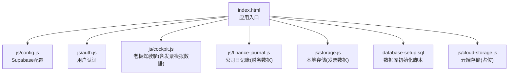
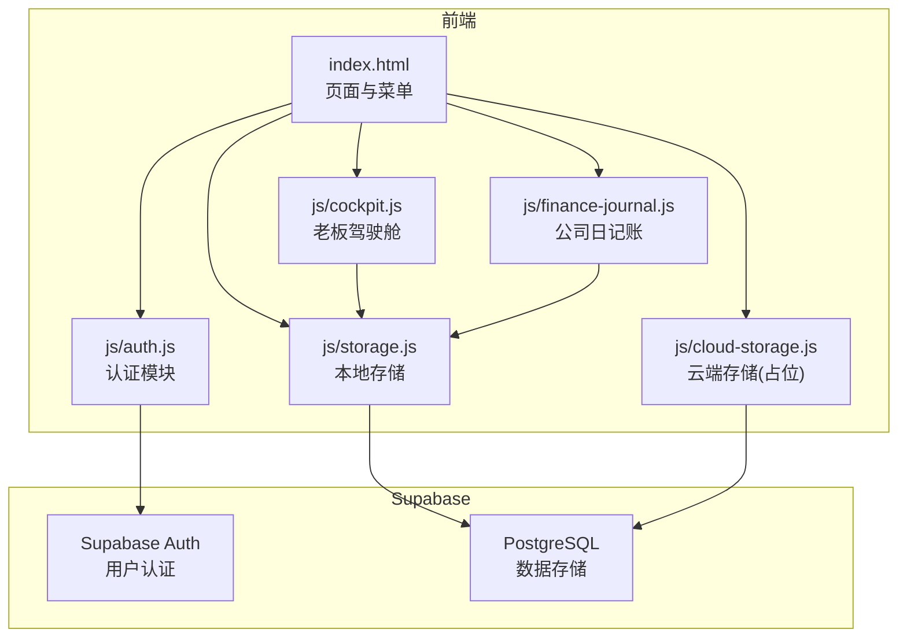
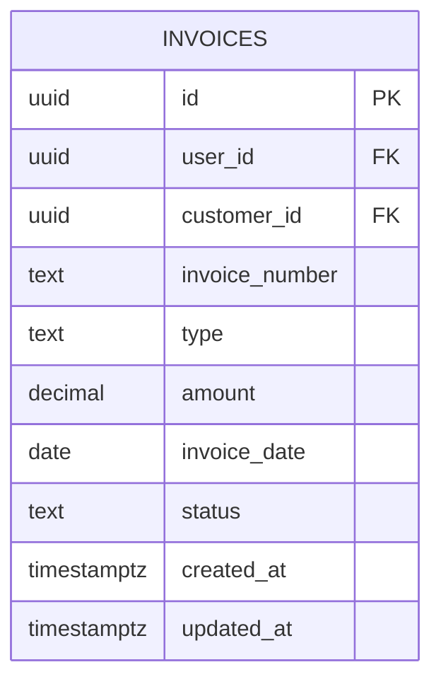
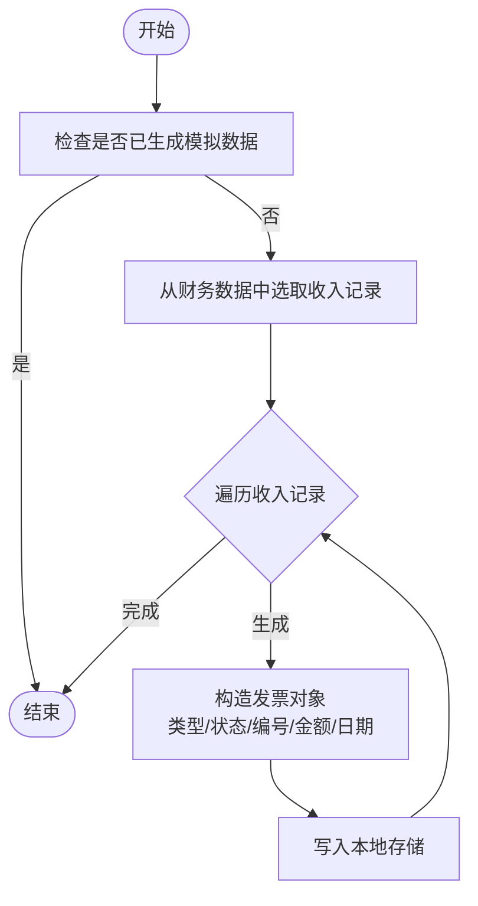
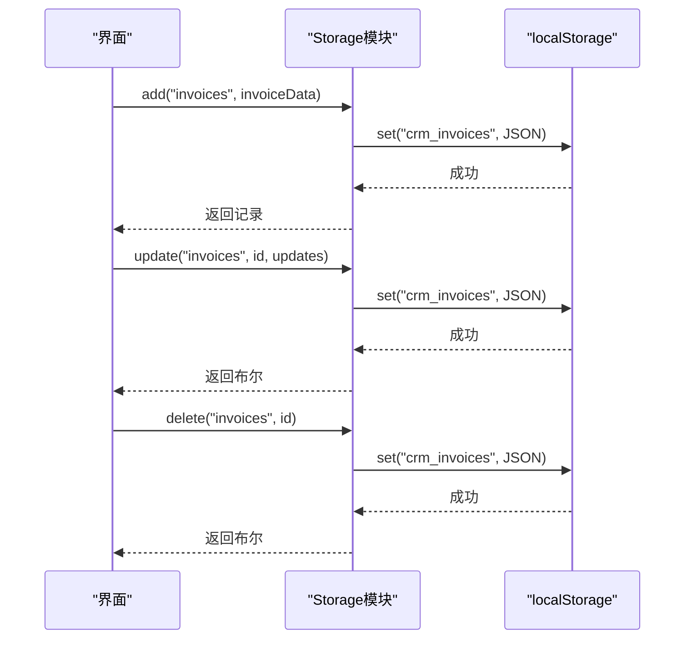
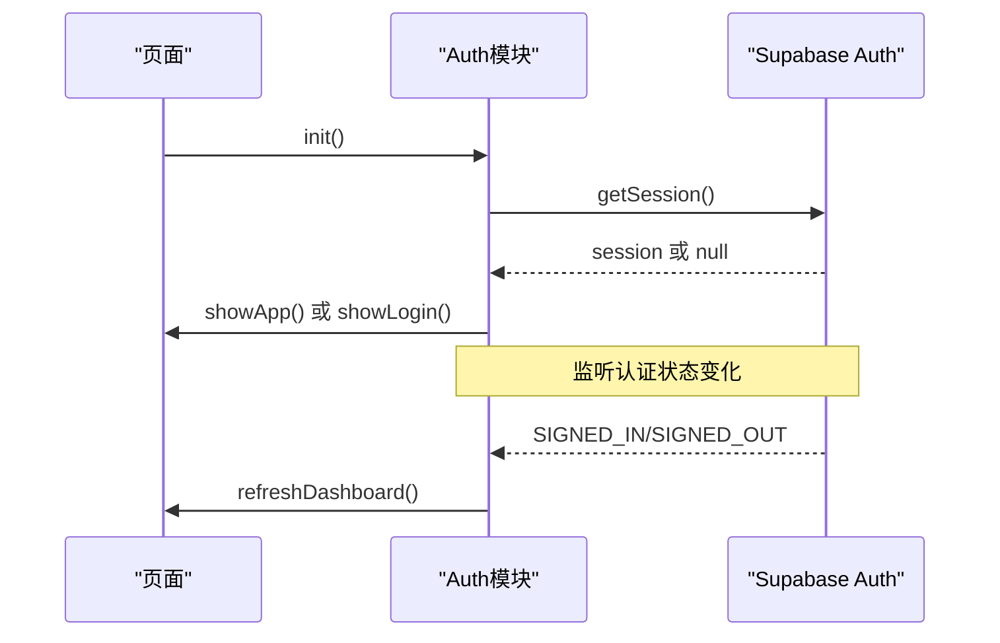
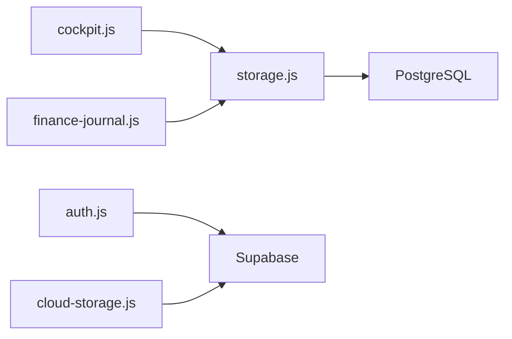

# 发票管理

<cite>
**本文引用的文件**
- [README.md](file://README.md)
- [快速入门.md](file://快速入门.md)
- [index.html](file://index.html)
- [js/config.js](file://js/config.js)
- [js/auth.js](file://js/auth.js)
- [js/cloud-storage.js](file://js/cloud-storage.js)
- [js/cockpit.js](file://js/cockpit.js)
- [js/finance-journal.js](file://js/finance-journal.js)
- [js/storage.js](file://js/storage.js)
- [database-setup.sql](file://database-setup.sql)
</cite>

## 目录
1. [简介](#简介)
2. [项目结构](#项目结构)
3. [核心组件](#核心组件)
4. [架构总览](#架构总览)
5. [详细组件分析](#详细组件分析)
6. [依赖关系分析](#依赖关系分析)
7. [性能考量](#性能考量)
8. [故障排查指南](#故障排查指南)
9. [结论](#结论)
10. [附录](#附录)

## 简介
本文件面向“陈苗系统”的发票管理模块，基于仓库现有代码进行系统化梳理与说明。当前系统已具备发票数据模型与模拟数据生成能力，并通过老板驾驶舱展示发票相关指标。本文将围绕发票的录入、类型管理、状态跟踪、模拟数据生成等维度进行深入解析，并结合系统整体架构给出扩展建议与最佳实践。

## 项目结构
系统采用纯前端架构，通过 Supabase 提供云端认证与数据库能力；发票数据模型在数据库层面已定义，前端通过本地存储与模拟数据配合展示发票管理能力。

图表来源
- [index.html:1-381](file://index.html#L1-L381)
- [js/config.js:1-10](file://js/config.js#L1-L10)
- [js/auth.js:1-259](file://js/auth.js#L1-L259)
- [js/cockpit.js:1-624](file://js/cockpit.js#L1-L624)
- [js/finance-journal.js:1-800](file://js/finance-journal.js#L1-L800)
- [js/storage.js:1-208](file://js/storage.js#L1-L208)
- [database-setup.sql:1-148](file://database-setup.sql#L1-L148)
- [js/cloud-storage.js:1-9](file://js/cloud-storage.js#L1-L9)

章节来源
- [README.md:1-135](file://README.md#L1-L135)
- [快速入门.md:1-61](file://快速入门.md#L1-L61)
- [index.html:1-381](file://index.html#L1-L381)

## 核心组件
- 发票数据模型与索引：数据库脚本定义了发票表结构、索引与行级安全策略，确保数据完整性与用户隔离。
- 发票模拟数据生成：老板驾驶舱模块内置模拟数据生成器，自动生成发票样本，便于演示与测试。
- 本地存储与导入导出：本地存储模块提供发票数据的增删改查、导入导出能力，支持初始化示例数据。
- 认证与会话：用户认证模块负责登录、注册、登出与会话监听，保障系统安全。
- 云端存储占位：云端存储模块预留接口，当前返回可用性检测结果，后续可接入 Supabase 云端同步。

章节来源
- [database-setup.sql:51-63](file://database-setup.sql#L51-L63)
- [js/cockpit.js:191-211](file://js/cockpit.js#L191-L211)
- [js/storage.js:3-88](file://js/storage.js#L3-L88)
- [js/auth.js:3-252](file://js/auth.js#L3-L252)
- [js/cloud-storage.js:4-8](file://js/cloud-storage.js#L4-L8)

## 架构总览
系统采用“前端 + Supabase”架构，认证与数据存储分离。发票数据在数据库层面具备标准字段与约束，前端通过本地存储与模拟数据进行演示，同时保留云端同步能力。

图表来源
- [index.html:144-352](file://index.html#L144-L352)
- [js/auth.js:7-54](file://js/auth.js#L7-L54)
- [js/cockpit.js:217-224](file://js/cockpit.js#L217-L224)
- [js/finance-journal.js:28-40](file://js/finance-journal.js#L28-L40)
- [js/storage.js:3-88](file://js/storage.js#L3-L88)
- [js/cloud-storage.js:4-8](file://js/cloud-storage.js#L4-L8)
- [database-setup.sql:10-148](file://database-setup.sql#L10-L148)

## 详细组件分析

### 发票数据模型与索引
- 表结构要点
  - 主键：UUID
  - 关联：用户与客户外键
  - 关键字段：发票编号、类型、金额、开票日期、状态
  - 时间戳：创建与更新时间
- 索引设计：针对用户、客户、状态等常用查询维度建立索引，提升查询性能
- 行级安全策略：启用 RLS 并为发票表设置“仅限本人可见/写入”的策略，确保数据隔离

图表来源
- [database-setup.sql:51-63](file://database-setup.sql#L51-L63)

章节来源
- [database-setup.sql:51-63](file://database-setup.sql#L51-L63)
- [database-setup.sql:68-76](file://database-setup.sql#L68-L76)
- [database-setup.sql:85-107](file://database-setup.sql#L85-L107)

### 发票模拟数据生成（老板驾驶舱）
- 生成逻辑
  - 从财务收入数据中抽取部分记录，按固定规则生成发票
  - 发票类型：增值税专用发票/增值税普通发票
  - 状态：已开具/待开具/已作废（按比例随机）
  - 编号：按年份与序号生成
- 数据落盘：生成后写入本地存储，供驾驶舱与其它模块使用

图表来源
- [js/cockpit.js:191-211](file://js/cockpit.js#L191-L211)

章节来源
- [js/cockpit.js:191-211](file://js/cockpit.js#L191-L211)

### 本地存储与发票数据操作
- 能力概览
  - 获取全部/指定类型数据
  - 新增、更新、删除记录
  - 按 ID 查询与清空
  - 导入/导出数据（JSON）
- 发票数据操作
  - 新增发票：自动生成 ID 与创建时间
  - 更新发票：支持字段合并与更新时间戳
  - 删除发票：按 ID 过滤
  - 导入/导出：支持一次性导入导出发票数据

图表来源
- [js/storage.js:37-61](file://js/storage.js#L37-L61)
- [js/storage.js:77-87](file://js/storage.js#L77-L87)

章节来源
- [js/storage.js:3-88](file://js/storage.js#L3-L88)

### 认证与会话（与发票数据隔离）
- 初始化：检查本地会话或 Supabase 会话，决定显示登录页或应用页
- 事件监听：监听认证状态变化，自动刷新仪表盘
- 登录/注册/登出：统一处理错误与加载态

图表来源
- [js/auth.js:7-54](file://js/auth.js#L7-L54)
- [js/auth.js:200-220](file://js/auth.js#L200-L220)

章节来源
- [js/auth.js:3-252](file://js/auth.js#L3-L252)

### 云端存储（占位与扩展）
- 当前状态：提供可用性检测，返回是否存在 Supabase 客户端
- 扩展方向：未来可在此模块实现与 Supabase 的云端同步，包括发票数据的上传/下载与冲突解决

章节来源
- [js/cloud-storage.js:4-8](file://js/cloud-storage.js#L4-L8)

## 依赖关系分析
- 模块耦合
  - 发票数据依赖本地存储模块（当前演示阶段）
  - 老板驾驶舱依赖本地存储生成模拟数据
  - 认证模块独立于发票模块，但影响数据可见性（RLS）
- 外部依赖
  - Supabase：认证与数据库
  - Chart.js：驾驶舱图表渲染
- 潜在风险
  - 本地存储与云端同步存在数据一致性风险，需在扩展时引入版本控制与冲突策略

图表来源
- [js/cockpit.js:217-224](file://js/cockpit.js#L217-L224)
- [js/finance-journal.js:28-40](file://js/finance-journal.js#L28-L40)
- [js/auth.js:7-54](file://js/auth.js#L7-L54)
- [js/cloud-storage.js:4-8](file://js/cloud-storage.js#L4-L8)
- [database-setup.sql:10-148](file://database-setup.sql#L10-L148)

章节来源
- [js/cockpit.js:217-224](file://js/cockpit.js#L217-L224)
- [js/finance-journal.js:28-40](file://js/finance-journal.js#L28-L40)
- [js/auth.js:7-54](file://js/auth.js#L7-L54)
- [js/cloud-storage.js:4-8](file://js/cloud-storage.js#L4-L8)
- [database-setup.sql:10-148](file://database-setup.sql#L10-L148)

## 性能考量
- 查询优化
  - 数据库已为发票表的关键字段建立索引，建议在前端查询时尽量使用这些字段作为过滤条件
- 前端渲染
  - 驱动舱与日记账采用虚拟滚动与分页策略，减少 DOM 渲染压力
- 数据量控制
  - 本地存储适合演示场景；生产环境建议通过云端分页与缓存策略降低前端内存占用

## 故障排查指南
- 登录/认证问题
  - 检查 Supabase 配置是否正确（URL 与匿名密钥）
  - 查看浏览器控制台是否有认证错误
- 数据不可见
  - 确认 RLS 策略生效，用户仅能访问自身数据
- 本地数据异常
  - 清空本地存储后重新初始化示例数据
- 云端同步
  - 当前云端存储模块为占位，若出现同步问题，请检查 Supabase 客户端初始化与网络状态

章节来源
- [js/auth.js:57-82](file://js/auth.js#L57-L82)
- [js/storage.js:70-74](file://js/storage.js#L70-L74)
- [js/cloud-storage.js:4-8](file://js/cloud-storage.js#L4-L8)

## 结论
当前系统已具备发票数据模型与模拟数据生成能力，能够支撑发票管理的基础演示。建议在后续版本中：
- 完成云端存储模块，实现发票数据的云端同步与版本控制
- 在前端增加发票录入、编辑、导入导出与状态变更的交互
- 引入发票真伪验证与电子发票集成的扩展点
- 完善税务计算与报表输出能力

## 附录
- 快速开始与部署
  - 参考“快速入门”文档完成 Supabase 项目创建与数据库初始化
  - 修改配置文件中的 Supabase 凭据
  - 打开 index.html 进行测试

章节来源
- [快速入门.md:1-61](file://快速入门.md#L1-L61)
- [README.md:67-86](file://README.md#L67-L86)