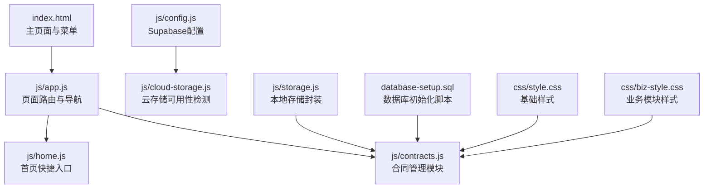
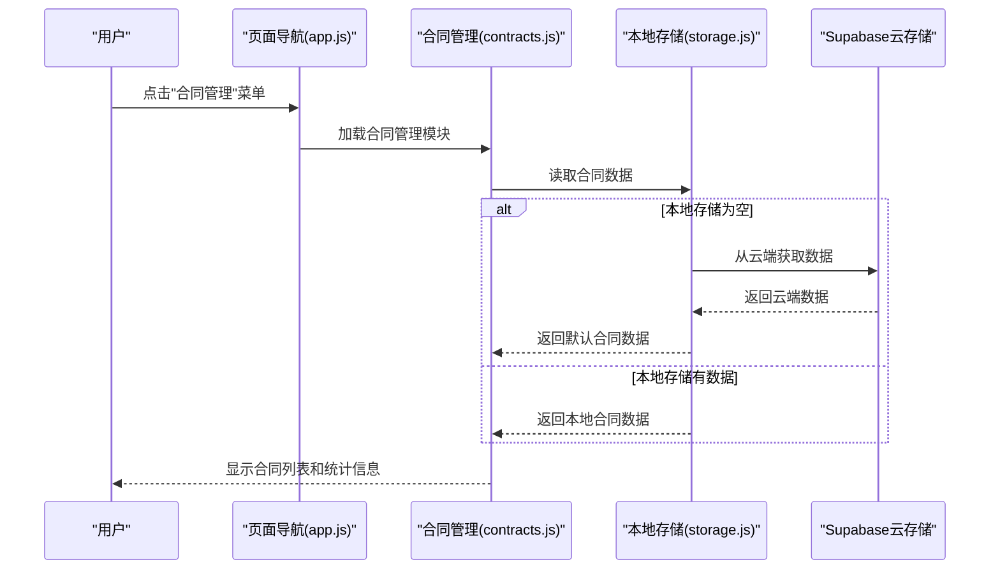
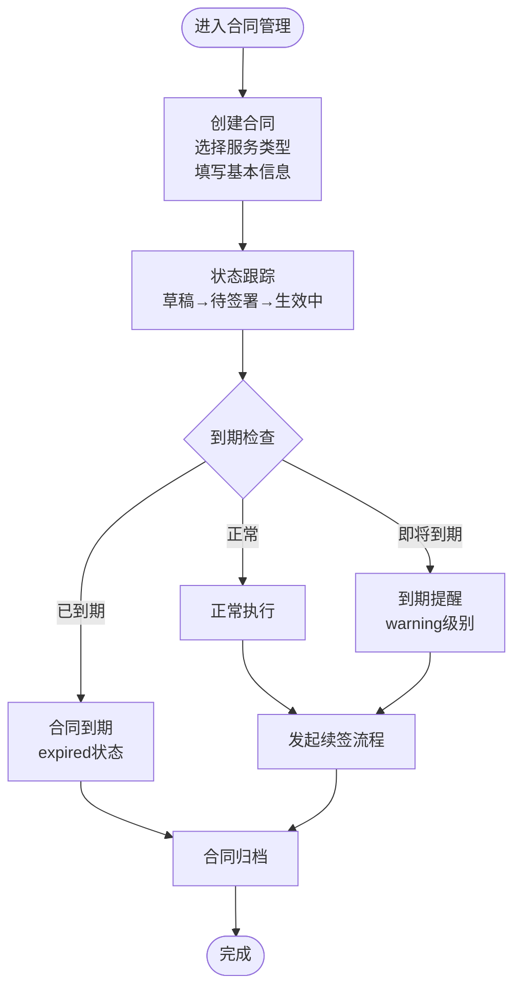
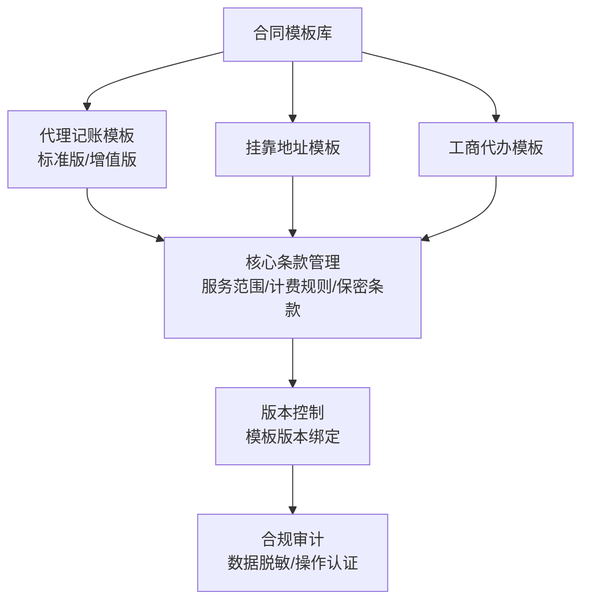
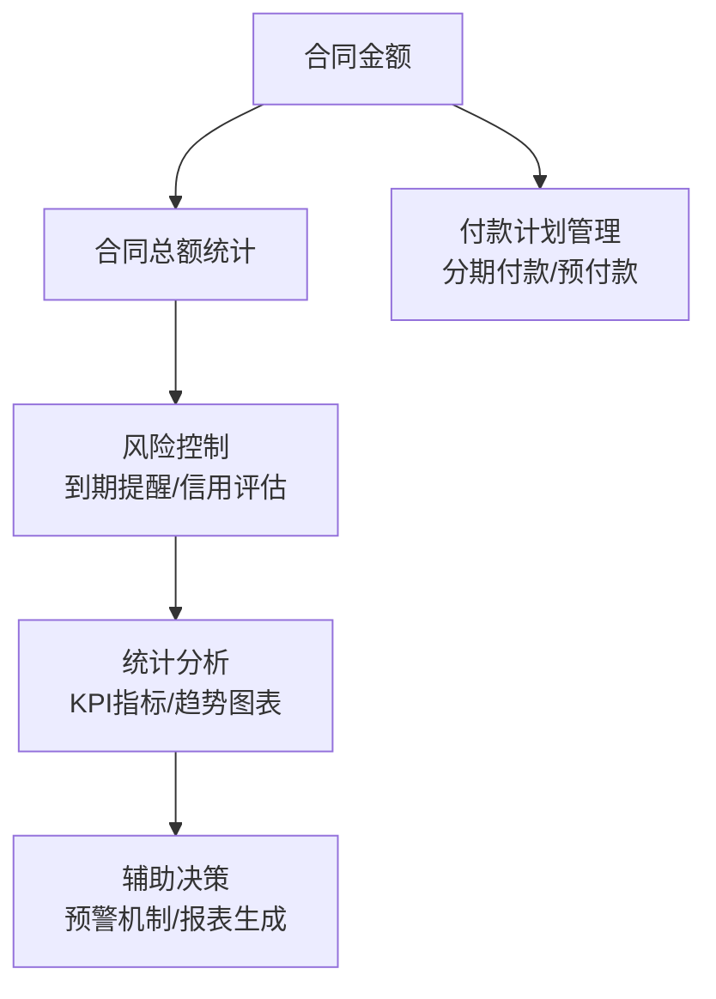
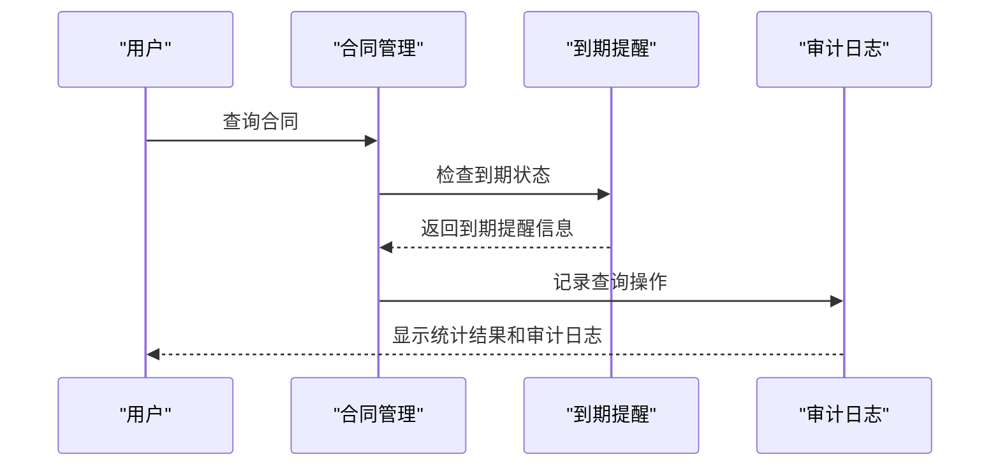
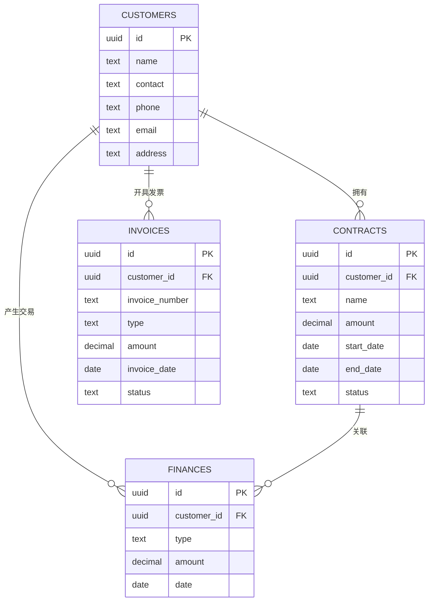
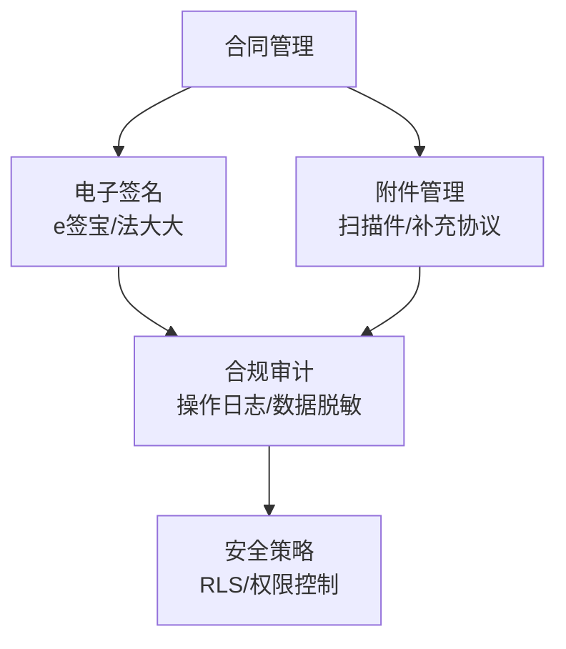
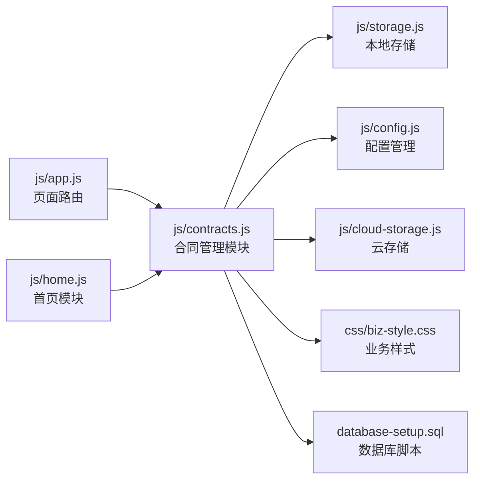

# 合同管理

<cite>
**本文引用的文件**   
- [README.md](file://README.md)
- [快速入门.md](file://快速入门.md)
- [index.html](file://index.html)
- [js/config.js](file://js/config.js)
- [js/cloud-storage.js](file://js/cloud-storage.js)
- [js/app.js](file://js/app.js)
- [js/home.js](file://js/home.js)
- [js/cockpit.js](file://js/cockpit.js)
- [js/storage.js](file://js/storage.js)
- [js/contracts.js](file://js/contracts.js)
- [database-setup.sql](file://database-setup.sql)
- [css/style.css](file://css/style.css)
- [css/biz-style.css](file://css/biz-style.css)
</cite>

## 更新摘要
**变更内容**   
- 新增完整的合同管理模块实现，包括合同生命周期管理、到期提醒、模板系统、合规审计等功能
- 更新架构概览以反映真实的合同管理流程
- 添加合同状态管理、到期提醒机制、模板系统等新功能说明
- 更新依赖关系分析以包含新的合同管理模块

## 目录
1. [简介](#简介)
2. [项目结构](#项目结构)
3. [核心组件](#核心组件)
4. [架构概览](#架构概览)
5. [详细组件分析](#详细组件分析)
6. [依赖关系分析](#依赖关系分析)
7. [性能考虑](#性能考虑)
8. [故障排查指南](#故障排查指南)
9. [结论](#结论)
10. [附录](#附录)

## 简介
本文档详细介绍"陈苗系统"的合同管理模块，该模块现已完全实现，提供从合同创建、状态跟踪、到期提醒到归档的完整生命周期管理。合同管理模块支持多种服务类型的合同模板（代理记账、挂靠地址、工商代办），具备到期提醒机制、合规审计日志、电子签名集成等高级功能。系统通过本地存储和Supabase云存储双重机制确保数据安全与可靠性。

## 项目结构
合同管理模块采用模块化架构，与系统其他模块协同工作：

**图表来源**
- [index.html:170-334](file://index.html#L170-L334)
- [js/app.js:85-135](file://js/app.js#L85-L135)
- [js/home.js:104-111](file://js/home.js#L104-L111)
- [js/contracts.js:1-218](file://js/contracts.js#L1-L218)
- [js/config.js:1-20](file://js/config.js#L1-L20)
- [js/cloud-storage.js:1-9](file://js/cloud-storage.js#L1-L9)
- [js/storage.js:1-88](file://js/storage.js#L1-L88)
- [database-setup.sql:10-63](file://database-setup.sql#L10-L63)
- [css/style.css:1-800](file://css/style.css#L1-L800)
- [css/biz-style.css:1-800](file://css/biz-style.css#L1-L800)

**章节来源**
- [README.md:14-47](file://README.md#L14-L47)
- [快速入门.md:32-44](file://快速入门.md#L32-L44)
- [index.html:170-334](file://index.html#L170-L334)
- [js/app.js:85-135](file://js/app.js#L85-L135)
- [js/home.js:104-111](file://js/home.js#L104-L111)
- [js/contracts.js:1-218](file://js/contracts.js#L1-L218)
- [js/config.js:1-20](file://js/config.js#L1-L20)
- [js/cloud-storage.js:1-9](file://js/cloud-storage.js#L1-L9)
- [js/storage.js:1-88](file://js/storage.js#L1-L88)
- [database-setup.sql:10-63](file://database-setup.sql#L10-L63)
- [css/style.css:1-800](file://css/style.css#L1-L800)
- [css/biz-style.css:1-800](file://css/biz-style.css#L1-L800)

## 核心组件
合同管理模块包含以下核心组件：

- **合同管理主模块**：提供合同创建、编辑、查询、状态管理等核心功能
- **到期提醒系统**：自动检测合同到期并提供分级提醒
- **合同模板系统**：支持多种服务类型的标准化合同模板
- **合规审计日志**：记录所有合同变更操作，确保合规性
- **状态跟踪机制**：实时跟踪合同状态变化和剩余天数
- **本地存储与云存储**：双重数据持久化机制

**章节来源**
- [js/contracts.js:4-208](file://js/contracts.js#L4-L208)
- [js/cockpit.js:214-224](file://js/cockpit.js#L214-L224)
- [js/storage.js:1-88](file://js/storage.js#L1-L88)
- [js/config.js:1-20](file://js/config.js#L1-L20)
- [js/cloud-storage.js:1-9](file://js/cloud-storage.js#L1-L9)
- [database-setup.sql:24-36](file://database-setup.sql#L24-L36)

## 架构概览
合同管理模块采用前后端分离架构，通过本地存储和Supabase云存储实现数据持久化：

**图表来源**
- [js/home.js:107-111](file://js/home.js#L107-L111)
- [js/app.js:85-135](file://js/app.js#L85-L135)
- [js/contracts.js:7-11](file://js/contracts.js#L7-L11)
- [js/storage.js:1-88](file://js/storage.js#L1-L88)

## 详细组件分析

### 合同生命周期管理（创建→状态跟踪→到期提醒→归档）
合同管理模块实现了完整的合同生命周期管理：

- **合同创建**：支持多种服务类型的合同创建，包括代理记账、挂靠地址、工商代办
- **状态跟踪**：实时跟踪合同状态变化，包括草稿、待签署、生效中、已到期、已终止
- **到期提醒**：自动检测合同到期并提供分级提醒（正常、notice、warning、urgent）
- **归档管理**：支持合同到期后的归档和历史查询

**图表来源**
- [js/contracts.js:211-217](file://js/contracts.js#L211-L217)
- [js/contracts.js:14-30](file://js/contracts.js#L14-L30)
- [js/contracts.js:64-87](file://js/contracts.js#L64-L87)

**章节来源**
- [js/contracts.js:211-217](file://js/contracts.js#L211-L217)
- [js/contracts.js:14-30](file://js/contracts.js#L14-L30)
- [js/contracts.js:64-87](file://js/contracts.js#L64-L87)

### 合同模板系统、条款管理与版本控制
合同模板系统提供标准化的合同管理：

- **模板分类**：支持代理记账、挂靠地址、工商代办三种服务类型的模板
- **条款管理**：每个模板包含核心条款，如服务范围、计费规则、保密条款等
- **版本控制**：合同创建时绑定模板版本，支持版本历史追踪
- **合规性**：模板符合《个人信息保护法》要求

**图表来源**
- [js/contracts.js:113-133](file://js/contracts.js#L113-L133)
- [js/contracts.js:135-153](file://js/contracts.js#L135-L153)

**章节来源**
- [js/contracts.js:113-133](file://js/contracts.js#L113-L133)
- [js/contracts.js:135-153](file://js/contracts.js#L135-L153)

### 合同金额计算、付款计划与风险控制
系统提供全面的财务管理和风险控制功能：

- **金额计算**：自动计算合同总额、生效中合同数量、即将到期合同数量
- **付款计划**：支持按服务类型设置不同的付款节点和计费规则
- **风险控制**：通过到期提醒、客户信用等级、合同金额阈值等指标进行风险评估
- **统计分析**：提供合同管理的KPI指标和趋势分析

**图表来源**
- [js/contracts.js:66](file://js/contracts.js#L66)
- [js/contracts.js:135-153](file://js/contracts.js#L135-L153)

**章节来源**
- [js/contracts.js:66](file://js/contracts.js#L66)
- [js/contracts.js:135-153](file://js/contracts.js#L135-L153)

### 查询、统计分析与报表生成
合同管理模块提供强大的查询和分析功能：

- **合同查询**：支持按客户、服务类型、状态、时间范围等条件查询
- **统计分析**：提供合同总数、生效中合同、即将到期合同、合同总额等关键指标
- **到期提醒**：自动识别即将到期的合同并提供分级提醒
- **审计日志**：记录所有合同操作，支持合规审计

**图表来源**
- [js/contracts.js:90-111](file://js/contracts.js#L90-L111)
- [js/contracts.js:135-153](file://js/contracts.js#L135-L153)

**章节来源**
- [js/contracts.js:90-111](file://js/contracts.js#L90-L111)
- [js/contracts.js:135-153](file://js/contracts.js#L135-L153)

### 与客户管理、财务管理的数据集成
合同管理模块与系统其他模块深度集成：

- **客户管理集成**：合同与客户建立一对一关联，支持客户维度的合同统计
- **财务管理集成**：合同金额与财务记录关联，支持财务对账和报表生成
- **发票管理集成**：合同执行过程中的发票开具和管理
- **数据一致性**：通过Supabase的行级安全策略确保数据访问控制

**图表来源**
- [database-setup.sql:11-22](file://database-setup.sql#L11-L22)
- [database-setup.sql:24-36](file://database-setup.sql#L24-L36)
- [database-setup.sql:39-49](file://database-setup.sql#L39-L49)

**章节来源**
- [database-setup.sql:11-22](file://database-setup.sql#L11-L22)
- [database-setup.sql:24-36](file://database-setup.sql#L24-L36)
- [database-setup.sql:39-49](file://database-setup.sql#L39-L49)

### 电子签名、附件管理与合规性
合同管理模块提供完整的合规性保障：

- **电子签名集成**：支持e签宝、法大大等第三方电子签名平台
- **附件管理**：支持合同扫描件、补充协议等附件的上传和管理
- **合规审计**：完整的操作日志记录，支持数据脱敏和二次认证
- **安全策略**：通过Supabase的行级安全策略确保数据访问安全

**图表来源**
- [js/contracts.js:130](file://js/contracts.js#L130)
- [js/contracts.js:150](file://js/contracts.js#L150)
- [database-setup.sql:78-107](file://database-setup.sql#L78-L107)

**章节来源**
- [js/contracts.js:130](file://js/contracts.js#L130)
- [js/contracts.js:150](file://js/contracts.js#L150)
- [database-setup.sql:78-107](file://database-setup.sql#L78-L107)

## 依赖关系分析
合同管理模块的依赖关系如下：

**图表来源**
- [js/app.js:85-135](file://js/app.js#L85-L135)
- [js/home.js:107-111](file://js/home.js#L107-L111)
- [js/contracts.js:1-218](file://js/contracts.js#L1-L218)
- [js/storage.js:1-88](file://js/storage.js#L1-L88)
- [js/config.js:1-20](file://js/config.js#L1-L20)
- [js/cloud-storage.js:1-9](file://js/cloud-storage.js#L1-L9)
- [css/biz-style.css:1-800](file://css/biz-style.css#L1-L800)
- [database-setup.sql:10-63](file://database-setup.sql#L10-L63)

**章节来源**
- [js/app.js:85-135](file://js/app.js#L85-L135)
- [js/home.js:107-111](file://js/home.js#L107-L111)
- [js/contracts.js:1-218](file://js/contracts.js#L1-L218)
- [js/storage.js:1-88](file://js/storage.js#L1-L88)
- [js/config.js:1-20](file://js/config.js#L1-L20)
- [js/cloud-storage.js:1-9](file://js/cloud-storage.js#L1-L9)
- [css/biz-style.css:1-800](file://css/biz-style.css#L1-L800)
- [database-setup.sql:10-63](file://database-setup.sql#L10-L63)

## 性能考虑
合同管理模块的性能优化策略：

- **数据缓存**：使用localStorage缓存合同数据，减少服务器请求
- **懒加载**：合同管理模块按需加载，不影响其他模块性能
- **索引优化**：数据库脚本已创建必要的索引，提升查询性能
- **分页处理**：大量数据时采用分页显示，避免内存溢出
- **增量更新**：到期检查采用增量更新，避免全量扫描

## 故障排查指南
合同管理模块常见问题及解决方案：

- **合同数据丢失**：检查localStorage权限和容量，必要时清理缓存
- **到期提醒不准确**：确认系统时间和时区设置，检查合同日期格式
- **模板加载失败**：验证网络连接，检查模板URL配置
- **审计日志缺失**：确认操作权限，检查日志记录逻辑
- **电子签名失败**：检查第三方API配置和网络连接

**章节来源**
- [js/config.js:1-20](file://js/config.js#L1-L20)
- [js/cloud-storage.js:1-9](file://js/cloud-storage.js#L1-L9)
- [js/storage.js:15-34](file://js/storage.js#L15-L34)

## 结论
合同管理模块现已完全实现，提供了完整的合同生命周期管理功能。模块支持多种服务类型的合同模板、智能的到期提醒机制、完善的合规审计日志，以及与客户管理、财务管理的深度集成。通过本地存储和云存储的双重机制，确保了数据的安全性和可靠性。建议后续继续完善电子签名集成、付款计划管理、风险控制算法等功能，进一步提升合同管理的智能化水平。

## 附录
- **快速开始**：参考快速入门文档完成系统部署和配置
- **数据库结构**：合同表、客户表、财务表、发票表的详细字段定义
- **API接口**：合同管理模块的接口规范和使用说明
- **配置选项**：合同管理模块的配置参数和自定义选项

**章节来源**
- [快速入门.md:32-44](file://快速入门.md#L32-L44)
- [database-setup.sql:11-63](file://database-setup.sql#L11-L63)
- [js/contracts.js:1-218](file://js/contracts.js#L1-L218)