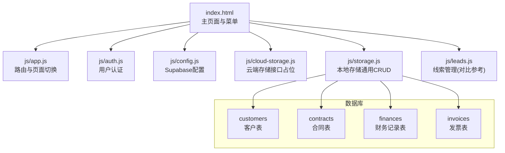
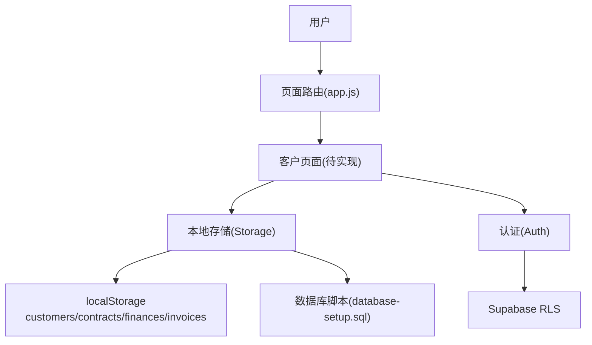
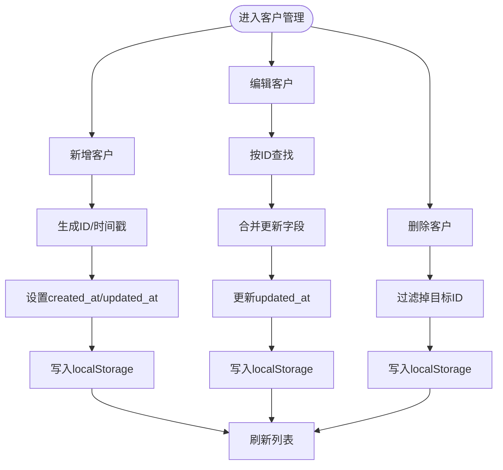
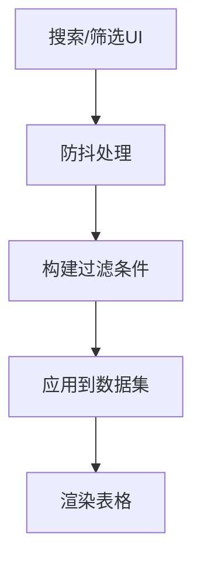
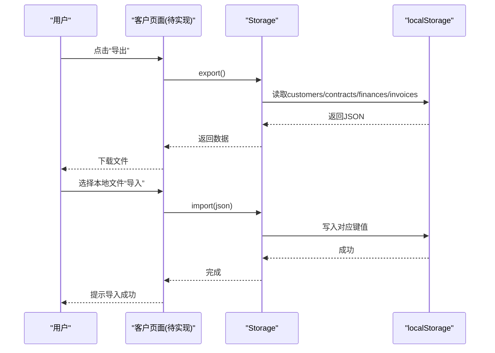
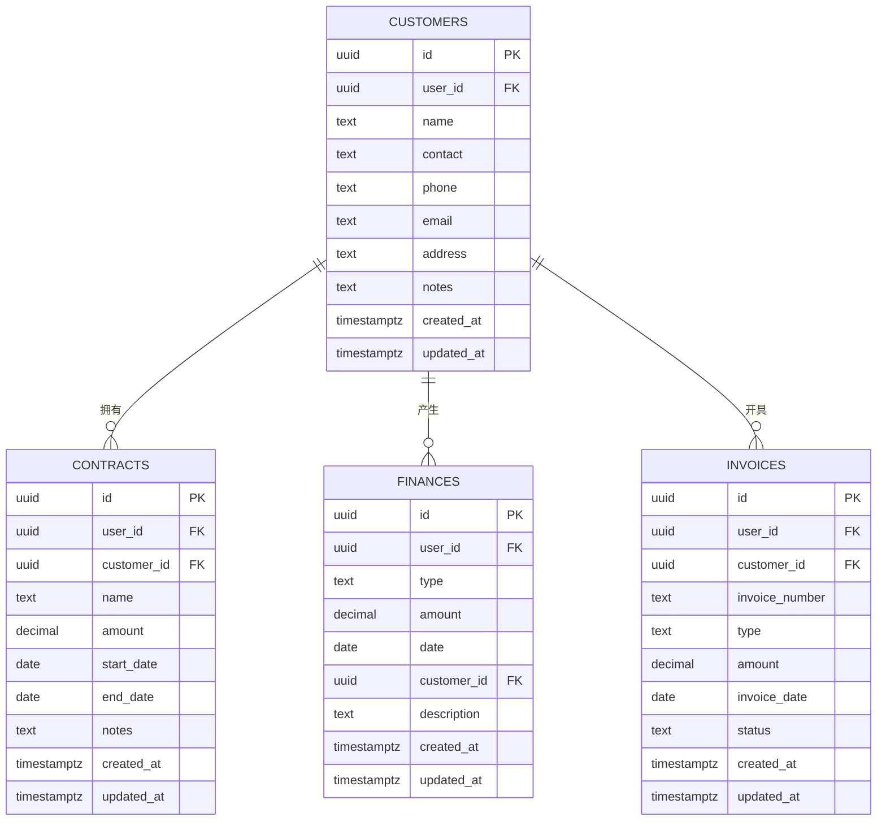
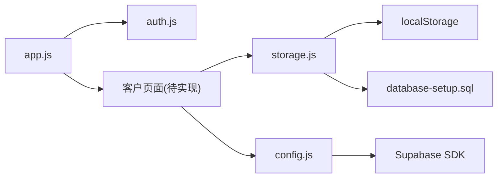

# 客户管理

<cite>
**本文引用的文件**
- [README.md](file://README.md)
- [index.html](file://index.html)
- [database-setup.sql](file://database-setup.sql)
- [config.js](file://js/config.js)
- [auth.js](file://js/auth.js)
- [cloud-storage.js](file://js/cloud-storage.js)
- [storage.js](file://js/storage.js)
- [app.js](file://js/app.js)
- [leads.js](file://js/leads.js)
</cite>

## 目录
1. [简介](#简介)
2. [项目结构](#项目结构)
3. [核心组件](#核心组件)
4. [架构总览](#架构总览)
5. [详细组件分析](#详细组件分析)
6. [依赖分析](#依赖分析)
7. [性能考虑](#性能考虑)
8. [故障排查指南](#故障排查指南)
9. [结论](#结论)
10. [附录](#附录)

## 简介
本文件面向“陈苗系统”的客户管理模块，基于仓库现有实现进行系统化梳理与说明。当前系统采用纯前端本地存储（localStorage）作为默认数据持久化方式，并预留了云端 Supabase 的集成路径。客户管理模块覆盖以下能力：
- 客户信息录入、编辑、查询与删除
- 客户数据模型、字段定义与业务规则
- 客户分类、标签管理与搜索过滤
- 数据导入导出与最佳实践
- 与合同管理、财务管理的数据关联关系
- 数据验证规则、重复客户检查与数据完整性保障
- 与系统其他模块（如线索管理、看板等）的交互

说明：根据仓库 README 描述，客户管理具备“客户信息录入、客户搜索、客户列表展示”能力；但实际代码中仅实现了本地存储的通用 CRUD 模块与示例数据，尚未在 index.html 中挂载独立的“客户管理”页面。因此本文在“实现现状”基础上，提供“功能蓝图”与“落地建议”，帮助后续扩展。

## 项目结构
系统前端采用 HTML + CSS + 原生 JavaScript 构建，核心入口为 index.html，模块通过 js/*.js 文件按需加载。数据库初始化脚本 database-setup.sql 定义了 customers、contracts、finances、invoices 等核心表及 RLS 策略。

图表来源
- [index.html:1-381](file://index.html#L1-L381)
- [app.js:1-156](file://js/app.js#L1-L156)
- [auth.js:1-259](file://js/auth.js#L1-L259)
- [config.js:1-20](file://js/config.js#L1-L20)
- [cloud-storage.js:1-9](file://js/cloud-storage.js#L1-L9)
- [storage.js:1-208](file://js/storage.js#L1-L208)
- [database-setup.sql:1-148](file://database-setup.sql#L1-L148)

章节来源
- [README.md:1-135](file://README.md#L1-L135)
- [index.html:1-381](file://index.html#L1-L381)
- [database-setup.sql:1-148](file://database-setup.sql#L1-L148)

## 核心组件
- 本地存储模块（Storage）：提供 customers/contracts/finances/invoices 的统一 CRUD 能力，包括导入导出、清空、按 ID 查询等。
- 客户数据模型：customers 表字段与约束定义见数据库脚本；本地存储模块提供与之对应的结构化对象。
- 认证模块（Auth）：负责登录、注册、登出与会话状态管理，为数据隔离与用户维度访问提供基础。
- Supabase 集成：config.js 提供客户端初始化；cloud-storage.js 为云端存储接口占位，便于后续替换。
- 页面路由（app.js）：负责菜单点击与页面切换，为后续挂载“客户管理页面”提供基础设施。

章节来源
- [storage.js:1-208](file://js/storage.js#L1-L208)
- [database-setup.sql:10-22](file://database-setup.sql#L10-L22)
- [auth.js:1-259](file://js/auth.js#L1-L259)
- [config.js:1-20](file://js/config.js#L1-L20)
- [cloud-storage.js:1-9](file://js/cloud-storage.js#L1-L9)
- [app.js:1-156](file://js/app.js#L1-L156)

## 架构总览
客户管理在当前版本采用“本地存储优先 + Supabase 可插拔”的架构设计：
- 默认使用 localStorage 存储 customers 数据，提供 CRUD 与导入导出能力
- 通过 Storage 接口抽象，未来可无缝切换至 Supabase
- 认证模块确保用户数据隔离（RLS），避免跨用户数据泄露
- 与合同、财务、发票表建立外键关联，形成业务闭环

图表来源
- [app.js:85-135](file://js/app.js#L85-L135)
- [storage.js:1-208](file://js/storage.js#L1-L208)
- [auth.js:1-259](file://js/auth.js#L1-L259)
- [database-setup.sql:78-107](file://database-setup.sql#L78-L107)

## 详细组件分析

### 客户数据模型与字段定义
- customers 表字段与约束
  - id：UUID，默认自增
  - user_id：UUID，外键指向 auth.users，用于数据隔离
  - name：文本，必填
  - contact/phone/email/address/notes：文本，非必填
  - created_at/updated_at：时间戳，默认 NOW()

- 本地存储对应结构
  - 与数据库 customers 字段一一对应，本地示例数据包含 name、contact、phone、email、address、notes、created_at 等字段
  - 本地未持久化 user_id，需在云端模式下补齐

章节来源
- [database-setup.sql:10-22](file://database-setup.sql#L10-L22)
- [storage.js:94-125](file://js/storage.js#L94-L125)

### 客户 CRUD 实现（本地存储）
- 录入（新增）
  - 生成唯一 id（本地为时间戳字符串，云端应使用 UUID）
  - 设置 created_at/updated_at
  - 写入 localStorage 对应键值
- 编辑（更新）
  - 按 id 查找并合并更新字段
  - 更新 updated_at
- 查询
  - getAll/get 获取全部
  - getById 按 id 获取单条
- 删除
  - 过滤掉目标 id 并回写

图表来源
- [storage.js:36-67](file://js/storage.js#L36-L67)

章节来源
- [storage.js:1-208](file://js/storage.js#L1-L208)

### 搜索与过滤（参考线索管理）
虽然客户管理页面尚未实现，但线索管理模块提供了成熟的搜索与过滤思路，可直接复用：
- 搜索框：输入时防抖（如 300ms）
- 过滤器：按意向等级、来源、状态等维度筛选
- 渲染：表格展示，支持点击查看详情

图表来源
- [leads.js:425-449](file://js/leads.js#L425-L449)
- [leads.js:366-388](file://js/leads.js#L366-L388)

章节来源
- [leads.js:1-679](file://js/leads.js#L1-L679)

### 客户分类、标签管理与搜索过滤（蓝图）
- 分类：可在 customers 表新增 type/level 字段，或通过 contracts/finances 的聚合结果推导客户价值等级
- 标签：可扩展 tags 字段或引入中间表，实现多标签关联
- 搜索：支持按 name/phone/email/address/notes 等字段模糊匹配
- 过滤：支持按客户等级、创建时间范围、合同金额区间等条件组合筛选

（本节为功能蓝图，当前代码未实现）

### 数据导入导出（本地存储）
- 导出：读取 customers/contracts/finances/invoices 全量数据，返回 JSON
- 导入：将外部 JSON 合并写入对应键值，覆盖既有数据
- 最佳实践
  - 导入前提示风险，建议先备份
  - 导入时校验字段完整性与类型一致性
  - 云端模式下注意 user_id 的归属与 RLS 策略

图表来源
- [storage.js:76-87](file://js/storage.js#L76-L87)

章节来源
- [storage.js:1-208](file://js/storage.js#L1-L208)

### 与合同管理、财务管理的数据关联
- 合同管理：contracts.customer_id 关联 customers.id，支持按客户筛选合同列表
- 财务管理：finances.customer_id 关联 customers.id，支持按客户查看收入/支出明细
- 发票管理：invoices.customer_id 关联 customers.id，支持按客户查看发票清单

图表来源
- [database-setup.sql:10-63](file://database-setup.sql#L10-L63)

章节来源
- [database-setup.sql:1-148](file://database-setup.sql#L1-L148)

### 数据验证规则、重复客户检查与完整性
- 数据验证
  - 必填字段：name
  - 数值字段：amount ≥ 0（合同、财务记录）
  - 日期字段：start_date/end_date、date、invoice_date
  - 类型字段：type ∈ {'income','expense'}（财务）
- 重复客户检查（建议）
  - 基于 phone/email/name 组合去重
  - 导入时提示重复项并允许跳过或合并
- 完整性保障
  - RLS 策略：FOR ALL USING(auth.uid() = user_id) WITH CHECK(auth.uid() = user_id)
  - updated_at 触发器：自动更新时间戳
  - 外键约束：contracts/finances/invoices 的 customer_id ON DELETE SET NULL，避免级联删除影响完整性

章节来源
- [database-setup.sql:24-63](file://database-setup.sql#L24-L63)
- [database-setup.sql:113-139](file://database-setup.sql#L113-L139)

### 与系统其他模块的交互
- 与线索管理（leads.js）对比
  - 两者均采用 localStorage + 通用 CRUD 模式
  - 均提供搜索/过滤/详情面板等 UI 模板
  - 可直接复用线索管理的 UI 结构与交互逻辑
- 与看板（cockpit.js）联动
  - 看板统计使用 localStorage 中的 customers 数据
  - 客户管理完善后，看板可直接读取云端 customers 数据

章节来源
- [leads.js:1-679](file://js/leads.js#L1-L679)
- [cockpit.js:279-321](file://js/cockpit.js#L279-L321)

## 依赖分析
- 模块耦合
  - app.js 作为路由中枢，不直接依赖具体业务模块，便于扩展
  - storage.js 为通用数据层，被多个模块复用
  - auth.js 与 database-setup.sql 的 RLS 策略共同保障数据隔离
- 外部依赖
  - Supabase SDK（通过 config.js 初始化）
  - 浏览器 localStorage（默认持久化）

图表来源
- [app.js:1-156](file://js/app.js#L1-L156)
- [auth.js:1-259](file://js/auth.js#L1-L259)
- [config.js:1-20](file://js/config.js#L1-L20)
- [storage.js:1-208](file://js/storage.js#L1-L208)
- [database-setup.sql:1-148](file://database-setup.sql#L1-L148)

章节来源
- [app.js:1-156](file://js/app.js#L1-L156)
- [auth.js:1-259](file://js/auth.js#L1-L259)
- [config.js:1-20](file://js/config.js#L1-L20)
- [storage.js:1-208](file://js/storage.js#L1-L208)
- [database-setup.sql:1-148](file://database-setup.sql#L1-L148)

## 性能考虑
- 本地存储
  - localStorage 适合小规模数据；大量数据时建议迁移到云端
  - 避免频繁序列化/反序列化，批量写入优于多次小写入
- 搜索与过滤
  - 输入防抖（如 300ms）减少渲染压力
  - 大列表分页或虚拟滚动优化渲染性能
- 云端迁移
  - 使用 Supabase 的分页查询与索引提升查询效率
  - 合理使用 RLS 与索引（idx_customers_user_id 等）

（本节为通用指导，不直接分析具体文件）

## 故障排查指南
- Supabase 初始化失败
  - 检查 config.js 中 URL 与 ANON KEY 是否正确
  - 确认网络可访问 Supabase 服务
- 认证异常
  - 查看 auth.js 的错误提示与控制台日志
  - 确保浏览器允许第三方 Cookie（部分环境）
- 数据无法持久化
  - 本地模式下检查 localStorage 是否被清理
  - 云端模式下确认 RLS 策略与 user_id 是否正确写入
- 导入失败
  - 检查 JSON 格式与字段是否匹配
  - 导入前先备份，导入后核对数量与字段

章节来源
- [config.js:1-20](file://js/config.js#L1-L20)
- [auth.js:56-82](file://js/auth.js#L56-L82)
- [storage.js:76-87](file://js/storage.js#L76-L87)

## 结论
当前系统已具备客户数据的本地存储能力与数据库脚本基础，但“客户管理页面”尚未在 index.html 中实现。建议按以下步骤推进：
- 在 index.html 中新增“客户管理”菜单项，并在 app.js 中挂载对应页面
- 复用 leads.js 的 UI 模板与交互逻辑，快速实现客户列表、详情、搜索/过滤
- 通过 Storage 抽象无缝切换至 Supabase，启用 RLS 与索引
- 完善数据验证、重复检查与导入导出流程，保障数据质量

（本节为总结性内容，不直接分析具体文件）

## 附录

### API 接口说明（本地存储）
- GET /api/customers
  - 功能：获取全部客户
  - 返回：customers 数组
- GET /api/customers/:id
  - 功能：按 id 获取客户
  - 返回：单个客户对象
- POST /api/customers
  - 功能：新增客户
  - 请求体：除 id/created_at/updated_at 外的字段
  - 返回：新增客户对象
- PUT /api/customers/:id
  - 功能：更新客户
  - 请求体：要更新的字段
  - 返回：更新后的客户对象
- DELETE /api/customers/:id
  - 功能：删除客户
  - 返回：布尔值
- POST /api/import
  - 功能：导入数据（customers/contracts/finances/invoices）
  - 请求体：JSON 对象
  - 返回：布尔值
- GET /api/export
  - 功能：导出数据
  - 返回：JSON 对象

（以上为本地存储接口语义说明，实际通过 storage.js 方法调用实现）

章节来源
- [storage.js:1-208](file://js/storage.js#L1-L208)