# 核心业务模块

<cite>
**本文档引用的文件**
- [README.md](file://README.md)
- [index.html](file://index.html)
- [database-setup.sql](file://database-setup.sql)
- [js/app.js](file://js/app.js)
- [js/auth.js](file://js/auth.js)
- [js/cloud-storage.js](file://js/cloud-storage.js)
- [js/leads.js](file://js/leads.js)
- [js/home.js](file://js/home.js)
- [js/cockpit.js](file://js/cockpit.js)
- [js/hr-org.js](file://js/hr-org.js)
- [js/hr-employee.js](file://js/hr-employee.js)
- [js/hr-recruit.js](file://js/hr-recruit.js)
- [js/finance-journal.js](file://js/finance-journal.js)
- [js/multitable.js](file://js/multitable.js)
</cite>

## 目录
1. [项目概述](#项目概述)
2. [项目结构](#项目结构)
3. [核心业务模块](#核心业务模块)
4. [系统架构概览](#系统架构概览)
5. [详细组件分析](#详细组件分析)
6. [依赖关系分析](#依赖关系分析)
7. [性能考虑](#性能考虑)
8. [故障排除指南](#故障排除指南)
9. [结论](#结论)

## 项目概述

陈苗系统是一个基于云端的财务CRM管理系统，采用纯前端技术栈构建，支持用户认证、云端数据存储和多设备同步。系统专为财务服务公司设计，提供客户管理、合同管理、财务管理、发票管理等核心业务功能。

### 主要特性
- **云端数据存储**：基于Supabase PostgreSQL数据库
- **用户认证**：JWT会话认证和行级安全策略
- **多设备同步**：支持跨设备数据同步
- **数据安全**：HTTPS加密传输和用户数据隔离
- **响应式设计**：适配多种设备屏幕尺寸

### 技术架构
- **前端技术**：HTML5 + CSS3 + JavaScript
- **后端服务**：Supabase（PostgreSQL + Auth）
- **部署平台**：Vercel（推荐）

## 项目结构

系统采用模块化架构设计，主要文件组织如下：

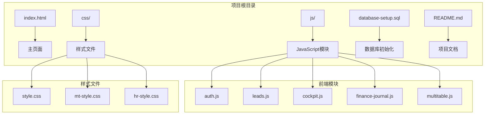

**图表来源**
- [index.html](file://index.html)
- [js/app.js](file://js/app.js)

**章节来源**
- [README.md](file://README.md)
- [index.html](file://index.html)

## 核心业务模块

### 客户管理模块

客户管理模块提供完整的客户信息生命周期管理，包括客户信息录入、搜索、列表展示等功能。

#### 核心功能
- **客户信息管理**：支持客户基本信息的增删改查
- **客户搜索**：基于姓名、电话、邮箱等多维度搜索
- **客户分类**：按联系人、联系方式、地址等信息分类管理
- **数据持久化**：使用Supabase数据库进行云端存储

#### 数据模型
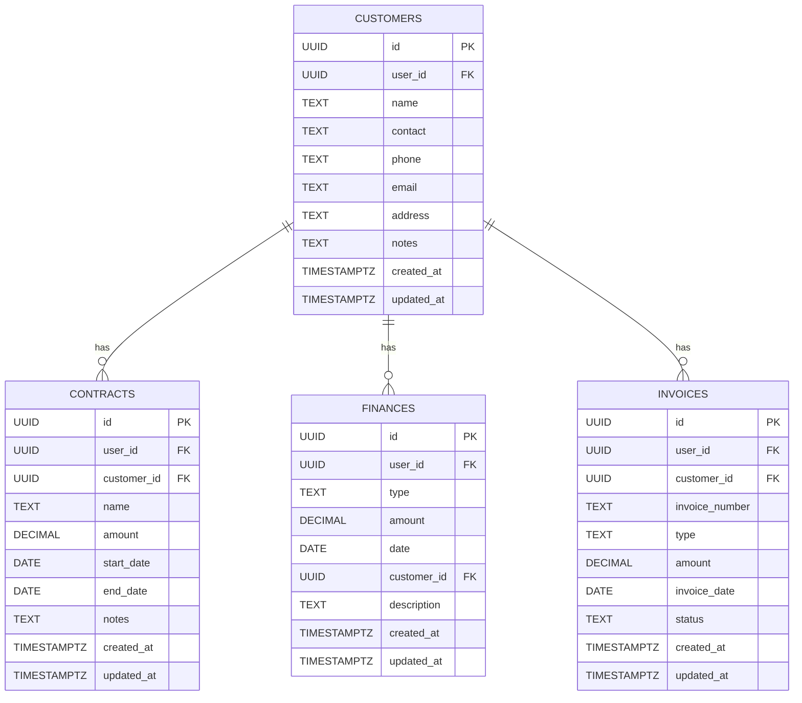

**图表来源**
- [database-setup.sql](file://database-setup.sql)

#### 业务规则
- 每个客户必须关联到一个用户
- 客户金额字段必须为非负数
- 支持软删除和数据隔离
- 自动更新时间戳字段

**章节来源**
- [database-setup.sql](file://database-setup.sql)
- [js/leads.js](file://js/leads.js)

### 合同管理模块

合同管理模块专注于企业服务合同的全生命周期管理，支持合同创建、状态跟踪和金额管理。

#### 核心功能
- **合同创建**：关联客户信息创建服务合同
- **状态跟踪**：执行中、已过期等状态管理
- **金额管理**：合同金额的精确计算和统计
- **时间管理**：合同开始日期和结束日期的管理

#### 业务流程
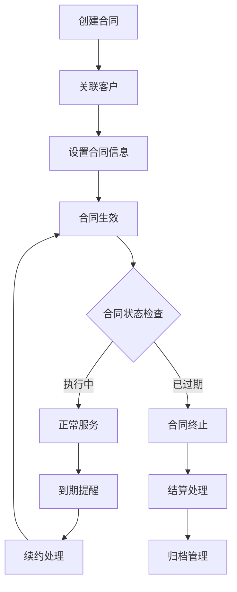

**图表来源**
- [js/leads.js](file://js/leads.js)

#### 数据验证规则
- 合同金额必须为正数
- 结束日期必须晚于开始日期
- 客户关联必须有效
- 状态转换遵循业务逻辑

**章节来源**
- [database-setup.sql](file://database-setup.sql)

### 财务管理模块

财务管理模块提供公司日记账功能，支持多表管理、工具栏操作和数据筛选。

#### 核心功能
- **日记账管理**：支持多数据表的日记账管理
- **工具栏操作**：筛选、排序、分组、隐藏字段等
- **列操作**：列重命名、插入、删除、宽度调整
- **数据导入导出**：支持CSV格式的数据导入导出

#### 数据结构
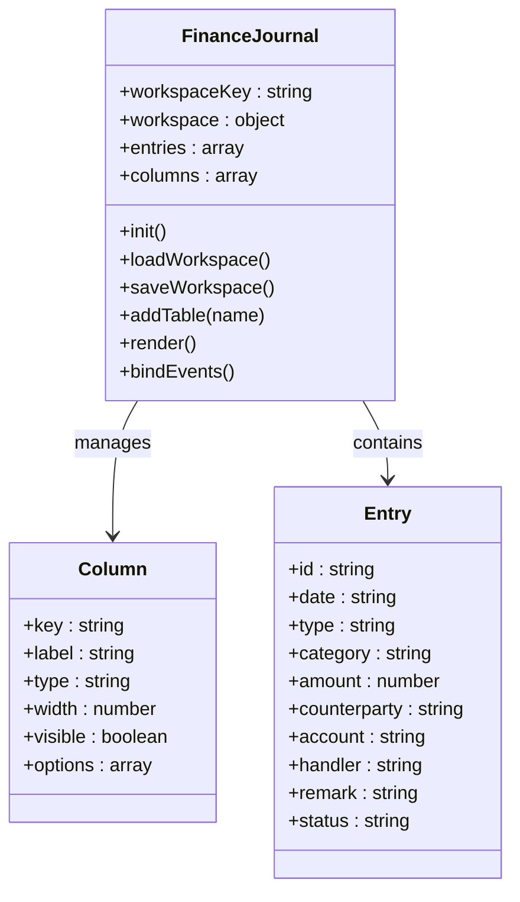

**图表来源**
- [js/finance-journal.js](file://js/finance-journal.js)

#### 业务规则
- 支持收入、支出、转账三种类型
- 金额字段必须为非负数
- 审核状态包括待审核、已审核、已驳回
- 支持多表独立管理

**章节来源**
- [js/finance-journal.js](file://js/finance-journal.js)

### 发票管理模块

发票管理模块专注于发票的全生命周期管理，支持发票录入、类型管理和日期跟踪。

#### 核心功能
- **发票录入**：支持发票基本信息的录入
- **类型管理**：增值税专用发票、普通发票等类型管理
- **日期跟踪**：开票日期的精确管理
- **状态控制**：发票状态的实时跟踪

#### 数据模型
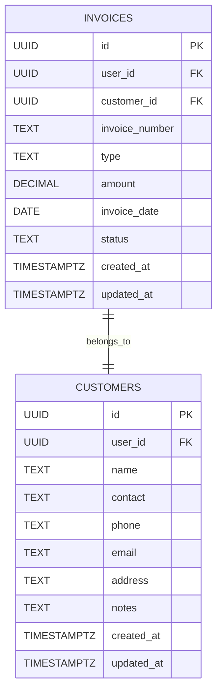

**图表来源**
- [database-setup.sql](file://database-setup.sql)

**章节来源**
- [database-setup.sql](file://database-setup.sql)

## 系统架构概览

系统采用前后端分离架构，前端使用纯JavaScript实现，后端基于Supabase提供云端服务。

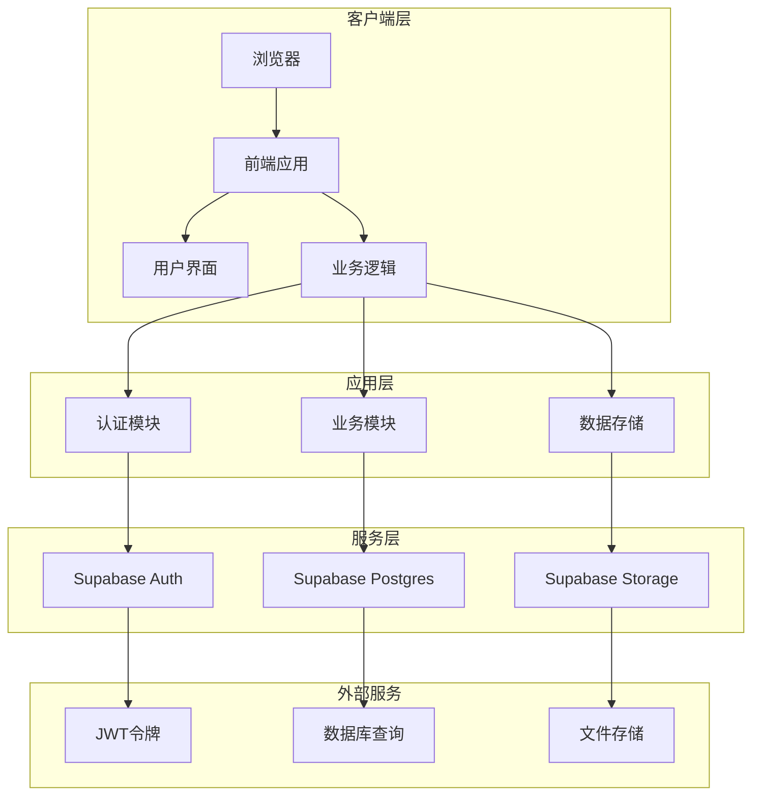

**图表来源**
- [js/auth.js](file://js/auth.js)
- [js/cloud-storage.js](file://js/cloud-storage.js)

### 数据流架构
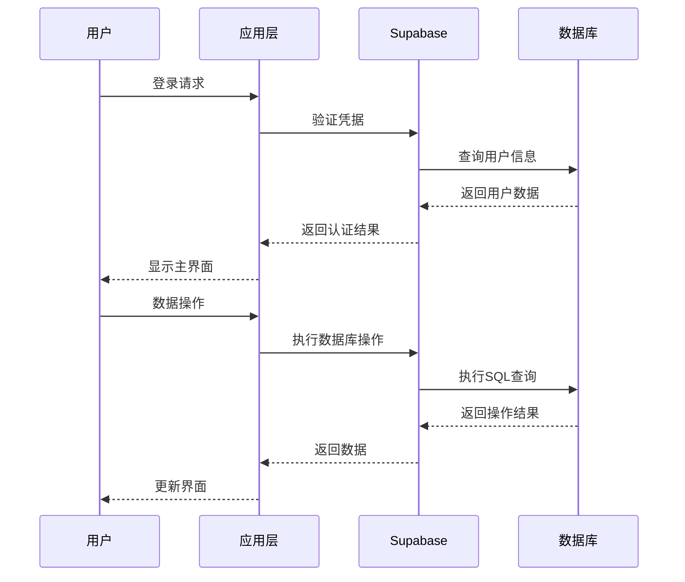

**图表来源**
- [js/auth.js](file://js/auth.js)
- [js/cloud-storage.js](file://js/cloud-storage.js)

## 详细组件分析

### 认证系统

认证系统基于Supabase Auth实现，提供完整的用户注册、登录和会话管理功能。

#### 核心组件
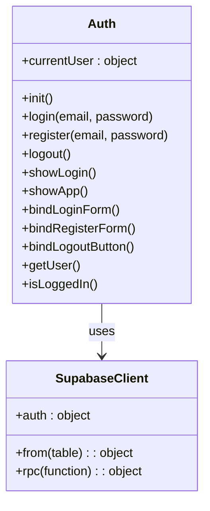

**图表来源**
- [js/auth.js](file://js/auth.js)

#### 认证流程
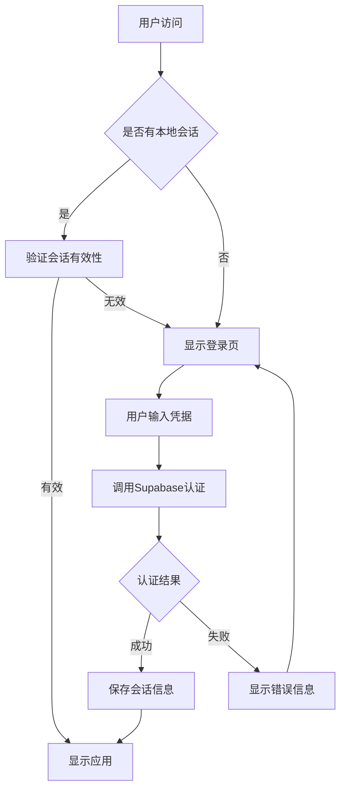

**图表来源**
- [js/auth.js](file://js/auth.js)

**章节来源**
- [js/auth.js](file://js/auth.js)

### 数据存储层

数据存储层基于Supabase PostgreSQL，提供安全的数据隔离和行级安全策略。

#### 数据模型设计
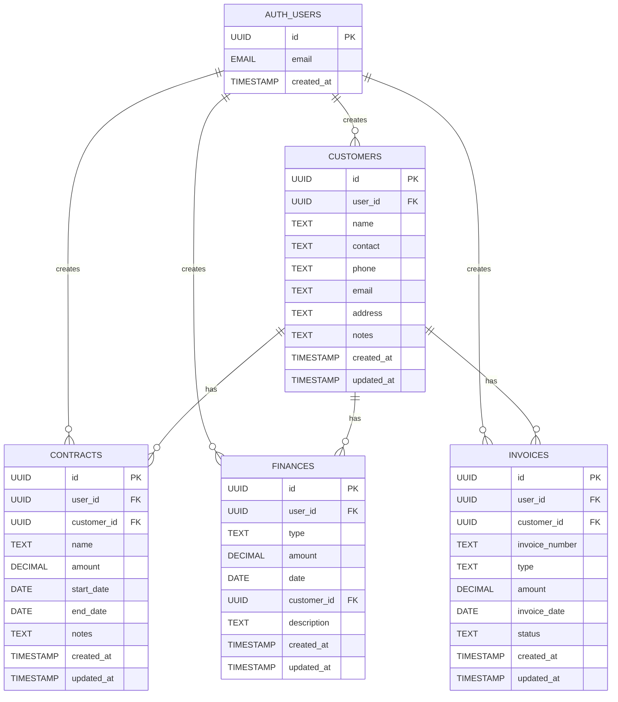

**图表来源**
- [database-setup.sql](file://database-setup.sql)

#### 行级安全策略
系统启用行级安全策略，确保用户只能访问自己的数据：

**章节来源**
- [database-setup.sql](file://database-setup.sql)

### 多维表格系统

多维表格系统提供强大的数据管理能力，支持多种视图模式和复杂的数据操作。

#### 核心架构
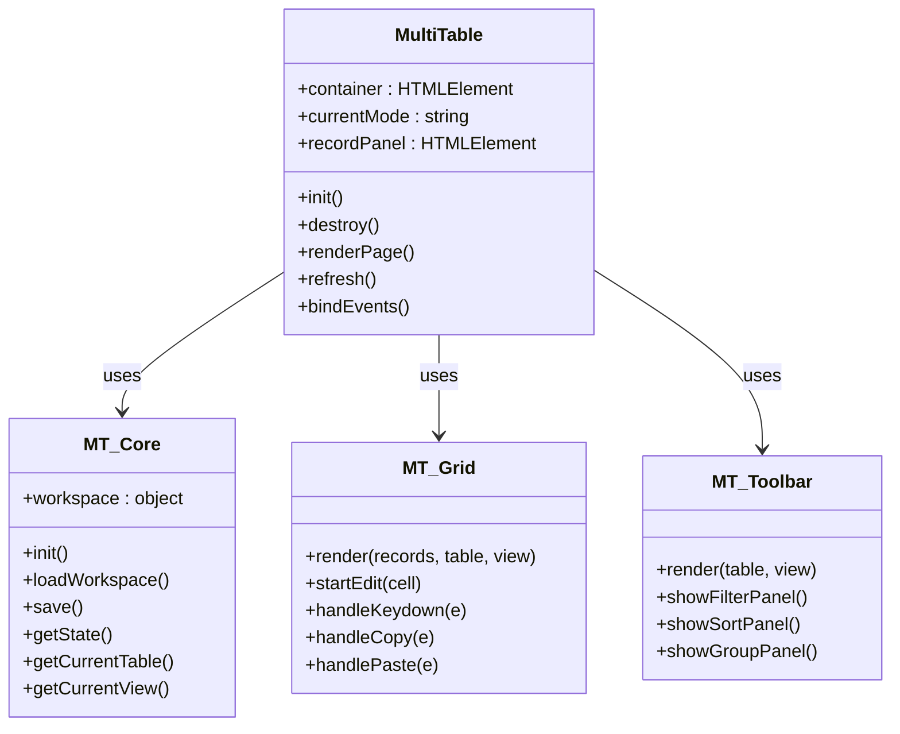

**图表来源**
- [js/multitable.js](file://js/multitable.js)

**章节来源**
- [js/multitable.js](file://js/multitable.js)

## 依赖关系分析

系统采用模块化设计，各模块之间通过清晰的接口进行交互。

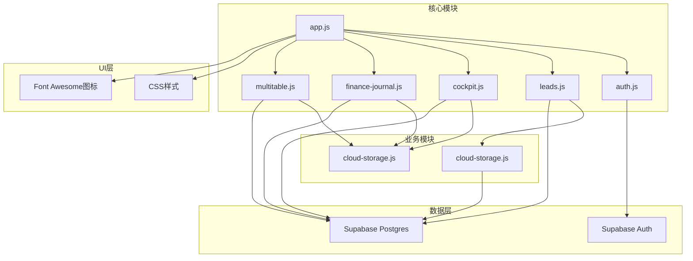

**图表来源**
- [js/app.js](file://js/app.js)
- [js/auth.js](file://js/auth.js)
- [js/cloud-storage.js](file://js/cloud-storage.js)

### 模块间通信

系统通过事件总线和回调机制实现模块间的松耦合通信：

**章节来源**
- [js/app.js](file://js/app.js)
- [js/auth.js](file://js/auth.js)

## 性能考虑

### 数据库优化
- **索引策略**：为常用查询字段建立索引
- **查询优化**：使用LIMIT和WHERE条件限制数据量
- **缓存机制**：利用浏览器localStorage缓存常用数据

### 前端性能优化
- **懒加载**：按需加载模块和资源
- **虚拟滚动**：大数据集的虚拟化渲染
- **防抖节流**：输入事件和窗口大小变化的处理

### 安全性考虑
- **数据加密**：HTTPS传输和数据库加密
- **权限控制**：行级安全策略和角色权限
- **输入验证**：客户端和服务端双重验证

## 故障排除指南

### 常见问题及解决方案

#### 认证问题
- **问题**：登录失败
  - **原因**：网络连接或凭据错误
  - **解决**：检查网络连接，确认用户名密码正确

- **问题**：会话过期
  - **原因**：长时间无操作
  - **解决**：重新登录，系统会自动保存会话状态

#### 数据同步问题
- **问题**：数据不同步
  - **原因**：网络中断或数据库连接异常
  - **解决**：检查网络状态，重新加载页面

#### 性能问题
- **问题**：页面加载缓慢
  - **原因**：数据量过大或网络延迟
  - **解决**：使用搜索过滤减少数据量，优化网络连接

### 调试工具
- **浏览器开发者工具**：监控网络请求和JavaScript错误
- **Supabase Dashboard**：查看数据库查询和用户活动
- **控制台日志**：输出调试信息和错误堆栈

**章节来源**
- [js/auth.js](file://js/auth.js)
- [js/cloud-storage.js](file://js/cloud-storage.js)

## 结论

陈苗系统是一个功能完整、架构清晰的财务CRM管理系统。系统采用现代化的技术栈，提供了完整的云端数据存储和用户认证功能。

### 系统优势
- **云端架构**：基于Supabase的云端服务，无需服务器维护
- **数据安全**：行级安全策略和HTTPS加密保障数据安全
- **用户体验**：响应式设计和直观的操作界面
- **扩展性强**：模块化架构便于功能扩展和定制

### 技术特色
- **纯前端实现**：无需后端服务器，降低运维成本
- **实时同步**：多设备数据实时同步
- **数据隔离**：用户数据完全隔离，确保隐私安全
- **开源免费**：基于开源技术，零成本部署

### 未来发展方向
- **团队协作**：增强多人协作功能
- **权限管理**：细化角色权限控制
- **移动端支持**：开发移动端应用程序
- **数据导出**：支持Excel等格式的数据导出

系统为财务服务公司提供了完整的数字化转型解决方案，能够有效提升业务效率和管理水平。