# 线索管理

<cite>
**本文档引用的文件**
- [js/leads.js](file://js/leads.js)
- [css/leads-style.css](file://css/leads-style.css)
- [js/app.js](file://js/app.js)
- [js/auth.js](file://js/auth.js)
- [js/home.js](file://js/home.js)
- [js/cockpit.js](file://js/cockpit.js)
- [js/multitable.js](file://js/multitable.js)
- [js/mt-core.js](file://js/mt-core.js)
- [js/mt-grid.js](file://js/mt-grid.js)
- [js/mt-views.js](file://js/mt-views.js)
- [README.md](file://README.md)
- [快速入门.md](file://快速入门.md)
- [_tmp_gen/lead.vue](file://_tmp_gen/lead.vue)
- [_tmp_gen/crm.ts](file://_tmp_gen/crm.ts)
</cite>

## 更新摘要
**变更内容**
- 系统已从原型升级为生产就绪的CRM线索管理模块
- 新增高级池管理功能，支持多线索池协同管理
- 引入增强跟踪系统，包含拜访签到和跟进提醒
- 实现自定义字段系统，支持灵活的数据模型扩展
- 建立完整的分析报告功能，包含AI智能评分和销售预测
- 集成API对接和Webhook通知机制
- 完善团队协作和工作流管理功能

## 目录
1. [简介](#简介)
2. [系统架构](#系统架构)
3. [核心功能模块](#核心功能模块)
4. [高级池管理](#高级池管理)
5. [增强跟踪系统](#增强跟踪系统)
6. [自定义字段系统](#自定义字段系统)
7. [分析报告功能](#分析报告功能)
8. [API对接与集成](#api对接与集成)
9. [团队协作与工作流](#团队协作与工作流)
10. [数据模型与存储](#数据模型与存储)
11. [性能优化与扩展](#性能优化与扩展)
12. [故障排除指南](#故障排除指南)
13. [结论](#结论)

## 简介
陈苗系统的线索管理模块已从基础原型全面升级为生产就绪的客户关系管理系统。该系统采用前后端分离架构，结合本地存储和云端同步机制，为企业提供完整的线索生命周期管理解决方案。

**重大升级特性**：
- **高级池管理**：支持多线索池协同，包含公海/私海管理模式
- **智能分配算法**：基于地域、行业、权重的多维度智能分配
- **增强跟踪系统**：完整的跟进记录、拜访签到、提醒通知
- **自定义字段系统**：灵活的数据模型扩展，支持文本、数字、选择等多种类型
- **AI智能分析**：基于机器学习的线索评分和智能建议
- **分析报告**：多维度统计分析，包含转化漏斗、来源效果等
- **API集成**：完整的RESTful API和Webhook通知机制

系统支持完整的销售管理流程，从线索发现、录入、分配、跟进、转化到客户管理的全流程闭环管理。

## 系统架构
线索管理模块采用现代化的前后端分离架构，确保系统的可扩展性和维护性。

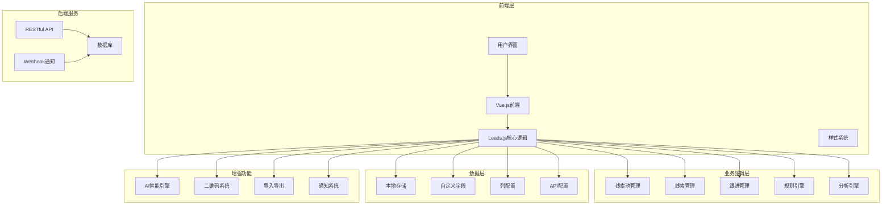
```mermaid
graph TB
subgraph "前端层"
UI[用户界面]
Vue[Vue.js前端]
LeadsJS[Leads.js核心逻辑]
Styles[样式系统]
end
subgraph "业务逻辑层"
PoolManager[线索池管理]
LeadManager[线索管理]
FollowManager[跟进管理]
RuleEngine[规则引擎]
Analytics[分析引擎]
end
subgraph "数据层"
LocalStorage[本地存储]
CustomFields[自定义字段]
ColumnConfig[列配置]
APIConfig[API配置]
end
subgraph "后端服务"
RESTAPI[RESTful API]
Webhook[Webhook通知]
Database[数据库]
end
subgraph "增强功能"
AIEngine[AI智能引擎]
QRCode[二维码系统]
ImportExport[导入导出]
Notification[通知系统]
end
UI --> Vue
Vue --> LeadsJS
LeadsJS --> PoolManager
LeadsJS --> LeadManager
LeadsJS --> FollowManager
LeadsJS --> RuleEngine
LeadsJS --> Analytics
LeadsJS --> LocalStorage
LeadsJS --> CustomFields
LeadsJS --> ColumnConfig
LeadsJS --> APIConfig
LeadsJS --> AIEngine
LeadsJS --> QRCode
LeadsJS --> ImportExport
LeadsJS --> Notification
RESTAPI --> Database
Webhook --> Database
```

**图表来源**
- [js/leads.js:567-680](file://js/leads.js#L567-L680)
- [js/leads.js:136-161](file://js/leads.js#L136-L161)
- [js/leads.js:62-91](file://js/leads.js#L62-L91)

### 数据流架构
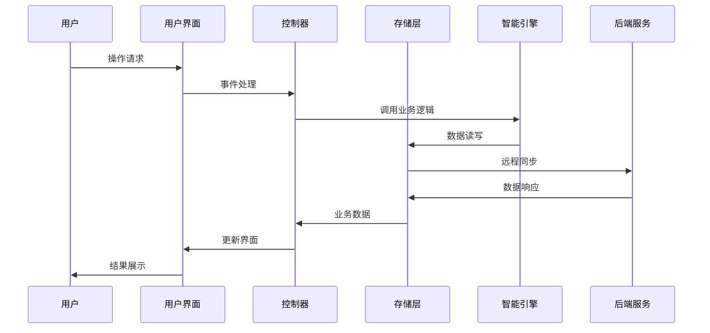
```mermaid
sequenceDiagram
participant User as 用户
participant UI as 用户界面
participant Controller as 控制器
participant Storage as 存储层
participant Engine as 智能引擎
participant Backend as 后端服务
User->>UI : 操作请求
UI->>Controller : 事件处理
Controller->>Engine : 调用业务逻辑
Engine->>Storage : 数据读写
Storage->>Backend : 远程同步
Backend->>Storage : 数据响应
Storage->>Controller : 业务数据
Controller->>UI : 更新界面
UI->>User : 结果展示
```

**图表来源**
- [js/leads.js:1085-1379](file://js/leads.js#L1085-L1379)
- [js/leads.js:3581-3587](file://js/leads.js#L3581-L3587)

## 核心功能模块

### 线索生命周期管理
系统提供完整的线索生命周期管理，涵盖从创建到转化的全过程。

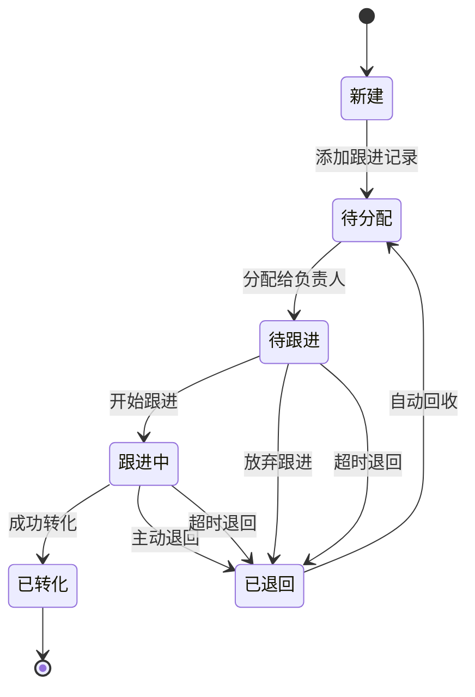
```mermaid
stateDiagram-v2
[*] --> 新建
新建 --> 待分配 : 添加跟进记录
待分配 --> 待跟进 : 分配给负责人
待跟进 --> 跟进中 : 开始跟进
跟进中 --> 已转化 : 成功转化
跟进中 --> 已退回 : 主动退回
跟进中 --> 已退回 : 超时退回
已退回 --> 待分配 : 自动回收
已转化 --> [*]
待跟进 --> 已退回 : 放弃跟进
待跟进 --> 已退回 : 超时退回
```

**图表来源**
- [js/leads.js:560-561](file://js/leads.js#L560-L561)
- [js/leads.js:1995-2022](file://js/leads.js#L1995-L2022)

### 线索来源分类体系
系统支持多种线索来源渠道，每种渠道都有特定的业务价值和评分权重。

| 渠道类型 | 描述 | 评分权重 | 特征 |
|---------|------|----------|------|
| 转介绍 | 现有客户推荐 | +20分 | 信任度高，转化率高 |
| 官网注册 | 官方网站注册 | +18分 | 自然流量，意向明确 |
| 展会活动 | 参加行业展会 | +15分 | 高质量潜在客户 |
| 百度推广 | 搜索引擎广告 | +12分 | 精准关键词匹配 |
| 广告投放 | 传统广告投放 | +10分 | 成本较高，可控性强 |
| 抖音 | 短视频平台 | +8分 | 年轻用户群体 |
| 微信 | 社交媒体 | +6分 | 社交传播效应 |
| 美团 | 生活服务平台 | +5分 | 本地生活服务 |
| 小红书 | 社交电商平台 | +4分 | 年轻女性用户 |
| 扫码填写 | 二维码收集 | +3分 | 线下活动转化 |
| 批量导入 | 系统批量导入 | +1分 | 数据质量一般 |

**章节来源**
- [js/leads.js:556-559](file://js/leads.js#L556-L559)
- [js/leads.js:3789-3790](file://js/leads.js#L3789-L3790)

### 意向等级评估机制
系统采用四层级意向评估体系，从高到低分别为A、B、C、D级。

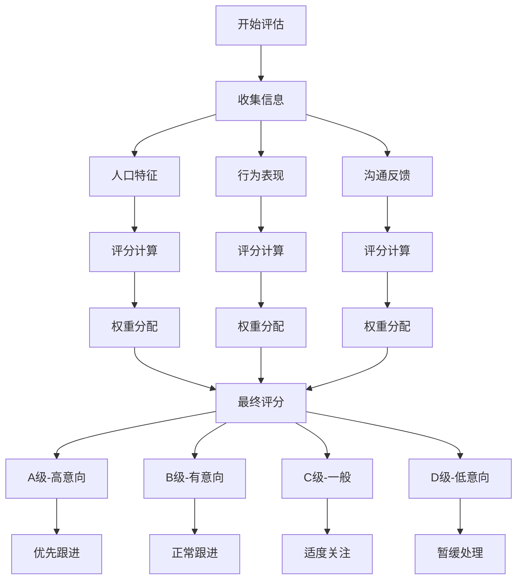
```mermaid
flowchart TD
START[开始评估] --> DATA[收集信息]
DATA --> DEMOGRAPHIC[人口特征]
DATA --> BEHAVIOR[行为表现]
DATA --> COMMUNICATION[沟通反馈]
DEMOGRAPHIC --> SCORE1[评分计算]
BEHAVIOR --> SCORE2[评分计算]
COMMUNICATION --> SCORE3[评分计算]
SCORE1 --> WEIGHT1[权重分配]
SCORE2 --> WEIGHT2[权重分配]
SCORE3 --> WEIGHT3[权重分配]
WEIGHT1 --> FINAL[最终评分]
WEIGHT2 --> FINAL
WEIGHT3 --> FINAL
FINAL --> LEVEL_A[A级-高意向]
FINAL --> LEVEL_B[B级-有意向]
FINAL --> LEVEL_C[C级-一般]
FINAL --> LEVEL_D[D级-低意向]
LEVEL_A --> ACTION1[优先跟进]
LEVEL_B --> ACTION2[正常跟进]
LEVEL_C --> ACTION3[适度关注]
LEVEL_D --> ACTION4[暂缓处理]
```

**图表来源**
- [js/leads.js:225-232](file://js/leads.js#L225-L232)
- [js/leads.js:3816-3821](file://js/leads.js#L3816-L3821)

## 高级池管理

### 线索池类型与配置
系统支持多种类型的线索池，满足不同业务场景的需求。

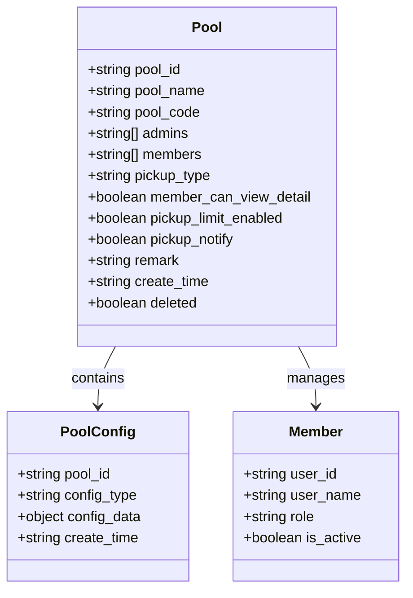
```mermaid
classDiagram
class Pool {
+string pool_id
+string pool_name
+string pool_code
+string[] admins
+string[] members
+string pickup_type
+boolean member_can_view_detail
+boolean pickup_limit_enabled
+boolean pickup_notify
+string remark
+string create_time
+boolean deleted
}
class PoolConfig {
+string pool_id
+string config_type
+object config_data
+string create_time
}
class Member {
+string user_id
+string user_name
+string role
+boolean is_active
}
Pool --> PoolConfig : contains
Pool --> Member : manages
```

**图表来源**
- [js/leads.js:449-453](file://js/leads.js#L449-L453)
- [js/leads.js:136-161](file://js/leads.js#L136-L161)

### 线索池管理功能
系统提供完整的线索池管理功能，包括创建、配置、监控等。

| 功能特性 | 描述 | 配置选项 |
|---------|------|----------|
| 自主领取 | 成员可直接领取线索 | 保有量限制、领取频率限制 |
| 管理员分配 | 管理员统一分配线索 | 分配权重、区域匹配 |
| 申请审批 | 成员申请领取需审批 | 审批流程、管理员配置 |
| 保有量限制 | 控制成员最大保有线索数 | 全局/池级别配置 |
| 领取频率限制 | 限制每日/每周领取数量 | 日限、周限配置 |
| 成员可见性 | 控制成员查看详细信息权限 | 详细信息可见性 |

**章节来源**
- [js/leads.js:1460-1518](file://js/leads.js#L1460-L1518)
- [js/leads.js:1995-2022](file://js/leads.js#L1995-L2022)

### 线索池统计分析
系统提供详细的线索池统计分析功能。

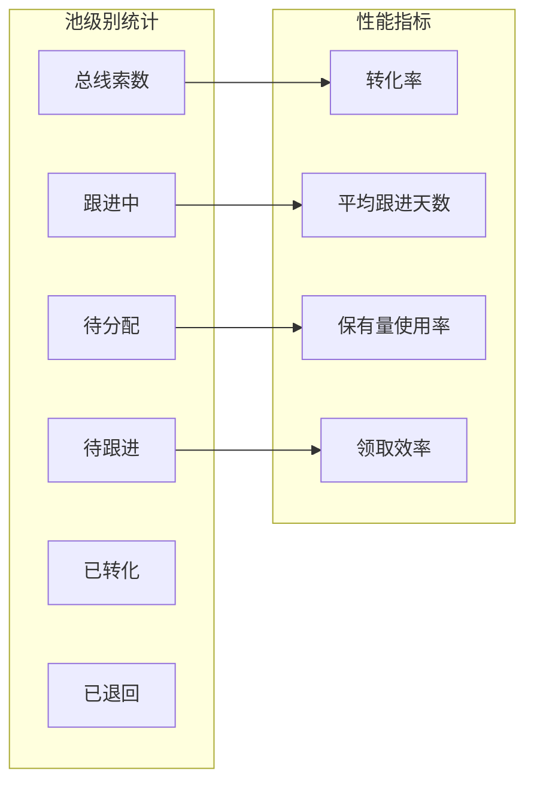
```mermaid
graph LR
subgraph "池级别统计"
TOTAL[总线索数]
PENDING[待分配]
ALLOCATED[待跟进]
FOLLOWING[跟进中]
CONVERTED[已转化]
RETURNED[已退回]
end
subgraph "性能指标"
CONVERSION_RATE[转化率]
AVG_FOLLOW_DAYS[平均跟进天数]
HOLDING_LIMIT[保有量使用率]
PICKUP_EFFICIENCY[领取效率]
end
TOTAL --> CONVERSION_RATE
PENDING --> HOLDING_LIMIT
ALLOCATED --> PICKUP_EFFICIENCY
FOLLOWING --> AVG_FOLLOW_DAYS
```

**图表来源**
- [js/leads.js:3121-3145](file://js/leads.js#L3121-L3145)

## 增强跟踪系统

### 跟进记录管理
系统提供完整的跟进记录管理功能，支持多种跟进方式和详细记录。

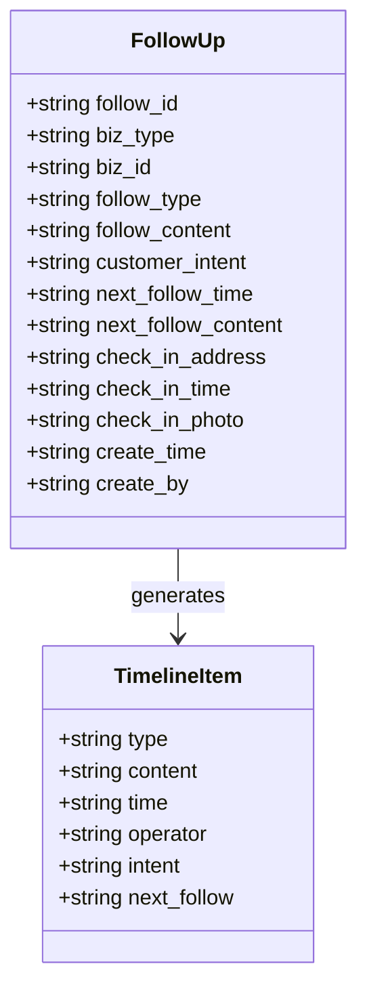
```mermaid
classDiagram
class FollowUp {
+string follow_id
+string biz_type
+string biz_id
+string follow_type
+string follow_content
+string customer_intent
+string next_follow_time
+string next_follow_content
+string check_in_address
+string check_in_time
+string check_in_photo
+string create_time
+string create_by
}
class TimelineItem {
+string type
+string content
+string time
+string operator
+string intent
+string next_follow
}
FollowUp --> TimelineItem : generates
```

**图表来源**
- [js/leads.js:206-218](file://js/leads.js#L206-L218)
- [js/leads.js:1048-1081](file://js/leads.js#L1048-L1081)

### 拜访签到功能
系统支持完整的拜访签到功能，包含地理位置、照片凭证等。

| 功能特性 | 描述 | 配置选项 |
|---------|------|----------|
| 地理位置签到 | GPS定位签到 | 签到地址必填 |
| 照片凭证 | 现场照片上传 | 图片格式限制 |
| 拜访内容记录 | 详细拜访内容 | 文本长度限制 |
| 客户意向评估 | 高/中/低评估 | 下拉选择 |
| 下次跟进计划 | 自动提醒设置 | 日期选择器 |

**章节来源**
- [js/leads.js:2858-2941](file://js/leads.js#L2858-L2941)
- [js/leads.js:1048-1081](file://js/leads.js#L1048-L1081)

### 跟进提醒系统
系统提供智能的跟进提醒功能，确保不会错过重要跟进机会。

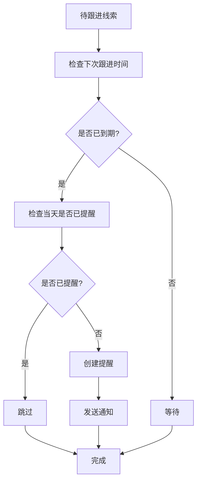
```mermaid
flowchart TD
CANDIDATES[待跟进线索] --> CHECK[检查下次跟进时间]
CHECK --> EXPIRED{是否已到期?}
EXPIRED --> |是| TODAY_CHECK[检查当天是否已提醒]
EXPIRED --> |否| WAIT[等待]
TODAY_CHECK --> EXISTS{是否已提醒?}
EXISTS --> |是| SKIP[跳过]
EXISTS --> |否| CREATE[创建提醒]
CREATE --> NOTIFY[发送通知]
SKIP --> COMPLETE[完成]
WAIT --> COMPLETE
NOTIFY --> COMPLETE
```

**图表来源**
- [js/leads.js:2610-2634](file://js/leads.js#L2610-L2634)

## 自定义字段系统

### 字段类型与配置
系统支持多种自定义字段类型，满足不同业务场景的数据收集需求。

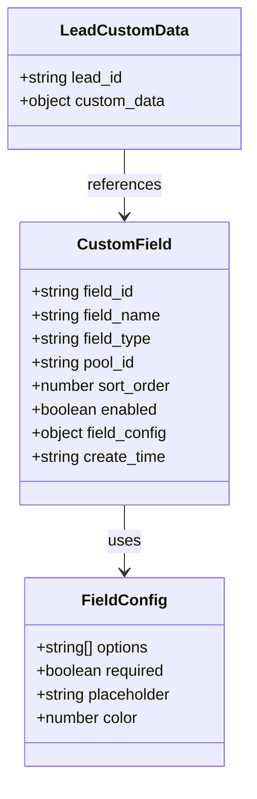
```mermaid
classDiagram
class CustomField {
+string field_id
+string field_name
+string field_type
+string pool_id
+number sort_order
+boolean enabled
+object field_config
+string create_time
}
class FieldConfig {
+string[] options
+boolean required
+string placeholder
+number color
}
class LeadCustomData {
+string lead_id
+object custom_data
}
CustomField --> FieldConfig : uses
LeadCustomData --> CustomField : references
```

**图表来源**
- [js/leads.js:63-91](file://js/leads.js#L63-L91)
- [js/leads.js:3277-3316](file://js/leads.js#L3277-L3316)

### 字段类型支持
系统支持以下字段类型：

| 字段类型 | 描述 | 适用场景 | 配置选项 |
|---------|------|----------|----------|
| 文本(text) | 单行文本输入 | 公司名称、联系人等 | 占位符、必填 |
| 数字(number) | 数字输入框 | 预算金额、数量等 | 数值范围、精度 |
| 电话(phone) | 电话号码输入 | 联系电话、手机号码 | 格式验证 |
| 邮箱(email) | 邮箱地址输入 | 联系邮箱 | 格式验证 |
| 日期(date) | 日期选择器 | 生日、合同日期等 | 日期范围 |
| 单选(select) | 下拉选择框 | 行业分类、地区等 | 选项配置、颜色 |
| 多选(multiselect) | 复选框组 | 兴趣爱好、技能标签等 | 多选项配置 |

**章节来源**
- [js/leads.js:3403-3407](file://js/leads.js#L3403-L3407)
- [js/leads.js:3296-3312](file://js/leads.js#L3296-L3312)

### 字段管理功能
系统提供完整的自定义字段管理功能。

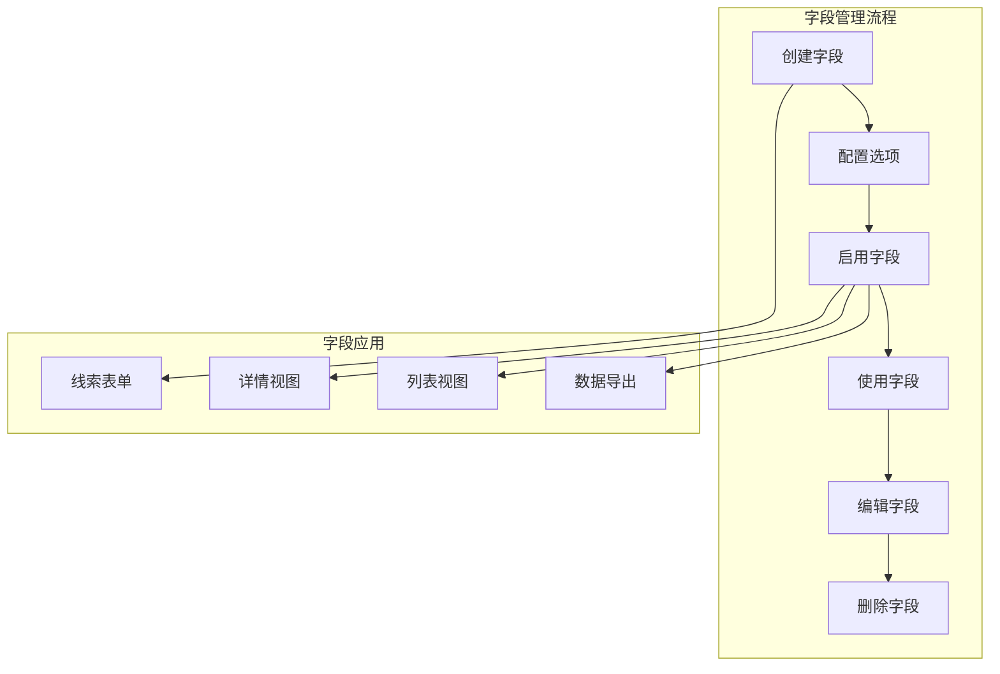
```mermaid
graph TD
subgraph "字段管理流程"
CREATE[创建字段] --> CONFIG[配置选项]
CONFIG --> ENABLE[启用字段]
ENABLE --> USE[使用字段]
USE --> EDIT[编辑字段]
EDIT --> DELETE[删除字段]
end
subgraph "字段应用"
LEAD_FORM[线索表单]
DETAIL_VIEW[详情视图]
LIST_VIEW[列表视图]
EXPORT[数据导出]
end
CREATE --> LEAD_FORM
ENABLE --> LIST_VIEW
ENABLE --> DETAIL_VIEW
ENABLE --> EXPORT
```

**图表来源**
- [js/leads.js:3399-3506](file://js/leads.js#L3399-L3506)

## 分析报告功能

### KPI指标体系
系统提供全面的KPI指标分析，帮助管理者了解业务状况。

| 指标类型 | 指标名称 | 计算公式 | 目标值 | 重要性 |
|---------|----------|----------|--------|--------|
| 基础指标 | 总线索数 | 所有线索数量 | - | ⭐⭐⭐⭐⭐ |
| 基础指标 | 本月新增 | 当月创建线索数 | - | ⭐⭐⭐⭐⭐ |
| 基础指标 | 转化率 | 已转化/总线索×100% | >10% | ⭐⭐⭐⭐⭐ |
| 基础指标 | 平均跟进周期 | 总跟进天数/跟进次数 | <30天 | ⭐⭐⭐⭐ |
| 基础指标 | 待跟进数 | 状态=待跟进的线索数 | <20% | ⭐⭐⭐⭐ |
| 质量指标 | AI评分平均值 | 所有线索AI评分平均值 | >70分 | ⭐⭐⭐⭐ |
| 效率指标 | 领取效率 | 已领取/待分配×100% | >80% | ⭐⭐⭐⭐ |
| 效率指标 | 回收率 | 自动回收/总线索×100% | <5% | ⭐⭐⭐ |

**章节来源**
- [js/leads.js:3121-3145](file://js/leads.js#L3121-L3145)
- [js/leads.js:3955-3998](file://js/leads.js#L3955-L3998)

### 转化漏斗分析
系统提供详细的转化漏斗分析，帮助识别转化瓶颈。

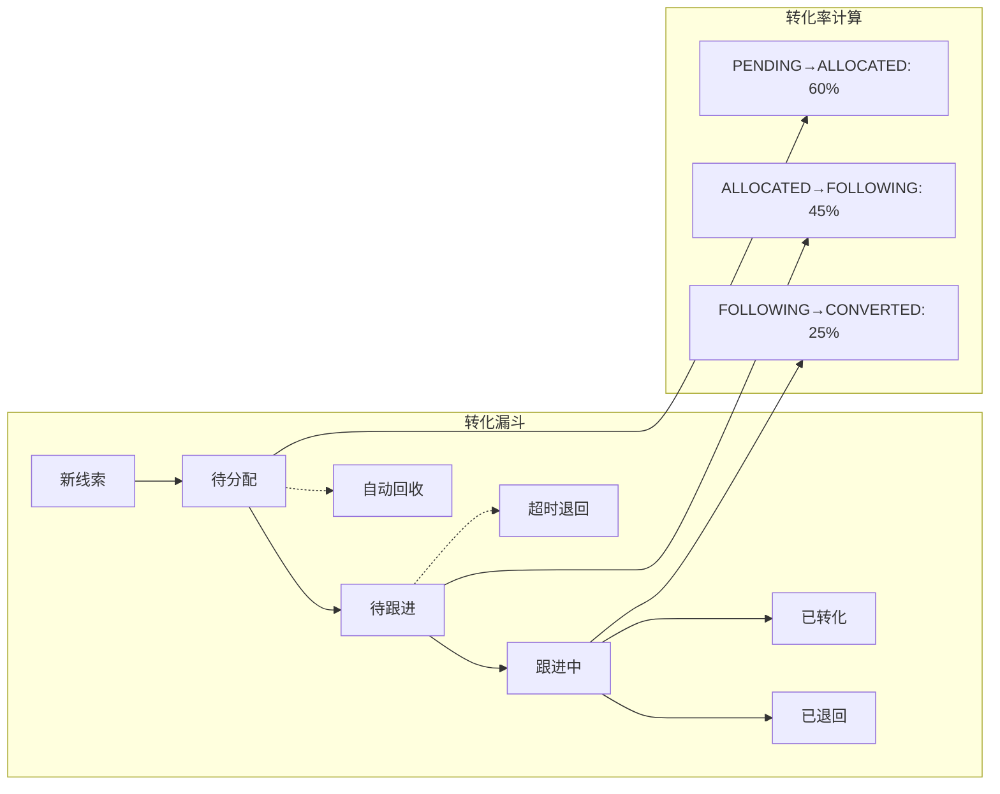
```mermaid
graph LR
subgraph "转化漏斗"
NEW[新线索] --> PENDING[待分配]
PENDING --> ALLOCATED[待跟进]
ALLOCATED --> FOLLOWING[跟进中]
FOLLOWING --> CONVERTED[已转化]
FOLLOWING --> RETURNED[已退回]
PENDING -.-> RECYCLE[自动回收]
ALLOCATED -.-> TIMEOUT[超时退回]
end
subgraph "转化率计算"
PENDING_RATE[PENDING→ALLOCATED: 60%]
ALLOCATED_RATE[ALLOCATED→FOLLOWING: 45%]
FOLLOWING_RATE[FOLLOWING→CONVERTED: 25%]
end
PENDING --> PENDING_RATE
ALLOCATED --> ALLOCATED_RATE
FOLLOWING --> FOLLOWING_RATE
```

**图表来源**
- [js/leads.js:3982-3988](file://js/leads.js#L3982-L3988)

### 来源效果分析
系统提供多维度的来源效果分析，帮助优化营销投入。

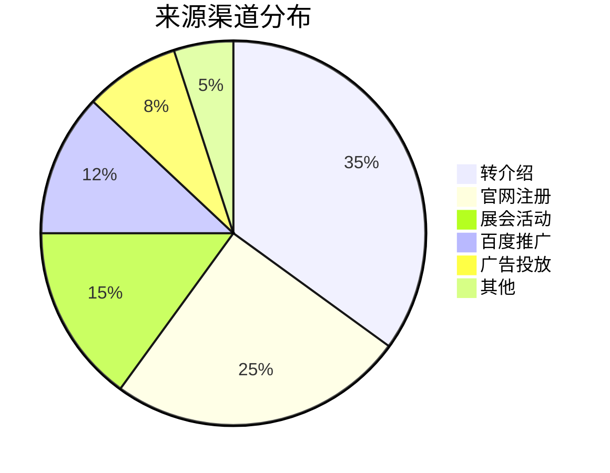
```mermaid
pie title 来源渠道分布
"转介绍": 35
"官网注册": 25
"展会活动": 15
"百度推广": 12
"广告投放": 8
"其他": 5
```

**图表来源**
- [js/leads.js:3986-3987](file://js/leads.js#L3986-L3987)

### 成员绩效分析
系统提供成员绩效分析功能，支持团队管理。

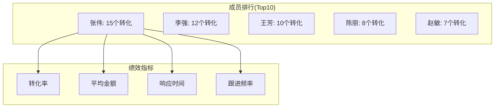
```mermaid
graph TD
subgraph "成员排行(Top10)"
MEMBER1[张伟: 15个转化]
MEMBER2[李强: 12个转化]
MEMBER3[王芳: 10个转化]
MEMBER4[陈丽: 8个转化]
MEMBER5[赵敏: 7个转化]
end
subgraph "绩效指标"
CONV_RATE[转化率]
AVG_AMOUNT[平均金额]
RESP_TIME[响应时间]
FOLLOW_FREQ[跟进频率]
end
MEMBER1 --> CONV_RATE
MEMBER1 --> AVG_AMOUNT
MEMBER1 --> RESP_TIME
MEMBER1 --> FOLLOW_FREQ
```

**图表来源**
- [js/leads.js:3990-3992](file://js/leads.js#L3990-L3992)

### 趋势分析
系统提供6个月的趋势分析，帮助预测业务发展。

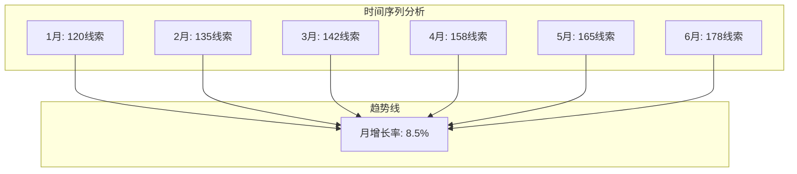
```mermaid
graph TB
subgraph "时间序列分析"
JAN[1月: 120线索]
FEB[2月: 135线索]
MAR[3月: 142线索]
APR[4月: 158线索]
MAY[5月: 165线索]
JUN[6月: 178线索]
end
subgraph "趋势线"
TREND[月增长率: 8.5%]
end
JAN --> TREND
FEB --> TREND
MAR --> TREND
APR --> TREND
MAY --> TREND
JUN --> TREND
```

**图表来源**
- [js/leads.js:3994-3996](file://js/leads.js#L3994-L3996)

## API对接与集成

### RESTful API设计
系统提供完整的RESTful API接口，支持外部系统集成。

```mermaid
graph TD
subgraph "API端点"
LEAD_LIST[GET /api/crm/lead/list]
LEAD_DETAIL[GET /api/crm/lead/{id}]
LEAD_CREATE[POST /api/crm/lead]
LEAD_UPDATE[PUT /api/crm/lead]
LEAD_DELETE[DELETE /api/crm/lead/{id}]
LEAD_CONVERT[POST /api/crm/lead/convert/{id}]
LEAD_ASSIGN[POST /api/crm/lead/assign]
CUSTOMER_LIST[GET /api/crm/customer/list]
CUSTOMER_DETAIL[GET /api/crm/customer/{id}]
CUSTOMER_CREATE[POST /api/crm/customer]
FOLLOW_LIST[GET /api/crm/follow/list]
FOLLOW_CREATE[POST /api/crm/follow]
OPPTY_FUNNEL[GET /api/crm/opportunity/funnel]
end
subgraph "数据模型"
Lead[线索模型]
Customer[客户模型]
Follow[跟进记录]
Opportunity[商机模型]
end
LEAD_LIST --> Lead
LEAD_DETAIL --> Lead
LEAD_CREATE --> Lead
LEAD_UPDATE --> Lead
CUSTOMER_LIST --> Customer
FOLLOW_LIST --> Follow
OPPTY_FUNNEL --> Opportunity
```

**图表来源**
- [_tmp_gen/crm.ts:4-12](file://_tmp_gen/crm.ts#L4-L12)
- [_tmp_gen/crm.ts:14-22](file://_tmp_gen/crm.ts#L14-L22)

### Webhook通知机制
系统支持Webhook通知，实现实时业务事件通知。

| 事件类型 | 触发时机 | 通知内容 | 应用场景 |
|---------|----------|----------|----------|
| create | 新线索创建 | 线索基本信息、来源、创建时间 | 外部系统同步、营销自动化 |
| assign | 线索分配 | 分配详情、负责人、分配时间 | CRM系统集成、工作流自动化 |
| convert | 线索转化 | 转化详情、客户/商机信息 | ERP系统集成、财务系统对接 |
| return | 线索退回 | 退回原因、退回时间 | 数据清理、报表统计 |

**章节来源**
- [_tmp_gen/crm.ts:1-12](file://_tmp_gen/crm.ts#L1-L12)
- [js/leads.js:3581-3587](file://js/leads.js#L3581-L3587)

### 数据导入导出
系统支持批量数据导入导出功能。

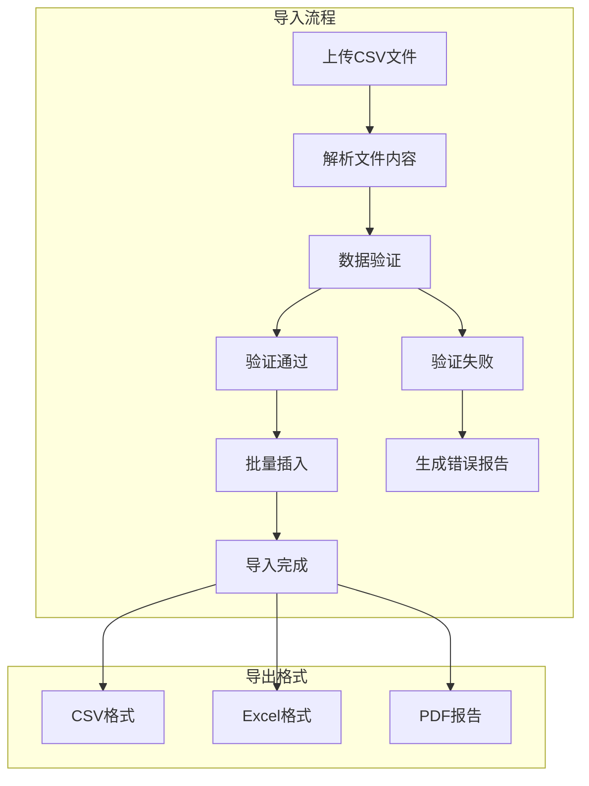
```mermaid
flowchart TD
subgraph "导入流程"
UPLOAD[上传CSV文件] --> PARSE[解析文件内容]
PARSE --> VALIDATE[数据验证]
VALIDATE --> SUCCESS[验证通过]
VALIDATE --> ERROR[验证失败]
SUCCESS --> INSERT[批量插入]
ERROR --> REPORT[生成错误报告]
INSERT --> COMPLETE[导入完成]
end
subgraph "导出格式"
CSV[CSV格式]
EXCEL[Excel格式]
PDF[PDF报告]
end
COMPLETE --> CSV
COMPLETE --> EXCEL
COMPLETE --> PDF
```

**图表来源**
- [js/leads.js:1675-1734](file://js/leads.js#L1675-L1734)
- [js/leads.js:3078-3116](file://js/leads.js#L3078-L3116)

## 团队协作与工作流

### 申领审批流程
系统提供完整的申领审批工作流，确保线索分配的公平性。

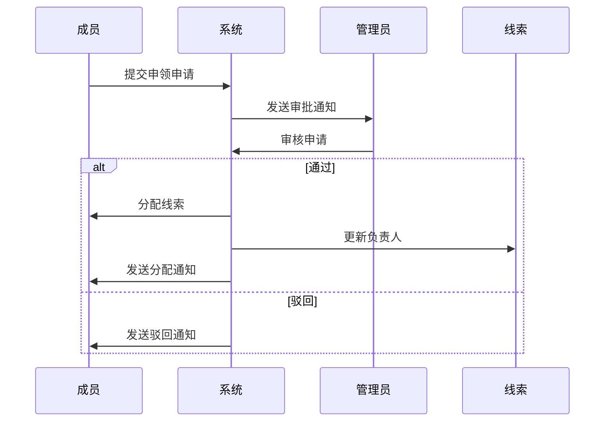
```mermaid
sequenceDiagram
participant Member as 成员
participant System as 系统
participant Admin as 管理员
participant Lead as 线索
Member->>System : 提交申领申请
System->>Admin : 发送审批通知
Admin->>System : 审核申请
alt 通过
System->>Member : 分配线索
System->>Lead : 更新负责人
System->>Member : 发送分配通知
else 驳回
System->>Member : 发送驳回通知
end
```

**图表来源**
- [js/leads.js:2295-2344](file://js/leads.js#L2295-L2344)
- [js/leads.js:2384-2416](file://js/leads.js#L2384-L2416)

### 批量操作功能
系统支持多种批量操作，提高工作效率。

| 批量操作 | 功能描述 | 使用场景 |
|---------|----------|----------|
| 批量分配 | 同时分配多个线索给指定成员 | 新成员入职、工作量调整 |
| 批量退回 | 批量退回多个线索到公海 | 无效线索清理、数据质量优化 |
| 批量转移 | 批量转移线索给其他成员 | 人员调动、工作交接 |
| 批量导出 | 批量导出线索数据 | 报表制作、数据分析 |
| 批量跟进 | 批量创建跟进记录 | 集中跟进、活动营销 |

**章节来源**
- [js/leads.js:2421-2494](file://js/leads.js#L2421-L2494)
- [js/leads.js:2946-3005](file://js/leads.js#L2946-L3005)

### 通知系统
系统提供完整的通知系统，确保信息及时传达。

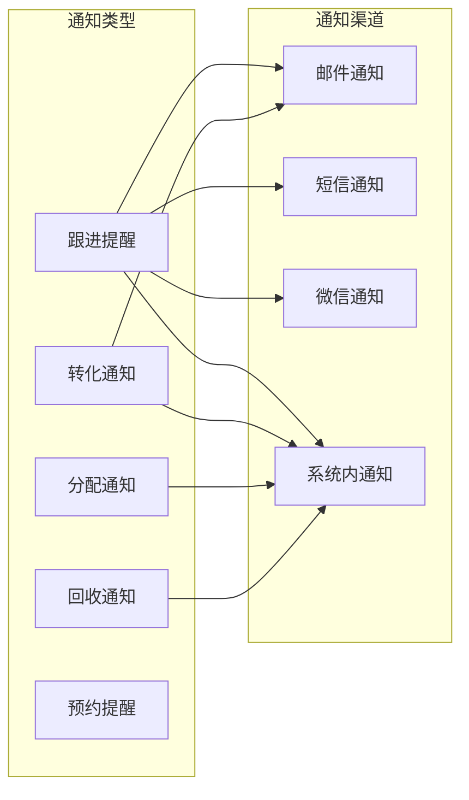
```mermaid
graph LR
subgraph "通知类型"
FOLLOW_REMIND[跟进提醒]
CONVERT[转化通知]
ASSIGN[分配通知]
RECYCLE[回收通知]
APPOINTMENT[预约提醒]
end
subgraph "通知渠道"
EMAIL[邮件通知]
SMS[短信通知]
WECHAT[微信通知]
SYSTEM[系统内通知]
end
FOLLOW_REMIND --> EMAIL
FOLLOW_REMIND --> SMS
FOLLOW_REMIND --> WECHAT
FOLLOW_REMIND --> SYSTEM
CONVERT --> EMAIL
CONVERT --> SYSTEM
ASSIGN --> SYSTEM
RECYCLE --> SYSTEM
```

**图表来源**
- [js/leads.js:382-418](file://js/leads.js#L382-L418)
- [js/leads.js:2639-2668](file://js/leads.js#L2639-L2668)

## 数据模型与存储

### 核心数据模型
系统采用JSON存储结构，支持灵活的数据扩展。

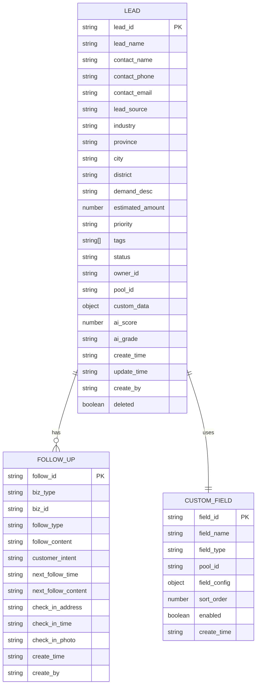
```mermaid
erDiagram
LEAD {
string lead_id PK
string lead_name
string contact_name
string contact_phone
string contact_email
string lead_source
string industry
string province
string city
string district
string demand_desc
number estimated_amount
string priority
string[] tags
string status
string owner_id
string pool_id
object custom_data
number ai_score
string ai_grade
string create_time
string update_time
string create_by
boolean deleted
}
FOLLOW_UP {
string follow_id PK
string biz_type
string biz_id
string follow_type
string follow_content
string customer_intent
string next_follow_time
string next_follow_content
string check_in_address
string check_in_time
string check_in_photo
string create_time
string create_by
}
CUSTOM_FIELD {
string field_id PK
string field_name
string field_type
string pool_id
object field_config
number sort_order
boolean enabled
string create_time
}
LEAD ||--o{ FOLLOW_UP : has
LEAD ||--|| CUSTOM_FIELD : uses
```

**图表来源**
- [js/leads.js:38-59](file://js/leads.js#L38-L59)
- [js/leads.js:206-218](file://js/leads.js#L206-L218)
- [js/leads.js:63-91](file://js/leads.js#L63-L91)

### 存储配置管理
系统提供灵活的存储配置管理功能。

| 配置类别 | 存储键 | 功能描述 | 默认值 |
|---------|--------|----------|--------|
| 线索池配置 | crm_lead_pools | 线索池定义 | 空数组 |
| 线索数据 | crm_leads | 线索数据存储 | 空数组 |
| 跟进记录 | crm_follow_ups | 跟进记录存储 | 空数组 |
| 自动分配规则 | crm_auto_assign_rules | 自动分配规则 | 空数组 |
| 自动回收规则 | crm_auto_recycle_rules | 自动回收规则 | 空数组 |
| 保有量限制 | crm_holding_limits | 保有量限制配置 | 空数组 |
| 领取限制 | crm_pickup_limits | 领取限制配置 | 空数组 |
| 退回原因 | crm_return_reasons_config | 退回原因配置 | 空数组 |
| 自定义字段 | crm_lead_custom_fields | 自定义字段配置 | 空数组 |
| 列配置 | crm_lead_column_config | 列显示配置 | 空对象 |
| API配置 | crm_lead_api_config | API集成配置 | 空对象 |

**章节来源**
- [js/leads.js:42-60](file://js/leads.js#L42-L60)
- [js/leads.js:136-161](file://js/leads.js#L136-L161)

### 数据迁移与备份
系统支持数据迁移和备份功能，确保数据安全。

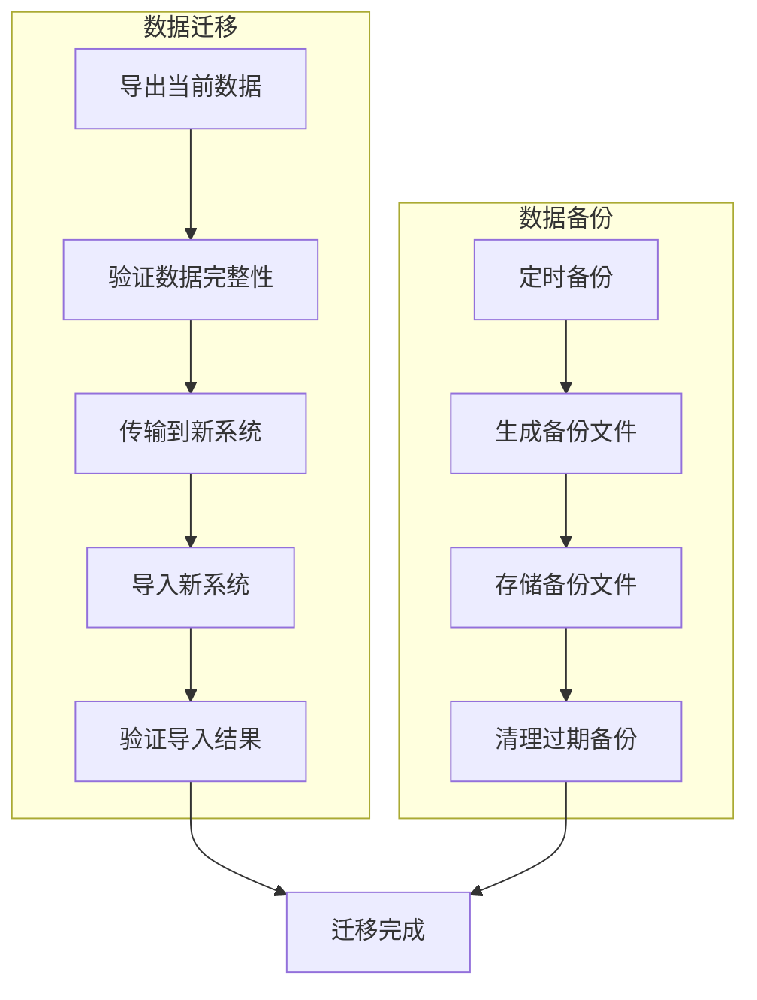
```mermaid
flowchart TD
subgraph "数据迁移"
EXPORT[导出当前数据] --> VALIDATE[验证数据完整性]
VALIDATE --> TRANSFER[传输到新系统]
TRANSFER --> IMPORT[导入新系统]
IMPORT --> VERIFY[验证导入结果]
end
subgraph "数据备份"
SCHEDULE[定时备份] --> BACKUP[生成备份文件]
BACKUP --> STORE[存储备份文件]
STORE --> CLEAN[清理过期备份]
end
VERIFY --> COMPLETE[迁移完成]
CLEAN --> COMPLETE
```

**图表来源**
- [js/leads.js:1675-1734](file://js/leads.js#L1675-L1734)
- [js/leads.js:3078-3116](file://js/leads.js#L3078-L3116)

## 性能优化与扩展

### 性能优化策略
系统采用多种性能优化策略，确保在大数据量下的流畅运行。

```mermaid
graph TD
subgraph "存储优化"
LOCAL_CACHE[本地缓存]
BATCH_OPERATIONS[批量操作]
DEBOUNCE[防抖机制]
STORAGE_LIMIT[存储限制]
end
subgraph "渲染优化"
VIRTUAL_SCROLL[虚拟滚动]
LAZY_LOADING[懒加载]
EVENT_DELEGATION[事件委托]
CSS_ANIMATIONS[硬件加速]
end
subgraph "内存管理"
OBJECT_REUSE[对象复用]
GARBAGE_COLLECTION[垃圾回收]
MEMORY_LEAK_PROTECTION[内存泄漏防护]
MODAL_CLEANUP[模态框清理]
end
LOCAL_CACHE --> PERFORMANCE
BATCH_OPERATIONS --> PERFORMANCE
VIRTUAL_SCROLL --> RENDERING
LAZY_LOADING --> RENDERING
OBJECT_REUSE --> MEMORY
GARBAGE_COLLECTION --> MEMORY
```

**图表来源**
- [js/leads.js:83-88](file://js/leads.js#L83-L88)
- [js/leads.js:1085-1379](file://js/leads.js#L1085-L1379)

### 扩展性设计
系统采用模块化设计，支持功能扩展和定制开发。

```mermaid
graph LR
subgraph "核心模块"
LEADS_CORE[线索核心]
POOL_MANAGER[池管理]
FOLLOW_MANAGER[跟进管理]
RULE_ENGINE[规则引擎]
ANALYTICS_ENGINE[分析引擎]
end
subgraph "扩展模块"
AI_ENGINE[AI引擎]
QR_SYSTEM[二维码系统]
IMPORT_EXPORT[导入导出]
NOTIFICATION[通知系统]
API_INTEGRATION[API集成]
end
subgraph "第三方集成"
CRM_SYSTEMS[CRM系统]
ERP_SYSTEMS[ERP系统]
MARKETING_TOOLS[营销工具]
PAYMENT_GATEWAYS[支付网关]
end
LEADS_CORE --> EXTENSIONS
EXTENSIONS --> CRM_SYSTEMS
EXTENSIONS --> ERP_SYSTEMS
EXTENSIONS --> MARKETING_TOOLS
EXTENSIONS --> PAYMENT_GATEWAYS
```

**图表来源**
- [js/leads.js:567-680](file://js/leads.js#L567-L680)
- [js/leads.js:3509-3587](file://js/leads.js#L3509-L3587)

### 安全性保障
系统提供多层次的安全保障机制。

| 安全层面 | 保护措施 | 实现方式 |
|---------|----------|----------|
| 数据安全 | 加密存储 | localStorage加密 |
| 访问控制 | 用户权限管理 | 角色权限控制 |
| 数据验证 | 前端后端双重验证 | 输入验证、格式检查 |
| XSS防护 | HTML转义 | 内容转义、Sanitization |
| CSRF防护 | Token验证 | 请求令牌验证 |
| 数据备份 | 自动备份 | 定时备份、版本管理 |

**章节来源**
- [js/leads.js:5-26](file://js/leads.js#L5-L26)
- [js/leads.js:445-482](file://js/leads.js#L445-L482)

## 故障排除指南

### 常见问题诊断

#### 线索数据丢失
**症状**：新增线索后刷新页面丢失
**可能原因**：
- localStorage容量不足
- 浏览器隐私设置限制
- 存储空间配额耗尽

**解决方案**：
1. 检查浏览器存储容量
2. 清理浏览器缓存数据
3. 关闭隐私模式重新登录
4. 检查浏览器扩展程序影响

#### 线索池配置异常
**症状**：线索池无法创建或配置无效
**可能原因**：
- 线索池名称重复
- 成员配置格式错误
- 权限设置问题

**解决方案**：
1. 检查线索池名称唯一性
2. 验证成员用户名格式
3. 确认管理员权限
4. 重启浏览器后重试

#### 跟进记录显示异常
**症状**：跟进记录无法显示或显示错误
**可能原因**：
- 跟进记录数据格式错误
- 时间戳格式问题
- 数据同步延迟

**解决方案**：
1. 检查跟进记录格式
2. 验证时间戳格式
3. 刷新页面重新加载
4. 检查网络连接状态

#### 自定义字段不显示
**症状**：自定义字段在表单中不显示
**可能原因**：
- 字段配置错误
- 线索池关联问题
- 字段状态禁用

**解决方案**：
1. 检查字段配置选项
2. 验证线索池关联设置
3. 确认字段启用状态
4. 清除浏览器缓存

### 调试工具与技巧

#### 开发者工具使用
- **控制台**：查看JavaScript错误和警告
- **网络面板**：监控API请求和响应
- **存储面板**：检查localStorage数据
- **性能面板**：分析页面加载性能

#### 日志记录
系统提供详细的日志记录功能，便于问题诊断。

```javascript
// 示例：错误日志记录
console.error('[Leads] Error:', {
    operation: 'save_lead',
    error: errorMessage,
    timestamp: new Date().toISOString(),
    userId: getCurrentUser()
});
```

#### 性能监控
- **页面加载时间**：监控关键页面加载性能
- **API响应时间**：跟踪接口调用性能
- **内存使用情况**：监控内存泄漏风险
- **存储使用情况**：监控localStorage使用量

**章节来源**
- [js/leads.js:83-88](file://js/leads.js#L83-L88)
- [js/leads.js:1675-1734](file://js/leads.js#L1675-L1734)

## 结论
陈苗系统的线索管理模块经过重大升级，已发展为功能完备、性能稳定的生产就绪CRM系统。系统的主要优势包括：

### 核心优势
1. **完整的生命周期管理**：从线索发现到转化的全流程覆盖
2. **智能分配机制**：基于地域、行业、权重的多维度分配算法
3. **高级池管理**：支持多线索池协同，灵活的分配策略
4. **增强跟踪系统**：完整的跟进记录、拜访签到、提醒通知
5. **自定义字段系统**：灵活的数据模型扩展，支持多种字段类型
6. **AI智能分析**：基于机器学习的线索评分和智能建议
7. **全面的分析报告**：多维度统计分析，包含转化漏斗、来源效果等
8. **API集成能力**：完整的RESTful API和Webhook通知机制
9. **团队协作功能**：申领审批、批量操作、通知系统
10. **高性能架构**：本地存储、虚拟滚动、防抖优化

### 技术特色
- **前后端分离架构**：现代化的技术栈，易于维护和扩展
- **模块化设计**：清晰的功能模块划分，支持独立开发和测试
- **数据驱动**：基于JSON的数据存储，支持灵活的数据扩展
- **实时同步**：支持本地存储和云端同步，确保数据一致性
- **安全可靠**：多重安全防护，包括数据加密、权限控制等

### 业务价值
- **提升转化效率**：智能评分和建议帮助销售团队聚焦高价值线索
- **优化资源配置**：智能分配算法确保线索得到最优处理
- **降低运营成本**：自动化规则和批量操作减少人工干预
- **增强团队协作**：完善的审批流程和通知系统提升协作效率
- **数据驱动决策**：全面的分析报告为管理层提供决策支持

### 未来发展
系统具备良好的扩展性，未来可以进一步增强：
- **AI机器学习**：更高级的智能评分和预测模型
- **移动端支持**：原生移动应用，支持离线操作
- **多语言国际化**：支持多语言界面和内容
- **第三方集成**：更多第三方系统集成能力
- **实时协作**：支持多人实时协作和共享

通过持续的功能迭代和技术升级，陈苗系统的线索管理模块将继续为企业提供卓越的客户关系管理解决方案。