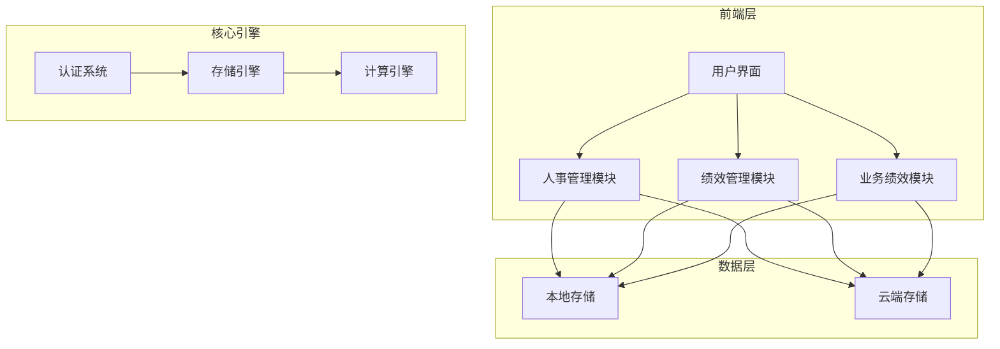
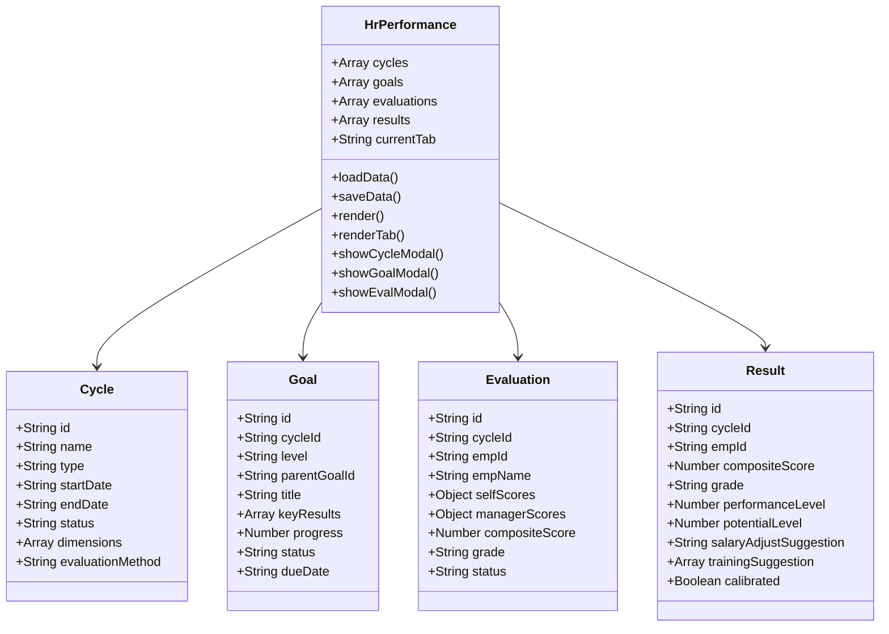
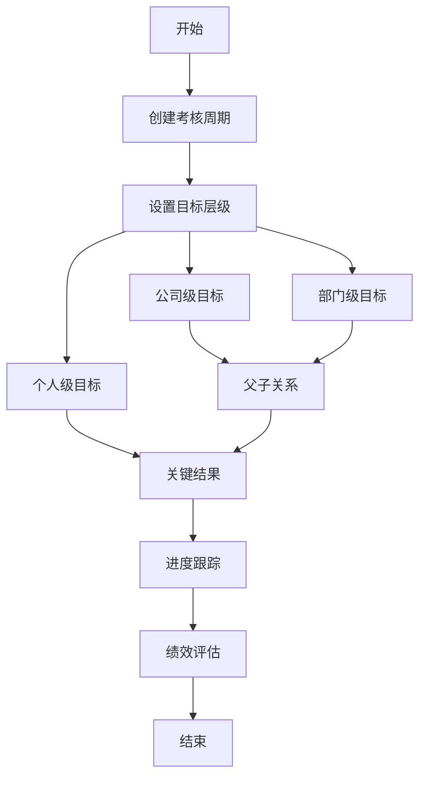
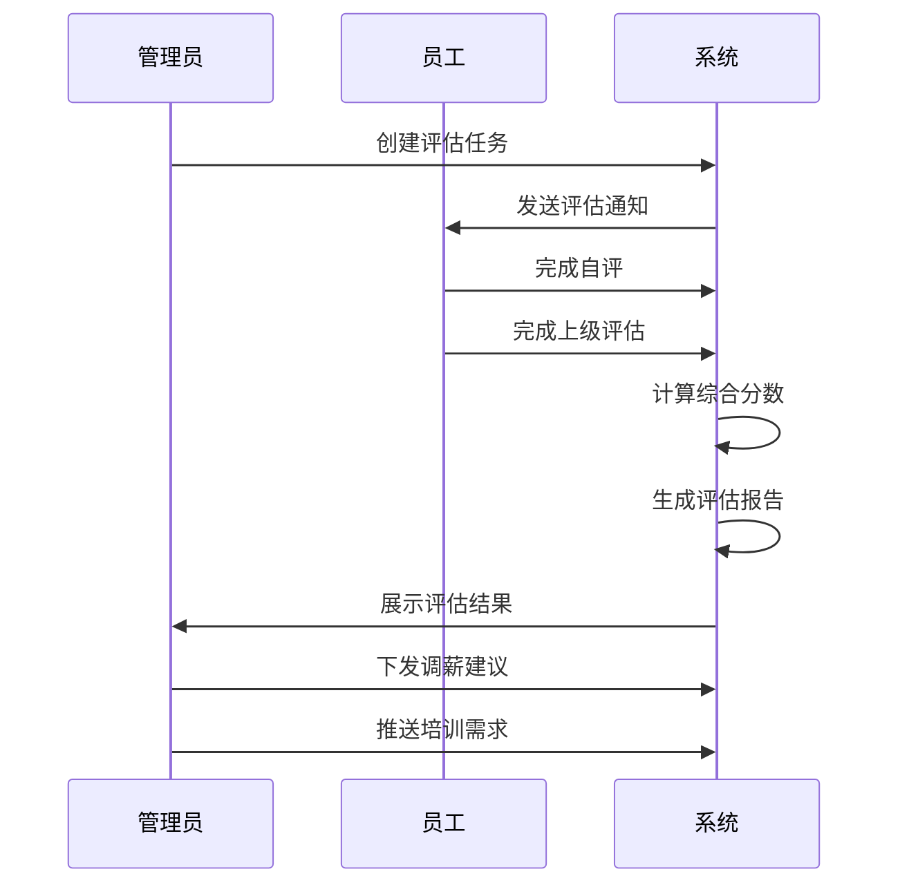
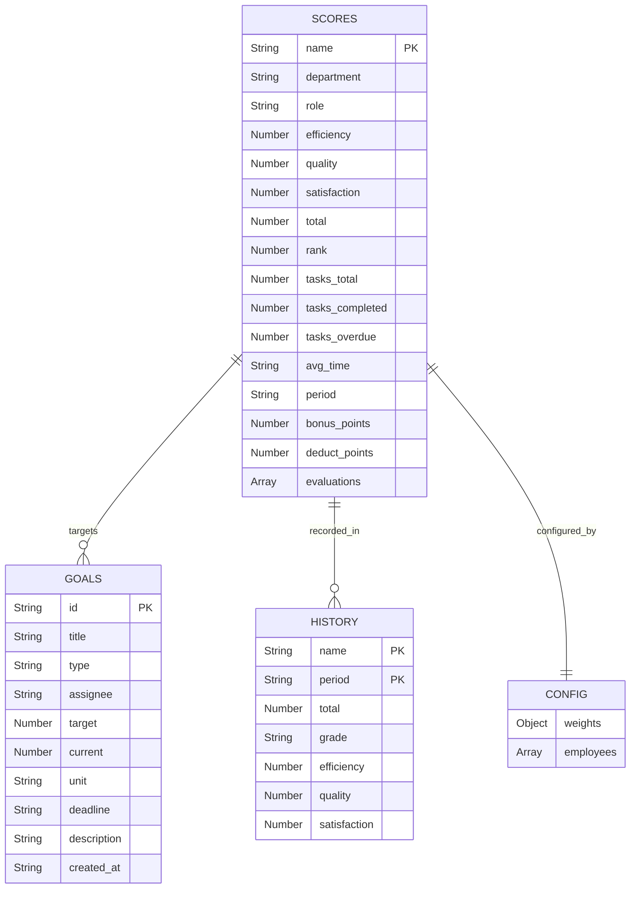
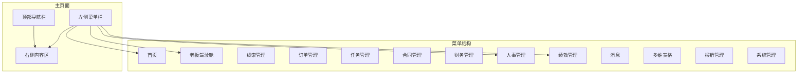
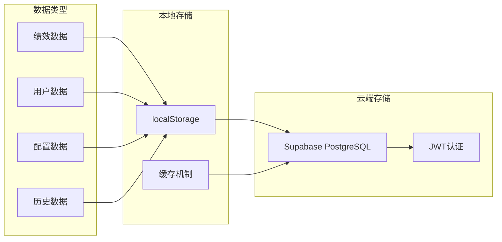

# 绩效管理系统

<cite>
**本文档引用的文件**
- [index.html](file://index.html)
- [README.md](file://README.md)
- [快速入门.md](file://快速入门.md)
- [js/hr-performance.js](file://js/hr-performance.js)
- [js/perf-management.js](file://js/perf-management.js)
- [css/style.css](file://css/style.css)
- [css/hr-style.css](file://css/hr-style.css)
- [css/biz-style.css](file://css/biz-style.css)
- [_tmp_gen/workflow/designer.vue](file://_tmp_gen/workflow/designer.vue)
- [_tmp_gen/contact.vue](file://_tmp_gen/contact.vue)
</cite>

## 目录
1. [项目概述](#项目概述)
2. [系统架构](#系统架构)
3. [核心模块](#核心模块)
4. [绩效管理模块](#绩效管理模块)
5. [业务绩效模块](#业务绩效模块)
6. [前端架构](#前端架构)
7. [数据存储](#数据存储)
8. [界面设计](#界面设计)
9. [扩展功能](#扩展功能)
10. [部署指南](#部署指南)

## 项目概述

浙杭企服绩效管理系统是一个基于纯前端技术栈的企业级绩效管理解决方案。该系统采用HTML5 + CSS3 + JavaScript技术构建，支持本地存储和云端数据同步，提供完整的绩效管理功能。

### 主要特性
- **多维度绩效管理**：支持公司级、部门级、个人级目标管理
- **自动化评分系统**：基于任务完成度自动计算绩效分数
- **可视化分析**：提供丰富的图表和仪表板展示
- **灵活的配置系统**：权重配置、等级划分、人员管理
- **移动端适配**：响应式设计支持多设备访问

## 系统架构



**图表来源**
- [index.html:145-399](file://index.html#L145-L399)

### 技术栈
- **前端框架**：原生JavaScript + Vue.js (部分模块)
- **样式系统**：CSS3 + 自定义样式变量
- **数据存储**：localStorage + Supabase PostgreSQL
- **认证系统**：JWT + Supabase Auth
- **图表库**：Chart.js

## 核心模块

### 1. 人事管理模块
负责员工信息管理和组织架构管理，为绩效管理提供基础数据支撑。

### 2. 绩效管理模块
核心的绩效评估和管理功能，包含多个子功能：
- 考核周期管理
- OKR目标管理  
- 绩效评价
- 绩效结果分析
- 九宫格人才盘点
- 结果应用

### 3. 业务绩效模块
针对不同业务部门的专门绩效管理，包括顾问部、会计部、工商部等。

## 绩效管理模块

### 模块结构



**图表来源**
- [js/hr-performance.js:1-568](file://js/hr-performance.js#L1-L568)

### 考核周期管理

系统支持多种类型的考核周期：
- **季度考核**：每季度进行一次绩效评估
- **半年度考核**：每半年进行一次全面评估  
- **年度考核**：每年进行年终总结评估

每个周期包含：
- 基本信息：名称、类型、起止日期
- 评估方式：自评+上级、360度评估
- 评分维度：工作业绩、工作态度、专业能力、团队协作
- 权重配置：各维度的权重分配

### OKR目标管理

采用OKR（目标与关键结果）管理模式：



**图表来源**
- [js/hr-performance.js:147-187](file://js/hr-performance.js#L147-L187)

### 绩效评价流程



**图表来源**
- [js/hr-performance.js:189-221](file://js/hr-performance.js#L189-L221)

## 业务绩效模块

### 模块特点

业务绩效模块专注于代理记账业务的特殊需求：

- **多维度评分**：效率、质量、客户评价三个核心维度
- **自动化计算**：基于任务完成度自动评分
- **部门化管理**：支持不同业务部门的差异化管理
- **实时监控**：提供实时的业务指标监控

### 核心功能

#### 1. 绩效看板
提供全面的业务绩效概览：
- 团队平均分统计
- 个人排名展示
- 等级分布分析
- 月度趋势追踪

#### 2. 考核评分
支持手动和自动评分：
- 效率指标：任务完成率、处理时长
- 质量指标：差错率、返工率
- 客户评价：满意度评分、响应时效

#### 3. 目标管理
KPI目标的设定和追踪：
- 目标类型：效率、质量、营收、客户
- 责任人管理：全员或指定员工
- 进度可视化：进度条和百分比显示

#### 4. 明细报表
详细的绩效数据报表：
- 个人绩效明细
- 部门排名对比
- 智能分析建议
- 历史趋势分析

### 数据模型



**图表来源**
- [js/perf-management.js:926-970](file://js/perf-management.js#L926-L970)

## 前端架构

### 页面结构

系统采用模块化的页面结构设计：



**图表来源**
- [index.html:175-342](file://index.html#L175-L342)

### 样式系统

系统采用模块化的样式设计：

#### 1. 基础样式
- **全局变量**：统一的颜色方案和字体规范
- **响应式设计**：适配不同屏幕尺寸
- **主题系统**：支持深色模式切换

#### 2. 模块样式
- **人事管理样式**：专用的HR模块UI组件
- **业务管理样式**：业务相关的表格和图表样式
- **通用组件样式**：按钮、表单、卡片等基础组件

#### 3. 动画效果
- **过渡动画**：页面切换和元素显示的平滑过渡
- **交互反馈**：按钮悬停、点击等状态反馈
- **加载动画**：数据加载时的视觉提示

## 数据存储

### 存储策略

系统采用多层次的数据存储策略：



**图表来源**
- [index.html:13-14](file://index.html#L13-L14)

### 数据结构

#### 1. 绩效数据结构
```javascript
const perfData = {
    cycles: [
        {
            id: 'CYC001',
            name: '2025年Q1季度绩效',
            type: '季度',
            startDate: '2025-01-01',
            endDate: '2025-03-31',
            status: '已结束',
            dimensions: [
                {name:'工作业绩',weight:40,desc:'核心KPI完成情况'},
                {name:'工作态度',weight:20,desc:'责任心与主动性'},
                {name:'专业能力',weight:25,desc:'岗位技能水平'},
                {name:'团队协作',weight:15,desc:'跨部门沟通配合'}
            ],
            evaluationMethod: '自评+上级'
        }
    ]
}
```

#### 2. 用户数据结构
```javascript
const userData = {
    employees: [
        {
            name: '张三',
            department: '会计部',
            role: '高级会计',
            joinDate: '2021-03-15'
        }
    ]
}
```

#### 3. 配置数据结构
```javascript
const configData = {
    weights: {
        efficiency: 40,
        quality: 50,
        satisfaction: 10
    },
    employees: []
}
```

## 界面设计

### 设计原则

系统遵循以下设计原则：
- **简洁直观**：界面清晰，操作简单
- **一致性**：统一的设计语言和交互模式
- **可访问性**：支持键盘导航和屏幕阅读器
- **响应式**：适配各种设备和屏幕尺寸

### 组件设计

#### 1. 卡片组件
- **统计卡片**：展示关键指标和统计数据
- **操作卡片**：包含按钮和操作区域
- **信息卡片**：展示详细信息和数据

#### 2. 表格组件
- **数据表格**：展示结构化数据
- **操作表格**：支持编辑、删除等操作
- **排序表格**：支持多列排序功能

#### 3. 图表组件
- **柱状图**：展示数值比较
- **饼图**：展示比例分布
- **折线图**：展示趋势变化

## 扩展功能

### 当前功能
- ✅ 用户认证系统
- ✅ 多设备数据同步
- ✅ 绩效管理核心功能
- ✅ 业务部门专门管理
- ✅ 数据可视化展示

### 计划功能
- [ ] 团队协作功能
- [ ] 角色权限管理
- [ ] 客户分配
- [ ] 实时数据同步
- [ ] 数据导出Excel
- [ ] 移动端APP

## 部署指南

### 环境要求
- **浏览器**：Chrome 90+、Firefox 85+、Safari 14+
- **服务器**：支持HTTPS的Web服务器
- **数据库**：Supabase PostgreSQL

### 部署步骤

#### 1. 创建Supabase项目
1. 访问 https://supabase.com 注册账号
2. 创建新项目，选择 Singapore 区域
3. 复制 Project URL 和 anon key
4. 在 SQL Editor 中执行 database-setup.sql

#### 2. 配置项目
打开 `js/config.js` 文件，修改以下配置：
```javascript
const SUPABASE_URL = 'https://你的项目ID.supabase.co';
const SUPABASE_ANON_KEY = '你的anon密钥';
```

#### 3. 测试运行
1. 双击打开 `index.html`
2. 注册新账号
3. 登录并添加测试数据
4. 验证数据保存功能

#### 4. 生产部署
参考 `DEPLOY.md` 文件中的详细部署指南

### 安全特性
- **HTTPS加密**：所有数据传输都经过加密
- **JWT认证**：基于令牌的用户身份验证
- **数据隔离**：用户数据完全隔离
- **行级安全**：PostgreSQL RLS保护

**章节来源**
- [README.md:1-135](file://README.md#L1-L135)
- [快速入门.md:1-61](file://快速入门.md#L1-L61)