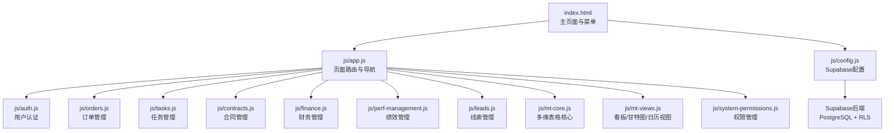
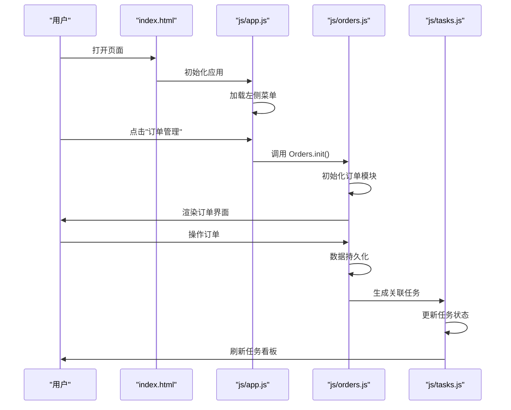
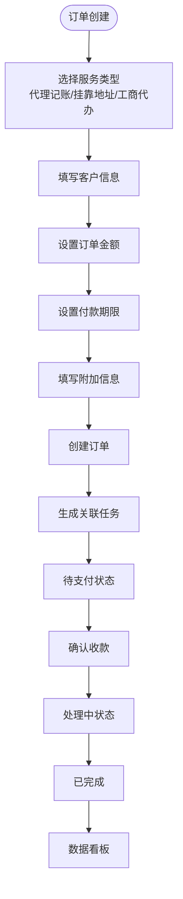
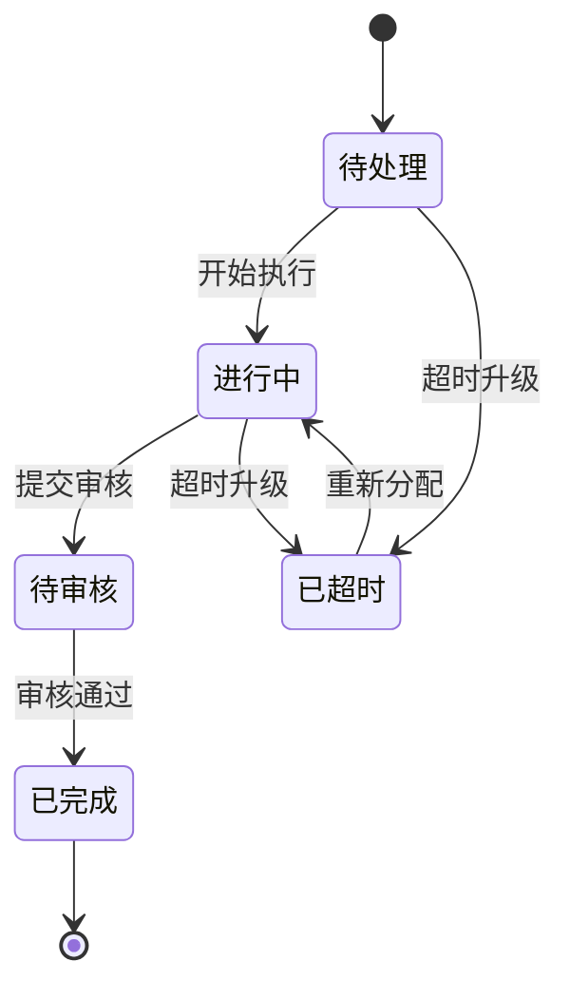
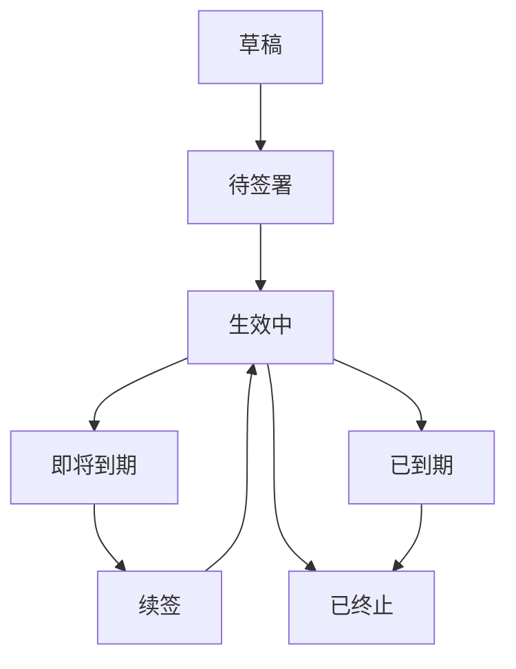
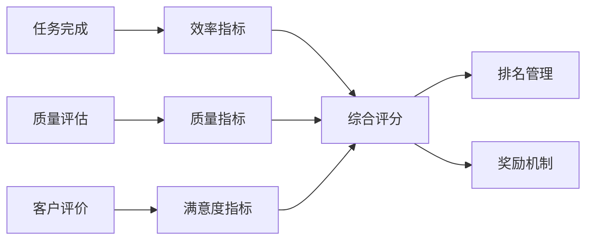
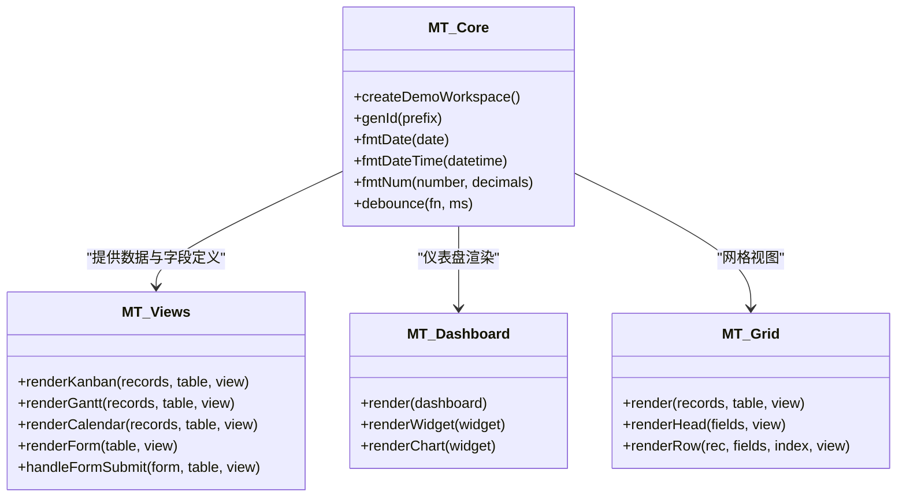
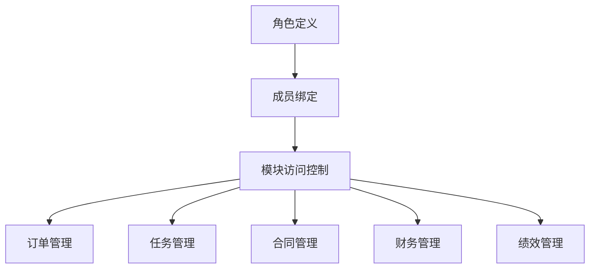
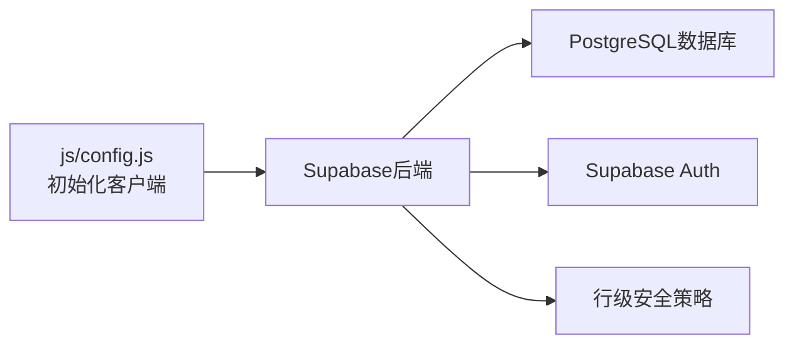

# 订单与任务管理

<cite>
**本文档引用的文件**
- [README.md](file://README.md)
- [database-setup.sql](file://database-setup.sql)
- [index.html](file://index.html)
- [js/config.js](file://js/config.js)
- [js/auth.js](file://js/auth.js)
- [js/cloud-storage.js](file://js/cloud-storage.js)
- [js/app.js](file://js/app.js)
- [js/leads.js](file://js/leads.js)
- [js/mt-core.js](file://js/mt-core.js)
- [js/mt-views.js](file://js/mt-views.js)
- [js/system-permissions.js](file://js/system-permissions.js)
- [js/orders.js](file://js/orders.js)
- [js/tasks.js](file://js/tasks.js)
- [js/finance.js](file://js/finance.js)
- [js/contracts.js](file://js/contracts.js)
- [js/perf-management.js](file://js/perf-management.js)
- [js/mt-dashboard.js](file://js/mt-dashboard.js)
- [js/mt-grid.js](file://js/mt-grid.js)
- [js/mt-toolbar.js](file://js/mt-toolbar.js)
- [css/biz-style.css](file://css/biz-style.css)
</cite>

## 目录
1. [简介](#简介)
2. [项目结构](#项目结构)
3. [核心组件](#核心组件)
4. [架构概览](#架构概览)
5. [详细组件分析](#详细组件分析)
6. [依赖关系分析](#依赖关系分析)
7. [性能考虑](#性能考虑)
8. [故障排除指南](#故障排除指南)
9. [结论](#结论)
10. [附录](#附录)

## 简介
本文档全面介绍陈苗系统的订单与任务管理模块，基于新增的完整业务管理系统实现。系统现已包含订单管理、任务管理、合同管理、财务管理、绩效管理等多个核心业务模块，采用纯前端架构，使用 Supabase 作为云端数据库与认证后端，通过本地存储实现数据持久化。

## 项目结构
系统采用模块化设计，每个业务模块独立封装，通过统一的应用路由进行管理。主要模块包括订单管理、任务管理、合同管理、财务管理、绩效管理等。



**图表来源**
- [index.html:175-398](file://index.html#L175-L398)
- [js/app.js:90-182](file://js/app.js#L90-L182)
- [js/orders.js:1-419](file://js/orders.js#L1-L419)
- [js/tasks.js:1-275](file://js/tasks.js#L1-L275)
- [js/config.js:1-20](file://js/config.js#L1-L20)

**章节来源**
- [index.html:175-398](file://index.html#L175-L398)
- [js/app.js:90-182](file://js/app.js#L90-L182)

## 核心组件
- **订单管理模块**：提供订单全生命周期管理，包括创建、状态流转、收款管理、客户信用评估、服务配置等功能
- **任务管理模块**：支持任务看板、列表视图、甘特图、负载分析等，实现任务分配与进度监控
- **合同管理模块**：合同模板管理、全生命周期管控、到期提醒、合规审计
- **财务管理模块**：收支总览、应收应付管理、发票管理、对账中心、风控预警
- **绩效管理模块**：多维度考核、自动采集、透明化看板、排名趋势
- **多维表格系统**：提供看板、甘特图、日历、网格等多种视图，支持字段类型丰富
- **权限管理**：定义角色与成员，控制对模块与功能的访问权限
- **Supabase 集成**：通过配置文件初始化客户端，支持云端数据存储与同步

**章节来源**
- [js/orders.js:1-419](file://js/orders.js#L1-L419)
- [js/tasks.js:1-275](file://js/tasks.js#L1-L275)
- [js/contracts.js:1-218](file://js/contracts.js#L1-L218)
- [js/finance.js:1-198](file://js/finance.js#L1-L198)
- [js/perf-management.js:1-198](file://js/perf-management.js#L1-L198)
- [js/mt-core.js:760-859](file://js/mt-core.js#L760-L859)
- [js/system-permissions.js:1-44](file://js/system-permissions.js#L1-L44)
- [js/config.js:1-20](file://js/config.js#L1-L20)

## 架构概览
系统采用前后端分离的纯前端架构，前端负责界面与业务逻辑，后端由 Supabase 提供数据库与认证服务。每个业务模块都有独立的初始化和销毁机制，通过统一的路由系统进行页面切换。



**图表来源**
- [index.html:175-398](file://index.html#L175-L398)
- [js/app.js:137-139](file://js/app.js#L137-L139)
- [js/orders.js:10-11](file://js/orders.js#L10-L11)
- [js/tasks.js:9-10](file://js/tasks.js#L9-L10)

## 详细组件分析

### 1. 订单管理模块（核心业务模块）
订单管理模块提供完整的订单生命周期管理，支持多种服务类型和状态流转。



**图表来源**
- [js/orders.js:240-307](file://js/orders.js#L240-L307)
- [js/orders.js:310-333](file://js/orders.js#L310-L333)

#### 订单状态管理
- **待支付**：订单刚创建，等待客户付款
- **处理中**：客户已付款，开始执行服务
- **已完成**：服务执行完毕，订单完成
- **争议中**：发生争议，需要人工处理
- **已取消**：订单被取消
- **待资源**：等待特定资源到位
- **待审批**：需要上级审批

#### 服务类型配置
- **代理记账**：支持小微企业和一般纳税人，包含账套类型、服务周期、附加服务
- **挂靠地址**：支持虚拟地址和实际办公地址，包含区域、使用期限
- **工商代办**：支持公司注册、变更、注销等业务类型

**章节来源**
- [js/orders.js:122-152](file://js/orders.js#L122-L152)
- [js/orders.js:154-178](file://js/orders.js#L154-L178)
- [js/orders.js:180-215](file://js/orders.js#L180-L215)
- [js/orders.js:217-237](file://js/orders.js#L217-L237)

### 2. 任务管理模块（执行与监控）
任务管理模块提供多种视图和工作流管理功能，支持任务分配、进度跟踪和质量控制。



**图表来源**
- [js/tasks.js:213-232](file://js/tasks.js#L213-L232)

#### 任务看板视图
- **待处理**：新创建或等待开始的任务
- **进行中**：正在执行的任务
- **待审核**：等待质量检查或客户验收
- **已完成**：任务执行完毕
- **已超时**：超出截止日期的任务

#### 任务分配机制
- **智能分配**：根据员工技能和负载情况自动分配
- **技能匹配**：代理记账任务分配给会计组，工商任务分配给工商组
- **负载均衡**：优先分配给当前负载最低的员工
- **冲突检测**：避免同一员工同时段分配冲突任务

**章节来源**
- [js/tasks.js:59-82](file://js/tasks.js#L59-L82)
- [js/tasks.js:177-195](file://js/tasks.js#L177-L195)
- [js/tasks.js:213-232](file://js/tasks.js#L213-L232)

### 3. 甘特图与时间管理
甘特图视图支持任务时间线展示和依赖关系管理，适合订单执行计划与交期跟踪。

```mermaid
gantt
title 任务时间线本月
dateFormat X
axisFormat %d
王芳的任务 :1, 15d
张伟的任务 :5, 12d
陈丽的任务 :8, 10d
李强的任务 :12, 8d
赵敏的任务 :15, 6d
```



**图表来源**
- [js/tasks.js:112-135](file://js/tasks.js#L112-L135)

**章节来源**
- [js/tasks.js:112-135](file://js/tasks.js#L112-L135)

### 4. 合同管理模块（合规保障）
合同管理模块提供合同全生命周期管理，确保业务合规性和风险控制。



**图表来源**
- [js/contracts.js:13-30](file://js/contracts.js#L13-L30)

**章节来源**
- [js/contracts.js:13-30](file://js/contracts.js#L13-L30)
- [js/contracts.js:89-111](file://js/contracts.js#L89-L111)
- [js/contracts.js:113-133](file://js/contracts.js#L113-L133)

### 5. 财务管理模块（收支控制）
财务管理模块提供完整的财务数据管理和风险控制功能。

```mermaid
mindmap
root((财务管理))
收支总览
收入构成
支出分析
净利润
应收管理
应收账款
逾期提醒
催收管理
发票管理
发票开具
税务合规
风险控制
对账中心
银行对账
匹配规则
差异处理
风控预警
资金异常
收款骤降
进项逾期
```

**图表来源**
- [js/finance.js:43-80](file://js/finance.js#L43-L80)
- [js/finance.js:82-97](file://js/finance.js#L82-L97)
- [js/finance.js:99-113](file://js/finance.js#L99-L113)

**章节来源**
- [js/finance.js:43-80](file://js/finance.js#L43-L80)
- [js/finance.js:82-97](file://js/finance.js#L82-L97)
- [js/finance.js:99-113](file://js/finance.js#L99-L113)

### 6. 绩效管理模块（质量评估）
绩效管理模块提供多维度的员工绩效评估和激励机制。



**图表来源**
- [js/perf-management.js:14-45](file://js/perf-management.js#L14-L45)

**章节来源**
- [js/perf-management.js:14-45](file://js/perf-management.js#L14-L45)
- [js/perf-management.js:74-105](file://js/perf-management.js#L74-L105)

### 7. 多维表格系统（数据可视化）
多维表格系统提供丰富的数据可视化和协作能力，支持多种视图和字段类型。



**图表来源**
- [js/mt-core.js:760-859](file://js/mt-core.js#L760-L859)
- [js/mt-views.js:1-217](file://js/mt-views.js#L1-L217)
- [js/mt-dashboard.js:1-493](file://js/mt-dashboard.js#L1-L493)
- [js/mt-grid.js:1-358](file://js/mt-grid.js#L1-L358)

**章节来源**
- [js/mt-core.js:760-859](file://js/mt-core.js#L760-L859)
- [js/mt-views.js:1-217](file://js/mt-views.js#L1-L217)
- [js/mt-dashboard.js:1-493](file://js/mt-dashboard.js#L1-L493)
- [js/mt-grid.js:1-358](file://js/mt-grid.js#L1-L358)

### 8. 权限管理（角色控制）
系统权限模块定义了角色与成员，控制对模块与功能的访问。



**图表来源**
- [js/system-permissions.js:1-44](file://js/system-permissions.js#L1-L44)

**章节来源**
- [js/system-permissions.js:1-44](file://js/system-permissions.js#L1-L44)

### 9. Supabase 集成（云端数据存储）
配置文件初始化 Supabase 客户端，支持云端数据存储与同步。



**图表来源**
- [js/config.js:1-20](file://js/config.js#L1-L20)

**章节来源**
- [js/config.js:1-20](file://js/config.js#L1-L20)

## 依赖关系分析
系统采用模块化架构，各业务模块相互独立又有机协作。

```mermaid
graph TB
subgraph "前端模块"
APP["js/app.js<br/>应用路由"]
AUTH["js/auth.js<br/>用户认证"]
ORDERS["js/orders.js<br/>订单管理"]
TASKS["js/tasks.js<br/>任务管理"]
CONTRACTS["js/contracts.js<br/>合同管理"]
FINANCE["js/finance.js<br/>财务管理"]
PERF["js/perf-management.js<br/>绩效管理"]
LEADS["js/leads.js<br/>线索管理"]
MT_CORE["js/mt-core.js<br/>多维表格核心"]
MT_VIEWS["js/mt-views.js<br/>视图渲染"]
MT_DASHBOARD["js/mt-dashboard.js<br/>仪表盘"]
MT_GRID["js/mt-grid.js<br/>网格视图"]
MT_TOOLBAR["js/mt-toolbar.js<br/>工具栏"]
PERMISSIONS["js/system-permissions.js<br/>权限管理"]
CONF["js/config.js<br/>配置管理"]
END
subgraph "后端服务"
SUPABASE["Supabase后端"]
DB["PostgreSQL数据库"]
AUTH["Supabase Auth"]
RLS["行级安全策略"]
END
APP --> AUTH
APP --> ORDERS
APP --> TASKS
APP --> CONTRACTS
APP --> FINANCE
APP --> PERF
APP --> LEADS
APP --> MT_CORE
APP --> MT_VIEWS
APP --> MT_DASHBOARD
APP --> MT_GRID
APP --> MT_TOOLBAR
APP --> PERMISSIONS
CONF --> SUPABASE
SUPABASE --> DB
SUPABASE --> AUTH
SUPABASE --> RLS
```

**图表来源**
- [js/app.js:90-182](file://js/app.js#L90-L182)
- [js/orders.js:1-419](file://js/orders.js#L1-L419)
- [js/tasks.js:1-275](file://js/tasks.js#L1-L275)
- [js/config.js:1-20](file://js/config.js#L1-L20)

**章节来源**
- [js/app.js:90-182](file://js/app.js#L90-L182)
- [js/orders.js:1-419](file://js/orders.js#L1-L419)
- [js/tasks.js:1-275](file://js/tasks.js#L1-L275)
- [js/config.js:1-20](file://js/config.js#L1-L20)

## 性能考虑
- **本地存储优化**：订单、任务、财务等数据使用 localStorage，减少网络请求
- **模块懒加载**：通过路由系统按需加载模块，提高首屏加载速度
- **视图渲染优化**：多维表格视图在大数据量下可能影响性能，建议分页或虚拟滚动
- **缓存策略**：合理使用浏览器缓存，避免重复计算和网络请求
- **事件委托**：使用事件委托减少 DOM 事件监听器数量

## 故障排除指南
- **认证问题**：检查 Supabase 凭据配置与网络连通性；若 SDK 未加载，系统将回退到本地模式
- **页面空白**：确认 index.html 中脚本加载顺序与路径正确
- **数据不显示**：检查 Supabase RLS 策略与用户会话；确认字段类型与视图配置一致
- **模块加载失败**：检查对应模块的 JavaScript 文件是否正确加载
- **权限异常**：核对角色定义与成员绑定，确保模块访问权限正确
- **数据同步问题**：检查本地存储是否正常，必要时清理浏览器缓存

**章节来源**
- [js/config.js:1-20](file://js/config.js#L1-L20)
- [js/auth.js:1-259](file://js/auth.js#L1-L259)
- [js/system-permissions.js:1-44](file://js/system-permissions.js#L1-L44)

## 结论
陈苗系统现已构建完整的业务管理生态系统，包含订单管理、任务管理、合同管理、财务管理、绩效管理等多个核心模块。系统采用模块化设计，支持灵活扩展和定制化配置。通过多维表格系统和丰富的视图功能，实现了业务流程的数字化转型。系统具备完善的权限控制和数据安全保障，能够满足现代企业的管理需求。

## 附录

### A. 业务流程蓝图
- **订单生命周期**：线索 → 商机 → 合同 → 订单 → 执行 → 完成/结算
- **任务生命周期**：创建 → 分配 → 执行 → 跟踪 → 完成 → 评估
- **合同生命周期**：草稿 → 签署 → 生效 → 到期 → 续签/终止
- **财务生命周期**：收入确认 → 成本核算 → 财务报告 → 风控预警

### B. 数据模型（基于本地存储）
- **订单数据**：包含订单号、客户信息、服务类型、金额、状态、时间戳等字段
- **任务数据**：包含任务标题、关联订单、负责人、优先级、状态、截止日期等字段
- **财务数据**：包含收支类型、金额、日期、客户、分类、状态等字段
- **合同数据**：包含合同编号、客户信息、服务类型、金额、有效期、状态等字段
- **绩效数据**：包含员工姓名、各项指标得分、总分、排名等字段

### C. 视图功能对照表
- **订单管理**：列表视图、数据看板、收款管理、客户信用、服务配置
- **任务管理**：看板视图、列表视图、甘特图、负载分析
- **合同管理**：列表视图、到期提醒、模板管理、合规审计
- **财务管理**：收支总览、应收管理、发票管理、对账中心、风控预警
- **绩效管理**：绩效看板、明细数据、考核指标、自动采集

**章节来源**
- [js/orders.js:408-419](file://js/orders.js#L408-L419)
- [js/tasks.js:263-275](file://js/tasks.js#L263-L275)
- [js/finance.js:179-198](file://js/finance.js#L179-L198)
- [js/contracts.js:210-218](file://js/contracts.js#L210-L218)
- [js/perf-management.js:191-198](file://js/perf-management.js#L191-L198)