# 财务管理

<cite>
**本文引用的文件**
- [finance.js](file://js/finance.js)
- [orders.js](file://js/orders.js)
- [finance-journal.js](file://js/finance-journal.js)
- [auth.js](file://js/auth.js)
- [cloud-storage.js](file://js/cloud-storage.js)
- [app.js](file://js/app.js)
- [cockpit.js](file://js/cockpit.js)
- [multitable.js](file://js/multitable.js)
- [system-permissions.js](file://js/system-permissions.js)
- [database-setup.sql](file://database-setup.sql)
- [index.html](file://index.html)
- [README.md](file://README.md)
- [快速入门.md](file://快速入门.md)
- [biz-style.css](file://css/biz-style.css)
</cite>

## 更新摘要
**变更内容**
- 新增独立的财务管理模块（Finance），替代原有的公司日记账功能
- 新增应收应付管理、发票管理、对账中心、风控预警等专业财务功能
- 新增与订单管理的深度集成，实现从订单到财务的完整闭环
- 新增专门的财务样式系统，支持专业的财务报表和预警展示

## 目录
1. [简介](#简介)
2. [项目结构](#项目结构)
3. [核心组件](#核心组件)
4. [架构总览](#架构总览)
5. [详细组件分析](#详细组件分析)
6. [依赖关系分析](#依赖关系分析)
7. [性能考量](#性能考量)
8. [故障排查指南](#故障排查指南)
9. [结论](#结论)
10. [附录](#附录)

## 简介
本文件面向"陈苗系统"的财务管理模块，围绕收支记录录入、分类与统计，会计科目设置、凭证管理与账簿维护，财务报表生成、预算控制与成本分析，银行对账、应收/应付管理，税务处理与发票管理，以及与总账系统的集成与数据一致性保障进行系统化说明。同时覆盖权限控制、审批流程与审计追踪，并给出财务公式、计算逻辑与数据校验规则。

**更新** 新增独立的财务管理模块，提供更专业的财务管理和分析功能，包括应收应付管理、发票管理、对账中心和风控预警等核心功能。

## 项目结构
- 前端采用纯 HTML/CSS/JavaScript 构建，通过 Supabase 提供云端认证与数据存储能力。
- 财务管理模块主要由"财务总览"界面与"老板驾驶舱"看板构成；权限与角色管理位于"系统管理/人员权限管理"。
- 数据库采用 Supabase 的 PostgreSQL，提供行级安全策略（RLS）与自动更新时间戳触发器。
- **新增** 与订单管理模块深度集成，实现从订单到财务的完整业务闭环。

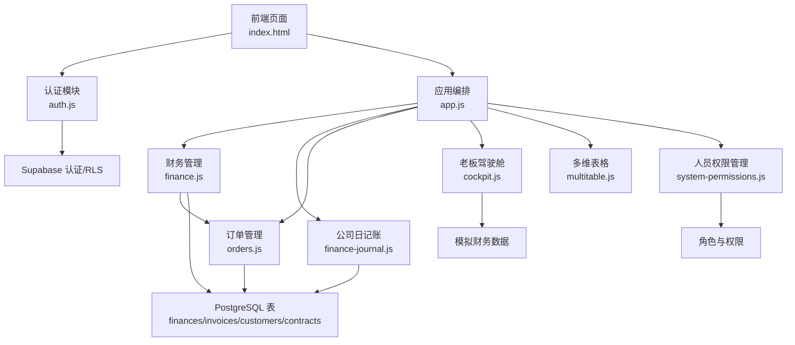

**图表来源**
- [index.html:234-249](file://index.html#L234-L249)
- [app.js:143-144](file://js/app.js#L143-L144)
- [finance.js:1-198](file://js/finance.js#L1-L198)
- [orders.js:1-419](file://js/orders.js#L1-L419)
- [auth.js:1-259](file://js/auth.js#L1-L259)
- [app.js:120-144](file://js/app.js#L120-L144)

**章节来源**
- [index.html:234-249](file://index.html#L234-L249)
- [README.md:1-135](file://README.md#L1-L135)
- [快速入门.md:1-61](file://快速入门.md#L1-L61)

## 核心组件
- **财务管理模块（Finance）**
  - 独立的财务总览界面，包含收支总览、应收应付、发票管理、对账中心、风控预警五个子功能。
  - 支持财务数据的可视化展示和专业分析。
- **订单管理模块（Orders）**
  - 与财务模块深度集成，支持从订单到财务的自动流转。
  - 包含应收账款管理、收款确认、客户信用评估等功能。
- **公司日记账（FinanceJournal）**
  - 传统的财务记录管理界面，支持多表工作区和数据处理。
- **老板驾驶舱（Cockpit）**
  - KPI 汇总（本月营收、总客户数、合同总额、线索总数、转化率、净利润）、收入趋势图、线索来源/状态/意向分布、客户营收排行榜、近期待办与动态。
- **多维表格（MultiTable）**
  - 提供统一的表格/看板/画廊/甘特/日历/表单视图，支持字段增删、视图切换、筛选/排序/分组、导入导出、记录详情面板等。
- **人员权限管理（SystemPermissions）**
  - 角色定义与成员管理，覆盖"财务""部门经理""只读用户"等，控制各模块访问权限。
- **认证与云存储（Auth、CloudStorage）**
  - 基于 Supabase 的 JWT 会话、RLS 数据隔离；云存储模块预留云端同步接口。
- **数据库（database-setup.sql）**
  - 客户、合同、财务记录、发票四张表，索引、RLS 策略、updated_at 触发器。

**章节来源**
- [finance.js:1-198](file://js/finance.js#L1-L198)
- [orders.js:1-419](file://js/orders.js#L1-L419)
- [finance-journal.js:1-1155](file://js/finance-journal.js#L1-L1155)
- [cockpit.js:1-624](file://js/cockpit.js#L1-L624)
- [multitable.js:1-624](file://js/multitable.js#L1-L624)
- [system-permissions.js:1-323](file://js/system-permissions.js#L1-L323)
- [database-setup.sql:1-148](file://database-setup.sql#L1-L148)

## 架构总览
财务模块采用"界面-数据-存储"三层：
- 界面层：财务总览、公司日记账、订单管理、老板驾驶舱、多维表格、权限管理。
- 数据层：本地工作区（localStorage）持久化，未来对接 Supabase 表（RLS）。
- 存储层：Supabase PostgreSQL（RLS），提供用户隔离与数据安全。

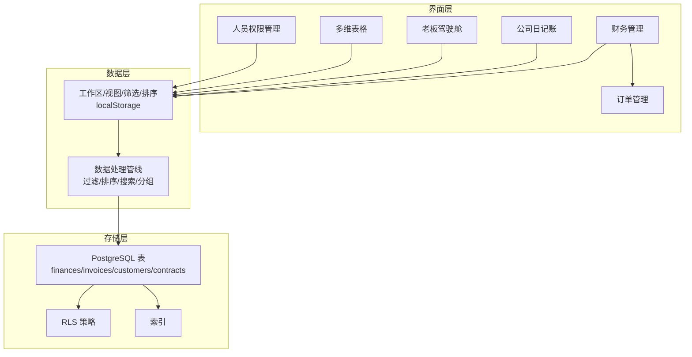

**图表来源**
- [finance.js:14-30](file://js/finance.js#L14-L30)
- [finance-journal.js:42-118](file://js/finance-journal.js#L42-L118)
- [orders.js:32-52](file://js/orders.js#L32-L52)
- [cockpit.js:214-224](file://js/cockpit.js#L214-L224)
- [multitable.js:7-29](file://js/multitable.js#L7-L29)
- [system-permissions.js:3-31](file://js/system-permissions.js#L3-L31)
- [database-setup.sql:66-148](file://database-setup.sql#L66-L148)

## 详细组件分析

### 财务管理模块（Finance）
- **模块架构**
  - 独立的财务管理模块，提供专业的财务管理和分析功能。
  - 包含五个核心子功能：收支总览、应收应付、发票管理、对账中心、风控预警。
- **收支总览**
  - 实时统计总收入、总支出、净利润和记录数。
  - 收入构成分析（代理记账、挂靠地址、工商代办）。
  - 月度收入趋势分析。
  - 成本核算模型展示。
- **应收应付管理**
  - 应收账款总额和待收客户统计。
  - 详细的应收明细表格，包含客户、订单号、应收金额、已收金额、欠款、逾期天数。
  - 逾期阶梯提醒功能。
- **发票管理**
  - 发票列表展示，包含发票号、客户、金额、税目、状态、开具日期。
  - 发票状态标签（已开具、待开具、已作废）。
  - 发票自动匹配合同条款功能。
  - 税控盘API对接支持。
- **对账中心**
  - 银行对账自动化程度统计。
  - 对账规则配置（摘要关键词匹配、金额精确匹配、未匹配项处理）。
  - 最近银行流水模拟展示。
- **风控预警**
  - AI预警列表（资金异常、进项逾期、收款逾期、收入波动、税务合规）。
  - 预警规则配置（大额异常、收款骤降、进项逾期、客户信用）。
  - 风险控制规则引擎。

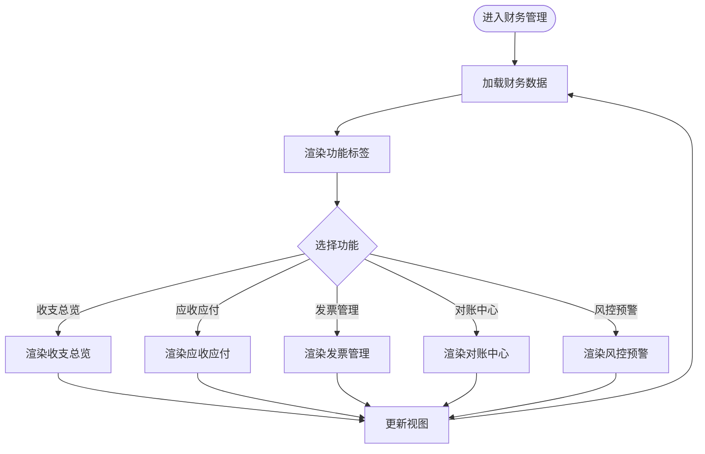

**图表来源**
- [finance.js:14-41](file://js/finance.js#L14-L41)
- [finance.js:43-80](file://js/finance.js#L43-L80)
- [finance.js:82-96](file://js/finance.js#L82-L96)
- [finance.js:99-113](file://js/finance.js#L99-L113)
- [finance.js:115-142](file://js/finance.js#L115-L142)
- [finance.js:144-167](file://js/finance.js#L144-L167)

**章节来源**
- [finance.js:1-198](file://js/finance.js#L1-L198)

### 订单管理模块（Orders）
- **模块架构**
  - 与财务模块深度集成，支持从订单到财务的自动流转。
  - 包含订单列表、数据看板、收款管理、客户信用、服务配置五个子功能。
- **收款管理**
  - 应收账款统计（应收账款、待收款、已收款）。
  - 待收款订单表格，支持确认收款操作。
  - 逾期天数自动计算和阶梯提醒。
- **客户信用评估**
  - 信用分计算公式：100 - 逾期次数×15 + 完成订单×5（上限100）。
  - 信用等级划分（A/B/C/D）。
  - 信用分低于40的客户新订单需经理审批。
- **与财务模块集成**
  - 确认收款后自动生成财务记录。
  - 应收账款数据与财务模块共享。
  - 逾期订单自动触发财务预警。

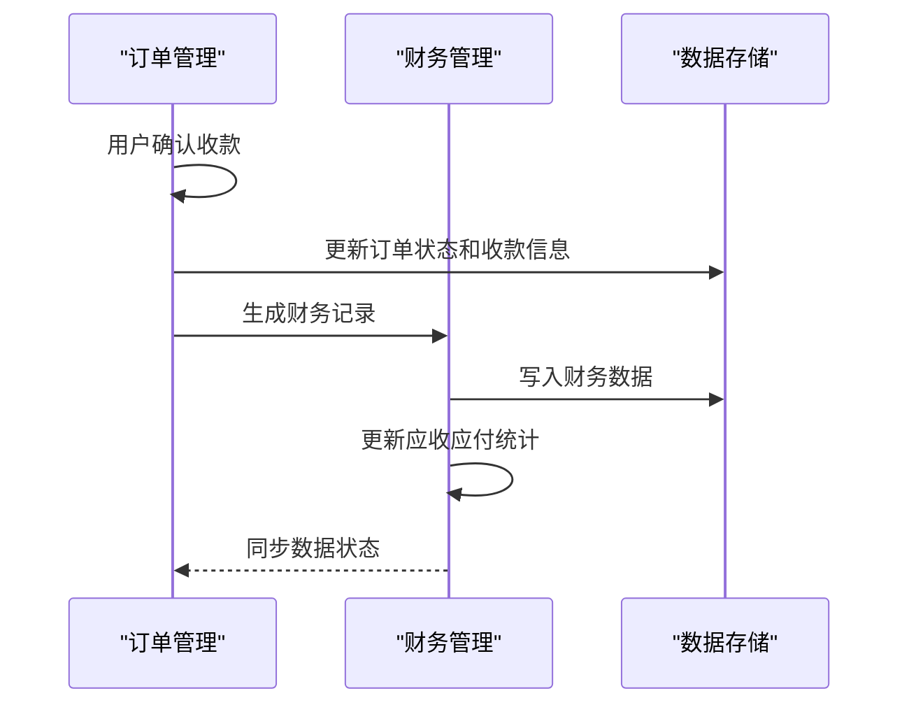

**图表来源**
- [orders.js:335-351](file://js/orders.js#L335-L351)
- [orders.js:154-178](file://js/orders.js#L154-L178)
- [orders.js:180-214](file://js/orders.js#L180-L214)

**章节来源**
- [orders.js:1-419](file://js/orders.js#L1-L419)

### 公司日记账（FinanceJournal）
- 多表工作区与视图
  - 支持新建/重命名/删除数据表，切换活动表，保存至 localStorage。
  - 默认包含"公司日记账"表，初始列定义覆盖收支类型、科目、账户、金额、经办人、审核状态等。
- 数据处理管线
  - 筛选：支持等于/不等于/包含/大于/小于/为空/不为空。
  - 排序：支持多字段升/降序。
  - 搜索：对可见列进行模糊匹配。
  - 分组：按指定字段分组展示。
- 渲染与交互
  - 工具栏：筛选/排序/隐藏字段/搜索。
  - 列右键菜单：重命名、左右插入列、隐藏/删除列。
  - 行内编辑：单击单元格进入编辑，失焦或点击空白处保存。
  - 统计栏：实时计算收入、支出与结余。
- 本地持久化与迁移
  - 从旧版本迁移兼容，首次加载若无工作区则生成默认工作区与示例数据。

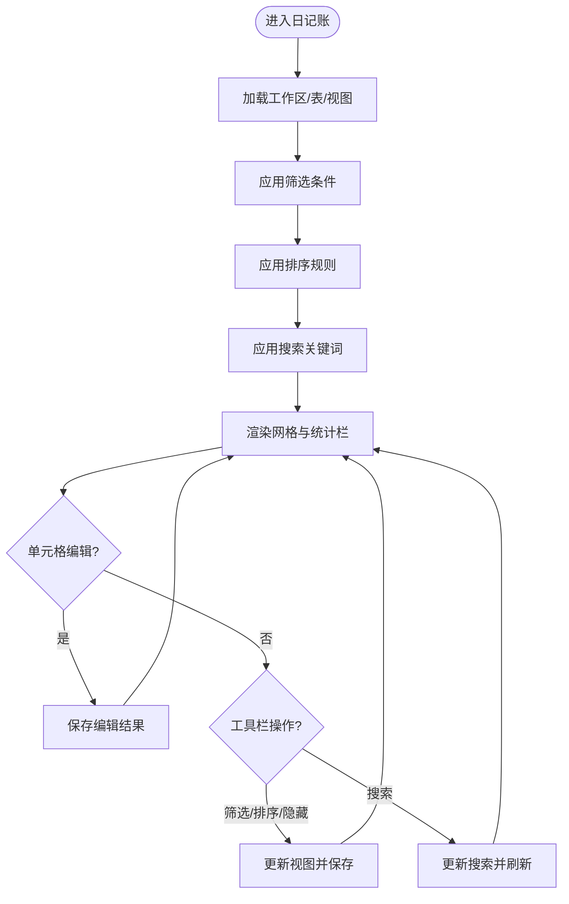

**图表来源**
- [finance-journal.js:170-231](file://js/finance-journal.js#L170-L231)
- [finance-journal.js:408-538](file://js/finance-journal.js#L408-L538)

**章节来源**
- [finance-journal.js:1-1155](file://js/finance-journal.js#L1-L1155)

### 老板驾驶舱（Cockpit）
- KPI 计算
  - 本月营收、总客户数、合同总额、线索总数、转化率、净利润。
  - 对比上月趋势，格式化金额显示。
- 图表渲染
  - 收入/支出趋势折线图、线索来源/状态/意向分布饼图/柱状图。
- 排行榜与动态
  - 客户营收 Top 排行榜、近期待办与动态（逾期/今日/正常）。
- 模拟数据
  - 首次进入自动生成模拟数据，便于演示。

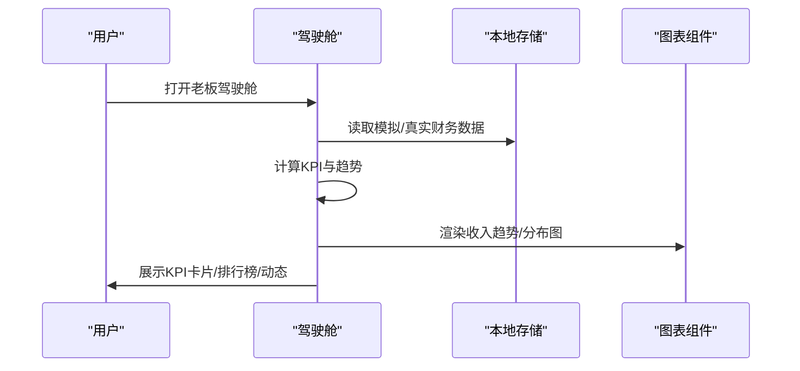

**图表来源**
- [cockpit.js:214-224](file://js/cockpit.js#L214-L224)
- [cockpit.js:277-339](file://js/cockpit.js#L277-L339)
- [cockpit.js:341-499](file://js/cockpit.js#L341-L499)
- [cockpit.js:501-622](file://js/cockpit.js#L501-L622)

**章节来源**
- [cockpit.js:1-624](file://js/cockpit.js#L1-L624)

### 多维表格（MultiTable）
- 统一的表格/看板/画廊/甘特/日历/表单视图编排层。
- 事件委托与模块协调，支持字段增删、视图切换、筛选/排序/分组、导入导出、记录详情面板、撤销/重做、全屏模式等。
- 与核心模块（MT.Core/MT.Fields/MT.Grid/MT.Views/MT.Toolbar/MT.Dashboard）解耦，便于扩展。

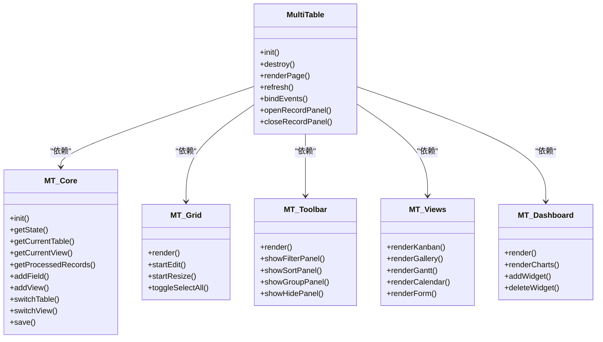

**图表来源**
- [multitable.js:7-29](file://js/multitable.js#L7-L29)
- [multitable.js:111-162](file://js/multitable.js#L111-L162)
- [multitable.js:177-308](file://js/multitable.js#L177-L308)

**章节来源**
- [multitable.js:1-624](file://js/multitable.js#L1-L624)

### 人员权限管理（SystemPermissions）
- 角色与权限
  - 超级管理员、部门经理、财务人员、业务人员、人事专员、只读用户。
  - 财务人员具备"财务管理/公司日记账/报销管理/合同管理"等关键权限。
- 成员管理
  - 支持搜索、启用/禁用、编辑角色与部门。
- 本地持久化
  - 使用 localStorage 存储角色与成员数据，首次进入自动生成种子数据。

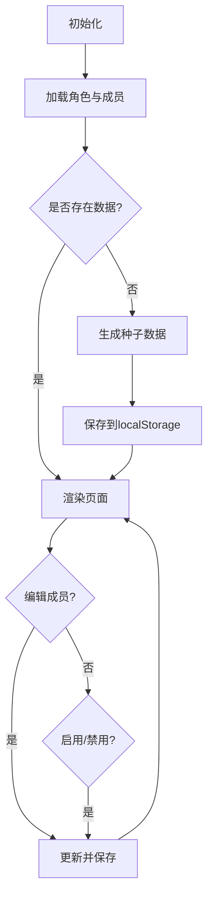

**图表来源**
- [system-permissions.js:8-31](file://js/system-permissions.js#L8-L31)
- [system-permissions.js:32-94](file://js/system-permissions.js#L32-L94)
- [system-permissions.js:193-249](file://js/system-permissions.js#L193-L249)

**章节来源**
- [system-permissions.js:1-323](file://js/system-permissions.js#L1-L323)

### 认证与云存储（Auth、CloudStorage）
- 认证
  - 支持邮箱/密码登录、注册、登出；监听 Supabase 认证状态变化；本地临时会话兜底。
- 云存储
  - 当前返回 Supabase 客户端可用性判断，云端同步逻辑预留。

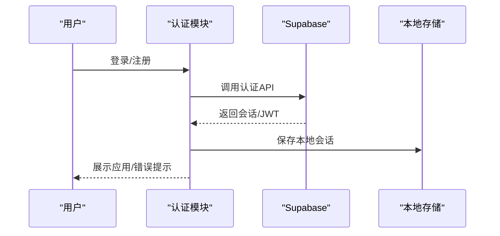

**图表来源**
- [auth.js:7-54](file://js/auth.js#L7-L54)
- [auth.js:108-198](file://js/auth.js#L108-L198)
- [cloud-storage.js:4-8](file://js/cloud-storage.js#L4-L8)

**章节来源**
- [auth.js:1-259](file://js/auth.js#L1-L259)
- [cloud-storage.js:1-9](file://js/cloud-storage.js#L1-L9)

### 数据库与数据一致性（database-setup.sql）
- 表结构
  - customers、contracts、finances、invoices。
- 索引
  - 针对 user_id、type、date、customer_id 等常用查询字段建立索引。
- 行级安全策略（RLS）
  - 所有表启用 RLS，策略限制用户仅能访问自身数据。
- 触发器
  - 更新 updated_at 字段，确保数据变更时间可追溯。

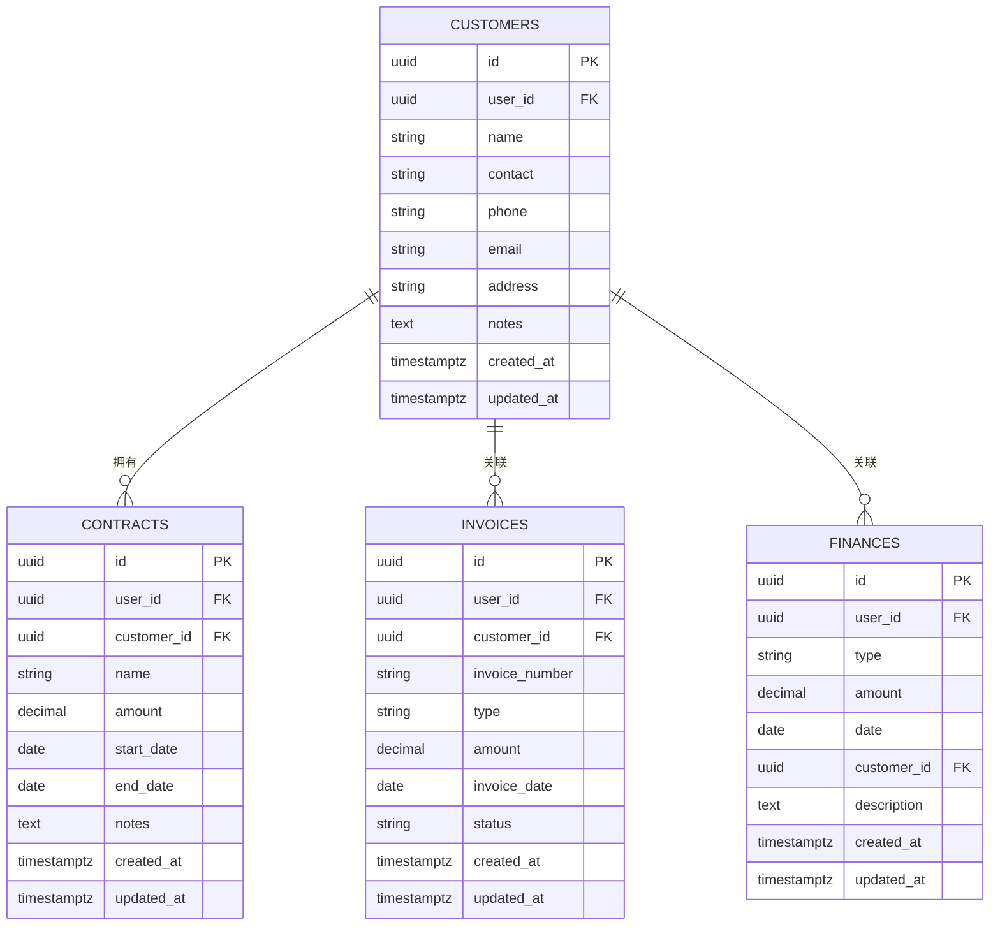

**图表来源**
- [database-setup.sql:10-63](file://database-setup.sql#L10-L63)
- [database-setup.sql:66-148](file://database-setup.sql#L66-L148)

**章节来源**
- [database-setup.sql:1-148](file://database-setup.sql#L1-L148)

## 依赖关系分析
- 模块耦合
  - app.js 作为路由编排中心，负责页面切换与销毁清理，避免跨模块直接耦合。
  - Finance 和 Orders 模块通过本地数据共享实现深度集成。
  - FinanceJournal 与 Cockpit 通过本地数据/模拟数据独立运行，减少对云端依赖。
  - MultiTable 作为通用表格编排层，依赖 MT.* 子模块，保持高内聚低耦合。
- 外部依赖
  - Supabase SDK、Chart.js、Font Awesome。
- 数据流
  - 本地工作区（localStorage）承载日记账与多维表格数据；未来可接入 Supabase 表并通过 RLS 保证数据隔离。
  - **新增** 订单管理与财务管理模块间的数据同步和状态联动。

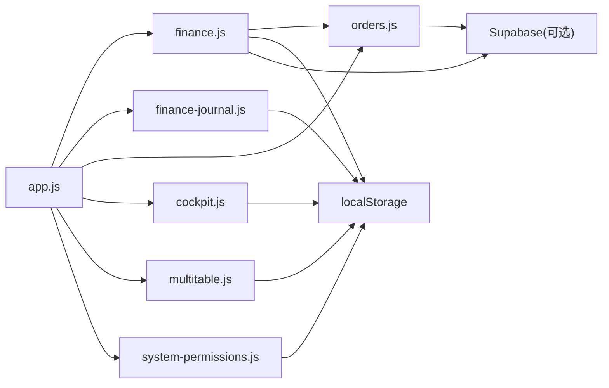

**图表来源**
- [app.js:120-144](file://js/app.js#L120-L144)
- [finance.js:169-177](file://js/finance.js#L169-L177)
- [orders.js:354-370](file://js/orders.js#L354-L370)
- [finance-journal.js:42-103](file://js/finance-journal.js#L42-L103)
- [cockpit.js:214-224](file://js/cockpit.js#L214-L224)
- [multitable.js:12-29](file://js/multitable.js#L12-L29)
- [system-permissions.js:28-31](file://js/system-permissions.js#L28-L31)

**章节来源**
- [app.js:1-156](file://js/app.js#L1-L156)
- [index.html:354-378](file://index.html#L354-L378)

## 性能考量
- 前端性能
  - 本地数据处理（过滤/排序/搜索）在内存中进行，建议控制单表记录规模；大数据量时可考虑虚拟滚动或分页。
  - 图表渲染使用 Chart.js，建议延迟渲染与防抖更新。
  - **新增** 财务模块的AI预警和对账功能可能产生较多DOM操作，建议优化渲染性能。
- 数据库性能
  - 已创建常用字段索引；建议根据实际查询场景增加复合索引。
  - RLS 策略在查询时生效，注意避免复杂 JOIN 查询导致性能下降。
- 云存储
  - 云端同步逻辑尚未实现，建议采用增量同步与冲突解决策略，结合本地缓存与批量写入提升吞吐。
- **新增** 模块间数据同步
  - 订单与财务模块间的实时数据同步需要考虑性能影响，建议采用异步更新和批量处理。

## 故障排查指南
- 登录问题
  - 检查 Supabase 凭据配置与网络连通性；确认浏览器允许第三方 Cookie；查看控制台错误信息。
- 数据不同步
  - 若使用本地工作区，请确认 localStorage 未被清理；云端版需检查 Supabase 表与 RLS 策略。
- 图表不显示
  - 确认 Chart.js 加载成功；检查容器尺寸与 DOM 就绪后再渲染。
- 权限异常
  - 检查角色权限配置与成员状态；确认当前用户是否满足模块访问要求。
- **新增** 财务模块功能异常
  - 检查localStorage中biz_finance_records和biz_orders数据是否完整。
  - 确认订单状态流转是否正确触发财务记录生成。
  - 验证AI预警规则配置是否正确。

**章节来源**
- [auth.js:50-54](file://js/auth.js#L50-L54)
- [index.html:354-378](file://index.html#L354-L378)
- [system-permissions.js:193-249](file://js/system-permissions.js#L193-L249)

## 结论
本财务模块以"财务总览"为核心，辅以"公司日记账"、"订单管理"、"老板驾驶舱"看板与"多维表格"工具，形成从订单到财务的完整闭环。通过 Supabase 的认证与 RLS，实现用户隔离与数据安全；通过角色权限管理，保障财务流程的合规与可控。**新增的独立财务管理模块提供了更专业的财务管理和分析功能，包括应收应付管理、发票管理、对账中心和风控预警等核心功能，与订单管理模块深度集成，实现了从业务订单到财务记录的自动化流转。** 建议后续补齐云端同步、凭证与账簿、预算与成本分析、银行对账与应收应付、税务与发票管理等能力，逐步实现与总账系统的集成与数据一致性保障。

## 附录

### 财务公式与计算逻辑
- 收支统计
  - 收入合计：对"类型=收入"的金额求和。
  - 支出合计：对"类型=支出"的金额求和。
  - 结余：收入合计 − 支出合计。
- 趋势对比
  - 本月 vs 上月：当月与上月对应指标差值百分比。
- 转化率
  - 转化率 = 已转化线索数 / 线索总数 × 100%。
- 净利润
  - 净利润 = 总收入 − 总支出。
- **新增** 应收账款计算
  - 应收账款 = 应收金额 - 已收金额
  - 逾期天数 = 当前日期 - 应付日期
- **新增** 客户信用评分
  - 信用分 = 100 - 逾期次数×15 + 完成订单×5（上限100）
  - 等级划分：A(≥80)、B(≥60)、C(≥40)、D(<40)

**章节来源**
- [finance-journal.js:268-301](file://js/finance-journal.js#L268-L301)
- [cockpit.js:288-302](file://js/cockpit.js#L288-L302)
- [cockpit.js:295-297](file://js/cockpit.js#L295-L297)
- [orders.js:180-214](file://js/orders.js#L180-L214)

### 数据校验规则
- 财务记录
  - 类型：仅允许 "income/expense"，或界面选择"收入/支出/转账"。
  - 金额：非负数值，保留两位小数。
  - 日期：合法日期格式。
- 发票
  - 发票号码唯一性（建议在数据库层面约束）。
  - 状态：默认"已开具"，支持"待开具/已作废"等扩展。
- 客户/合同
  - 金额非负；合同起止日期合理。
- **新增** 订单管理
  - 服务类型：bookkeeping/address/business
  - 状态：pending_payment/processing/completed/dispute/cancelled/waiting_resource/pending_approval
  - 金额唯一性校验：同一客户同类型未完成订单的唯一性检查。

**章节来源**
- [database-setup.sql:38-49](file://database-setup.sql#L38-L49)
- [database-setup.sql:51-63](file://database-setup.sql#L51-L63)
- [database-setup.sql:24-36](file://database-setup.sql#L24-L36)
- [orders.js:297-300](file://js/orders.js#L297-L300)

### 与总账系统集成与数据一致性
- 集成路径
  - 将日记账数据映射为会计凭证（摘要、借/贷方科目、金额、日期、附件）。
  - 通过云端同步将凭证写入总账系统接口或中间表，再由总账系统执行过账。
  - **新增** 订单管理与财务管理模块的数据同步，确保业务流程的完整性。
- 一致性保障
  - 使用事务与幂等写入；对重复数据进行去重与合并。
  - 引入审计字段（创建/更新用户、时间戳、来源系统）便于追踪。
  - **新增** 模块间数据一致性检查和冲突解决机制。

### 财务模块样式系统
- **新增** 专业财务样式设计
  - biz-module容器统一布局和间距
  - biz-tabs标签页导航样式
  - biz-stat-card统计卡片设计
  - ai-alert预警样式系统（warn/info/danger/success）
  - reconcile-section对账样式
  - risk-section风控样式
  - backend-badge后端功能标识
- **新增** 财务专用颜色系统
  - c-green、c-red、c-blue、c-orange等颜色类
  - 状态标签颜色区分（st-ok/st-info/st-warn/st-danger/st-purple）
  - 信用评分颜色分级（score-high/score-mid/score-low）

**章节来源**
- [biz-style.css:4-66](file://css/biz-style.css#L4-L66)
- [biz-style.css:206-221](file://css/biz-style.css#L206-L221)
- [biz-style.css:389-409](file://css/biz-style.css#L389-L409)
- [biz-style.css:1119-1181](file://css/biz-style.css#L1119-L1181)