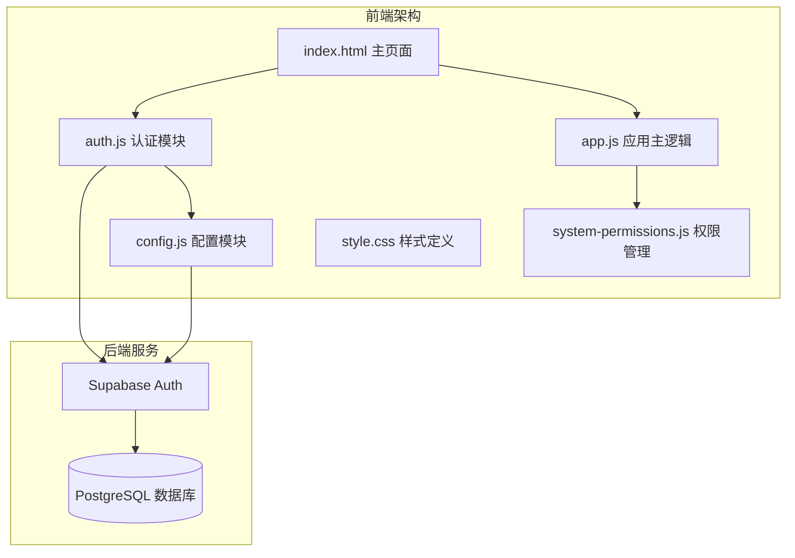
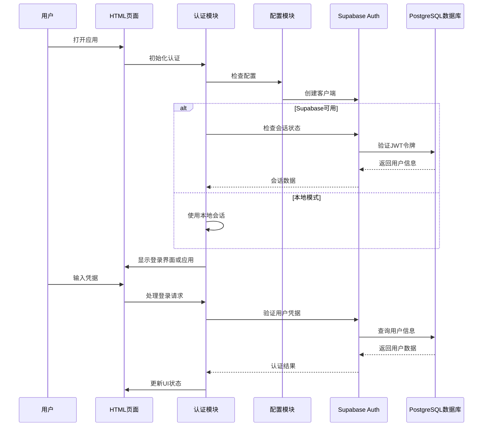
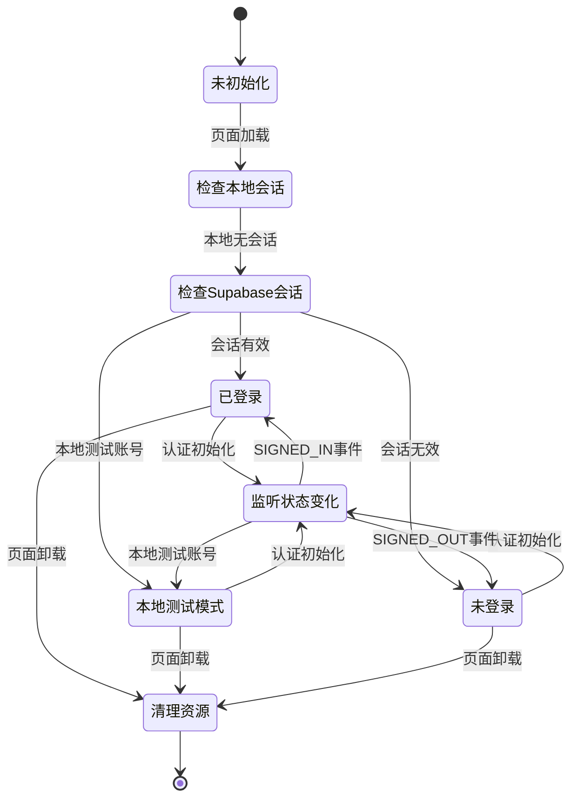
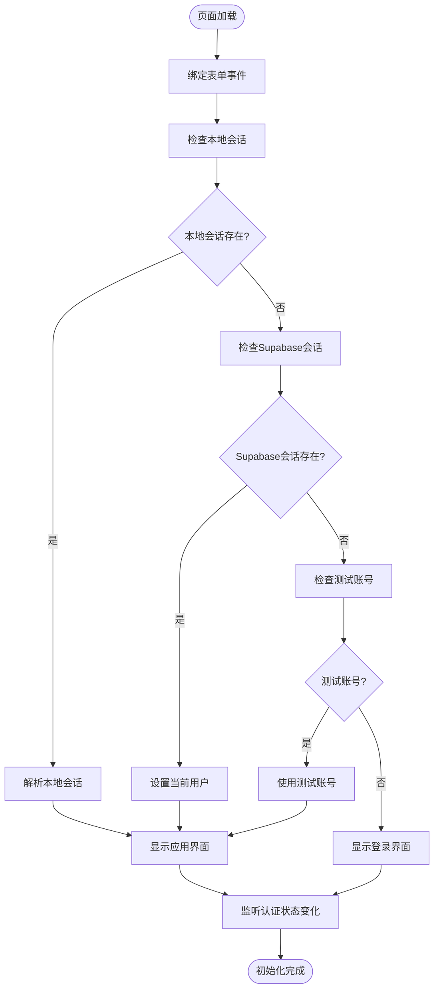
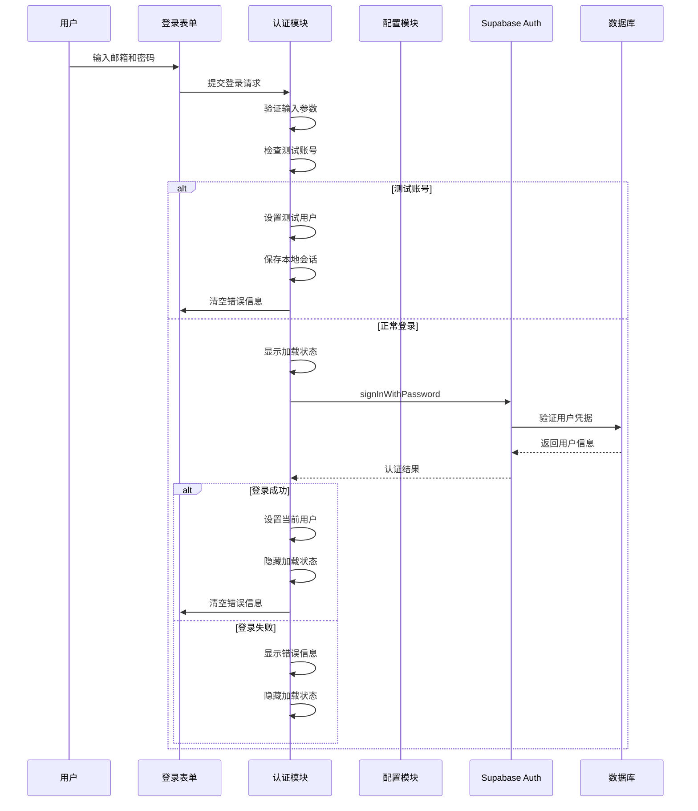
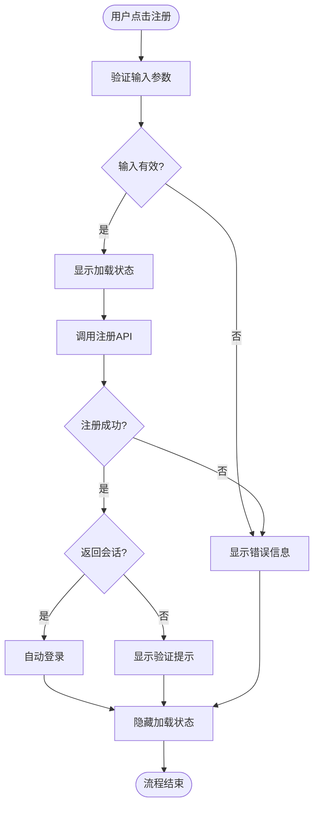
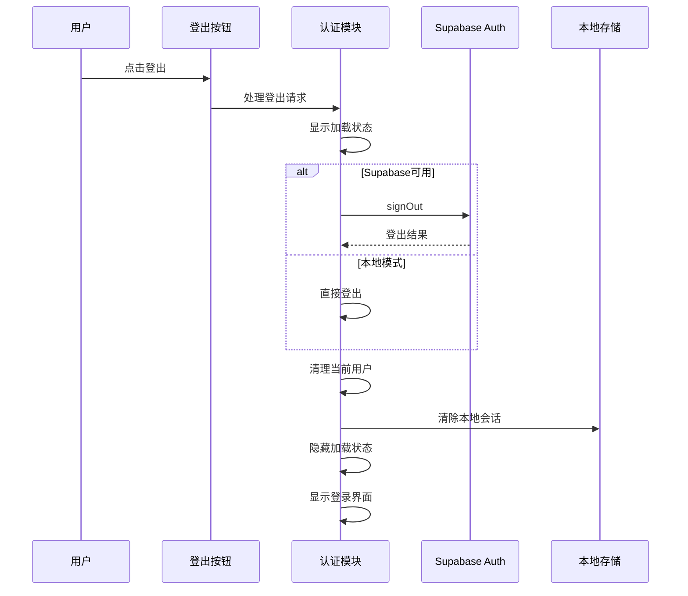
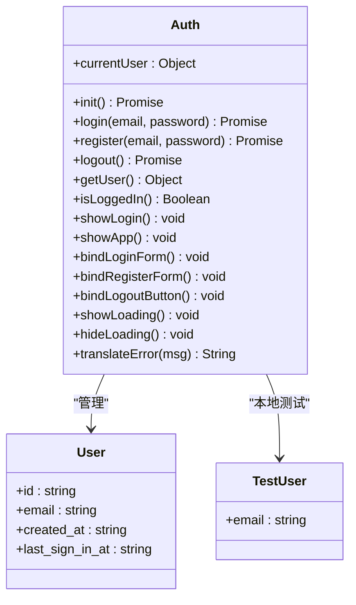

# 用户认证系统

<cite>
**本文档引用的文件**
- [auth.js](file://js/auth.js)
- [config.js](file://js/config.js)
- [app.js](file://js/app.js)
- [index.html](file://index.html)
- [system-permissions.js](file://js/system-permissions.js)
- [style.css](file://css/style.css)
</cite>

## 更新摘要
**变更内容**
- 新增本地测试模式支持，包含测试账号和本地会话管理
- 改进错误处理机制，提供中英文错误信息翻译
- 增强本地存储功能，支持会话持久化
- 优化认证初始化流程，增加降级处理机制
- 改进加载状态管理和用户体验

## 目录
1. [简介](#简介)
2. [项目结构](#项目结构)
3. [核心组件](#核心组件)
4. [架构概览](#架构概览)
5. [详细组件分析](#详细组件分析)
6. [依赖关系分析](#依赖关系分析)
7. [性能考虑](#性能考虑)
8. [故障排除指南](#故障排除指南)
9. [结论](#结论)

## 简介

浙杭企服是一个基于Supabase Auth的财务CRM管理系统，提供了完整的用户认证解决方案。该系统集成了Supabase的JWT令牌认证机制，实现了邮箱注册、登录流程和会话管理功能，同时具备自动登录和登出流程。

**更新** 系统现已支持本地测试模式，包含预设的测试账号用于开发和演示目的，同时增强了错误处理和用户体验。

系统采用前后端分离架构，前端使用纯JavaScript实现，后端通过Supabase提供认证服务和数据存储。项目支持HTTPS加密传输、PostgreSQL行级安全策略(RLS)和用户数据完全隔离。

## 项目结构

该项目采用模块化设计，主要包含以下核心文件：



**图表来源**
- [index.html:1-399](file://index.html#L1-L399)
- [auth.js:1-277](file://js/auth.js#L1-L277)
- [config.js:1-20](file://js/config.js#L1-L20)

**章节来源**
- [index.html:1-399](file://index.html#L1-L399)

## 核心组件

### 认证模块 (Auth)

认证模块是整个系统的核心，负责处理用户身份验证的所有方面：

- **初始化管理**: 检查本地会话状态和Supabase会话状态，支持本地测试模式
- **用户状态管理**: 维护当前登录用户信息，支持本地会话持久化
- **表单绑定**: 处理登录和注册表单事件，包含密码显示/隐藏功能
- **会话监听**: 监听认证状态变化并更新UI
- **错误处理**: 提供统一的错误处理机制和中英文错误翻译
- **本地测试支持**: 内置测试账号用于开发和演示

### 配置模块 (Config)

配置模块负责Supabase客户端的初始化和配置：

- **环境变量**: 管理Supabase URL和匿名密钥
- **客户端创建**: 初始化Supabase JavaScript客户端
- **降级处理**: 当SDK不可用时提供本地模式支持
- **错误恢复**: 捕获初始化异常并优雅降级

### 应用主逻辑 (App)

应用主逻辑负责应用的整体导航和页面管理：

- **路由管理**: 处理页面导航和菜单切换
- **模块加载**: 动态加载各个功能模块
- **工具函数**: 提供格式化等辅助功能
- **仪表板刷新**: 支持认证状态变化后的界面更新

**章节来源**
- [auth.js:3-277](file://js/auth.js#L3-L277)
- [config.js:7-20](file://js/config.js#L7-L20)
- [app.js:192-203](file://js/app.js#L192-L203)

## 架构概览

系统采用三层架构设计，实现了清晰的关注点分离：



**图表来源**
- [auth.js:7-54](file://js/auth.js#L7-L54)
- [config.js:8-19](file://js/config.js#L8-L19)

### JWT令牌处理

系统使用JWT令牌进行身份验证，具有以下特点：

- **令牌存储**: 通过Supabase SDK自动管理
- **自动刷新**: SDK自动处理令牌刷新
- **安全传输**: 通过HTTPS协议传输
- **会话持久化**: 支持跨页面会话保持

### 会话管理机制

会话管理采用事件驱动的方式：



**图表来源**
- [auth.js:36-53](file://js/auth.js#L36-L53)

**章节来源**
- [auth.js:24-54](file://js/auth.js#L24-L54)

## 详细组件分析

### 认证初始化流程

认证初始化过程包含多个步骤，确保系统的健壮性和用户体验：



**图表来源**
- [auth.js:7-54](file://js/auth.js#L7-L54)

### 登录流程

登录流程实现了完整的用户身份验证过程：



**图表来源**
- [auth.js:108-137](file://js/auth.js#L108-L137)
- [auth.js:119-126](file://js/auth.js#L119-L126)

### 注册流程

注册流程支持邮箱验证和自动登录：



**图表来源**
- [auth.js:154-198](file://js/auth.js#L154-L198)

### 登出流程

登出流程确保用户会话的安全清理：



**图表来源**
- [auth.js:200-220](file://js/auth.js#L200-L220)

### 认证状态监听

系统实现了完整的认证状态监听机制：

| 事件类型 | 触发条件 | 处理逻辑 |
|---------|---------|---------|
| SIGNED_IN | 用户成功登录 | 设置当前用户，显示应用界面，刷新仪表板 |
| SIGNED_OUT | 用户登出或会话失效 | 清理用户状态，显示登录界面 |
| 本地测试模式 | 使用测试账号登录 | 设置测试用户，保存本地会话 |
| 密码显示切换 | 用户点击密码显示按钮 | 切换密码输入框类型 |

**章节来源**
- [auth.js:36-48](file://js/auth.js#L36-L48)

### 用户信息获取

用户信息获取通过多种方式实现：



**图表来源**
- [auth.js:3-277](file://js/auth.js#L3-L277)

**章节来源**
- [auth.js:243-251](file://js/auth.js#L243-L251)

## 依赖关系分析

系统依赖关系清晰，模块间耦合度低：

```mermaid
graph LR
subgraph "外部依赖"
SUPABASE[Supabase SDK]
CHARTJS[Chart.js]
QRCODE[QRCode.js]
FONT_AWESOME[Font Awesome]
END
subgraph "核心模块"
AUTH[auth.js]
CONFIG[config.js]
APP[app.js]
HTML[index.html]
STYLE[style.css]
END
subgraph "功能模块"
HOME[home.js]
COCKPIT[cockpit.js]
PERMISSIONS[system-permissions.js]
STORAGE[cloud-storage.js]
END
HTML --> AUTH
HTML --> APP
HTML --> STYLE
AUTH --> CONFIG
AUTH --> SUPABASE
APP --> HOME
APP --> COCKPIT
APP --> PERMISSIONS
APP --> STORAGE
HTML --> CHARTJS
HTML --> QRCODE
HTML --> FONT_AWESOME
```

**图表来源**
- [index.html:13-14](file://index.html#L13-L14)
- [auth.js:1-277](file://js/auth.js#L1-L277)

### 外部依赖

系统使用的主要外部依赖：

- **Supabase SDK**: 提供认证和数据库访问功能
- **Chart.js**: 用于数据可视化和图表展示
- **QRCode.js**: 用于二维码生成
- **Font Awesome**: 提供图标字体支持

### 内部模块依赖

模块间的依赖关系：

- `auth.js` 依赖 `config.js` 提供Supabase配置
- `auth.js` 依赖 `app.js` 的仪表板刷新功能
- `app.js` 依赖 `auth.js` 获取用户状态
- 各功能模块依赖 `app.js` 的导航和页面管理

**章节来源**
- [index.html:13-14](file://index.html#L13-L14)
- [auth.js:1-277](file://js/auth.js#L1-L277)

## 性能考虑

### 会话优化

系统采用了多项性能优化措施：

- **本地会话缓存**: 减少不必要的服务器请求
- **懒加载模块**: 功能模块按需加载，减少初始加载时间
- **事件委托**: 使用事件委托减少DOM事件监听器数量
- **本地测试模式**: 避免网络请求，提升开发效率

### 错误处理优化

错误处理机制包括：

- **统一错误界面**: 所有错误通过统一的错误消息显示
- **中英文错误翻译**: 提供双语错误信息
- **重试机制**: 对网络请求失败提供重试选项
- **降级处理**: 当Supabase不可用时提供本地模式

### 安全性考虑

系统实现了多层次的安全保护：

- **HTTPS强制**: 所有通信通过HTTPS加密
- **行级安全策略**: PostgreSQL RLS确保数据隔离
- **令牌管理**: 自动令牌刷新和过期处理
- **输入验证**: 前端和后端双重验证
- **本地测试隔离**: 测试账号与生产环境完全隔离

## 故障排除指南

### 常见问题及解决方案

| 问题类型 | 症状 | 解决方案 |
|---------|------|---------|
| 认证失败 | 登录后立即被重定向到登录页 | 检查Supabase配置和网络连接 |
| 会话丢失 | 刷新页面后需要重新登录 | 检查浏览器Cookie设置和本地存储 |
| 注册失败 | 注册后无响应 | 验证邮箱验证设置和数据库连接 |
| 数据访问错误 | 查看数据时报权限错误 | 检查RLS策略和用户权限 |
| 本地模式异常 | 使用测试账号时功能受限 | 确认测试账号配置和本地存储 |
| 加载状态问题 | 登录时无加载反馈 | 检查样式文件和JavaScript错误 |

### 调试技巧

1. **浏览器开发者工具**: 使用Network面板检查API请求
2. **控制台日志**: 查看认证相关的JavaScript错误
3. **Supabase仪表板**: 监控认证日志和用户活动
4. **本地存储检查**: 验证localStorage中的会话数据
5. **测试账号验证**: 确认测试账号的正确性

### 性能监控

建议监控的关键指标：

- **认证响应时间**: 登录和注册请求的平均响应时间
- **会话持续时间**: 用户平均在线时长
- **错误率**: 认证相关API的错误百分比
- **并发用户数**: 同时在线用户的数量
- **本地模式使用率**: 测试账号登录的比例

**章节来源**
- [auth.js:50-53](file://js/auth.js#L50-L53)

## 结论

浙杭企服的用户认证系统是一个功能完整、安全可靠的解决方案。系统基于Supabase Auth构建，实现了现代Web应用所需的认证功能。

**更新** 系统现已支持本地测试模式，包含预设的测试账号用于开发和演示目的，显著提升了开发体验和调试效率。

### 主要优势

1. **安全性**: 采用JWT令牌认证和PostgreSQL RLS策略
2. **易用性**: 简洁的API接口和完善的错误处理
3. **可扩展性**: 模块化设计支持功能扩展
4. **可靠性**: 完善的会话管理和错误恢复机制
5. **开发友好**: 内置测试模式支持快速开发和演示

### 技术亮点

- **事件驱动架构**: 基于Supabase的认证状态监听
- **自动会话管理**: 无需手动处理令牌刷新
- **本地存储支持**: 提供本地模式降级选项
- **响应式设计**: 适配各种设备和屏幕尺寸
- **中英文国际化**: 支持双语错误信息显示
- **密码可见性**: 提供密码显示/隐藏功能

### 后续改进方向

1. **权限系统完善**: 基于system-permissions.js实现细粒度权限控制
2. **多因素认证**: 添加TOTP或短信验证码支持
3. **会话超时**: 实现自动登出和会话超时处理
4. **审计日志**: 记录用户认证和操作日志
5. **测试环境分离**: 进一步隔离测试和生产环境

该认证系统为财务CRM管理系统的安全运行奠定了坚实基础，为后续的功能扩展提供了良好的技术支撑。新增的本地测试模式特别适合开发团队使用，大大提升了开发效率和用户体验。