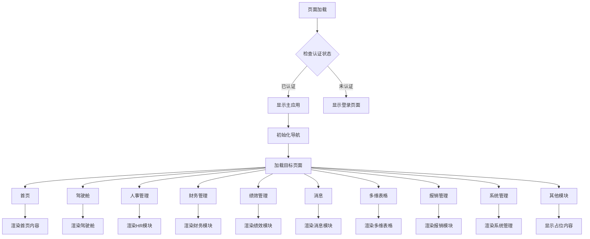
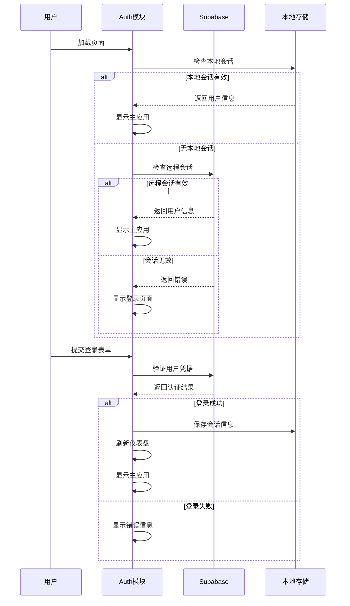
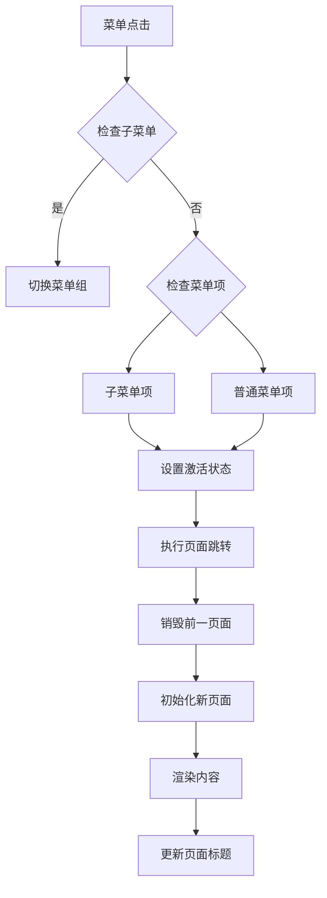
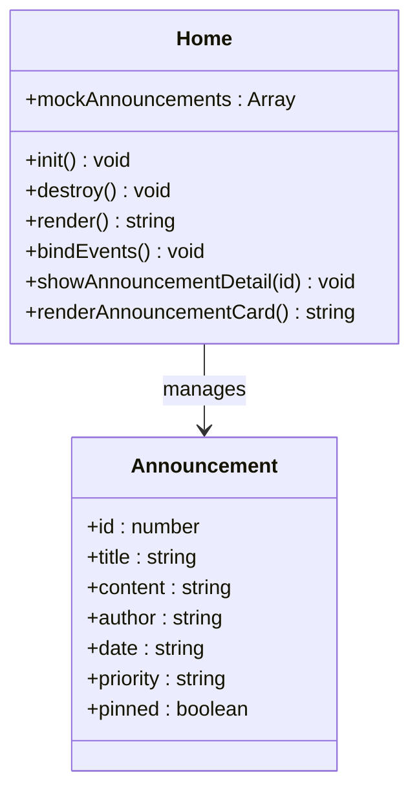
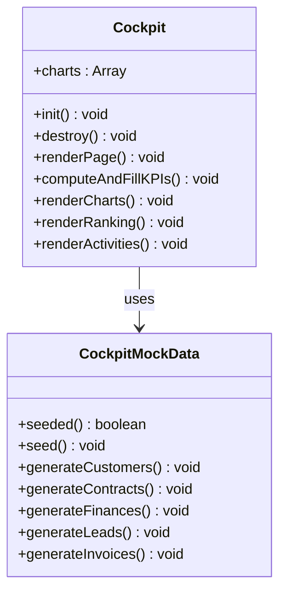
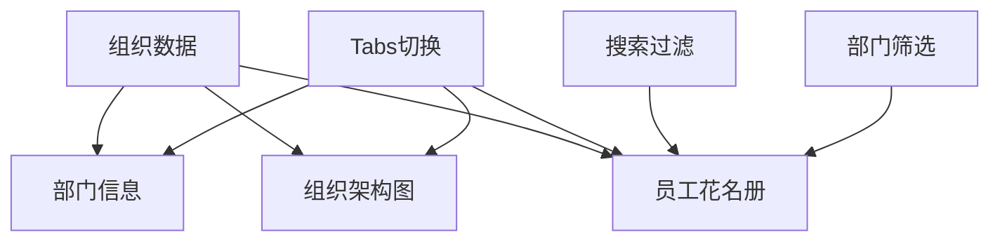
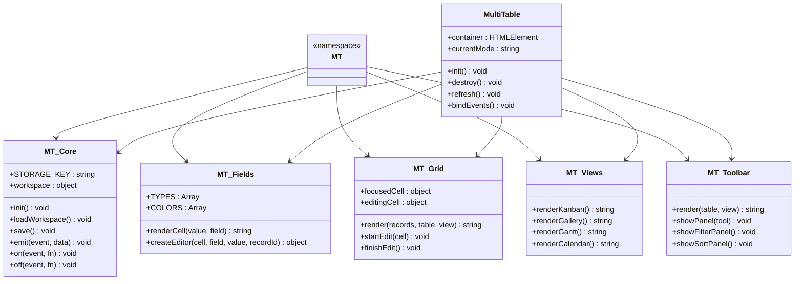
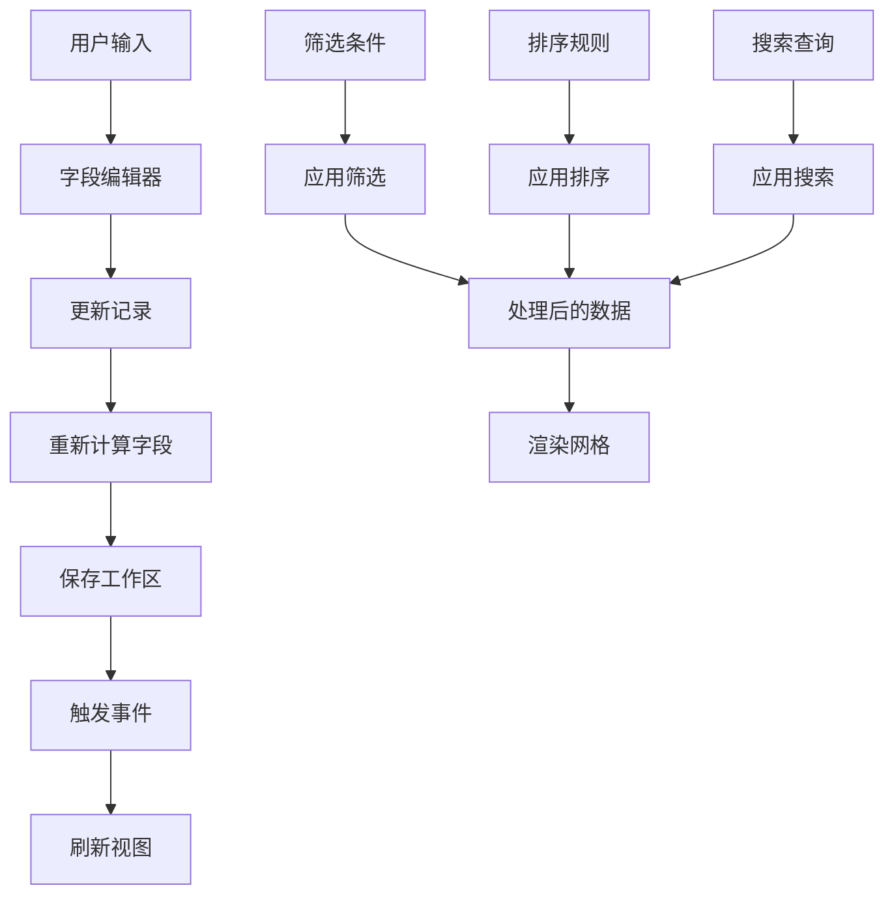
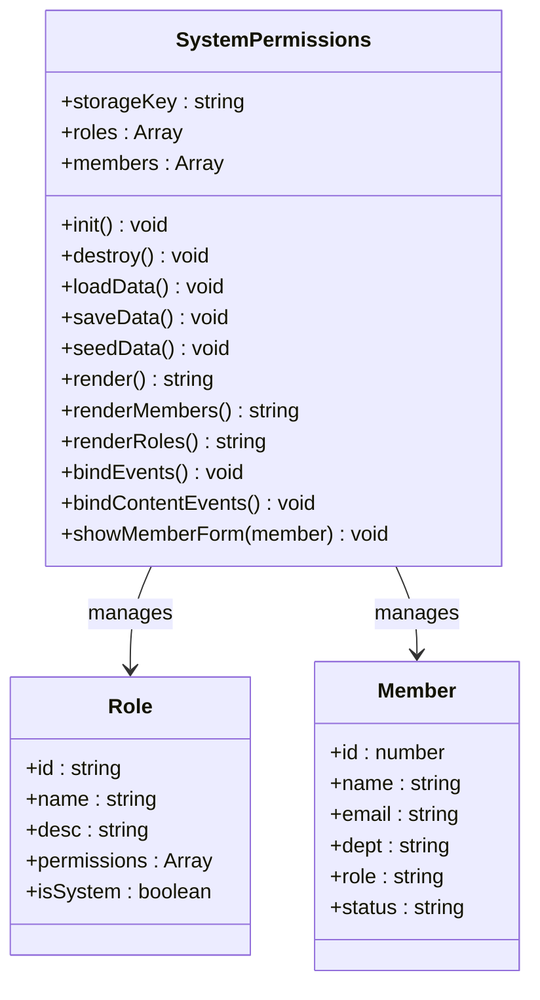

# 前端架构设计

<cite>
**本文档引用的文件**
- [index.html](file://index.html)
- [app.js](file://js/app.js)
- [auth.js](file://js/auth.js)
- [config.js](file://js/config.js)
- [home.js](file://js/home.js)
- [cockpit.js](file://js/cockpit.js)
- [hr-org.js](file://js/hr-org.js)
- [multitable.js](file://js/multitable.js)
- [system-permissions.js](file://js/system-permissions.js)
- [mt-core.js](file://js/mt-core.js)
- [mt-fields.js](file://js/mt-fields.js)
- [mt-grid.js](file://js/mt-grid.js)
- [mt-views.js](file://js/mt-views.js)
- [mt-toolbar.js](file://js/mt-toolbar.js)
- [style.css](file://css/style.css)
</cite>

## 更新摘要
**所做更改**
- 更新了主应用容器结构和模块集成优化
- 新增了系统管理模块和权限管理功能
- 扩展了多维表格系统的功能架构
- 优化了模块依赖关系和加载顺序
- 增强了响应式设计和用户体验

## 目录
1. [简介](#简介)
2. [项目结构](#项目结构)
3. [核心组件](#核心组件)
4. [架构概览](#架构概览)
5. [详细组件分析](#详细组件分析)
6. [依赖分析](#依赖分析)
7. [性能考虑](#性能考虑)
8. [故障排除指南](#故障排除指南)
9. [结论](#结论)

## 简介

浙杭企服是一个基于HTML5、CSS3、JavaScript的单页应用(SPA)，采用模块化架构设计。该系统实现了完整的前端SPA架构，包括模块化加载机制、事件驱动架构和MVC思想实现。系统集成了认证模块、业务模块和工具模块，提供了响应式设计和良好的浏览器兼容性。

**更新** 本次更新主要增强了系统管理功能，优化了主应用容器结构，并扩展了多维表格系统的模块集成能力。

## 项目结构

项目采用清晰的文件组织结构，按照功能模块进行分离：

```mermaid
graph TB
subgraph "根目录"
HTML[index.html]
CSS[css/]
JS[js/]
end
subgraph "CSS样式"
STYLE[style.css]
MT_STYLE[mt-style.css]
HR_STYLE[hr-style.css]
END
subgraph "JavaScript模块"
CONFIG[config.js]
AUTH[auth.js]
APP[app.js]
subgraph "业务模块"
HOME[home.js]
COCKPIT[cockpit.js]
HR_ORG[hr-org.js]
END
subgraph "多维表格模块"
MT_CORE[mt-core.js]
MT_FIELDS[mt-fields.js]
MT_GRID[mt-grid.js]
MT_VIEWS[mt-views.js]
MT_TOOLBAR[mt-toolbar.js]
MULTITABLE[multitable.js]
END
subgraph "系统管理模块"
SYSTEM_PERMISSIONS[system-permissions.js]
END
END
```

**图表来源**
- [index.html:1-399](file://index.html#L1-L399)
- [config.js:1-20](file://js/config.js#L1-L20)

**章节来源**
- [index.html:1-399](file://index.html#L1-L399)
- [style.css:1-200](file://css/style.css#L1-L200)

## 核心组件

### 应用容器结构

系统采用双容器设计模式：

1. **登录页面容器** (`#login-page`)
   - 独立的登录界面
   - 支持本地测试账号和Supabase认证
   - 响应式设计适配不同屏幕尺寸

2. **主应用容器** (`.app-container`)
   - 顶部导航栏
   - 左侧菜单栏
   - 右侧内容区域
   - 支持主题切换和用户信息显示

**更新** 主应用容器现在包含了更完整的菜单结构，包括系统管理模块和权限管理功能。

### 路由机制

系统实现了基于页面标识的简单路由机制：



**图表来源**
- [app.js:85-135](file://js/app.js#L85-L135)
- [auth.js:7-54](file://js/auth.js#L7-L54)

### 组件通信模式

系统采用事件驱动和回调机制实现组件间通信：

1. **事件总线模式**
   - MT.Core模块提供事件监听机制
   - 支持自定义事件和数据变更通知
   - 实现松耦合的模块通信

2. **回调函数模式**
   - 页面切换通过回调函数处理
   - 模块销毁和初始化的生命周期管理
   - 组件间的参数传递和状态共享

**章节来源**
- [app.js:1-203](file://js/app.js#L1-L203)
- [auth.js:1-277](file://js/auth.js#L1-L277)

## 架构概览

系统采用分层架构设计，实现了清晰的关注点分离：

```mermaid
graph TB
subgraph "表现层"
NAV[导航栏]
MENU[左侧菜单]
CONTENT[内容区域]
END
subgraph "业务逻辑层"
AUTH[认证模块]
ROUTER[路由控制]
MODULES[业务模块]
END
subgraph "数据访问层"
CORE[核心数据模块]
STORAGE[本地存储]
API[Supabase API]
END
subgraph "工具层"
UTILS[工具函数]
VALIDATION[验证器]
FORMATTER[格式化器]
END
NAV --> ROUTER
MENU --> ROUTER
CONTENT --> MODULES
ROUTER --> AUTH
MODULES --> CORE
CORE --> STORAGE
CORE --> API
MODULES --> UTILS
UTILS --> VALIDATION
UTILS --> FORMATTER
```

**图表来源**
- [app.js:33-135](file://js/app.js#L33-L135)
- [mt-core.js:8-33](file://js/mt-core.js#L8-L33)

## 详细组件分析

### 认证模块 (Auth)

认证模块实现了完整的用户身份验证流程：



**图表来源**
- [auth.js:6-54](file://js/auth.js#L6-L54)
- [auth.js:108-137](file://js/auth.js#L108-L137)

#### 认证流程特点

1. **多源认证支持**
   - Supabase云认证
   - 本地测试账号支持
   - 自动会话恢复

2. **安全机制**
   - 密码显示/隐藏切换
   - 加载状态指示
   - 错误处理和提示

**章节来源**
- [auth.js:1-277](file://js/auth.js#L1-L277)

### 主应用控制器 (App)

主应用控制器负责整个应用的协调和页面路由：

#### 页面路由实现



**图表来源**
- [app.js:50-83](file://js/app.js#L50-L83)
- [app.js:85-135](file://js/app.js#L85-L135)

#### 生命周期管理

系统实现了完整的页面生命周期管理：

1. **页面销毁**
   - 驱动舱模块销毁
   - 线索管理模块销毁
   - 财务日记账模块销毁
   - 多维表格模块销毁
   - 人事绩效模块销毁
   - 人事培训模块销毁
   - 人事规划模块销毁

2. **页面初始化**
   - 首页模块初始化
   - 驱动舱模块初始化
   - 人事管理模块初始化
   - 财务管理模块初始化
   - 绩效管理模块初始化
   - 消息模块初始化
   - 多维表格模块初始化
   - 系统权限管理模块初始化

**章节来源**
- [app.js:1-203](file://js/app.js#L1-L203)

### 业务模块

#### 首页模块 (Home)

首页模块实现了动态内容展示和快捷入口功能：



**图表来源**
- [home.js:8-91](file://js/home.js#L8-L91)
- [home.js:10-83](file://js/home.js#L10-L83)

#### 驱动舱模块 (Cockpit)

驱动舱模块提供了数据可视化和业务指标展示：



**图表来源**
- [cockpit.js:214-229](file://js/cockpit.js#L214-L229)
- [cockpit.js:10-211](file://js/cockpit.js#L10-L211)

#### 人事组织模块 (HR Org)

人事组织模块实现了组织架构图和员工信息管理：



**图表来源**
- [hr-org.js:135-170](file://js/hr-org.js#L135-L170)
- [hr-org.js:246-262](file://js/hr-org.js#L246-L262)

**章节来源**
- [home.js:1-266](file://js/home.js#L1-L266)
- [cockpit.js:1-624](file://js/cockpit.js#L1-L624)
- [hr-org.js:1-372](file://js/hr-org.js#L1-L372)

### 多维表格系统

多维表格系统是整个应用的核心数据管理模块，采用了高度模块化的架构设计：



**图表来源**
- [mt-core.js:6-17](file://js/mt-core.js#L6-L17)
- [mt-fields.js:5-30](file://js/mt-fields.js#L5-L30)
- [mt-grid.js:6-12](file://js/mt-grid.js#L6-L12)
- [mt-views.js:5-6](file://js/mt-views.js#L5-L6)
- [mt-toolbar.js:6-8](file://js/mt-toolbar.js#L6-L8)
- [multitable.js:7-11](file://js/multitable.js#L7-L11)

#### 数据流管理

多维表格系统实现了复杂的数据流管理机制：



**图表来源**
- [mt-core.js:255-267](file://js/mt-core.js#L255-L267)
- [mt-core.js:395-403](file://js/mt-core.js#L395-L403)
- [mt-grid.js:161-200](file://js/mt-grid.js#L161-L200)

#### 视图系统

系统支持多种数据视图模式：

1. **网格视图** (Grid View)
   - 标准表格展示
   - 支持分组和冻结列
   - 条件着色功能

2. **看板视图** (Kanban View)
   - 瀑布流程管理
   - 拖拽操作支持
   - 自定义列配置

3. **画廊视图** (Gallery View)
   - 图片和媒体展示
   - 响应式布局
   - 自定义封面字段

4. **甘特图视图** (Gantt View)
   - 项目时间管理
   - 进度跟踪
   - 缩放和平移

5. **日历视图** (Calendar View)
   - 日期事件展示
   - 周/月视图切换
   - 事件详情弹窗

**章节来源**
- [mt-core.js:1-859](file://js/mt-core.js#L1-L859)
- [mt-fields.js:1-632](file://js/mt-fields.js#L1-L632)
- [mt-grid.js:1-358](file://js/mt-grid.js#L1-L358)
- [mt-views.js:1-379](file://js/mt-views.js#L1-L379)
- [mt-toolbar.js:1-394](file://js/mt-toolbar.js#L1-L394)
- [multitable.js:1-624](file://js/multitable.js#L1-L624)

### 系统管理模块

#### 权限管理模块 (System Permissions)

系统管理模块提供了完整的权限管理和用户管理功能：



**图表来源**
- [system-permissions.js:3-323](file://js/system-permissions.js#L3-L323)

**章节来源**
- [system-permissions.js:1-323](file://js/system-permissions.js#L1-L323)

## 依赖分析

### 模块依赖关系

```mermaid
graph TB
subgraph "核心依赖"
JQUERY[jQuery 3.x]
CHARTJS[Chart.js 4.x]
SUPABASE[Supabase SDK]
END
subgraph "认证模块"
AUTH_JS[auth.js]
END
subgraph "业务模块"
HOME_JS[home.js]
COCKPIT_JS[cockpit.js]
HR_ORG_JS[hr-org.js]
END
subgraph "多维表格模块"
MT_CORE_JS[mt-core.js]
MT_FIELDS_JS[mt-fields.js]
MT_GRID_JS[mt-grid.js]
MT_VIEWS_JS[mt-views.js]
MT_TOOLBAR_JS[mt-toolbar.js]
MULTITABLE_JS[multitable.js]
END
subgraph "系统管理模块"
SYSTEM_PERMISSIONS_JS[system-permissions.js]
END
AUTH_JS --> SUPABASE
COCKPIT_JS --> CHARTJS
MT_CORE_JS --> JQUERY
MT_FIELDS_JS --> MT_CORE_JS
MT_GRID_JS --> MT_FIELDS_JS
MT_VIEWS_JS --> MT_FIELDS_JS
MT_TOOLBAR_JS --> MT_FIELDS_JS
MULTITABLE_JS --> MT_CORE_JS
MULTITABLE_JS --> MT_FIELDS_JS
MULTITABLE_JS --> MT_GRID_JS
MULTITABLE_JS --> MT_VIEWS_JS
MULTITABLE_JS --> MT_TOOLBAR_JS
SYSTEM_PERMISSIONS_JS --> MT_CORE_JS
```

**图表来源**
- [index.html:12-399](file://index.html#L12-L399)
- [multitable.js:1-5](file://js/multitable.js#L1-L5)

### 加载顺序分析

系统采用精心设计的脚本加载顺序：

1. **配置阶段**
   - `config.js` - Supabase配置
   - `auth.js` - 认证模块

2. **基础模块**
   - `cloud-storage.js` - 云存储
   - `home.js` - 首页模块

3. **业务模块**
   - `cockpit.js` - 驱动舱
   - `leads.js` - 线索管理
   - `messages.js` - 消息模块

4. **HR模块**
   - `hr-org.js` - 组织架构
   - `hr-employee.js` - 员工管理
   - `hr-recruit.js` - 招聘管理
   - `hr-attendance.js` - 考勤管理
   - `hr-salary.js` - 薪酬管理
   - `hr-lifecycle.js` - 人事流程
   - `hr-performance.js` - 绩效考核
   - `hr-training.js` - 培训发展
   - `hr-planning.js` - 人力规划

5. **财务模块**
   - `finance-journal.js` - 公司日记账

6. **多维表格模块** (按依赖顺序)
   - `mt-core.js` - 核心数据层
   - `mt-fields.js` - 字段渲染器
   - `mt-grid.js` - 网格视图
   - `mt-views.js` - 视图系统
   - `mt-toolbar.js` - 工具栏
   - `mt-dashboard.js` - 仪表盘
   - `multitable.js` - 主编排层

7. **系统管理模块**
   - `system-permissions.js` - 权限管理

**章节来源**
- [index.html:364-399](file://index.html#L364-L399)

## 性能考虑

### 响应式设计实现

系统采用了多层次的响应式设计策略：

1. **CSS媒体查询**
   ```css
   @media screen and (max-width: 768px) {
       .side-menu {
           width: 60px;
           padding: 8px;
       }
       .side-menu-title {
           display: none;
       }
       .submenu-arrow {
           display: none;
       }
   }
   ```

2. **Flexbox布局**
   - 主容器使用flex布局实现自适应
   - 内容区域支持滚动
   - 菜单栏支持垂直滚动

3. **移动端优化**
   - 触摸友好的按钮尺寸
   - 响应式字体大小
   - 移动端导航手势支持

### 浏览器兼容性

系统支持现代浏览器和IE11+：

1. **JavaScript兼容性**
   - 使用ES5语法确保兼容性
   - Polyfill支持Promise和fetch API
   - 事件委托替代现代事件API

2. **CSS兼容性**
   - Autoprefixer自动添加厂商前缀
   - 渐进增强策略
   - 降级方案支持

3. **特性检测**
   - 功能检测而非浏览器检测
   - 动态加载polyfill
   - 渐进式功能启用

### 性能优化策略

1. **懒加载机制**
   - 模块按需加载
   - 图片延迟加载
   - 组件延迟初始化

2. **内存管理**
   - 页面切换时销毁实例
   - 事件监听器清理
   - 定时器清理

3. **缓存策略**
   - 本地存储缓存
   - 浏览器缓存利用
   - CDN资源加速

## 故障排除指南

### 常见问题诊断

#### 认证相关问题

1. **登录失败**
   - 检查网络连接
   - 验证Supabase配置
   - 查看浏览器控制台错误

2. **会话过期**
   - 检查localStorage存储
   - 验证服务器时间同步
   - 查看认证状态变化事件

#### 数据加载问题

1. **页面空白**
   - 检查模块依赖加载
   - 验证数据格式
   - 查看控制台异常

2. **数据不更新**
   - 检查事件监听器
   - 验证数据持久化
   - 查看存储空间限制

#### 性能问题

1. **页面卡顿**
   - 检查大数据量处理
   - 优化DOM操作
   - 减少重绘重排

2. **内存泄漏**
   - 检查事件监听器清理
   - 验证定时器清理
   - 查看对象引用

**章节来源**
- [auth.js:50-54](file://js/auth.js#L50-L54)
- [mt-core.js:51-69](file://js/mt-core.js#L51-L69)

## 结论

浙杭企服前端架构展现了现代SPA应用的最佳实践。系统通过模块化设计实现了清晰的关注点分离，通过事件驱动架构实现了松耦合的组件通信，通过MVC思想实现了数据与视图的有效分离。

**更新** 本次更新进一步增强了系统的扩展性和模块集成能力，特别是在系统管理模块和多维表格系统的优化方面。新增的权限管理功能为类似的企业级应用提供了完整的用户权限解决方案。

### 架构优势

1. **模块化设计**
   - 清晰的功能边界
   - 独立的测试能力
   - 易于维护和扩展

2. **事件驱动架构**
   - 松耦合的组件通信
   - 异步处理机制
   - 可扩展的事件系统

3. **MVC实现**
   - 数据模型独立
   - 视图层解耦
   - 控制器集中管理

### 技术亮点

1. **多维表格系统**
   - 高度模块化的架构
   - 丰富的视图类型
   - 强大的数据处理能力

2. **系统管理功能**
   - 完整的权限管理体系
   - 用户角色管理
   - 细粒度的权限控制

3. **响应式设计**
   - 移动端友好
   - 自适应布局
   - 触摸交互优化

4. **性能优化**
   - 懒加载机制
   - 内存管理策略
   - 缓存优化

该架构为类似的企业级应用提供了优秀的参考模板，展示了如何在保持代码质量的同时实现复杂业务功能的模块化管理。